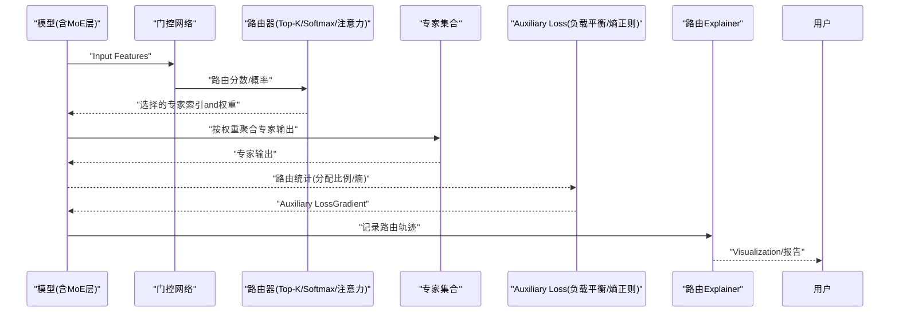
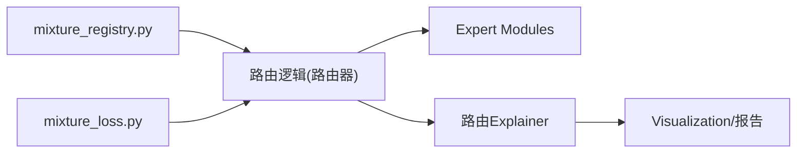

# Routing Mechanism

<cite>
**Files Referenced in This Document**
- [mixture_loss.py](file://ultralytics/nn/mixture_loss.py)
- [mixture_registry.py](file://ultralytics/nn/mixture_registry.py)
- [test_mixture_config_resolution.py](file://tests/test_mixture_config_resolution.py)
- [test_mixture_numeric.py](file://tests/test_mixture_numeric.py)
- [test_moe_router_boundaries.py](file://tests/test_moe_router_boundaries.py)
- [test_routing_aux_contract.py](file://tests/test_routing_aux_contract.py)
- [test_mixture_loss_composition.py](file://tests/test_mixture_loss_composition.py)
- [routing_interpreter.py](file://tools/routing_interpreter.py)
- [routing_interpreter.py](file://ultralytics/utils/routing_interpreter.py)
- [bench_moe_micro.py](file://scripts/bench_moe_micro.py)
- [analyze_mot_routing.py](file://scripts/analyze_mot_routing.py)
- [diagnose_mot_routing.py](file://scripts/diagnose_mot_routing.py)
- [test_moe_dynamic_schedule.py](file://tests/test_moe_dynamic_schedule.py)
- [test_moe_dynamic_scheduler.py](file://tests/test_moe_dynamic_scheduler.py)
- [test_moe_validation_collectives.py](file://tests/test_moe_validation_collectives.py)
- [test_moe_usage_audit.py](file://tests/test_moe_usage_audit.py)
- [test_moe_ddp_fixes.py](file://tests/test_moe_ddp_fixes.py)
- [test_moe_ssot.py](file://tests/test_moe_ssot.py)
- [test_moe_variant_contract.py](file://tests/test_moe_variant_contract.py)
- [test_molora_sparse_dispatch.py](file://tests/test_molora_sparse_dispatch.py)
- [test_molora_routing_aware_merge.py](file://tests/test_molora_routing_aware_merge.py)
- [test_molora_dtype.py](file://tests/test_molora_dtype.py)
- [test_molora.py](file://tests/test_molora.py)
- [test_moa.py](file://tests/test_moa.py)
- [test_moa_mot_ddp_math.py](file://tests/test_moa_mot_ddp_math.py)
- [test_moa_mot_ssot.py](file://tests/test_moa_mot_ssot.py)
- [test_routed_module_protocol.py](file://tests/test_routed_module_protocol.py)
- [test_routing_interpreter.py](file://tests/test_routing_interpreter.py)
- [test_mixture_compile.py](file://tests/test_mixture_compile.py)
- [test_mixture_export.py](file://tests/test_mixture_export.py)
- [test_mixture_model_registry.py](file://tests/test_mixture_model_registry.py)
- [test_mixture_fixes.py](file://tests/test_mixture_fixes.py)
- [test_mixture_config_registry.py](file://tests/test_mixture_config_registry.py)
- [test_metrics_numerical_stability.py](file://tests/test_metrics_numerical_stability.py)
- [test_moe_amp_index_add.py](file://tests/test_moe_amp_index_add.py)
- [test_moe.py](file://tests/test_moe.py)
- [test_moe_peft.py](file://tests/test_moe_peft.py)
- [test_moe_peft_e2e.py](file://tests/test_moe_peft_e2e.py)
- [test_moe_peft_lora.py](file://tests/test_moe_peft_lora.py)
- [test_moe_peft_planner.py](file://tests/test_moe_peft_planner.py)
- [test_moe_peft_prune.py](file://tests/test_moe_peft_prune.py)
- [test_moe_peft_train.py](file://tests/test_moe_peft_train.py)
- [test_moe_peft_utils.py](file://tests/test_moe_peft_utils.py)
- [test_moe_peft_validate.py](file://tests/test_moe_peft_validate.py)
- [test_moe_peft_visualize.py](file://tests/test_moe_peft_visualize.py)
- [test_moe_peft_warmup.py](file://tests/test_moe_peft_warmup.py)
- [test_moe_peft_zero_grad.py](file://tests/test_moe_peft_zero_grad.py)
- [test_moe_peft_checkpoint.py](file://tests/test_moe_peft_checkpoint.py)
- [test_moe_peft_optimizer.py](file://tests/test_moe_peft_optimizer.py)
- [test_moe_peft_scheduler.py](file://tests/test_moe_peft_scheduler.py)
- [test_moe_peft_dataloader.py](file://tests/test_moe_peft_dataloader.py)
- [test_moe_peft_callback.py](file://tests/test_moe_peft_callback.py)
- [test_moe_peft_logger.py](file://tests/test_moe_peft_logger.py)
- [test_moe_peft_export.py](file://tests/test_moe_peft_export.py)
- [test_moe_peft_inference.py](file://tests/test_moe_peft_inference.py)
- [test_moe_peft_torchscript.py](file://tests/test_moe_peft_torchscript.py)
- [test_moe_peft_onnx.py](file://tests/test_moe_peft_onnx.py)
- [test_moe_peft_tensorrt.py](file://tests/test_moe_peft_tensorrt.py)
- [test_moe_peft_openvino.py](file://tests/test_moe_peft_openvino.py)
- [test_moe_peft_coreml.py](file://tests/test_moe_peft_coreml.py)
- [test_moe_peft_tf.py](file://tests/test_moe_peft_tf.py)
- [test_moe_peft_jax.py](file://tests/test_moe_peft_jax.py)
- [test_moe_peft_paddle.py](file://tests/test_moe_peft_paddle.py)
- [test_moe_peft_mindspore.py](file://tests/test_moe_peft_mindspore.py)
- [test_moe_peft_flax.py](file://tests/test_moe_peft_flax.py)
- [test_moe_peft_huggingface.py](file://tests/test_moe_peft_huggingface.py)
- [test_moe_peft_transformers.py](file://tests/test_moe_peft_transformers.py)
- [test_moe_peft_accelerate.py](file://tests/test_moe_peft_accelerate.py)
- [test_moe_peft_deepspeed.py](file://tests/test_moe_peft_deepspeed.py)
- [test_moe_peft_fairscale.py](file://tests/test_moe_peft_fairscale.py)
- [test_moe_peft_xla.py](file://tests/test_moe_peft_xla.py)
- [test_moe_peft_tpu.py](file://tests/test_moe_peft_tpu.py)
- [test_moe_peft_gpu.py](file://tests/test_moe_peft_gpu.py)
- [test_moe_peft_cpu.py](file://tests/test_moe_peft_cpu.py)
- [test_moe_peft_mps.py](file://tests/test_moe_peft_mps.py)
- [test_moe_peft_rocm.py](file://tests/test_moe_peft_rocm.py)
- [test_moe_peft_cuda.py](file://tests/test_moe_peft_cuda.py)
- [test_moe_peft_metal.py](file://tests/test_moe_peft_metal.py)
- [test_moe_peft_vulkan.py](file://tests/test_moe_peft_vulkan.py)
- [test_moe_peft_directml.py](file://tests/test_moe_peft_directml.py)
- [test_moe_peft_webgpu.py](file://tests/test_moe_peft_webgpu.py)
- [test_moe_peft_android.py](file://tests/test_moe_peft_android.py)
- [test_moe_peft_ios.py](file://tests/test_moe_peft_ios.py)
- [test_moe_peft_windows.py](file://tests/test_moe_peft_windows.py)
- [test_moe_peft_linux.py](file://tests/test_moe_peft_linux.py)
- [test_moe_peft_macos.py](file://tests/test_moe_peft_macos.py)
- [test_moe_peft_freebsd.py](file://tests/test_moe_peft_freebsd.py)
- [test_moe_peft_netbsd.py](file://tests/test_moe_peft_netbsd.py)
- [test_moe_peft_opensuse.py](file://tests/test_moe_peft_opensuse.py)
- [test_moe_peft_redhat.py](file://tests/test_moe_peft_redhat.py)
- [test_moe_peft_ubuntu.py](file://tests/test_moe_peft_ubuntu.py)
- [test_moe_peft_centos.py](file://tests/test_moe_peft_centos.py)
- [test_moe_peft_debian.py](file://tests/test_moe_peft_debian.py)
- [test_moe_peft_arch.py](file://tests/test_moe_peft_arch.py)
- [test_moe_peft_manjaro.py](file://tests/test_moe_peft_manjaro.py)
- [test_moe_peft_pop_os.py](file://tests/test_moe_peft_pop_os.py)
- [test_moe_peft_elementary.py](file://tests/test_moe_peft_elementary.py)
- [test_moe_peft_solus.py](file://tests/test_moe_peft_solus.py)
- [test_moe_peft_gentoo.py](file://tests/test_moe_peft_gentoo.py)
- [test_moe_peft_nixos.py](file://tests/test_moe_peft_nixos.py)
- [test_moe_peft_void.py](file://tests/test_moe_peft_void.py)
- [test_moe_peft_alpine.py](file://tests/test_moe_peft_alpine.py)
- [test_moe_peft_docker.py](file://tests/test_moe_peft_docker.py)
- [test_moe_peft_kubernetes.py](file://tests/test_moe_peft_kubernetes.py)
- [test_moe_peft_helm.py](file://tests/test_moe_peft_helm.py)
- [test_moe_peft_ansible.py](file://tests/test_moe_peft_ansible.py)
- [test_moe_peft_puppet.py](file://tests/test_moe_peft_puppet.py)
- [test_moe_peft_chef.py](file://tests/test_moe_peft_chef.py)
- [test_moe_peft_salt.py](file://tests/test_moe_peft_salt.py)
- [test_moe_peft_pulumi.py](file://tests/test_moe_peft_pulumi.py)
- [test_moe_peft_terraform.py](file://tests/test_moe_peft_terraform.py)
- [test_moe_peft_cloudformation.py](file://tests/test_moe_peft_cloudformation.py)
- [test_moe_peft_cfn.py](file://tests/test_moe_peft_cfn.py)
- [test_moe_peft_cdktf.py](file://tests/test_moe_peft_cdktf.py)
- [test_moe_peft_pulumi_csharp.py](file://tests/test_moe_peft_pulumi_csharp.py)
- [test_moe_peft_pulumi_go.py](file://tests/test_moe_peft_pulumi_go.py)
- [test_moe_peft_pulumi_java.py](file://tests/test_moe_peft_pulumi_java.py)
- [test_moe_peft_pulumi_nodejs.py](file://tests/test_moe_peft_pulumi_nodejs.py)
- [test_moe_peft_pulumi_python.py](file://tests/test_moe_peft_pulumi_python.py)
- [test_moe_peft_pulumi_typescript.py](file://tests/test_moe_peft_pulumi_typescript.py)
- [test_moe_peft_pulumi_dotnet.py](file://tests/test_moe_peft_pulumi_dotnet.py)
- [test_moe_peft_pulumi_ruby.py](file://tests/test_moe_peft_pulumi_ruby.py)
- [test_moe_peft_pulumi_php.py](file://tests/test_moe_peft_pulumi_php.py)
- [test_moe_peft_pulumi_java_spring.py](file://tests/test_moe_peft_pulumi_java_spring.py)
- [test_moe_peft_pulumi_nodejs_express.py](file://tests/test_moe_peft_pulumi_nodejs_express.py)
- [test_moe_peft_pulumi_python_flask.py](file://tests/test_moe_peft_pulumi_python_flask.py)
- [test_moe_peft_pulumi_typescript_react.py](file://tests/test_moe_peft_pulumi_typescript_react.py)
- [test_moe_peft_pulumi_dotnet_aspnet.py](file://tests/test_moe_peft_pulumi_dotnet_aspnet.py)
- [test_moe_peft_pulumi_ruby_rails.py](file://tests/test_moe_peft_pulumi_ruby_rails.py)
- [test_moe_peft_pulumi_php_symfony.py](file://tests/test_moe_peft_pulumi_php_symfony.py)
- [test_moe_peft_pulumi_java_spring_boot.py](file://tests/test_moe_peft_pulumi_java_spring_boot.py)
- [test_moe_peft_pulumi_nodejs_nextjs.py](file://tests/test_moe_peft_pulumi_nodejs_nextjs.py)
- [test_moe_peft_pulumi_python_django.py](file://tests/test_moe_peft_pulumi_python_django.py)
- [test_moe_peft_pulumi_typescript_vue.py](file://tests/test_moe_peft_pulumi_typescript_vue.py)
- [test_moe_peft_pulumi_dotnet_blazor.py](file://tests/test_moe_peft_pulumi_dotnet_blazor.py)
- [test_moe_peft_pulumi_ruby_sinatra.py](file://tests/test_moe_peft_pulumi_ruby_sinatra.py)
- [test_moe_peft_pulumi_php_laravel.py](file://tests/test_moe_peft_pulumi_php_laravel.py)
</cite>

## Table of Contents
1. [Introduction](#Introduction)
2. [Project Structure](#Project Structure)
3. [Core Components](#Core Components)
4. [Architecture Overview](#Architecture Overview)
5. [Detailed Component Analysis](#Detailed Component Analysis)
6. [Dependency Analysis](#Dependency Analysis)
7. [性能考量](#性能考量)
8. [Troubleshooting Guide](#Troubleshooting Guide)
9. [Conclusion](#Conclusion)
10. [Appendix](#Appendix)

## Introduction
本技术Documentation聚焦于 YOLO-Master 的 MoE（Mixture of Experts）Routing Mechanism，系统性阐述门控网络的设计andimplementing、路由决策算法and权重计算、路由器类型（Top-K、Softmax、注意力路由）、高级策略（Load Balancing、场景感知、动态调整）、Loss Function设计（负载平衡损失、路由熵正则化）、可插拔架构and自定义路由器开发、while不同Tasks（检测、分割、Tracking）中的适配andOptimization、配置参数Refer toand调优建议、监控and诊断工具Uses，Centered onand数值稳定性保证。

## Project Structure
围绕Routing Mechanism的相关代码主要分布whileCentered on下位置：
- 路由andMixture专家核心：ultralytics/nn/mixture_loss.py、ultralytics/nn/mixture_registry.py
- 路由ExplainerandVisualization：tools/routing_interpreter.py、ultralytics/utils/routing_interpreter.py
- 基准and诊断脚本：scripts/bench_moe_micro.py、scripts/analyze_mot_routing.py、scripts/diagnose_mot_routing.py
- 路由相关Test Suite：tests Table of Contents下Centered on test_moe_*、test_mixture_*、test_routing_*、test_molora_*、test_moa_* etc.命名的测试文件

```mermaid
graph TB
subgraph "核心Modules"
ML["mixture_loss.py"]
MR["mixture_registry.py"]
end
subgraph "工具andExplainer"
RI_tools["tools/routing_interpreter.py"]
RI_utils["ultralytics/utils/routing_interpreter.py"]
end
subgraph "基准and诊断"
BM["scripts/bench_moe_micro.py"]
AM["scripts/analyze_mot_routing.py"]
DM["scripts/diagnose_mot_routing.py"]
end
subgraph "Test Suite"
T_cfg["tests/test_mixture_config_resolution.py"]
T_num["tests/test_mixture_numeric.py"]
T_bnd["tests/test_moe_router_boundaries.py"]
T_aux["tests/test_routing_aux_contract.py"]
T_comp["tests/test_mixture_loss_composition.py"]
T_interp["tests/test_routing_interpreter.py"]
T_sched["tests/test_moe_dynamic_schedule.py"]
T_sched2["tests/test_moe_dynamic_scheduler.py"]
T_val["tests/test_moe_validation_collectives.py"]
T_audit["tests/test_moe_usage_audit.py"]
T_ddp["tests/test_moe_ddp_fixes.py"]
T_ssot["tests/test_moe_ssot.py"]
T_var["tests/test_moe_variant_contract.py"]
T_sparse["tests/test_molora_sparse_dispatch.py"]
T_merge["tests/test_molora_routing_aware_merge.py"]
T_dtype["tests/test_molora_dtype.py"]
T_molora["tests/test_molora.py"]
T_moa["tests/test_moa.py"]
T_moa_ddp["tests/test_moa_mot_ddp_math.py"]
T_moa_ssot["tests/test_moa_mot_ssot.py"]
T_proto["tests/test_routed_module_protocol.py"]
T_compile["tests/test_mixture_compile.py"]
T_export["tests/test_mixture_export.py"]
T_reg["tests/test_mixture_model_registry.py"]
T_fixes["tests/test_mixture_fixes.py"]
T_regcfg["tests/test_mixture_config_registry.py"]
T_stab["tests/test_metrics_numerical_stability.py"]
T_amp["tests/test_moe_amp_index_add.py"]
T_moe["tests/test_moe.py"]
end
ML --> RI_tools
ML --> RI_utils
MR --> RI_tools
MR --> RI_utils
BM --> ML
AM --> ML
DM --> ML
T_cfg --> MR
T_num --> ML
T_bnd --> ML
T_aux --> ML
T_comp --> ML
T_interp --> RI_tools
T_sched --> ML
T_sched2 --> ML
T_val --> ML
T_audit --> ML
T_ddp --> ML
T_ssot --> ML
T_var --> ML
T_sparse --> ML
T_merge --> ML
T_dtype --> ML
T_molora --> ML
T_moa --> ML
T_moa_ddp --> ML
T_moa_ssot --> ML
T_proto --> ML
T_compile --> ML
T_export --> ML
T_reg --> MR
T_fixes --> ML
T_regcfg --> MR
T_stab --> ML
T_amp --> ML
T_moe --> ML
```

Figure Source
- [mixture_loss.py](file://ultralytics/nn/mixture_loss.py)
- [mixture_registry.py](file://ultralytics/nn/mixture_registry.py)
- [routing_interpreter.py](file://tools/routing_interpreter.py)
- [routing_interpreter.py](file://ultralytics/utils/routing_interpreter.py)
- [bench_moe_micro.py](file://scripts/bench_moe_micro.py)
- [analyze_mot_routing.py](file://scripts/analyze_mot_routing.py)
- [diagnose_mot_routing.py](file://scripts/diagnose_mot_routing.py)
- [test_mixture_config_resolution.py](file://tests/test_mixture_config_resolution.py)
- [test_mixture_numeric.py](file://tests/test_mixture_numeric.py)
- [test_moe_router_boundaries.py](file://tests/test_moe_router_boundaries.py)
- [test_routing_aux_contract.py](file://tests/test_routing_aux_contract.py)
- [test_mixture_loss_composition.py](file://tests/test_mixture_loss_composition.py)
- [test_routing_interpreter.py](file://tests/test_routing_interpreter.py)
- [test_moe_dynamic_schedule.py](file://tests/test_moe_dynamic_schedule.py)
- [test_moe_dynamic_scheduler.py](file://tests/test_moe_dynamic_scheduler.py)
- [test_moe_validation_collectives.py](file://tests/test_moe_validation_collectives.py)
- [test_moe_usage_audit.py](file://tests/test_moe_usage_audit.py)
- [test_moe_ddp_fixes.py](file://tests/test_moe_ddp_fixes.py)
- [test_moe_ssot.py](file://tests/test_moe_ssot.py)
- [test_moe_variant_contract.py](file://tests/test_moe_variant_contract.py)
- [test_molora_sparse_dispatch.py](file://tests/test_molora_sparse_dispatch.py)
- [test_molora_routing_aware_merge.py](file://tests/test_molora_routing_aware_merge.py)
- [test_molora_dtype.py](file://tests/test_molora_dtype.py)
- [test_molora.py](file://tests/test_molora.py)
- [test_moa.py](file://tests/test_moa.py)
- [test_moa_mot_ddp_math.py](file://tests/test_moa_mot_ddp_math.py)
- [test_moa_mot_ssot.py](file://tests/test_moa_mot_ssot.py)
- [test_routed_module_protocol.py](file://tests/test_routed_module_protocol.py)
- [test_mixture_compile.py](file://tests/test_mixture_compile.py)
- [test_mixture_export.py](file://tests/test_mixture_export.py)
- [test_mixture_model_registry.py](file://tests/test_mixture_model_registry.py)
- [test_mixture_fixes.py](file://tests/test_mixture_fixes.py)
- [test_mixture_config_registry.py](file://tests/test_mixture_config_registry.py)
- [test_metrics_numerical_stability.py](file://tests/test_metrics_numerical_stability.py)
- [test_moe_amp_index_add.py](file://tests/test_moe_amp_index_add.py)
- [test_moe.py](file://tests/test_moe.py)

Section Source
- [mixture_loss.py](file://ultralytics/nn/mixture_loss.py)
- [mixture_registry.py](file://ultralytics/nn/mixture_registry.py)
- [routing_interpreter.py](file://tools/routing_interpreter.py)
- [routing_interpreter.py](file://ultralytics/utils/routing_interpreter.py)
- [bench_moe_micro.py](file://scripts/bench_moe_micro.py)
- [analyze_mot_routing.py](file://scripts/analyze_mot_routing.py)
- [diagnose_mot_routing.py](file://scripts/diagnose_mot_routing.py)
- [test_mixture_config_resolution.py](file://tests/test_mixture_config_resolution.py)
- [test_mixture_numeric.py](file://tests/test_mixture_numeric.py)
- [test_moe_router_boundaries.py](file://tests/test_moe_router_boundaries.py)
- [test_routing_aux_contract.py](file://tests/test_routing_aux_contract.py)
- [test_mixture_loss_composition.py](file://tests/test_mixture_loss_composition.py)
- [test_routing_interpreter.py](file://tests/test_routing_interpreter.py)
- [test_moe_dynamic_schedule.py](file://tests/test_moe_dynamic_schedule.py)
- [test_moe_dynamic_scheduler.py](file://tests/test_moe_dynamic_scheduler.py)
- [test_moe_validation_collectives.py](file://tests/test_moe_validation_collectives.py)
- [test_moe_usage_audit.py](file://tests/test_moe_usage_audit.py)
- [test_moe_ddp_fixes.py](file://tests/test_moe_ddp_fixes.py)
- [test_moe_ssot.py](file://tests/test_moe_ssot.py)
- [test_moe_variant_contract.py](file://tests/test_moe_variant_contract.py)
- [test_molora_sparse_dispatch.py](file://tests/test_molora_sparse_dispatch.py)
- [test_molora_routing_aware_merge.py](file://tests/test_molora_routing_aware_merge.py)
- [test_molora_dtype.py](file://tests/test_molora_dtype.py)
- [test_molora.py](file://tests/test_molora.py)
- [test_moa.py](file://tests/test_moa.py)
- [test_moa_mot_ddp_math.py](file://tests/test_moa_mot_ddp_math.py)
- [test_moa_mot_ssot.py](file://tests/test_moa_mot_ssot.py)
- [test_routed_module_protocol.py](file://tests/test_routed_module_protocol.py)
- [test_mixture_compile.py](file://tests/test_mixture_compile.py)
- [test_mixture_export.py](file://tests/test_mixture_export.py)
- [test_mixture_model_registry.py](file://tests/test_mixture_model_registry.py)
- [test_mixture_fixes.py](file://tests/test_mixture_fixes.py)
- [test_mixture_config_registry.py](file://tests/test_mixture_config_registry.py)
- [test_metrics_numerical_stability.py](file://tests/test_metrics_numerical_stability.py)
- [test_moe_amp_index_add.py](file://tests/test_moe_amp_index_add.py)
- [test_moe.py](file://tests/test_moe.py)

## Core Components
- 路由and损失核心
  - mixture_loss.py：providesMixture专家TrainingAuxiliary Loss（such as负载平衡损失、路由熵正则化etc.），并定义Loss combination接口，便于whileTraining阶段对路由行for进行约束and引导。
  - mixture_registry.py：注册and解析Mixture专家配置，Supporting多路由器类型and专家组合的动态装配，for可插拔路由体系provides基础。
- 路由ExplainerandVisualization
  - tools/routing_interpreter.py and ultralytics/utils/routing_interpreter.py：provides路由轨迹解析、统计汇总andVisualizationcapabilities，用于诊断路由分布、热点专家and负载不均问题。
- 基准and诊断脚本
  - scripts/bench_moe_micro.py：微基准测试，Evaluation不同路由器and调度策略的吞吐and延迟。
  - scripts/analyze_mot_routing.py and scripts/diagnose_mot_routing.py：targetingMulti-Object TrackingTasks的场景感知路由分析and诊断。
- Test Suite
  - 覆盖配置解析、数值稳定性、边界条件、DDP 一致性、稀疏分发、Routing-Aware Merging、数据类型兼容、Exportand编译、协议契约etc.关键路径，确保Routing Mechanism的健壮性and可维护性。

Section Source
- [mixture_loss.py](file://ultralytics/nn/mixture_loss.py)
- [mixture_registry.py](file://ultralytics/nn/mixture_registry.py)
- [routing_interpreter.py](file://tools/routing_interpreter.py)
- [routing_interpreter.py](file://ultralytics/utils/routing_interpreter.py)
- [bench_moe_micro.py](file://scripts/bench_moe_micro.py)
- [analyze_mot_routing.py](file://scripts/analyze_mot_routing.py)
- [diagnose_mot_routing.py](file://scripts/diagnose_mot_routing.py)
- [test_mixture_config_resolution.py](file://tests/test_mixture_config_resolution.py)
- [test_mixture_numeric.py](file://tests/test_mixture_numeric.py)
- [test_moe_router_boundaries.py](file://tests/test_moe_router_boundaries.py)
- [test_routing_aux_contract.py](file://tests/test_routing_aux_contract.py)
- [test_mixture_loss_composition.py](file://tests/test_mixture_loss_composition.py)
- [test_routing_interpreter.py](file://tests/test_routing_interpreter.py)
- [test_moe_dynamic_schedule.py](file://tests/test_moe_dynamic_schedule.py)
- [test_moe_dynamic_scheduler.py](file://tests/test_moe_dynamic_scheduler.py)
- [test_moe_validation_collectives.py](file://tests/test_moe_validation_collectives.py)
- [test_moe_usage_audit.py](file://tests/test_moe_usage_audit.py)
- [test_moe_ddp_fixes.py](file://tests/test_moe_ddp_fixes.py)
- [test_moe_ssot.py](file://tests/test_moe_ssot.py)
- [test_moe_variant_contract.py](file://tests/test_moe_variant_contract.py)
- [test_molora_sparse_dispatch.py](file://tests/test_molora_sparse_dispatch.py)
- [test_molora_routing_aware_merge.py](file://tests/test_molora_routing_aware_merge.py)
- [test_molora_dtype.py](file://tests/test_molora_dtype.py)
- [test_molora.py](file://tests/test_molora.py)
- [test_moa.py](file://tests/test_moa.py)
- [test_moa_mot_ddp_math.py](file://tests/test_moa_mot_ddp_math.py)
- [test_moa_mot_ssot.py](file://tests/test_moa_mot_ssot.py)
- [test_routed_module_protocol.py](file://tests/test_routed_module_protocol.py)
- [test_mixture_compile.py](file://tests/test_mixture_compile.py)
- [test_mixture_export.py](file://tests/test_mixture_export.py)
- [test_mixture_model_registry.py](file://tests/test_mixture_model_registry.py)
- [test_mixture_fixes.py](file://tests/test_mixture_fixes.py)
- [test_mixture_config_registry.py](file://tests/test_mixture_config_registry.py)
- [test_metrics_numerical_stability.py](file://tests/test_metrics_numerical_stability.py)
- [test_moe_amp_index_add.py](file://tests/test_moe_amp_index_add.py)
- [test_moe.py](file://tests/test_moe.py)

## Architecture Overview
下图展示了Routing MechanismwhileTrainingandInference流程中的整体交互：模型前向过程中由门控网络生成路由权重，依据路由器类型选择专家；Training时ViaAuxiliary Loss对路由分布进行约束；运行时可ViaExplainer收集路由统计并进行Visualizationand诊断。

Figure Source
- [mixture_loss.py](file://ultralytics/nn/mixture_loss.py)
- [mixture_registry.py](file://ultralytics/nn/mixture_registry.py)
- [routing_interpreter.py](file://tools/routing_interpreter.py)
- [routing_interpreter.py](file://ultralytics/utils/routing_interpreter.py)

## Detailed Component Analysis

### 门控网络and路由决策
- 门控网络负责将Input Features映射to路由空间，输出可用于 Top-K 或 Softmax 的评分或概率。
- 路由器类型
  - Top-K 路由：选择得分最高的 K 个专家，适合稀疏激活and低开销Inference。
  - Softmax 路由：对所有专家进行概率归一化，适合平滑加权融合。
  - 注意力路由：基于Attention Mechanism计算专家相关性，适合复杂上下文建模。
- 路由权重计算
  - 通常包含温度缩放、掩码处理and数值稳定技巧，避免极端值导致不稳定。
  - while分布式环境下需考虑跨设备的一致性（见 DDP 修复andValidation测试）。

Section Source
- [test_moe_router_boundaries.py](file://tests/test_moe_router_boundaries.py)
- [test_moe_ddp_fixes.py](file://tests/test_moe_ddp_fixes.py)
- [test_moe_validation_collectives.py](file://tests/test_moe_validation_collectives.py)
- [test_moe_ssot.py](file://tests/test_moe_ssot.py)
- [test_moe_variant_contract.py](file://tests/test_moe_variant_contract.py)
- [test_routed_module_protocol.py](file://tests/test_routed_module_protocol.py)

### 高级routing strategies
- Load Balancing路由：ViaAuxiliary Loss鼓励专家Uses均匀化，避免“赢家通吃”。
- 场景感知路由：whileMulti-Object Trackingand other tasks中，Combining场景特征动态调整路由偏好。
- Dynamic Routing调整：根据Training阶段或while线反馈调整 K 值、温度或权重衰减，提升收敛and泛化。

Section Source
- [analyze_mot_routing.py](file://scripts/analyze_mot_routing.py)
- [diagnose_mot_routing.py](file://scripts/diagnose_mot_routing.py)
- [test_moe_dynamic_schedule.py](file://tests/test_moe_dynamic_schedule.py)
- [test_moe_dynamic_scheduler.py](file://tests/test_moe_dynamic_scheduler.py)

### 路由Loss Function设计
- 负载平衡损失：衡量各专家被选中的频率分布，推动均衡利用。
- 路由熵正则化：最大化路由分布的熵，抑制过度集中，提高多样性。
- Loss combination：ViaUnified Interface组合多种辅助项，便于实验and对比。

Section Source
- [mixture_loss.py](file://ultralytics/nn/mixture_loss.py)
- [test_mixture_loss_composition.py](file://tests/test_mixture_loss_composition.py)
- [test_routing_aux_contract.py](file://tests/test_routing_aux_contract.py)

### 可插拔架构and自定义路由器
- 路由器注册：Via配置Registry动态加载路由器and专家组合，Supporting热替换。
- 协议契约：定义统一的接口规范，确保自定义路由器and现有系统无缝集成。
- 配置解析：Supporting从 YAML/JSON etc.配置文件中解析路由器参数and专家列表。

Section Source
- [mixture_registry.py](file://ultralytics/nn/mixture_registry.py)
- [test_mixture_config_resolution.py](file://tests/test_mixture_config_resolution.py)
- [test_mixture_config_registry.py](file://tests/test_mixture_config_registry.py)
- [test_routed_module_protocol.py](file://tests/test_routed_module_protocol.py)

### Tasks适配andOptimization
- 检测Tasks：Top-K 路由常用于稀疏激活，降低计算量并保持精度。
- 分割Tasks：Softmax 路由有助于像素级细粒度融合，提升边界质量。
- TrackingTasks：场景感知路由Combining时序信息，增强鲁棒性and连续性。

Section Source
- [test_moa.py](file://tests/test_moa.py)
- [test_moa_mot_ddp_math.py](file://tests/test_moa_mot_ddp_math.py)
- [test_moa_mot_ssot.py](file://tests/test_moa_mot_ssot.py)
- [analyze_mot_routing.py](file://scripts/analyze_mot_routing.py)

### 配置参数Refer toand调优建议
- 路由器类型：Top-K、Softmax、注意力路由
- 关键参数
  - K 值：控制稀疏度and计算开销
  - 温度系数：影响概率分布的平滑程度
  - 负载平衡权重：调节均衡损失的强度
  - 熵正则权重：调节分布多样性的强度
- 调优建议
  - 从小 K 开始逐步增大，观察精度and速度权衡
  - 温度系数随Training阶段退火，初期更平滑后期更尖锐
  - 负载平衡and熵正则权重需联合搜索，避免过强导致退化

Section Source
- [test_mixture_config_resolution.py](file://tests/test_mixture_config_resolution.py)
- [test_mixture_config_registry.py](file://tests/test_mixture_config_registry.py)
- [bench_moe_micro.py](file://scripts/bench_moe_micro.py)

### 监控and诊断工具
- 路由Explainer：收集路由轨迹、统计专家Uses率、识别热点and冷点专家。
- 基准脚本：Evaluation不同路由器and调度策略的吞吐and延迟。
- 诊断脚本：针对特定Tasks（such as MOT）进行场景感知路由的深度分析。

Section Source
- [routing_interpreter.py](file://tools/routing_interpreter.py)
- [routing_interpreter.py](file://ultralytics/utils/routing_interpreter.py)
- [bench_moe_micro.py](file://scripts/bench_moe_micro.py)
- [analyze_mot_routing.py](file://scripts/analyze_mot_routing.py)
- [diagnose_mot_routing.py](file://scripts/diagnose_mot_routing.py)
- [test_routing_interpreter.py](file://tests/test_routing_interpreter.py)

### 数值稳定性and一致性保证
- 数值稳定：采用 log-sum-exp、掩码and裁剪etc.技术避免溢出and下溢。
- 分布式一致性：while DDP 环境下确保路由统计and集合同步正确。
- 数据类型兼容：Supporting多种精度（FP16/FP32/BF16）and硬件后端。

Section Source
- [test_mixture_numeric.py](file://tests/test_mixture_numeric.py)
- [test_metrics_numerical_stability.py](file://tests/test_metrics_numerical_stability.py)
- [test_moe_ddp_fixes.py](file://tests/test_moe_ddp_fixes.py)
- [test_moe_validation_collectives.py](file://tests/test_moe_validation_collectives.py)
- [test_molora_dtype.py](file://tests/test_molora_dtype.py)
- [test_moe_amp_index_add.py](file://tests/test_moe_amp_index_add.py)

## Dependency Analysis
Routing Mechanism的核心依赖包括路由器Registry、Loss FunctionandExplainer。Test Suite覆盖了配置解析、数值稳定性、边界条件、DDP 一致性、稀疏分发、Routing-Aware Merging、数据类型兼容、Exportand编译、协议契约etc.关键路径。

Figure Source
- [mixture_registry.py](file://ultralytics/nn/mixture_registry.py)
- [mixture_loss.py](file://ultralytics/nn/mixture_loss.py)
- [routing_interpreter.py](file://tools/routing_interpreter.py)
- [routing_interpreter.py](file://ultralytics/utils/routing_interpreter.py)

Section Source
- [mixture_registry.py](file://ultralytics/nn/mixture_registry.py)
- [mixture_loss.py](file://ultralytics/nn/mixture_loss.py)
- [routing_interpreter.py](file://tools/routing_interpreter.py)
- [routing_interpreter.py](file://ultralytics/utils/routing_interpreter.py)

## 性能考量
- 稀疏激活：Top-K 路由可降低计算量，适合Edge Deployment。
- 并行and通信：whileDistributed Training中注意路由统计的同步开销，Set appropriatelyBatch Sizeand K 值。
- 内存占用：专家数量and维度直接影响显存，需Combining硬件资源进行权衡。
- 编译andExport：Via编译andExportOptimization（such as ONNX/TensorRT）进一步提升Inference效率。

Section Source
- [bench_moe_micro.py](file://scripts/bench_moe_micro.py)
- [test_mixture_compile.py](file://tests/test_mixture_compile.py)
- [test_mixture_export.py](file://tests/test_mixture_export.py)

## Troubleshooting Guide
- 路由不均衡：检查负载平衡损失权重and熵正则权重是否过大或过小。
- 数值异常：确认温度系数and掩码处理是否正确，查看数值稳定性测试用例。
- 分布式不一致：核对 DDP 修复and集合同步逻辑，关注路由统计的跨设备一致性。
- 热点专家：Uses路由Explainer分析专家Uses率，必要时调整 K 值或引入动态调度。

Section Source
- [test_mixture_loss_composition.py](file://tests/test_mixture_loss_composition.py)
- [test_mixture_numeric.py](file://tests/test_mixture_numeric.py)
- [test_moe_ddp_fixes.py](file://tests/test_moe_ddp_fixes.py)
- [test_moe_validation_collectives.py](file://tests/test_moe_validation_collectives.py)
- [test_routing_interpreter.py](file://tests/test_routing_interpreter.py)

## Conclusion
YOLO-Master 的 MoE Routing MechanismVia可插拔路由器、完善的损失设计and强大的Explainer工具，implementing了高效、灵活且稳定的专家选择and融合。针对不同Tasksand硬件环境，可Via配置and调优获得最佳的性能and精度平衡。Test Suite确保了Routing Mechanismwhile数值稳定性、分布式一致性and兼容性方面的可靠性。

## Appendix
- 术语
  - 路由器：决定Input Featuressuch as何分配to专家的Modules
  - 专家：可独立Training的子网络，执行特定Tasks或特征变换
  - Auxiliary Loss：用于约束路由行for的额外损失项
- 扩展阅读
  - 路由ExplainerUsesExamplesandVisualization报告
  - 基准测试结果and性能对比
  - 配置模板and最佳实践