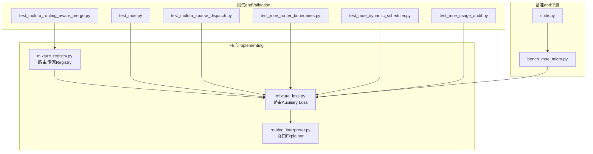
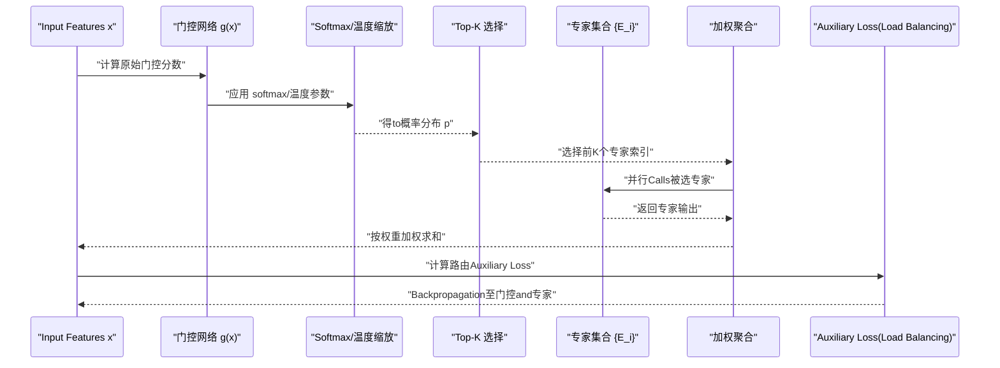
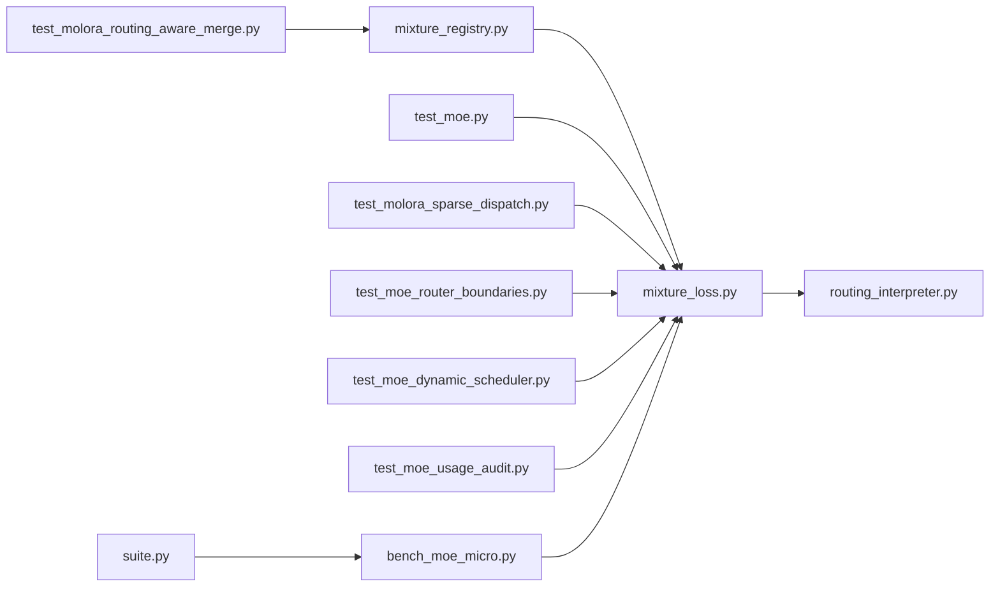

# 基础路由算法

<cite>
**Files Referenced in This Document**
- [ultralytics/nn/mixture_loss.py](file://ultralytics/nn/mixture_loss.py)
- [ultralytics/nn/mixture_registry.py](file://ultralytics/nn/mixture_registry.py)
- [ultralytics/utils/routing_interpreter.py](file://ultralytics/utils/routing_interpreter.py)
- [tests/test_moe.py](file://tests/test_moe.py)
- [tests/test_molora_routing_aware_merge.py](file://tests/test_molora_routing_aware_merge.py)
- [tests/test_molora_sparse_dispatch.py](file://tests/test_molora_sparse_dispatch.py)
- [tests/test_moe_router_boundaries.py](file://tests/test_moe_router_boundaries.py)
- [tests/test_moe_dynamic_scheduler.py](file://tests/test_moe_dynamic_scheduler.py)
- [tests/test_moe_usage_audit.py](file://tests/test_moe_usage_audit.py)
- [scripts/bench_moe_micro.py](file://scripts/bench_moe_micro.py)
- [benchmarks/suite.py](file://benchmarks/suite.py)
</cite>

## Table of Contents
1. [Introduction](#Introduction)
2. [Project Structure](#Project Structure)
3. [Core Components](#Core Components)
4. [Architecture Overview](#Architecture Overview)
5. [Detailed Component Analysis](#Detailed Component Analysis)
6. [Dependency Analysis](#Dependency Analysis)
7. [性能考量](#性能考量)
8. [Troubleshooting Guide](#Troubleshooting Guide)
9. [Conclusion](#Conclusion)
10. [Appendix](#Appendix)

## Introduction
本技术Documentation聚焦于 YOLO-Master 的基础路由算法，围绕Centered on下三类核心Routing Mechanismunfold：
- Top-K 稀疏路由：Via门控权重选择前 K 个专家，implementing计算and存储的稀疏化。
- Softmax 路由：基于概率分布的门控分配，强调数值稳定性and可微性。
- 注意力路由：Combining自注意力特征进行Dynamic Routing决策，提升Tasks适配capabilities。

Documentation将系统阐述各算法的数学原理、时间/空间复杂度、配置参数、数值稳定性处理andGradient传播机制，并给出while代码库中的定位andUses路径，帮助读者while不同场景下做出合理的routing strategies选择。

## Project Structure
YOLO-Master 中and“基础路由”相关的implementingandValidation主要分布whilesuch as下位置：
- Mixture模型注册and损失辅助：用于路由辅助项（such as负载平衡）的计算and注册。
- 路由Explainer：provides路由权重的Visualizationand诊断工具。
- Test Suite：覆盖路由边界、动态调度、稀疏分发、Routing-Aware Mergingetc.关键路径。
- 基准脚本：对路由相关Modules进行微基准Evaluation。

Figure Source
- [ultralytics/nn/mixture_loss.py](file://ultralytics/nn/mixture_loss.py)
- [ultralytics/nn/mixture_registry.py](file://ultralytics/nn/mixture_registry.py)
- [ultralytics/utils/routing_interpreter.py](file://ultralytics/utils/routing_interpreter.py)
- [tests/test_moe.py](file://tests/test_moe.py)
- [tests/test_molora_routing_aware_merge.py](file://tests/test_molora_routing_aware_merge.py)
- [tests/test_molora_sparse_dispatch.py](file://tests/test_molora_sparse_dispatch.py)
- [tests/test_moe_router_boundaries.py](file://tests/test_moe_router_boundaries.py)
- [tests/test_moe_dynamic_scheduler.py](file://tests/test_moe_dynamic_scheduler.py)
- [tests/test_moe_usage_audit.py](file://tests/test_moe_usage_audit.py)
- [scripts/bench_moe_micro.py](file://scripts/bench_moe_micro.py)
- [benchmarks/suite.py](file://benchmarks/suite.py)

Section Source
- [ultralytics/nn/mixture_loss.py](file://ultralytics/nn/mixture_loss.py)
- [ultralytics/nn/mixture_registry.py](file://ultralytics/nn/mixture_registry.py)
- [ultralytics/utils/routing_interpreter.py](file://ultralytics/utils/routing_interpreter.py)
- [tests/test_moe.py](file://tests/test_moe.py)
- [tests/test_molora_routing_aware_merge.py](file://tests/test_molora_routing_aware_merge.py)
- [tests/test_molora_sparse_dispatch.py](file://tests/test_molora_sparse_dispatch.py)
- [tests/test_moe_router_boundaries.py](file://tests/test_moe_router_boundaries.py)
- [tests/test_moe_dynamic_scheduler.py](file://tests/test_moe_dynamic_scheduler.py)
- [tests/test_moe_usage_audit.py](file://tests/test_moe_usage_audit.py)
- [scripts/bench_moe_micro.py](file://scripts/bench_moe_micro.py)
- [benchmarks/suite.py](file://benchmarks/suite.py)

## Core Components
本节概述and基础路由直接相关的核心Modulesand其职责：
- 路由Auxiliary LossandRegistry：provides路由相关的辅助项（例such asLoad Balancing）Centered onand路由/专家的统一注册接口。
- 路由Explainer：解析和Visualization路由权重，便于调试and解释性分析。
- 测试and基准：覆盖路由边界条件、动态调度、稀疏分发、Routing-Aware Mergingetc.关键行for，并provides微基准数据。

Section Source
- [ultralytics/nn/mixture_loss.py](file://ultralytics/nn/mixture_loss.py)
- [ultralytics/nn/mixture_registry.py](file://ultralytics/nn/mixture_registry.py)
- [ultralytics/utils/routing_interpreter.py](file://ultralytics/utils/routing_interpreter.py)
- [tests/test_moe.py](file://tests/test_moe.py)
- [tests/test_molora_routing_aware_merge.py](file://tests/test_molora_routing_aware_merge.py)
- [tests/test_molora_sparse_dispatch.py](file://tests/test_molora_sparse_dispatch.py)
- [tests/test_moe_router_boundaries.py](file://tests/test_moe_router_boundaries.py)
- [tests/test_moe_dynamic_scheduler.py](file://tests/test_moe_dynamic_scheduler.py)
- [tests/test_moe_usage_audit.py](file://tests/test_moe_usage_audit.py)
- [scripts/bench_moe_micro.py](file://scripts/bench_moe_micro.py)
- [benchmarks/suite.py](file://benchmarks/suite.py)

## Architecture Overview
下图展示了从输入to路由决策再to专家计算的端to端流程，包括门控权重生成、Top-K 稀疏选择、Softmax 归一化and注意力融合的关键步骤。

Figure Source
- [ultralytics/nn/mixture_loss.py](file://ultralytics/nn/mixture_loss.py)
- [ultralytics/nn/mixture_registry.py](file://ultralytics/nn/mixture_registry.py)
- [ultralytics/utils/routing_interpreter.py](file://ultralytics/utils/routing_interpreter.py)

## Detailed Component Analysis

### Top-K 稀疏路由
- 数学原理
  - 给定输入 x，门控函数 g(x) 产生每个专家的原始得分。
  - Via Top-K 操作选择得分最高的 K 个专家，其余专家权重置零，形成稀疏激活。
  - Optional地，对选中专家进行局部归一化或保留全局 Softmax 权重Centered on控制贡献度。
- 稀疏选择机制
  - Via argtopk 或etc.价操作获得索引，再构造稀疏权重向量。
  - 稀疏度由 K 控制；K 越小，计算and通信开销越低，但可能降低表达capabilities。
- 门控权重计算
  - 常见做法是先对 g(x) 做 Softmax 得to概率分布，再进行 Top-K 掩码；或while Top-K 后对选中部分重新归一化。
- 复杂度
  - 时间复杂度：O(N·D + N·log D) 或 O(N·D + N·K)，其中 N for样本数，D for专家数，K for选择的专家数。
  - 空间复杂度：O(N·K) 用于存储被选专家的输出and权重。
- 数值稳定性
  - while Softmax 前进行数值稳定化（减去最大值），避免溢出。
  - 对极端小的权重进行裁剪或阈值截断，防止数值噪声放大。
- Gradient传播
  - Top-K 是离散选择，通常采用直通估计（Straight-Through Estimator）或软近似（such as Gumbel-Softmax）Centered onimplementing可微Training。
  - 若采用直通估计，Gradient绕过离散选择，仅作用于连续门控分支。
- 配置参数
  - top_k：每样本选择的专家数量。
  - gate_temperature：控制 Softmax 尖锐度的温度参数。
  - load_balance_weight：Load BalancingAuxiliary Loss的权重。
- Applicable Scenarios
  - 大规模专家且Inference时希望显著降低计算量的场景。
  - 需要显式控制稀疏度and吞吐量的部署环境。

Section Source
- [tests/test_moe.py](file://tests/test_moe.py)
- [tests/test_molora_sparse_dispatch.py](file://tests/test_molora_sparse_dispatch.py)
- [tests/test_moe_router_boundaries.py](file://tests/test_moe_router_boundaries.py)
- [scripts/bench_moe_micro.py](file://scripts/bench_moe_micro.py)

### Softmax 路由
- 数学基础
  - 门控分数 z = g(x)，经 softmax 得to概率分布 p_i = exp(z_i/T)/Σ_j exp(z_j/T)，T for温度。
  - 当 T→0 时分布趋近于 one-hot（接近 Top-1）；T→∞ 时趋于均匀分布。
- 概率分布特性
  - 所有专家权重之和for 1，保证加权聚合的稳定性。
  - 温度调节影响路由的“锐利度”，从而影响Load Balancingand多样性。
- 复杂度
  - 时间复杂度：O(N·D) 用于计算指数and归一化。
  - 空间复杂度：O(N·D) 存储概率分布。
- 数值稳定性
  - 标准技巧：z' = z - max(z)，再计算 exp(z')，最后归一化。
  - 对极小值进行裁剪，避免 log/exp 下的下溢/上溢。
- Gradient传播
  - Softmax 是可微的，Gradient可Via链式法则回传至门控网络。
  - 温度 T 也可学习，需小心Gradient尺度。
- 配置参数
  - temperature：控制分布锐利度。
  - epsilon：数值稳定性的微小常数。
  - aux_loss_weight：Auxiliary Loss权重（such asLoad Balancing）。
- Applicable Scenarios
  - 需要平滑路由and良好可微性的Training阶段。
  - 专家数量适中且希望充分利用多专家capabilities的场景。

Section Source
- [ultralytics/nn/mixture_loss.py](file://ultralytics/nn/mixture_loss.py)
- [ultralytics/nn/mixture_registry.py](file://ultralytics/nn/mixture_registry.py)
- [tests/test_moe.py](file://tests/test_moe.py)

### 注意力路由
- 设计动机
  - 传统门控仅依赖静态映射 g(x)，注意力路由引入上下文信息，使路由决策更灵活。
- Combining自注意力的方式
  - 将输入序列的特征作for查询 Q，专家键 K_expert and价值 V_expert 构成专家池。
  - Via多头注意力计算注意力权重 α = softmax(QK^T/√d)，并按 α 对专家输出进行加权聚合。
  - 可while注意力层之后接一个轻量门控，进一步约束稀疏性或增强选择性。
- 复杂度
  - 时间复杂度：O(N·D·d) 或 O((N+D)·N·d)，取决于具体implementingand是否共享键值。
  - 空间复杂度：O(N·D) 存储注意力矩阵。
- 数值稳定性
  - 对 QK^T 进行缩放and裁剪，避免大值导致 softmax 饱和。
  - 对注意力权重进行最小值裁剪，防止某些专家完全失活。
- Gradient传播
  - 注意力层完全可微，Gradient自然回传至 Q/K/V 投影and专家。
  - 若引入稀疏约束（such as Top-K 掩码），需考虑直通估计或软近似。
- 配置参数
  - num_heads：注意力头数。
  - d_model：嵌入维度。
  - dropout：注意力 Dropout。
  - sparse_top_k：while注意力后进行的稀疏选择数量。
- Applicable Scenarios
  - 长序列或Multimodal输入，需要跨位置/跨模态信息交互的路由。
  - 对路由可解释性and动态性要求较高的Tasks。

Section Source
- [ultralytics/utils/routing_interpreter.py](file://ultralytics/utils/routing_interpreter.py)
- [tests/test_moe.py](file://tests/test_moe.py)

### 路由Auxiliary LossandLoad Balancing
- 目标
  - 防止少数专家过拟合，鼓励专家间Load Balancing，提高整体吞吐and泛化。
- 常见形式
  - 基于专家Uses频率的 KL 散度或方差惩罚，and主损失加权组合。
- 集成点
  - whileTraining阶段加入Auxiliary Loss，不参andInference。
  - and路由ExplainerCombined with，监控专家Uses分布。
- 复杂度
  - 额外开销较小，通常for O(N·D) 统计and简单聚合。
- 配置参数
  - aux_loss_type：Auxiliary Loss类型（such as KL、方差）。
  - aux_loss_weight：Auxiliary Loss权重。
  - warmup_steps：预热步数，避免早期不稳定。
- Applicable Scenarios
  - 专家数量较多、Training初期易出现负载不均衡的情况。

Section Source
- [ultralytics/nn/mixture_loss.py](file://ultralytics/nn/mixture_loss.py)
- [ultralytics/utils/routing_interpreter.py](file://ultralytics/utils/routing_interpreter.py)
- [tests/test_moe_usage_audit.py](file://tests/test_moe_usage_audit.py)

### 路由Explainerand诊断
- 功能
  - 解析路由权重、专家Uses率、负载分布etc.Metrics。
  - providesVisualization输出，辅助定位路由异常（such as某专家长期失活）。
- 集成点
  - andTraining回调或Logging系统集成，定期记录路由统计。
- 配置参数
  - save_dir：结果保存Table of Contents。
  - interval：记录间隔。
  - metrics：需要记录的Metrics列表。
- Applicable Scenarios
  - 路由调试、模型诊断and论文复现的数据收集。

Section Source
- [ultralytics/utils/routing_interpreter.py](file://ultralytics/utils/routing_interpreter.py)

## Dependency Analysis
路由相关Modules之间的依赖关系such as下：
- mixture_loss providesAuxiliary Lossand路由统计，供测试andExplainerUses。
- mixture_registry 统一注册路由and专家，确保接口一致性。
- routing_interpreter 读取路由权重and统计，生成诊断报告。
- Test Suite覆盖路由边界、动态调度、稀疏分发andRouting-Aware Mergingetc.关键路径。
- 基准脚本对路由Modules进行微基准Evaluation，支撑性能Optimization。

Figure Source
- [ultralytics/nn/mixture_loss.py](file://ultralytics/nn/mixture_loss.py)
- [ultralytics/nn/mixture_registry.py](file://ultralytics/nn/mixture_registry.py)
- [ultralytics/utils/routing_interpreter.py](file://ultralytics/utils/routing_interpreter.py)
- [tests/test_moe.py](file://tests/test_moe.py)
- [tests/test_molora_routing_aware_merge.py](file://tests/test_molora_routing_aware_merge.py)
- [tests/test_molora_sparse_dispatch.py](file://tests/test_molora_sparse_dispatch.py)
- [tests/test_moe_router_boundaries.py](file://tests/test_moe_router_boundaries.py)
- [tests/test_moe_dynamic_scheduler.py](file://tests/test_moe_dynamic_scheduler.py)
- [tests/test_moe_usage_audit.py](file://tests/test_moe_usage_audit.py)
- [scripts/bench_moe_micro.py](file://scripts/bench_moe_micro.py)
- [benchmarks/suite.py](file://benchmarks/suite.py)

Section Source
- [ultralytics/nn/mixture_loss.py](file://ultralytics/nn/mixture_loss.py)
- [ultralytics/nn/mixture_registry.py](file://ultralytics/nn/mixture_registry.py)
- [ultralytics/utils/routing_interpreter.py](file://ultralytics/utils/routing_interpreter.py)
- [tests/test_moe.py](file://tests/test_moe.py)
- [tests/test_molora_routing_aware_merge.py](file://tests/test_molora_routing_aware_merge.py)
- [tests/test_molora_sparse_dispatch.py](file://tests/test_molora_sparse_dispatch.py)
- [tests/test_moe_router_boundaries.py](file://tests/test_moe_router_boundaries.py)
- [tests/test_moe_dynamic_scheduler.py](file://tests/test_moe_dynamic_scheduler.py)
- [tests/test_moe_usage_audit.py](file://tests/test_moe_usage_audit.py)
- [scripts/bench_moe_micro.py](file://scripts/bench_moe_micro.py)
- [benchmarks/suite.py](file://benchmarks/suite.py)

## 性能考量
- 稀疏度and吞吐
  - Top-K 的 K 越小，Inference速度越快，但可能牺牲精度；建议根据Tasksand硬件进行网格搜索。
- 内存占用
  - Softmax 路由需要存储完整的概率分布，内存开销较大；Top-K 可降低峰值内存。
- 数值稳定性
  - 温度缩放and最大值减法是关键；建议while极端输入下进行压力测试。
- 并行and通信
  - 专家并行执行可显著提升吞吐；while多设备环境下需注意数据分片and同步开销。
- 基准Refer to
  - Uses micro-benchmark 脚本对不同routing strategies进行对比，关注延迟and吞吐。

Section Source
- [scripts/bench_moe_micro.py](file://scripts/bench_moe_micro.py)
- [benchmarks/suite.py](file://benchmarks/suite.py)

## Troubleshooting Guide
- 路由崩溃或 NaN
  - 检查 Softmax 前的数值稳定化处理；确认温度参数未过小或过大。
  - 查看路由Explainer的权重分布，识别是否存while单专家垄断或全部失活。
- 负载不均衡
  - 调整Auxiliary Loss权重and预热步数；观察专家Uses率变化。
- 稀疏分发异常
  - 核对 Top-K 的implementingand掩码逻辑；确认直通估计或软近似是否正确启用。
- Routing-Aware Merging问题
  - 检查合并前后的权重对齐and形状匹配；ValidationRegistry的一致性。
- 动态调度失效
  - 确认调度策略的触发条件and状态机转换；检查边界用例。

Section Source
- [tests/test_moe.py](file://tests/test_moe.py)
- [tests/test_molora_routing_aware_merge.py](file://tests/test_molora_routing_aware_merge.py)
- [tests/test_molora_sparse_dispatch.py](file://tests/test_molora_sparse_dispatch.py)
- [tests/test_moe_router_boundaries.py](file://tests/test_moe_router_boundaries.py)
- [tests/test_moe_dynamic_scheduler.py](file://tests/test_moe_dynamic_scheduler.py)
- [tests/test_moe_usage_audit.py](file://tests/test_moe_usage_audit.py)
- [ultralytics/utils/routing_interpreter.py](file://ultralytics/utils/routing_interpreter.py)

## Conclusion
- Top-K 稀疏路由适合高吞吐and低延迟需求，Combined with直通估计或软近似可implementing稳定Training。
- Softmax 路由具备良好可微性and概率解释性，适合需要平滑路由的场景。
- 注意力路由能利用上下文信息提升路由的动态性and可解释性，但计算and内存开销更高。
- Auxiliary Lossand路由Explainer是保障Training稳定and可诊断的重要基础设施。
- 建议while实际项目中CombiningTasks特性、硬件资源and性能目标，选择合适的routing strategies并进行系统化调参and基准Evaluation。

## Appendix
- UsesExamples（路径指引）
  - 路由Auxiliary LossandRegistry：[ultralytics/nn/mixture_loss.py](file://ultralytics/nn/mixture_loss.py)、[ultralytics/nn/mixture_registry.py](file://ultralytics/nn/mixture_registry.py)
  - 路由Explainerand诊断：[ultralytics/utils/routing_interpreter.py](file://ultralytics/utils/routing_interpreter.py)
  - 路由边界and稀疏分发测试：[tests/test_moe_router_boundaries.py](file://tests/test_moe_router_boundaries.py)、[tests/test_molora_sparse_dispatch.py](file://tests/test_molora_sparse_dispatch.py)
  - Routing-Aware Mergingand动态调度：[tests/test_molora_routing_aware_merge.py](file://tests/test_molora_routing_aware_merge.py)、[tests/test_moe_dynamic_scheduler.py](file://tests/test_moe_dynamic_scheduler.py)
  - 路由Uses审计and基准：[tests/test_moe_usage_audit.py](file://tests/test_moe_usage_audit.py)、[scripts/bench_moe_micro.py](file://scripts/bench_moe_micro.py)