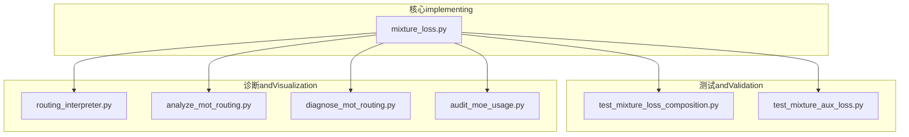
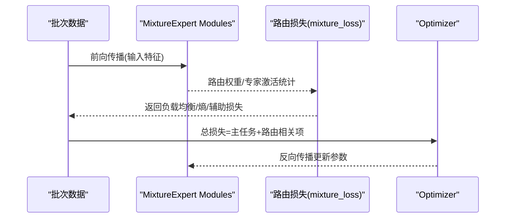
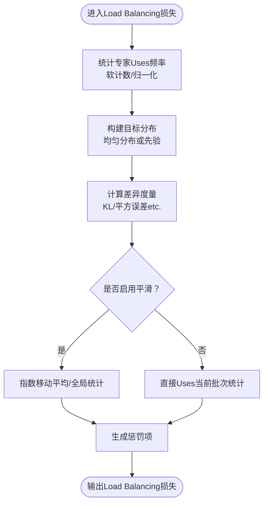
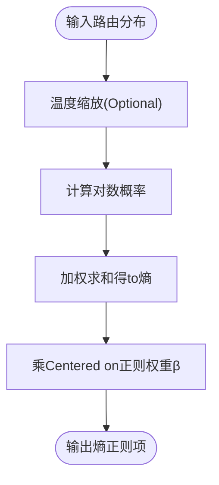
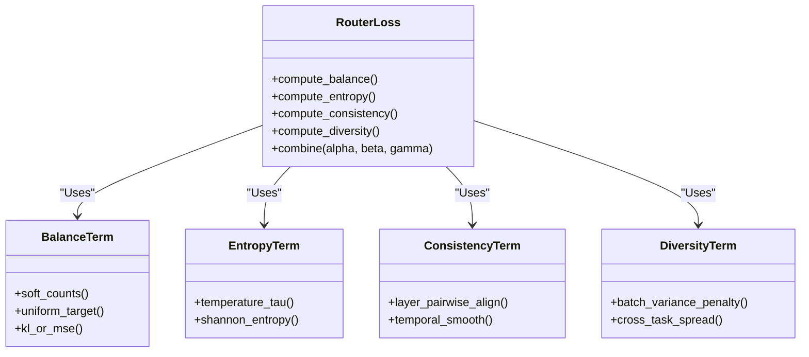
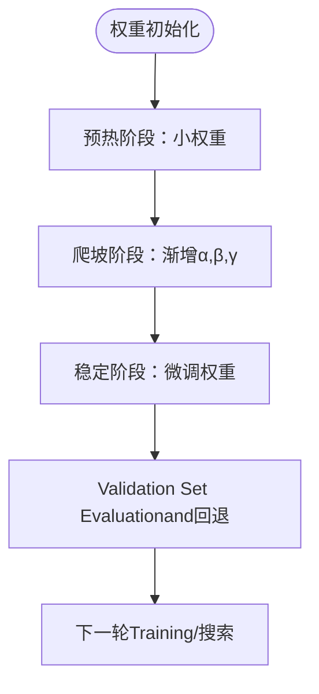
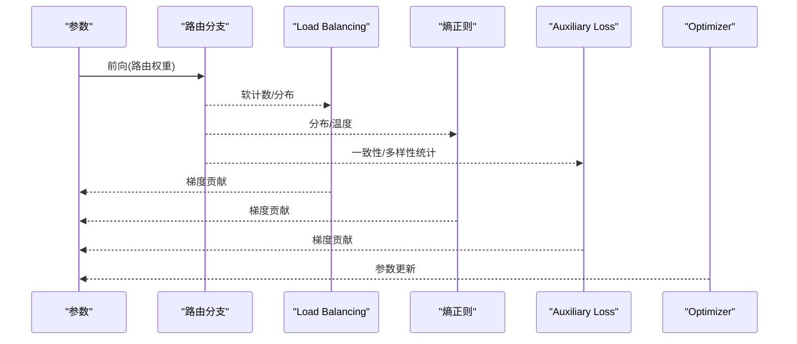
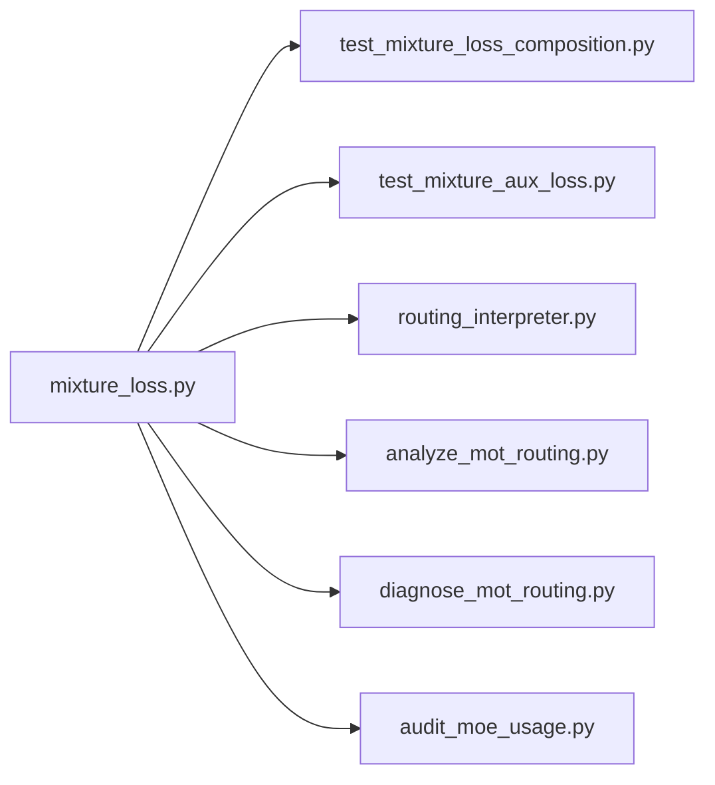

# 路由Loss Function

<cite>
**Files Referenced in This Document**
- [mixture_loss.py](file://ultralytics/nn/mixture_loss.py)
- [test_mixture_loss_composition.py](file://tests/test_mixture_loss_composition.py)
- [test_mixture_aux_loss.py](file://tests/test_mixture_aux_loss.py)
- [routing_interpreter.py](file://tools/routing_interpreter.py)
- [analyze_mot_routing.py](file://scripts/analyze_mot_routing.py)
- [diagnose_mot_routing.py](file://scripts/diagnose_mot_routing.py)
- [audit_moe_usage.py](file://scripts/audit_moe_usage.py)
</cite>

## Table of Contents
1. [Introduction](#Introduction)
2. [Project Structure](#Project Structure)
3. [Core Components](#Core Components)
4. [Architecture Overview](#Architecture Overview)
5. [Detailed Component Analysis](#Detailed Component Analysis)
6. [Dependency Analysis](#Dependency Analysis)
7. [性能and数值稳定性](#性能and数值稳定性)
8. [Troubleshooting Guide](#Troubleshooting Guide)
9. [Conclusion](#Conclusion)
10. [Appendix](#Appendix)

## Introduction
本技术Documentation聚焦于YOLO-Master中“路由Loss Function”的设计andimplementing，围绕Centered on下目标unfold：
- Load BalancingLoss Function的设计原理：专家Uses频率均衡and负载惩罚项。
- 路由熵正则化的数学基础and强度控制。
- 辅助Loss Functionsuch as何促进路由学习：路由一致性约束and专家多样性鼓励。
- 不同Loss Function的组合策略and权重分配方法。
- Gradient计算andBackpropagation流程。
- 超参数调优方法and最佳实践。
- 对Training稳定性and收敛速度的影响分析。
- 数值稳定性andGradient爆炸/消失问题的解决方案。

## Project Structure
and路由损失相关的核心代码位于模型网络层and测试脚本中，同时配套工具用于诊断andVisualization路由行for。关键位置such as下：
- 路由损失主implementing：ultralytics/nn/mixture_loss.py
- 路由Loss combinationand契约测试：tests/test_mixture_loss_composition.py
- Auxiliary Loss相关测试：tests/test_mixture_aux_loss.py
- 路由解释and诊断工具：tools/routing_interpreter.py、scripts/analyze_mot_routing.py、scripts/diagnose_mot_routing.py
- 专家Uses审计脚本：scripts/audit_moe_usage.py

Figure Source
- [mixture_loss.py](file://ultralytics/nn/mixture_loss.py)
- [test_mixture_loss_composition.py](file://tests/test_mixture_loss_composition.py)
- [test_mixture_aux_loss.py](file://tests/test_mixture_aux_loss.py)
- [routing_interpreter.py](file://tools/routing_interpreter.py)
- [analyze_mot_routing.py](file://scripts/analyze_mot_routing.py)
- [diagnose_mot_routing.py](file://scripts/diagnose_mot_routing.py)
- [audit_moe_usage.py](file://scripts/audit_moe_usage.py)

Section Source
- [mixture_loss.py](file://ultralytics/nn/mixture_loss.py)
- [test_mixture_loss_composition.py](file://tests/test_mixture_loss_composition.py)
- [test_mixture_aux_loss.py](file://tests/test_mixture_aux_loss.py)
- [routing_interpreter.py](file://tools/routing_interpreter.py)
- [analyze_mot_routing.py](file://scripts/analyze_mot_routing.py)
- [diagnose_mot_routing.py](file://scripts/diagnose_mot_routing.py)
- [audit_moe_usage.py](file://scripts/audit_moe_usage.py)

## Core Components
- Load Balancing损失（Load Balancing Loss）
  - 目标：促使各专家的Uses频率趋于均匀，避免少数专家被过度Uses。
  - 典型形式：基于专家Uses概率分布and理想均匀分布之间的差异构造惩罚项；可Combining每批次的软计数统计进行归一化。
  - 关键要点：批次维度聚合、指数移动平均或全局统计的平滑处理、防止稀疏导致的数值不稳定。
- 路由熵正则化（Routing Entropy Regularization）
  - 目标：Via最大化或约束路由输出的熵，鼓励更“分散”的路由选择，提升专家多样性and鲁棒性。
  - 数学基础：离散分布的香农熵；可Via温度系数调节熵的敏感度。
  - 强度控制：引入正则化权重，随Training阶段动态调整（such as预热后逐步增大）。
- Auxiliary Loss（Auxiliary Routing Losses）
  - 路由一致性约束：跨层或跨样本的路由分布应保持稳定或满足特定先验。
  - 专家多样性鼓励：限制同一批次内专家选择的重复度，或鼓励不同Tasks/场景下的差异化路由。
- 组合策略and权重分配
  - 总损失 = 主Tasks损失 + α·Load Balancing损失 + β·路由熵正则 + γ·Auxiliary Loss
  - 权重分配建议：主Tasks优先，辅助项while稳定期逐步增强；采用网格搜索或贝叶斯Optimization进行超参扫描。

Section Source
- [mixture_loss.py](file://ultralytics/nn/mixture_loss.py)
- [test_mixture_loss_composition.py](file://tests/test_mixture_loss_composition.py)
- [test_mixture_aux_loss.py](file://tests/test_mixture_aux_loss.py)

## Architecture Overview
下图展示了路由损失while主Training循环中的集成方式and数据流：

Figure Source
- [mixture_loss.py](file://ultralytics/nn/mixture_loss.py)
- [test_mixture_loss_composition.py](file://tests/test_mixture_loss_composition.py)

## Detailed Component Analysis

### Load Balancing损失
- 设计动机
  - while多专家结构中，若缺乏均衡约束，易出现“赢家通吃”，导致部分专家闲置、泛化capabilities下降。
- implementing要点
  - 统计每个专家while批次内的软Uses频率（例such as按路由权重求和并归一化）。
  - and理想均匀分布比较，构造KL散度或平方误差形式的惩罚项。
  - Optional：引入指数移动平均Centered on平滑历史Uses信息，降低批次噪声。
- 复杂度and稳定性
  - 时间复杂度and专家数线性相关；需对零计数进行保护，避免除零或对数未定义。
- 常见陷阱
  - 批次过小导致估计偏差大；建议Combined withEMA或累积统计。
  - 权重过大可能压制主Tasks学习，需渐进式调度。

Figure Source
- [mixture_loss.py](file://ultralytics/nn/mixture_loss.py)

Section Source
- [mixture_loss.py](file://ultralytics/nn/mixture_loss.py)

### 路由熵正则化
- 数学基础
  - 对路由输出分布p，熵H(p)=−∑ p_i log p_i；高熵意味着更均匀的专家选择。
  - 可Via温度τ调节分布尖锐程度，从而控制熵的敏感度。
- 作用机制
  - 作for正则项加入总损失，抑制过拟合to单一专家，提升多样性and鲁棒性。
- 强度控制
  - 初始较小，随Training推进逐步增加；也可根据Validation集Metrics自适应调整。
- 数值考虑
  - 对极小概率值进行裁剪或加ε，避免log(0)。

Figure Source
- [mixture_loss.py](file://ultralytics/nn/mixture_loss.py)

Section Source
- [mixture_loss.py](file://ultralytics/nn/mixture_loss.py)

### Auxiliary Loss：路由一致性and多样性
- 路由一致性约束
  - 目标：使相邻层或相近样本的路由分布保持连贯，减少抖动。
  - implementing思路：对连续层的路由分布施加对齐损失（such asKL或余弦相似度），或while时间序列上约束变化幅度。
- 专家多样性鼓励
  - 目标：while同一批次或跨Tasks中，避免所有样本都路由to相同专家集合。
  - implementing思路：对批次内专家选择分布的方差进行惩罚，或引入互信息最小化Centered on降低冗余。
- and主Tasks的协同
  - Auxiliary Loss通常较弱且阶段性启用，确保不干扰主Tasks收敛。

Figure Source
- [mixture_loss.py](file://ultralytics/nn/mixture_loss.py)
- [test_mixture_aux_loss.py](file://tests/test_mixture_aux_loss.py)

Section Source
- [mixture_loss.py](file://ultralytics/nn/mixture_loss.py)
- [test_mixture_aux_loss.py](file://tests/test_mixture_aux_loss.py)

### 组合策略and权重分配
- 总损失构成
  - 总损失 = 主Tasks损失 + α·Load Balancing + β·熵正则 + γ·Auxiliary Loss
- 权重分配建议
  - 初期：α、β、γ较小，保证主Tasks快速收敛。
  - 中期：逐步增大α、β，提升均衡and多样性。
  - 后期：维持或微调，避免破坏已学得的表征。
- 自动化搜索
  - can use网格搜索或贝叶斯OptimizationwhileValidation集上Evaluation不同权重组合。

Figure Source
- [test_mixture_loss_composition.py](file://tests/test_mixture_loss_composition.py)

Section Source
- [test_mixture_loss_composition.py](file://tests/test_mixture_loss_composition.py)

### Gradient计算andBackpropagation
- Gradient来源
  - 主Tasks损失对路由参数的直接Gradient。
  - Load Balancingand熵正则对路由权重的间接Gradient，Via路由分支回传。
- 数值稳定技巧
  - 对概率进行裁剪（such as[ε, 1−ε]），避免log(0)and除零。
  - 对极端小的软计数加ε，防止Gradient爆炸。
- Backpropagation路径
  - 路由分支→Load Balancing/熵/辅助项→总损失→Optimizer更新。

Figure Source
- [mixture_loss.py](file://ultralytics/nn/mixture_loss.py)

Section Source
- [mixture_loss.py](file://ultralytics/nn/mixture_loss.py)

## Dependency Analysis
- 内部依赖
  - mixture_loss.pyfor路由损失的核心implementing，被测试and诊断工具引用。
  - 测试用例覆盖组合策略andAuxiliary Loss的契约and边界条件。
- External Dependencies
  - 依赖PyTorch张量运算and自动微分；注意分布式环境下的规约操作（such asall-reduce）的正确性。
- 耦合and内聚
  - 路由损失Modules应保持高内聚（仅关注路由相关损失），低耦合（Via接口暴露统计量and损失项）。

Figure Source
- [mixture_loss.py](file://ultralytics/nn/mixture_loss.py)
- [test_mixture_loss_composition.py](file://tests/test_mixture_loss_composition.py)
- [test_mixture_aux_loss.py](file://tests/test_mixture_aux_loss.py)
- [routing_interpreter.py](file://tools/routing_interpreter.py)
- [analyze_mot_routing.py](file://scripts/analyze_mot_routing.py)
- [diagnose_mot_routing.py](file://scripts/diagnose_mot_routing.py)
- [audit_moe_usage.py](file://scripts/audit_moe_usage.py)

Section Source
- [mixture_loss.py](file://ultralytics/nn/mixture_loss.py)
- [test_mixture_loss_composition.py](file://tests/test_mixture_loss_composition.py)
- [test_mixture_aux_loss.py](file://tests/test_mixture_aux_loss.py)
- [routing_interpreter.py](file://tools/routing_interpreter.py)
- [analyze_mot_routing.py](file://scripts/analyze_mot_routing.py)
- [diagnose_mot_routing.py](file://scripts/diagnose_mot_routing.py)
- [audit_moe_usage.py](file://scripts/audit_moe_usage.py)

## 性能and数值稳定性
- 性能特性
  - Load Balancingand熵正则的计算开销and专家数量线性相关；建议while大规模专家时采用近似或采样策略。
  - Auxiliary Loss的对齐and多样性计算应避免全矩阵操作，尽量Uses向量化的批次级统计。
- 数值稳定性
  - 对概率and软计数进行裁剪and加ε，防止log(0)、除零andNaN。
  - whileDistributed Training中，确保统计量的规约正确，避免跨设备不一致。
- Gradient爆炸/消失
  - 对路由分支引入Gradient裁剪；对熵正则权重进行上限控制。
  - Uses稳定的softmaximplementingand数值安全的log-sum-exp技巧。

Section Source
- [mixture_loss.py](file://ultralytics/nn/mixture_loss.py)

## Troubleshooting Guide
- 常见问题
  - 路由崩溃：某专家独占，其他专家几乎不被Uses。
    - 检查Load Balancing权重是否过小；适当增大α。
    - 查看软计数是否出现大量零值，必要时引入EMA平滑。
  - Training不稳定：损失震荡或NaN。
    - 检查熵正则是否过大导致分布过于平坦；减小β或提高温度τ。
    - 确认概率裁剪andε设置合理。
  - Auxiliary Loss无效：一致性/多样性未见改善。
    - 检查Auxiliary Loss权重γ是否过小；逐步增大并观察ValidationMetrics。
- 诊断工具
  - Uses路由Explainerand诊断脚本分析专家Uses分布、路由一致性and时序变化。
  - Uses审计脚本统计长期专家Uses情况，识别偏斜and冷启动问题。

Section Source
- [routing_interpreter.py](file://tools/routing_interpreter.py)
- [analyze_mot_routing.py](file://scripts/analyze_mot_routing.py)
- [diagnose_mot_routing.py](file://scripts/diagnose_mot_routing.py)
- [audit_moe_usage.py](file://scripts/audit_moe_usage.py)

## Conclusion
路由Loss FunctionwhileYOLO-Master的多专家架构中扮演关键角色：ViaLoad Balancing、熵正则andAuxiliary Loss，有效缓解专家偏斜、提升多样性and鲁棒性。合理的组合策略and权重调度可显著提升Training稳定性and收敛速度。实践中需重视数值稳定性and分布式规约细节，并Combining诊断工具持续监控路由行for。

## Appendix
- 超参数调优建议
  - 初始权重：α≈0.01–0.1，β≈0.01–0.1，γ≈0.01–0.1。
  - 温度τ：从1.0开始，视分布尖锐程度调整。
  - ε裁剪：1e-6至1e-4范围。
- 最佳实践
  - 预热阶段禁用或弱化Auxiliary Loss，待主Tasks稳定后再逐步增强。
  - 定期Evaluation专家Uses分布，发现偏斜and时干预。
  - while分布式环境中，统一统计口径，避免设备间差异。