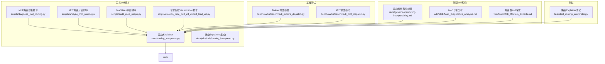
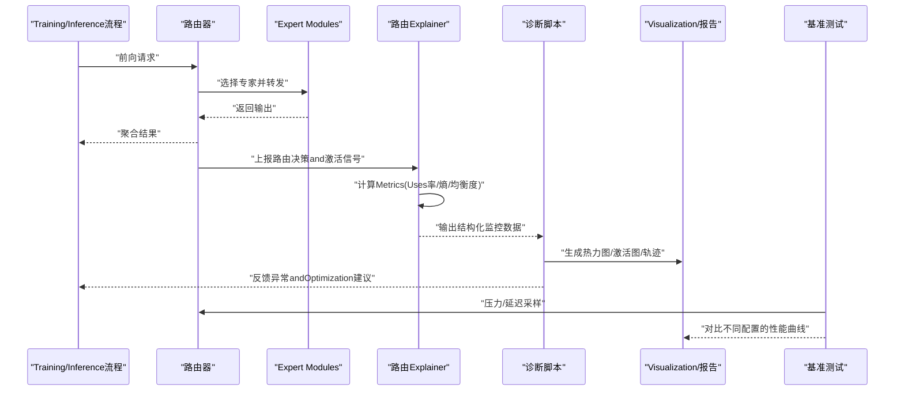
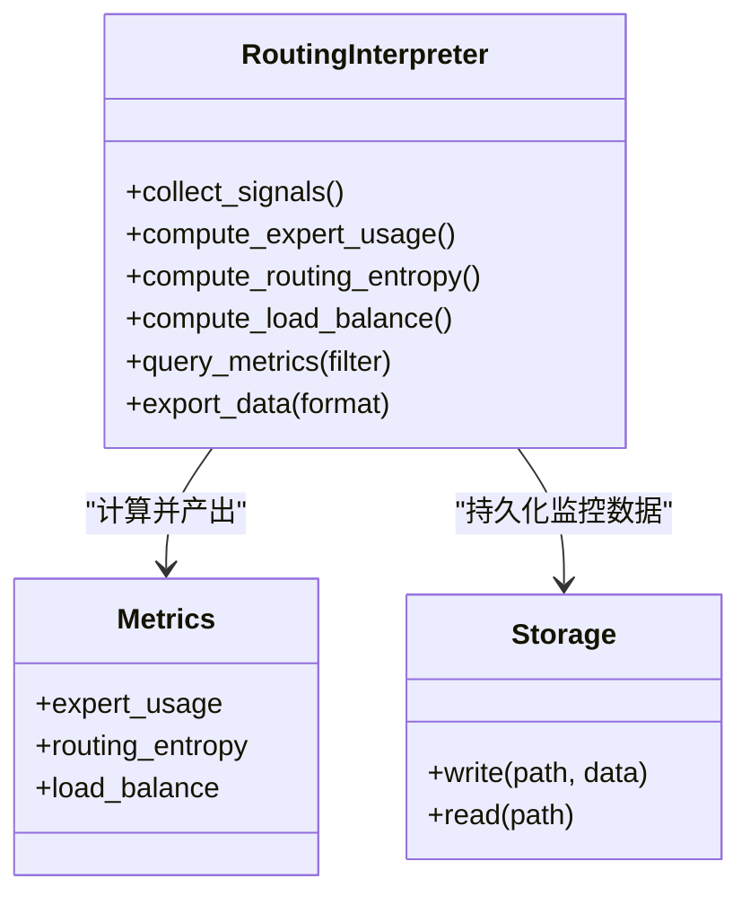
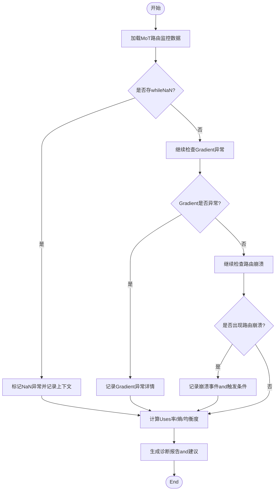
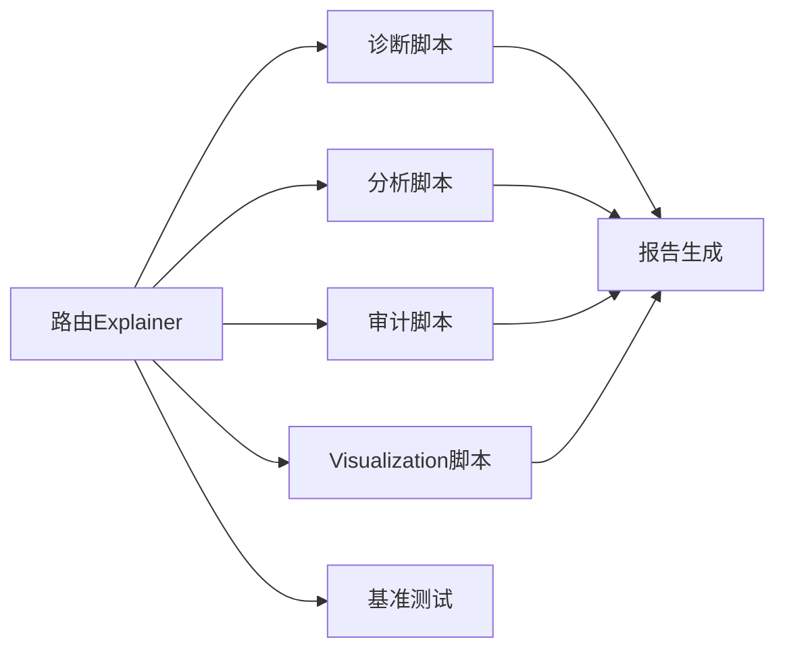

# 路由诊断and监控

<cite>
**Files Referenced in This Document**
- [routing_interpreter.py](file://tools/routing_interpreter.py)
- [routing_interpreter.py](file://ultralytics/utils/routing_interpreter.py)
- [test_routing_interpreter.py](file://tests/test_routing_interpreter.py)
- [diagnose_mot_routing.py](file://scripts/diagnose_mot_routing.py)
- [analyze_mot_routing.py](file://scripts/analyze_mot_routing.py)
- [audit_moe_usage.py](file://scripts/audit_moe_usage.py)
- [ablation_moe_peft_e3_expert_load_viz.py](file://scripts/ablation_moe_peft_e3_expert_load_viz.py)
- [debug-router-nan-activations.md](file://debug-router-nan-activations.md)
- [governance/routing-interpretability.md](file://docs/governance/routing-interpretability.md)
- [wiki/MoE/MoE_Diagnostics_Analysis.md](file://wiki/MoE/MoE_Diagnostics_Analysis.md)
- [wiki/MoE/MoE_Routers_Experts.md](file://wiki/MoE/MoE_Routers_Experts.md)
- [benchmark_molora_dispatch.py](file://benchmarks/benchmark_molora_dispatch.py)
- [benchmark_mot_dispatch.py](file://benchmarks/benchmark_mot_dispatch.py)
</cite>

## Table of Contents
1. [Introduction](#Introduction)
2. [Project Structure](#Project Structure)
3. [Core Components](#Core Components)
4. [Architecture Overview](#Architecture Overview)
5. [Detailed Component Analysis](#Detailed Component Analysis)
6. [Dependency Analysis](#Dependency Analysis)
7. [性能考量](#性能考量)
8. [Troubleshooting Guide](#Troubleshooting Guide)
9. [Conclusion](#Conclusion)
10. [Appendix](#Appendix)

## Introduction
本技术DocumentationtargetingYOLO-Master的路由诊断and监控系统，聚焦于Centered on下目标：
- 解释路由性能Metrics的收集and分析方法，包括专家Uses率、路由熵andLoad Balancing度。
- 说明路由行forVisualization工具（热力图、专家激活图、路由轨迹分析）的Uses方法。
- 阐述异常检测机制（NaN值检测、Gradient异常、路由崩溃识别）。
- 描述监控数据的存储格式and查询接口。
- provides诊断报告生成工具的Uses说明。
- 给出bottlenecks分析andOptimization建议。
- 介绍调试工具and交互式分析界面。
- 说明路由监控数据while模型Optimization中的作用and应用场景。

## Project Structure
and“路由诊断and监控”相关的代码andDocumentation主要分布whilesuch as下位置：
- 工具层：路由Explainerand诊断脚本
- 基准测试：调度and路由性能基准
- 治理andWiki：Metrics定义、方法论and最佳实践
- 测试：契约and稳定性Validation

Figure Source
- [routing_interpreter.py](file://tools/routing_interpreter.py)
- [routing_interpreter.py](file://ultralytics/utils/routing_interpreter.py)
- [diagnose_mot_routing.py](file://scripts/diagnose_mot_routing.py)
- [analyze_mot_routing.py](file://scripts/analyze_mot_routing.py)
- [audit_moe_usage.py](file://scripts/audit_moe_usage.py)
- [ablation_moe_peft_e3_expert_load_viz.py](file://scripts/ablation_moe_peft_e3_expert_load_viz.py)
- [benchmark_molora_dispatch.py](file://benchmarks/benchmark_molora_dispatch.py)
- [benchmark_mot_dispatch.py](file://benchmarks/benchmark_mot_dispatch.py)
- [governance/routing-interpretability.md](file://docs/governance/routing-interpretability.md)
- [wiki/MoE/MoE_Diagnostics_Analysis.md](file://wiki/MoE/MoE_Diagnostics_Analysis.md)
- [wiki/MoE/MoE_Routers_Experts.md](file://wiki/MoE/MoE_Routers_Experts.md)
- [test_routing_interpreter.py](file://tests/test_routing_interpreter.py)

Section Source
- [routing_interpreter.py](file://tools/routing_interpreter.py)
- [routing_interpreter.py](file://ultralytics/utils/routing_interpreter.py)
- [diagnose_mot_routing.py](file://scripts/diagnose_mot_routing.py)
- [analyze_mot_routing.py](file://scripts/analyze_mot_routing.py)
- [audit_moe_usage.py](file://scripts/audit_moe_usage.py)
- [ablation_moe_peft_e3_expert_load_viz.py](file://scripts/ablation_moe_peft_e3_expert_load_viz.py)
- [benchmark_molora_dispatch.py](file://benchmarks/benchmark_molora_dispatch.py)
- [benchmark_mot_dispatch.py](file://benchmarks/benchmark_mot_dispatch.py)
- [governance/routing-interpretability.md](file://docs/governance/routing-interpretability.md)
- [wiki/MoE/MoE_Diagnostics_Analysis.md](file://wiki/MoE/MoE_Diagnostics_Analysis.md)
- [wiki/MoE/MoE_Routers_Experts.md](file://wiki/MoE/MoE_Routers_Experts.md)
- [test_routing_interpreter.py](file://tests/test_routing_interpreter.py)

## Core Components
- 路由Explainer（Routing Interpreter）
  - 负责从Training/Inference过程中采集路由决策、专家激活、权重分布etc.信号，并计算关键Metrics（专家Uses率、路由熵、Load Balancing度），输出结构化结果供后续Visualizationand诊断Uses。
  - provides统一的数据结构and查询接口，便于跨Modules复用。
- MoT路由诊断脚本
  - 针对Multi-Object Tracking（MoT）场景的路由行for进行专项诊断，包含异常检测、统计汇总and问题定位。
- MoT路由分析脚本
  - 对历史或批处理数据进行深度分析，产出趋势、热点and退化信号。
- MoEUses审计脚本
  - 对专家Uses情况进行审计，识别长期闲置或过载的专家，辅助剪枝and再平衡策略。
- 专家负载Visualization脚本
  - 将专家激活andUses率转化forVisualization图表，Supporting热力图and时间序列展示。
- 基准Test Suite
  - 针对MoloraandMoT调度路径的性能基准，用于Evaluation不同routing strategiesand配置下的吞吐and时延。

Section Source
- [routing_interpreter.py](file://tools/routing_interpreter.py)
- [routing_interpreter.py](file://ultralytics/utils/routing_interpreter.py)
- [diagnose_mot_routing.py](file://scripts/diagnose_mot_routing.py)
- [analyze_mot_routing.py](file://scripts/analyze_mot_routing.py)
- [audit_moe_usage.py](file://scripts/audit_moe_usage.py)
- [ablation_moe_peft_e3_expert_load_viz.py](file://scripts/ablation_moe_peft_e3_expert_load_viz.py)
- [benchmark_molora_dispatch.py](file://benchmarks/benchmark_molora_dispatch.py)
- [benchmark_mot_dispatch.py](file://benchmarks/benchmark_mot_dispatch.py)

## Architecture Overview
下图展示了路由诊断and监控的整体架构：数据采集（Explainer）、Metrics计算、异常检测、Visualizationand报告生成、Centered onand基准评测之间的交互关系。

Figure Source
- [routing_interpreter.py](file://tools/routing_interpreter.py)
- [diagnose_mot_routing.py](file://scripts/diagnose_mot_routing.py)
- [ablation_moe_peft_e3_expert_load_viz.py](file://scripts/ablation_moe_peft_e3_expert_load_viz.py)
- [benchmark_molora_dispatch.py](file://benchmarks/benchmark_molora_dispatch.py)
- [benchmark_mot_dispatch.py](file://benchmarks/benchmark_mot_dispatch.py)

## Detailed Component Analysis

### 路由Explainer（Routing Interpreter）
职责andcapabilities
- 采集路由决策、专家激活、权重分布etc.原始信号。
- 计算关键Metrics：
  - 专家Uses率：各专家被选中的频率分布。
  - 路由熵：衡量路由分布的均匀性and不确定性。
  - Load Balancing度：基于Uses率分布的均衡程度度量。
- provides统一数据结构and查询接口，Supporting按层、批次、时间窗口聚合。

Figure Source
- [routing_interpreter.py](file://tools/routing_interpreter.py)
- [routing_interpreter.py](file://ultralytics/utils/routing_interpreter.py)

Section Source
- [routing_interpreter.py](file://tools/routing_interpreter.py)
- [routing_interpreter.py](file://ultralytics/utils/routing_interpreter.py)
- [test_routing_interpreter.py](file://tests/test_routing_interpreter.py)

### MoT路由诊断脚本
功能要点
- 针对MoT场景的路由行for进行专项诊断，包括：
  - 异常检测：NaN值检测、Gradient异常、路由崩溃识别。
  - 统计汇总：专家Uses率、路由熵、Load Balancing度的时序变化。
  - 问题定位：Combining场景特征and样本难度，定位退化原因。

Figure Source
- [diagnose_mot_routing.py](file://scripts/diagnose_mot_routing.py)
- [debug-router-nan-activations.md](file://debug-router-nan-activations.md)

Section Source
- [diagnose_mot_routing.py](file://scripts/diagnose_mot_routing.py)
- [debug-router-nan-activations.md](file://debug-router-nan-activations.md)

### MoT路由分析脚本
功能要点
- 对历史或批处理数据进行深度分析，产出：
  - 趋势分析：Metrics随时间的演化。
  - 热点识别：高负载专家and热点样本区域。
  - 退化信号：熵升高、均衡度下降etc.预警。

Section Source
- [analyze_mot_routing.py](file://scripts/analyze_mot_routing.py)

### MoEUses审计脚本
功能要点
- 审计专家Uses情况，识别：
  - 长期闲置专家：Uses率接近零，考虑剪枝或冻结。
  - 过载专家：Uses率过高，需引入再平衡或容量扩展。
- 输出审计报表，for动态调度and剪枝策略provides依据。

Section Source
- [audit_moe_usage.py](file://scripts/audit_moe_usage.py)

### 专家负载Visualization脚本
功能要点
- 将专家激活andUses率转化forVisualization图表：
  - 热力图：专家×样本/时间维度的激活强度。
  - 专家激活图：特定样本while各层的专家激活分布。
  - 路由轨迹分析：单个样本while多层的路径追踪。

Section Source
- [ablation_moe_peft_e3_expert_load_viz.py](file://scripts/ablation_moe_peft_e3_expert_load_viz.py)

### 基准Test Suite
功能要点
- Molora调度基准：Evaluation不同routing strategiesand配置下的吞吐and时延。
- MoT调度基准：针对Multi-Object Tracking场景的端to端性能Evaluation。
- 输出对比曲线and统计摘要，辅助策略选择and参数调优。

Section Source
- [benchmark_molora_dispatch.py](file://benchmarks/benchmark_molora_dispatch.py)
- [benchmark_mot_dispatch.py](file://benchmarks/benchmark_mot_dispatch.py)

## Dependency Analysis
- 组件耦合
  - 路由Explainer作for核心枢纽，向上游（Training/Inference）采集信号，向下游（诊断/Visualization/基准）providesMetricsand数据。
  - 诊断and分析脚本依赖Explainer的输出，形成稳定的数据契约。
- External Dependencies
  - 基准测试依赖调度implementingand硬件环境，关注吞吐and时延。
  - Visualizationand报告生成依赖Data processingand绘图库。
- Potential Cycles依赖
  - Via明确的数据契约and接口隔离，避免Explainerand诊断脚本之间的直接双向依赖。

Figure Source
- [routing_interpreter.py](file://tools/routing_interpreter.py)
- [diagnose_mot_routing.py](file://scripts/diagnose_mot_routing.py)
- [analyze_mot_routing.py](file://scripts/analyze_mot_routing.py)
- [audit_moe_usage.py](file://scripts/audit_moe_usage.py)
- [ablation_moe_peft_e3_expert_load_viz.py](file://scripts/ablation_moe_peft_e3_expert_load_viz.py)
- [benchmark_molora_dispatch.py](file://benchmarks/benchmark_molora_dispatch.py)
- [benchmark_mot_dispatch.py](file://benchmarks/benchmark_mot_dispatch.py)

Section Source
- [routing_interpreter.py](file://tools/routing_interpreter.py)
- [diagnose_mot_routing.py](file://scripts/diagnose_mot_routing.py)
- [analyze_mot_routing.py](file://scripts/analyze_mot_routing.py)
- [audit_moe_usage.py](file://scripts/audit_moe_usage.py)
- [ablation_moe_peft_e3_expert_load_viz.py](file://scripts/ablation_moe_peft_e3_expert_load_viz.py)
- [benchmark_molora_dispatch.py](file://benchmarks/benchmark_molora_dispatch.py)
- [benchmark_mot_dispatch.py](file://benchmarks/benchmark_mot_dispatch.py)

## 性能考量
- Metrics计算开销
  - 路由熵andLoad Balancing度涉and概率分布计算，建议while批量聚合时采用向量化操作Centered on降低开销。
- 存储and查询
  - 监控数据按层、批次、时间窗口组织，Recommended to use列式存储或索引Centered on加速查询。
- 基准评测
  - while不同硬件and批大小下运行基准，关注吞吐and时延的权衡；Combiningrouting strategies对比，识别最优配置。

[This section provides general guidance and does not directly analyze specific files]

## Troubleshooting Guide
- NaN值检测
  - while路由决策and专家激活中检测NaN，记录上下文（输入形状、设备、精度模式），快速定位数值不稳定来源。
- Gradient异常
  - 监控Gradient范数and稀疏性，发现爆炸或消失迹象，CombiningLearning Rateand正则化策略调整。
- 路由崩溃识别
  - 当路由熵急剧上升且Load Balancing度显著下降时，可能指示路由崩溃；需要检查温度系数、门控网络稳定性and专家容量。
- Refer toDocumentation
  - Uses治理andWikiDocumentation中的方法论and阈值建议，辅助判断and修复。

Section Source
- [debug-router-nan-activations.md](file://debug-router-nan-activations.md)
- [governance/routing-interpretability.md](file://docs/governance/routing-interpretability.md)
- [wiki/MoE/MoE_Diagnostics_Analysis.md](file://wiki/MoE/MoE_Diagnostics_Analysis.md)
- [wiki/MoE/MoE_Routers_Experts.md](file://wiki/MoE/MoE_Routers_Experts.md)

## Conclusion
路由诊断and监控系统through a unified数据采集、Metrics计算、异常检测andVisualization，forYOLO-Master的MoE/MoT路由provides了完整的可观测性and可解释性。借助基准测试and审计工具，可while工程实践中持续Optimizationrouting strategiesand专家配置，提升整体性能and稳定性。

[This section is summary content and does not directly analyze specific files]

## Appendix

### Metrics定义and计算方法
- 专家Uses率
  - 定义：各专家被选中的频率分布。
  - 用途：识别过载and闲置专家，指导剪枝and再平衡。
- 路由熵
  - 定义：路由概率分布的香农熵，反映分布的均匀性and不确定性。
  - 用途：监测路由退化and崩溃风险。
- Load Balancing度
  - 定义：基于Uses率分布的均衡程度度量（such asGini系数或方差归一化）。
  - 用途：Evaluation系统资源利用效率。

Section Source
- [governance/routing-interpretability.md](file://docs/governance/routing-interpretability.md)
- [wiki/MoE/MoE_Diagnostics_Analysis.md](file://wiki/MoE/MoE_Diagnostics_Analysis.md)
- [wiki/MoE/MoE_Routers_Experts.md](file://wiki/MoE/MoE_Routers_Experts.md)

### 数据存储格式and查询接口
- 存储格式
  - 结构化字段：层号、批次ID、时间戳、专家ID、激活强度、路由概率、Metrics值。
  - 组织方式：按层and时间窗口聚合，Supporting列式存储and索引。
- 查询接口
  - 过滤条件：层范围、时间窗口、专家集合、Metrics阈值。
  - 聚合操作：均值、方差、分位数、时序平滑。
  - Export格式：JSON/CSV/Parquet，便于下游工具消费。

Section Source
- [routing_interpreter.py](file://tools/routing_interpreter.py)
- [routing_interpreter.py](file://ultralytics/utils/routing_interpreter.py)

### 诊断报告生成工具Uses方法
- 输入：路由监控数据（结构化文件）
- 步骤：
  - 加载数据并进行异常检测（NaN、Gradient、崩溃）。
  - 计算Metrics（Uses率、熵、均衡度）并生成趋势图。
  - 输出报告（PDF/HTML），包含问题定位andOptimization建议。
- 输出：诊断报告andVisualization图表

Section Source
- [diagnose_mot_routing.py](file://scripts/diagnose_mot_routing.py)
- [analyze_mot_routing.py](file://scripts/analyze_mot_routing.py)

### 路由调试工具and交互式分析界面
- 调试工具
  - 单样本路由轨迹追踪：查看某样本while多层的路径and激活。
  - 专家激活图：对比不同样本while同一层的激活差异。
- 交互式界面
  - Supporting筛选层、专家、时间窗口，实时渲染热力图and曲线。
  - provides异常标注and回放功能，辅助问题复现and修复。

Section Source
- [ablation_moe_peft_e3_expert_load_viz.py](file://scripts/ablation_moe_peft_e3_expert_load_viz.py)

### 路由监控数据while模型Optimization中的作用and应用场景
- 作用
  - 指导routing strategies调参（温度系数、门控网络结构）。
  - drivers are installed专家剪枝and容量扩展，提升资源利用率。
  - 支撑动态调度策略，降低尾延迟。
- 应用场景
  - Training阶段：实时监控and早停策略。
  - Inference阶段：while线诊断and自适应路由。
  - 部署阶段：性能回归检测and容量规划。

Section Source
- [benchmark_molora_dispatch.py](file://benchmarks/benchmark_molora_dispatch.py)
- [benchmark_mot_dispatch.py](file://benchmarks/benchmark_mot_dispatch.py)
- [audit_moe_usage.py](file://scripts/audit_moe_usage.py)