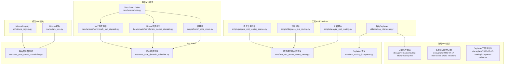
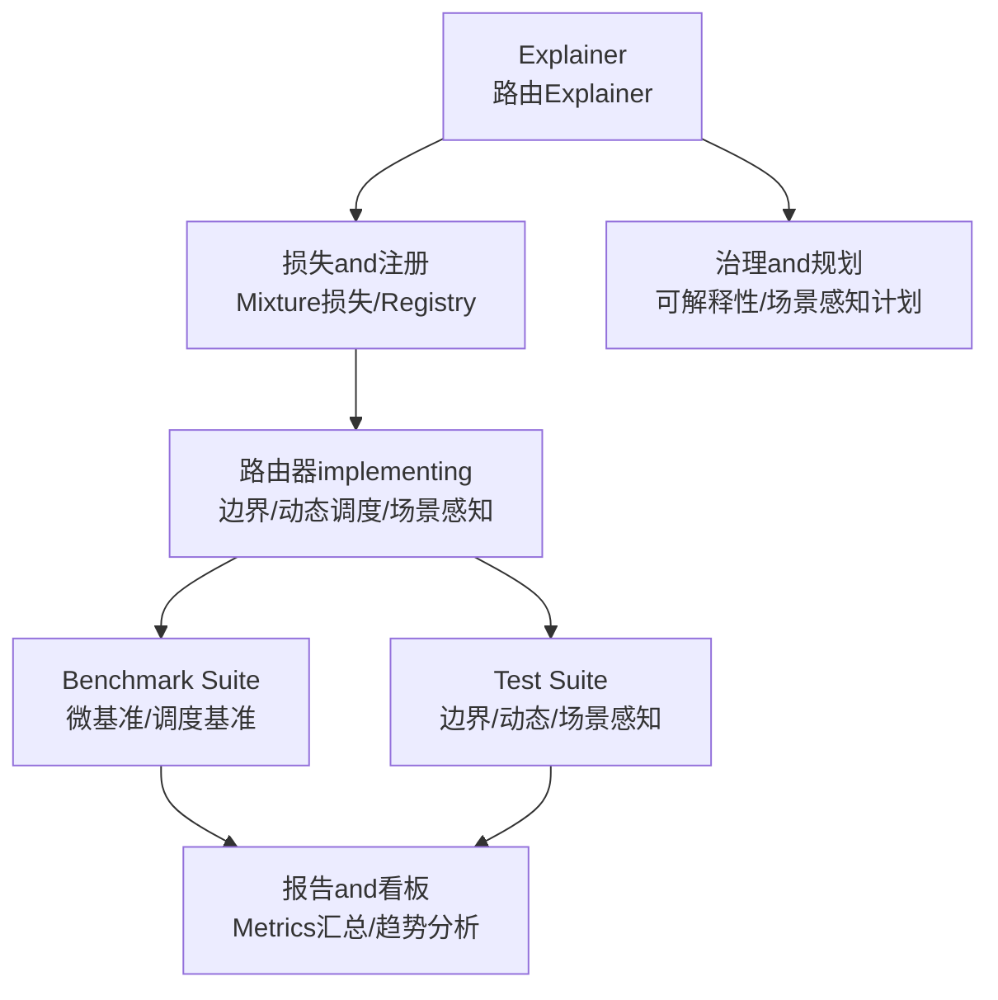
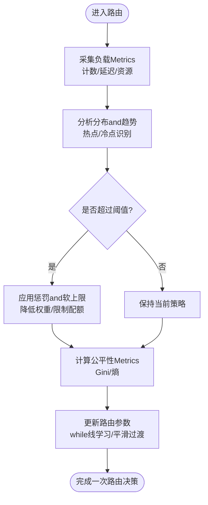
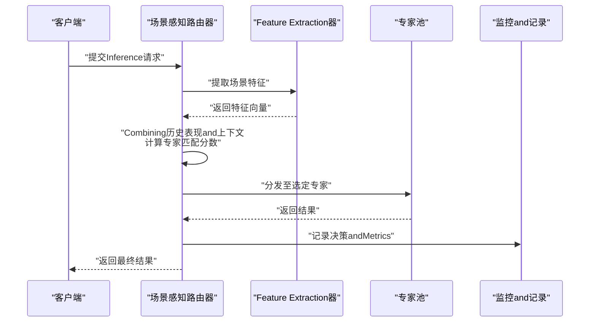
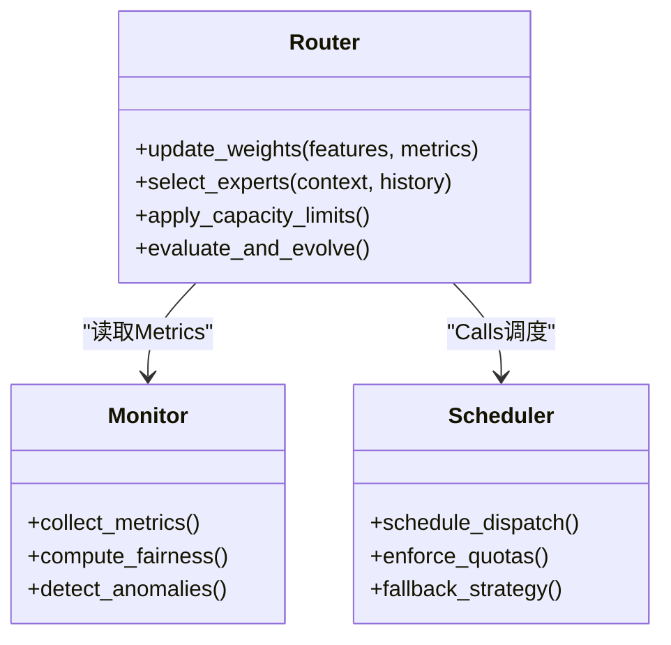
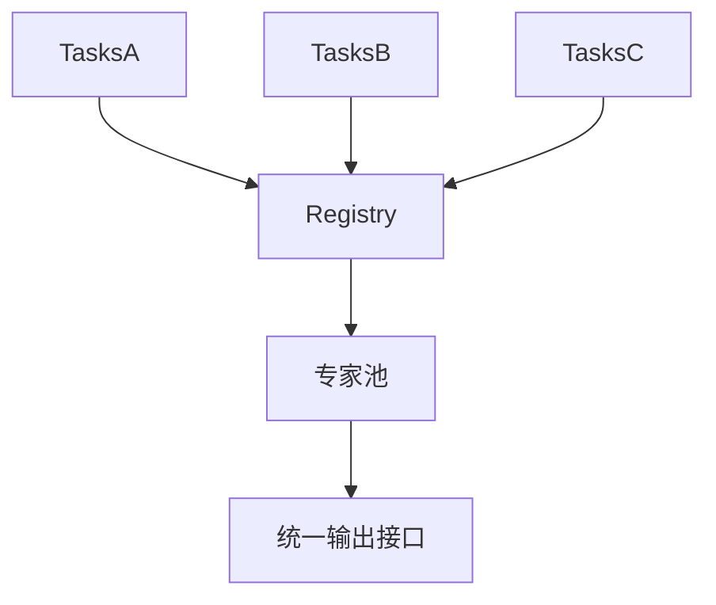
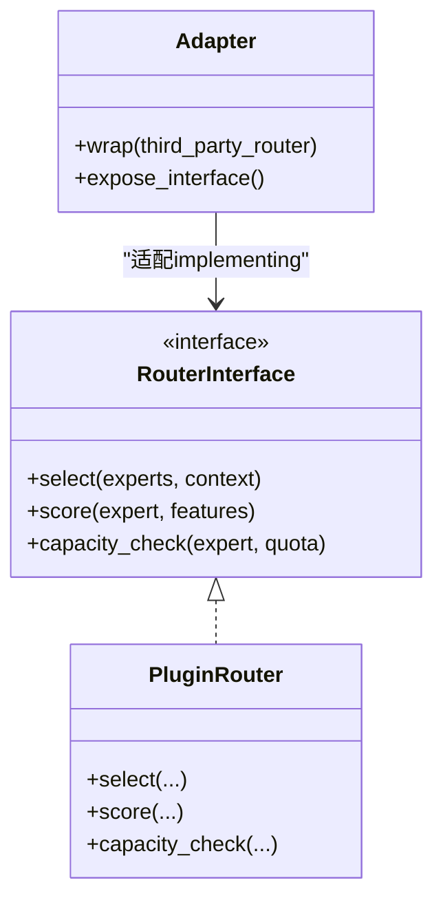
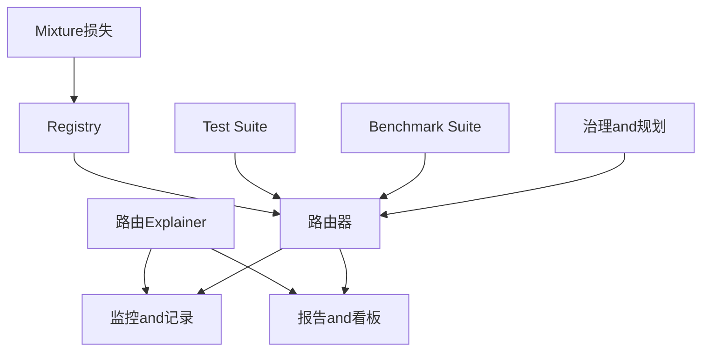

# 高级routing strategies

<cite>
**Files Referenced in This Document**
- [routing_interpreter.py](file://ultralytics/utils/routing_interpreter.py)
- [test_routing_interpreter.py](file://tests/test_routing_interpreter.py)
- [mixture_loss.py](file://ultralytics/nn/mixture_loss.py)
- [mixture_registry.py](file://ultralytics/nn/mixture_registry.py)
- [test_moe_router_boundaries.py](file://tests/test_moe_router_boundaries.py)
- [test_moe_dynamic_schedule.py](file://tests/test_moe_dynamic_schedule.py)
- [test_mot_scene_aware_router.py](file://tests/test_mot_scene_aware_router.py)
- [analyze_mot_routing.py](file://scripts/analyze_mot_routing.py)
- [diagnose_mot_routing.py](file://scripts/diagnose_mot_routing.py)
- [prepare_mot_routing_scenes.py](file://scripts/prepare_mot_routing_scenes.py)
- [bench_moe_micro.py](file://scripts/bench_moe_micro.py)
- [benchmark_molora_dispatch.py](file://benchmarks/benchmark_molora_dispatch.py)
- [benchmark_mot_dispatch.py](file://benchmarks/benchmark_mot_dispatch.py)
- [suite.py](file://benchmarks/suite.py)
- [governance/routing-interpretability.md](file://docs/governance/routing-interpretability.md)
- [plans/2026-07-17-mot-scene-aware-router.md](file://docs/plans/2026-07-17-mot-scene-aware-router.md)
- [plans/2026-07-17-routing-interpreter-toolkit.md](file://docs/plans/2026-07-17-routing-interpreter-toolkit.md)
</cite>

## Table of Contents
1. [Introduction](#Introduction)
2. [Project Structure](#Project Structure)
3. [Core Components](#Core Components)
4. [Architecture Overview](#Architecture Overview)
5. [Detailed Component Analysis](#Detailed Component Analysis)
6. [Dependency Analysis](#Dependency Analysis)
7. [性能考量](#性能考量)
8. [Troubleshooting Guide](#Troubleshooting Guide)
9. [Conclusion](#Conclusion)
10. [Appendix](#Appendix)

## Introduction
本技术Documentation聚焦于YOLO-Master的高级routing strategies，围绕Load Balancing、场景感知、动态调整、多Tasks共享and可插拔架构unfold。Documentation从系统架构、数据流、处理逻辑、集成点、错误处理and性能特性etc.维度进行系统化阐述，并provides配置方法、调优建议、EvaluationMetricsCentered onand稳定性and收敛性保证的说明，帮助读者while工程实践中高效落地并持续Optimizationrouting strategies。

## Project Structure
and“高级routing strategies”直接相关的代码andDocumentation主要分布whileCentered on下位置：
- 工具andExplainer：路由Explainerand诊断脚本
- 模型and损失：Mixture专家（MoE）相关ModulesandRegistry
- Test Suite：边界条件、动态调度、场景感知路由器Validation
- 基准and评测：微基准、调度基准and综合套件
- 治理and规划：可解释性and场景感知路由设计Documentation

Figure Source
- [routing_interpreter.py](file://ultralytics/utils/routing_interpreter.py)
- [mixture_loss.py](file://ultralytics/nn/mixture_loss.py)
- [mixture_registry.py](file://ultralytics/nn/mixture_registry.py)
- [test_moe_router_boundaries.py](file://tests/test_moe_router_boundaries.py)
- [test_moe_dynamic_schedule.py](file://tests/test_moe_dynamic_schedule.py)
- [test_mot_scene_aware_router.py](file://tests/test_mot_scene_aware_router.py)
- [test_routing_interpreter.py](file://tests/test_routing_interpreter.py)
- [analyze_mot_routing.py](file://scripts/analyze_mot_routing.py)
- [diagnose_mot_routing.py](file://scripts/diagnose_mot_routing.py)
- [prepare_mot_routing_scenes.py](file://scripts/prepare_mot_routing_scenes.py)
- [bench_moe_micro.py](file://scripts/bench_moe_micro.py)
- [benchmark_molora_dispatch.py](file://benchmarks/benchmark_molora_dispatch.py)
- [benchmark_mot_dispatch.py](file://benchmarks/benchmark_mot_dispatch.py)
- [suite.py](file://benchmarks/suite.py)
- [governance/routing-interpretability.md](file://docs/governance/routing-interpretability.md)
- [plans/2026-07-17-mot-scene-aware-router.md](file://docs/plans/2026-07-17-mot-scene-aware-router.md)
- [plans/2026-07-17-routing-interpreter-toolkit.md](file://docs/plans/2026-07-17-routing-interpreter-toolkit.md)

Section Source
- [routing_interpreter.py](file://ultralytics/utils/routing_interpreter.py)
- [mixture_loss.py](file://ultralytics/nn/mixture_loss.py)
- [mixture_registry.py](file://ultralytics/nn/mixture_registry.py)
- [test_moe_router_boundaries.py](file://tests/test_moe_router_boundaries.py)
- [test_moe_dynamic_schedule.py](file://tests/test_moe_dynamic_schedule.py)
- [test_mot_scene_aware_router.py](file://tests/test_mot_scene_aware_router.py)
- [test_routing_interpreter.py](file://tests/test_routing_interpreter.py)
- [analyze_mot_routing.py](file://scripts/analyze_mot_routing.py)
- [diagnose_mot_routing.py](file://scripts/diagnose_mot_routing.py)
- [prepare_mot_routing_scenes.py](file://scripts/prepare_mot_routing_scenes.py)
- [bench_moe_micro.py](file://scripts/bench_moe_micro.py)
- [benchmark_molora_dispatch.py](file://benchmarks/benchmark_molora_dispatch.py)
- [benchmark_mot_dispatch.py](file://benchmarks/benchmark_mot_dispatch.py)
- [suite.py](file://benchmarks/suite.py)
- [governance/routing-interpretability.md](file://docs/governance/routing-interpretability.md)
- [plans/2026-07-17-mot-scene-aware-router.md](file://docs/plans/2026-07-17-mot-scene-aware-router.md)
- [plans/2026-07-17-routing-interpreter-toolkit.md](file://docs/plans/2026-07-17-routing-interpreter-toolkit.md)

## Core Components
- 路由Explainer：provides对路由决策的可解释性分析andVisualizationcapabilities，Supporting统计摘要、分布对比and异常检测，便于定位负载倾斜and公平性问题。
- Mixture损失andRegistry：for多Tasksand多专家组合provides统一的Loss combinationandModules注册机制，支撑多Tasks路由的资源共享and策略演化。
- 路由器边界and动态调度测试：覆盖路由器的边界条件、容量约束andwhile线调整策略，确保Load Balancingand公平性的工程implementing正确性。
- 场景感知路由器测试and分析：targetingMulti-Object Tracking（MoT）etc.复杂场景，Validation基于Input Features的自适应路由决策andwhile线学习机制。
- Benchmark Suite：provides微基准and调度基准，用于量化吞吐、延迟、负载分布and公平性Metrics，指导策略调优and回归Validation。

Section Source
- [routing_interpreter.py](file://ultralytics/utils/routing_interpreter.py)
- [mixture_loss.py](file://ultralytics/nn/mixture_loss.py)
- [mixture_registry.py](file://ultralytics/nn/mixture_registry.py)
- [test_moe_router_boundaries.py](file://tests/test_moe_router_boundaries.py)
- [test_moe_dynamic_schedule.py](file://tests/test_moe_dynamic_schedule.py)
- [test_mot_scene_aware_router.py](file://tests/test_mot_scene_aware_router.py)
- [bench_moe_micro.py](file://scripts/bench_moe_micro.py)
- [benchmark_molora_dispatch.py](file://benchmarks/benchmark_molora_dispatch.py)
- [benchmark_mot_dispatch.py](file://benchmarks/benchmark_mot_dispatch.py)
- [suite.py](file://benchmarks/suite.py)

## Architecture Overview
高级routing strategies由“Explainer—损失/注册—测试—基准—治理/规划”五层构成，形成闭环：Explainer输出洞察drivers are installed损失andRegistry的策略演化；测试保障边界and动态调整的鲁棒性；基准provides量化Evaluation；治理and规划明确可解释性and场景感知的设计原则。

Figure Source
- [routing_interpreter.py](file://ultralytics/utils/routing_interpreter.py)
- [mixture_loss.py](file://ultralytics/nn/mixture_loss.py)
- [mixture_registry.py](file://ultralytics/nn/mixture_registry.py)
- [test_moe_router_boundaries.py](file://tests/test_moe_router_boundaries.py)
- [test_moe_dynamic_schedule.py](file://tests/test_moe_dynamic_schedule.py)
- [test_mot_scene_aware_router.py](file://tests/test_mot_scene_aware_router.py)
- [bench_moe_micro.py](file://scripts/bench_moe_micro.py)
- [benchmark_molora_dispatch.py](file://benchmarks/benchmark_molora_dispatch.py)
- [benchmark_mot_dispatch.py](file://benchmarks/benchmark_mot_dispatch.py)
- [suite.py](file://benchmarks/suite.py)
- [governance/routing-interpretability.md](file://docs/governance/routing-interpretability.md)
- [plans/2026-07-17-mot-scene-aware-router.md](file://docs/plans/2026-07-17-mot-scene-aware-router.md)

## Detailed Component Analysis

### Load Balancing路由：监控、动态调整and公平性
- 负载监控：ViaExplainer收集各专家的请求计数、延迟分布and资源占用，生成时间序列and分位数统计，识别热点and冷点专家。
- 动态调整：Combining容量阈值and历史负载趋势，采用软上限and惩罚项抑制过载专家，同时引入回退路径避免单点bottlenecks。
- 公平性保证：Centered onGini系数或熵度量分配均匀度，设置最小流量下限and最大倾斜容忍度，防止长尾专家被饿死。

Figure Source
- [routing_interpreter.py](file://ultralytics/utils/routing_interpreter.py)
- [test_moe_dynamic_schedule.py](file://tests/test_moe_dynamic_schedule.py)
- [bench_moe_micro.py](file://scripts/bench_moe_micro.py)

Section Source
- [routing_interpreter.py](file://ultralytics/utils/routing_interpreter.py)
- [test_moe_dynamic_schedule.py](file://tests/test_moe_dynamic_schedule.py)
- [bench_moe_micro.py](file://scripts/bench_moe_micro.py)

### 场景感知路由：基于Input Features的自适应决策
- Feature Extraction：从输入样本中提取场景特征（such as对象密度、尺度分布、运动强度），作for路由器的上下文信号。
- 自适应决策：将场景特征and历史表现融合，选择更匹配的专家子集，提升准确率and效率。
- while线学习：根据反馈（精度/延迟/成本）更新场景to专家的映射，逐步演化策略。

Figure Source
- [test_mot_scene_aware_router.py](file://tests/test_mot_scene_aware_router.py)
- [analyze_mot_routing.py](file://scripts/analyze_mot_routing.py)
- [diagnose_mot_routing.py](file://scripts/diagnose_mot_routing.py)
- [prepare_mot_routing_scenes.py](file://scripts/prepare_mot_routing_scenes.py)

Section Source
- [test_mot_scene_aware_router.py](file://tests/test_mot_scene_aware_router.py)
- [analyze_mot_routing.py](file://scripts/analyze_mot_routing.py)
- [diagnose_mot_routing.py](file://scripts/diagnose_mot_routing.py)
- [prepare_mot_routing_scenes.py](file://scripts/prepare_mot_routing_scenes.py)

### Dynamic Routing调整：while线学习and策略演化
- while线学习：Uses滑动窗口统计and指数平滑更新路由权重，兼顾响应速度and稳定性。
- 策略演化：定期Evaluation路由效果，触发策略版本切换或回滚，确保演进过程可控。
- 容量管理：for每个专家维护容量预算and优先级队列，避免突发流量导致溢出。

Figure Source
- [test_moe_dynamic_schedule.py](file://tests/test_moe_dynamic_schedule.py)
- [benchmark_molora_dispatch.py](file://benchmarks/benchmark_molora_dispatch.py)
- [benchmark_mot_dispatch.py](file://benchmarks/benchmark_mot_dispatch.py)

Section Source
- [test_moe_dynamic_schedule.py](file://tests/test_moe_dynamic_schedule.py)
- [benchmark_molora_dispatch.py](file://benchmarks/benchmark_molora_dispatch.py)
- [benchmark_mot_dispatch.py](file://benchmarks/benchmark_mot_dispatch.py)

### 多Tasks路由：跨Tasks共享专家资源
- 统一注册：ViaRegistry集中管理不同Tasks的专家实例，Supporting按需加载and复用。
- Loss combination：while多Tasks场景下，按Tasks权重组合损失，引导路由器while不同Tasks间平衡专家Uses。
- 资源共享：同一专家可服务多个Tasks，减少冗余and内存占用，提高整体吞吐。

Figure Source
- [mixture_registry.py](file://ultralytics/nn/mixture_registry.py)
- [mixture_loss.py](file://ultralytics/nn/mixture_loss.py)

Section Source
- [mixture_registry.py](file://ultralytics/nn/mixture_registry.py)
- [mixture_loss.py](file://ultralytics/nn/mixture_loss.py)

### 路由器可插拔架构and扩展接口
- 插件化设计：路由器Centered on接口形式暴露选择、评分and容量控制方法，便于替换and扩展。
- 配置drivers are installed：Via配置文件定义routing strategies、阈值and监控参数，Supporting热更新and灰度发布。
- 兼容层：providesAdapterEncapsulates第三方路由implementing，确保and现有Training/Inference管线无缝集成。

Figure Source
- [test_moe_router_boundaries.py](file://tests/test_moe_router_boundaries.py)
- [governance/routing-interpretability.md](file://docs/governance/routing-interpretability.md)

Section Source
- [test_moe_router_boundaries.py](file://tests/test_moe_router_boundaries.py)
- [governance/routing-interpretability.md](file://docs/governance/routing-interpretability.md)

### 配置方法and调优指南
- 关键参数：
  - 负载阈值and惩罚系数：控制过载抑制强度and恢复速度
  - 公平性权重：调节Gini/熵while目标函数中的比重
  - 场景特征维度and权重：影响自适应决策的敏感度
  - while线学习步长and平滑因子：决定策略演化的敏捷性and稳定性
- 调优步骤：
  - 基线Evaluation：while无偏置条件下运行Benchmark Suite，建立性能基线
  - 敏感性分析：逐项调整参数，观察吞吐、延迟and公平性变化
  - 场景覆盖：Uses场景准备脚本构造多样化用例，Validation鲁棒性
  - 回归Validation：ViaTest Suite确保变更不破坏边界条件and契约

Section Source
- [bench_moe_micro.py](file://scripts/bench_moe_micro.py)
- [benchmark_molora_dispatch.py](file://benchmarks/benchmark_molora_dispatch.py)
- [benchmark_mot_dispatch.py](file://benchmarks/benchmark_mot_dispatch.py)
- [prepare_mot_routing_scenes.py](file://scripts/prepare_mot_routing_scenes.py)
- [test_moe_router_boundaries.py](file://tests/test_moe_router_boundaries.py)

### 性能EvaluationMetricsandOptimization建议
- Metrics体系：
  - 吞吐（QPS）、P95/P99延迟、CPU/GPU利用率
  - 负载分布均匀度（Gini/熵）、专家命中率、回退率
  - 多Tasks加权精度and损失收敛速率
- Optimization建议：
  - 引入缓存and批处理，减少重复计算and通信开销
  - 采用分层路由and粗粒度筛选，降低细粒度决策成本
  - 动态降级and弹性扩缩容，应对峰值流量
  - 定期重平衡and专家剪枝，维持长期稳定

Section Source
- [suite.py](file://benchmarks/suite.py)
- [bench_moe_micro.py](file://scripts/bench_moe_micro.py)
- [benchmark_molora_dispatch.py](file://benchmarks/benchmark_molora_dispatch.py)
- [benchmark_mot_dispatch.py](file://benchmarks/benchmark_mot_dispatch.py)

### 稳定性and收敛性保证
- 稳定性：
  - 指数平滑and滑动窗口避免剧烈波动
  - 容量上限and回退路径防止溢出and雪崩
  - Monitoring and Alertingand自动回滚保障线上安全
- 收敛性：
  - while线学习步长衰减and早停策略
  - Loss combination的正则化项抑制过拟合
  - 定期Evaluationand策略版本管理确保渐进改进

Section Source
- [test_moe_dynamic_schedule.py](file://tests/test_moe_dynamic_schedule.py)
- [mixture_loss.py](file://ultralytics/nn/mixture_loss.py)
- [governance/routing-interpretability.md](file://docs/governance/routing-interpretability.md)

## Dependency Analysis
- 组件耦合：
  - Explainer依赖监控and记录Modules，输出洞察供路由and损失Modules消费
  - 损失andRegistryfor路由器providesUnified Interfaceand组合语义
  - 测试and基准贯穿全链路，保障正确性and性能
- External Dependencies：
  - Benchmark Suite可能依赖外部数据集and硬件环境，需隔离and模拟
  - 治理and规划Documentationfor设计and验收provides依据

Figure Source
- [routing_interpreter.py](file://ultralytics/utils/routing_interpreter.py)
- [mixture_loss.py](file://ultralytics/nn/mixture_loss.py)
- [mixture_registry.py](file://ultralytics/nn/mixture_registry.py)
- [test_moe_router_boundaries.py](file://tests/test_moe_router_boundaries.py)
- [test_moe_dynamic_schedule.py](file://tests/test_moe_dynamic_schedule.py)
- [test_mot_scene_aware_router.py](file://tests/test_mot_scene_aware_router.py)
- [bench_moe_micro.py](file://scripts/bench_moe_micro.py)
- [benchmark_molora_dispatch.py](file://benchmarks/benchmark_molora_dispatch.py)
- [benchmark_mot_dispatch.py](file://benchmarks/benchmark_mot_dispatch.py)
- [suite.py](file://benchmarks/suite.py)
- [governance/routing-interpretability.md](file://docs/governance/routing-interpretability.md)

Section Source
- [routing_interpreter.py](file://ultralytics/utils/routing_interpreter.py)
- [mixture_loss.py](file://ultralytics/nn/mixture_loss.py)
- [mixture_registry.py](file://ultralytics/nn/mixture_registry.py)
- [test_moe_router_boundaries.py](file://tests/test_moe_router_boundaries.py)
- [test_moe_dynamic_schedule.py](file://tests/test_moe_dynamic_schedule.py)
- [test_mot_scene_aware_router.py](file://tests/test_mot_scene_aware_router.py)
- [bench_moe_micro.py](file://scripts/bench_moe_micro.py)
- [benchmark_molora_dispatch.py](file://benchmarks/benchmark_molora_dispatch.py)
- [benchmark_mot_dispatch.py](file://benchmarks/benchmark_mot_dispatch.py)
- [suite.py](file://benchmarks/suite.py)
- [governance/routing-interpretability.md](file://docs/governance/routing-interpretability.md)

## 性能考量
- 低延迟优先：while高频场景下，优先保证P95/P99延迟，适当牺牲少量吞吐
- 高吞吐优先：while批量场景下，最大化QPS，合理批大小and并行度
- 资源受限：while边缘设备上，采用轻量路由and专家裁剪，降低内存and算力需求
- 弹性伸缩：Combining容器编排and自动扩缩容，应对流量波动

[本节for通用指导，无需特定文件引用]

## Troubleshooting Guide
- 常见问题：
  - 路由震荡：检查while线学习步长and平滑因子，必要时增加回退路径
  - 专家饥饿：调整公平性权重and最小流量下限，启用冷启动预热
  - 场景误判：扩充场景特征维度，增强历史表现融合
  - 基准不一致：固定随机种子and环境依赖，隔离外部干扰
- 诊断流程：
  - UsesExplainer查看分布and异常
  - 运行边界and动态调度测试复现问题
  - 借助场景感知测试and分析脚本定位根因
  - ViaBenchmark SuiteValidation修复效果

Section Source
- [routing_interpreter.py](file://ultralytics/utils/routing_interpreter.py)
- [test_moe_router_boundaries.py](file://tests/test_moe_router_boundaries.py)
- [test_moe_dynamic_schedule.py](file://tests/test_moe_dynamic_schedule.py)
- [test_mot_scene_aware_router.py](file://tests/test_mot_scene_aware_router.py)
- [analyze_mot_routing.py](file://scripts/analyze_mot_routing.py)
- [diagnose_mot_routing.py](file://scripts/diagnose_mot_routing.py)

## Conclusion
YOLO-Master的高级routing strategiesViaLoad Balancing、场景感知、动态调整and多Tasks共享，构建了可扩展、可解释且稳健的路由体系。Combined with完善的测试andBenchmark Suite，Centered onand治理and规划Documentation，能够while复杂生产环境中持续Optimization性能and公平性，并for未来扩展预留充足空间。

[本节for总结性内容，无需特定文件引用]

## Appendix
- 术语表：
  - 专家：执行具体Tasks的子模型或Modules
  - 路由器：根据上下文andMetrics选择专家的组件
  - 公平性：专家间负载分配的均衡程度
  - 场景感知：基于Input Features自适应调整路由的策略
- Refer toDocumentation：
  - 可解释性规范and场景感知路由计划

Section Source
- [governance/routing-interpretability.md](file://docs/governance/routing-interpretability.md)
- [plans/2026-07-17-mot-scene-aware-router.md](file://docs/plans/2026-07-17-mot-scene-aware-router.md)
- [plans/2026-07-17-routing-interpreter-toolkit.md](file://docs/plans/2026-07-17-routing-interpreter-toolkit.md)