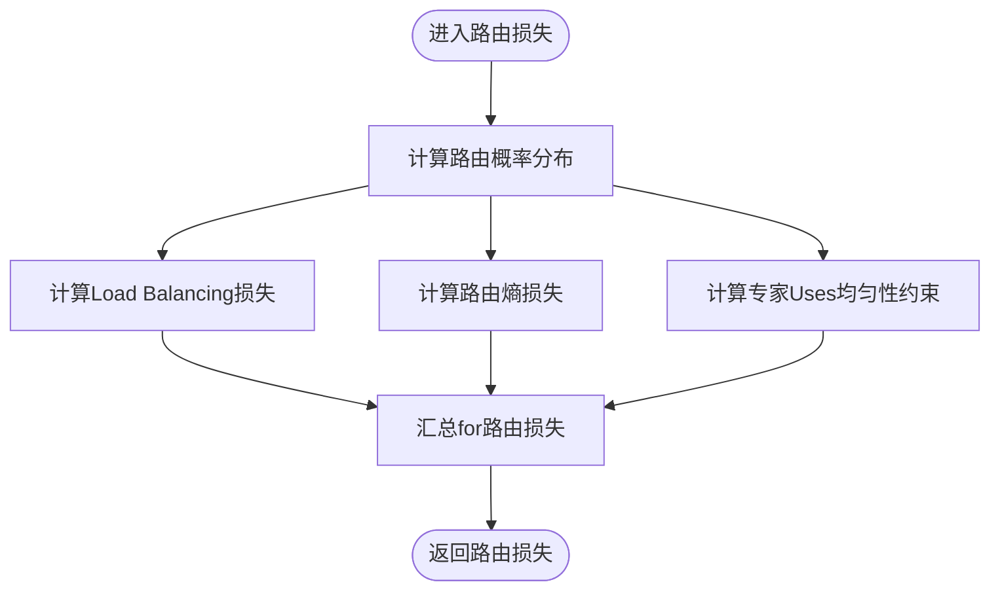
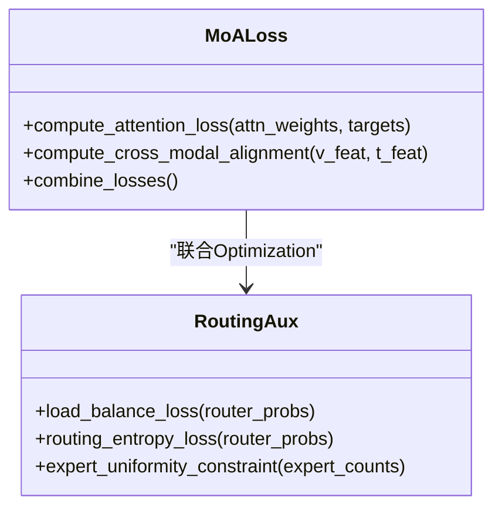
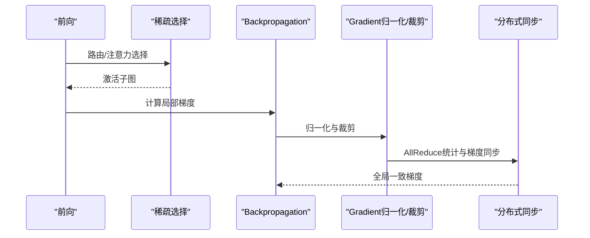
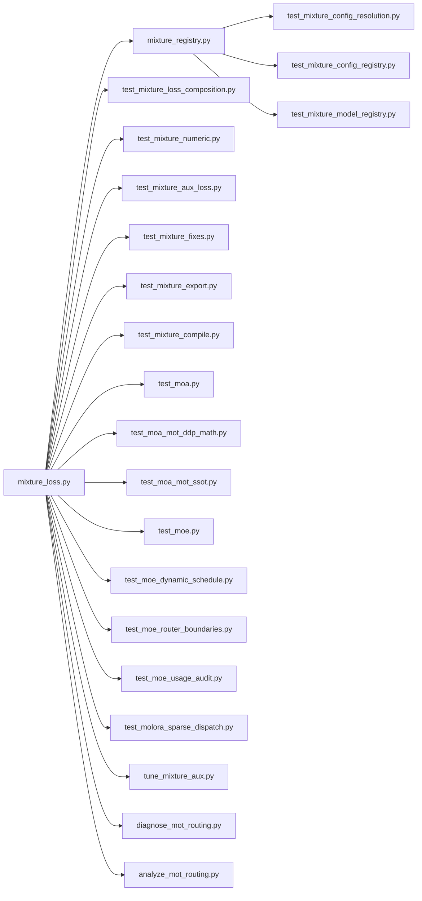

# MixtureLoss Function

<cite>
**Files Referenced in This Document**
- [mixture_loss.py](file://ultralytics/nn/mixture_loss.py)
- [mixture_registry.py](file://ultralytics/nn/mixture_registry.py)
- [test_mixture_loss_composition.py](file://tests/test_mixture_loss_composition.py)
- [test_mixture_numeric.py](file://tests/test_mixture_numeric.py)
- [test_mixture_config_resolution.py](file://tests/test_mixture_config_resolution.py)
- [test_mixture_config_registry.py](file://tests/test_mixture_config_registry.py)
- [test_mixture_fixes.py](file://tests/test_mixture_fixes.py)
- [test_mixture_export.py](file://tests/test_mixture_export.py)
- [test_mixture_compile.py](file://tests/test_mixture_compile.py)
- [test_mixture_model_registry.py](file://tests/test_mixture_model_registry.py)
- [test_mixture_aux_loss.py](file://tests/test_mixture_aux_loss.py)
- [test_moa.py](file://tests/test_moa.py)
- [test_moa_mot_ddp_math.py](file://tests/test_moa_mot_ddp_math.py)
- [test_moa_mot_ssot.py](file://tests/test_moa_mot_ssot.py)
- [test_moe.py](file://tests/test_moe.py)
- [test_moe_dynamic_schedule.py](file://tests/test_moe_dynamic_schedule.py)
- [test_moe_router_boundaries.py](file://tests/test_moe_router_boundaries.py)
- [test_moe_usage_audit.py](file://tests/test_moe_usage_audit.py)
- [test_molora_sparse_dispatch.py](file://tests/test_molora_sparse_dispatch.py)
- [tune_mixture_aux.py](file://scripts/tune_mixture_aux.py)
- [diagnose_mot_routing.py](file://scripts/diagnose_mot_routing.py)
- [analyze_mot_routing.py](file://scripts/analyze_mot_routing.py)
</cite>

## Table of Contents
1. [Introduction](#Introduction)
2. [Project Structure](#Project Structure)
3. [Core Components](#Core Components)
4. [Architecture Overview](#Architecture Overview)
5. [Detailed Component Analysis](#Detailed Component Analysis)
6. [Dependency Analysis](#Dependency Analysis)
7. [性能and数值稳定性](#性能and数值稳定性)
8. [Troubleshooting Guide](#Troubleshooting Guide)
9. [Conclusion](#Conclusion)
10. [Appendix](#Appendix)

## Introduction
本文件targetingYOLO-Master的MoE（Mixture of Experts）andMoA（Mixture of Attention）MixtureLoss Function，系统性阐述其数学原理、设计目标、implementing要点andTraining策略。内容覆盖：
- 主Tasks损失andAuxiliary Loss的平衡策略
- 路由损失的设计：Load Balancing损失、路由熵损失、专家Uses均匀性约束
- MoA特有的注意力损失and跨模态对齐损失
- Gradient流andBackpropagation机制，稀疏Gradient的处理
- 损失权重的动态调整and自适应策略
- 不同Tasks下的损失变体and配置选项
- 调试and监控工具方法
- 数值稳定性andTraining稳定性保证
- andOptimizer的Combined withUsesand调参建议

## Project Structure
Mixture损失相关代码集中while模型层and测试/脚本中：
- 核心implementing：ultralytics/nn/mixture_loss.py
- Registryand配置解析：ultralytics/nn/mixture_registry.py
- 单元测试：tests/*_mixture*.py、tests/test_moa*.py、tests/test_moe*.py、tests/test_molora*.py
- 辅助脚本：scripts/tune_mixture_aux.py、scripts/diagnose_mot_routing.py、scripts/analyze_mot_routing.py

```mermaid
graph TB
subgraph "核心implementing"
ML["mixture_loss.py"]
MR["mixture_registry.py"]
end
subgraph "Test Suite"
T1["test_mixture_loss_composition.py"]
T2["test_mixture_numeric.py"]
T3["test_mixture_config_resolution.py"]
T4["test_mixture_config_registry.py"]
T5["test_mixture_fixes.py"]
T6["test_mixture_export.py"]
T7["test_mixture_compile.py"]
T8["test_mixture_model_registry.py"]
T9["test_mixture_aux_loss.py"]
TM["test_moa.py"]
TM2["test_moa_mot_ddp_math.py"]
TM3["test_moa_mot_ssot.py"]
TE["test_moe.py"]
TEDS["test_moe_dynamic_schedule.py"]
TERB["test_moe_router_boundaries.py"]
TEUA["test_moe_usage_audit.py"]
TMLR["test_molora_sparse_dispatch.py"]
end
subgraph "辅助脚本"
S1["tune_mixture_aux.py"]
S2["diagnose_mot_routing.py"]
S3["analyze_mot_routing.py"]
end
ML --> MR
T1 --> ML
T2 --> ML
T3 --> MR
T4 --> MR
T5 --> ML
T6 --> ML
T7 --> ML
T8 --> MR
T9 --> ML
TM --> ML
TM2 --> ML
TM3 --> ML
TE --> ML
TEDS --> ML
TERB --> ML
TEUA --> ML
TMLR --> ML
S1 --> ML
S2 --> ML
S3 --> ML
```



Figure Source
- [mixture_loss.py](file://ultralytics/nn/mixture_loss.py)
- [mixture_registry.py](file://ultralytics/nn/mixture_registry.py)
- [test_mixture_loss_composition.py](file://tests/test_mixture_loss_composition.py)
- [test_mixture_numeric.py](file://tests/test_mixture_numeric.py)
- [test_mixture_config_resolution.py](file://tests/test_mixture_config_resolution.py)
- [test_mixture_config_registry.py](file://tests/test_mixture_config_registry.py)
- [test_mixture_fixes.py](file://tests/test_mixture_fixes.py)
- [test_mixture_export.py](file://tests/test_mixture_export.py)
- [test_mixture_compile.py](file://tests/test_mixture_compile.py)
- [test_mixture_model_registry.py](file://tests/test_mixture_model_registry.py)
- [test_mixture_aux_loss.py](file://tests/test_mixture_aux_loss.py)
- [test_moa.py](file://tests/test_moa.py)
- [test_moa_mot_ddp_math.py](file://tests/test_moa_mot_ddp_math.py)
- [test_moa_mot_ssot.py](file://tests/test_moa_mot_ssot.py)
- [test_moe.py](file://tests/test_moe.py)
- [test_moe_dynamic_schedule.py](file://tests/test_moe_dynamic_schedule.py)
- [test_moe_router_boundaries.py](file://tests/test_moe_router_boundaries.py)
- [test_moe_usage_audit.py](file://tests/test_moe_usage_audit.py)
- [test_molora_sparse_dispatch.py](file://tests/test_molora_sparse_dispatch.py)
- [tune_mixture_aux.py](file://scripts/tune_mixture_aux.py)
- [diagnose_mot_routing.py](file://scripts/diagnose_mot_routing.py)
- [analyze_mot_routing.py](file://scripts/analyze_mot_routing.py)

Section Source
- [mixture_loss.py](file://ultralytics/nn/mixture_loss.py)
- [mixture_registry.py](file://ultralytics/nn/mixture_registry.py)
- [test_mixture_loss_composition.py](file://tests/test_mixture_loss_composition.py)
- [test_mixture_numeric.py](file://tests/test_mixture_numeric.py)
- [test_mixture_config_resolution.py](file://tests/test_mixture_config_resolution.py)
- [test_mixture_config_registry.py](file://tests/test_mixture_config_registry.py)
- [test_mixture_fixes.py](file://tests/test_mixture_fixes.py)
- [test_mixture_export.py](file://tests/test_mixture_export.py)
- [test_mixture_compile.py](file://tests/test_mixture_compile.py)
- [test_mixture_model_registry.py](file://tests/test_mixture_model_registry.py)
- [test_mixture_aux_loss.py](file://tests/test_mixture_aux_loss.py)
- [test_moa.py](file://tests/test_moa.py)
- [test_moa_mot_ddp_math.py](file://tests/test_moa_mot_ddp_math.py)
- [test_moa_mot_ssot.py](file://tests/test_moa_mot_ssot.py)
- [test_moe.py](file://tests/test_moe.py)
- [test_moe_dynamic_schedule.py](file://tests/test_moe_dynamic_schedule.py)
- [test_moe_router_boundaries.py](file://tests/test_moe_router_boundaries.py)
- [test_moe_usage_audit.py](file://tests/test_moe_usage_audit.py)
- [test_molora_sparse_dispatch.py](file://tests/test_molora_sparse_dispatch.py)
- [tune_mixture_aux.py](file://scripts/tune_mixture_aux.py)
- [diagnose_mot_routing.py](file://scripts/diagnose_mot_routing.py)
- [analyze_mot_routing.py](file://scripts/analyze_mot_routing.py)

## Core Components
- MixtureLoss combination器：负责将主Tasks损失and各类Auxiliary Loss按权重组合，Supporting动态权重and调度策略。
- 路由损失Modules：包含Load Balancing损失、路由熵损失、专家Uses均匀性约束etc.，用于稳定MoE/MoATraining。
- MoA注意力损失and跨模态对齐损失：针对Multimodal Fusion场景，提升注意力分布质量and模态间一致性。
- 配置and注册中心：provides损失项的注册、解析、默认值and版本兼容管理。
- 数值稳定and稀疏Gradient处理：whilesoftmax、logsumexp、指数加权平均etc.关键路径上引入稳定化技巧；对稀疏激活进行归一化and裁剪。

Section Source
- [mixture_loss.py](file://ultralytics/nn/mixture_loss.py)
- [mixture_registry.py](file://ultralytics/nn/mixture_registry.py)
- [test_mixture_loss_composition.py](file://tests/test_mixture_loss_composition.py)
- [test_mixture_numeric.py](file://tests/test_mixture_numeric.py)
- [test_mixture_aux_loss.py](file://tests/test_mixture_aux_loss.py)

## Architecture Overview
下图展示了Mixture损失whileTraining流程中的位置and交互关系，包括主Tasks分支、MoE路由分支、MoA注意力分支Centered onandAuxiliary Loss汇聚点。

```mermaid
sequenceDiagram
participant Train as "Training循环"
participant Model as "模型前向"
participant Router as "路由Modules"
participant Experts as "专家集合"
participant MoA as "MoA注意力"
participant Loss as "MixtureLoss combination器"
participant Opt as "Optimizer"
Train->>Model : 输入批次数据
Model->>Router : 计算路由权重
Router-->>Model : 路由分配/选择
Model->>Experts : 调用被选专家
Experts-->>Model : 专家输出
Model->>MoA : 计算注意力与对齐
MoA-->>Model : 注意力输出
Model-->>Train : 预测结果
Train->>Loss : 主任务损失 + 辅助损失
Loss-->>Train : 总损失
Train->>Opt : 反向传播更新参数
```

Figure Source
- [mixture_loss.py](file://ultralytics/nn/mixture_loss.py)
- [test_mixture_loss_composition.py](file://tests/test_mixture_loss_composition.py)
- [test_moa.py](file://tests/test_moa.py)
- [test_moe.py](file://tests/test_moe.py)

## Detailed Component Analysis

### 主Tasks损失andAuxiliary Loss的平衡策略
- 设计目标：while保证主Tasks收敛，ViaAuxiliary Loss引导路由and注意力学习，避免专家坍缩and模态失配。
- 平衡方式：采用可配置的静态权重或动态调度（such as余弦退火、基于ValidationMetrics的反向调节），并Supporting按阶段切换权重。
- 监控Metrics：主Tasks损失、各Auxiliary Loss分量、总损失、权重变化曲线、专家Uses分布。

Section Source
- [test_mixture_loss_composition.py](file://tests/test_mixture_loss_composition.py)
- [test_mixture_aux_loss.py](file://tests/test_mixture_aux_loss.py)
- [tune_mixture_aux.py](file://scripts/tune_mixture_aux.py)

### 路由损失：Load Balancing、熵正则andUses均匀性
- Load Balancing损失：鼓励样本while各专家间均匀分配，防止“赢家通吃”。
- 路由熵损失：提高路由分布的熵，增强探索性and鲁棒性。
- 专家Uses均匀性约束：统计层面约束专家被Uses的频率接近均匀分布，抑制长尾。
- implementing要点：while路由概率上进行平滑and裁剪，Combining全局统计量进行周期性校正。



Figure Source
- [mixture_loss.py](file://ultralytics/nn/mixture_loss.py)
- [test_moe_router_boundaries.py](file://tests/test_moe_router_boundaries.py)
- [test_moe_usage_audit.py](file://tests/test_moe_usage_audit.py)

Section Source
- [mixture_loss.py](file://ultralytics/nn/mixture_loss.py)
- [test_moe_router_boundaries.py](file://tests/test_moe_router_boundaries.py)
- [test_moe_usage_audit.py](file://tests/test_moe_usage_audit.py)

### MoA注意力损失and跨模态对齐损失
- 注意力损失：约束注意力分布的质量，例such as最大化有效熵、惩罚过度集中或分散。
- 跨模态对齐损失：whileMultimodal输入下，促使视觉and文本（或其他模态）表征while共享空间中对齐，减少模态偏差。
- Applicable Scenarios：开放世界检测、描述生成、Multimodal检索etc.。



Figure Source
- [mixture_loss.py](file://ultralytics/nn/mixture_loss.py)
- [test_moa.py](file://tests/test_moa.py)
- [test_moa_mot_ddp_math.py](file://tests/test_moa_mot_ddp_math.py)
- [test_moa_mot_ssot.py](file://tests/test_moa_mot_ssot.py)

Section Source
- [mixture_loss.py](file://ultralytics/nn/mixture_loss.py)
- [test_moa.py](file://tests/test_moa.py)
- [test_moa_mot_ddp_math.py](file://tests/test_moa_mot_ddp_math.py)
- [test_moa_mot_ssot.py](file://tests/test_moa_mot_ssot.py)

### Gradient流andBackpropagation：稀疏Gradient处理
- 稀疏激活：仅对被选专家and注意力头计算Gradient，降低计算and通信开销。
- 归一化and裁剪：对稀疏Gradient进行范数归一化and阈值裁剪，防止Gradient爆炸。
- 分布式注意：while多卡环境下，确保路由统计量的AllReduce同步，保持Load Balancing的一致性。



Figure Source
- [mixture_loss.py](file://ultralytics/nn/mixture_loss.py)
- [test_molora_sparse_dispatch.py](file://tests/test_molora_sparse_dispatch.py)
- [test_moe.py](file://tests/test_moe.py)

Section Source
- [mixture_loss.py](file://ultralytics/nn/mixture_loss.py)
- [test_molora_sparse_dispatch.py](file://tests/test_molora_sparse_dispatch.py)
- [test_moe.py](file://tests/test_moe.py)

### 损失权重的动态调整and自适应策略
- 动态权重：根据Validation集Metrics（such asmAP、召回率）或损失趋势自动调整Auxiliary Loss权重。
- 阶段式调度：预热期侧重主Tasks，中期引入路由and对齐，后期微调权重Centered on稳定收敛。
- 监控and回退：当出现NaN或发散时，自动降低权重或切换至保守策略。

Section Source
- [test_mixture_loss_composition.py](file://tests/test_mixture_loss_composition.py)
- [tune_mixture_aux.py](file://scripts/tune_mixture_aux.py)
- [test_mixture_fixes.py](file://tests/test_mixture_fixes.py)

### 不同Tasks下的损失变体and配置选项
- Tasks矩阵：检测、分割、Pose Estimation、Trackingetc.不同Tasks的主损失不同，但共享路由andMoAAuxiliary Loss。
- 配置解析：ViaRegistry加载Tasks特定的损失项and默认权重，Supporting覆盖and扩展。
- 兼容性：保留历史配置键名并providesMigrationTips。

Section Source
- [mixture_registry.py](file://ultralytics/nn/mixture_registry.py)
- [test_mixture_config_resolution.py](file://tests/test_mixture_config_resolution.py)
- [test_mixture_config_registry.py](file://tests/test_mixture_config_registry.py)
- [test_mixture_model_registry.py](file://tests/test_mixture_model_registry.py)

### 调试and监控工具and方法
- 路由Explainer：Visualization路由分布、专家Uses频率and边界行for。
- 诊断脚本：分析Multi-Object Tracking场景下的路由异常and对齐问题。
- 超参搜索：对Auxiliary Loss权重进行网格或贝叶斯搜索，定位最佳组合。

Section Source
- [diagnose_mot_routing.py](file://scripts/diagnose_mot_routing.py)
- [analyze_mot_routing.py](file://scripts/analyze_mot_routing.py)
- [tune_mixture_aux.py](file://scripts/tune_mixture_aux.py)

### 数值稳定性andTraining稳定性保证
- 数值稳定：whilesoftmax/logsumexp中Uses最大值平移、epsilon防除零、对数域运算。
- Gradient稳定：Gradient裁剪、EMA平滑、权重衰减and早停策略。
- 编译andExport：确保whiletorch.compileandExport流程中保持稳定路径and形状。

Section Source
- [test_mixture_numeric.py](file://tests/test_mixture_numeric.py)
- [test_mixture_compile.py](file://tests/test_mixture_compile.py)
- [test_mixture_export.py](file://tests/test_mixture_export.py)

### andOptimizer的Combined withUsesand调参建议
- Optimizer选择：AdamW/SGDand路由/注意力参数的差异化Learning Rate。
- Learning Rate调度：主Tasksand辅助Tasks采用不同的warmupand退火策略。
- 批大小and步数：大batch有助于路由统计稳定，但需相应调整权重andLearning Rate。

Section Source
- [test_mixture_loss_composition.py](file://tests/test_mixture_loss_composition.py)
- [test_mixture_aux_loss.py](file://tests/test_mixture_aux_loss.py)

## Dependency Analysis
Mixture损失ModulesandRegistry、Test Suiteand脚本之间的依赖such as下：



Figure Source
- [mixture_loss.py](file://ultralytics/nn/mixture_loss.py)
- [mixture_registry.py](file://ultralytics/nn/mixture_registry.py)
- [test_mixture_loss_composition.py](file://tests/test_mixture_loss_composition.py)
- [test_mixture_numeric.py](file://tests/test_mixture_numeric.py)
- [test_mixture_aux_loss.py](file://tests/test_mixture_aux_loss.py)
- [test_mixture_fixes.py](file://tests/test_mixture_fixes.py)
- [test_mixture_export.py](file://tests/test_mixture_export.py)
- [test_mixture_compile.py](file://tests/test_mixture_compile.py)
- [test_mixture_config_resolution.py](file://tests/test_mixture_config_resolution.py)
- [test_mixture_config_registry.py](file://tests/test_mixture_config_registry.py)
- [test_mixture_model_registry.py](file://tests/test_mixture_model_registry.py)
- [test_moa.py](file://tests/test_moa.py)
- [test_moa_mot_ddp_math.py](file://tests/test_moa_mot_ddp_math.py)
- [test_moa_mot_ssot.py](file://tests/test_moa_mot_ssot.py)
- [test_moe.py](file://tests/test_moe.py)
- [test_moe_dynamic_schedule.py](file://tests/test_moe_dynamic_schedule.py)
- [test_moe_router_boundaries.py](file://tests/test_moe_router_boundaries.py)
- [test_moe_usage_audit.py](file://tests/test_moe_usage_audit.py)
- [test_molora_sparse_dispatch.py](file://tests/test_molora_sparse_dispatch.py)
- [tune_mixture_aux.py](file://scripts/tune_mixture_aux.py)
- [diagnose_mot_routing.py](file://scripts/diagnose_mot_routing.py)
- [analyze_mot_routing.py](file://scripts/analyze_mot_routing.py)

Section Source
- [mixture_loss.py](file://ultralytics/nn/mixture_loss.py)
- [mixture_registry.py](file://ultralytics/nn/mixture_registry.py)
- [test_mixture_loss_composition.py](file://tests/test_mixture_loss_composition.py)
- [test_mixture_numeric.py](file://tests/test_mixture_numeric.py)
- [test_mixture_aux_loss.py](file://tests/test_mixture_aux_loss.py)
- [test_mixture_fixes.py](file://tests/test_mixture_fixes.py)
- [test_mixture_export.py](file://tests/test_mixture_export.py)
- [test_mixture_compile.py](file://tests/test_mixture_compile.py)
- [test_mixture_config_resolution.py](file://tests/test_mixture_config_resolution.py)
- [test_mixture_config_registry.py](file://tests/test_mixture_config_registry.py)
- [test_mixture_model_registry.py](file://tests/test_mixture_model_registry.py)
- [test_moa.py](file://tests/test_moa.py)
- [test_moa_mot_ddp_math.py](file://tests/test_moa_mot_ddp_math.py)
- [test_moa_mot_ssot.py](file://tests/test_moa_mot_ssot.py)
- [test_moe.py](file://tests/test_moe.py)
- [test_moe_dynamic_schedule.py](file://tests/test_moe_dynamic_schedule.py)
- [test_moe_router_boundaries.py](file://tests/test_moe_router_boundaries.py)
- [test_moe_usage_audit.py](file://tests/test_moe_usage_audit.py)
- [test_molora_sparse_dispatch.py](file://tests/test_molora_sparse_dispatch.py)
- [tune_mixture_aux.py](file://scripts/tune_mixture_aux.py)
- [diagnose_mot_routing.py](file://scripts/diagnose_mot_routing.py)
- [analyze_mot_routing.py](file://scripts/analyze_mot_routing.py)

## 性能and数值稳定性
- 性能：稀疏激活and选择性计算显著降低FLOPsand内存占用；路由统计的异步聚合减少同步开销。
- 数值稳定：对概率分布进行平滑and裁剪，避免极端值；whileLoggingand监控中记录条件数andGradient范数。
- Training稳定：采用EMA、Gradient裁剪、Learning Rate预热and退火，Combining动态权重回退策略。

[This section provides general guidance and does not directly analyze specific files]

## Troubleshooting Guide
- 路由崩溃或专家坍缩：检查Load Balancingand熵正则权重是否过小；查看专家Uses审计and路由边界测试。
- NaN或发散：启用数值稳定性测试路径，确认softmax/logsumexp的稳定implementing；降低Learning Rate或权重。
- Multimodal对齐失败：检查跨模态对齐损失权重and特征尺度；Uses诊断脚本分析模态偏差。
- 分布式不一致：确认路由统计的AllReduce同步and单源真相（SSOT）约束。

Section Source
- [test_moe_router_boundaries.py](file://tests/test_moe_router_boundaries.py)
- [test_moe_usage_audit.py](file://tests/test_moe_usage_audit.py)
- [test_mixture_numeric.py](file://tests/test_mixture_numeric.py)
- [test_moa_mot_ssot.py](file://tests/test_moa_mot_ssot.py)
- [diagnose_mot_routing.py](file://scripts/diagnose_mot_routing.py)

## Conclusion
YOLO-Master的Mixture损失体系Via主TasksandAuxiliary Loss的协同Optimization，Combining路由and注意力层面的正则and对齐，implementing了稳健且高效的MoE/MoATraining。借助完善的测试and诊断工具链，可while复杂Tasksand分布式环境中获得稳定的收敛and良好的泛化表现。

[This section is summary content and does not directly analyze specific files]

## Appendix
- 配置Examplesand覆盖方式：Refer toRegistryand配置解析测试用例。
- 超参搜索流程：Refer toAuxiliary Loss权重调优脚本。
- Tasks矩阵and变体：Refer to模型RegistryandTasks相关测试。

Section Source
- [test_mixture_config_resolution.py](file://tests/test_mixture_config_resolution.py)
- [test_mixture_config_registry.py](file://tests/test_mixture_config_registry.py)
- [test_mixture_model_registry.py](file://tests/test_mixture_model_registry.py)
- [tune_mixture_aux.py](file://scripts/tune_mixture_aux.py)