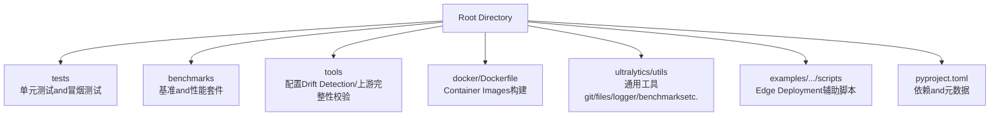
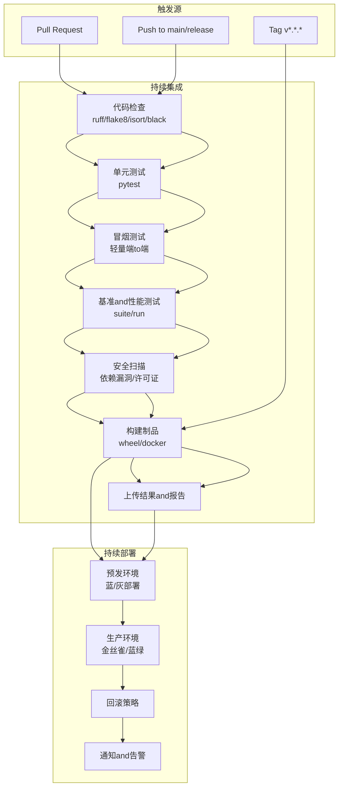
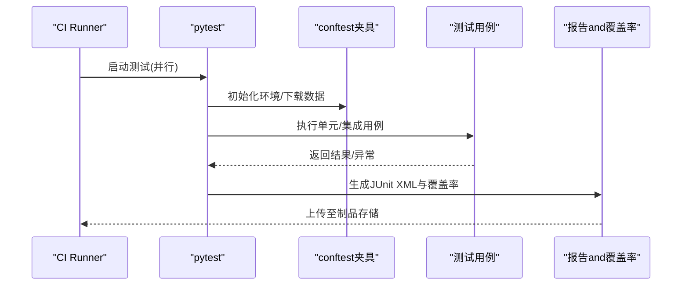
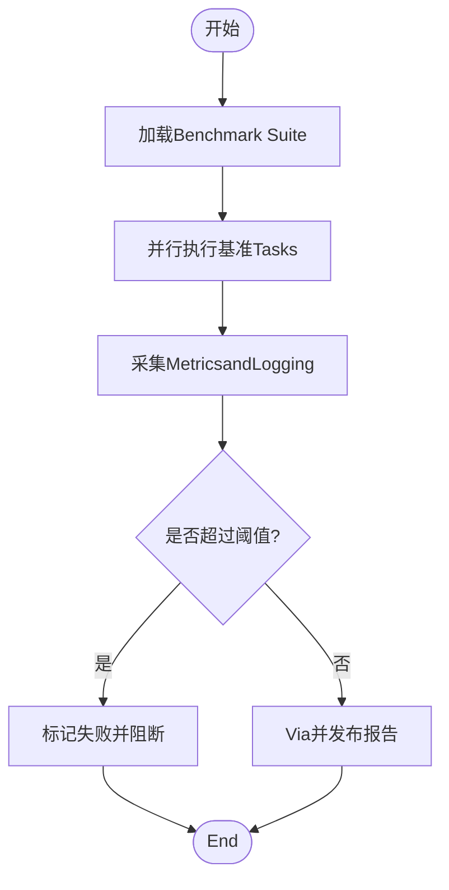
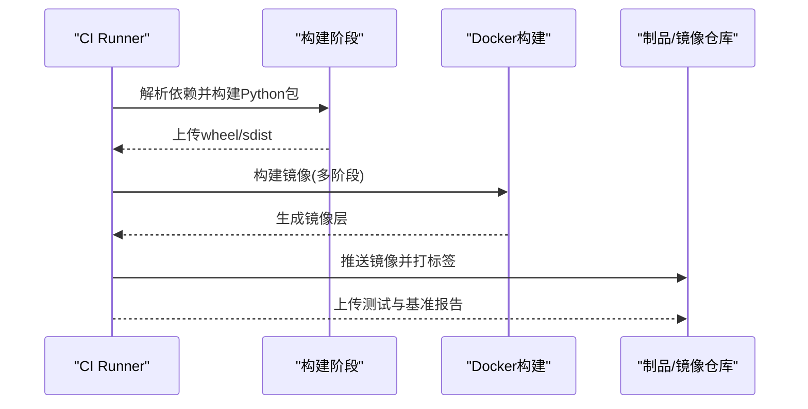
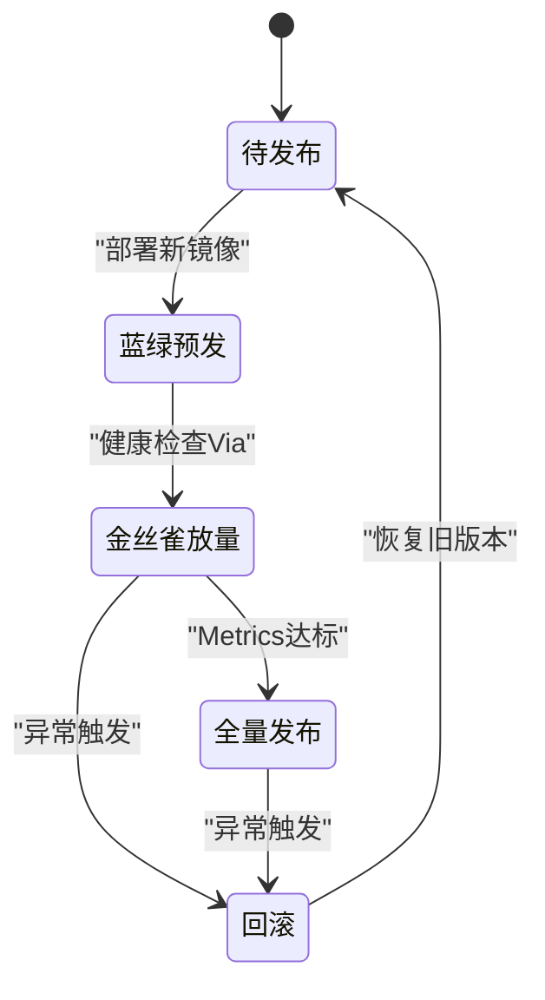
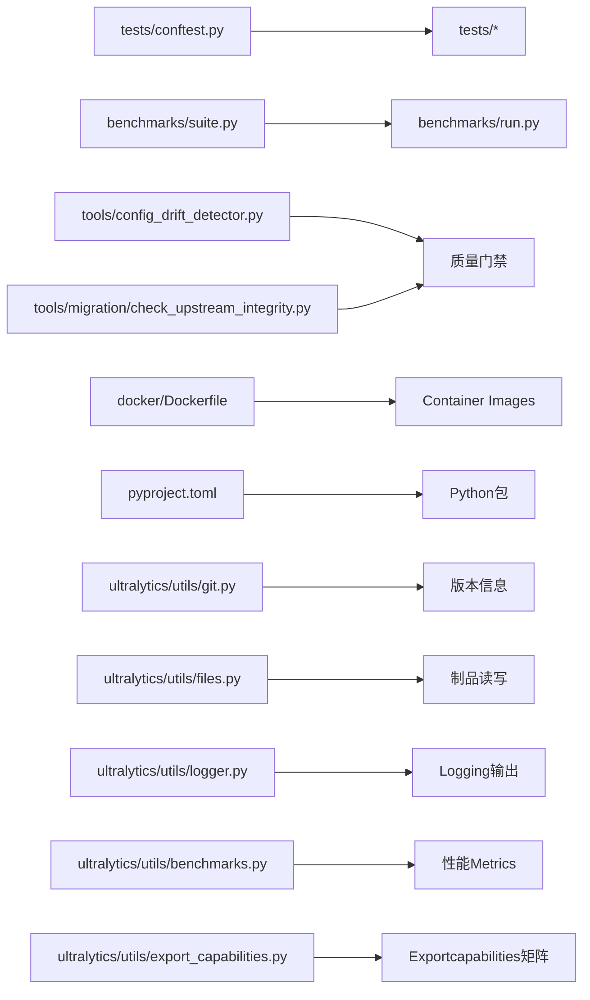

# CI/CD流水线

<cite>
**Files Referenced in This Document**
- [pyproject.toml](file://pyproject.toml)
- [docker/Dockerfile](file://docker/Dockerfile)
- [tests/conftest.py](file://tests/conftest.py)
- [tests/test_cli.py](file://tests/test_cli.py)
- [tests/test_engine.py](file://tests/test_engine.py)
- [tests/test_moe.py](file://tests/test_moe.py)
- [tests/test_moa.py](file://tests/test_moa.py)
- [tests/test_mot.py](file://tests/test_mot.py)
- [tests/test_lora_moe_ddp_control_paths.py](file://tests/test_lora_moe_ddp_control_paths.py)
- [tests/ddp_moe_smoke.py](file://tests/ddp_moe_smoke.py)
- [tests/lora_e2e_smoke.py](file://tests/lora_e2e_smoke.py)
- [scripts/smoke_test_coco2017.py](file://scripts/smoke_test_coco2017.py)
- [benchmarks/suite.py](file://benchmarks/suite.py)
- [benchmarks/run.py](file://benchmarks/run.py)
- [tools/config_drift_detector.py](file://tools/config_drift_detector.py)
- [tools/migration/check_upstream_integrity.py](file://tools/migration/check_upstream_integrity.py)
- [ultralytics/utils/git.py](file://ultralytics/utils/git.py)
- [ultralytics/utils/files.py](file://ultralytics/utils/files.py)
- [ultralytics/utils/logger.py](file://ultralytics/utils/logger.py)
- [ultralytics/utils/benchmarks.py](file://ultralytics/utils/benchmarks.py)
- [ultralytics/utils/export_capabilities.py](file://ultralytics/utils/export_capabilities.py)
- [examples/YOLO-Master-Cross-Platform-Edge-Deployment/scripts/edge_utils.py](file://examples/YOLO-Master-Cross-Platform-Edge-Deployment/scripts/edge_utils.py)
</cite>

## Table of Contents
1. [Introduction](#Introduction)
2. [Project Structure](#Project Structure)
3. [Core Components](#Core Components)
4. [Architecture Overview](#Architecture Overview)
5. [Detailed Component Analysis](#Detailed Component Analysis)
6. [Dependency Analysis](#Dependency Analysis)
7. [Performance Considerations](#Performance Considerations)
8. [Troubleshooting Guide](#Troubleshooting Guide)
9. [Conclusion](#Conclusion)
10. [Appendix](#Appendix)

## Introduction
本技术DocumentationtargetingYOLO-Master的CI/CD流水线，目标是provides一套可落地的持续集成and持续部署方案。内容覆盖：
- GitHub Actions工作流配置（代码检查、单元测试、集成测试、自动化部署）
- 持续集成最佳实践（并行执行、缓存策略、测试结果收集）
- 持续部署流程（蓝绿部署、金丝雀发布、回滚策略）
- 自动化测试策略（单元测试、性能测试、安全扫描）
- 构建Optimization技巧（增量构建、并行编译、产物缓存）
- 版本管理and发布流程（语义化版本控制、变更Logging生成）
- 流水线监控and告警配置方法

说明：仓库中未包含GitHub Actions工作流定义文件。本文基于现有工程结构and工具链，给出可直接落地的流水线设计andimplementing建议，并标注and源码相关的“Section Source”。

## Project Structure
从仓库结构看，本项目具备完善的测试andBenchmark Suite、Docker镜像构建入口、Centered onand若干用于Migrationand质量保障的工具脚本，适合直接接入CI/CD流水线。

**Figure Source**
- [pyproject.toml](file://pyproject.toml)
- [docker/Dockerfile](file://docker/Dockerfile)
- [tests/conftest.py](file://tests/conftest.py)
- [benchmarks/suite.py](file://benchmarks/suite.py)
- [tools/config_drift_detector.py](file://tools/config_drift_detector.py)
- [tools/migration/check_upstream_integrity.py](file://tools/migration/check_upstream_integrity.py)
- [ultralytics/utils/git.py](file://ultralytics/utils/git.py)
- [ultralytics/utils/files.py](file://ultralytics/utils/files.py)
- [ultralytics/utils/logger.py](file://ultralytics/utils/logger.py)
- [ultralytics/utils/benchmarks.py](file://ultralytics/utils/benchmarks.py)
- [ultralytics/utils/export_capabilities.py](file://ultralytics/utils/export_capabilities.py)

**Section Source**
- [pyproject.toml](file://pyproject.toml)
- [docker/Dockerfile](file://docker/Dockerfile)
- [tests/conftest.py](file://tests/conftest.py)

## Core Components
- 测试框架and用例组织
  - pytestfor默认测试运行器，conftestprovides全局夹具and共享配置。
  - 单测覆盖CLI、引擎、MoE/MoA/MoT、LoRA+DDP控制路径etc.关键Modules。
- 基准and性能测试
  - benchmarks/suite.pyandrun.pyprovidesBenchmark Suite编排and运行入口。
  - ultralytics/utils/benchmarks.pyprovides性能度量capabilities。
- 质量and安全工具
  - tools/config_drift_detector.py用于配置Drift Detection。
  - tools/migration/check_upstream_integrity.py用于上游完整性校验。
- 构建and制品
  - docker/Dockerfile用于构建Container Images。
  - pyproject.toml管理依赖and元数据。
- 运行时and工具库
  - ultralytics/utils下providesgit、files、logger、export_capabilitiesetc.通用capabilities，便于whileCI中获取版本信息、读写文件、记录LoggingandExportcapabilities矩阵。

**Section Source**
- [tests/conftest.py](file://tests/conftest.py)
- [tests/test_cli.py](file://tests/test_cli.py)
- [tests/test_engine.py](file://tests/test_engine.py)
- [tests/test_moe.py](file://tests/test_moe.py)
- [tests/test_moa.py](file://tests/test_moa.py)
- [tests/test_mot.py](file://tests/test_mot.py)
- [tests/test_lora_moe_ddp_control_paths.py](file://tests/test_lora_moe_ddp_control_paths.py)
- [tests/ddp_moe_smoke.py](file://tests/ddp_moe_smoke.py)
- [tests/lora_e2e_smoke.py](file://tests/lora_e2e_smoke.py)
- [benchmarks/suite.py](file://benchmarks/suite.py)
- [benchmarks/run.py](file://benchmarks/run.py)
- [tools/config_drift_detector.py](file://tools/config_drift_detector.py)
- [tools/migration/check_upstream_integrity.py](file://tools/migration/check_upstream_integrity.py)
- [docker/Dockerfile](file://docker/Dockerfile)
- [pyproject.toml](file://pyproject.toml)
- [ultralytics/utils/git.py](file://ultralytics/utils/git.py)
- [ultralytics/utils/files.py](file://ultralytics/utils/files.py)
- [ultralytics/utils/logger.py](file://ultralytics/utils/logger.py)
- [ultralytics/utils/benchmarks.py](file://ultralytics/utils/benchmarks.py)
- [ultralytics/utils/export_capabilities.py](file://ultralytics/utils/export_capabilities.py)

## Architecture Overview
下图展示推荐的CI/CD流水线阶段and工件流转关系，涵盖代码检查、测试、基准、构建and部署。

[此图for概念性架构图，不直接映射具体源码文件]

## Detailed Component Analysis

### 代码检查and静态分析
- 建议步骤
  - Installing Dependencies：Viapyproject.toml解析依赖并安装。
  - 格式化and风格检查：Usesruff或flake8/isort/black进行统一风格检查。
  - 类型检查（Optional）：mypy对核心Modules进行类型约束。
  - 规则配置：将忽略项and阈值写入配置文件，避免误报。
- 产出物
  - 检查结果and修复建议；失败则阻断合并。

**Section Source**
- [pyproject.toml](file://pyproject.toml)

### Unit tests and integration tests
- 测试范围
  - CLIand引擎：test_cli.py、test_engine.py
  - MoE/MoA/MoT：test_moe.py、test_moa.py、test_mot.py
  - LoRA+DDP控制路径：test_lora_moe_ddp_control_paths.py
  - 冒烟测试：ddp_moe_smoke.py、lora_e2e_smoke.py
- 运行策略
  - Usespytest-xdist并行执行，按Modules划分Tasks。
  - 设置超时and重试，隔离不稳定用例。
  - 输出JUnit XMLand覆盖率报告，供平台聚合。
- 数据and资源
  - Usesconftest.py集中管理临时Table of Contents、数据集下载and清理。
  - 对大型数据集采用缓存and最小化子集。

**Figure Source**
- [tests/conftest.py](file://tests/conftest.py)
- [tests/test_cli.py](file://tests/test_cli.py)
- [tests/test_engine.py](file://tests/test_engine.py)
- [tests/test_moe.py](file://tests/test_moe.py)
- [tests/test_moa.py](file://tests/test_moa.py)
- [tests/test_mot.py](file://tests/test_mot.py)
- [tests/test_lora_moe_ddp_control_paths.py](file://tests/test_lora_moe_ddp_control_paths.py)
- [tests/ddp_moe_smoke.py](file://tests/ddp_moe_smoke.py)
- [tests/lora_e2e_smoke.py](file://tests/lora_e2e_smoke.py)

**Section Source**
- [tests/conftest.py](file://tests/conftest.py)
- [tests/test_cli.py](file://tests/test_cli.py)
- [tests/test_engine.py](file://tests/test_engine.py)
- [tests/test_moe.py](file://tests/test_moe.py)
- [tests/test_moa.py](file://tests/test_moa.py)
- [tests/test_mot.py](file://tests/test_mot.py)
- [tests/test_lora_moe_ddp_control_paths.py](file://tests/test_lora_moe_ddp_control_paths.py)
- [tests/ddp_moe_smoke.py](file://tests/ddp_moe_smoke.py)
- [tests/lora_e2e_smoke.py](file://tests/lora_e2e_smoke.py)

### 基准and性能测试
- 套件入口
  - benchmarks/suite.py：定义基准场景and参数组合。
  - benchmarks/run.py：批量执行and结果汇总。
- Metrics采集
  - ultralytics/utils/benchmarks.py：吞吐、延迟、内存占用etc.Metrics。
- 策略
  - 仅whilePRtomain分支或标签触发时运行完整基准。
  - 对比历史基线，超阈失败阻断发布。

**Figure Source**
- [benchmarks/suite.py](file://benchmarks/suite.py)
- [benchmarks/run.py](file://benchmarks/run.py)
- [ultralytics/utils/benchmarks.py](file://ultralytics/utils/benchmarks.py)

**Section Source**
- [benchmarks/suite.py](file://benchmarks/suite.py)
- [benchmarks/run.py](file://benchmarks/run.py)
- [ultralytics/utils/benchmarks.py](file://ultralytics/utils/benchmarks.py)

### 安全扫描and合规检查
- 依赖漏洞扫描：Uses安全工具扫描pyproject.toml声明的依赖。
- 许可证合规：检查第三方许可证是否符合要求。
- 上游完整性：tools/migration/check_upstream_integrity.py确保上游依赖未被篡改。

**Section Source**
- [pyproject.toml](file://pyproject.toml)
- [tools/migration/check_upstream_integrity.py](file://tools/migration/check_upstream_integrity.py)

### 构建and制品
- Python包构建
  - 基于pyproject.toml构建wheel/sdist，上传至制品库。
- Container Images构建
  - Usesdocker/Dockerfile构建多阶段镜像，分离构建and运行环境。
  - 推送至镜像仓库并打标签。
- 产物归档
  - 上传测试报告、覆盖率、基准结果and镜像清单。

**Figure Source**
- [docker/Dockerfile](file://docker/Dockerfile)
- [pyproject.toml](file://pyproject.toml)

**Section Source**
- [docker/Dockerfile](file://docker/Dockerfile)
- [pyproject.toml](file://pyproject.toml)

### 持续部署（蓝绿/金丝雀/回滚）
- 蓝绿部署
  - 维护两套相同环境，切换流量指向新版本，Validation后稳定再替换旧版。
- 金丝雀发布
  - 先向小比例User开放新版本，观察Metricsand错误率，逐步放量。
- 回滚策略
  - 自动或手动快速切回上一稳定版本，保留快照and制品Centered on便审计。
- 部署目标
  - 容器编排平台（Kubernetes）、云函数或边缘设备集群。
  - CombiningEdge Deployment脚本进行端to端Validation。

[此图for概念性状态图，不直接映射具体源码文件]

### 版本管理and发布流程
- 语义化版本控制
  - 遵循MAJOR.MINOR.PATCH规范，ViaGit标签drivers are installed发布。
- 变更Logging生成
  - 基于提交信息andPR标题自动生成CHANGELOG。
- 发布门禁
  - 所有检查Via后，方可创建标签and发布制品。
- 版本信息读取
  - 利用ultralytics/utils/git.pyandultralytics/utils/files.py读取当前版本and文件信息。

**Section Source**
- [ultralytics/utils/git.py](file://ultralytics/utils/git.py)
- [ultralytics/utils/files.py](file://ultralytics/utils/files.py)

### 流水线监控and告警
- Metrics采集
  - 记录各阶段耗时、失败率、回归趋势。
- Visualizationand报表
  - 聚合JUnit XMLand覆盖率报告，生成仪表板。
- 告警通道
  - 失败时Via邮件/IM/工单系统通知责任人。
- Loggingand追踪
  - Usesultralytics/utils/logger.py统一Logging格式，便于检索and分析。

**Section Source**
- [ultralytics/utils/logger.py](file://ultralytics/utils/logger.py)

## Dependency Analysis
- 测试and基准
  - tests依赖conftestprovides的夹具andData Preparation。
  - benchmarks依赖suiteandrun进行编排。
- 工具and平台
  - tools下的配置Drift Detectionand上游完整性校验作for质量门禁。
  - docker/Dockerfileandpyproject.toml共同决定构建产物形态。
- 运行时工具
  - ultralytics/utilsprovidesgit、files、logger、benchmarks、export_capabilitiesetc.基础capabilities。

**Figure Source**
- [tests/conftest.py](file://tests/conftest.py)
- [benchmarks/suite.py](file://benchmarks/suite.py)
- [benchmarks/run.py](file://benchmarks/run.py)
- [tools/config_drift_detector.py](file://tools/config_drift_detector.py)
- [tools/migration/check_upstream_integrity.py](file://tools/migration/check_upstream_integrity.py)
- [docker/Dockerfile](file://docker/Dockerfile)
- [pyproject.toml](file://pyproject.toml)
- [ultralytics/utils/git.py](file://ultralytics/utils/git.py)
- [ultralytics/utils/files.py](file://ultralytics/utils/files.py)
- [ultralytics/utils/logger.py](file://ultralytics/utils/logger.py)
- [ultralytics/utils/benchmarks.py](file://ultralytics/utils/benchmarks.py)
- [ultralytics/utils/export_capabilities.py](file://ultralytics/utils/export_capabilities.py)

**Section Source**
- [tests/conftest.py](file://tests/conftest.py)
- [benchmarks/suite.py](file://benchmarks/suite.py)
- [benchmarks/run.py](file://benchmarks/run.py)
- [tools/config_drift_detector.py](file://tools/config_drift_detector.py)
- [tools/migration/check_upstream_integrity.py](file://tools/migration/check_upstream_integrity.py)
- [docker/Dockerfile](file://docker/Dockerfile)
- [pyproject.toml](file://pyproject.toml)
- [ultralytics/utils/git.py](file://ultralytics/utils/git.py)
- [ultralytics/utils/files.py](file://ultralytics/utils/files.py)
- [ultralytics/utils/logger.py](file://ultralytics/utils/logger.py)
- [ultralytics/utils/benchmarks.py](file://ultralytics/utils/benchmarks.py)
- [ultralytics/utils/export_capabilities.py](file://ultralytics/utils/export_capabilities.py)

## Performance Considerations
- 并行执行
  - Usespytest-xdist并行运行测试，按Modules拆分Tasks，缩短整体时长。
- 缓存策略
  - 缓存Python依赖and模型权重，减少重复下载and构建时间。
  - 缓存基准结果and中间产物，Supporting增量比较。
- 增量构建
  - 仅构建受影响的包and镜像层，提升构建效率。
- 资源隔离
  - forGPU/CPU密集型Tasks分配专用Runner，避免相互干扰。
- 结果收集
  - 标准化输出JUnit XMLand覆盖率，便于平台聚合and趋势分析。

[This section provides general guidance and does not directly analyze specific files]

## Troubleshooting Guide
- 常见问题定位
  - 测试失败：查看JUnit XMLandLogging，定位失败用例and堆栈。
  - 基准回归：对比历史基线and阈值，识别退化点。
  - 构建失败：检查依赖解析andDocker构建上下文。
- 诊断工具
  - 配置Drift Detection：tools/config_drift_detector.py用于发现配置变更影响。
  - 上游完整性：tools/migration/check_upstream_integrity.py用于校验上游依赖一致性。
  - 版本and文件：ultralytics/utils/git.pyandultralytics/utils/files.py用于读取版本and文件信息。
  - LoggingandMetrics：ultralytics/utils/logger.pyandultralytics/utils/benchmarks.py用于记录and度量。
- Edge DeploymentValidation
  - Usesexamples/YOLO-Master-Cross-Platform-Edge-Deployment/scripts/edge_utils.py进行边缘侧辅助Validation。

**Section Source**
- [tools/config_drift_detector.py](file://tools/config_drift_detector.py)
- [tools/migration/check_upstream_integrity.py](file://tools/migration/check_upstream_integrity.py)
- [ultralytics/utils/git.py](file://ultralytics/utils/git.py)
- [ultralytics/utils/files.py](file://ultralytics/utils/files.py)
- [ultralytics/utils/logger.py](file://ultralytics/utils/logger.py)
- [ultralytics/utils/benchmarks.py](file://ultralytics/utils/benchmarks.py)
- [examples/YOLO-Master-Cross-Platform-Edge-Deployment/scripts/edge_utils.py](file://examples/YOLO-Master-Cross-Platform-Edge-Deployment/scripts/edge_utils.py)

## Conclusion
本方案基于YOLO-Master现有工程结构，provides了完整的CI/CD流水线设计：从代码检查、测试、基准、安全扫描to构建and部署，覆盖了持续集成and持续部署的关键环节。Via并行执行、缓存策略、结果收集andMonitoring and Alerting，可显著提升交付效率and质量稳定性。建议while仓库中补充GitHub Actions工作流定义，Centered on固化上述流程并implementing自动化闭环。

[This section is summary content and does not directly analyze specific files]

## Appendix

### Refer to脚本and用例路径
- 冒烟测试Examples
  - [scripts/smoke_test_coco2017.py](file://scripts/smoke_test_coco2017.py)
- 测试夹具and用例
  - [tests/conftest.py](file://tests/conftest.py)
  - [tests/test_cli.py](file://tests/test_cli.py)
  - [tests/test_engine.py](file://tests/test_engine.py)
  - [tests/test_moe.py](file://tests/test_moe.py)
  - [tests/test_moa.py](file://tests/test_moa.py)
  - [tests/test_mot.py](file://tests/test_mot.py)
  - [tests/test_lora_moe_ddp_control_paths.py](file://tests/test_lora_moe_ddp_control_paths.py)
  - [tests/ddp_moe_smoke.py](file://tests/ddp_moe_smoke.py)
  - [tests/lora_e2e_smoke.py](file://tests/lora_e2e_smoke.py)

**Section Source**
- [scripts/smoke_test_coco2017.py](file://scripts/smoke_test_coco2017.py)
- [tests/conftest.py](file://tests/conftest.py)
- [tests/test_cli.py](file://tests/test_cli.py)
- [tests/test_engine.py](file://tests/test_engine.py)
- [tests/test_moe.py](file://tests/test_moe.py)
- [tests/test_moa.py](file://tests/test_moa.py)
- [tests/test_mot.py](file://tests/test_mot.py)
- [tests/test_lora_moe_ddp_control_paths.py](file://tests/test_lora_moe_ddp_control_paths.py)
- [tests/ddp_moe_smoke.py](file://tests/ddp_moe_smoke.py)
- [tests/lora_e2e_smoke.py](file://tests/lora_e2e_smoke.py)