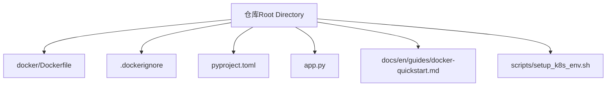
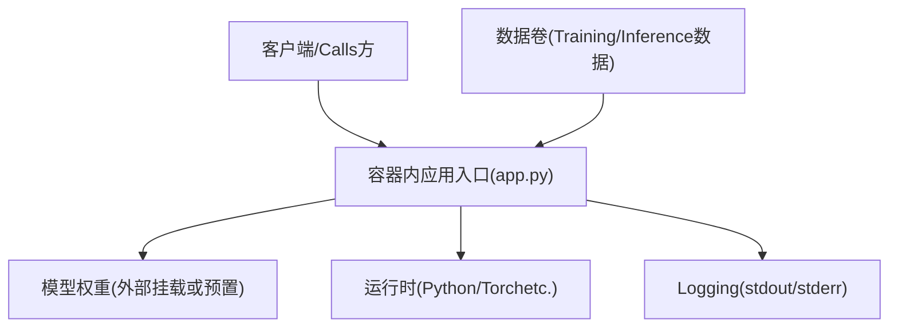
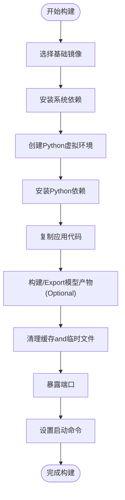
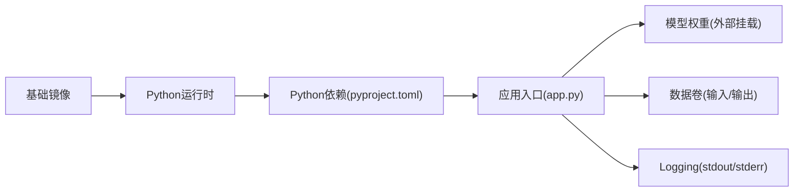

# Containerized Deployment

<cite>
**Files Referenced in This Document**
- [docker/Dockerfile](file://docker/Dockerfile)
- [.dockerignore](file://.dockerignore)
- [pyproject.toml](file://pyproject.toml)
- [app.py](file://app.py)
- [docs/en/guides/docker-quickstart.md](file://docs/en/guides/docker-quickstart.md)
- [scripts/setup_k8s_env.sh](file://scripts/setup_k8s_env.sh)
</cite>

## Table of Contents
1. [Introduction](#Introduction)
2. [Project Structure](#Project Structure)
3. [Core Components](#Core Components)
4. [Architecture Overview](#Architecture Overview)
5. [Detailed Component Analysis](#Detailed Component Analysis)
6. [Dependency Analysis](#Dependency Analysis)
7. [Performance Considerations](#Performance Considerations)
8. [Troubleshooting Guide](#Troubleshooting Guide)
9. [Conclusion](#Conclusion)
10. [Appendix](#Appendix)

## Introduction
本技术DocumentationtargetingYOLO-Master的Containerized Deployment，聚焦Docker镜像构建andOptimization、多环境策略、编排集成（Docker ComposeandKubernetes）、安全加固、网络配置Centered onand性能监控and资源限制。Documentation基于仓库中现有的Dockerfile、忽略规则、应用入口and相关脚本进行系统化说明，并provides可操作的实践建议and图示，帮助读者while不同环境中稳定、高效地运行YOLO-Master服务。

## Project Structure
and容器化直接相关的顶层文件andTable of Contentssuch as下：
- docker/Dockerfile：镜像构建定义
- .dockerignore：构建上下文过滤，减少镜像体积and构建时间
- pyproject.toml：Python工程元数据and依赖声明（供镜像内安装Uses）
- app.py：应用入口（用于容器启动命令或CMD/ENTRYPOINT）
- docs/en/guides/docker-quickstart.md：官方Quick StartDocumentation（含容器Uses说明）
- scripts/setup_k8s_env.sh：KubernetesEnvironment Preparation脚本（辅助编排集成）

**Figure Source**
- [docker/Dockerfile](file://docker/Dockerfile)
- [.dockerignore](file://.dockerignore)
- [pyproject.toml](file://pyproject.toml)
- [app.py](file://app.py)
- [docs/en/guides/docker-quickstart.md](file://docs/en/guides/docker-quickstart.md)
- [scripts/setup_k8s_env.sh](file://scripts/setup_k8s_env.sh)

**Section Source**
- [docker/Dockerfile](file://docker/Dockerfile)
- [.dockerignore](file://.dockerignore)
- [pyproject.toml](file://pyproject.toml)
- [app.py](file://app.py)
- [docs/en/guides/docker-quickstart.md](file://docs/en/guides/docker-quickstart.md)
- [scripts/setup_k8s_env.sh](file://scripts/setup_k8s_env.sh)

## Core Components
- Dockerfile：定义基础镜像、系统依赖、Python环境and包安装、工作Table of Contents、端口暴露and启动命令etc.。
- .dockerignore：排除不必要的构建上下文文件，提升缓存命中and镜像瘦身效果。
- pyproject.toml：声明项目依赖and版本约束，便于while镜像中统一安装。
- app.py：容器进程入口，负责Load model、provides服务或Executing InferenceTasks。
- docker-quickstart.md：provides容器快速上手步骤and环境变量说明。
- setup_k8s_env.sh：Kubernetes集群环境初始化and常用配置脚本。

**Section Source**
- [docker/Dockerfile](file://docker/Dockerfile)
- [.dockerignore](file://.dockerignore)
- [pyproject.toml](file://pyproject.toml)
- [app.py](file://app.py)
- [docs/en/guides/docker-quickstart.md](file://docs/en/guides/docker-quickstart.md)
- [scripts/setup_k8s_env.sh](file://scripts/setup_k8s_env.sh)

## Architecture Overview
下图展示容器化后YOLO-Master服务的典型运行架构：外部请求进入容器，由应用入口Load model并Executing Inference；持久化数据Via卷挂载to容器内部路径；Logging输出to标准输出Centered on便采集。

[此图for概念性架构图，不直接映射具体源码文件]

## Detailed Component Analysis

### Dockerfile 构建andOptimization
- 基础镜像选择
  - Recommended to use轻量且稳定的基础镜像（such asPython slim或特定CUDA版本镜像），Centered on减小体积并确保GPUdrivers are installed兼容。
  - 若需GPU加速，应选用包含对应CUDA/cuDNN版本的镜像，并while容器内正确设置环境变量。
- 依赖安装
  - Prefer系统包管理器安装编译型依赖，再Usespip安装Python依赖，避免重复下载and编译。
  - 将频繁变更的依赖安装步骤放while较后层，Centered on提升缓存命中率。
- 环境变量配置
  - 设置必要的运行时环境变量（such asDevice Selection、Logging级别、模型路径etc.）。
  - 避免while镜像中硬编码敏感信息，Uses运行时注入。
- 端口暴露
  - 明确EXPOSE端口号，确保and服务发现或编排工具一致。
- 启动命令
  - Usesexec形式的ENTRYPOINT/CMD，保证信号传递and优雅关闭。
- 多阶段构建策略
  - 构建阶段：安装编译工具链and依赖，完成Model Export或预处理。
  - 运行阶段：仅复制必要产物and最小运行时，显著降低镜像体积。
- 镜像分层Optimizationand缓存利用
  - 将不变的系统依赖and变化的应用代码分层放置，最大化Docker缓存复用。
  - 合并RUN指令Centered on减少层数，但需平衡可读性and缓存效率。
- 体积压缩技术
  - 清理包管理器缓存、临时文件and未Uses的库。
  - Uses.dockerignore排除大文件或无关Table of Contents。
  - Optional：启用BuildKit多平台构建and镜像压缩选项。

**Figure Source**
- [docker/Dockerfile](file://docker/Dockerfile)

**Section Source**
- [docker/Dockerfile](file://docker/Dockerfile)
- [.dockerignore](file://.dockerignore)

### .dockerignore 构建上下文过滤
- 目的：排除大型数据集、构建中间产物、本地缓存andIDE配置文件，减少构建上下文大小，提高构建速度and镜像体积。
- 建议排除项：
  - 大型数据Table of Contentsand结果Table of Contents
  - 本地缓存and临时文件
  - IDEand编辑器配置
  - 测试andExamples数据（除非需要）
- 影响：显著提升缓存命中率and构建稳定性。

**Section Source**
- [.dockerignore](file://.dockerignore)

### pyproject.toml 依赖管理
- 作用：集中声明项目依赖and版本约束，便于while镜像中统一安装。
- 最佳实践：
  - 锁定依赖版本，确保构建可重现。
  - 分离开发依赖and生产依赖，仅while构建阶段安装开发依赖。
  - Usesrequirements或etc.价机制while镜像中安装生产依赖。

**Section Source**
- [pyproject.toml](file://pyproject.toml)

### app.py 应用入口
- 职责：Load model、初始化运行时、处理请求或Executing InferenceTasks。
- 容器化要点：
  - Uses非rootUser运行，提升安全性。
  - Set appropriately线程/进程池，避免资源争用。
  - 健康检查端点and优雅关闭逻辑。
  - Logging输出tostdout/stderr，便于容器Logging采集。

**Section Source**
- [app.py](file://app.py)

### docker-quickstart.md Quick Start
- 内容：provides容器拉取、运行、环境变量配置and端口映射的基本步骤。
- Applicable Scenarios：本地开发and快速Validation。
- 注意事项：
  - 确认主机GPUdrivers are installedand容器CUDA版本匹配。
  - 根据需求调整内存and显存限制。

**Section Source**
- [docs/en/guides/docker-quickstart.md](file://docs/en/guides/docker-quickstart.md)

### setup_k8s_env.sh KubernetesEnvironment Preparation
- 功能：初始化Kubernetes集群所需的基础配置（such as命名空间、存储类、网络插件etc.）。
- Uses方式：while部署前执行脚本，确保集群满足YOLO-Master的运行要求。
- 扩展：CombiningHelm或Kustomizeimplementing参数化部署。

**Section Source**
- [scripts/setup_k8s_env.sh](file://scripts/setup_k8s_env.sh)

## Dependency Analysis
容器内主要依赖关系such as下：
- 基础镜像providesOperating Systemand运行时环境
- Python依赖由pyproject.toml声明并Via镜像安装
- 应用入口依赖模型权重and数据卷
- Loggingand监控Via标准输出and外部采集器对接

**Figure Source**
- [docker/Dockerfile](file://docker/Dockerfile)
- [pyproject.toml](file://pyproject.toml)
- [app.py](file://app.py)

**Section Source**
- [docker/Dockerfile](file://docker/Dockerfile)
- [pyproject.toml](file://pyproject.toml)
- [app.py](file://app.py)

## Performance Considerations
- GPU加速
  - Uses带CUDA/cuDNN的基础镜像，确保drivers are installed版本兼容。
  - while容器内设置正确的CUDA_VISIBLE_DEVICESandNVIDIA_VISIBLE_DEVICES。
- 资源限制
  - forCPUand内存设置requestsandlimits，防止资源争用。
  - 对GPU实例设置显存上限，避免OOM。
- I/OOptimization
  - Uses高性能文件系统and并行读取。
  - 将热数据放入内存盘或高速卷。
- 并发and批处理
  - Set appropriately批大小and线程/进程数，平衡吞吐and延迟。
- 缓存and预热
  - 首次请求时进行模型预热，降低冷启动延迟。
  - 利用Docker层缓存and镜像分层Optimization构建速度。

[本节for通用性能指导，不直接分析具体文件]

## Troubleshooting Guide
- 构建失败
  - 检查.dockerignore是否排除了必要文件。
  - 确认基础镜像andCUDA版本匹配。
  - 查看构建Logging定位依赖安装错误。
- 运行时崩溃
  - 检查环境变量是否正确注入。
  - 确认模型权重路径and权限。
  - 查看容器Loggingand系统Metrics。
- 性能问题
  - 分析CPU/内存/GPU利用率。
  - 调整批大小and并发度。
  - 检查I/Obottlenecksand网络延迟。

**Section Source**
- [.dockerignore](file://.dockerignore)
- [docker/Dockerfile](file://docker/Dockerfile)
- [app.py](file://app.py)

## Conclusion
Via合理的Dockerfile设计、严格的构建上下文过滤、清晰的依赖管理and安全的运行配置，YOLO-Master可Centered onwhile不同环境中稳定部署。CombiningKubernetes的资源调度and弹性伸缩，可implementing高可用and高性能的Inference服务。持续Optimization镜像体积and构建缓存，Combined with完善的监控and告警体系，是保障生产环境稳定性的关键。

[This section is summary content and does not directly analyze specific files]

## Appendix

### 多环境镜像构建策略
- 开发环境
  - Uses完整依赖and调试工具，便于快速迭代。
  - 开启详细Loggingand交互式调试。
- 测试环境
  - 精简依赖，固定版本，确保可重现。
  - 引入自动化测试and回归Validation。
- 生产环境
  - 最小化镜像，仅包含运行时必需组件。
  - 启用只读文件系统and安全加固。
  - 严格资源限制and健康检查。

[本节for概念性策略说明，不直接分析具体文件]

### 容器编排集成（Docker ComposeandKubernetes）
- Docker Compose
  - 定义服务、网络and卷，简化本地andCI/CD流程。
  - Uses环境变量and配置模板implementing差异化部署。
- Kubernetes
  - UsesDeployment、Service、ConfigMapandSecret管理应用生命周期and配置。
  - CombiningHPAimplementing自动扩缩容。
  - UsesIngress或LoadBalancer暴露服务。

[本节for概念性编排说明，不直接分析具体文件]

### 安全加固and网络配置
- 安全加固
  - Uses非rootUser运行容器。
  - 定期扫描镜像漏洞并更新基础镜像。
  - 最小权限原则，仅开放必要端口。
- 网络配置
  - Uses命名空间隔离不同环境。
  - 配置网络安全策略and访问控制列表。
  - 启用TLS加密and认证机制。

[本节for概念性安全and网络说明，不直接分析具体文件]

### 性能监控and资源限制Examples
- 监控Metrics
  - CPU/内存/GPU利用率、请求延迟、吞吐量、错误率。
- 资源限制
  - 设置requestsandlimits，确保公平调度。
  - 针对GPU实例设置显存上限and超时。
- 采集andVisualization
  - UsesPrometheusandGrafana收集and展示Metrics。
  - 配置告警规则and通知渠道。

[本节for概念性监控and限流说明，不直接分析具体文件]