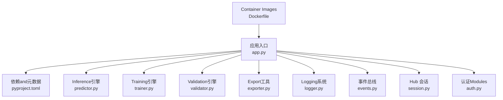
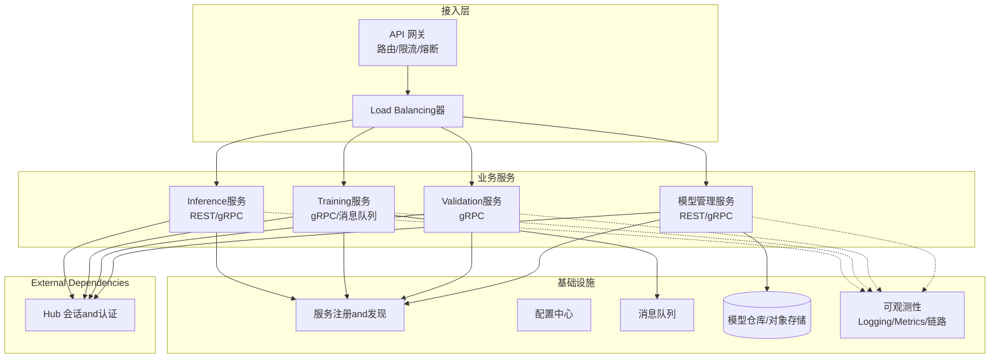
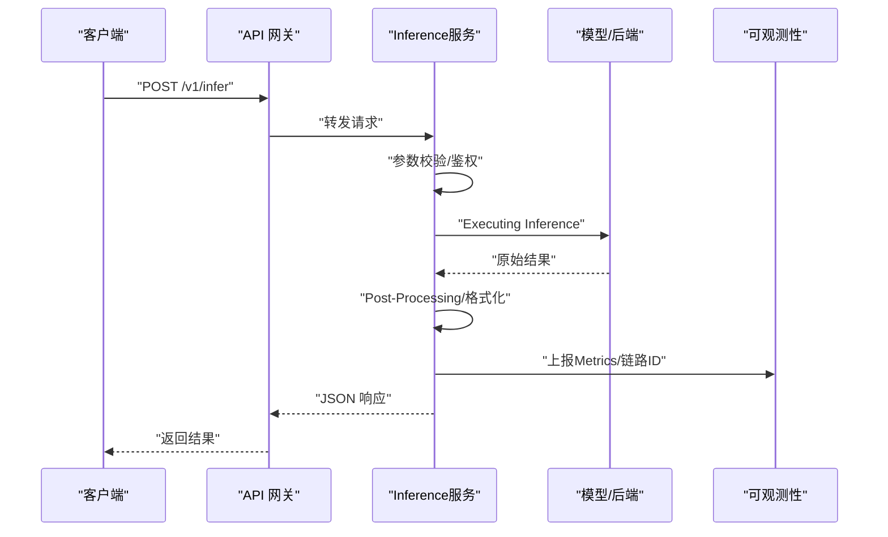
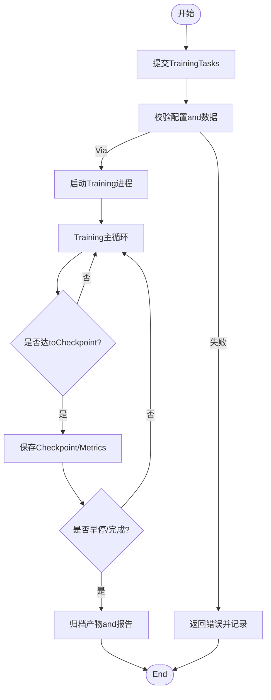
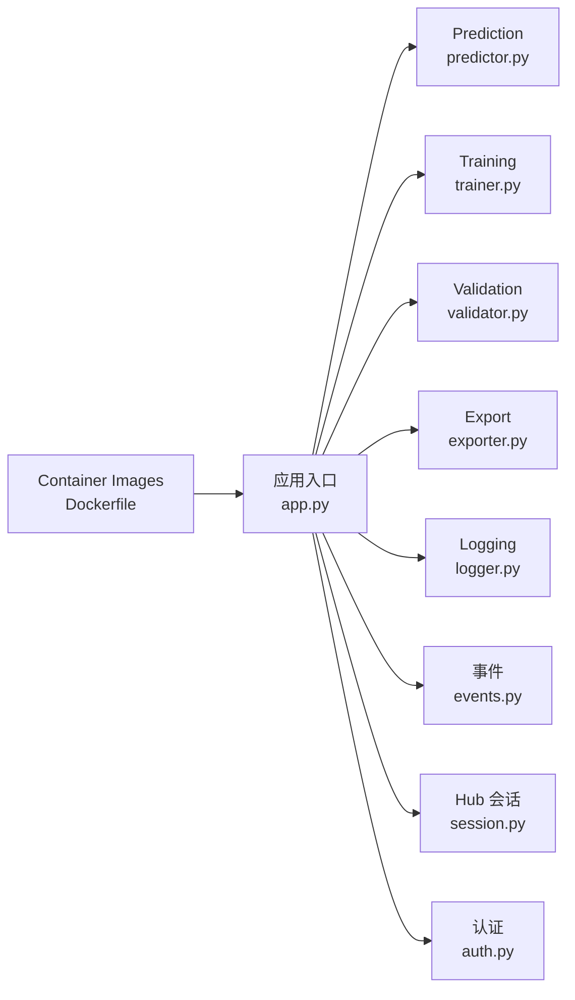

# 微服务架构设计

<cite>
**Files Referenced in This Document**
- [app.py](file://app.py)
- [pyproject.toml](file://pyproject.toml)
- [ultralytics/engine/predictor.py](file://ultralytics/engine/predictor.py)
- [ultralytics/engine/trainer.py](file://ultralytics/engine/trainer.py)
- [ultralytics/engine/validator.py](file://ultralytics/engine/validator.py)
- [ultralytics/engine/exporter.py](file://ultralytics/engine/exporter.py)
- [ultralytics/utils/logger.py](file://ultralytics/utils/logger.py)
- [ultralytics/utils/events.py](file://ultralytics/utils/events.py)
- [ultralytics/hub/session.py](file://ultralytics/hub/session.py)
- [ultralytics/hub/auth.py](file://ultralytics/hub/auth.py)
- [docker/Dockerfile](file://docker/Dockerfile)
</cite>

## Table of Contents
1. [Introduction](#Introduction)
2. [Project Structure](#Project Structure)
3. [Core Components](#Core Components)
4. [Architecture Overview](#Architecture Overview)
5. [Detailed Component Analysis](#Detailed Component Analysis)
6. [Dependency Analysis](#Dependency Analysis)
7. [Performance Considerations](#Performance Considerations)
8. [Troubleshooting Guide](#Troubleshooting Guide)
9. [Conclusion](#Conclusion)
10. [Appendix](#Appendix)

## Introduction
本技术Documentationtargeting YOLO-Master 的微服务化演进，围绕“Inference服务、Training服务、模型管理服务、服务发现and治理、API 网关、通信协议、分布式事务and一致性、监控Logging链路追踪、注册配置中心、扩缩容and故障恢复”etc.主题，给出可落地的架构设计andimplementing建议。当前仓库Centered on Python 包形式provides核心算法and引擎（Prediction、Training、Validation、Export、事件andLogging、Hub 会话etc.），并具备容器化capabilities。本文while尊重现有代码结构的基础上，提出将上述capabilities拆分for独立微服务的策略and集成方案，确保可扩展、可观测、高可用。

## Project Structure
从工程视角看，仓库包含Centered on下and微服务相关的关键位置：
- 应用入口and依赖声明：用于定义服务边界、运行环境andExternal Dependencies
- InferenceandTraining引擎：EncapsulatesPrediction、Training、Validation、Exportetc.核心流程
- 事件andLogging：for微服务可观测性provides基础
- Hub 会话and认证：for云端集成and鉴权provides支撑
- Container Images构建：for服务部署and扩缩容provides基础

Figure Source
- [app.py:1-200](file://app.py#L1-L200)
- [pyproject.toml:1-200](file://pyproject.toml#L1-L200)
- [ultralytics/engine/predictor.py:1-200](file://ultralytics/engine/predictor.py#L1-L200)
- [ultralytics/engine/trainer.py:1-200](file://ultralytics/engine/trainer.py#L1-L200)
- [ultralytics/engine/validator.py:1-200](file://ultralytics/engine/validator.py#L1-L200)
- [ultralytics/engine/exporter.py:1-200](file://ultralytics/engine/exporter.py#L1-L200)
- [ultralytics/utils/logger.py:1-200](file://ultralytics/utils/logger.py#L1-L200)
- [ultralytics/utils/events.py:1-200](file://ultralytics/utils/events.py#L1-L200)
- [ultralytics/hub/session.py:1-200](file://ultralytics/hub/session.py#L1-L200)
- [ultralytics/hub/auth.py:1-200](file://ultralytics/hub/auth.py#L1-L200)
- [docker/Dockerfile:1-200](file://docker/Dockerfile#L1-L200)

Section Source
- [app.py:1-200](file://app.py#L1-L200)
- [pyproject.toml:1-200](file://pyproject.toml#L1-L200)
- [docker/Dockerfile:1-200](file://docker/Dockerfile#L1-L200)

## Core Components
- Inference服务（Predictor）：负责Load model、预处理输入、执行Forward Inference、Post-Processing输出，适合对外暴露 REST/gRPC 接口进行while线Inference
- Training服务（Trainer）：负责数据集准备、Optimizerand调度器配置、多卡Training、Checkpoint保存and恢复，适合异步Tasks编排
- Validation服务（Validator）：负责Metrics计算、结果汇总and报告生成，可作forTraining流水线中的质量门禁
- 模型管理服务（Exporter + Registry）：负责Model Export（ONNX/TensorRT etc.）、版本登记、元数据管理、灰度发布and回滚
- 可观测性组件（Logger + Events）：结构化Logging、事件上报、Metrics采集，for监控and链路追踪provides基础
- 云端集成（Hub Session + Auth）：统一认证and会话管理，Supporting云端资源访问and审计

Section Source
- [ultralytics/engine/predictor.py:1-200](file://ultralytics/engine/predictor.py#L1-L200)
- [ultralytics/engine/trainer.py:1-200](file://ultralytics/engine/trainer.py#L1-L200)
- [ultralytics/engine/validator.py:1-200](file://ultralytics/engine/validator.py#L1-L200)
- [ultralytics/engine/exporter.py:1-200](file://ultralytics/engine/exporter.py#L1-L200)
- [ultralytics/utils/logger.py:1-200](file://ultralytics/utils/logger.py#L1-L200)
- [ultralytics/utils/events.py:1-200](file://ultralytics/utils/events.py#L1-L200)
- [ultralytics/hub/session.py:1-200](file://ultralytics/hub/session.py#L1-L200)
- [ultralytics/hub/auth.py:1-200](file://ultralytics/hub/auth.py#L1-L200)

## Architecture Overview
下图展示基于现有引擎的推荐微服务拆分and服务间交互方式。API 网关作forUnified entry point，按路径或协议路由to不同服务；服务Via gRPC 进行高性能内部Calls，REST 暴露给外部客户端；消息队列用于TrainingTasksandExportTasks的异步解耦；服务注册and配置中心保障动态扩缩容and热更新；可观测性体系贯穿全链路。

Figure Source
- [ultralytics/engine/predictor.py:1-200](file://ultralytics/engine/predictor.py#L1-L200)
- [ultralytics/engine/trainer.py:1-200](file://ultralytics/engine/trainer.py#L1-L200)
- [ultralytics/engine/validator.py:1-200](file://ultralytics/engine/validator.py#L1-L200)
- [ultralytics/engine/exporter.py:1-200](file://ultralytics/engine/exporter.py#L1-L200)
- [ultralytics/hub/session.py:1-200](file://ultralytics/hub/session.py#L1-L200)
- [ultralytics/hub/auth.py:1-200](file://ultralytics/hub/auth.py#L1-L200)

## Detailed Component Analysis

### Inference服务（Predictor）
- 职责
  - 接收请求（图像/视频帧/批量数据）
  - 模型加载and预热（冷启动Optimization）
  - 预处理、Inference、Post-Processing（NMS、阈值过滤）
  - 返回结构化结果（框、类别、置信度、掩码etc.）
- 关键流程
  - 初始化：加载配置、Device Selection、模型权重、后端选择
  - Inference：批处理、并发控制、内存池复用
  - 输出：标准化响应格式、错误码and诊断信息
- 扩展点
  - 插件式后端（ONNXRuntime/TensorRT/OpenVINO etc.）
  - 缓存策略（KV 缓存、结果缓存）
  - 自适应批大小and动态形状

Figure Source
- [ultralytics/engine/predictor.py:1-200](file://ultralytics/engine/predictor.py#L1-L200)
- [ultralytics/utils/logger.py:1-200](file://ultralytics/utils/logger.py#L1-L200)
- [ultralytics/utils/events.py:1-200](file://ultralytics/utils/events.py#L1-L200)

Section Source
- [ultralytics/engine/predictor.py:1-200](file://ultralytics/engine/predictor.py#L1-L200)
- [ultralytics/utils/logger.py:1-200](file://ultralytics/utils/logger.py#L1-L200)
- [ultralytics/utils/events.py:1-200](file://ultralytics/utils/events.py#L1-L200)

### Training服务（Trainer）
- 职责
  - 解析Training Configuration（超参、数据路径、设备拓扑）
  - 启动Training循环（Data Loading、前向/反向、Optimizer步骤）
  - Checkpoint保存and断点续训
  - Metrics记录and回调（早停、Learning Rate调度）
- 关键流程
  - Tasks提交：Via消息队列异步触发
  - Training执行：分布式并行（DDP/多进程）
  - 结果归档：模型权重、Logging、Evaluation报告
- 扩展点
  - 弹性扩缩容（Pod 自动伸缩）
  - Tasks重试and幂etc.性保证
  - Training产物版本化and溯源

Figure Source
- [ultralytics/engine/trainer.py:1-200](file://ultralytics/engine/trainer.py#L1-L200)
- [ultralytics/utils/logger.py:1-200](file://ultralytics/utils/logger.py#L1-L200)
- [ultralytics/utils/events.py:1-200](file://ultralytics/utils/events.py#L1-L200)

Section Source
- [ultralytics/engine/trainer.py:1-200](file://ultralytics/engine/trainer.py#L1-L200)
- [ultralytics/utils/logger.py:1-200](file://ultralytics/utils/logger.py#L1-L200)
- [ultralytics/utils/events.py:1-200](file://ultralytics/utils/events.py#L1-L200)

### Validation服务（Validator）
- 职责
  - 加载指定模型and测试集
  - Executing InferenceandMetrics计算（mAP、精度、召回etc.）
  - 生成Evaluation报告andVisualization
- Uses场景
  - Training后的质量门禁
  - 模型对比and回归测试
  - 线上 A/B 实验离线Evaluation

Section Source
- [ultralytics/engine/validator.py:1-200](file://ultralytics/engine/validator.py#L1-L200)

### 模型管理服务（Exporter + Registry）
- 职责
  - Model Export（多后端、量化、剪枝）
  - 模型注册（版本、元数据、兼容性矩阵）
  - 灰度发布and回滚（流量切换、健康检查）
- 关键流程
  - 导入权重 -> Export多格式 -> 写入模型仓库 -> 注册元数据 -> 通知下游服务
- 扩展点
  - 自动化 CI/CD 流水线集成
  - 模型指纹and完整性校验

Section Source
- [ultralytics/engine/exporter.py:1-200](file://ultralytics/engine/exporter.py#L1-L200)

### API 网关设计模式
- 请求路由
  - 基于路径/协议/租户维度路由至对应服务
  - 统一鉴权、限流、黑白名单
- Load Balancing
  - 四层/七层Load Balancing，Supporting加权and亲和性
- 熔断降级
  - 基于错误率/延迟阈值的熔断
  - 降级策略：返回缓存、默认值或友好错误
- 可观测性
  - 请求级链路 ID 透传
  - MetricsandLogging聚合

Section Source
- [ultralytics/utils/logger.py:1-200](file://ultralytics/utils/logger.py#L1-L200)
- [ultralytics/utils/events.py:1-200](file://ultralytics/utils/events.py#L1-L200)

### 服务间通信协议
- REST API
  - 适用：外部客户端、跨语言Calls、人类可读
  - 典型：Inference查询、模型注册、Tasks状态查询
- gRPC
  - 适用：内部高性能Calls、强类型契约、双向流
  - 典型：TrainingTasks下发、Validation流水线、模型分发
- 消息队列
  - 适用：异步Tasks、削峰填谷、最终一致性
  - 典型：TrainingTasks、ExportTasks、Metrics上报

Section Source
- [ultralytics/hub/session.py:1-200](file://ultralytics/hub/session.py#L1-L200)
- [ultralytics/hub/auth.py:1-200](file://ultralytics/hub/auth.py#L1-L200)

### 分布式事务and一致性
- TrainingTasks
  - 采用“Tasks队列 + 幂etc.键 + 补偿动作”的最终一致性方案
  - Checkpoint持久化，失败重试时从最近Checkpoint恢复
- 模型发布
  - 两阶段提交思想：先写模型仓库，再更新Registry；失败则回滚Registry
- 数据一致性
  - Training数据版本化and快照，避免脏读
  - MetricsandLogging写入原子操作，失败重试and去重

Section Source
- [ultralytics/engine/trainer.py:1-200](file://ultralytics/engine/trainer.py#L1-L200)
- [ultralytics/engine/exporter.py:1-200](file://ultralytics/engine/exporter.py#L1-L200)

### 监控、Loggingand链路追踪
- Logging
  - 结构化 JSON Logging，统一字段（trace_id、service、level、msg）
  - 分级输出（debug/info/warn/error），敏感信息脱敏
- Metrics
  - 服务级Metrics（QPS、延迟、错误率、资源占用）
  - 业务Metrics（Inference耗时、Training收敛曲线、Export成功率）
- 链路追踪
  - 请求级 trace_id 透传，跨服务关联
  - 关键节点埋点（入站、出站、IO、模型加载）

Section Source
- [ultralytics/utils/logger.py:1-200](file://ultralytics/utils/logger.py#L1-L200)
- [ultralytics/utils/events.py:1-200](file://ultralytics/utils/events.py#L1-L200)

### 服务注册and发现、配置中心and服务治理
- 注册and发现
  - 服务启动时注册健康端点and元数据
  - 消费者侧缓存服务列表，定期刷新
- 配置中心
  - 集中化管理运行时配置（超时、阈值、开关）
  - Supporting热更新and灰度配置
- 服务治理
  - 限流、熔断、重试、退避、舱壁隔离
  - 健康检查and自动摘除不健康实例

Section Source
- [ultralytics/hub/session.py:1-200](file://ultralytics/hub/session.py#L1-L200)
- [ultralytics/hub/auth.py:1-200](file://ultralytics/hub/auth.py#L1-L200)

### 扩缩容and故障恢复
- 水平扩缩容
  - 基于 CPU/GPU 利用率、队列长度、延迟分位数自动扩容
  - Inference服务无状态化，Training服务有状态需Combined withCheckpoint
- 故障恢复
  - TrainingTasks断点续训，ExportTasks幂etc.重试
  - 模型加载失败快速失败并告警，启用备用模型或降级策略

Section Source
- [docker/Dockerfile:1-200](file://docker/Dockerfile#L1-L200)
- [ultralytics/engine/trainer.py:1-200](file://ultralytics/engine/trainer.py#L1-L200)
- [ultralytics/engine/exporter.py:1-200](file://ultralytics/engine/exporter.py#L1-L200)

## Dependency Analysis
- 直接依赖
  - 应用入口依赖各引擎Modules（Prediction、Training、Validation、Export）
  - 可观测性依赖Loggingand事件Modules
  - 云端集成依赖 Hub 会话and认证
- 间接依赖
  - Container Images依赖Operating System库and运行时环境
  - External Dependencies（such as ONNXRuntime/TensorRT）由ExportandInference后端引入

Figure Source
- [app.py:1-200](file://app.py#L1-L200)
- [ultralytics/engine/predictor.py:1-200](file://ultralytics/engine/predictor.py#L1-L200)
- [ultralytics/engine/trainer.py:1-200](file://ultralytics/engine/trainer.py#L1-L200)
- [ultralytics/engine/validator.py:1-200](file://ultralytics/engine/validator.py#L1-L200)
- [ultralytics/engine/exporter.py:1-200](file://ultralytics/engine/exporter.py#L1-L200)
- [ultralytics/utils/logger.py:1-200](file://ultralytics/utils/logger.py#L1-L200)
- [ultralytics/utils/events.py:1-200](file://ultralytics/utils/events.py#L1-L200)
- [ultralytics/hub/session.py:1-200](file://ultralytics/hub/session.py#L1-L200)
- [ultralytics/hub/auth.py:1-200](file://ultralytics/hub/auth.py#L1-L200)
- [docker/Dockerfile:1-200](file://docker/Dockerfile#L1-L200)

Section Source
- [app.py:1-200](file://app.py#L1-L200)
- [pyproject.toml:1-200](file://pyproject.toml#L1-L200)

## Performance Considerations
- Inference服务
  - 模型预热and常驻内存，减少冷启动延迟
  - 批处理and动态形状Optimization，提升吞吐
  - 后端选择and编译Optimization（TensorRT/OpenVINO）
- Training服务
  - Data Pipeline并行and缓存，避免 IO bottlenecks
  - Gradient累积andMixture精度，平衡显存and速度
  - 分布式通信Optimization（NCCL/集合通信）
- Model Export
  - 增量Exportand缓存命中，降低重复成本
  - 多目标平台并行Export，缩短交付时间

## Troubleshooting Guide
- 常见问题定位
  - Inference失败：检查模型加载、输入尺寸、后端可用性
  - Training中断：查看Checkpoint、Logging堆栈、资源不足告警
  - Export异常：确认依赖库版本、权限and磁盘空间
- 可观测性手段
  - Via trace_id 串联请求链路
  - CombiningMetricsandLogging快速定位热点and异常
  - Uses健康检查and探针判断服务状态

Section Source
- [ultralytics/utils/logger.py:1-200](file://ultralytics/utils/logger.py#L1-L200)
- [ultralytics/utils/events.py:1-200](file://ultralytics/utils/events.py#L1-L200)

## Conclusion
Via将 YOLO-Master 的核心引擎拆分forInference、Training、Validationand模型管理etc.微服务，并Combining API 网关、服务注册and配置中心、消息队列and可观测性体系，可implementing高内聚、低耦合、易扩展的系统架构。建议while落地过程中优先完善可观测性and治理机制，逐步推进服务化改造and自动化运维，确保稳定性and效率并重。

## Appendix
- 术语说明
  - API 网关：Unified entry point，负责路由、鉴权、限流、熔断
  - 服务注册and发现：维护服务实例清单and健康状态
  - 配置中心：集中管理运行时配置and特性开关
  - 消息队列：异步解耦and削峰填谷
  - 可观测性：Logging、Metrics、链路追踪三位一体
- Refer to实践
  - Containerized Deploymentand镜像Optimization
  - 灰度发布and回滚策略
  - 弹性伸缩and容量规划