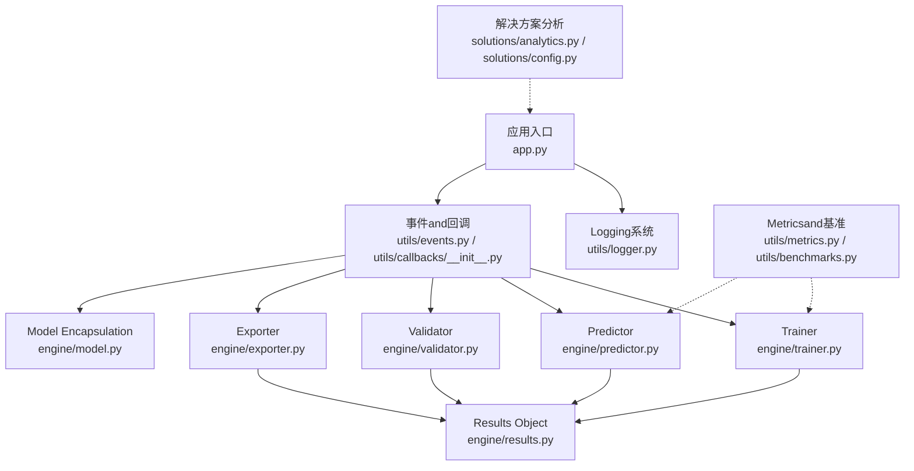
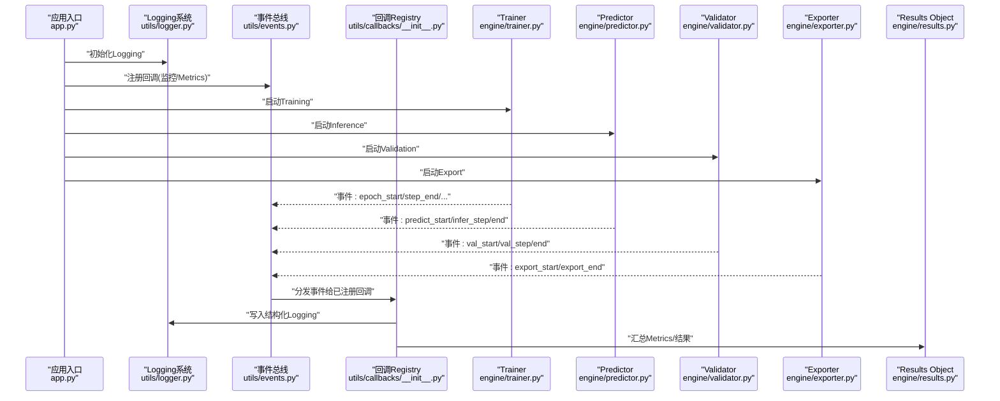
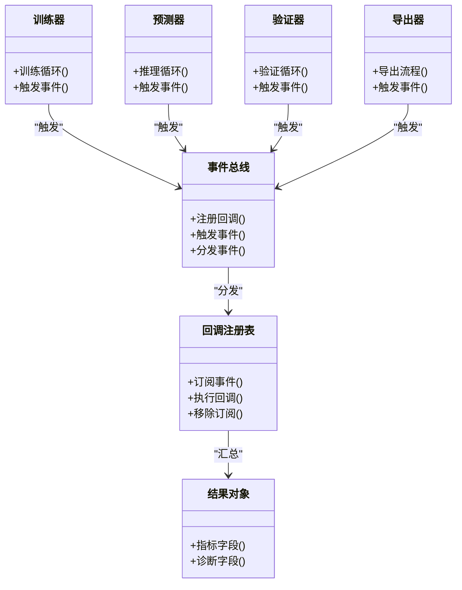

# 监控andLogging

<cite>
**Files Referenced in This Document**
- [app.py](file://app.py)
- [logger.py](file://ultralytics/utils/logger.py)
- [events.py](file://ultralytics/utils/events.py)
- [benchmarks.py](file://ultralytics/utils/benchmarks.py)
- [metrics.py](file://ultralytics/utils/metrics.py)
- [trainer.py](file://ultralytics/engine/trainer.py)
- [predictor.py](file://ultralytics/engine/predictor.py)
- [validator.py](file://ultralytics/engine/validator.py)
- [exporter.py](file://ultralytics/engine/exporter.py)
- [model.py](file://ultralytics/engine/model.py)
- [results.py](file://ultralytics/engine/results.py)
- [callbacks/__init__.py](file://ultralytics/utils/callbacks/__init__.py)
- [analytics.py](file://ultralytics/solutions/analytics.py)
- [config.py](file://ultralytics/solutions/config.py)
</cite>

## Table of Contents
1. [Introduction](#Introduction)
2. [Project Structure](#Project Structure)
3. [Core Components](#Core Components)
4. [Architecture Overview](#Architecture Overview)
5. [Detailed Component Analysis](#Detailed Component Analysis)
6. [Dependency Analysis](#Dependency Analysis)
7. [性能考量](#性能考量)
8. [Troubleshooting Guide](#Troubleshooting Guide)
9. [Conclusion](#Conclusion)
10. [Appendix](#Appendix)

## Introduction
本技术Documentationtargeting YOLO-Master 的监控andLogging体系，聚焦Centered on下目标：
- 应用性能监控（APM）：Metrics采集、性能分析and异常检测
- 结构化Logging：级别、格式and采集策略
- 分布式追踪：请求链路TrackingandDependency Analysis
- 告警规则：阈值、通知渠道and升级策略
- Visualization仪表板：Prometheus、Grafana 集成方法
- Logging聚合and分析平台：选型and配置建议
- 监控数据存储、查询and保留策略

说明：仓库中未包含现成的 Prometheus/Grafana/Tracing 集成代码。本文基于现有LoggingandMetrics基础设施，给出可落地的扩展方案and最佳实践，确保while不侵入核心Inference/Training主流程的前提下implementing可观测性。

## Project Structure
YOLO-Master 的可观测性相关capabilities主要分布whileCentered on下位置：
- 应用入口and启动：app.py
- Logging子系统：ultralytics/utils/logger.py
- 事件总线and回调：ultralytics/utils/events.py、ultralytics/utils/callbacks/__init__.py
- Metricsand基准：ultralytics/utils/metrics.py、ultralytics/utils/benchmarks.py
- Engine Layer埋点：ultralytics/engine/{trainer,predictor,validator,exporter,model}.py
- Results Object：ultralytics/engine/results.py
- 解决方案侧分析工具：ultralytics/solutions/{analytics,config}.py

Figure Source
- [app.py:1-200](file://app.py#L1-L200)
- [logger.py:1-200](file://ultralytics/utils/logger.py#L1-L200)
- [events.py:1-200](file://ultralytics/utils/events.py#L1-L200)
- [callbacks/__init__.py:1-200](file://ultralytics/utils/callbacks/__init__.py#L1-L200)
- [trainer.py:1-200](file://ultralytics/engine/trainer.py#L1-L200)
- [predictor.py:1-200](file://ultralytics/engine/predictor.py#L1-L200)
- [validator.py:1-200](file://ultralytics/engine/validator.py#L1-L200)
- [exporter.py:1-200](file://ultralytics/engine/exporter.py#L1-L200)
- [model.py:1-200](file://ultralytics/engine/model.py#L1-L200)
- [results.py:1-200](file://ultralytics/engine/results.py#L1-L200)
- [metrics.py:1-200](file://ultralytics/utils/metrics.py#L1-L200)
- [benchmarks.py:1-200](file://ultralytics/utils/benchmarks.py#L1-L200)
- [analytics.py:1-200](file://ultralytics/solutions/analytics.py#L1-L200)
- [config.py:1-200](file://ultralytics/solutions/config.py#L1-L200)

Section Source
- [app.py:1-200](file://app.py#L1-L200)
- [logger.py:1-200](file://ultralytics/utils/logger.py#L1-L200)
- [events.py:1-200](file://ultralytics/utils/events.py#L1-L200)
- [benchmarks.py:1-200](file://ultralytics/utils/benchmarks.py#L1-L200)
- [metrics.py:1-200](file://ultralytics/utils/metrics.py#L1-L200)
- [trainer.py:1-200](file://ultralytics/engine/trainer.py#L1-L200)
- [predictor.py:1-200](file://ultralytics/engine/predictor.py#L1-L200)
- [validator.py:1-200](file://ultralytics/engine/validator.py#L1-L200)
- [exporter.py:1-200](file://ultralytics/engine/exporter.py#L1-L200)
- [model.py:1-200](file://ultralytics/engine/model.py#L1-L200)
- [results.py:1-200](file://ultralytics/engine/results.py#L1-L200)
- [analytics.py:1-200](file://ultralytics/solutions/analytics.py#L1-L200)
- [config.py:1-200](file://ultralytics/solutions/config.py#L1-L200)

## Core Components
- Logging系统（结构化输出）
  - provides统一的Logging接口，Supporting多后端（控制台、文件etc.），便于后续接入外部Logging收集器。
  - 关键职责：Logging级别控制、格式化、上下文字段注入（such asTasksID、模型名、设备）。
- 事件and回调机制
  - whileTraining、Inference、Validation、Exportetc.关键阶段触发事件，供回调订阅者执行监控埋点。
  - Via解耦方式将“业务逻辑”和“可观测性逻辑”分离。
- Metricsand基准
  - Built-in常用Metrics计算and基准测试工具，可作for自定义Metrics的基础。
- Engine Layer埋点
  - while trainer/predictor/validator/exporter etc.关键路径插入事件钩子，用于采集耗时、吞吐、错误率etc.。
- Results Object
  - 标准化Inference/Validation结果载体，便于统一上报MetricsandLogging。

Section Source
- [logger.py:1-200](file://ultralytics/utils/logger.py#L1-L200)
- [events.py:1-200](file://ultralytics/utils/events.py#L1-L200)
- [callbacks/__init__.py:1-200](file://ultralytics/utils/callbacks/__init__.py#L1-L200)
- [metrics.py:1-200](file://ultralytics/utils/metrics.py#L1-L200)
- [benchmarks.py:1-200](file://ultralytics/utils/benchmarks.py#L1-L200)
- [trainer.py:1-200](file://ultralytics/engine/trainer.py#L1-L200)
- [predictor.py:1-200](file://ultralytics/engine/predictor.py#L1-L200)
- [validator.py:1-200](file://ultralytics/engine/validator.py#L1-L200)
- [exporter.py:1-200](file://ultralytics/engine/exporter.py#L1-L200)
- [model.py:1-200](file://ultralytics/engine/model.py#L1-L200)
- [results.py:1-200](file://ultralytics/engine/results.py#L1-L200)

## Architecture Overview
下图展示从应用入口to各引擎Modules的事件drivers are installed式监控架构。LoggingandMetricsVia回调and事件总线进行解耦采集，避免对核心路径造成侵入式耦合。

Figure Source
- [app.py:1-200](file://app.py#L1-L200)
- [logger.py:1-200](file://ultralytics/utils/logger.py#L1-L200)
- [events.py:1-200](file://ultralytics/utils/events.py#L1-L200)
- [callbacks/__init__.py:1-200](file://ultralytics/utils/callbacks/__init__.py#L1-L200)
- [trainer.py:1-200](file://ultralytics/engine/trainer.py#L1-L200)
- [predictor.py:1-200](file://ultralytics/engine/predictor.py#L1-L200)
- [validator.py:1-200](file://ultralytics/engine/validator.py#L1-L200)
- [exporter.py:1-200](file://ultralytics/engine/exporter.py#L1-L200)
- [results.py:1-200](file://ultralytics/engine/results.py#L1-L200)

## Detailed Component Analysis

### 结构化Logging规范
- 设计原则
  - 结构化：每条Loggingfor键值对或 JSON 对象，包含固定字段（时间戳、级别、服务名、实例ID、TasksID、模型名、设备、阶段etc.）。
  - 分级：DEBUG/INFO/WARN/ERROR/FATAL，按场景选择合适级别，避免过度 DEBUG 影响性能。
  - 幂etc.and去重：对高频重复Logging做采样或合并，降低存储压力。
  - 安全：禁止记录敏感信息（密钥、User隐私数据）。
- 采集策略
  - 本地文件轮转 + 标准输出；容器化环境推荐 stdout/stderr 由 Sidecar/Agent 采集。
  - 异步写入：while高吞吐场景下采用异步队列，避免阻塞主流程。
- and事件系统的Combining
  - while事件回调中统一写入结构化Logging，保证上下文一致。

Section Source
- [logger.py:1-200](file://ultralytics/utils/logger.py#L1-L200)
- [events.py:1-200](file://ultralytics/utils/events.py#L1-L200)
- [callbacks/__init__.py:1-200](file://ultralytics/utils/callbacks/__init__.py#L1-L200)

### 应用性能监控（APM）
- Metrics分类
  - 资源类：CPU/GPU 利用率、显存占用、内存、磁盘IO、网络IO。
  - 业务类：QPS、延迟分位（P50/P90/P99）、成功率、错误码分布、批大小、图像尺寸分布。
  - 模型类：专家路由分布（MoE）、激活稀疏度、损失曲线、收敛速度。
- 采集点
  - Training：epoch/step 开始andEnd、loss 更新、Gradient统计、Checkpoint保存。
  - Inference：请求进入/离开、预处理/Post-Processing耗时、模型前向耗时、NMS 耗时。
  - Validation：Metrics计算阶段耗时、混淆矩阵/PR/AUC etc.。
  - Export：Export前后模型大小、格式转换耗时。
- implementing方式
  - Via事件回调while关键路径打点，Uses计数器、直方图、仪表盘etc.类型上报。
  - and metrics/benchmarks 工具协作，复用已有计算逻辑。

Section Source
- [events.py:1-200](file://ultralytics/utils/events.py#L1-L200)
- [callbacks/__init__.py:1-200](file://ultralytics/utils/callbacks/__init__.py#L1-L200)
- [metrics.py:1-200](file://ultralytics/utils/metrics.py#L1-L200)
- [benchmarks.py:1-200](file://ultralytics/utils/benchmarks.py#L1-L200)
- [trainer.py:1-200](file://ultralytics/engine/trainer.py#L1-L200)
- [predictor.py:1-200](file://ultralytics/engine/predictor.py#L1-L200)
- [validator.py:1-200](file://ultralytics/engine/validator.py#L1-L200)
- [exporter.py:1-200](file://ultralytics/engine/exporter.py#L1-L200)

### 分布式追踪（请求链路Tracking）
- 概念
  - for一次端to端Calls生成 TraceId/SpanId，贯穿预处理、模型Inference、Post-Processing、I/O etc.环节。
- 落地建议
  - while入口（HTTP/gRPC/消息队列消费者）创建根 Span，传递上下文至下游。
  - while事件回调中for每个阶段创建子 Span，记录标签（阶段名、模型版本、设备、batch_size etc.）。
  - 将 TraceId 注入结构化Logging，便于跨系统关联。
- and现有系统Combining
  - Via回调统一注入，不修改核心算法逻辑；Logging携带 trace_id，便于检索。

Section Source
- [events.py:1-200](file://ultralytics/utils/events.py#L1-L200)
- [callbacks/__init__.py:1-200](file://ultralytics/utils/callbacks/__init__.py#L1-L200)
- [logger.py:1-200](file://ultralytics/utils/logger.py#L1-L200)

### 异常检测and错误上报
- 检测维度
  - 运行时异常：OOM、CUDA 错误、张量形状不匹配、NaN/Inf。
  - 业务异常：低置信度比例突增、类别分布偏移、NMS 失败。
- 处理方式
  - 捕获并记录结构化错误Logging（含堆栈、上下文、TraceId）。
  - 触发告警回调，必要时降级或熔断。
- andResults Object联动
  - while results 中附加诊断字段，辅助定位问题。

Section Source
- [results.py:1-200](file://ultralytics/engine/results.py#L1-L200)
- [logger.py:1-200](file://ultralytics/utils/logger.py#L1-L200)
- [events.py:1-200](file://ultralytics/utils/events.py#L1-L200)

### 告警规则配置
- 阈值设置
  - 资源：GPU 显存Uses率 > 90% 持续 N Minutes；CPU Uses率 > 95%。
  - 性能：P99 延迟超过 SLA；QPS 下降超过基线 X%。
  - 质量：mAP 或精度显著下降；错误率上升。
- 通知渠道
  - 邮件、企业微信/钉钉、Slack、PagerDuty etc.。
- 升级策略
  - 首次警告 -> 观察期 -> 升级通知 -> 自动恢复动作（重启/回滚/扩缩容）。
- implementing要点
  - while回调中EvaluationMetrics，达to阈值则触发通知；Supporting静默期and抑制规则。

Section Source
- [callbacks/__init__.py:1-200](file://ultralytics/utils/callbacks/__init__.py#L1-L200)
- [events.py:1-200](file://ultralytics/utils/events.py#L1-L200)

### Visualization仪表板搭建（Prometheus + Grafana）
- Metrics暴露
  - while回调中将Metrics推送to Pushgateway 或直接被 Pull 采集（such as HTTP /metrics）。
  - Metrics命名遵循领域约定（such as yolo_inference_latency_seconds_bucket）。
- Grafana 面板
  - 资源面板：CPU/GPU/内存/显存。
  - 性能面板：QPS、延迟分位、吞吐、批大小分布。
  - 质量面板：mAP、PR 曲线、错误码分布。
  - 模型面板：MoE 路由分布、专家负载、损失曲线。
- 数据源
  - Prometheus 作for时序数据库；Optional Loki 聚合Logging，Jaeger/Tempo 聚合追踪。

Section Source
- [metrics.py:1-200](file://ultralytics/utils/metrics.py#L1-L200)
- [benchmarks.py:1-200](file://ultralytics/utils/benchmarks.py#L1-L200)
- [callbacks/__init__.py:1-200](file://ultralytics/utils/callbacks/__init__.py#L1-L200)

### Logging聚合and分析平台
- 选型建议
  - 轻量：ELK/EFK（Elasticsearch + Logstash/Fluent Bit + Kibana）。
  - 云原生：Loki + Promtail + Grafana。
  - 商业：Datadog、Sentry（错误追踪）。
- 采集方式
  - 容器 stdout/stderr 由 Sidecar 采集；或 Agent 直接读取Logging文件。
- 索引and查询
  - Centered on结构化字段建立索引，Supporting按 trace_id、TasksID、模型名快速检索。
- 保留策略
  - 热数据短期保留（such as 7-14 天），冷数据归档（such as S3/OSS）。

Section Source
- [logger.py:1-200](file://ultralytics/utils/logger.py#L1-L200)
- [events.py:1-200](file://ultralytics/utils/events.py#L1-L200)

### 监控数据的存储、查询and保留策略
- 存储
  - Metrics：Prometheus（短周期）+ TSDB（长周期归档）。
  - Logging：Loki/Elasticsearch（热）+ 对象存储（冷）。
  - 追踪：Jaeger/Tempo（热）+ 对象存储（冷）。
- 查询
  - Metrics：PromQL；Logging：LogQL/KQL；追踪：TraceQL/Jaeger UI。
- 保留
  - 按成本and合规要求分层保留；冷热分离；自动清理过期数据。

Section Source
- [metrics.py:1-200](file://ultralytics/utils/metrics.py#L1-L200)
- [logger.py:1-200](file://ultralytics/utils/logger.py#L1-L200)

## Dependency Analysis
下图展示了事件and回调while各引擎Modules中的依赖关系，体现了解耦and可扩展的设计。

Figure Source
- [events.py:1-200](file://ultralytics/utils/events.py#L1-L200)
- [callbacks/__init__.py:1-200](file://ultralytics/utils/callbacks/__init__.py#L1-L200)
- [trainer.py:1-200](file://ultralytics/engine/trainer.py#L1-L200)
- [predictor.py:1-200](file://ultralytics/engine/predictor.py#L1-L200)
- [validator.py:1-200](file://ultralytics/engine/validator.py#L1-L200)
- [exporter.py:1-200](file://ultralytics/engine/exporter.py#L1-L200)
- [results.py:1-200](file://ultralytics/engine/results.py#L1-L200)

Section Source
- [events.py:1-200](file://ultralytics/utils/events.py#L1-L200)
- [callbacks/__init__.py:1-200](file://ultralytics/utils/callbacks/__init__.py#L1-L200)
- [trainer.py:1-200](file://ultralytics/engine/trainer.py#L1-L200)
- [predictor.py:1-200](file://ultralytics/engine/predictor.py#L1-L200)
- [validator.py:1-200](file://ultralytics/engine/validator.py#L1-L200)
- [exporter.py:1-200](file://ultralytics/engine/exporter.py#L1-L200)
- [results.py:1-200](file://ultralytics/engine/results.py#L1-L200)

## 性能考量
- 低开销采集
  - Uses异步队列and批量上报，避免同步 IO 阻塞主流程。
  - 对高频Metrics进行采样或降采样。
- Metrics粒度
  - 合理选择时间窗口and分桶大小，平衡查询性能and精度。
- Logging体积控制
  - 仅记录必要上下文；对调试Logging开启开关；对热点路径启用采样。
- 资源隔离
  - 监控组件and业务进程资源隔离，防止相互影响。

[本节for通用指导，无需特定文件引用]

## Troubleshooting Guide
- 常见问题
  - Metrics缺失：检查事件是否触发、回调是否正确注册、Metrics上报通道是否正常。
  - Logging丢失：确认Logging写入路径权限、异步队列是否堆积、Sidecar/Agent 状态。
  - 追踪断裂：检查上下文传播是否完整、Span 是否过早关闭。
  - 告警风暴：调整静默期、抑制规则and分组策略。
- 定位步骤
  - Via TraceId 关联Loggingand追踪。
  - 查看关键阶段耗时and错误码分布。
  - 对比历史基线and当前运行差异。

Section Source
- [logger.py:1-200](file://ultralytics/utils/logger.py#L1-L200)
- [events.py:1-200](file://ultralytics/utils/events.py#L1-L200)
- [callbacks/__init__.py:1-200](file://ultralytics/utils/callbacks/__init__.py#L1-L200)
- [results.py:1-200](file://ultralytics/engine/results.py#L1-L200)

## Conclusion
YOLO-Master provides了良好的Loggingand事件基础，适合while此基础上构建完整的可观测性体系。Via事件drivers are installed的回调机制，可Centered onwhile不侵入核心逻辑的情况下完成Metrics采集、结构化Loggingand分布式追踪。Combined with Prometheus/Grafana/Loki/Jaeger etc.生态工具，可implementing从数据采集、存储、查询toVisualization的全链路闭环。建议while工程实践中优先落实结构化Logging、关键路径埋点and告警规则，再逐步完善追踪and仪表板。

[本节for总结，无需特定文件引用]

## Appendix
- 术语
  - Trace/Span：分布式追踪的基本单元，表示一次操作and其子操作。
  - Metrics类型：Counter、Histogram、Gauge、Summary etc.。
  - 保留策略：按时间and容量分层存储and清理。
- Refer to路径
  - 应用入口：[app.py](file://app.py)
  - Logging系统：[logger.py](file://ultralytics/utils/logger.py)
  - 事件and回调：[events.py](file://ultralytics/utils/events.py)、[callbacks/__init__.py](file://ultralytics/utils/callbacks/__init__.py)
  - Metricsand基准：[metrics.py](file://ultralytics/utils/metrics.py)、[benchmarks.py](file://ultralytics/utils/benchmarks.py)
  - 引擎埋点：[trainer.py](file://ultralytics/engine/trainer.py)、[predictor.py](file://ultralytics/engine/predictor.py)、[validator.py](file://ultralytics/engine/validator.py)、[exporter.py](file://ultralytics/engine/exporter.py)、[model.py](file://ultralytics/engine/model.py)
  - Results Object：[results.py](file://ultralytics/engine/results.py)
  - 解决方案分析：[analytics.py](file://ultralytics/solutions/analytics.py)、[config.py](file://ultralytics/solutions/config.py)