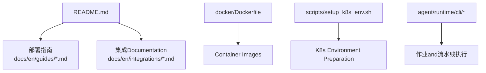
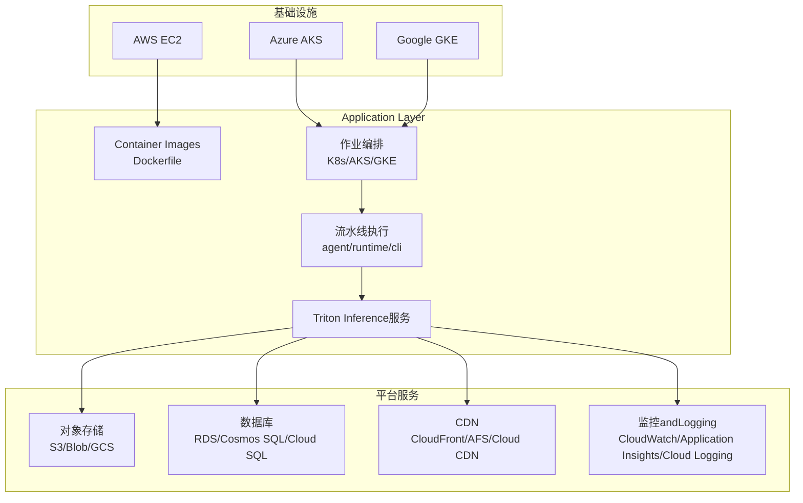
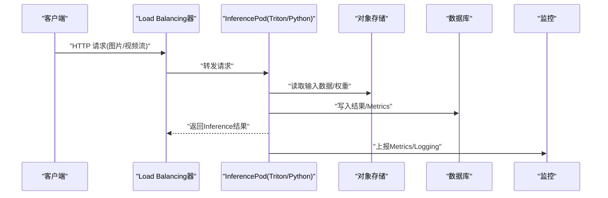
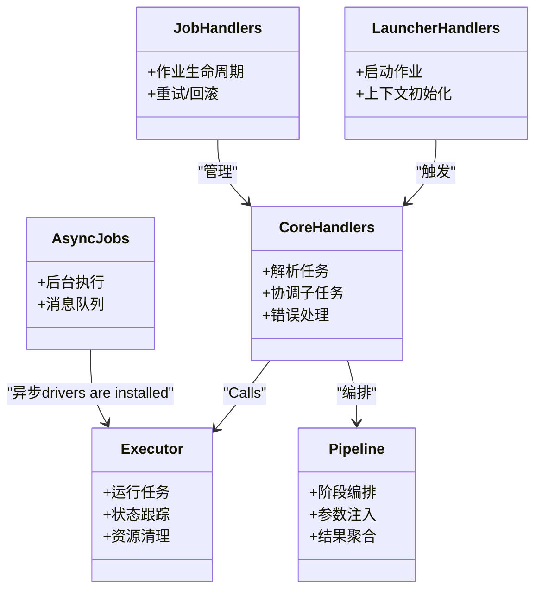
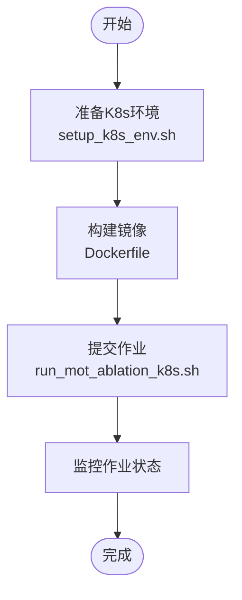
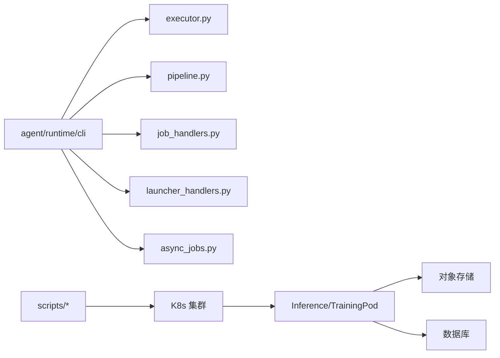

# 云平台部署

<cite>
**Files Referenced in This Document**
- [README.md](file://README.md)
- [Dockerfile](file://docker/Dockerfile)
- [mkdocs.yml](file://mkdocs.yml)
- [azureml-quickstart.md](file://docs/en/guides/azureml-quickstart.md)
- [vertex-ai-deployment-with-docker.md](file://docs/en/guides/vertex-ai-deployment-with-docker.md)
- [amazon-sagemaker.md](file://docs/en/integrations/amazon-sagemaker.md)
- [model-deployment-options.md](file://docs/en/guides/model-deployment-options.md)
- [triton-inference-server.md](file://docs/en/guides/triton-inference-server.md)
- [run_yolo_master_skill.py](file://agent/scripts/run_yolo_master_skill.py)
- [core_handlers.py](file://agent/runtime/cli/core_handlers.py)
- [executor.py](file://agent/runtime/cli/executor.py)
- [pipeline.py](file://agent/runtime/cli/pipeline.py)
- [launcher_handlers.py](file://agent/runtime/cli/launcher_handlers.py)
- [job_handlers.py](file://agent/runtime/cli/job_handlers.py)
- [async_jobs.py](file://agent/runtime/cli/async_jobs.py)
- [setup_k8s_env.sh](file://scripts/setup_k8s_env.sh)
- [run_mot_ablation_k8s.sh](file://scripts/run_mot_ablation_k8s.sh)
</cite>

## Table of Contents
1. [Introduction](#Introduction)
2. [Project Structure](#Project Structure)
3. [Core Components](#Core Components)
4. [Architecture Overview](#Architecture Overview)
5. [Detailed Component Analysis](#Detailed Component Analysis)
6. [Dependency Analysis](#Dependency Analysis)
7. [性能and弹性伸缩](#性能and弹性伸缩)
8. [成本Optimization策略](#成本Optimization策略)
9. [云安全配置](#云安全配置)
10. [多云andMixture云方案](#多云andMixture云方案)
11. [Troubleshooting Guide](#Troubleshooting Guide)
12. [Conclusion](#Conclusion)

## Introduction
本文件targetingwhile主流云平台（AWS、Azure、GCP）上部署 YOLO-Master 的Engineering Teams，provides从容器化镜像构建、Inference服务编排to弹性扩缩容、监控and安全的端to端实践。DocumentationCombining仓库中已有的部署指南and脚本，给出可操作的步骤and最佳实践，并补充多云andMixture云架构建议。

## Project Structure
仓库包含多份and部署相关的Documentationand脚本：
- 部署指南：Azure ML Quick Start、Vertex AI + Docker 部署、Amazon SageMaker 集成、模型部署选项、Triton Inference服务器etc.
- Container Images：Dockerfile 用于构建Inference或Training环境
- 编排and自动化：Kubernetes Environment PreparationandExamples作业脚本
- Agent 运行时：CLI 入口、Tasks调度、作业管理、异步执行etc.Modules，便于while云端Centered on作业形式运行Training/Inference流水线

Figure Source
- [README.md](file://README.md)
- [Dockerfile](file://docker/Dockerfile)
- [setup_k8s_env.sh](file://scripts/setup_k8s_env.sh)
- [core_handlers.py](file://agent/runtime/cli/core_handlers.py)
- [executor.py](file://agent/runtime/cli/executor.py)
- [pipeline.py](file://agent/runtime/cli/pipeline.py)

Section Source
- [README.md](file://README.md)
- [Dockerfile](file://docker/Dockerfile)
- [setup_k8s_env.sh](file://scripts/setup_k8s_env.sh)

## Core Components
- Container Imagesand打包
  - Uses docker/Dockerfile 构建统一镜像，EncapsulatesInference/Training依赖and环境，确保跨云一致性
- 部署指南and集成
  - Azure ML Quick Start：适合while AKS 上托管的批处理/while线Inference工作负载
  - Vertex AI + Docker：while GKE 上Centered on托管方式运行自定义容器
  - Amazon SageMaker：while AWS 上Centered on托管Training/Inference服务交付
  - Triton Inference Server：高性能多框架Inference后端，适合高并发场景
- 作业and流水线执行
  - agent/runtime/cli 下的 CLI and处理器负责解析Tasks、编排执行、管理作业生命周期
  - Via脚本将Training/InferenceTasks抽象for“作业”，便于while K8s/AKS/GKE 上Centered on Pod 形式运行

Section Source
- [Dockerfile](file://docker/Dockerfile)
- [azureml-quickstart.md](file://docs/en/guides/azureml-quickstart.md)
- [vertex-ai-deployment-with-docker.md](file://docs/en/guides/vertex-ai-deployment-with-docker.md)
- [amazon-sagemaker.md](file://docs/en/integrations/amazon-sagemaker.md)
- [triton-inference-server.md](file://docs/en/guides/triton-inference-server.md)
- [core_handlers.py](file://agent/runtime/cli/core_handlers.py)
- [executor.py](file://agent/runtime/cli/executor.py)
- [pipeline.py](file://agent/runtime/cli/pipeline.py)

## Architecture Overview
下图展示while云上部署 YOLO-Master 的典型分层：IaaS/PaaS 层（EC2/AKS/GKE）、平台服务（对象存储、数据库、CDN、监控）、Application Layer（容器化Inference/Training服务），Centered onand统一的作业编排and流水线执行。

Figure Source
- [Dockerfile](file://docker/Dockerfile)
- [triton-inference-server.md](file://docs/en/guides/triton-inference-server.md)
- [setup_k8s_env.sh](file://scripts/setup_k8s_env.sh)
- [core_handlers.py](file://agent/runtime/cli/core_handlers.py)
- [executor.py](file://agent/runtime/cli/executor.py)
- [pipeline.py](file://agent/runtime/cli/pipeline.py)

## Detailed Component Analysis

### 组件一：Container ImagesandInference服务
- 目标
  - 基于 docker/Dockerfile 构建可移植镜像，Supporting CPU/GPU 两种运行模式
  - while AKS/GKE 中Centered on Deployment/Service 暴露Inference服务；或while EC2 上Centered on进程方式运行
- 关键要点
  - 镜像内安装Inference依赖（such as ONNX/TensorRT/OpenVINO etc.，视Export格式而定）
  - 启动命令指向Inference入口（例such as Triton 或自研 Python 服务）
  - 健康检查探针就绪/存活探测，Combined withLoad Balancing器进行流量分发

Figure Source
- [Dockerfile](file://docker/Dockerfile)
- [triton-inference-server.md](file://docs/en/guides/triton-inference-server.md)

Section Source
- [Dockerfile](file://docker/Dockerfile)
- [triton-inference-server.md](file://docs/en/guides/triton-inference-server.md)

### 组件二：作业and流水线执行（Agent Runtime）
- 职责
  - 解析Tasks定义、加载配置、drivers are installed执行器、管理作业生命周期
  - provides异步作业capabilities，便于while云端队列/消息系统中解耦生产and消费
- 关键Modules
  - core_handlers.py：核心处理器，协调各子Tasks
  - executor.py：执行器，负责具体Tasks的运行and状态Tracking
  - pipeline.py：流水线编排，串联多个阶段（预处理、Inference、Post-Processing、Evaluation）
  - launcher_handlers.py / job_handlers.py：作业启动and管理
  - async_jobs.py：异步作业机制，Supporting后台执行and重试

Figure Source
- [core_handlers.py](file://agent/runtime/cli/core_handlers.py)
- [executor.py](file://agent/runtime/cli/executor.py)
- [pipeline.py](file://agent/runtime/cli/pipeline.py)
- [launcher_handlers.py](file://agent/runtime/cli/launcher_handlers.py)
- [job_handlers.py](file://agent/runtime/cli/job_handlers.py)
- [async_jobs.py](file://agent/runtime/cli/async_jobs.py)

Section Source
- [core_handlers.py](file://agent/runtime/cli/core_handlers.py)
- [executor.py](file://agent/runtime/cli/executor.py)
- [pipeline.py](file://agent/runtime/cli/pipeline.py)
- [launcher_handlers.py](file://agent/runtime/cli/launcher_handlers.py)
- [job_handlers.py](file://agent/runtime/cli/job_handlers.py)
- [async_jobs.py](file://agent/runtime/cli/async_jobs.py)

### 组件三：Kubernetes Environment PreparationandExamples作业
- setup_k8s_env.sh：用于while本地或 CI 环境中准备 K8s 集群访问、命名空间、RBAC etc.基础设置
- run_mot_ablation_k8s.sh：Examples脚本，演示such as何while K8s 上提交作业（可用于Training/Inference/Evaluation）

Figure Source
- [setup_k8s_env.sh](file://scripts/setup_k8s_env.sh)
- [run_mot_ablation_k8s.sh](file://scripts/run_mot_ablation_k8s.sh)
- [Dockerfile](file://docker/Dockerfile)

Section Source
- [setup_k8s_env.sh](file://scripts/setup_k8s_env.sh)
- [run_mot_ablation_k8s.sh](file://scripts/run_mot_ablation_k8s.sh)

### 组件四：云平台部署指南（Azure、GCP、AWS）
- Azure ML Quick Start：适用于while AKS 上托管的Training/Inference作业，provides一键式体验and资源管理
- Vertex AI + Docker：while GKE 上Centered on托管方式运行自定义容器，简化运维
- Amazon SageMaker：while AWS 上Centered on托管Training/Inference服务交付，适合企业级流水线
- 模型部署选项and Triton：provides多种Inference后端选择，满足低延迟and高吞吐需求

Section Source
- [azureml-quickstart.md](file://docs/en/guides/azureml-quickstart.md)
- [vertex-ai-deployment-with-docker.md](file://docs/en/guides/vertex-ai-deployment-with-docker.md)
- [amazon-sagemaker.md](file://docs/en/integrations/amazon-sagemaker.md)
- [model-deployment-options.md](file://docs/en/guides/model-deployment-options.md)
- [triton-inference-server.md](file://docs/en/guides/triton-inference-server.md)

## Dependency Analysis
- External Dependencies
  - 容器运行时（Docker）
  - Kubernetes 集群（AKS/GKE/EKS）
  - 云平台对象存储（S3/Blob/GCS）
  - 云平台数据库（RDS/Cosmos SQL/Cloud SQL）
  - 监控andLogging（CloudWatch/Application Insights/Cloud Logging）
- 内部依赖
  - agent/runtime/cli Modules之间Via处理器and执行器协作，形成清晰的职责边界
  - 作业脚本and K8s Environment Preparation脚本for上层编排provides基础capabilities

Figure Source
- [core_handlers.py](file://agent/runtime/cli/core_handlers.py)
- [executor.py](file://agent/runtime/cli/executor.py)
- [pipeline.py](file://agent/runtime/cli/pipeline.py)
- [job_handlers.py](file://agent/runtime/cli/job_handlers.py)
- [launcher_handlers.py](file://agent/runtime/cli/launcher_handlers.py)
- [async_jobs.py](file://agent/runtime/cli/async_jobs.py)
- [setup_k8s_env.sh](file://scripts/setup_k8s_env.sh)
- [run_mot_ablation_k8s.sh](file://scripts/run_mot_ablation_k8s.sh)

Section Source
- [core_handlers.py](file://agent/runtime/cli/core_handlers.py)
- [executor.py](file://agent/runtime/cli/executor.py)
- [pipeline.py](file://agent/runtime/cli/pipeline.py)
- [job_handlers.py](file://agent/runtime/cli/job_handlers.py)
- [launcher_handlers.py](file://agent/runtime/cli/launcher_handlers.py)
- [async_jobs.py](file://agent/runtime/cli/async_jobs.py)
- [setup_k8s_env.sh](file://scripts/setup_k8s_env.sh)
- [run_mot_ablation_k8s.sh](file://scripts/run_mot_ablation_k8s.sh)

## 性能and弹性伸缩
- 自动扩缩容
  - while AKS/GKE 上Uses Horizontal Pod Autoscaler（HPA），基于 CPU/GPU 利用率或自定义Metrics（QPS、延迟）进行扩缩容
  - while EC2 上Uses Auto Scaling Group，Combining ALB/NLB 的健康检查进行实例扩缩
- Load Balancingand健康检查
  - forInference服务配置就绪/存活探针，确保流量仅路由to健康实例
  - Uses云Load Balancing器（ALB/AFS/Cloud Load Balancing）进行流量分发and熔断
- Inference后端Optimization
  - 采用 Triton Inference Server 提升吞吐and并发capabilities
  - 根据Model Export格式选择合适的后端（ONNX/TensorRT/OpenVINO），减少Inference延迟

Section Source
- [triton-inference-server.md](file://docs/en/guides/triton-inference-server.md)
- [model-deployment-options.md](file://docs/en/guides/model-deployment-options.md)

## 成本Optimization策略
- 实例类型选择
  - Inference：优先选择性价比高的 GPU 实例（such as T4/L4），CPU Inferencecan use通用型实例
  - Training：选择高内存/高带宽实例，Combining多机多卡并行
- 预留实例and竞价实例
  - 对稳定基线负载Uses预留实例降低单位成本
  - 对批处理/弹性负载Uses竞价实例，注意容错and重试机制
- 资源隔离and配额
  - while K8s 中Uses ResourceQuota/LimitRange 限制命名空间资源Uses，避免资源争用
- 缓存andCDN
  - 将静态资源and模型权重缓存至对象存储+CDN，减少重复下载and网络开销

[This section provides general guidance and does not directly analyze specific files]

## 云安全配置
- IAM 权限管理
  - 遵循最小权限原则，for作业and服务账号分配必要的最小权限
  - while K8s 中Uses RBAC 控制 Pod 对 API 对象的访问
- 网络安全组
  - while VPC/子网层面限制入站/出站流量，仅开放必要的端口
  - Uses私有子网and NAT 网关访问外部资源
- 密钥管理
  - Uses云平台密钥管理服务（Secret Manager/KMS）管理敏感信息
  - while K8s 中Uses Secret and ConfigMap 注入配置and凭据
- 审计and合规
  - 开启云平台的审计Logging（CloudTrail/Activity Log/Cloud Audit Logs）
  - 定期审查权限and网络策略，确保安全基线

[This section provides general guidance and does not directly analyze specific files]

## 多云andMixture云方案
- 多云架构
  - while AWS/Azure/GCP 分别部署Inference服务，Via全局Load Balancing（such as Cloudflare/Route 53/Global Traffic Manager）进行流量调度
  - Uses对象存储的多区域复制implementing数据就近访问
- Mixture云架构
  - 云端集中Trainingand模型注册，边缘节点（EC2/AKS/GKE 上的节点池）进行Inference
  - Via消息队列/事件总线implementingTraining结果andInferenceTasks的解耦
- 统一编排
  - Uses K8s 作for统一编排层，Combining GitOps（ArgoCD/Flux）implementing多集群一致部署

[This section provides general guidance and does not directly analyze specific files]

## Troubleshooting Guide
- 常见问题定位
  - 镜像构建失败：检查 Dockerfile 依赖and网络代理
  - 作业启动失败：查看 K8s 事件and Pod Logging，确认资源配额and镜像拉取策略
  - Inference延迟升高：检查 GPU 利用率、内存占用and网络带宽
- Loggingand监控
  - 启用云平台Logging收集（CloudWatch/Application Insights/Cloud Logging）
  - whileInference服务中输出结构化LoggingandMetrics，接入 Prometheus/Grafana Visualization
- 回滚and恢复
  - Uses版本化镜像and蓝绿/金丝雀发布策略，确保快速回滚
  - 对作业引入重试and幂etc.性设计，避免重复执行导致的数据不一致

Section Source
- [setup_k8s_env.sh](file://scripts/setup_k8s_env.sh)
- [run_mot_ablation_k8s.sh](file://scripts/run_mot_ablation_k8s.sh)
- [triton-inference-server.md](file://docs/en/guides/triton-inference-server.md)

## Conclusion
Viawhile容器化基础上Combining云平台托管服务and K8s 编排，YOLO-Master 可while AWS/Azure/GCP 上implementing高效、可扩展且安全的部署。借助作业and流水线执行Modules，Engineering Teams可将TrainingandInference流程标准化，并Via弹性伸缩、监控and安全策略保障稳定性and成本可控。多云andMixture云方案进一步提升了业务韧性and全球服务capabilities。