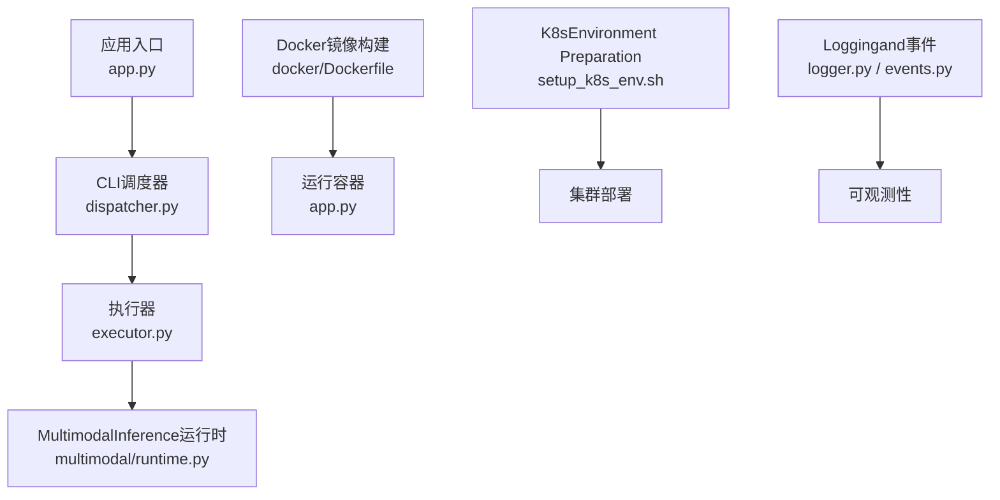
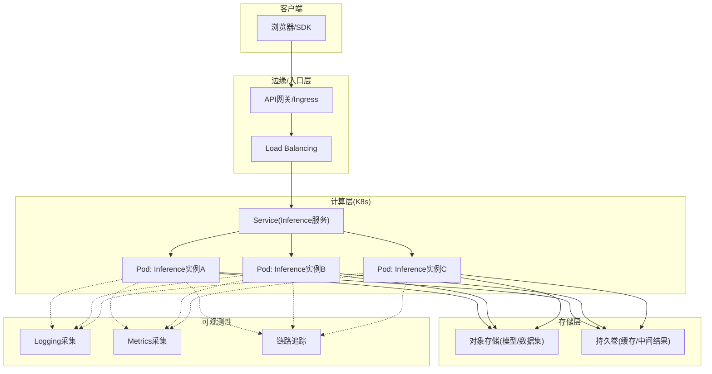
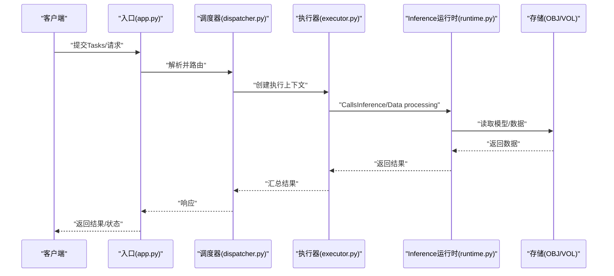
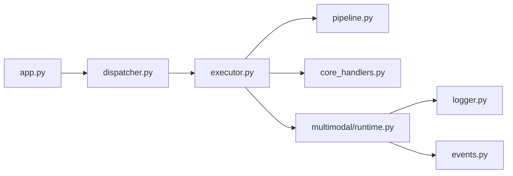

# Cloud Service Deployment

<cite>
**Files Referenced in This Document**
- [Dockerfile](file://docker/Dockerfile)
- [.dockerignore](file://.dockerignore)
- [app.py](file://app.py)
- [pyproject.toml](file://pyproject.toml)
- [mkdocs.yml](file://mkdocs.yml)
- [README.md](file://README.md)
- [docs/en/guides/docker-quickstart.md](file://docs/en/guides/docker-quickstart.md)
- [docs/en/guides/model-deployment-options.md](file://docs/en/guides/model-deployment-options.md)
- [docs/en/guides/triton-inference-server.md](file://docs/en/guides/triton-inference-server.md)
- [docs/en/integrations/amazon-sagemaker.md](file://docs/en/integrations/amazon-sagemaker.md)
- [docs/en/guides/vertex-ai-deployment-with-docker.md](file://docs/en/guides/vertex-ai-deployment-with-docker.md)
- [docs/en/guides/azureml-quickstart.md](file://docs/en/guides/azureml-quickstart.md)
- [scripts/setup_k8s_env.sh](file://scripts/setup_k8s_env.sh)
- [scripts/run_yolo_master_skill.py](file://agent/scripts/run_yolo_master_skill.py)
- [agent/runtime/cli/core_handlers.py](file://agent/runtime/cli/core_handlers.py)
- [agent/runtime/cli/dispatcher.py](file://agent/runtime/cli/dispatcher.py)
- [agent/runtime/cli/executor.py](file://agent/runtime/cli/executor.py)
- [agent/runtime/cli/pipeline.py](file://agent/runtime/cli/pipeline.py)
- [agent/runtime/multimodal/runtime.py](file://agent/runtime/multimodal/runtime.py)
- [ultralytics/utils/logger.py](file://ultralytics/utils/logger.py)
- [ultralytics/utils/events.py](file://ultralytics/utils/events.py)
</cite>

## Table of Contents
1. [Introduction](#Introduction)
2. [Project Structure](#Project Structure)
3. [Core Components](#Core Components)
4. [Architecture Overview](#Architecture Overview)
5. [Detailed Component Analysis](#Detailed Component Analysis)
6. [Dependency Analysis](#Dependency Analysis)
7. [性能and伸缩性](#性能and伸缩性)
8. [CI/CD流水线](#cicd流水线)
9. [监控andLogging](#监控andLogging)
10. [安全加固and访问控制](#安全加固and访问控制)
11. [成本Optimizationand资源管理](#成本Optimizationand资源管理)
12. [高可用and灾难恢复](#高可用and灾难恢复)
13. [Troubleshooting Guide](#Troubleshooting Guide)
14. [Conclusion](#Conclusion)

## Introduction
本技术DocumentationtargetingYOLO-Master的Cloud Service Deployment，围绕容器化、微服务架构、云平台落地、弹性伸缩、CI/CD、云原生可观测性、安全and合规、成本OptimizationCentered onand高可用and灾备etc.主题，provides从镜像构建to生产运行的完整实践路径。Documentation同时Combining仓库中已有的Dockerfile、应用入口、CLI调度器andInference运行时etc.代码资产，给出可落地的架构图and流程说明。

## Project Structure
仓库中andCloud Service Deployment直接相关的核心资产包括：
- Container Images定义and忽略规则：docker/Dockerfile、.dockerignore
- 应用入口and依赖声明：app.py、pyproject.toml
- Documentationand平台集成指引：docs/en/guides/*、docs/en/integrations/*
- KubernetesEnvironment Preparation脚本：scripts/setup_k8s_env.sh
- Tasks编排andInference运行时：agent/runtime/cli/*、agent/runtime/multimodal/runtime.py
- Loggingand事件基础设施：ultralytics/utils/logger.py、ultralytics/utils/events.py

Figure Source
- [app.py](file://app.py)
- [dispatcher.py](file://agent/runtime/cli/dispatcher.py)
- [executor.py](file://agent/runtime/cli/executor.py)
- [runtime.py](file://agent/runtime/multimodal/runtime.py)
- [Dockerfile](file://docker/Dockerfile)
- [setup_k8s_env.sh](file://scripts/setup_k8s_env.sh)
- [logger.py](file://ultralytics/utils/logger.py)
- [events.py](file://ultralytics/utils/events.py)

Section Source
- [Dockerfile](file://docker/Dockerfile)
- [.dockerignore](file://.dockerignore)
- [app.py](file://app.py)
- [pyproject.toml](file://pyproject.toml)
- [setup_k8s_env.sh](file://scripts/setup_k8s_env.sh)
- [dispatcher.py](file://agent/runtime/cli/dispatcher.py)
- [executor.py](file://agent/runtime/cli/executor.py)
- [runtime.py](file://agent/runtime/multimodal/runtime.py)
- [logger.py](file://ultralytics/utils/logger.py)
- [events.py](file://ultralytics/utils/events.py)

## Core Components
- Container Images层
  - Dockerfile负责构建Inferenceand服务运行所需的基础镜像，包含Python环境、依赖安装and入口配置。
  - .dockerignore用于排除无关文件，减小镜像体积并提升构建速度。
- 应用入口and依赖
  - app.py作for服务启动入口，承载HTTP或进程内API暴露capabilities（具体协议Centered onimplementingfor准）。
  - pyproject.toml声明项目依赖and打包元数据，确保构建一致性and可重现性。
- CLIandTasks编排
  - dispatcher.py负责请求分发and路由；executor.py负责具体Tasks执行；pipeline.py串联多阶段处理。
  - run_yolo_master_skill.pyfor技能化Tasks的Unified entry point，便于while容器或K8s中Centered onJob/Pod形式运行。
- Inference运行时
  - multimodal/runtime.pyEncapsulatesMultimodalInferencecapabilities，供上层Calls。
- 可观测性
  - logger.pyandevents.pyprovides结构化Loggingand事件上报capabilities，便于接入外部监控系统。

Section Source
- [Dockerfile](file://docker/Dockerfile)
- [.dockerignore](file://.dockerignore)
- [app.py](file://app.py)
- [pyproject.toml](file://pyproject.toml)
- [run_yolo_master_skill.py](file://agent/scripts/run_yolo_master_skill.py)
- [core_handlers.py](file://agent/runtime/cli/core_handlers.py)
- [dispatcher.py](file://agent/runtime/cli/dispatcher.py)
- [executor.py](file://agent/runtime/cli/executor.py)
- [pipeline.py](file://agent/runtime/cli/pipeline.py)
- [runtime.py](file://agent/runtime/multimodal/runtime.py)
- [logger.py](file://ultralytics/utils/logger.py)
- [events.py](file://ultralytics/utils/events.py)

## Architecture Overview
下图展示基于容器的微服务部署Refer to架构：API网关对外暴露Unified entry point，后端由多个无状态InferencePod组成，ViaKubernetes Service进行Load Balancingand发现；持久化数据and模型权重挂载至共享存储；LoggingandMetricsViaSidecar或DaemonSet收集。

[此图for概念性架构图，不直接映射具体源码文件]

## Detailed Component Analysis

### Container Imagesand构建Optimization
- 多阶段构建建议
  - 构建阶段：安装编译型依赖、下载大体积模型权重、生成Export产物。
  - 运行阶段：仅保留最小运行依赖and必要二进制，显著降低镜像体积。
- 镜像分层and缓存
  - 将频繁变更的代码and稳定依赖分层，利用Docker缓存加速增量构建。
- 安全基线
  - Uses非rootUser运行容器；定期扫描镜像漏洞；最小权限原则。
- Refer toimplementing位置
  - 镜像构建定义位于docker/Dockerfile；忽略规则位于.dockerignore。

Section Source
- [Dockerfile](file://docker/Dockerfile)
- [.dockerignore](file://.dockerignore)

### 应用入口and依赖管理
- 入口职责
  - app.py作for服务启动点，负责初始化依赖、Load model、暴露接口and优雅关停。
- 依赖声明
  - pyproject.toml集中声明Runtime DependenciesandOptional特性，保证跨环境一致性。
- 最佳实践
  - Uses虚拟环境隔离；锁定依赖版本；按需启用GPU/CPU后端。

Section Source
- [app.py](file://app.py)
- [pyproject.toml](file://pyproject.toml)

### CLI调度andTasks编排
- 组件职责
  - dispatcher.py：接收Tasks、解析参数、选择执行策略。
  - executor.py：执行具体Inference或TrainingTasks，管理生命周期and错误回退。
  - pipeline.py：组合多个步骤形成End-to-end pipeline。
  - core_handlers.py：通用处理器，such as输入校验、输出格式化。
- 编排模式
  - Supporting同步/异步Tasks；具备重试、超时and熔断机制。
- Refer toimplementing位置
  - agent/runtime/cli/dispatcher.py、executor.py、pipeline.py、core_handlers.py

Figure Source
- [app.py](file://app.py)
- [dispatcher.py](file://agent/runtime/cli/dispatcher.py)
- [executor.py](file://agent/runtime/cli/executor.py)
- [runtime.py](file://agent/runtime/multimodal/runtime.py)

Section Source
- [dispatcher.py](file://agent/runtime/cli/dispatcher.py)
- [executor.py](file://agent/runtime/cli/executor.py)
- [pipeline.py](file://agent/runtime/cli/pipeline.py)
- [core_handlers.py](file://agent/runtime/cli/core_handlers.py)

### MultimodalInference运行时
- 功能要点
  - 统一Encapsulates图像/文本etc.Multimodal输入预处理、模型加载、InferenceandPost-Processing。
  - Supporting动态批处理、Device Selectionand内存复用。
- 扩展点
  - ViaAdapter模式接入不同后端（ONNX/TensorRT/OpenVINOetc.）。
- Refer toimplementing位置
  - agent/runtime/multimodal/runtime.py

Section Source
- [runtime.py](file://agent/runtime/multimodal/runtime.py)

### 云平台部署Refer to
- Amazon SageMaker
  - UsesContainer Images部署自定义Inference端点；CombiningSageMaker Model Registry管理模型版本。
  - Refer to：docs/en/integrations/amazon-sagemaker.md
- Google Vertex AI
  - ViaVertex AI Endpoint部署Docker镜像；Combined with自动扩缩容and灰度发布。
  - Refer to：docs/en/guides/vertex-ai-deployment-with-docker.md
- Azure ML
  - UsesAzure ML实时Inference端点或批Inference作业；CombiningManaged Identityand密钥管理。
  - Refer to：docs/en/guides/azureml-quickstart.md
- Triton Inference Server
  - 对多框架模型进行统一服务化，适合大规模并发场景。
  - Refer to：docs/en/guides/triton-inference-server.md
- DockerQuick Start
  - 本地ValidationandContainerized Deployment基础步骤。
  - Refer to：docs/en/guides/docker-quickstart.md

Section Source
- [amazon-sagemaker.md](file://docs/en/integrations/amazon-sagemaker.md)
- [vertex-ai-deployment-with-docker.md](file://docs/en/guides/vertex-ai-deployment-with-docker.md)
- [azureml-quickstart.md](file://docs/en/guides/azureml-quickstart.md)
- [triton-inference-server.md](file://docs/en/guides/triton-inference-server.md)
- [docker-quickstart.md](file://docs/en/guides/docker-quickstart.md)

### KubernetesEnvironment Preparationand部署
- Environment Preparation
  - setup_k8s_env.sh用于初始化命名空间、RBAC、ConfigMap/Secret、存储类andIngressetc.基础资源。
- 部署建议
  - Deployment+HPAimplementing水平扩缩容；Service暴露内部流量；Ingress/Gateway暴露外部流量。
  - UsesStatefulSet管理有状态工作负载（such as缓存、索引）。
- Refer toimplementing位置
  - scripts/setup_k8s_env.sh

Section Source
- [setup_k8s_env.sh](file://scripts/setup_k8s_env.sh)

## Dependency Analysis
- Modules耦合
  - app.py依赖CLI调度器and执行器；执行器依赖Inference运行时；Runtime Dependencies底层模型后端。
- External Dependencies
  - 云平台SDK、对象存储SDK、Logging/Metrics采集Agent。
- 潜while风险
  - 循环依赖需避免；第三方库升级需回归测试；大模型权重加载需预热and缓存。

Figure Source
- [app.py](file://app.py)
- [dispatcher.py](file://agent/runtime/cli/dispatcher.py)
- [executor.py](file://agent/runtime/cli/executor.py)
- [pipeline.py](file://agent/runtime/cli/pipeline.py)
- [core_handlers.py](file://agent/runtime/cli/core_handlers.py)
- [runtime.py](file://agent/runtime/multimodal/runtime.py)
- [logger.py](file://ultralytics/utils/logger.py)
- [events.py](file://ultralytics/utils/events.py)

Section Source
- [app.py](file://app.py)
- [dispatcher.py](file://agent/runtime/cli/dispatcher.py)
- [executor.py](file://agent/runtime/cli/executor.py)
- [pipeline.py](file://agent/runtime/cli/pipeline.py)
- [core_handlers.py](file://agent/runtime/cli/core_handlers.py)
- [runtime.py](file://agent/runtime/multimodal/runtime.py)
- [logger.py](file://ultralytics/utils/logger.py)
- [events.py](file://ultralytics/utils/events.py)

## 性能and伸缩性
- Inference Performance
  - Uses量化and图Optimization（TensorRT/ONNX Runtime）；Set appropriatelybatch sizeand并发度；启用GPU内存池。
- 弹性伸缩
  - 基于CPU/GPU利用率、队列长度andP99延迟的HPA策略；冷启动Optimization（模型预热、懒加载）。
- 资源隔离
  - ViaK8s Limit/Requestand节点亲和/反亲和保障稳定性。
- Refer toDocumentation
  - docs/en/guides/model-deployment-options.md

Section Source
- [model-deployment-options.md](file://docs/en/guides/model-deployment-options.md)

## CI/CD流水线
- 推荐流程
  - 代码提交触发静态检查and单元测试；构建镜像并推送镜像仓库；while预发环境进行冒烟测试；灰度发布and回滚策略。
- 关键工件
  - Docker镜像、模型权重包、配置清单（Helm/Kustomize）、制品库中的可追溯版本。
- 自动化部署
  - UsesArgo CD/Flux进行GitOps；蓝绿/金丝雀发布；健康检查and探针。
- Refer to入口
  - agent/scripts/run_yolo_master_skill.py可作forCI中批量Tasks或Job的入口。

Section Source
- [run_yolo_master_skill.py](file://agent/scripts/run_yolo_master_skill.py)

## 监控andLogging
- Logging规范
  - 结构化JSON格式；包含trace_id、task_id、耗时、资源占用etc.字段。
- Metrics采集
  - 暴露PrometheusMetrics；采集QPS、延迟分位、错误率、GPU利用率、显存占用。
- 链路追踪
  - 集成OpenTelemetry，贯穿网关、服务andInference运行时。
- Refer toimplementing位置
  - ultralytics/utils/logger.py、ultralytics/utils/events.py

Section Source
- [logger.py](file://ultralytics/utils/logger.py)
- [events.py](file://ultralytics/utils/events.py)

## 安全加固and访问控制
- 镜像安全
  - 最小镜像、非root运行、定期漏洞扫描and签名校验。
- 运行时安全
  - 网络策略限制入出站；SecretandKMS管理敏感信息；只读根文件系统。
- 访问控制
  - 网关鉴权（JWT/OAuth2）；细粒度RBAC；审计Logging。
- 合规and治理
  - 数据脱敏and加密传输；模型水印and溯源；变更审批and基线对比。

[本节for通用实践指导，不直接分析具体文件]

## 成本Optimizationand资源管理
- 资源规划
  - 根据峰值and长尾需求选择机型；合理UsesSpot实例and抢占式资源。
- 模型andInferenceOptimization
  - Model Compressionand蒸馏；动态批处理；缓存热点结果。
- 存储and带宽
  - 冷热分层存储；就近读取andCDN加速。
- Refer toDocumentation
  - README.md、docs/en/guides/model-deployment-options.md

Section Source
- [README.md](file://README.md)
- [model-deployment-options.md](file://docs/en/guides/model-deployment-options.md)

## 高可用and灾难恢复
- 多可用区部署
  - 跨AZ分布Podand数据库；失败域隔离。
- 备份and恢复
  - 定期快照and异地复制；演练恢复流程andRTO/RPO目标。
- 降级and熔断
  - 限流and熔断保护；降级策略（返回缓存或近似结果）。
- Refer to脚本
  - scripts/setup_k8s_env.sh可用于初始化高可用相关的基础资源。

Section Source
- [setup_k8s_env.sh](file://scripts/setup_k8s_env.sh)

## Troubleshooting Guide
- 常见问题定位
  - 启动失败：检查入口app.pyand依赖；查看容器Loggingand事件。
  - Inference异常：核对输入格式、模型版本and设备可用性；关注执行器and运行时Logging。
  - 性能退化：观察Metricsand慢查询；Evaluation批大小and并发度。
- 工具and技巧
  - Useskubectl logs/exec/port-forward；开启调试Logging；复现最小用例。
- Refer toimplementing位置
  - app.py、dispatcher.py、executor.py、runtime.py、logger.py、events.py

Section Source
- [app.py](file://app.py)
- [dispatcher.py](file://agent/runtime/cli/dispatcher.py)
- [executor.py](file://agent/runtime/cli/executor.py)
- [runtime.py](file://agent/runtime/multimodal/runtime.py)
- [logger.py](file://ultralytics/utils/logger.py)
- [events.py](file://ultralytics/utils/events.py)

## Conclusion
Via将YOLO-Master的服务andInferencecapabilities容器化，并CombiningKubernetesand主流云平台capabilities，可implementing高可用、可扩展、可观测且安全的云端部署。建议whileCI/CD中固化镜像构建and发布流程，完善Monitoring and Alertingand容量规划，持续进行安全加固and成本Optimization，从而while生产环境中获得稳定高效的Inference服务体验。