# 部署监控and维护

<cite>
**Files Referenced in This Document**
- [model-monitoring-and-maintenance.md](file://docs/en/guides/model-monitoring-and-maintenance.md)
- [yolo-performance-metrics.md](file://docs/en/guides/yolo-performance-metrics.md)
- [triton-inference-server.md](file://docs/en/guides/triton-inference-server.md)
- [queue-management.md](file://docs/en/guides/queue-management.md)
- [analytics.md](file://docs/en/guides/analytics.md)
- [benchmark.md](file://docs/en/modes/benchmark.md)
- [benchmarks/run.py](file://benchmarks/run.py)
- [benchmarks/suite.py](file://benchmarks/suite.py)
- [benchmarks/suites.yaml](file://benchmarks/suites.yaml)
- [benchmarks/benchmark_molora_dispatch.py](file://benchmarks/benchmark_molora_dispatch.py)
- [benchmarks/benchmark_mot_dispatch.py](file://benchmarks/benchmark_mot_dispatch.py)
- [utils/benchmarks.py](file://ultralytics/utils/benchmarks.py)
- [utils/logger.py](file://ultralytics/utils/logger.py)
- [utils/events.py](file://ultralytics/utils/events.py)
- [engine/predictor.py](file://ultralytics/engine/predictor.py)
- [engine/validator.py](file://ultralytics/engine/validator.py)
- [engine/trainer.py](file://ultralytics/engine/trainer.py)
- [solutions/streamlit_inference.py](file://ultralytics/solutions/streamlit_inference.py)
- [solutions/analytics.py](file://ultralytics/solutions/analytics.py)
- [tests/test_benchmark_suite.py](file://tests/test_benchmark_suite.py)
- [tests/test_metrics_numerical_stability.py](file://tests/test_metrics_numerical_stability.py)
- [tests/test_runtime_state_reset.py](file://tests/test_runtime_state_reset.py)
- [tests/test_ddp_error_propagation_e2e.py](file://tests/test_ddp_error_propagation_e2e.py)
- [tests/test_ddp_root_cause_reporting.py](file://tests/test_ddp_root_cause_reporting.py)
- [scripts/smoke_test_coco2017.py](file://scripts/smoke_test_coco2017.py)
- [scripts/run_planner_lovo_calibration.py](file://scripts/run_planner_lovo_calibration.py)
- [tools/config_drift_detector.py](file://tools/config_drift_detector.py)
- [governance/performance-gates.md](file://docs/governance/performance-gates.md)
</cite>

## Table of Contents
1. [Introduction](#Introduction)
2. [Project Structure](#Project Structure)
3. [Core Components](#Core Components)
4. [Architecture Overview](#Architecture Overview)
5. [Detailed Component Analysis](#Detailed Component Analysis)
6. [Dependency Analysis](#Dependency Analysis)
7. [性能考量](#性能考量)
8. [Troubleshooting Guide](#Troubleshooting Guide)
9. [Conclusion](#Conclusion)
10. [Appendix](#Appendix)

## Introduction
本技术DocumentationtargetingYOLO-Master的部署、监控and维护，围绕Centered on下目标unfold：
- 定义并采集关键性能Metrics（延迟、吞吐量、内存Uses率、GPU利用率etc.）
- 设计分布式部署的监控策略（多节点协调andLoad Balancing监控）
- 构建Logging收集and集中化管理方案（结构化Loggingand链路追踪）
- 制定告警规则and阈值配置方法
- 自动化执行性能基准测试and回归测试
- implementing健康检查and自愈机制
- provides容量规划and扩容策略指导
- 建立故障诊断and根因分析工具and方法
- 编写运维手册and应急预案

## Project Structure
仓库中and“部署监控and维护”直接相关的代码andDocumentation主要分布whilesuch as下位置：
- Documentationand指南：docs/en/guides 下的模型监控、性能Metrics、TritonInference服务、队列管理、分析etc.
- 基准Test Suite：benchmarks Table of Contentsand ultralytics/utils/benchmarks.py
- 运行时and引擎：ultralytics/engine 下的Predictor、Validator、Trainer
- 解决方案andExamples：ultralytics/solutions 中的流式Inferenceand分析Modules
- 测试and治理：tests and docs/governance 下的基准and性能门禁相关用例and规范
- 工具脚本：scripts and tools 下用于冒烟测试、校准、配置Drift Detectionetc.

```mermaid
graph TB
subgraph "Documentationand指南"
D1["模型监控and维护<br/>docs/en/guides/model-monitoring-and-maintenance.md"]
D2["YOLO性能Metrics<br/>docs/en/guides/yolo-performance-metrics.md"]
D3["TritonInference服务<br/>docs/en/guides/triton-inference-server.md"]
D4["队列管理<br/>docs/en/guides/queue-management.md"]
D5["分析capabilities<br/>docs/en/guides/analytics.md"]
end
subgraph "基准and工具"
B1["基准运行入口<br/>benchmarks/run.py"]
B2["Benchmark Suite定义<br/>benchmarks/suite.py"]
B3["基准数据表<br/>benchmarks/suites.yaml"]
U1["通用基准工具<br/>ultralytics/utils/benchmarks.py"]
end
subgraph "运行时and引擎"
E1["Predictor<br/>ultralytics/engine/predictor.py"]
E2["Validator<br/>ultralytics/engine/validator.py"]
E3["Trainer<br/>ultralytics/engine/trainer.py"]
S1["流式InferenceUI<br/>ultralytics/solutions/streamlit_inference.py"]
S2["分析Modules<br/>ultralytics/solutions/analytics.py"]
end
subgraph "测试and治理"
T1["Benchmark Suite测试<br/>tests/test_benchmark_suite.py"]
T2["Metrics数值稳定性<br/>tests/test_metrics_numerical_stability.py"]
T3["运行时状态重置<br/>tests/test_runtime_state_reset.py"]
T4["DDP错误传播E2E<br/>tests/test_ddp_error_propagation_e2e.py"]
T5["DDP根因报告<br/>tests/test_ddp_root_cause_reporting.py"]
G1["性能门禁<br/>docs/governance/performance-gates.md"]
end
D1 --> E1
D2 --> U1
D3 --> E1
D4 --> E1
D5 --> S2
B1 --> U1
B2 --> U1
B3 --> B2
E1 --> S1
E1 --> S2
T1 --> B1
T2 --> E2
T3 --> E1
T4 --> E3
T5 --> E3
G1 --> B1
```

Figure Source
- [model-monitoring-and-maintenance.md](file://docs/en/guides/model-monitoring-and-maintenance.md)
- [yolo-performance-metrics.md](file://docs/en/guides/yolo-performance-metrics.md)
- [triton-inference-server.md](file://docs/en/guides/triton-inference-server.md)
- [queue-management.md](file://docs/en/guides/queue-management.md)
- [analytics.md](file://docs/en/guides/analytics.md)
- [benchmarks/run.py](file://benchmarks/run.py)
- [benchmarks/suite.py](file://benchmarks/suite.py)
- [benchmarks/suites.yaml](file://benchmarks/suites.yaml)
- [utils/benchmarks.py](file://ultralytics/utils/benchmarks.py)
- [engine/predictor.py](file://ultralytics/engine/predictor.py)
- [engine/validator.py](file://ultralytics/engine/validator.py)
- [engine/trainer.py](file://ultralytics/engine/trainer.py)
- [solutions/streamlit_inference.py](file://ultralytics/solutions/streamlit_inference.py)
- [solutions/analytics.py](file://ultralytics/solutions/analytics.py)
- [tests/test_benchmark_suite.py](file://tests/test_benchmark_suite.py)
- [tests/test_metrics_numerical_stability.py](file://tests/test_metrics_numerical_stability.py)
- [tests/test_runtime_state_reset.py](file://tests/test_runtime_state_reset.py)
- [tests/test_ddp_error_propagation_e2e.py](file://tests/test_ddp_error_propagation_e2e.py)
- [tests/test_ddp_root_cause_reporting.py](file://tests/test_ddp_root_cause_reporting.py)
- [governance/performance-gates.md](file://docs/governance/performance-gates.md)

Section Source
- [model-monitoring-and-maintenance.md](file://docs/en/guides/model-monitoring-and-maintenance.md)
- [yolo-performance-metrics.md](file://docs/en/guides/yolo-performance-metrics.md)
- [triton-inference-server.md](file://docs/en/guides/triton-inference-server.md)
- [queue-management.md](file://docs/en/guides/queue-management.md)
- [analytics.md](file://docs/en/guides/analytics.md)
- [benchmarks/run.py](file://benchmarks/run.py)
- [benchmarks/suite.py](file://benchmarks/suite.py)
- [benchmarks/suites.yaml](file://benchmarks/suites.yaml)
- [utils/benchmarks.py](file://ultralytics/utils/benchmarks.py)
- [engine/predictor.py](file://ultralytics/engine/predictor.py)
- [engine/validator.py](file://ultralytics/engine/validator.py)
- [engine/trainer.py](file://ultralytics/engine/trainer.py)
- [solutions/streamlit_inference.py](file://ultralytics/solutions/streamlit_inference.py)
- [solutions/analytics.py](file://ultralytics/solutions/analytics.py)
- [tests/test_benchmark_suite.py](file://tests/test_benchmark_suite.py)
- [tests/test_metrics_numerical_stability.py](file://tests/test_metrics_numerical_stability.py)
- [tests/test_runtime_state_reset.py](file://tests/test_runtime_state_reset.py)
- [tests/test_ddp_error_propagation_e2e.py](file://tests/test_ddp_error_propagation_e2e.py)
- [tests/test_ddp_root_cause_reporting.py](file://tests/test_ddp_root_cause_reporting.py)
- [governance/performance-gates.md](file://docs/governance/performance-gates.md)

## Core Components
- 性能Metricsand采集
  - 延迟、吞吐、内存andGPU利用率的定义and采集方式while性能MetricsDocumentation中给出；基准工具provides统一度量接口。
  - Refer to路径：[yolo-performance-metrics.md](file://docs/en/guides/yolo-performance-metrics.md)、[utils/benchmarks.py](file://ultralytics/utils/benchmarks.py)
- Inferenceand服务化
  - TritonInference服务集成指南and队列管理策略for高并发场景provides支撑。
  - Refer to路径：[triton-inference-server.md](file://docs/en/guides/triton-inference-server.md)、[queue-management.md](file://docs/en/guides/queue-management.md)
- 分析andVisualization
  - 分析Modulesand流式InferenceUI便于while线观测and离线复盘。
  - Refer to路径：[analytics.md](file://docs/en/guides/analytics.md)、[solutions/analytics.py](file://ultralytics/solutions/analytics.py)、[solutions/streamlit_inference.py](file://ultralytics/solutions/streamlit_inference.py)
- 基准and回归
  - Benchmark Suiteand测试用例覆盖端to端流程，确保回归稳定。
  - Refer to路径：[benchmarks/run.py](file://benchmarks/run.py)、[benchmarks/suite.py](file://benchmarks/suite.py)、[benchmarks/suites.yaml](file://benchmarks/suites.yaml)、[tests/test_benchmark_suite.py](file://tests/test_benchmark_suite.py)
- 分布式and容错
  - DDP错误传播and根因报告测试保障Distributed Training/Inference的可观测性and可恢复性。
  - Refer to路径：[tests/test_ddp_error_propagation_e2e.py](file://tests/test_ddp_error_propagation_e2e.py)、[tests/test_ddp_root_cause_reporting.py](file://tests/test_ddp_root_cause_reporting.py)
- 配置and门禁
  - 性能门禁and配置Drift Detection用于发布前质量把关。
  - Refer to路径：[governance/performance-gates.md](file://docs/governance/performance-gates.md)、[tools/config_drift_detector.py](file://tools/config_drift_detector.py)

Section Source
- [yolo-performance-metrics.md](file://docs/en/guides/yolo-performance-metrics.md)
- [utils/benchmarks.py](file://ultralytics/utils/benchmarks.py)
- [triton-inference-server.md](file://docs/en/guides/triton-inference-server.md)
- [queue-management.md](file://docs/en/guides/queue-management.md)
- [analytics.md](file://docs/en/guides/analytics.md)
- [solutions/analytics.py](file://ultralytics/solutions/analytics.py)
- [solutions/streamlit_inference.py](file://ultralytics/solutions/streamlit_inference.py)
- [benchmarks/run.py](file://benchmarks/run.py)
- [benchmarks/suite.py](file://benchmarks/suite.py)
- [benchmarks/suites.yaml](file://benchmarks/suites.yaml)
- [tests/test_benchmark_suite.py](file://tests/test_benchmark_suite.py)
- [tests/test_ddp_error_propagation_e2e.py](file://tests/test_ddp_error_propagation_e2e.py)
- [tests/test_ddp_root_cause_reporting.py](file://tests/test_ddp_root_cause_reporting.py)
- [governance/performance-gates.md](file://docs/governance/performance-gates.md)
- [tools/config_drift_detector.py](file://tools/config_drift_detector.py)

## Architecture Overview
下图展示从请求进入、Inference执行、Metrics采集toLoggingand告警的整体流程，并and实际源码文件对应。

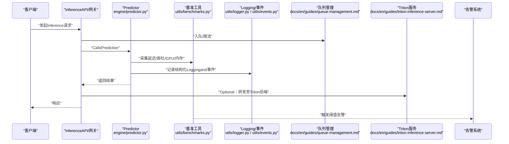

Figure Source
- [engine/predictor.py](file://ultralytics/engine/predictor.py)
- [utils/benchmarks.py](file://ultralytics/utils/benchmarks.py)
- [utils/logger.py](file://ultralytics/utils/logger.py)
- [utils/events.py](file://ultralytics/utils/events.py)
- [queue-management.md](file://docs/en/guides/queue-management.md)
- [triton-inference-server.md](file://docs/en/guides/triton-inference-server.md)

## Detailed Component Analysis

### 性能Metrics定义and采集
- Metrics定义
  - 延迟：端to端请求处理时间（含预处理、Inference、Post-Processing）
  - 吞吐：单位时间内处理的请求数或样本数
  - 内存Uses率：进程/设备内存占用比例
  - GPU利用率：GPU计算单元and显存占用情况
- 采集方法
  - Via基准工具Encapsulates的计时and资源探针进行采集
  - whilePredictorandValidator中埋点，Combining事件系统上报
  - Refer to路径：[yolo-performance-metrics.md](file://docs/en/guides/yolo-performance-metrics.md)、[utils/benchmarks.py](file://ultralytics/utils/benchmarks.py)、[engine/predictor.py](file://ultralytics/engine/predictor.py)、[engine/validator.py](file://ultralytics/engine/validator.py)

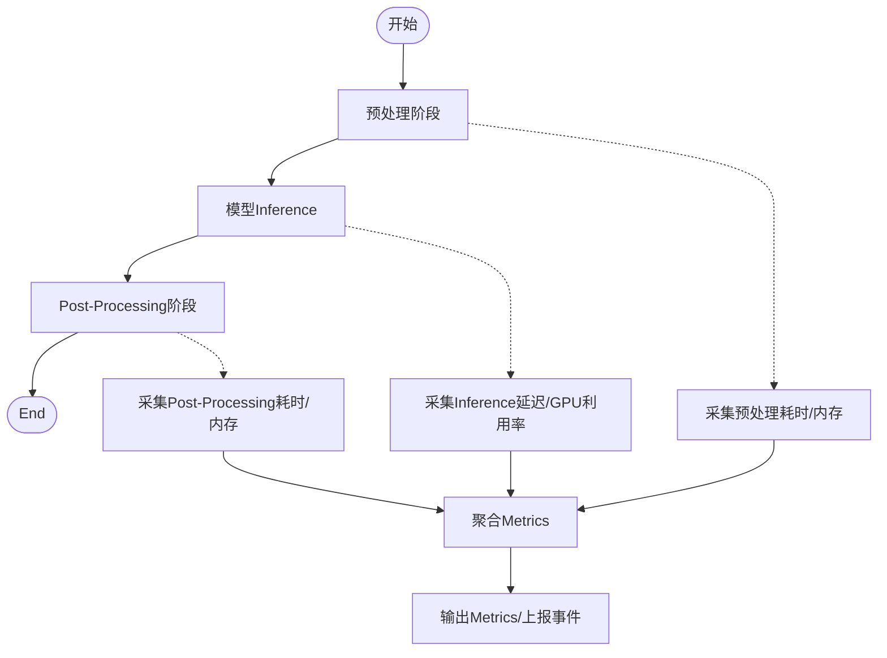

Figure Source
- [utils/benchmarks.py](file://ultralytics/utils/benchmarks.py)
- [engine/predictor.py](file://ultralytics/engine/predictor.py)
- [engine/validator.py](file://ultralytics/engine/validator.py)

Section Source
- [yolo-performance-metrics.md](file://docs/en/guides/yolo-performance-metrics.md)
- [utils/benchmarks.py](file://ultralytics/utils/benchmarks.py)
- [engine/predictor.py](file://ultralytics/engine/predictor.py)
- [engine/validator.py](file://ultralytics/engine/validator.py)

### 分布式部署监控策略
- 多节点协调
  - 基于DDP的错误传播and根因报告测试，保障跨节点异常定位and恢复
  - Refer to路径：[tests/test_ddp_error_propagation_e2e.py](file://tests/test_ddp_error_propagation_e2e.py)、[tests/test_ddp_root_cause_reporting.py](file://tests/test_ddp_root_cause_reporting.py)
- Load Balancing监控
  - Combining队列管理andTriton服务，对入队速率、排队长度、节点负载进行监控
  - Refer to路径：[queue-management.md](file://docs/en/guides/queue-management.md)、[triton-inference-server.md](file://docs/en/guides/triton-inference-server.md)

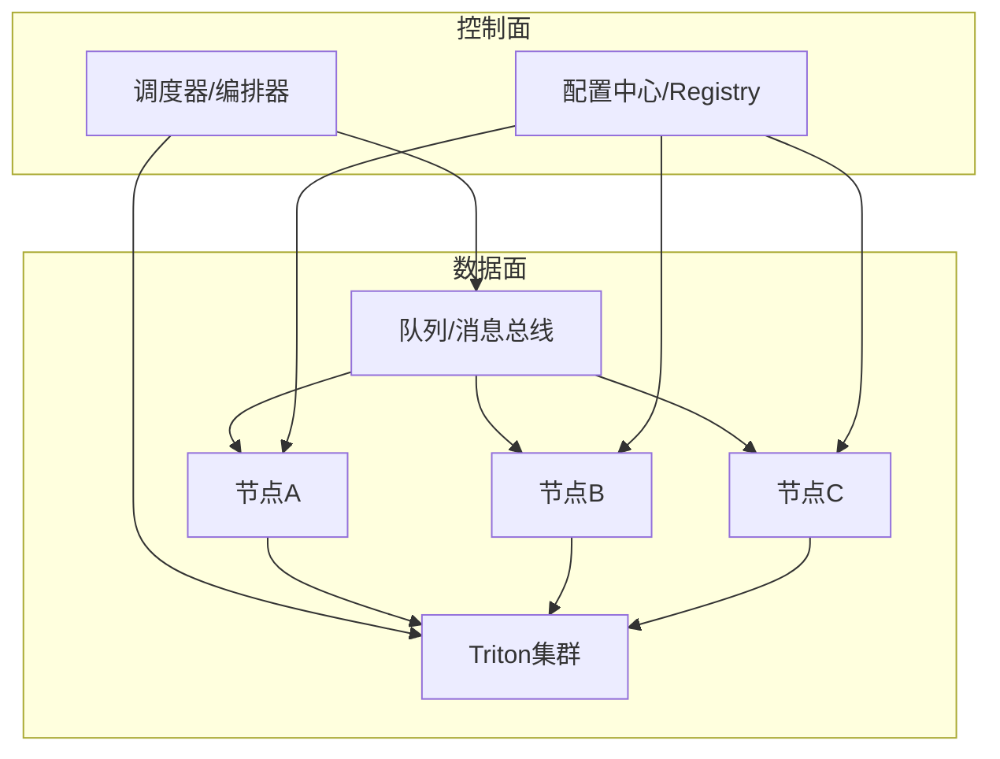

Figure Source
- [queue-management.md](file://docs/en/guides/queue-management.md)
- [triton-inference-server.md](file://docs/en/guides/triton-inference-server.md)
- [tests/test_ddp_error_propagation_e2e.py](file://tests/test_ddp_error_propagation_e2e.py)
- [tests/test_ddp_root_cause_reporting.py](file://tests/test_ddp_root_cause_reporting.py)

Section Source
- [tests/test_ddp_error_propagation_e2e.py](file://tests/test_ddp_error_propagation_e2e.py)
- [tests/test_ddp_root_cause_reporting.py](file://tests/test_ddp_root_cause_reporting.py)
- [queue-management.md](file://docs/en/guides/queue-management.md)
- [triton-inference-server.md](file://docs/en/guides/triton-inference-server.md)

### Logging收集and集中化管理
- 结构化Logging
  - Uses统一Logging器and事件系统进行结构化输出，便于检索and关联
  - Refer to路径：[utils/logger.py](file://ultralytics/utils/logger.py)、[utils/events.py](file://ultralytics/utils/events.py)
- 链路追踪
  - whilePredictorandValidator中注入上下文标识，贯穿预处理、Inference、Post-Processing各阶段
  - Refer to路径：[engine/predictor.py](file://ultralytics/engine/predictor.py)、[engine/validator.py](file://ultralytics/engine/validator.py)
- 集中化方案
  - 将Loggingand事件汇聚至Logging平台，Combining看板and告警联动
  - Refer to路径：[analytics.md](file://docs/en/guides/analytics.md)

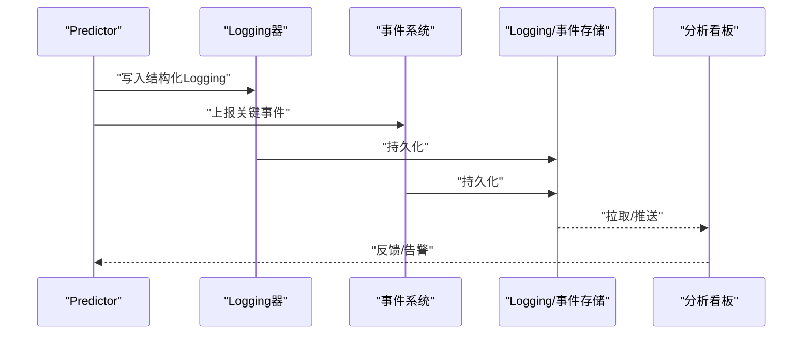

Figure Source
- [utils/logger.py](file://ultralytics/utils/logger.py)
- [utils/events.py](file://ultralytics/utils/events.py)
- [engine/predictor.py](file://ultralytics/engine/predictor.py)
- [engine/validator.py](file://ultralytics/engine/validator.py)
- [analytics.md](file://docs/en/guides/analytics.md)

Section Source
- [utils/logger.py](file://ultralytics/utils/logger.py)
- [utils/events.py](file://ultralytics/utils/events.py)
- [engine/predictor.py](file://ultralytics/engine/predictor.py)
- [engine/validator.py](file://ultralytics/engine/validator.py)
- [analytics.md](file://docs/en/guides/analytics.md)

### 告警规则and阈值配置
- Metrics阈值
  - 针对延迟分位、吞吐下降、内存/GPU超阈设置多级告警
- 动态调整
  - Combining队列长度and节点负载动态调整阈值and扩缩容策略
- Refer to路径：[yolo-performance-metrics.md](file://docs/en/guides/yolo-performance-metrics.md)、[queue-management.md](file://docs/en/guides/queue-management.md)

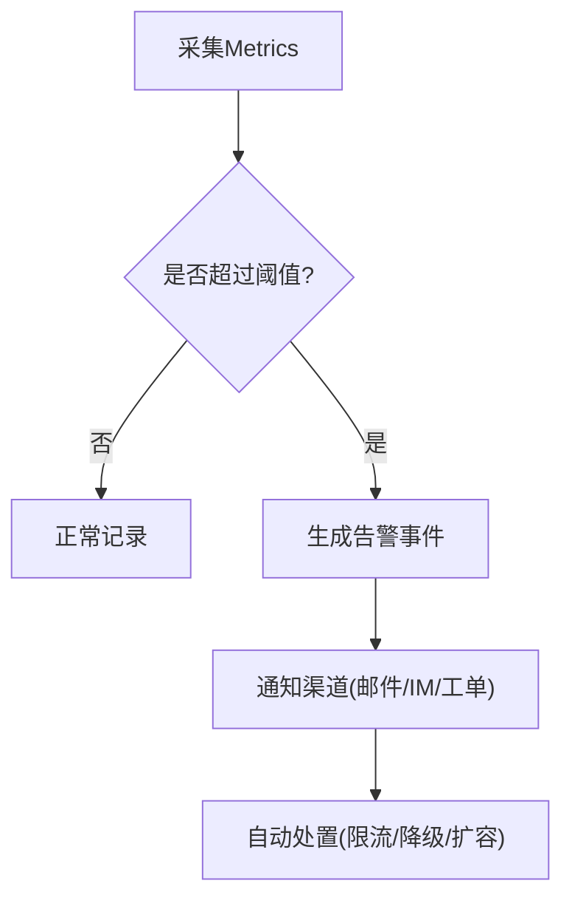

Figure Source
- [yolo-performance-metrics.md](file://docs/en/guides/yolo-performance-metrics.md)
- [queue-management.md](file://docs/en/guides/queue-management.md)

Section Source
- [yolo-performance-metrics.md](file://docs/en/guides/yolo-performance-metrics.md)
- [queue-management.md](file://docs/en/guides/queue-management.md)

### 性能基准and回归测试自动化
- Benchmark Suite
  - Via基准运行入口and套件定义drivers are installed标准化测试
  - Refer to路径：[benchmarks/run.py](file://benchmarks/run.py)、[benchmarks/suite.py](file://benchmarks/suite.py)、[benchmarks/suites.yaml](file://benchmarks/suites.yaml)
- 专项基准
  - MoRA/MoT分发etc.场景的专用基准脚本
  - Refer to路径：[benchmarks/benchmark_molora_dispatch.py](file://benchmarks/benchmark_molora_dispatch.py)、[benchmarks/benchmark_mot_dispatch.py](file://benchmarks/benchmark_mot_dispatch.py)
- 回归测试
  - Benchmark Suite测试用例保证回归稳定
  - Refer to路径：[tests/test_benchmark_suite.py](file://tests/test_benchmark_suite.py)

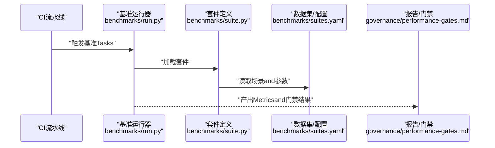

Figure Source
- [benchmarks/run.py](file://benchmarks/run.py)
- [benchmarks/suite.py](file://benchmarks/suite.py)
- [benchmarks/suites.yaml](file://benchmarks/suites.yaml)
- [governance/performance-gates.md](file://docs/governance/performance-gates.md)

Section Source
- [benchmarks/run.py](file://benchmarks/run.py)
- [benchmarks/suite.py](file://benchmarks/suite.py)
- [benchmarks/suites.yaml](file://benchmarks/suites.yaml)
- [benchmarks/benchmark_molora_dispatch.py](file://benchmarks/benchmark_molora_dispatch.py)
- [benchmarks/benchmark_mot_dispatch.py](file://benchmarks/benchmark_mot_dispatch.py)
- [tests/test_benchmark_suite.py](file://tests/test_benchmark_suite.py)
- [governance/performance-gates.md](file://docs/governance/performance-gates.md)

### 健康检查and自愈机制
- 健康检查
  - PredictorandValidator的状态重置and数值稳定性测试保障运行时健康
  - Refer to路径：[tests/test_runtime_state_reset.py](file://tests/test_runtime_state_reset.py)、[tests/test_metrics_numerical_stability.py](file://tests/test_metrics_numerical_stability.py)
- 自愈策略
  - 检测to异常时触发重启、回滚或降级；Combining队列andTriton进行流量切换
  - Refer to路径：[queue-management.md](file://docs/en/guides/queue-management.md)、[triton-inference-server.md](file://docs/en/guides/triton-inference-server.md)

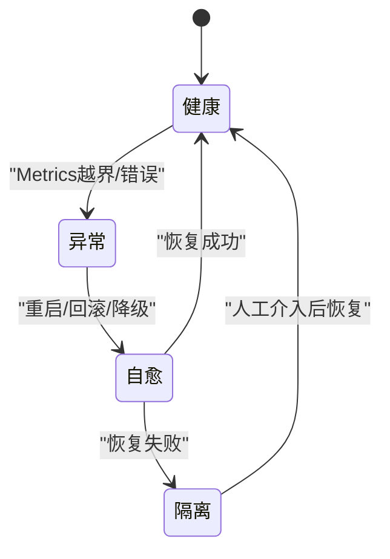

Figure Source
- [tests/test_runtime_state_reset.py](file://tests/test_runtime_state_reset.py)
- [tests/test_metrics_numerical_stability.py](file://tests/test_metrics_numerical_stability.py)
- [queue-management.md](file://docs/en/guides/queue-management.md)
- [triton-inference-server.md](file://docs/en/guides/triton-inference-server.md)

Section Source
- [tests/test_runtime_state_reset.py](file://tests/test_runtime_state_reset.py)
- [tests/test_metrics_numerical_stability.py](file://tests/test_metrics_numerical_stability.py)
- [queue-management.md](file://docs/en/guides/queue-management.md)
- [triton-inference-server.md](file://docs/en/guides/triton-inference-server.md)

### 容量规划and扩容策略
- 容量规划
  - 基于历史吞吐and延迟分位估算所需实例数and资源规格
- 弹性扩容
  - Combining队列长度and节点负载动态扩缩容，优先保障低延迟SLA
- Refer to路径：[yolo-performance-metrics.md](file://docs/en/guides/yolo-performance-metrics.md)、[queue-management.md](file://docs/en/guides/queue-management.md)

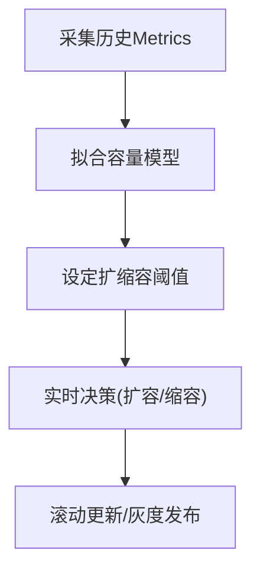

Figure Source
- [yolo-performance-metrics.md](file://docs/en/guides/yolo-performance-metrics.md)
- [queue-management.md](file://docs/en/guides/queue-management.md)

Section Source
- [yolo-performance-metrics.md](file://docs/en/guides/yolo-performance-metrics.md)
- [queue-management.md](file://docs/en/guides/queue-management.md)

### 故障诊断and根因分析
- 分布式错误传播and根因报告
  - Via端to端测试Validation错误传播路径and根因信息完整性
  - Refer to路径：[tests/test_ddp_error_propagation_e2e.py](file://tests/test_ddp_error_propagation_e2e.py)、[tests/test_ddp_root_cause_reporting.py](file://tests/test_ddp_root_cause_reporting.py)
- 诊断工具
  - Uses分析Modulesand流式InferenceUI辅助定位问题
  - Refer to路径：[solutions/analytics.py](file://ultralytics/solutions/analytics.py)、[solutions/streamlit_inference.py](file://ultralytics/solutions/streamlit_inference.py)

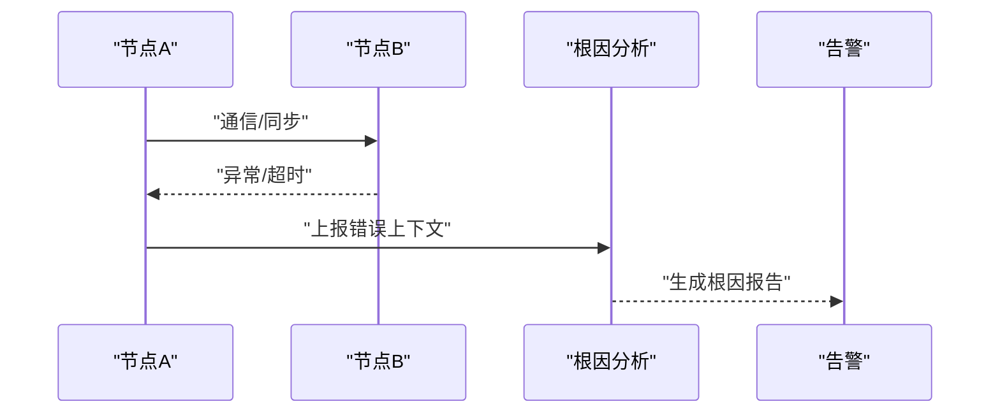

Figure Source
- [tests/test_ddp_error_propagation_e2e.py](file://tests/test_ddp_error_propagation_e2e.py)
- [tests/test_ddp_root_cause_reporting.py](file://tests/test_ddp_root_cause_reporting.py)
- [solutions/analytics.py](file://ultralytics/solutions/analytics.py)
- [solutions/streamlit_inference.py](file://ultralytics/solutions/streamlit_inference.py)

Section Source
- [tests/test_ddp_error_propagation_e2e.py](file://tests/test_ddp_error_propagation_e2e.py)
- [tests/test_ddp_root_cause_reporting.py](file://tests/test_ddp_root_cause_reporting.py)
- [solutions/analytics.py](file://ultralytics/solutions/analytics.py)
- [solutions/streamlit_inference.py](file://ultralytics/solutions/streamlit_inference.py)

### 运维手册and应急预案
- 运维手册要点
  - 启动/停止流程、健康检查、Metrics看板、Logging查询、告警处理
- 应急预案
  - 常见故障场景（节点宕机、GPU异常、队列积压、模型回滚）and处置步骤
- Refer to路径：[model-monitoring-and-maintenance.md](file://docs/en/guides/model-monitoring-and-maintenance.md)、[triton-inference-server.md](file://docs/en/guides/triton-inference-server.md)、[queue-management.md](file://docs/en/guides/queue-management.md)

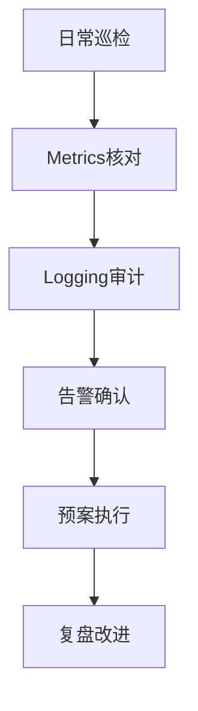

Figure Source
- [model-monitoring-and-maintenance.md](file://docs/en/guides/model-monitoring-and-maintenance.md)
- [triton-inference-server.md](file://docs/en/guides/triton-inference-server.md)
- [queue-management.md](file://docs/en/guides/queue-management.md)

Section Source
- [model-monitoring-and-maintenance.md](file://docs/en/guides/model-monitoring-and-maintenance.md)
- [triton-inference-server.md](file://docs/en/guides/triton-inference-server.md)
- [queue-management.md](file://docs/en/guides/queue-management.md)

## Dependency Analysis
- 组件耦合
  - Predictor依赖基准工具andLogging/事件系统；ValidatorandTrainer共享Metricsand事件上报逻辑
  - Benchmark Suiteand治理门禁形成闭环的质量保障
- 外部集成
  - TritonInference服务and队列管理作forExternal Dependencies，提升可Extensibilityand弹性

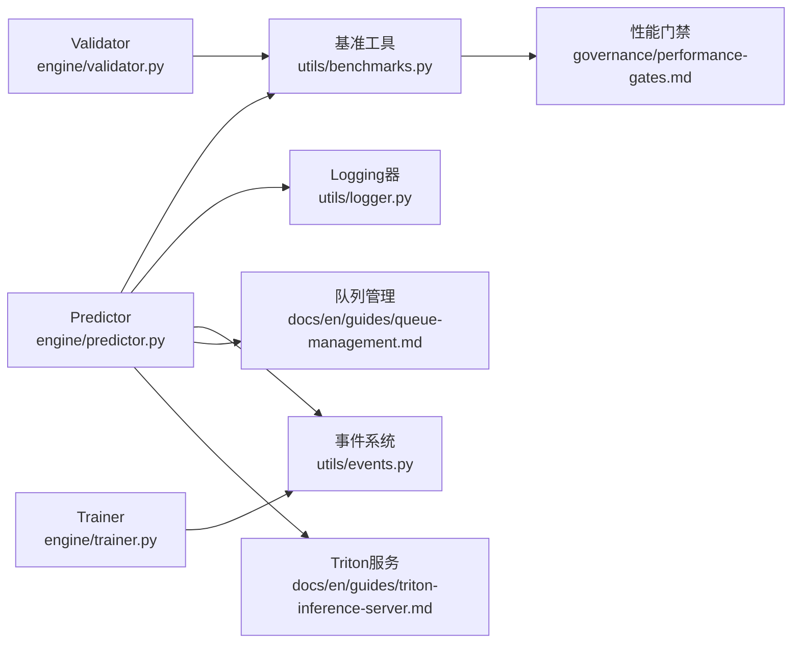

Figure Source
- [engine/predictor.py](file://ultralytics/engine/predictor.py)
- [engine/validator.py](file://ultralytics/engine/validator.py)
- [engine/trainer.py](file://ultralytics/engine/trainer.py)
- [utils/benchmarks.py](file://ultralytics/utils/benchmarks.py)
- [utils/logger.py](file://ultralytics/utils/logger.py)
- [utils/events.py](file://ultralytics/utils/events.py)
- [governance/performance-gates.md](file://docs/governance/performance-gates.md)
- [queue-management.md](file://docs/en/guides/queue-management.md)
- [triton-inference-server.md](file://docs/en/guides/triton-inference-server.md)

Section Source
- [engine/predictor.py](file://ultralytics/engine/predictor.py)
- [engine/validator.py](file://ultralytics/engine/validator.py)
- [engine/trainer.py](file://ultralytics/engine/trainer.py)
- [utils/benchmarks.py](file://ultralytics/utils/benchmarks.py)
- [utils/logger.py](file://ultralytics/utils/logger.py)
- [utils/events.py](file://ultralytics/utils/events.py)
- [governance/performance-gates.md](file://docs/governance/performance-gates.md)
- [queue-management.md](file://docs/en/guides/queue-management.md)
- [triton-inference-server.md](file://docs/en/guides/triton-inference-server.md)

## 性能考量
- 批大小and并行度调优：平衡吞吐and延迟，避免OOM
- 缓存and预热：模型and算子预热减少冷启动抖动
- 资源隔离：容器/进程级限制防止相互干扰
- 监控采样：高频Metrics采用滑动窗口and降采样降低开销

## Troubleshooting Guide
- 快速定位
  - 查看结构化Loggingand事件，Combining链路ID追踪请求全生命周期
- 常见问题
  - 延迟突增：检查队列积压、GPU利用率、I/Obottlenecks
  - 吞吐下降：检查批大小、并行度、模型版本变更
  - 内存泄漏：关注运行时状态重置and数值稳定性测试
- Refer to路径：[tests/test_runtime_state_reset.py](file://tests/test_runtime_state_reset.py)、[tests/test_metrics_numerical_stability.py](file://tests/test_metrics_numerical_stability.py)

Section Source
- [tests/test_runtime_state_reset.py](file://tests/test_runtime_state_reset.py)
- [tests/test_metrics_numerical_stability.py](file://tests/test_metrics_numerical_stability.py)

## Conclusion
through a unifiedMetrics采集、结构化Loggingand事件上报、基准and回归测试、健康检查and自愈、Centered onand完善的告警and应急预案，YOLO-Master可while生产环境implementing高可用、可观测、可演进的部署and运维体系。建议持续完善性能门禁and配置Drift Detection，强化分布式容错and根因分析capabilities，Centered on支撑更大规模and更复杂场景的稳定运行。

## Appendix
- 常用脚本and工具
  - 冒烟测试and校准脚本：[scripts/smoke_test_coco2017.py](file://scripts/smoke_test_coco2017.py)、[scripts/run_planner_lovo_calibration.py](file://scripts/run_planner_lovo_calibration.py)
  - 配置Drift Detection：[tools/config_drift_detector.py](file://tools/config_drift_detector.py)
- Refer toDocumentation
  - 模型监控and维护：[model-monitoring-and-maintenance.md](file://docs/en/guides/model-monitoring-and-maintenance.md)
  - YOLO性能Metrics：[yolo-performance-metrics.md](file://docs/en/guides/yolo-performance-metrics.md)
  - TritonInference服务：[triton-inference-server.md](file://docs/en/guides/triton-inference-server.md)
  - 队列管理：[queue-management.md](file://docs/en/guides/queue-management.md)
  - 分析capabilities：[analytics.md](file://docs/en/guides/analytics.md)
  - 基准模式：[benchmark.md](file://docs/en/modes/benchmark.md)