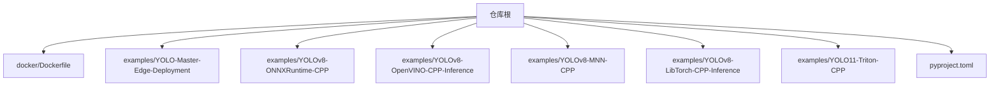
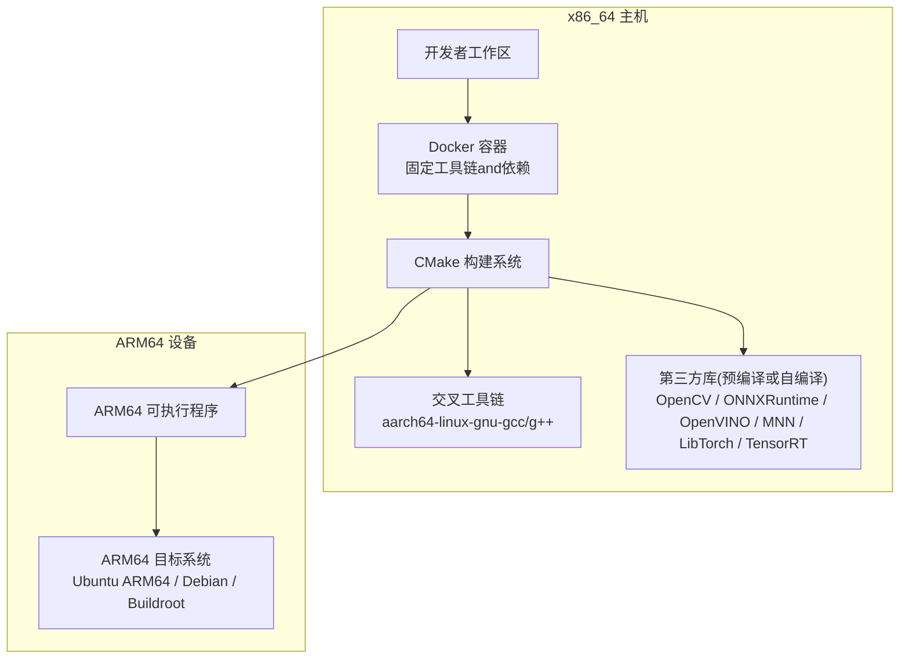
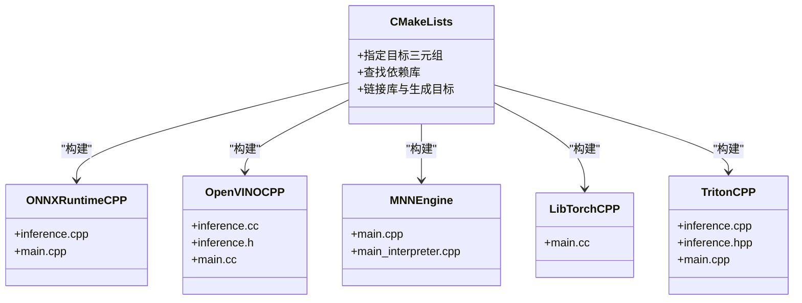
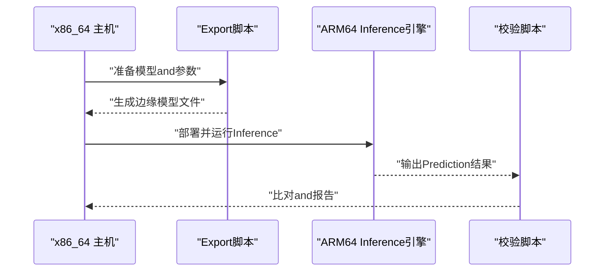
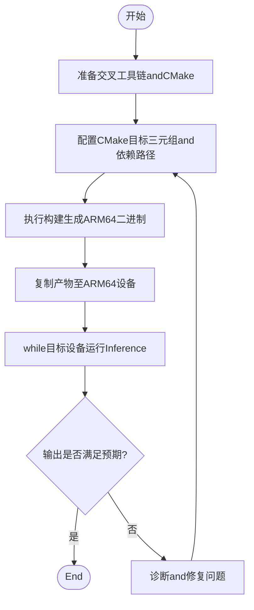
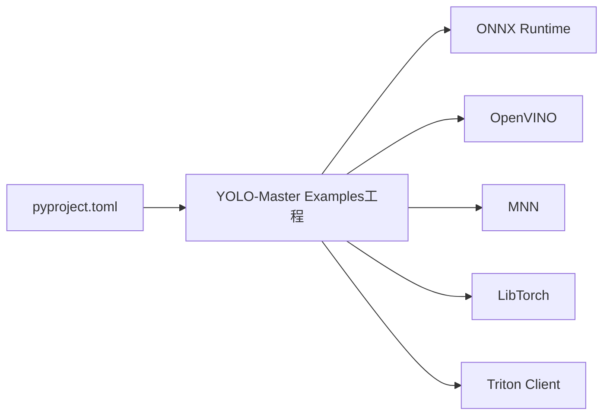

# ARM交叉编译环境

<cite>
**Files Referenced in This Document**
- [README.md](file://README.md)
- [Dockerfile](file://docker/Dockerfile)
- [.dockerignore](file://.dockerignore)
- [CMakeLists.txt](file://examples/YOLO-Master-Edge-Deployment/CMakeLists.txt)
- [README.md](file://examples/YOLO-Master-Edge-Deployment/README.md)
- [export_edge_models.py](file://examples/YOLO-Master-Edge-Deployment/export_edge_models.py)
- [validate_edge_outputs.py](file://examples/YOLO-Master-Edge-Deployment/validate_edge_outputs.py)
- [edge_utils.py](file://examples/YOLO-Master-Edge-Deployment/edge_utils.py)
- [CMakeLists.txt](file://examples/YOLOv8-ONNXRuntime-CPP/CMakeLists.txt)
- [inference.cpp](file://examples/YOLOv8-ONNXRuntime-CPP/inference.cpp)
- [main.cpp](file://examples/YOLOv8-ONNXRuntime-CPP/main.cpp)
- [CMakeLists.txt](file://examples/YOLOv10-Master-MoA/CMakeLists.txt)
- [inference.cpp](file://examples/YOLOv10-Master-MoA/inference.cpp)
- [inference.hpp](file://examples/YOLOv10-Master-MoA/inference.hpp)
- [main.cpp](file://examples/YOLOv10-Master-MoA/main.cpp)
- [CMakeLists.txt](file://examples/YOLOv8-OpenVINO-CPP-Inference/CMakeLists.txt)
- [inference.cc](file://examples/YOLOv8-OpenVINO-CPP-Inference/inference.cc)
- [inference.h](file://examples/YOLOv8-OpenVINO-CPP-Inference/inference.h)
- [main.cc](file://examples/YOLOv8-OpenVINO-CPP-Inference/main.cc)
- [CMakeLists.txt](file://examples/YOLOv8-MNN-CPP/CMakeLists.txt)
- [main.cpp](file://examples/YOLOv8-MNN-CPP/main.cpp)
- [main_interpreter.cpp](file://examples/YOLOv8-MNN-CPP/main_interpreter.cpp)
- [CMakeLists.txt](file://examples/YOLOv8-LibTorch-CPP-Inference/CMakeLists.txt)
- [main.cc](file://examples/YOLOv8-LibTorch-CPP-Inference/main.cc)
- [CMakeLists.txt](file://examples/YOLO11-Triton-CPP/CMakeLists.txt)
- [inference.cpp](file://examples/YOLO11-Triton-CPP/inference.cpp)
- [inference.hpp](file://examples/YOLO11-Triton-CPP/inference.hpp)
- [main.cpp](file://examples/YOLO11-Triton-CPP/main.cpp)
- [pyproject.toml](file://pyproject.toml)
</cite>

## Table of Contents
1. [Introduction](#Introduction)
2. [Project Structure](#Project Structure)
3. [Core Components](#Core Components)
4. [Architecture Overview](#Architecture Overview)
5. [Detailed Component Analysis](#Detailed Component Analysis)
6. [Dependency Analysis](#Dependency Analysis)
7. [性能考量](#性能考量)
8. [Troubleshooting Guide](#Troubleshooting Guide)
9. [Conclusion](#Conclusion)
10. [Appendix](#Appendix)

## Introduction
本指南targetingwhilex86_64主机上forARM64目标进行交叉编译的Engineers，覆盖工具链配置（GCC/G++、CMake）、构建系统设置、关键依赖库（OpenCV、ONNX Runtime、TensorRTetc.）的交叉编译流程，Centered onandUbuntu ARM64、DebianandBuildroot发行版的兼容性处理。同时provides基于Docker的容器化交叉编译方案、常见错误诊断and修复方法，Centered onandsuch as何Validation交叉产物正确性and性能的方法论。

## Project Structure
仓库包含大量Examples工程andDocumentation，其中and交叉编译直接相关的资源主要集中while：
- docker/Dockerfile：Container Images定义，可用于隔离并固化交叉编译环境
- examples/*：多种后端（ONNX Runtime、OpenVINO、MNN、LibTorch、Triton）的C/C++InferenceExamples，均含CMakeLists.txt，便于演示跨平台构建
- examples/YOLO-Master-Edge-Deployment：Edge Deployment脚本and工具，涵盖Model Exportand输出校验
- pyproject.toml：Python工程元数据，用于理解Runtime Dependenciesand版本约束

Figure Source
- [Dockerfile](file://docker/Dockerfile)
- [CMakeLists.txt](file://examples/YOLO-Master-Edge-Deployment/CMakeLists.txt)
- [CMakeLists.txt](file://examples/YOLOv8-ONNXRuntime-CPP/CMakeLists.txt)
- [CMakeLists.txt](file://examples/YOLOv8-OpenVINO-CPP-Inference/CMakeLists.txt)
- [CMakeLists.txt](file://examples/YOLOv8-MNN-CPP/CMakeLists.txt)
- [CMakeLists.txt](file://examples/YOLOv8-LibTorch-CPP-Inference/CMakeLists.txt)
- [CMakeLists.txt](file://examples/YOLO11-Triton-CPP/CMakeLists.txt)
- [pyproject.toml](file://pyproject.toml)

Section Source
- [README.md](file://README.md)
- [Dockerfile](file://docker/Dockerfile)
- [pyproject.toml](file://pyproject.toml)

## Core Components
- 容器化构建基座：ViaDockerfile定义可复现的交叉编译环境，统一工具链and依赖版本，避免“while我机器上能跑”的问题
- 多后端C++Examples：各ExamplesCentered onCMake组织，展示such as何for目标平台指定编译器、查找依赖、链接库and生成可执行文件
- Edge Deployment工具：providesModel Exportand结果校验脚本，辅助whileARM设备上ValidationInference正确性

Section Source
- [Dockerfile](file://docker/Dockerfile)
- [CMakeLists.txt](file://examples/YOLO-Master-Edge-Deployment/CMakeLists.txt)
- [export_edge_models.py](file://examples/YOLO-Master-Edge-Deployment/export_edge_models.py)
- [validate_edge_outputs.py](file://examples/YOLO-Master-Edge-Deployment/validate_edge_outputs.py)
- [edge_utils.py](file://examples/YOLO-Master-Edge-Deployment/edge_utils.py)

## Architecture Overview
下图展示了从源码toARM64可执行文件的端to端流程：whilex86_64主机上Uses交叉工具链andCMake，将C++Examplesand第三方库（such asONNX Runtime、OpenVINO、MNN、LibTorch、Triton客户端）交叉编译forARM64二进制；随后whileARM64设备上运行并Validation。

Figure Source
- [Dockerfile](file://docker/Dockerfile)
- [CMakeLists.txt](file://examples/YOLOv8-ONNXRuntime-CPP/CMakeLists.txt)
- [CMakeLists.txt](file://examples/YOLOv8-OpenVINO-CPP-Inference/CMakeLists.txt)
- [CMakeLists.txt](file://examples/YOLOv8-MNN-CPP/CMakeLists.txt)
- [CMakeLists.txt](file://examples/YOLOv8-LibTorch-CPP-Inference/CMakeLists.txt)
- [CMakeLists.txt](file://examples/YOLO11-Triton-CPP/CMakeLists.txt)

## Detailed Component Analysis

### 容器化交叉编译环境（Docker）
- 作用：while容器中固化交叉编译器、CMake、Pythonand第三方库路径，确保构建可重复
- Uses建议：
  - while容器内挂载源码Table of Contents，按Examples工程的CMakeLists.txt完成交叉构建
  - 将生成的ARM64产物复制to宿主机后拷贝至目标设备
- 注意事项：
  - 若需GPU加速（such asTensorRT），需while容器内安装对应drivers are installedandSDK，并while目标设备上匹配相同版本

Section Source
- [Dockerfile](file://docker/Dockerfile)

### CMake构建系统and多后端Examples
- 通用模式：每个Examples工程包含CMakeLists.txt，负责：
  - 指定目标三元组（such asaarch64-linux-gnu）
  - 定位第三方库头文件and库路径
  - 链接所需库并生成ARM64可执行文件
- 典型后端Examples：
  - ONNX Runtime C++：见[examples/YOLOv8-ONNXRuntime-CPP/CMakeLists.txt](file://examples/YOLOv8-ONNXRuntime-CPP/CMakeLists.txt)，入口逻辑Refer to[inference.cpp](file://examples/YOLOv8-ONNXRuntime-CPP/inference.cpp)、[main.cpp](file://examples/YOLOv8-ONNXRuntime-CPP/main.cpp)
  - OpenVINO C++：见[examples/YOLOv8-OpenVINO-CPP-Inference/CMakeLists.txt](file://examples/YOLOv8-OpenVINO-CPP-Inference/CMakeLists.txt)，implementingRefer to[inference.cc](file://examples/YOLOv8-OpenVINO-CPP-Inference/inference.cc)、[inference.h](file://examples/YOLOv8-OpenVINO-CPP-Inference/inference.h)、[main.cc](file://examples/YOLOv8-OpenVINO-CPP-Inference/main.cc)
  - MNN C++：见[examples/YOLOv8-MNN-CPP/CMakeLists.txt](file://examples/YOLOv8-MNN-CPP/CMakeLists.txt)，入口Refer to[main.cpp](file://examples/YOLOv8-MNN-CPP/main.cpp)、[main_interpreter.cpp](file://examples/YOLOv8-MNN-CPP/main_interpreter.cpp)
  - LibTorch C++：见[examples/YOLOv8-LibTorch-CPP-Inference/CMakeLists.txt](file://examples/YOLOv8-LibTorch-CPP-Inference/CMakeLists.txt)，入口Refer to[main.cc](file://examples/YOLOv8-LibTorch-CPP-Inference/main.cc)
  - Triton C++：见[examples/YOLO11-Triton-CPP/CMakeLists.txt](file://examples/YOLO11-Triton-CPP/CMakeLists.txt)，implementingRefer to[inference.cpp](file://examples/YOLO11-Triton-CPP/inference.cpp)、[inference.hpp](file://examples/YOLO11-Triton-CPP/inference.hpp)、[main.cpp](file://examples/YOLO11-Triton-CPP/main.cpp)

Figure Source
- [CMakeLists.txt](file://examples/YOLOv8-ONNXRuntime-CPP/CMakeLists.txt)
- [inference.cpp](file://examples/YOLOv8-ONNXRuntime-CPP/inference.cpp)
- [main.cpp](file://examples/YOLOv8-ONNXRuntime-CPP/main.cpp)
- [CMakeLists.txt](file://examples/YOLOv8-OpenVINO-CPP-Inference/CMakeLists.txt)
- [inference.cc](file://examples/YOLOv8-OpenVINO-CPP-Inference/inference.cc)
- [inference.h](file://examples/YOLOv8-OpenVINO-CPP-Inference/inference.h)
- [main.cc](file://examples/YOLOv8-OpenVINO-CPP-Inference/main.cc)
- [CMakeLists.txt](file://examples/YOLOv8-MNN-CPP/CMakeLists.txt)
- [main.cpp](file://examples/YOLOv8-MNN-CPP/main.cpp)
- [main_interpreter.cpp](file://examples/YOLOv8-MNN-CPP/main_interpreter.cpp)
- [CMakeLists.txt](file://examples/YOLOv8-LibTorch-CPP-Inference/CMakeLists.txt)
- [main.cc](file://examples/YOLOv8-LibTorch-CPP-Inference/main.cc)
- [CMakeLists.txt](file://examples/YOLO11-Triton-CPP/CMakeLists.txt)
- [inference.cpp](file://examples/YOLO11-Triton-CPP/inference.cpp)
- [inference.hpp](file://examples/YOLO11-Triton-CPP/inference.hpp)
- [main.cpp](file://examples/YOLO11-Triton-CPP/main.cpp)

Section Source
- [CMakeLists.txt](file://examples/YOLOv8-ONNXRuntime-CPP/CMakeLists.txt)
- [inference.cpp](file://examples/YOLOv8-ONNXRuntime-CPP/inference.cpp)
- [main.cpp](file://examples/YOLOv8-ONNXRuntime-CPP/main.cpp)
- [CMakeLists.txt](file://examples/YOLOv8-OpenVINO-CPP-Inference/CMakeLists.txt)
- [inference.cc](file://examples/YOLOv8-OpenVINO-CPP-Inference/inference.cc)
- [inference.h](file://examples/YOLOv8-OpenVINO-CPP-Inference/inference.h)
- [main.cc](file://examples/YOLOv8-OpenVINO-CPP-Inference/main.cc)
- [CMakeLists.txt](file://examples/YOLOv8-MNN-CPP/CMakeLists.txt)
- [main.cpp](file://examples/YOLOv8-MNN-CPP/main.cpp)
- [main_interpreter.cpp](file://examples/YOLOv8-MNN-CPP/main_interpreter.cpp)
- [CMakeLists.txt](file://examples/YOLOv8-LibTorch-CPP-Inference/CMakeLists.txt)
- [main.cc](file://examples/YOLOv8-LibTorch-CPP-Inference/main.cc)
- [CMakeLists.txt](file://examples/YOLO11-Triton-CPP/CMakeLists.txt)
- [inference.cpp](file://examples/YOLO11-Triton-CPP/inference.cpp)
- [inference.hpp](file://examples/YOLO11-Triton-CPP/inference.hpp)
- [main.cpp](file://examples/YOLO11-Triton-CPP/main.cpp)

### Edge DeploymentandValidation流程
- Model Export：Via脚本将Training好的YOLOModel Exportfor边缘可用格式（例such asONNX），供后续Inference引擎加载
- 输出校验：whileARM设备上运行Inference，对比期望输出，确保数值一致性and边界条件处理正确

Figure Source
- [export_edge_models.py](file://examples/YOLO-Master-Edge-Deployment/export_edge_models.py)
- [validate_edge_outputs.py](file://examples/YOLO-Master-Edge-Deployment/validate_edge_outputs.py)
- [edge_utils.py](file://examples/YOLO-Master-Edge-Deployment/edge_utils.py)

Section Source
- [export_edge_models.py](file://examples/YOLO-Master-Edge-Deployment/export_edge_models.py)
- [validate_edge_outputs.py](file://examples/YOLO-Master-Edge-Deployment/validate_edge_outputs.py)
- [edge_utils.py](file://examples/YOLO-Master-Edge-Deployment/edge_utils.py)

### 算法and构建流程（流程图）
Centered on下流程图概括了从源码toARM64可执行文件的典型步骤，适用于各后端Examples工程：

Figure Source
- [CMakeLists.txt](file://examples/YOLOv8-ONNXRuntime-CPP/CMakeLists.txt)
- [CMakeLists.txt](file://examples/YOLOv8-OpenVINO-CPP-Inference/CMakeLists.txt)
- [CMakeLists.txt](file://examples/YOLOv8-MNN-CPP/CMakeLists.txt)
- [CMakeLists.txt](file://examples/YOLOv8-LibTorch-CPP-Inference/CMakeLists.txt)
- [CMakeLists.txt](file://examples/YOLO11-Triton-CPP/CMakeLists.txt)

## Dependency Analysis
- External Dependenciesand集成点：
  - ONNX Runtime：用于跨平台Inference，Examples工程ViaCMake查找并链接其头文件and库
  - OpenVINO：Intel生态InferenceOptimization，Examples工程包含完整C++接口Encapsulates
  - MNN：移动端and嵌入式Inference引擎，Examples工程providesExplainerand主程序入口
  - LibTorch：PyTorch C++前端，Examples工程演示such as何whileC++中Load model并Inference
  - Triton：服务端Inference服务，Examples工程展示C++客户端and服务端交互
- 依赖管理：
  - Python侧依赖and版本约束由pyproject.toml管理，有助于while容器内锁定版本
  - C++侧依赖ViaCMakeLists.txt显式声明，便于while不同平台上定位不同版本的库

Figure Source
- [CMakeLists.txt](file://examples/YOLOv8-ONNXRuntime-CPP/CMakeLists.txt)
- [CMakeLists.txt](file://examples/YOLOv8-OpenVINO-CPP-Inference/CMakeLists.txt)
- [CMakeLists.txt](file://examples/YOLOv8-MNN-CPP/CMakeLists.txt)
- [CMakeLists.txt](file://examples/YOLOv8-LibTorch-CPP-Inference/CMakeLists.txt)
- [CMakeLists.txt](file://examples/YOLO11-Triton-CPP/CMakeLists.txt)
- [pyproject.toml](file://pyproject.toml)

Section Source
- [pyproject.toml](file://pyproject.toml)
- [CMakeLists.txt](file://examples/YOLOv8-ONNXRuntime-CPP/CMakeLists.txt)
- [CMakeLists.txt](file://examples/YOLOv8-OpenVINO-CPP-Inference/CMakeLists.txt)
- [CMakeLists.txt](file://examples/YOLOv8-MNN-CPP/CMakeLists.txt)
- [CMakeLists.txt](file://examples/YOLOv8-LibTorch-CPP-Inference/CMakeLists.txt)
- [CMakeLists.txt](file://examples/YOLO11-Triton-CPP/CMakeLists.txt)

## 性能考量
- 选择合适Inference后端：
  - CPU场景优先EvaluationONNX RuntimeandOpenVINO的Optimization选项
  - 移动端/嵌入式优先考虑MNN
  - GPU/NPU场景CombiningTensorRT或厂商专用SDK（仓库未直接包含TensorRTExamples，但可whileCMake中引入相应库）
- 内存and线程：
  - 调整批大小and线程数，避免whileARM设备上出现内存不足或上下文切换开销过大
- 量化and精度：
  - 根据业务需求权衡INT8/FP16量化带来的延迟收益and精度损失
- 基准测试：
  - Uses仓库中的基准脚本andExamples工程，while目标设备上采集吞吐and延迟Metrics，形成回归基线

## Troubleshooting Guide
- 链接错误（找不to库或符号）：
  - 检查CMakeLists.txt是否正确指向第三方库的头文件and库路径
  - 确认交叉工具链and库的ABI兼容（such asglibc版本、架构标志）
- 运行时崩溃或段错误：
  - 核对目标设备的动态库版本and主机构建时Uses的版本一致
  - Usesarm-none-eabi-gdb或设备上的调试工具抓取堆栈
- 模型加载失败：
  - 确认ExportModel FormatandInference引擎要求一致（such asONNX opset版本）
  - 检查输入形状and数据类型是否andExport时一致
- 性能不达标：
  - 启用后端Optimization开关（such asOpenVINO IROptimization、ONNX Runtime执行provides者）
  - 减少不必要的I/Oand预处理开销

Section Source
- [CMakeLists.txt](file://examples/YOLOv8-ONNXRuntime-CPP/CMakeLists.txt)
- [CMakeLists.txt](file://examples/YOLOv8-OpenVINO-CPP-Inference/CMakeLists.txt)
- [CMakeLists.txt](file://examples/YOLOv8-MNN-CPP/CMakeLists.txt)
- [CMakeLists.txt](file://examples/YOLOv8-LibTorch-CPP-Inference/CMakeLists.txt)
- [CMakeLists.txt](file://examples/YOLO11-Triton-CPP/CMakeLists.txt)

## Conclusion
Viawhilex86_64主机上Uses容器化的交叉工具链andCMake，可Centered on稳定地forARM64目标构建多种Inference后端的C++应用。CombiningEdge Deployment脚本and输出校验流程，能够高效ValidationInference正确性and性能。建议whileCI中固化构建流程，持续回归不同后端and依赖版本组合，确保whileUbuntu ARM64、DebianandBuildrootetc.发行版上的兼容性。

## Appendix
- Quick Start建议：
  - Uses仓库provides的Dockerfile作for基础镜像，挂载源码Table of Contents并按Examples工程的CMakeLists.txt完成交叉构建
  - 将生成的ARM64二进制and必要动态库打包，部署to目标设备并运行校验脚本
- Refer toExamples路径：
  - ONNX Runtime C++：[CMakeLists.txt](file://examples/YOLOv8-ONNXRuntime-CPP/CMakeLists.txt)、[inference.cpp](file://examples/YOLOv8-ONNXRuntime-CPP/inference.cpp)、[main.cpp](file://examples/YOLOv8-ONNXRuntime-CPP/main.cpp)
  - OpenVINO C++：[CMakeLists.txt](file://examples/YOLOv8-OpenVINO-CPP-Inference/CMakeLists.txt)、[inference.cc](file://examples/YOLOv8-OpenVINO-CPP-Inference/inference.cc)、[inference.h](file://examples/YOLOv8-OpenVINO-CPP-Inference/inference.h)、[main.cc](file://examples/YOLOv8-OpenVINO-CPP-Inference/main.cc)
  - MNN C++：[CMakeLists.txt](file://examples/YOLOv8-MNN-CPP/CMakeLists.txt)、[main.cpp](file://examples/YOLOv8-MNN-CPP/main.cpp)、[main_interpreter.cpp](file://examples/YOLOv8-MNN-CPP/main_interpreter.cpp)
  - LibTorch C++：[CMakeLists.txt](file://examples/YOLOv8-LibTorch-CPP-Inference/CMakeLists.txt)、[main.cc](file://examples/YOLOv8-LibTorch-CPP-Inference/main.cc)
  - Triton C++：[CMakeLists.txt](file://examples/YOLO11-Triton-CPP/CMakeLists.txt)、[inference.cpp](file://examples/YOLO11-Triton-CPP/inference.cpp)、[inference.hpp](file://examples/YOLO11-Triton-CPP/inference.hpp)、[main.cpp](file://examples/YOLO11-Triton-CPP/main.cpp)
  - Edge Deployment工具：[export_edge_models.py](file://examples/YOLO-Master-Edge-Deployment/export_edge_models.py)、[validate_edge_outputs.py](file://examples/YOLO-Master-Edge-Deployment/validate_edge_outputs.py)、[edge_utils.py](file://examples/YOLO-Master-Edge-Deployment/edge_utils.py)