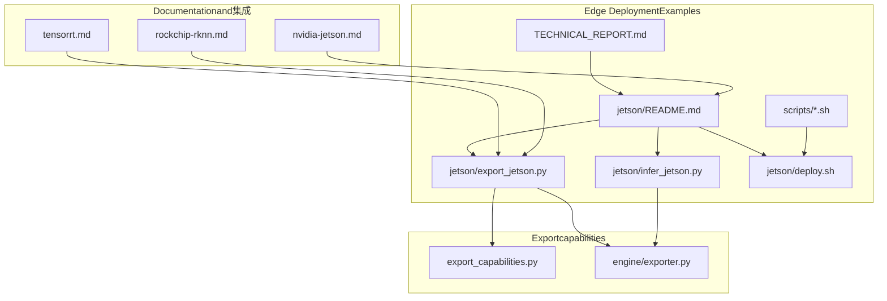
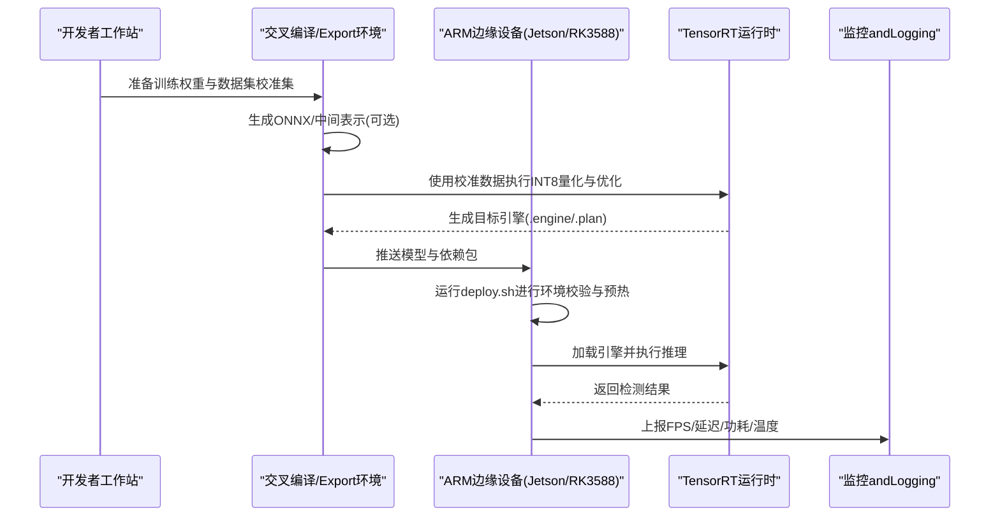
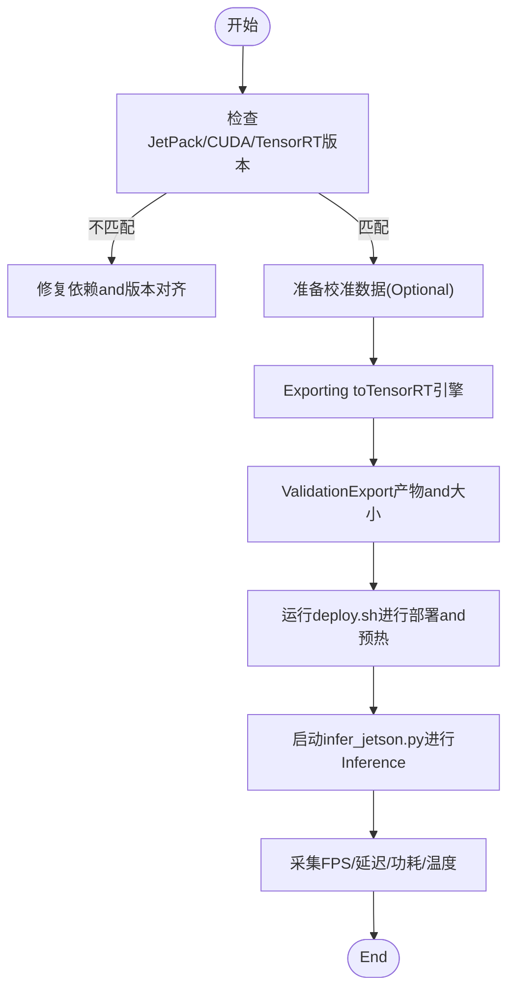
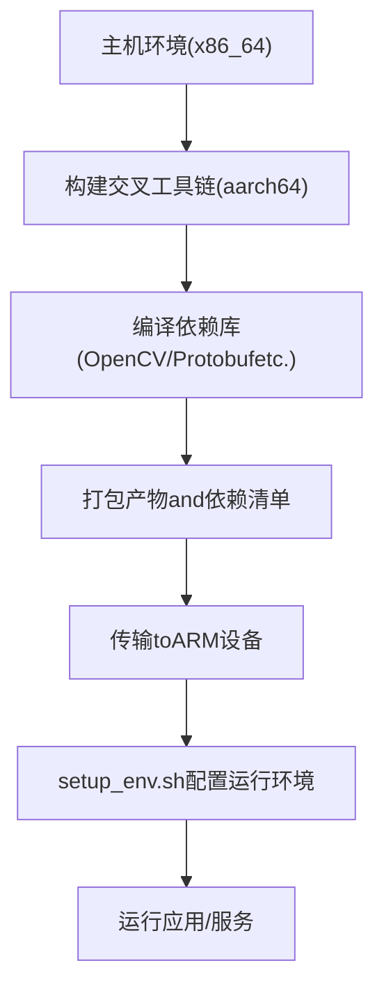
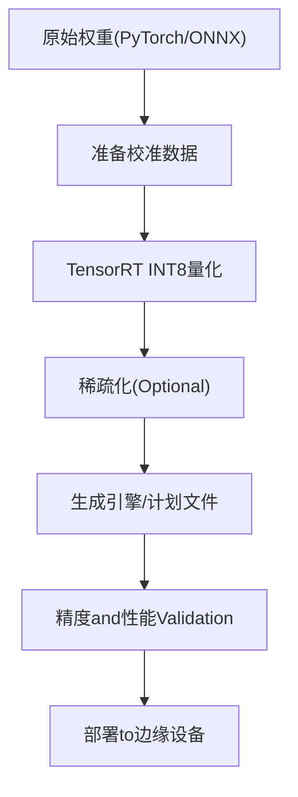
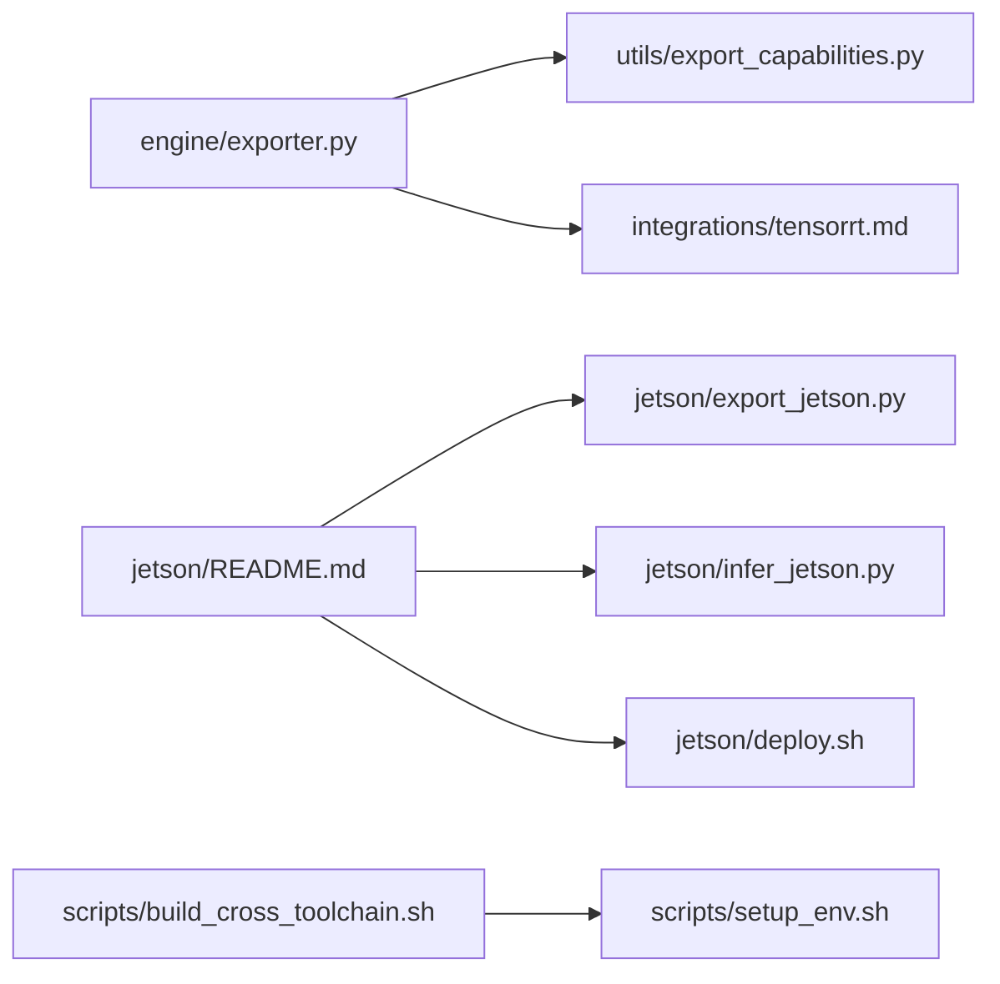

# ARM Platform Deployment

<cite>
**Files Referenced in This Document**
- [examples/YOLO-Master-Cross-Platform-Edge-Deployment/jetson/README.md](file://examples/YOLO-Master-Cross-Platform-Edge-Deployment/jetson/README.md)
- [examples/YOLO-Master-Cross-Platform-Edge-Deployment/jetson/export_jetson.py](file://examples/YOLO-Master-Cross-Platform-Edge-Deployment/jetson/export_jetson.py)
- [examples/YOLO-Master-Cross-Platform-Edge-Deployment/jetson/infer_jetson.py](file://examples/YOLO-Master-Cross-Platform-Edge-Deployment/jetson/infer_jetson.py)
- [examples/YOLO-Master-Cross-Platform-Edge-Deployment/jetson/deploy.sh](file://examples/YOLO-Master-Cross-Platform-Edge-Deployment/jetson/deploy.sh)
- [examples/YOLO-Master-Cross-Platform-Edge-Deployment/scripts/build_cross_toolchain.sh](file://examples/YOLO-Master-Cross-Platform-Edge-Deployment/scripts/build_cross_toolchain.sh)
- [examples/YOLO-Master-Cross-Platform-Edge-Deployment/scripts/setup_env.sh](file://examples/YOLO-Master-Cross-Platform-Edge-Deployment/scripts/setup_env.sh)
- [examples/YOLO-Master-Cross-Platform-Edge-Deployment/TECHNICAL_REPORT.md](file://examples/YOLO-Master-Cross-Platform-Edge-Deployment/TECHNICAL_REPORT.md)
- [docs/en/guides/nvidia-jetson.md](file://docs/en/guides/nvidia-jetson.md)
- [docs/en/integrations/tensorrt.md](file://docs/en/integrations/tensorrt.md)
- [docs/en/integrations/rockchip-rknn.md](file://docs/en/integrations/rockchip-rknn.md)
- [ultralytics/utils/export_capabilities.py](file://ultralytics/utils/export_capabilities.py)
- [ultralytics/engine/exporter.py](file://ultralytics/engine/exporter.py)
</cite>

## Table of Contents
1. [Introduction](#Introduction)
2. [Project Structure](#Project Structure)
3. [Core Components](#Core Components)
4. [Architecture Overview](#Architecture Overview)
5. [Detailed Component Analysis](#Detailed Component Analysis)
6. [Dependency Analysis](#Dependency Analysis)
7. [性能and功耗Optimization](#性能and功耗Optimization)
8. [Troubleshooting Guide](#Troubleshooting Guide)
9. [Conclusion](#Conclusion)
10. [Appendix：自动化脚本and监控方案](#Appendix自动化脚本and监控方案)

## Introduction
本指南targetingARM架构边缘设备，聚焦NVIDIA Jetson系列（JetPack/CUDA/cuDNN/TensorRT）的完整部署流程，并扩展至ARM64交叉编译环境搭建、模型Quantization and Compression（INT8/稀疏化）、不同ARM芯片（such asRK3588、Hi3516）的特定Optimization策略、内存受限下的加载and实时Inference调优、功耗and热控制最佳实践，Centered onand自动化部署and性能监控方案。Documentation同时Combining仓库内现有ExamplesandDocumentation，provides可落地的步骤andRefer to路径。

## Project Structure
仓库中andARM/Edge Deployment相关的资源主要分布whileCentered on下位置：
- Jetson专用Examplesand脚本：examples/YOLO-Master-Cross-Platform-Edge-Deployment/jetson
- 交叉编译andEnvironment Preparation脚本：examples/YOLO-Master-Cross-Platform-Edge-Deployment/scripts
- Cross-Platform Deployment技术报告：examples/YOLO-Master-Cross-Platform-Edge-Deployment/TECHNICAL_REPORT.md
- NVIDIA Jetson官方指南andTensorRT集成Documentation：docs/en/guides/nvidia-jetson.md, docs/en/integrations/tensorrt.md
- Rockchip RKNN集成Documentation（用于RK3588etc.）：docs/en/integrations/rockchip-rknn.md
- Exportcapabilities矩阵andExporterimplementing：ultralytics/utils/export_capabilities.py, ultralytics/engine/exporter.py

Figure Source
- [examples/YOLO-Master-Cross-Platform-Edge-Deployment/jetson/README.md](file://examples/YOLO-Master-Cross-Platform-Edge-Deployment/jetson/README.md)
- [examples/YOLO-Master-Cross-Platform-Edge-Deployment/jetson/export_jetson.py](file://examples/YOLO-Master-Cross-Platform-Edge-Deployment/jetson/export_jetson.py)
- [examples/YOLO-Master-Cross-Platform-Edge-Deployment/jetson/infer_jetson.py](file://examples/YOLO-Master-Cross-Platform-Edge-Deployment/jetson/infer_jetson.py)
- [examples/YOLO-Master-Cross-Platform-Edge-Deployment/jetson/deploy.sh](file://examples/YOLO-Master-Cross-Platform-Edge-Deployment/jetson/deploy.sh)
- [examples/YOLO-Master-Cross-Platform-Edge-Deployment/scripts/build_cross_toolchain.sh](file://examples/YOLO-Master-Cross-Platform-Edge-Deployment/scripts/build_cross_toolchain.sh)
- [examples/YOLO-Master-Cross-Platform-Edge-Deployment/scripts/setup_env.sh](file://examples/YOLO-Master-Cross-Platform-Edge-Deployment/scripts/setup_env.sh)
- [examples/YOLO-Master-Cross-Platform-Edge-Deployment/TECHNICAL_REPORT.md](file://examples/YOLO-Master-Cross-Platform-Edge-Deployment/TECHNICAL_REPORT.md)
- [docs/en/guides/nvidia-jetson.md](file://docs/en/guides/nvidia-jetson.md)
- [docs/en/integrations/tensorrt.md](file://docs/en/integrations/tensorrt.md)
- [docs/en/integrations/rockchip-rknn.md](file://docs/en/integrations/rockchip-rknn.md)
- [ultralytics/utils/export_capabilities.py](file://ultralytics/utils/export_capabilities.py)
- [ultralytics/engine/exporter.py](file://ultralytics/engine/exporter.py)

Section Source
- [examples/YOLO-Master-Cross-Platform-Edge-Deployment/jetson/README.md](file://examples/YOLO-Master-Cross-Platform-Edge-Deployment/jetson/README.md)
- [examples/YOLO-Master-Cross-Platform-Edge-Deployment/TECHNICAL_REPORT.md](file://examples/YOLO-Master-Cross-Platform-Edge-Deployment/TECHNICAL_REPORT.md)
- [docs/en/guides/nvidia-jetson.md](file://docs/en/guides/nvidia-jetson.md)
- [docs/en/integrations/tensorrt.md](file://docs/en/integrations/tensorrt.md)
- [docs/en/integrations/rockchip-rknn.md](file://docs/en/integrations/rockchip-rknn.md)
- [ultralytics/utils/export_capabilities.py](file://ultralytics/utils/export_capabilities.py)
- [ultralytics/engine/exporter.py](file://ultralytics/engine/exporter.py)

## Core Components
- JetsonExportandInferenceExamples
  - export_jetson.py：targetingJetson的Export流程Encapsulates，通常基于ONNX或PyTorch权重生成目标格式（such asTensorRT引擎）。
  - infer_jetson.py：whileJetson上加载Export模型并进行Inference，包含输入预处理、Post-ProcessingandVisualization输出。
  - deploy.sh：一键部署脚本，负责环境检查、依赖安装、Model ExportandValidation。
- 交叉编译andEnvironment Preparation脚本
  - build_cross_toolchain.sh：构建ARM64交叉工具链and必要依赖库。
  - setup_env.sh：while目标设备上初始化运行环境（CUDA/cuDNN/TensorRT/系统库）。
- Documentationand集成
  - nvidia-jetson.md：JetPack安装、CUDA/cuDNN配置and常见问题。
  - tensorrt.md：TensorRTExportandOptimization参数说明。
  - rockchip-rknn.md：RKNN工具链andRK3588部署要点。
- ExportcapabilitiesandExporter
  - export_capabilities.py：定义各后端Exportcapabilities矩阵（精度、算子Supporting、平台兼容性）。
  - exporter.py：统一Export入口，协调不同后端（ONNX、TensorRT、RKNNetc.）的Export逻辑。

Section Source
- [examples/YOLO-Master-Cross-Platform-Edge-Deployment/jetson/export_jetson.py](file://examples/YOLO-Master-Cross-Platform-Edge-Deployment/jetson/export_jetson.py)
- [examples/YOLO-Master-Cross-Platform-Edge-Deployment/jetson/infer_jetson.py](file://examples/YOLO-Master-Cross-Platform-Edge-Deployment/jetson/infer_jetson.py)
- [examples/YOLO-Master-Cross-Platform-Edge-Deployment/jetson/deploy.sh](file://examples/YOLO-Master-Cross-Platform-Edge-Deployment/jetson/deploy.sh)
- [examples/YOLO-Master-Cross-Platform-Edge-Deployment/scripts/build_cross_toolchain.sh](file://examples/YOLO-Master-Cross-Platform-Edge-Deployment/scripts/build_cross_toolchain.sh)
- [examples/YOLO-Master-Cross-Platform-Edge-Deployment/scripts/setup_env.sh](file://examples/YOLO-Master-Cross-Platform-Edge-Deployment/scripts/setup_env.sh)
- [docs/en/guides/nvidia-jetson.md](file://docs/en/guides/nvidia-jetson.md)
- [docs/en/integrations/tensorrt.md](file://docs/en/integrations/tensorrt.md)
- [docs/en/integrations/rockchip-rknn.md](file://docs/en/integrations/rockchip-rknn.md)
- [ultralytics/utils/export_capabilities.py](file://ultralytics/utils/export_capabilities.py)
- [ultralytics/engine/exporter.py](file://ultralytics/engine/exporter.py)

## Architecture Overview
下图展示了从Training权重to边缘设备Inference的整体流程，包括Export、量化、部署and监控的关键节点。

Figure Source
- [examples/YOLO-Master-Cross-Platform-Edge-Deployment/jetson/export_jetson.py](file://examples/YOLO-Master-Cross-Platform-Edge-Deployment/jetson/export_jetson.py)
- [examples/YOLO-Master-Cross-Platform-Edge-Deployment/jetson/infer_jetson.py](file://examples/YOLO-Master-Cross-Platform-Edge-Deployment/jetson/infer_jetson.py)
- [examples/YOLO-Master-Cross-Platform-Edge-Deployment/jetson/deploy.sh](file://examples/YOLO-Master-Cross-Platform-Edge-Deployment/jetson/deploy.sh)
- [docs/en/integrations/tensorrt.md](file://docs/en/integrations/tensorrt.md)

## Detailed Component Analysis

### Jetson部署流水线
- Environment Preparation
  - Viasetup_env.sh完成CUDA/cuDNN/TensorRT版本对齐and系统库安装。
  - Refer tonvidia-jetson.md中的JetPack安装anddrivers are installed/固件注意事项。
- Model Exportand量化
  - Usesexport_jetson.py将PyTorch/ONNX权重转换forTensorRT引擎；若需INT8，需provides校准数据集并设置校准缓存。
  - Refer totensorrt.md中关于精度选择（FP16/INT8）、层融合and内核自动选择的建议。
- Inferenceand服务
  - infer_jetson.py负责加载引擎、Batch Inference、结果解析andVisualization。
  - deploy.sh整合上述步骤并provides一键部署and自检。

Figure Source
- [examples/YOLO-Master-Cross-Platform-Edge-Deployment/jetson/deploy.sh](file://examples/YOLO-Master-Cross-Platform-Edge-Deployment/jetson/deploy.sh)
- [examples/YOLO-Master-Cross-Platform-Edge-Deployment/jetson/export_jetson.py](file://examples/YOLO-Master-Cross-Platform-Edge-Deployment/jetson/export_jetson.py)
- [examples/YOLO-Master-Cross-Platform-Edge-Deployment/jetson/infer_jetson.py](file://examples/YOLO-Master-Cross-Platform-Edge-Deployment/jetson/infer_jetson.py)
- [docs/en/guides/nvidia-jetson.md](file://docs/en/guides/nvidia-jetson.md)
- [docs/en/integrations/tensorrt.md](file://docs/en/integrations/tensorrt.md)

Section Source
- [examples/YOLO-Master-Cross-Platform-Edge-Deployment/jetson/README.md](file://examples/YOLO-Master-Cross-Platform-Edge-Deployment/jetson/README.md)
- [examples/YOLO-Master-Cross-Platform-Edge-Deployment/jetson/deploy.sh](file://examples/YOLO-Master-Cross-Platform-Edge-Deployment/jetson/deploy.sh)
- [examples/YOLO-Master-Cross-Platform-Edge-Deployment/jetson/export_jetson.py](file://examples/YOLO-Master-Cross-Platform-Edge-Deployment/jetson/export_jetson.py)
- [examples/YOLO-Master-Cross-Platform-Edge-Deployment/jetson/infer_jetson.py](file://examples/YOLO-Master-Cross-Platform-Edge-Deployment/jetson/infer_jetson.py)
- [docs/en/guides/nvidia-jetson.md](file://docs/en/guides/nvidia-jetson.md)
- [docs/en/integrations/tensorrt.md](file://docs/en/integrations/tensorrt.md)

### ARM64交叉编译环境搭建
- 工具链构建
  - Usesbuild_cross_toolchain.sh构建aarch64-linux-gnu工具链，并编译必要的C/C++依赖（OpenCV、protobuf、gRPCetc.，视具体需求而定）。
- 环境变量and路径
  - setup_env.shwhile目标设备上设置LD_LIBRARY_PATH、CUDA_HOME、TensorRT路径etc.，确保运行时链接正确。
- 构建产物分发
  - 将交叉编译生成的二进制and共享库打包，推送to边缘设备进行部署。

Figure Source
- [examples/YOLO-Master-Cross-Platform-Edge-Deployment/scripts/build_cross_toolchain.sh](file://examples/YOLO-Master-Cross-Platform-Edge-Deployment/scripts/build_cross_toolchain.sh)
- [examples/YOLO-Master-Cross-Platform-Edge-Deployment/scripts/setup_env.sh](file://examples/YOLO-Master-Cross-Platform-Edge-Deployment/scripts/setup_env.sh)

Section Source
- [examples/YOLO-Master-Cross-Platform-Edge-Deployment/scripts/build_cross_toolchain.sh](file://examples/YOLO-Master-Cross-Platform-Edge-Deployment/scripts/build_cross_toolchain.sh)
- [examples/YOLO-Master-Cross-Platform-Edge-Deployment/scripts/setup_env.sh](file://examples/YOLO-Master-Cross-Platform-Edge-Deployment/scripts/setup_env.sh)

### 模型Quantization and Compression（INT8/稀疏化）
- INT8量化
  - whileJetson上UsesTensorRT进行INT8量化，需要校准数据集and校准缓存；注意动态形状and批大小的限制。
  - Refer totensorrt.md中关于校准、精度容差and性能权衡的建议。
- 稀疏化Optimization
  - 针对某些硬件（such as部分GPU/NPU），可启用稀疏卷积或稀疏权重加速；需Evaluation算子Supportingand精度损失。
- Exportcapabilities矩阵
  - Viaexport_capabilities.py查看当前模型对目标后端的Supporting情况，避免Export Failure或运行时异常。

Figure Source
- [examples/YOLO-Master-Cross-Platform-Edge-Deployment/jetson/export_jetson.py](file://examples/YOLO-Master-Cross-Platform-Edge-Deployment/jetson/export_jetson.py)
- [docs/en/integrations/tensorrt.md](file://docs/en/integrations/tensorrt.md)
- [ultralytics/utils/export_capabilities.py](file://ultralytics/utils/export_capabilities.py)

Section Source
- [examples/YOLO-Master-Cross-Platform-Edge-Deployment/jetson/export_jetson.py](file://examples/YOLO-Master-Cross-Platform-Edge-Deployment/jetson/export_jetson.py)
- [docs/en/integrations/tensorrt.md](file://docs/en/integrations/tensorrt.md)
- [ultralytics/utils/export_capabilities.py](file://ultralytics/utils/export_capabilities.py)

### 不同ARM芯片的特定Optimization方案
- NVIDIA Jetson（JetPack/CUDA/TensorRT）
  - PreferFP16Centered on获得稳定加速；while算力充足且校准数据充分时尝试INT8。
  - 调整batch sizeand图像分辨率Centered on平衡吞吐and延迟。
- Rockchip RK3588（RKNN）
  - UsesRKNN工具链将模型转换for.rknpu格式；关注算子Supportingand量化策略。
  - Refer torockchip-rknn.md中的部署流程and常见问题。
- HiSilicon Hi3516
  - 该芯片通常采用厂商SDK（such as海思MPP/AI框架）；需while对应生态中进行模型转换and部署。
  - 本项目未provides直接集成脚本，建议Refer to厂商Documentation并Combining通用Export流程（ONNX→厂商格式）。

Section Source
- [docs/en/integrations/tensorrt.md](file://docs/en/integrations/tensorrt.md)
- [docs/en/integrations/rockchip-rknn.md](file://docs/en/integrations/rockchip-rknn.md)

### 内存限制下的模型加载and实时Inference调优
- 分块加载and懒加载
  - 对于大模型，可采用分块加载策略，仅while需要时载入专家或Modules（适用于MoE架构）。
- 动态形状and批处理
  - Set appropriately最大输入尺寸and批大小，避免峰值内存溢出。
- 线程and队列
  - Uses生产者-消费者队列解耦数据采集andInference，降低抖动。
- 监控and回退
  - 当内存不足时，自动降级to更小模型或更低精度。

Section Source
- [examples/YOLO-Master-Cross-Platform-Edge-Deployment/TECHNICAL_REPORT.md](file://examples/YOLO-Master-Cross-Platform-Edge-Deployment/TECHNICAL_REPORT.md)

### 功耗管理and热控制最佳实践
- 频率and电源模式
  - 根据场景选择合适的CPU/GPU频率and电源模式，避免持续高负载导致降频。
- 散热and风道
  - 确保良好散热条件，必要时增加风扇或被动散热片。
- 自适应调度
  - 依据温度and功耗Metrics动态调整Inference频率and批大小。

Section Source
- [examples/YOLO-Master-Cross-Platform-Edge-Deployment/TECHNICAL_REPORT.md](file://examples/YOLO-Master-Cross-Platform-Edge-Deployment/TECHNICAL_REPORT.md)

## Dependency Analysis
- Exporterandcapabilities矩阵
  - exporter.py作for统一Export入口，Callsexport_capabilities.py判断后端Supporting，再执行具体后端Export逻辑。
- JetsonExamplesandDocumentation
  - jetsonExamples依赖nvidia-jetson.mdandtensorrt.mdprovides的版本and参数指导。
- 交叉编译脚本
  - build_cross_toolchain.shandsetup_env.sh共同构成构建and运行环境的基础。

Figure Source
- [ultralytics/engine/exporter.py](file://ultralytics/engine/exporter.py)
- [ultralytics/utils/export_capabilities.py](file://ultralytics/utils/export_capabilities.py)
- [docs/en/integrations/tensorrt.md](file://docs/en/integrations/tensorrt.md)
- [examples/YOLO-Master-Cross-Platform-Edge-Deployment/jetson/README.md](file://examples/YOLO-Master-Cross-Platform-Edge-Deployment/jetson/README.md)
- [examples/YOLO-Master-Cross-Platform-Edge-Deployment/jetson/export_jetson.py](file://examples/YOLO-Master-Cross-Platform-Edge-Deployment/jetson/export_jetson.py)
- [examples/YOLO-Master-Cross-Platform-Edge-Deployment/jetson/infer_jetson.py](file://examples/YOLO-Master-Cross-Platform-Edge-Deployment/jetson/infer_jetson.py)
- [examples/YOLO-Master-Cross-Platform-Edge-Deployment/jetson/deploy.sh](file://examples/YOLO-Master-Cross-Platform-Edge-Deployment/jetson/deploy.sh)
- [examples/YOLO-Master-Cross-Platform-Edge-Deployment/scripts/build_cross_toolchain.sh](file://examples/YOLO-Master-Cross-Platform-Edge-Deployment/scripts/build_cross_toolchain.sh)
- [examples/YOLO-Master-Cross-Platform-Edge-Deployment/scripts/setup_env.sh](file://examples/YOLO-Master-Cross-Platform-Edge-Deployment/scripts/setup_env.sh)

Section Source
- [ultralytics/engine/exporter.py](file://ultralytics/engine/exporter.py)
- [ultralytics/utils/export_capabilities.py](file://ultralytics/utils/export_capabilities.py)
- [examples/YOLO-Master-Cross-Platform-Edge-Deployment/jetson/README.md](file://examples/YOLO-Master-Cross-Platform-Edge-Deployment/jetson/README.md)
- [examples/YOLO-Master-Cross-Platform-Edge-Deployment/scripts/build_cross_toolchain.sh](file://examples/YOLO-Master-Cross-Platform-Edge-Deployment/scripts/build_cross_toolchain.sh)
- [examples/YOLO-Master-Cross-Platform-Edge-Deployment/scripts/setup_env.sh](file://examples/YOLO-Master-Cross-Platform-Edge-Deployment/scripts/setup_env.sh)

## 性能and功耗Optimization
- 精度选择
  - FP16while多数Jetson平台上具备良好性价比；INT8需充分校准并注意精度下降风险。
- 输入尺寸and批大小
  - 降低分辨率and批大小可减少内存占用and延迟，提升实时性。
- 线程and并行
  - Set appropriately线程数，避免and系统其他进程争抢资源。
- 监控and自适应
  - 实时监控FPS、延迟、功耗and温度，动态调整参数Centered on保持稳定性能。

[本节for通用指导，无需列出具体文件来源]

## Troubleshooting Guide
- 版本不匹配
  - 确认JetPack、CUDA、cuDNN、TensorRT版本一致，Refer tonvidia-jetson.md。
- Export Failure
  - 检查export_capabilities.py中的capabilities矩阵，确认目标后端Supporting所需算子and形状。
- 运行时崩溃
  - 检查LD_LIBRARY_PATHandCUDA/TensorRT库路径是否正确，Refer tosetup_env.sh。
- 精度异常
  - 重新校准并检查校准数据分布；适当放宽精度容差或回退toFP16。

Section Source
- [docs/en/guides/nvidia-jetson.md](file://docs/en/guides/nvidia-jetson.md)
- [ultralytics/utils/export_capabilities.py](file://ultralytics/utils/export_capabilities.py)
- [examples/YOLO-Master-Cross-Platform-Edge-Deployment/scripts/setup_env.sh](file://examples/YOLO-Master-Cross-Platform-Edge-Deployment/scripts/setup_env.sh)

## Conclusion
ViaJetson专用Examples、TensorRT集成Documentationand交叉编译脚本，可whileARM边缘设备上implementing端to端的YOLO模型部署andOptimization。CombiningINT8量化、稀疏化and自适应调度，可while内存and功耗受限条件下获得稳定的实时Inference Performance。针对不同ARM芯片（such asRK3588、Hi3516），应遵循各自生态的工具链and最佳实践。

[本节for总结，无需列出具体文件来源]

## Appendix：自动化脚本and监控方案
- 自动化部署脚本
  - deploy.sh：一键完成环境检查、依赖安装、Model ExportandValidation。
  - build_cross_toolchain.shandsetup_env.sh：构建and配置交叉编译and运行环境。
- 性能监控方案
  - whileinfer_jetson.py中集成FPS、延迟、功耗and温度采集，并ViaLogging或轻量API上报。
  - Combining系统工具（such asnvtop、htop、iostat）进行综合监控。

Section Source
- [examples/YOLO-Master-Cross-Platform-Edge-Deployment/jetson/deploy.sh](file://examples/YOLO-Master-Cross-Platform-Edge-Deployment/jetson/deploy.sh)
- [examples/YOLO-Master-Cross-Platform-Edge-Deployment/jetson/infer_jetson.py](file://examples/YOLO-Master-Cross-Platform-Edge-Deployment/jetson/infer_jetson.py)
- [examples/YOLO-Master-Cross-Platform-Edge-Deployment/scripts/build_cross_toolchain.sh](file://examples/YOLO-Master-Cross-Platform-Edge-Deployment/scripts/build_cross_toolchain.sh)
- [examples/YOLO-Master-Cross-Platform-Edge-Deployment/scripts/setup_env.sh](file://examples/YOLO-Master-Cross-Platform-Edge-Deployment/scripts/setup_env.sh)