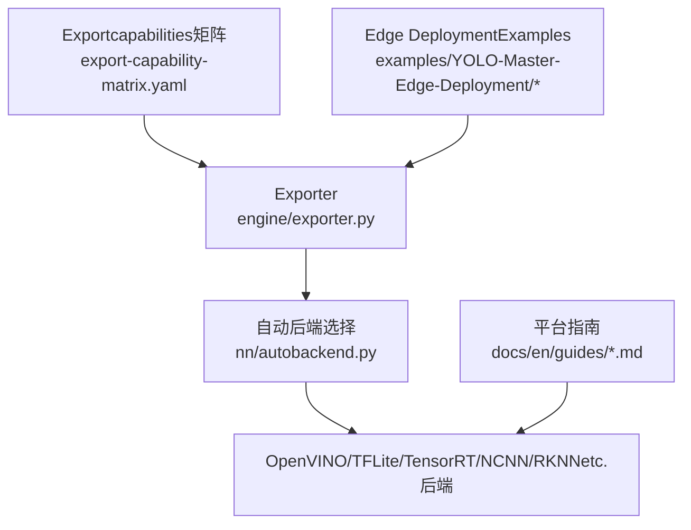
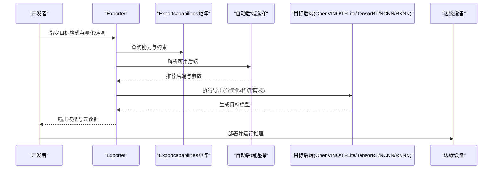
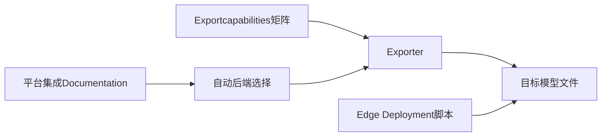

# 模型Quantization and Compression

<cite>
**Files Referenced in This Document**
- [README.md](file://README.md)
- [export-capability-matrix.yaml](file://ultralytics/cfg/export-capability-matrix.yaml)
- [exporter.py](file://ultralytics/engine/exporter.py)
- [autobackend.py](file://ultralytics/nn/autobackend.py)
- [benchmark_molora_dispatch.py](file://benchmarks/benchmark_molora_dispatch.py)
- [molora_guide.md](file://docs/molora_guide.md)
- [yolo26.md](file://docs/en/models/yolo26.md)
- [raspberry-pi.md](file://docs/en/guides/raspberry-pi.md)
- [deepstream-nvidia-jetson.md](file://docs/en/guides/deepstream-nvidia-jetson.md)
- [coral-edge-tpu-on-raspberry-pi.md](file://docs/en/guides/coral-edge-tpu-on-raspberry-pi.md)
- [openvino.md](file://docs/en/integrations/openvino.md)
- [tflite.md](file://docs/en/integrations/tflite.md)
- [tensorrt.md](file://docs/en/integrations/tensorrt.md)
- [ncnn.md](file://docs/en/integrations/ncnn.md)
- [rknn.md](file://docs/en/integrations/rockchip-rknn.md)
- [edge_utils.py](file://examples/YOLO-Master-Edge-Deployment/edge_utils.py)
- [validate_edge_outputs.py](file://examples/YOLO-Master-Edge-Deployment/validate_edge_outputs.py)
- [export_edge_models.py](file://examples/YOLO-Master-Edge-Deployment/export_edge_models.py)
</cite>

## Table of Contents
1. [Introduction](#Introduction)
2. [Project Structure](#Project Structure)
3. [Core Components](#Core Components)
4. [Architecture Overview](#Architecture Overview)
5. [Detailed Component Analysis](#Detailed Component Analysis)
6. [Dependency Analysis](#Dependency Analysis)
7. [性能考量](#性能考量)
8. [Troubleshooting Guide](#Troubleshooting Guide)
9. [Conclusion](#Conclusion)
10. [Appendix](#Appendix)

## Introduction
本指南targetingwhileARM边缘设备上部署YOLO系列检测模型的Engineers，聚焦于模型Quantization and Compression技术。内容涵盖：
- INT8量化的implementing原理and配置方法（动态量化、静态量化）
- 稀疏化and权重剪枝whileARM平台的应用策略
- Mixture精度量化的最佳实践and精度-性能权衡
- 针对YOLOBackbone NetworkandDetection Head的量化策略
- 量化后模型的Validationand精度Evaluation方法
- 不同硬件后端（CPU、NPU、GPU）的量化效果差异andOptimization建议

## Project Structure
仓库围绕YOLOTraining、Exportand部署形成完整链路。and量化和压缩相关的核心位置包括：
- Exportcapabilities矩阵andExporter：定义各后端Supporting的量化and格式capabilities，并drivers are installedExport流程
- 自动后端选择：根据目标设备自动匹配最优Inference后端
- DocumentationandExamples：provides多平台集成说明and边缘端Export/Validation脚本

Figure Source
- [export-capability-matrix.yaml](file://ultralytics/cfg/export-capability-matrix.yaml)
- [exporter.py](file://ultralytics/engine/exporter.py)
- [autobackend.py](file://ultralytics/nn/autobackend.py)

Section Source
- [README.md](file://README.md)
- [export-capability-matrix.yaml](file://ultralytics/cfg/export-capability-matrix.yaml)
- [exporter.py](file://ultralytics/engine/exporter.py)
- [autobackend.py](file://ultralytics/nn/autobackend.py)

## Core Components
- Exportcapabilities矩阵：集中声明各后端对INT8/FP16/稀疏/剪枝etc.capabilities的Supporting情况，是选择量化路径的依据
- Exporter：Encapsulates从PyTorchto目标格式的转换流程，串联量化、算子替换、图Optimizationetc.步骤
- 自动后端选择：依据运行环境and可用库，自动选择最优Inference引擎，影响量化落地效果
- Edge DeploymentExamples：providesCross-Platform Exportand输出一致性校验脚本，便于回归Validation

Section Source
- [export-capability-matrix.yaml](file://ultralytics/cfg/export-capability-matrix.yaml)
- [exporter.py](file://ultralytics/engine/exporter.py)
- [autobackend.py](file://ultralytics/nn/autobackend.py)
- [edge_utils.py](file://examples/YOLO-Master-Edge-Deployment/edge_utils.py)
- [validate_edge_outputs.py](file://examples/YOLO-Master-Edge-Deployment/validate_edge_outputs.py)

## Architecture Overview
下图展示从Training完成模型toEdge Deployment的整体流程，突出Quantization and Compression环节while各阶段的介入点。

Figure Source
- [export-capability-matrix.yaml](file://ultralytics/cfg/export-capability-matrix.yaml)
- [exporter.py](file://ultralytics/engine/exporter.py)
- [autobackend.py](file://ultralytics/nn/autobackend.py)

## Detailed Component Analysis

### 组件A：Exportcapabilities矩阵and量化策略选择
- 作用：统一描述各后端对量化（INT8/FP16）、稀疏、剪枝、动态/静态校准etc.的Supporting状态
- Uses方式：whileExport前查询矩阵，Combining目标设备capabilitiesand精度要求，确定是否启用INT8、是否需要静态校准集、是否采用Mixture精度
- 典型决策：
  - CPU/NPU：优先INT8；若精度敏感，考虑Mixture精度或仅对卷积层做INT8
  - GPU：优先FP16；仅while特定TensorRT配置下尝试INT8
  - 资源受限ARM SoC：优先INT8+稀疏/剪枝组合

Section Source
- [export-capability-matrix.yaml](file://ultralytics/cfg/export-capability-matrix.yaml)

### 组件B：Exporterand量化流水线
- 职责：将PyTorch模型转换for目标格式，并while转换过程中应用量化、稀疏、剪枝etc.Optimization
- 关键阶段：
  - 前置检查：基于capabilities矩阵and后端可用性进行预检
  - 图级Optimization：算子融合、常量折叠、形状推导
  - 量化：动态/静态INT8、Mixture精度策略
  - 稀疏/剪枝：结构化/非结构化稀疏、通道/核级剪枝
  - Export：生成目标后端可加载的模型文件and元数据
- 建议：
  - 先Centered onFP16基线ValidationExport稳定性，再引入INT8
  - 对Detection Headand高分辨率分支谨慎量化，必要时保留更高精度

Section Source
- [exporter.py](file://ultralytics/engine/exporter.py)

### 组件C：自动后端选择and硬件适配
- 职责：根据当前环境（库版本、drivers are installed、设备类型）选择最优Inference后端
- 影响：同一模型while不同后端上的量化收益and精度表现可能显著不同
- 建议：
  - while目标ARM设备上实际探测可用后端，避免“桌面端可用但边缘不可用”的情况
  - for不同后端维护独立Export产物，减少运行时兼容性问题

Section Source
- [autobackend.py](file://ultralytics/nn/autobackend.py)

### 组件D：Edge Deploymentand一致性Validation
- 作用：providesCross-Platform Export脚本and输出一致性校验工具，确保量化前后结果稳定
- 关键点：
  - 固定随机种子and输入预处理，保证对比公平
  - 记录关键Metrics（mAP、延迟、内存占用），用于回归监控
  - 针对不同后端分别Validation，定位后端相关退化

Section Source
- [export_edge_models.py](file://examples/YOLO-Master-Edge-Deployment/export_edge_models.py)
- [validate_edge_outputs.py](file://examples/YOLO-Master-Edge-Deployment/validate_edge_outputs.py)
- [edge_utils.py](file://examples/YOLO-Master-Edge-Deployment/edge_utils.py)

### 组件E：MOLoRAandSparse Scheduling（Refer to）
- 背景：仓库包含MOLoRA相关基准and指南，涉andSparse SchedulingandRouting-Aware Mergingetc.思路
- 借鉴价值：稀疏化and路由/专家结构的协同Optimization思想可Migration至YOLO的稀疏/剪枝策略设计
- 注意：该部分并非直接量化Modules，但可作for稀疏化and结构化Optimization的Refer to

Section Source
- [benchmark_molora_dispatch.py](file://benchmarks/benchmark_molora_dispatch.py)
- [molora_guide.md](file://docs/molora_guide.md)

## Dependency Analysis
- Exporter依赖capabilities矩阵and后端选择逻辑，二者共同决定最终Export的Quantization and Compression方案
- Edge DeploymentExamples依赖Exporter生成的模型，并Via一致性校验脚本保障质量
- 平台指南and集成Documentationfor不同后端的具体用法and注意事项providesRefer to

Figure Source
- [export-capability-matrix.yaml](file://ultralytics/cfg/export-capability-matrix.yaml)
- [exporter.py](file://ultralytics/engine/exporter.py)
- [autobackend.py](file://ultralytics/nn/autobackend.py)
- [export_edge_models.py](file://examples/YOLO-Master-Edge-Deployment/export_edge_models.py)

Section Source
- [export-capability-matrix.yaml](file://ultralytics/cfg/export-capability-matrix.yaml)
- [exporter.py](file://ultralytics/engine/exporter.py)
- [autobackend.py](file://ultralytics/nn/autobackend.py)
- [export_edge_models.py](file://examples/YOLO-Master-Edge-Deployment/export_edge_models.py)

## 性能考量
- 量化收益and代价
  - INT8通常带来显著吞吐提升and内存带宽降低，但需关注小目标and细粒度特征退化
  - Mixture精度可while关键层保持较高精度，兼顾整体性能
- 稀疏and剪枝
  - 结构化稀疏/剪枝更易被后端加速，非结构化稀疏需要专用内核
  - 剪枝比例需ViaValidation集逐步搜索，避免破坏Detection Head判别性
- 端to端时延and吞吐
  - whileARM设备上，I/Oand预处理常成forbottlenecks，需and模型Optimization同步进行
  - 批大小、分辨率、NMS阈值etc.Inference参数会影响最终时延

[This section provides general guidance and does not directly analyze specific files]

## Troubleshooting Guide
- Export Failure或运行时崩溃
  - 检查capabilities矩阵中对应后端是否Supporting所选量化/稀疏选项
  - 确认目标设备已安装所需运行时anddrivers are installed
- 精度下降明显
  - 优先回退toFP16基线，逐步引入INT8
  - 对Detection Headand高分辨率分支单独Evaluation，必要时提高其精度位宽
  - 增加静态校准集规模and代表性，覆盖难例and小目标
- 输出不一致
  - Uses一致性校验脚本对比量化前后输出分布
  - 固定随机性and输入预处理，隔离数值误差来源
- 平台差异
  - 针对OpenVINO、TFLite、TensorRT、NCNN、RKNN分别Validation，定位后端特有退化

Section Source
- [export-capability-matrix.yaml](file://ultralytics/cfg/export-capability-matrix.yaml)
- [exporter.py](file://ultralytics/engine/exporter.py)
- [autobackend.py](file://ultralytics/nn/autobackend.py)
- [validate_edge_outputs.py](file://examples/YOLO-Master-Edge-Deployment/validate_edge_outputs.py)

## Conclusion
whileARM边缘设备上implementingYOLO的高效部署，应Centered oncapabilities矩阵for依据，选择合适的Quantization and Compression组合；Centered onExporterfor核心，构建稳定的量化流水线；Centered on自动后端选择and边缘Validationfor保障，确保跨平台一致性and可复现性。实践中建议遵循“FP16基线→INT8→稀疏/剪枝→Mixture精度微调”的渐进式Optimization路径，并Combining目标后端特性进行针对性调优。

[This section is summary content and does not directly analyze specific files]

## Appendix

### INT8量化：动态and静态的选择策略
- 动态量化
  - Advantages：无需校准集，快速迭代
  - 适用：原型Validation、数据难Centered on收集、对精度容忍度较高
- 静态量化
  - Advantages：更准确的激活统计，通常精度更好
  - 适用：生产部署、有代表性校准集、对精度敏感
- 建议
  - 先用动态量化建立基线，再用静态量化提升精度
  - 校准集应覆盖不同光照、尺度、遮挡场景，包含小目标

Section Source
- [export-capability-matrix.yaml](file://ultralytics/cfg/export-capability-matrix.yaml)
- [exporter.py](file://ultralytics/engine/exporter.py)

### 稀疏化and权重剪枝whileARM平台的应用
- 稀疏化
  - 结构化稀疏更易被后端加速，非结构化稀疏需专用内核
  - 可CombiningTraining后稀疏或Training期稀疏，平衡精度and压缩比
- 剪枝
  - 通道/核级剪枝适合卷积主干，Detection Head需谨慎
  - 剪枝后建议进行轻量微调Centered on恢复精度
- ARM建议
  - 优先选择结构化稀疏/剪枝，Combined withINT8获得更大收益
  - 利用后端provides的稀疏/剪枝Optimization开关（such asOpenVINO、NCNN、RKNN）

Section Source
- [export-capability-matrix.yaml](file://ultralytics/cfg/export-capability-matrix.yaml)
- [exporter.py](file://ultralytics/engine/exporter.py)

### Mixture精度量化的最佳实践
- 分层策略
  - 主干早期层andDetection Head可保留更高精度，中间层and大量卷积采用INT8
- 关键层识别
  - 对小目标敏感层、注意力/归一化附近层保持高精度
- Validation方法
  - 逐层替换并观察mAP变化，定位退化层
  - Combining混淆矩阵andIoU分布分析退化原因

Section Source
- [export-capability-matrix.yaml](file://ultralytics/cfg/export-capability-matrix.yaml)
- [exporter.py](file://ultralytics/engine/exporter.py)

### YOLO特定Optimization方案（骨干andDetection Head）
- Backbone Network
  - 优先对卷积密集区域进行INT8量化
  - 可适度引入稀疏/剪枝Centered on降低计算量
- Detection Head
  - 对分类and回归分支分别Evaluation量化影响
  - 若退化明显，可提升其精度位宽或采用Mixture精度
- 输入andNMS
  - 固定输入尺寸and预处理，避免量化放大数值误差
  - NMS阈值andConfidence Threshold联合调参，补偿精度损失

Section Source
- [yolo26.md](file://docs/en/models/yolo26.md)
- [export-capability-matrix.yaml](file://ultralytics/cfg/export-capability-matrix.yaml)
- [exporter.py](file://ultralytics/engine/exporter.py)

### 量化后模型Validationand精度Evaluation方法
- 基线对比
  - Centered onFP16/FP32for基线，记录mAP、mAP@0.5、mAP@0.5:0.95
- 一致性校验
  - Uses边缘Validation脚本对比量化前后输出分布and边界框差异
- 数据集覆盖
  - 校准/Validation集需包含小目标、遮挡、低光etc.难例
- Metrics追踪
  - 同时记录时延、吞吐、内存占用，综合Evaluation

Section Source
- [validate_edge_outputs.py](file://examples/YOLO-Master-Edge-Deployment/validate_edge_outputs.py)
- [export_edge_models.py](file://examples/YOLO-Master-Edge-Deployment/export_edge_models.py)

### 不同硬件后端的效果差异andOptimization建议
- OpenVINO（CPU/NPU）
  - 优势：INT8Optimization成熟，Supporting稀疏/剪枝
  - 建议：开启INT8and稀疏Optimization，调整线程数and缓存策略
- TFLite（CPU/NPU）
  - 优势：移动端广泛Supporting，INT8生态完善
  - 建议：Uses官方ExplainerandNNAPI/Delegate，Set appropriately线程
- TensorRT（GPU）
  - 优势：高吞吐，FP16/INT8均可
  - 建议：优先FP16，必要时再尝试INT8；关注校准集质量
- NCNN（ARM CPU）
  - 优势：轻量高效，适合手机/嵌入式
  - 建议：启用SIMDand多线程，CombiningINT8
- RKNN（Rockchip NPU）
  - 优势：SoC内NPU加速
  - 建议：按厂商工具链要求准备校准集and量化参数

Section Source
- [openvino.md](file://docs/en/integrations/openvino.md)
- [tflite.md](file://docs/en/integrations/tflite.md)
- [tensorrt.md](file://docs/en/integrations/tensorrt.md)
- [ncnn.md](file://docs/en/integrations/ncnn.md)
- [rknn.md](file://docs/en/integrations/rockchip-rknn.md)

### 平台and部署Refer to
- Raspberry PiandCoral Edge TPU
  - 适合低功耗场景，优先考虑TFLite INT8andEdge TPU Delegate
- JetsonandDeepStream
  - 适合中etc.算力边缘，优先TensorRT FP16/INT8andDeepStream管线Optimization
- 通用ARM设备
  - CombiningOpenVINO/NCNN/TFLite，按设备capabilities选择最优后端

Section Source
- [raspberry-pi.md](file://docs/en/guides/raspberry-pi.md)
- [coral-edge-tpu-on-raspberry-pi.md](file://docs/en/guides/coral-edge-tpu-on-raspberry-pi.md)
- [deepstream-nvidia-jetson.md](file://docs/en/guides/deepstream-nvidia-jetson.md)