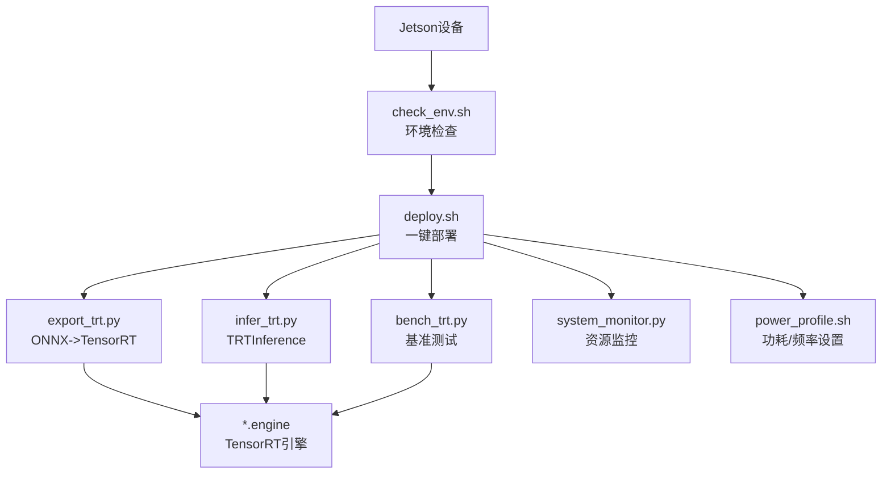
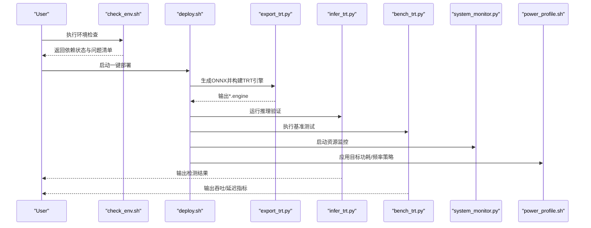
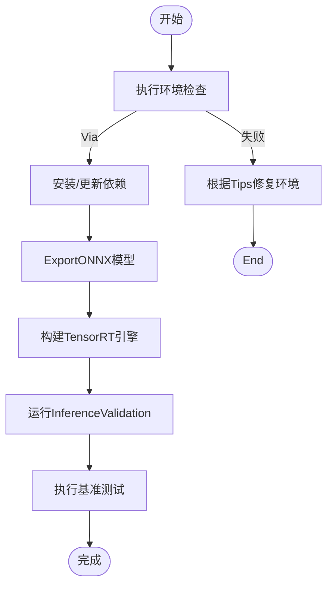
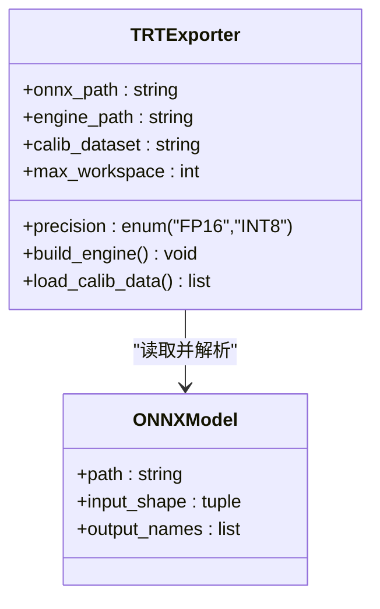
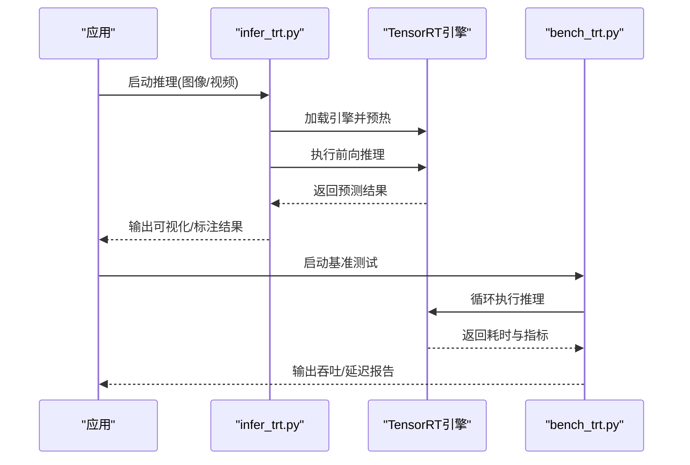
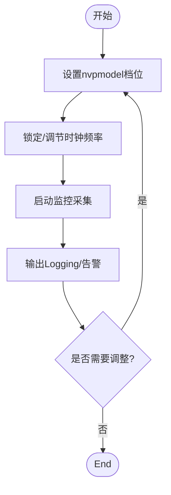
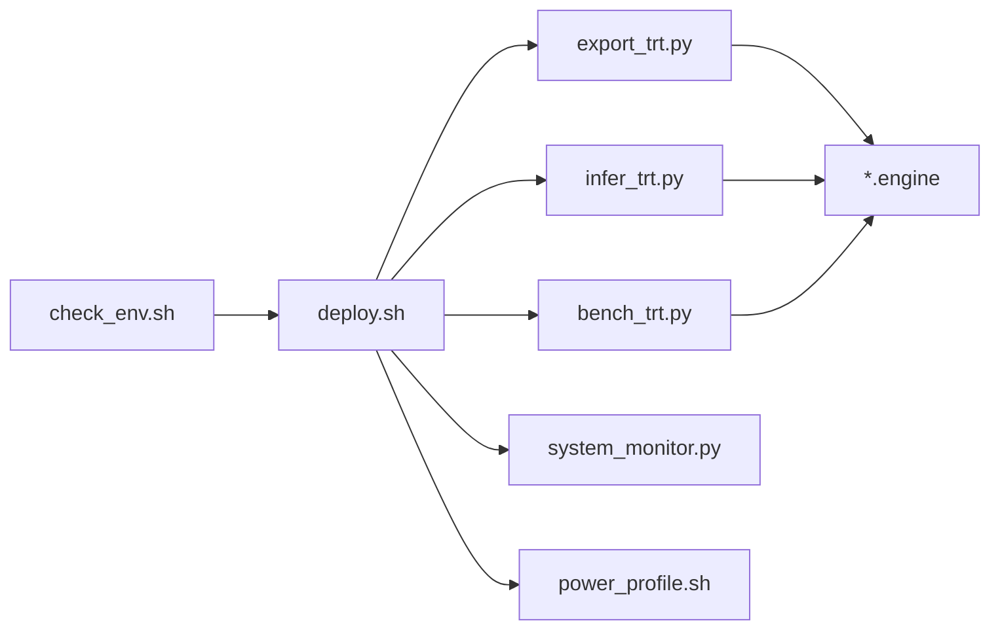

# NVIDIA Jetson部署

<cite>
**Files Referenced in This Document**
- [examples/YOLO-Master-Cross-Platform-Edge-Deployment/jetson/README.md](file://examples/YOLO-Master-Cross-Platform-Edge-Deployment/jetson/README.md)
- [examples/YOLO-Master-Cross-Platform-Edge-Deployment/jetson/deploy.sh](file://examples/YOLO-Master-Cross-Platform-Edge-Deployment/jetson/deploy.sh)
- [examples/YOLO-Master-Cross-Platform-Edge-Deployment/jetson/export_trt.py](file://examples/YOLO-Master-Cross-Platform-Edge-Deployment/jetson/export_trt.py)
- [examples/YOLO-Master-Cross-Platform-Edge-Deployment/jetson/infer_trt.py](file://examples/YOLO-Master-Cross-Platform-Edge-Deployment/jetson/infer_trt.py)
- [examples/YOLO-Master-Cross-Platform-Edge-Deployment/jetson/bench_trt.py](file://examples/YOLO-Master-Cross-Platform-Edge-Deployment/jetson/bench_trt.py)
- [examples/YOLO-Master-Cross-Platform-Edge-Deployment/jetson/system_monitor.py](file://examples/YOLO-Master-Cross-Platform-Edge-Deployment/jetson/system_monitor.py)
- [examples/YOLO-Master-Cross-Platform-Edge-Deployment/jetson/power_profile.sh](file://examples/YOLO-Master-Cross-Platform-Edge-Deployment/jetson/power_profile.sh)
- [examples/YOLO-Master-Cross-Platform-Edge-Deployment/jetson/check_env.sh](file://examples/YOLO-Master-Cross-Platform-Edge-Deployment/jetson/check_env.sh)
- [docs/en/guides/nvidia-jetson.md](file://docs/en/guides/nvidia-jetson.md)
- [docs/en/guides/deepstream-nvidia-jetson.md](file://docs/en/guides/deepstream-nvidia-jetson.md)
- [docs/en/integrations/tensorrt.md](file://docs/en/integrations/tensorrt.md)
- [ultralytics/utils/benchmarks.py](file://ultralytics/utils/benchmarks.py)
- [ultralytics/engine/exporter.py](file://ultralytics/engine/exporter.py)
- [ultralytics/utils/export_capabilities.py](file://ultralytics/utils/export_capabilities.py)
</cite>

## Table of Contents
1. [Introduction](#Introduction)
2. [Project Structure](#Project Structure)
3. [Core Components](#Core Components)
4. [Architecture Overview](#Architecture Overview)
5. [Detailed Component Analysis](#Detailed Component Analysis)
6. [Dependency Analysis](#Dependency Analysis)
7. [性能考量](#性能考量)
8. [Troubleshooting Guide](#Troubleshooting Guide)
9. [Conclusion](#Conclusion)
10. [Appendix](#Appendix)

## Introduction
本指南targetingNVIDIA Jetson系列设备（Nano、TX2、Xavier、Orin），provides从JetPack安装andCUDA/cuDNN环境配置，toTensorRTOptimization（模型转换、精度校准、性能调优）、内存管理and功耗控制策略的完整部署方案。Documentation同时给出自动化部署脚本的Uses说明、实时Inference基准测试and监控方法，并总结常见问题and解决方案。

## Project Structure
本项目while跨平台Edge DeploymentExamples中provides了针对Jetson的一键式工具链，包括环境检查、依赖安装、Model ExportforTensorRT引擎、Inferenceand基准测试、系统监控and功耗配置etc.脚本andPythonModules。

Figure Source
- [examples/YOLO-Master-Cross-Platform-Edge-Deployment/jetson/check_env.sh](file://examples/YOLO-Master-Cross-Platform-Edge-Deployment/jetson/check_env.sh)
- [examples/YOLO-Master-Cross-Platform-Edge-Deployment/jetson/deploy.sh](file://examples/YOLO-Master-Cross-Platform-Edge-Deployment/jetson/deploy.sh)
- [examples/YOLO-Master-Cross-Platform-Edge-Deployment/jetson/export_trt.py](file://examples/YOLO-Master-Cross-Platform-Edge-Deployment/jetson/export_trt.py)
- [examples/YOLO-Master-Cross-Platform-Edge-Deployment/jetson/infer_trt.py](file://examples/YOLO-Master-Cross-Platform-Edge-Deployment/jetson/infer_trt.py)
- [examples/YOLO-Master-Cross-Platform-Edge-Deployment/jetson/bench_trt.py](file://examples/YOLO-Master-Cross-Platform-Edge-Deployment/jetson/bench_trt.py)
- [examples/YOLO-Master-Cross-Platform-Edge-Deployment/jetson/system_monitor.py](file://examples/YOLO-Master-Cross-Platform-Edge-Deployment/jetson/system_monitor.py)
- [examples/YOLO-Master-Cross-Platform-Edge-Deployment/jetson/power_profile.sh](file://examples/YOLO-Master-Cross-Platform-Edge-Deployment/jetson/power_profile.sh)

Section Source
- [examples/YOLO-Master-Cross-Platform-Edge-Deployment/jetson/README.md](file://examples/YOLO-Master-Cross-Platform-Edge-Deployment/jetson/README.md)

## Core Components
- 环境检查脚本：检测JetPack版本、CUDA/cuDNN、TensorRT、Pythonand依赖库是否就绪，输出诊断信息。
- 一键部署脚本：执行环境检查、Installing Dependencies、生成ONNX、构建TensorRT引擎、ValidationInferenceand基准测试。
- TensorRTExporter：基于ONNX模型构建TensorRT引擎，SupportingFP16/INT8（含校准）and不同builder选项。
- Inference程序：加载TRT引擎进行图像/视频流Inference，Supporting批量and动态输入尺寸。
- 基准测试：统计吞吐、延迟、GPU/CPU利用率and内存占用，输出可复现实验报告。
- 系统监控：采集CPU/GPU温度、功耗、内存、进程状态，便于while线观测。
- 功耗配置：Vianvpmodelandjetson_clocks调整性能档位and频率，平衡功耗and时延。

Section Source
- [examples/YOLO-Master-Cross-Platform-Edge-Deployment/jetson/check_env.sh](file://examples/YOLO-Master-Cross-Platform-Edge-Deployment/jetson/check_env.sh)
- [examples/YOLO-Master-Cross-Platform-Edge-Deployment/jetson/deploy.sh](file://examples/YOLO-Master-Cross-Platform-Edge-Deployment/jetson/deploy.sh)
- [examples/YOLO-Master-Cross-Platform-Edge-Deployment/jetson/export_trt.py](file://examples/YOLO-Master-Cross-Platform-Edge-Deployment/jetson/export_trt.py)
- [examples/YOLO-Master-Cross-Platform-Edge-Deployment/jetson/infer_trt.py](file://examples/YOLO-Master-Cross-Platform-Edge-Deployment/jetson/infer_trt.py)
- [examples/YOLO-Master-Cross-Platform-Edge-Deployment/jetson/bench_trt.py](file://examples/YOLO-Master-Cross-Platform-Edge-Deployment/jetson/bench_trt.py)
- [examples/YOLO-Master-Cross-Platform-Edge-Deployment/jetson/system_monitor.py](file://examples/YOLO-Master-Cross-Platform-Edge-Deployment/jetson/system_monitor.py)
- [examples/YOLO-Master-Cross-Platform-Edge-Deployment/jetson/power_profile.sh](file://examples/YOLO-Master-Cross-Platform-Edge-Deployment/jetson/power_profile.sh)

## Architecture Overview
下图展示从“Environment Preparation”to“模型部署and运行”的整体流程，Centered onand各脚本andModules之间的Calls关系。

Figure Source
- [examples/YOLO-Master-Cross-Platform-Edge-Deployment/jetson/check_env.sh](file://examples/YOLO-Master-Cross-Platform-Edge-Deployment/jetson/check_env.sh)
- [examples/YOLO-Master-Cross-Platform-Edge-Deployment/jetson/deploy.sh](file://examples/YOLO-Master-Cross-Platform-Edge-Deployment/jetson/deploy.sh)
- [examples/YOLO-Master-Cross-Platform-Edge-Deployment/jetson/export_trt.py](file://examples/YOLO-Master-Cross-Platform-Edge-Deployment/jetson/export_trt.py)
- [examples/YOLO-Master-Cross-Platform-Edge-Deployment/jetson/infer_trt.py](file://examples/YOLO-Master-Cross-Platform-Edge-Deployment/jetson/infer_trt.py)
- [examples/YOLO-Master-Cross-Platform-Edge-Deployment/jetson/bench_trt.py](file://examples/YOLO-Master-Cross-Platform-Edge-Deployment/jetson/bench_trt.py)
- [examples/YOLO-Master-Cross-Platform-Edge-Deployment/jetson/system_monitor.py](file://examples/YOLO-Master-Cross-Platform-Edge-Deployment/jetson/system_monitor.py)
- [examples/YOLO-Master-Cross-Platform-Edge-Deployment/jetson/power_profile.sh](file://examples/YOLO-Master-Cross-Platform-Edge-Deployment/jetson/power_profile.sh)

## Detailed Component Analysis

### 环境检查andEnvironment Preparation
- 功能要点
  - 校验JetPack版本、CUDA/cuDNN、TensorRT、PythonExplainerand关键库可用性。
  - 打印缺失项and建议修复命令，辅助快速定位问题。
- Uses建议
  - while首次上电或镜像刷新后优先执行，确保后续步骤前置条件满足。
  - 若Tipsdrivers are installed冲突或库版本不匹配，按Tips回退或升级对应组件。

Section Source
- [examples/YOLO-Master-Cross-Platform-Edge-Deployment/jetson/check_env.sh](file://examples/YOLO-Master-Cross-Platform-Edge-Deployment/jetson/check_env.sh)
- [docs/en/guides/nvidia-jetson.md](file://docs/en/guides/nvidia-jetson.md)

### 一键部署脚本
- 功能要点
  - 串联环境检查、依赖安装、ONNXExport、TRT引擎构建、InferenceValidationand基准测试。
  - Supporting参数化选择精度（FP16/INT8）、批大小、输入分辨率and校准集路径。
- 典型流程
  - 检查环境 -> Installing Dependencies -> ExportONNX -> 构建TRT引擎 -> 运行Inference -> 执行基准 -> 输出Loggingand产物。

Figure Source
- [examples/YOLO-Master-Cross-Platform-Edge-Deployment/jetson/deploy.sh](file://examples/YOLO-Master-Cross-Platform-Edge-Deployment/jetson/deploy.sh)
- [examples/YOLO-Master-Cross-Platform-Edge-Deployment/jetson/export_trt.py](file://examples/YOLO-Master-Cross-Platform-Edge-Deployment/jetson/export_trt.py)

Section Source
- [examples/YOLO-Master-Cross-Platform-Edge-Deployment/jetson/deploy.sh](file://examples/YOLO-Master-Cross-Platform-Edge-Deployment/jetson/deploy.sh)

### TensorRTExportandOptimization
- 功能要点
  - 基于ONNX模型构建TensorRT引擎，SupportingFP16andINT8（含校准）。
  - Optionalbuilder参数：最大工作空间、Optimization级别、动态形状、多精度标志etc.。
  - 集成校准数据读取and缓存，提升INT8稳定性。
- Optimization建议
  - 对Orin/Xavier优先尝试FP16；对算力受限场景再EvaluationINT8。
  - Set appropriately最大工作空间Centered on平衡显存占用and加速效果。
  - 固定输入尺寸可减少编译时间并提高运行时稳定性。

Figure Source
- [examples/YOLO-Master-Cross-Platform-Edge-Deployment/jetson/export_trt.py](file://examples/YOLO-Master-Cross-Platform-Edge-Deployment/jetson/export_trt.py)
- [docs/en/integrations/tensorrt.md](file://docs/en/integrations/tensorrt.md)

Section Source
- [examples/YOLO-Master-Cross-Platform-Edge-Deployment/jetson/export_trt.py](file://examples/YOLO-Master-Cross-Platform-Edge-Deployment/jetson/export_trt.py)
- [docs/en/integrations/tensorrt.md](file://docs/en/integrations/tensorrt.md)

### Inferenceand基准测试
- Inference程序
  - 加载TRT引擎，预处理输入，执行Forward Inference，Post-Processing结果并Visualization/保存。
  - Supporting单帧and视频流模式，可切换不同batchand分辨率。
- 基准测试
  - 统计端to端时延、吞吐、GPU/CPU利用率、内存峰值，输出CSV/JSON报告。
  - Supporting多次迭代取稳定值，避免冷启动偏差。

Figure Source
- [examples/YOLO-Master-Cross-Platform-Edge-Deployment/jetson/infer_trt.py](file://examples/YOLO-Master-Cross-Platform-Edge-Deployment/jetson/infer_trt.py)
- [examples/YOLO-Master-Cross-Platform-Edge-Deployment/jetson/bench_trt.py](file://examples/YOLO-Master-Cross-Platform-Edge-Deployment/jetson/bench_trt.py)

Section Source
- [examples/YOLO-Master-Cross-Platform-Edge-Deployment/jetson/infer_trt.py](file://examples/YOLO-Master-Cross-Platform-Edge-Deployment/jetson/infer_trt.py)
- [examples/YOLO-Master-Cross-Platform-Edge-Deployment/jetson/bench_trt.py](file://examples/YOLO-Master-Cross-Platform-Edge-Deployment/jetson/bench_trt.py)
- [ultralytics/utils/benchmarks.py](file://ultralytics/utils/benchmarks.py)

### 系统监控and功耗控制
- 系统监控
  - 采集CPU/GPU温度、功耗、内存、进程状态，周期性上报至文件或Visualization面板。
- 功耗控制
  - Vianvpmodel设定性能档位（such as高性能/平衡/节能），Combined withjetson_clocks锁定频率。
  - CombiningTasksSLAand散热条件选择合适的profile，避免过热降频。

Figure Source
- [examples/YOLO-Master-Cross-Platform-Edge-Deployment/jetson/system_monitor.py](file://examples/YOLO-Master-Cross-Platform-Edge-Deployment/jetson/system_monitor.py)
- [examples/YOLO-Master-Cross-Platform-Edge-Deployment/jetson/power_profile.sh](file://examples/YOLO-Master-Cross-Platform-Edge-Deployment/jetson/power_profile.sh)

Section Source
- [examples/YOLO-Master-Cross-Platform-Edge-Deployment/jetson/system_monitor.py](file://examples/YOLO-Master-Cross-Platform-Edge-Deployment/jetson/system_monitor.py)
- [examples/YOLO-Master-Cross-Platform-Edge-Deployment/jetson/power_profile.sh](file://examples/YOLO-Master-Cross-Platform-Edge-Deployment/jetson/power_profile.sh)

## Dependency Analysis
- External Dependencies
  - CUDA/cuDNN：由JetPackprovides，需andTensorRT版本兼容。
  - TensorRT：用于模型OptimizationandInference加速。
  - Python生态：numpy、opencv-python、pycuda/trt相关包（视implementing而定）。
- 内部依赖
  - deploy.sh依赖check_env.shandexport_trt.py。
  - infer_trt.pyandbench_trt.py依赖已构建的*.engine。
  - system_monitor.pyandpower_profile.shfor运维支撑工具。

Figure Source
- [examples/YOLO-Master-Cross-Platform-Edge-Deployment/jetson/check_env.sh](file://examples/YOLO-Master-Cross-Platform-Edge-Deployment/jetson/check_env.sh)
- [examples/YOLO-Master-Cross-Platform-Edge-Deployment/jetson/deploy.sh](file://examples/YOLO-Master-Cross-Platform-Edge-Deployment/jetson/deploy.sh)
- [examples/YOLO-Master-Cross-Platform-Edge-Deployment/jetson/export_trt.py](file://examples/YOLO-Master-Cross-Platform-Edge-Deployment/jetson/export_trt.py)
- [examples/YOLO-Master-Cross-Platform-Edge-Deployment/jetson/infer_trt.py](file://examples/YOLO-Master-Cross-Platform-Edge-Deployment/jetson/infer_trt.py)
- [examples/YOLO-Master-Cross-Platform-Edge-Deployment/jetson/bench_trt.py](file://examples/YOLO-Master-Cross-Platform-Edge-Deployment/jetson/bench_trt.py)
- [examples/YOLO-Master-Cross-Platform-Edge-Deployment/jetson/system_monitor.py](file://examples/YOLO-Master-Cross-Platform-Edge-Deployment/jetson/system_monitor.py)
- [examples/YOLO-Master-Cross-Platform-Edge-Deployment/jetson/power_profile.sh](file://examples/YOLO-Master-Cross-Platform-Edge-Deployment/jetson/power_profile.sh)

Section Source
- [examples/YOLO-Master-Cross-Platform-Edge-Deployment/jetson/README.md](file://examples/YOLO-Master-Cross-Platform-Edge-Deployment/jetson/README.md)

## 性能考量
- 模型层面
  - PreferFP16Centered on获得显著加速；仅while精度可接受时启用INT8并充分校准。
  - 减少不必要的动态维度，固定输入尺寸有助于缩短编译时间and提升稳定性。
- 运行时层面
  - Set appropriately批大小and线程数，避免上下文切换开销过大。
  - 预热引擎andI/O通道，消除冷启动抖动。
- 系统层面
  - Usesnvpmodelandjetson_clocks将设备置于合适性能档位，避免过热降频。
  - 监控内存峰值，必要时降低分辨率或批大小。

[本节for通用指导，无需列出具体文件来源]

## Troubleshooting Guide
- 常见环境问题
  - CUDA/cuDNNandTensorRT版本不匹配：Refer to官方兼容性矩阵，统一升级或降级至推荐组合。
  - drivers are installed冲突：卸载多余drivers are installed，仅保留JetPackprovides的版本。
  - 内存不足：降低分辨率/批大小，关闭后台高耗进程，启用swap分区。
- 调试建议
  - 先执行环境检查脚本，逐项修复后再进入部署流程。
  - Uses基准测试脚本对比不同精度/尺寸的吞吐and延迟，定位bottlenecks。
  - Via系统监控观察温度and功耗，避免热节流影响性能。

Section Source
- [examples/YOLO-Master-Cross-Platform-Edge-Deployment/jetson/check_env.sh](file://examples/YOLO-Master-Cross-Platform-Edge-Deployment/jetson/check_env.sh)
- [examples/YOLO-Master-Cross-Platform-Edge-Deployment/jetson/bench_trt.py](file://examples/YOLO-Master-Cross-Platform-Edge-Deployment/jetson/bench_trt.py)
- [examples/YOLO-Master-Cross-Platform-Edge-Deployment/jetson/system_monitor.py](file://examples/YOLO-Master-Cross-Platform-Edge-Deployment/jetson/system_monitor.py)

## Conclusion
借助本项目provides的Jetson专用脚本and工具链，可whileNano/TX2/Xavier/Orindevices上快速完成Environment Preparation、Model Export、TRTOptimization、InferenceValidationand基准测试，并Via系统监控and功耗配置保障线上稳定性and性能。建议while上线前完成多精度and多尺寸的回归测试，建立基线Metricsand告警阈值。

[本节for总结性内容，无需列出具体文件来源]

## Appendix
- 相关Documentation
  - Jetson平台指南andDeepStream集成说明，可作for环境and流水线Refer to。
  - TensorRT集成Documentation，涵盖ExportandOptimization最佳实践。
  - 通用基准工具，可用于横向对比不同后端and配置。

Section Source
- [docs/en/guides/nvidia-jetson.md](file://docs/en/guides/nvidia-jetson.md)
- [docs/en/guides/deepstream-nvidia-jetson.md](file://docs/en/guides/deepstream-nvidia-jetson.md)
- [docs/en/integrations/tensorrt.md](file://docs/en/integrations/tensorrt.md)
- [ultralytics/utils/benchmarks.py](file://ultralytics/utils/benchmarks.py)
- [ultralytics/engine/exporter.py](file://ultralytics/engine/exporter.py)
- [ultralytics/utils/export_capabilities.py](file://ultralytics/utils/export_capabilities.py)