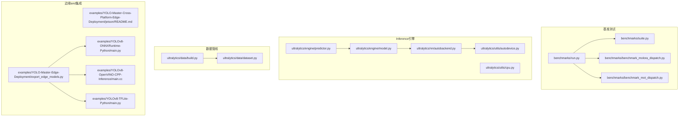
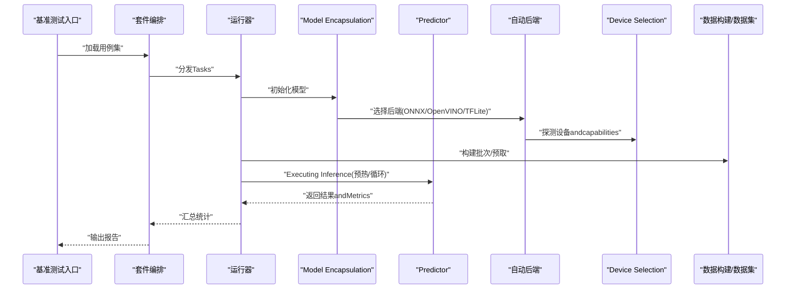
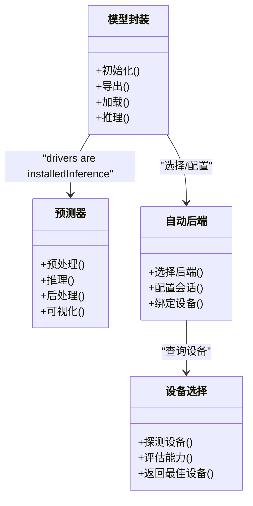
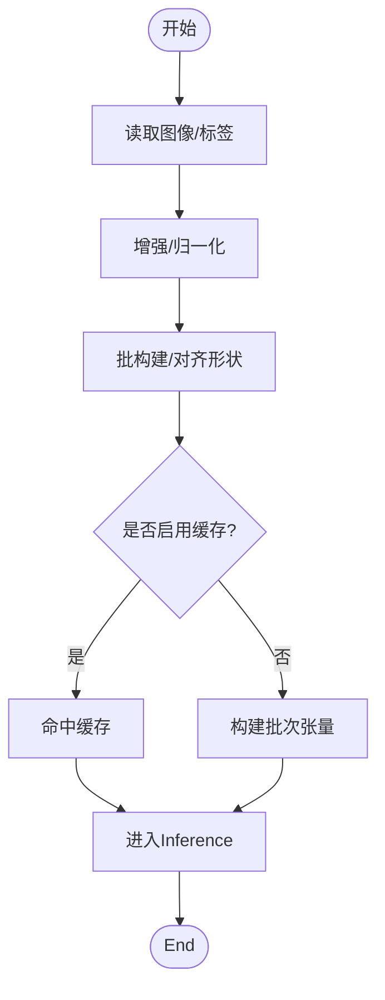
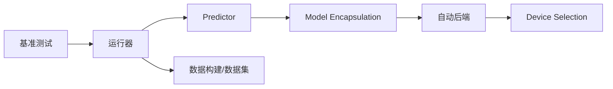

# 性能Optimizationand调优

<cite>
**Files Referenced in This Document**
- [benchmarks/run.py](file://benchmarks/run.py)
- [benchmarks/suite.py](file://benchmarks/suite.py)
- [benchmarks/benchmark_molora_dispatch.py](file://benchmarks/benchmark_molora_dispatch.py)
- [benchmarks/benchmark_mot_dispatch.py](file://benchmarks/benchmark_mot_dispatch.py)
- [ultralytics/utils/benchmarks.py](file://ultralytics/utils/benchmarks.py)
- [ultralytics/engine/predictor.py](file://ultralytics/engine/predictor.py)
- [ultralytics/engine/model.py](file://ultralytics/engine/model.py)
- [ultralytics/nn/autobackend.py](file://ultralytics/nn/autobackend.py)
- [ultralytics/utils/autodevice.py](file://ultralytics/utils/autodevice.py)
- [ultralytics/utils/cpu.py](file://ultralytics/utils/cpu.py)
- [ultralytics/data/build.py](file://ultralytics/data/build.py)
- [ultralytics/data/dataset.py](file://ultralytics/data/dataset.py)
- [examples/YOLO-Master-Cross-Platform-Edge-Deployment/jetson/README.md](file://examples/YOLO-Master-Cross-Platform-Edge-Deployment/jetson/README.md)
- [examples/YOLO-Master-Edge-Deployment/export_edge_models.py](file://examples/YOLO-Master-Edge-Deployment/export_edge_models.py)
- [examples/YOLOv8-ONNXRuntime-Python/main.py](file://examples/YOLOv8-ONNXRuntime-Python/main.py)
- [examples/YOLOv8-OpenVINO-CPP-Inference/main.cc](file://examples/YOLOv8-OpenVINO-CPP-Inference/main.cc)
- [examples/YOLOv8-TFLite-Python/main.py](file://examples/YOLOv8-TFLite-Python/main.py)
- [docs/en/guides/yolo-thread-safe-inference.md](file://docs/en/guides/yolo-thread-safe-inference.md)
- [docs/en/guides/nvidia-jetson.md](file://docs/en/guides/nvidia-jetson.md)
- [docs/en/guides/raspberry-pi.md](file://docs/en/guides/raspberry-pi.md)
- [docs/en/integrations/openvino.md](file://docs/en/integrations/openvino.md)
- [docs/en/integrations/tflite.md](file://docs/en/integrations/tflite.md)
- [docs/en/modes/benchmark.md](file://docs/en/modes/benchmark.md)
</cite>

## Table of Contents
1. [Introduction](#Introduction)
2. [Project Structure](#Project Structure)
3. [Core Components](#Core Components)
4. [Architecture Overview](#Architecture Overview)
5. [Detailed Component Analysis](#Detailed Component Analysis)
6. [Dependency Analysis](#Dependency Analysis)
7. [性能考量](#性能考量)
8. [Troubleshooting Guide](#Troubleshooting Guide)
9. [Conclusion](#Conclusion)
10. [Appendix](#Appendix)

## Introduction
本指南targetingARM平台（含Jetson、树莓派etc.）的YOLOInferenceandTraining工作负载，聚焦Centered on下目标：
- 内存UsesOptimization：内存池管理、缓存友好访问、垃圾回收调优
- 多线程and并行：线程亲和性、NUMA感知调度、批处理and流水线
- CPUand功耗：频率调节、动态电压调整、热控制策略
- 实时Inferencebottlenecks分析and调优：端to端延迟and吞吐平衡
- 不同工作负载下的特征and针对性Optimization
- 完整的性能监控and基准测试工具链

## Project Structure
仓库中andARM性能Optimization相关的代码andDocumentation主要分布whilesuch as下位置：
- 基准Test Suiteand运行器：benchmarks/*
- 运行时InferenceandDevice Selection：ultralytics/engine/*, ultralytics/utils/*
- Data Loadingand预处理：ultralytics/data/*
- Edge DeploymentExamplesand集成Documentation：examples/*, docs/en/integrations/*, docs/en/guides/*

Figure Source
- [benchmarks/run.py](file://benchmarks/run.py)
- [benchmarks/suite.py](file://benchmarks/suite.py)
- [benchmarks/benchmark_molora_dispatch.py](file://benchmarks/benchmark_molora_dispatch.py)
- [benchmarks/benchmark_mot_dispatch.py](file://benchmarks/benchmark_mot_dispatch.py)
- [ultralytics/engine/predictor.py](file://ultralytics/engine/predictor.py)
- [ultralytics/engine/model.py](file://ultralytics/engine/model.py)
- [ultralytics/nn/autobackend.py](file://ultralytics/nn/autobackend.py)
- [ultralytics/utils/autodevice.py](file://ultralytics/utils/autodedevice.py)
- [ultralytics/utils/cpu.py](file://ultralytics/utils/cpu.py)
- [ultralytics/data/build.py](file://ultralytics/data/build.py)
- [ultralytics/data/dataset.py](file://ultralytics/data/dataset.py)
- [examples/YOLO-Master-Cross-Platform-Edge-Deployment/jetson/README.md](file://examples/YOLO-Master-Cross-Platform-Edge-Deployment/jetson/README.md)
- [examples/YOLO-Master-Edge-Deployment/export_edge_models.py](file://examples/YOLO-Master-Edge-Deployment/export_edge_models.py)
- [examples/YOLOv8-ONNXRuntime-Python/main.py](file://examples/YOLOv8-ONNXRuntime-Python/main.py)
- [examples/YOLOv8-OpenVINO-CPP-Inference/main.cc](file://examples/YOLOv8-OpenVINO-CPP-Inference/main.cc)
- [examples/YOLOv8-TFLite-Python/main.py](file://examples/YOLOv8-TFLite-Python/main.py)

Section Source
- [benchmarks/run.py](file://benchmarks/run.py)
- [benchmarks/suite.py](file://benchmarks/suite.py)
- [ultralytics/engine/predictor.py](file://ultralytics/engine/predictor.py)
- [ultralytics/engine/model.py](file://ultralytics/engine/model.py)
- [ultralytics/nn/autobackend.py](file://ultralytics/nn/autobackend.py)
- [ultralytics/utils/autodevice.py](file://ultralytics/utils/autodevice.py)
- [ultralytics/utils/cpu.py](file://ultralytics/utils/cpu.py)
- [ultralytics/data/build.py](file://ultralytics/data/build.py)
- [ultralytics/data/dataset.py](file://ultralytics/data/dataset.py)
- [examples/YOLO-Master-Cross-Platform-Edge-Deployment/jetson/README.md](file://examples/YOLO-Master-Cross-Platform-Edge-Deployment/jetson/README.md)
- [examples/YOLO-Master-Edge-Deployment/export_edge_models.py](file://examples/YOLO-Master-Edge-Deployment/export_edge_models.py)
- [examples/YOLOv8-ONNXRuntime-Python/main.py](file://examples/YOLOv8-ONNXRuntime-Python/main.py)
- [examples/YOLOv8-OpenVINO-CPP-Inference/main.cc](file://examples/YOLOv8-OpenVINO-CPP-Inference/main.cc)
- [examples/YOLOv8-TFLite-Python/main.py](file://examples/YOLOv8-TFLite-Python/main.py)

## Core Components
- 基准测试运行器and套件
  - providesUnified entry pointand用例编排，Supporting多后端andTasks场景的对比评测。
- InferencePredictorandModel Encapsulation
  - 负责输入预处理、Inference执行、Post-Processingand结果聚合；and自动后端和Device Selection协同。
- 自动后端andDevice Selection
  - 根据环境自动选择最优Inference后端（such asONNX Runtime、OpenVINO、TFLiteetc.），并配置设备参数。
- 数据构建and数据集
  - 负责数据读取、增强、批构建and缓存，直接影响I/OandCPU占用。
- Edge Deploymentand集成Examples
  - providesJetson、ONNX、OpenVINO、TFLiteetc.平台的部署Refer toandExport脚本。

Section Source
- [benchmarks/run.py](file://benchmarks/run.py)
- [benchmarks/suite.py](file://benchmarks/suite.py)
- [ultralytics/engine/predictor.py](file://ultralytics/engine/predictor.py)
- [ultralytics/engine/model.py](file://ultralytics/engine/model.py)
- [ultralytics/nn/autobackend.py](file://ultralytics/nn/autobackend.py)
- [ultralytics/utils/autodevice.py](file://ultralytics/utils/autodevice.py)
- [ultralytics/data/build.py](file://ultralytics/data/build.py)
- [ultralytics/data/dataset.py](file://ultralytics/data/dataset.py)
- [examples/YOLO-Master-Edge-Deployment/export_edge_models.py](file://examples/YOLO-Master-Edge-Deployment/export_edge_models.py)

## Architecture Overview
下图展示从基准测试toInference执行的典型Calls路径，Centered onand关键Optimization点（Device Selection、后端绑定、数据管线）。

Figure Source
- [benchmarks/run.py](file://benchmarks/run.py)
- [benchmarks/suite.py](file://benchmarks/suite.py)
- [ultralytics/engine/predictor.py](file://ultralytics/engine/predictor.py)
- [ultralytics/engine/model.py](file://ultralytics/engine/model.py)
- [ultralytics/nn/autobackend.py](file://ultralytics/nn/autobackend.py)
- [ultralytics/utils/autodevice.py](file://ultralytics/utils/autodevice.py)
- [ultralytics/data/build.py](file://ultralytics/data/build.py)
- [ultralytics/data/dataset.py](file://ultralytics/data/dataset.py)

## Detailed Component Analysis

### 基准测试and性能度量
- 功能要点
  - Unified entry pointand用例定义，Supporting多Tasks、多后端、多设备的组合测试。
  - Built-in或扩展微基准（such asMOLoRA路由、MoT调度）Centered on定位热点。
- Optimization建议
  - 固定随机种子and预热轮次，避免冷启动偏差。
  - 分离I/Oand计算阶段，分别测量端to端and纯Inference延迟。
  - 对高频路径进行火焰图/采样分析，Combining后端Logging定位bottlenecks。

Section Source
- [benchmarks/run.py](file://benchmarks/run.py)
- [benchmarks/suite.py](file://benchmarks/suite.py)
- [benchmarks/benchmark_molora_dispatch.py](file://benchmarks/benchmark_molora_dispatch.py)
- [benchmarks/benchmark_mot_dispatch.py](file://benchmarks/benchmark_mot_dispatch.py)

### InferencePredictorandModel Encapsulation
- 功能要点
  - Predictor负责预处理、InferenceCalls、NMS/解码andVisualization；Model Encapsulation协调生命周期and资源。
- ARMOptimization要点
  - Set appropriately批大小and图像尺寸，避免峰值内存抖动。
  - Uses固定形状输入减少重编译and内存碎片。
  - whileARM上优先选择低开销后端（such asONNX Runtime ARM、OpenVINO NPU/ARM CPU）。

Figure Source
- [ultralytics/engine/model.py](file://ultralytics/engine/model.py)
- [ultralytics/engine/predictor.py](file://ultralytics/engine/predictor.py)
- [ultralytics/nn/autobackend.py](file://ultralytics/nn/autobackend.py)
- [ultralytics/utils/autodevice.py](file://ultralytics/utils/autodevice.py)

Section Source
- [ultralytics/engine/predictor.py](file://ultralytics/engine/predictor.py)
- [ultralytics/engine/model.py](file://ultralytics/engine/model.py)
- [ultralytics/nn/autobackend.py](file://ultralytics/nn/autobackend.py)
- [ultralytics/utils/autodevice.py](file://ultralytics/utils/autodevice.py)

### 数据构建and数据集
- 功能要点
  - Data Loading、增强、批构建、缓存and多进程读取。
- ARMOptimization要点
  - Uses内存映射and预取，降低磁盘I/O抖动。
  - 限制并发数Centered on避免抢占CPU核，影响实时性。
  - 将图像解码and预处理融合for单通道，减少中间对象创建。

Figure Source
- [ultralytics/data/build.py](file://ultralytics/data/build.py)
- [ultralytics/data/dataset.py](file://ultralytics/data/dataset.py)

Section Source
- [ultralytics/data/build.py](file://ultralytics/data/build.py)
- [ultralytics/data/dataset.py](file://ultralytics/data/dataset.py)

### Edge Deploymentand集成Examples
- JetsonandARM平台
  - Refer toJetsonDocumentationandExamples，Combining系统级电源管理andNPU加速。
- Exportand后端
  - ViaExport脚本生成ONNX/OpenVINO/TFLite模型，并while对应运行时中部署。
- 运行时Examples
  - Python/C++Examples展示such as何配置线程数、内存池and设备选项。

Section Source
- [examples/YOLO-Master-Cross-Platform-Edge-Deployment/jetson/README.md](file://examples/YOLO-Master-Cross-Platform-Edge-Deployment/jetson/README.md)
- [examples/YOLO-Master-Edge-Deployment/export_edge_models.py](file://examples/YOLO-Master-Edge-Deployment/export_edge_models.py)
- [examples/YOLOv8-ONNXRuntime-Python/main.py](file://examples/YOLOv8-ONNXRuntime-Python/main.py)
- [examples/YOLOv8-OpenVINO-CPP-Inference/main.cc](file://examples/YOLOv8-OpenVINO-CPP-Inference/main.cc)
- [examples/YOLOv8-TFLite-Python/main.py](file://examples/YOLOv8-TFLite-Python/main.py)

## Dependency Analysis
- 组件耦合
  - 基准测试依赖运行器and套件；运行器依赖Model EncapsulationandPredictor；Predictor依赖自动后端andDevice Selection；数据管线独立但影响整体吞吐。
- External Dependencies
  - ONNX Runtime、OpenVINO、TFLiteetc.后端库；系统级电源管理接口（such asJetson power mode）。
- 潜while环and风险
  - 避免whileData Loading路径中引入重型同步；确保后端初始化幂etc.，防止重复配置导致泄漏。

Figure Source
- [benchmarks/run.py](file://benchmarks/run.py)
- [benchmarks/suite.py](file://benchmarks/suite.py)
- [ultralytics/engine/predictor.py](file://ultralytics/engine/predictor.py)
- [ultralytics/engine/model.py](file://ultralytics/engine/model.py)
- [ultralytics/nn/autobackend.py](file://ultralytics/nn/autobackend.py)
- [ultralytics/utils/autodevice.py](file://ultralytics/utils/autodevice.py)
- [ultralytics/data/build.py](file://ultralytics/data/build.py)
- [ultralytics/data/dataset.py](file://ultralytics/data/dataset.py)

Section Source
- [benchmarks/run.py](file://benchmarks/run.py)
- [ultralytics/engine/predictor.py](file://ultralytics/engine/predictor.py)
- [ultralytics/nn/autobackend.py](file://ultralytics/nn/autobackend.py)
- [ultralytics/utils/autodevice.py](file://ultralytics/utils/autodevice.py)
- [ultralytics/data/build.py](file://ultralytics/data/build.py)

## 性能考量

### 内存UsesOptimization
- 内存池管理
  - 复用批次张量and中间缓冲区，避免频繁分配/释放。
  - while后端会话级别开启内存池（such asONNX Runtime、OpenVINO）。
- 缓存Optimization
  - 数据层启用缓存and预取；图像解码and预处理合并Centered on减少拷贝。
  - 固定输入形状，避免动态形状导致的重分配。
- 垃圾回收调优
  - whilePython侧减少临时对象创建；必要时手动触发GC或while长周期Tasks中周期性清理。
  - 关注大对象（such as批量图像、标注数组）的生命周期，and时释放引用。

Section Source
- [ultralytics/data/build.py](file://ultralytics/data/build.py)
- [ultralytics/data/dataset.py](file://ultralytics/data/dataset.py)
- [ultralytics/engine/predictor.py](file://ultralytics/engine/predictor.py)
- [ultralytics/nn/autobackend.py](file://ultralytics/nn/autobackend.py)

### 多线程and并行处理
- 线程亲和性andNUMA
  - 将Inference线程绑定to特定CPU核，减少跨NUMA节点访问带来的延迟。
  - whileARM big.LITTLE架构下，将热路径绑至高性能核。
- 批处理and流水线
  - 增大批大小提升吞吐，但需权衡延迟；采用滑动窗口或双缓冲流水线。
- 线程安全Inference
  - 遵循线程安全Inference指南，避免共享状态冲突；for每个请求维护独立上下文。

Section Source
- [ultralytics/utils/cpu.py](file://ultralytics/utils/cpu.py)
- [docs/en/guides/yolo-thread-safe-inference.md](file://docs/en/guides/yolo-thread-safe-inference.md)

### CPU亲和性andNUMA感知调度
- 亲和性设置
  - Uses系统API或运行时环境变量绑定线程to指定核；while多实例部署时隔离核域。
- NUMA感知
  - 将数据and计算尽量落while同一NUMA节点；避免跨节点内存访问。
- ARM特性
  - 利用big.LITTLE调度策略，将短延迟Tasks置于高能效核，长Tasks置于高性能核。

Section Source
- [ultralytics/utils/cpu.py](file://ultralytics/utils/cpu.py)
- [ultralytics/utils/autodevice.py](file://ultralytics/utils/autodevice.py)

### 功耗管理and热控制
- 频率调节andDVFS
  - while稳定负载下锁定合适频率，避免频繁升降频带来的抖动。
  - while温度阈值附近降频保稳态，保证实时性。
- Jetsonand树莓派
  - Uses平台工具设置电源模式（such asJetson power mode），并Combining风扇/散热策略。
- 监控and告警
  - 采集温度、功耗、频率曲线，建立告警阈值and回退策略。

Section Source
- [examples/YOLO-Master-Cross-Platform-Edge-Deployment/jetson/README.md](file://examples/YOLO-Master-Cross-Platform-Edge-Deployment/jetson/README.md)
- [docs/en/guides/nvidia-jetson.md](file://docs/en/guides/nvidia-jetson.md)
- [docs/en/guides/raspberry-pi.md](file://docs/en/guides/raspberry-pi.md)

### 实时Inferencebottlenecks分析and调优
- 端to端延迟分解
  - I/O（读图/解码）、预处理、Inference、Post-Processing（NMS/解码）、Visualization。
- 常见bottlenecks
  - 图像解码and缩放、动态形状重编译、NMSwhileCPU上的开销。
- 调优方法
  - 固定形状and半精度；UsesNPU/GPU加速；合并预处理；异步I/Oand预取。

Section Source
- [ultralytics/engine/predictor.py](file://ultralytics/engine/predictor.py)
- [ultralytics/nn/autobackend.py](file://ultralytics/nn/autobackend.py)
- [docs/en/modes/benchmark.md](file://docs/en/modes/benchmark.md)

### 不同工作负载的特征andOptimization
- 小图/低分辨率
  - 侧重低延迟，减小批大小，关闭昂贵增强。
- 大图/高分辨率
  - 分块Inference（SAHI）and并行解码；注意内存峰值。
- 视频流
  - 预取+双缓冲；帧丢弃策略and丢帧阈值。
- 多Tasks/多模型
  - 模型复用and权重共享；按场景路由专家（MoE/MoA）Centered on降低平均算力。

Section Source
- [benchmarks/benchmark_molora_dispatch.py](file://benchmarks/benchmark_molora_dispatch.py)
- [benchmarks/benchmark_mot_dispatch.py](file://benchmarks/benchmark_mot_dispatch.py)
- [docs/en/guides/sahi-tiled-inference.md](file://docs/en/guides/sahi-tiled-inference.md)

### 性能监控and基准测试工具链
- Benchmark Suite
  - UsesUnified entry pointand套件定义，覆盖多后端and多设备组合。
- Metrics采集
  - 记录P50/P95/P99延迟、吞吐、内存峰值、温度and功耗。
- 回归检测
  - 将关键Metrics纳入CI门禁，防止性能退化。

Section Source
- [benchmarks/run.py](file://benchmarks/run.py)
- [benchmarks/suite.py](file://benchmarks/suite.py)
- [docs/en/modes/benchmark.md](file://docs/en/modes/benchmark.md)

## Troubleshooting Guide
- 常见问题
  - 后端初始化失败：检查依赖库版本and设备权限。
  - 内存泄漏：定位未释放的大对象and重复会话创建。
  - 线程竞争：确认线程安全Inference实践and锁粒度。
- 诊断步骤
  - 分层计时（I/O、预处理、Inference、Post-Processing）。
  - 切换最小复现用例，逐步排除数据and模型因素。
  - Uses系统工具（perf、htop、nvidia-smi/jetson_clocks）交叉Validation。

Section Source
- [ultralytics/engine/predictor.py](file://ultralytics/engine/predictor.py)
- [ultralytics/nn/autobackend.py](file://ultralytics/nn/autobackend.py)
- [docs/en/guides/yolo-thread-safe-inference.md](file://docs/en/guides/yolo-thread-safe-inference.md)

## Conclusion
whileARM平台上implementing高性能and低功耗的平衡，需要贯穿“数据—Inference—后端—系统”的全链路Optimization。Via合理的内存池and缓存策略、严格的线程亲和andNUMA感知、稳定的功耗and热控方案，Centered onand完善的基准and监控体系，可Centered onwhile不同工作负载下获得可预期的低延迟and高吞吐表现。

## Appendix
- 快速上手
  - UsesBenchmark Suite快速Evaluation当前环境的端to端延迟and吞吐。
  - 基于Export脚本生成目标后端模型，并whileExamples工程中Validation。
- Refer toDocumentation
  - 线程安全Inference、Jetsonand树莓派指南、各后端集成说明。

Section Source
- [benchmarks/run.py](file://benchmarks/run.py)
- [examples/YOLO-Master-Edge-Deployment/export_edge_models.py](file://examples/YOLO-Master-Edge-Deployment/export_edge_models.py)
- [docs/en/guides/yolo-thread-safe-inference.md](file://docs/en/guides/yolo-thread-safe-inference.md)
- [docs/en/guides/nvidia-jetson.md](file://docs/en/guides/nvidia-jetson.md)
- [docs/en/guides/raspberry-pi.md](file://docs/en/guides/raspberry-pi.md)
- [docs/en/integrations/openvino.md](file://docs/en/integrations/openvino.md)
- [docs/en/integrations/tflite.md](file://docs/en/integrations/tflite.md)