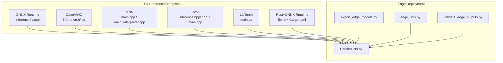
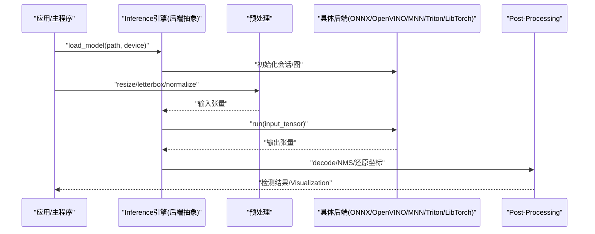
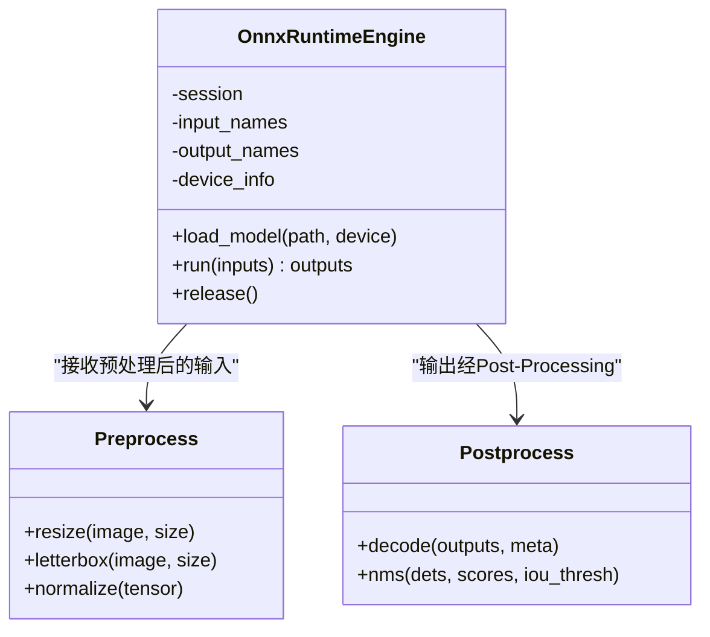
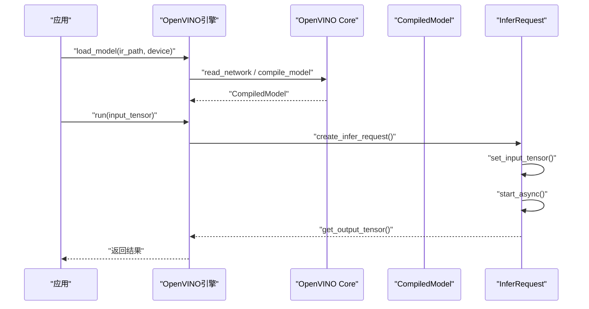
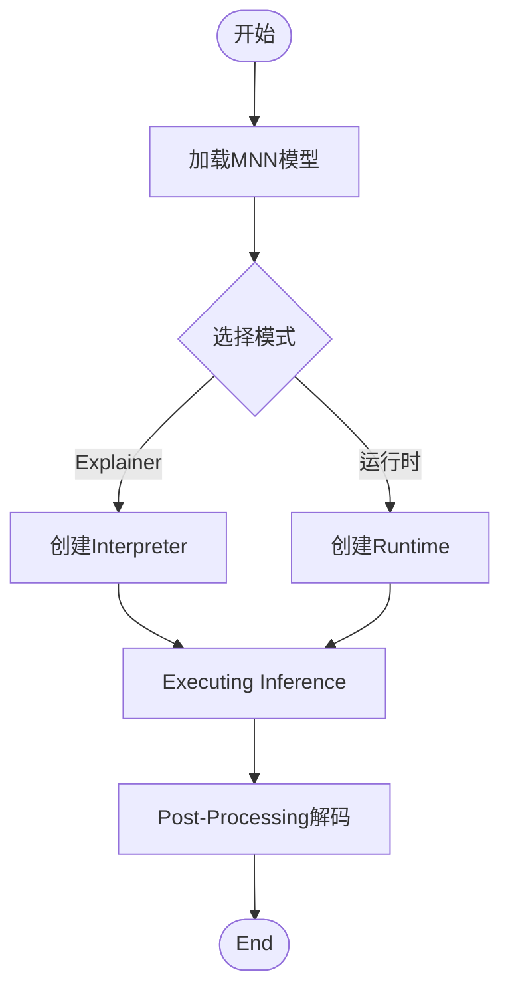
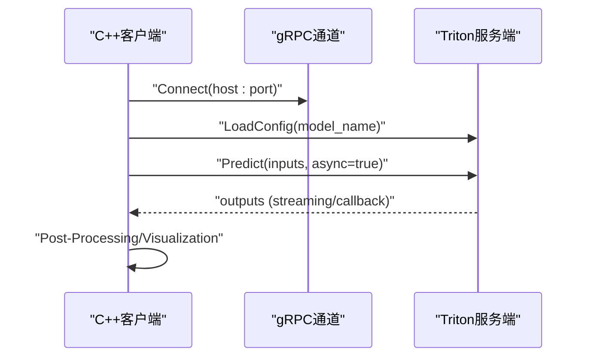
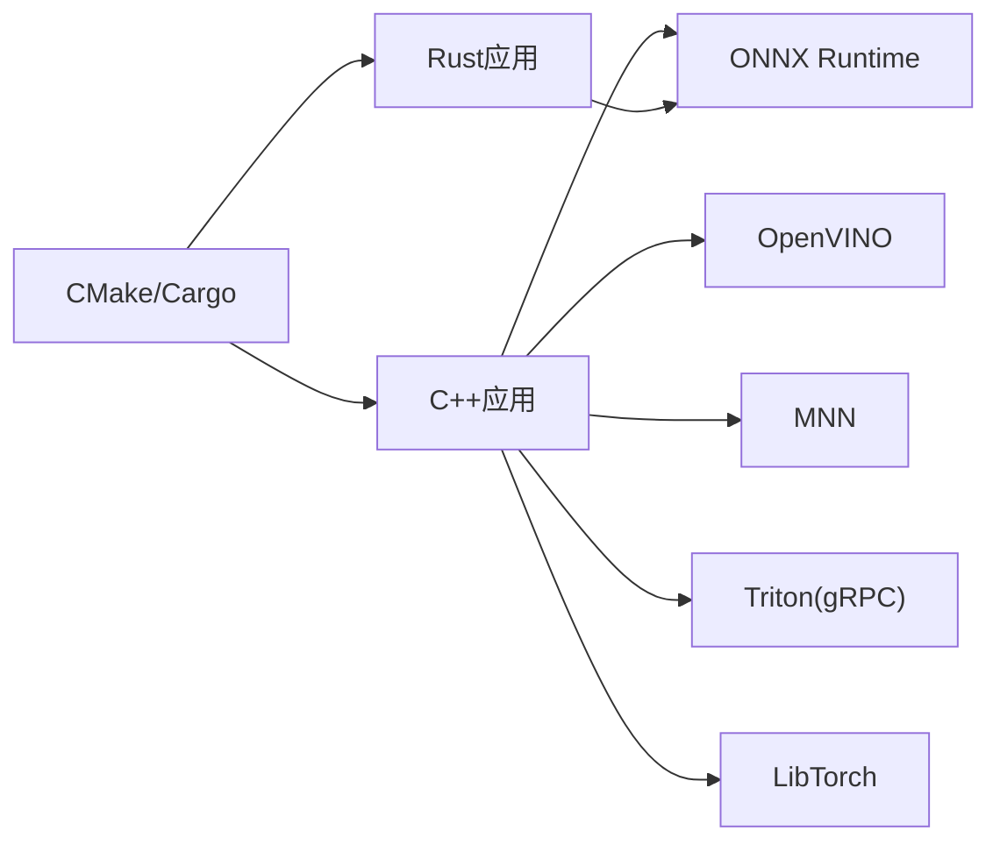

# C++Inference引擎

<cite>
**Files Referenced in This Document**
- [examples/cpp/README.md](file://examples/cpp/README.md)
- [examples/YOLOv8-ONNXRuntime-CPP/inference.h](file://examples/YOLOv8-ONNXRuntime-CPP/inference.h)
- [examples/YOLOv8-ONNXRuntime-CPP/inference.cpp](file://examples/YOLOv8-ONNXRuntime-CPP/inference.cpp)
- [examples/YOLOv8-ONNXRuntime-CPP/main.cpp](file://examples/YOLOv8-ONNXRuntime-CPP/main.cpp)
- [examples/YOLOv8-OpenVINO-CPP-Inference/inference.h](file://examples/YOLOv8-OpenVINO-CPP-Inference/inference.h)
- [examples/YOLOv8-OpenVINO-CPP-Inference/inference.cc](file://examples/YOLOv8-OpenVINO-CPP-Inference/inference.cc)
- [examples/YOLOv8-OpenVINO-CPP-Inference/main.cc](file://examples/YOLOv8-OpenVINO-CPP-Inference/main.cc)
- [examples/YOLOv8-MNN-CPP/main.cpp](file://examples/YOLOv8-MNN-CPP/main.cpp)
- [examples/YOLOv8-MNN-CPP/main_interpreter.cpp](file://examples/YOLOv8-MNN-CPP/main_interpreter.cpp)
- [examples/YOLO11-Triton-CPP/inference.hpp](file://examples/YOLO11-Triton-CPP/inference.hpp)
- [examples/YOLO11-Triton-CPP/inference.cpp](file://examples/YOLO11-Triton-CPP/inference.cpp)
- [examples/YOLO11-Triton-CPP/main.cpp](file://examples/YOLO11-Triton-CPP/main.cpp)
- [examples/YOLOv8-CPP-Inference/inference.h](file://examples/YOLOv8-CPP-Inference/inference.h)
- [examples/YOLOv8-CPP-Inference/inference.cpp](file://examples/YOLOv8-CPP-Inference/inference.cpp)
- [examples/YOLOv8-CPP-Inference/main.cpp](file://examples/YOLOv8-CPP-Inference/main.cpp)
- [examples/YOLOv8-LibTorch-CPP-Inference/main.cc](file://examples/YOLOv8-LibTorch-CPP-Inference/main.cc)
- [examples/YOLO-Series-ONNXRuntime-Rust/src/lib.rs](file://examples/YOLO-Series-ONNXRuntime-Rust/src/lib.rs)
- [examples/YOLO-Series-ONNXRuntime-Rust/Cargo.toml](file://examples/YOLO-Series-ONNXRuntime-Rust/Cargo.toml)
- [examples/YOLO-Master-Cross-Platform-Edge-Deployment/TECHNICAL_REPORT.md](file://examples/YOLO-Master-Cross-Platform-Edge-Deployment/TECHNICAL_REPORT.md)
- [examples/YOLO-Master-Cross-Platform-Edge-Deployment/README.md](file://examples/YOLO-Master-Cross-Platform-Edge-Deployment/README.md)
- [examples/YOLO-Master-Edge-Deployment/CMakeLists.txt](file://examples/YOLO-Master-Edge-Deployment/CMakeLists.txt)
- [examples/YOLO-Master-Edge-Deployment/edge_utils.py](file://examples/YOLO-Master-Edge-Deployment/edge_utils.py)
- [examples/YOLO-Master-Edge-Deployment/export_edge_models.py](file://examples/YOLO-Master-Edge-Deployment/export_edge_models.py)
- [examples/YOLO-Master-Edge-Deployment/validate_edge_outputs.py](file://examples/YOLO-Master-Edge-Deployment/validate_edge_outputs.py)
- [ultralytics/engine/predictor.py](file://ultralytics/engine/predictor.py)
- [ultralytics/utils/export.py](file://ultralytics/utils/export.py)
- [ultralytics/utils/checks.py](file://ultralytics/utils/checks.py)
- [ultralytics/utils/benchmarks.py](file://ultralytics/utils/benchmarks.py)
</cite>

## Table of Contents
1. [Introduction](#Introduction)
2. [Project Structure](#Project Structure)
3. [Core Components](#Core Components)
4. [Architecture Overview](#Architecture Overview)
5. [Detailed Component Analysis](#Detailed Component Analysis)
6. [Dependency Analysis](#Dependency Analysis)
7. [Performance Considerations](#Performance Considerations)
8. [Troubleshooting Guide](#Troubleshooting Guide)
9. [Conclusion](#Conclusion)
10. [Appendix](#Appendix)

## Introduction
本技术Documentation聚焦于YOLO-Master的C++Inference引擎，围绕后端抽象层、模型加载机制and内存管理策略unfold，系统梳理ONNX Runtime、TensorRT、OpenVINO、NCNN、MNNetc.后端的集成方式and性能特点。同时覆盖预处理/Post-Processing（图像缩放、归一化、结果解码）、批处理and异步Inference的implementing要点，并provides构建系统说明（CMake配置、依赖管理and跨平台编译选项）Centered onand性能Optimizationand内存Uses最佳实践。

## Project Structure
仓库中C++Inference相关代码主要分布whileexamplesTable of Contents下，按后端或Tasks组织：
- ONNX Runtime C++Examples：包含InferenceEncapsulatesand主程序入口
- OpenVINO C++Examples：包含InferenceEncapsulatesand主程序入口
- MNN C++Examples：providesExplainerand运行时两种模式
- Triton C++Examples：基于gRPC客户端Calls远程服务
- LibTorch C++Examples：直接加载PyTorchExport模型
- Rust绑定Examples：ViaFFICallsONNX Runtime
- Edge DeploymentExamples：包含CMake构建脚本andPython辅助工具链

Figure Source
- [examples/YOLOv8-ONNXRuntime-CPP/inference.h](file://examples/YOLOv8-ONNXRuntime-CPP/inference.h)
- [examples/YOLOv8-ONNXRuntime-CPP/inference.cpp](file://examples/YOLOv8-ONNXRuntime-CPP/inference.cpp)
- [examples/YOLOv8-OpenVINO-CPP-Inference/inference.h](file://examples/YOLOv8-OpenVINO-CPP-Inference/inference.h)
- [examples/YOLOv8-OpenVINO-CPP-Inference/inference.cc](file://examples/YOLOv8-OpenVINO-CPP-Inference/inference.cc)
- [examples/YOLOv8-MNN-CPP/main.cpp](file://examples/YOLOv8-MNN-CPP/main.cpp)
- [examples/YOLOv8-MNN-CPP/main_interpreter.cpp](file://examples/YOLOv8-MNN-CPP/main_interpreter.cpp)
- [examples/YOLO11-Triton-CPP/inference.hpp](file://examples/YOLO11-Triton-CPP/inference.hpp)
- [examples/YOLO11-Triton-CPP/inference.cpp](file://examples/YOLO11-Triton-CPP/inference.cpp)
- [examples/YOLO11-Triton-CPP/main.cpp](file://examples/YOLO11-Triton-CPP/main.cpp)
- [examples/YOLOv8-LibTorch-CPP-Inference/main.cc](file://examples/YOLOv8-LibTorch-CPP-Inference/main.cc)
- [examples/YOLO-Series-ONNXRuntime-Rust/src/lib.rs](file://examples/YOLO-Series-ONNXRuntime-Rust/src/lib.rs)
- [examples/YOLO-Series-ONNXRuntime-Rust/Cargo.toml](file://examples/YOLO-Series-ONNXRuntime-Rust/Cargo.toml)
- [examples/YOLO-Master-Edge-Deployment/CMakeLists.txt](file://examples/YOLO-Master-Edge-Deployment/CMakeLists.txt)
- [examples/YOLO-Master-Edge-Deployment/export_edge_models.py](file://examples/YOLO-Master-Edge-Deployment/export_edge_models.py)
- [examples/YOLO-Master-Edge-Deployment/edge_utils.py](file://examples/YOLO-Master-Edge-Deployment/edge_utils.py)
- [examples/YOLO-Master-Edge-Deployment/validate_edge_outputs.py](file://examples/YOLO-Master-Edge-Deployment/validate_edge_outputs.py)

Section Source
- [examples/cpp/README.md](file://examples/cpp/README.md)
- [examples/YOLO-Master-Cross-Platform-Edge-Deployment/TECHNICAL_REPORT.md](file://examples/YOLO-Master-Cross-Platform-Edge-Deployment/TECHNICAL_REPORT.md)
- [examples/YOLO-Master-Cross-Platform-Edge-Deployment/README.md](file://examples/YOLO-Master-Cross-Platform-Edge-Deployment/README.md)

## Core Components
- 后端抽象层
  - 目标：统一不同Inference引擎的接口，屏蔽ONNX Runtime、OpenVINO、MNN、Triton、LibTorchetc.差异，provides一致的加载、预热、Inference、释放API。
  - 关键职责：模型路径解析、输入张量分配、输出张量收集、Device Selection、线程/并发控制、错误码映射。
- 模型加载机制
  - Supporting多格式：ONNX、OpenVINO IR、MNN、Triton模型仓库、LibTorch脚本Modules。
  - 生命周期：初始化会话/图、分配工作区、Optional权重/缓存加载、资源清理。
- 内存管理策略
  - 输入/输出缓冲区复用、避免频繁分配；必要时Uses对象池或预分配固定大小缓冲。
  - 设备一致性：确保CPU/GPU间数据拷贝最小化，必要时Uses零拷贝或共享内存。
- 预处理andPost-Processing
  - 预处理：Resize、Letterbox填充、归一化（such as除Centered on255或标准化均值方差）、通道顺序转换（HWC->CHW）。
  - Post-Processing：Confidence Threshold过滤、类别映射、坐标还原（反缩放/去填充）、NMS/Soft-NMS、掩码/关键点解码（若for分割/姿态Tasks）。
- 批处理and异步Inference
  - 批处理：将多帧合并forbatch维度，减少内核启动开销；注意动态shapeand静态shape的差异。
  - 异步：利用各后端provides的异步API（such asONNX Runtime Session.run异步、OpenVINO AsyncInferQueue、Triton gRPC异步），Combining回调或Future/Promise进行结果聚合。

Section Source
- [examples/YOLOv8-ONNXRuntime-CPP/inference.h](file://examples/YOLOv8-ONNXRuntime-CPP/inference.h)
- [examples/YOLOv8-ONNXRuntime-CPP/inference.cpp](file://examples/YOLOv8-ONNXRuntime-CPP/inference.cpp)
- [examples/YOLOv8-OpenVINO-CPP-Inference/inference.h](file://examples/YOLOv8-OpenVINO-CPP-Inference/inference.h)
- [examples/YOLOv8-OpenVINO-CPP-Inference/inference.cc](file://examples/YOLOv8-OpenVINO-CPP-Inference/inference.cc)
- [examples/YOLOv8-MNN-CPP/main.cpp](file://examples/YOLOv8-MNN-CPP/main.cpp)
- [examples/YOLOv8-MNN-CPP/main_interpreter.cpp](file://examples/YOLOv8-MNN-CPP/main_interpreter.cpp)
- [examples/YOLO11-Triton-CPP/inference.hpp](file://examples/YOLO11-Triton-CPP/inference.hpp)
- [examples/YOLO11-Triton-CPP/inference.cpp](file://examples/YOLO11-Triton-CPP/inference.cpp)
- [examples/YOLOv8-LibTorch-CPP-Inference/main.cc](file://examples/YOLOv8-LibTorch-CPP-Inference/main.cc)

## Architecture Overview
下图展示从应用to具体后端的典型Calls链路，涵盖预处理、Inference、Post-ProcessingandVisualization/保存流程。

Figure Source
- [examples/YOLOv8-ONNXRuntime-CPP/main.cpp](file://examples/YOLOv8-ONNXRuntime-CPP/main.cpp)
- [examples/YOLOv8-ONNXRuntime-CPP/inference.cpp](file://examples/YOLOv8-ONNXRuntime-CPP/inference.cpp)
- [examples/YOLOv8-OpenVINO-CPP-Inference/main.cc](file://examples/YOLOv8-OpenVINO-CPP-Inference/main.cc)
- [examples/YOLOv8-OpenVINO-CPP-Inference/inference.cc](file://examples/YOLOv8-OpenVINO-CPP-Inference/inference.cc)
- [examples/YOLO11-Triton-CPP/main.cpp](file://examples/YOLO11-Triton-CPP/main.cpp)
- [examples/YOLO11-Triton-CPP/inference.cpp](file://examples/YOLO11-Triton-CPP/inference.cpp)
- [examples/YOLOv8-LibTorch-CPP-Inference/main.cc](file://examples/YOLOv8-LibTorch-CPP-Inference/main.cc)

## Detailed Component Analysis

### ONNX Runtime C++后端
- 接口设计
  - provides统一的加载、Inference、释放方法；内部维护Session、输入/输出名称映射、设备信息。
- 模型加载
  - 解析ONNX路径，创建执行环境，设置运行选项（such as线程数、内存池、GPU设备）。
- 预处理/Post-Processing
  - 预处理通常while应用侧完成，将图像转forNHWC或NCHW格式并归一化；Post-Processing负责阈值过滤、NMSand坐标还原。
- 批处理and异步
  - Supporting批量输入；可CombiningONNX Runtime的异步API提升吞吐。

Figure Source
- [examples/YOLOv8-ONNXRuntime-CPP/inference.h](file://examples/YOLOv8-ONNXRuntime-CPP/inference.h)
- [examples/YOLOv8-ONNXRuntime-CPP/inference.cpp](file://examples/YOLOv8-ONNXRuntime-CPP/inference.cpp)
- [examples/YOLOv8-ONNXRuntime-CPP/main.cpp](file://examples/YOLOv8-ONNXRuntime-CPP/main.cpp)

Section Source
- [examples/YOLOv8-ONNXRuntime-CPP/inference.h](file://examples/YOLOv8-ONNXRuntime-CPP/inference.h)
- [examples/YOLOv8-ONNXRuntime-CPP/inference.cpp](file://examples/YOLOv8-ONNXRuntime-CPP/inference.cpp)
- [examples/YOLOv8-ONNXRuntime-CPP/main.cpp](file://examples/YOLOv8-ONNXRuntime-CPP/main.cpp)

### OpenVINO C++后端
- 接口设计
  - EncapsulatesCore、CompiledModel、InferRequest；providesandONNX类似的统一API。
- 模型加载
  - SupportingIR模型或直接从ONNX转换；可指定设备（CPU/GPU/iGPU/VPU）。
- 预处理/Post-Processing
  - andONNX类似，但需注意OpenVINO的数据布局and精度要求。
- 批处理and异步
  - UsesAsyncInferQueueimplementing高并发；适合流水线场景。

Figure Source
- [examples/YOLOv8-OpenVINO-CPP-Inference/inference.h](file://examples/YOLOv8-OpenVINO-CPP-Inference/inference.h)
- [examples/YOLOv8-OpenVINO-CPP-Inference/inference.cc](file://examples/YOLOv8-OpenVINO-CPP-Inference/inference.cc)
- [examples/YOLOv8-OpenVINO-CPP-Inference/main.cc](file://examples/YOLOv8-OpenVINO-CPP-Inference/main.cc)

Section Source
- [examples/YOLOv8-OpenVINO-CPP-Inference/inference.h](file://examples/YOLOv8-OpenVINO-CPP-Inference/inference.h)
- [examples/YOLOv8-OpenVINO-CPP-Inference/inference.cc](file://examples/YOLOv8-OpenVINO-CPP-Inference/inference.cc)
- [examples/YOLOv8-OpenVINO-CPP-Inference/main.cc](file://examples/YOLOv8-OpenVINO-CPP-Inference/main.cc)

### MNN C++后端
- 接口设计
  - providesExplainerand运行时两种模式；Explainer便于调试，运行时更高效。
- 模型加载
  - SupportingMNN模型文件；需指定输入/输出名and形状。
- 预处理/Post-Processing
  - and通用流程一致，注意MNN的数据类型and布局。
- 批处理and异步
  - 可Via多线程或多进程并行；MNN本身对移动端友好。

Figure Source
- [examples/YOLOv8-MNN-CPP/main.cpp](file://examples/YOLOv8-MNN-CPP/main.cpp)
- [examples/YOLOv8-MNN-CPP/main_interpreter.cpp](file://examples/YOLOv8-MNN-CPP/main_interpreter.cpp)

Section Source
- [examples/YOLOv8-MNN-CPP/main.cpp](file://examples/YOLOv8-MNN-CPP/main.cpp)
- [examples/YOLOv8-MNN-CPP/main_interpreter.cpp](file://examples/YOLOv8-MNN-CPP/main_interpreter.cpp)

### Triton C++后端
- 接口设计
  - 基于gRPC客户端，and服务端模型仓库交互；无需本地Load model。
- 模型加载
  - 由服务端管理；客户端仅需知道模型名、版本and输入输出签名。
- 预处理/Post-Processing
  - 客户端负责序列化输入（such asJSON/Protobuf），服务端可能Built-in预处理；Post-Processingwhile客户端完成。
- 批处理and异步
  - 天然Supporting批处理；gRPC异步Calls提升吞吐。

Figure Source
- [examples/YOLO11-Triton-CPP/inference.hpp](file://examples/YOLO11-Triton-CPP/inference.hpp)
- [examples/YOLO11-Triton-CPP/inference.cpp](file://examples/YOLO11-Triton-CPP/inference.cpp)
- [examples/YOLO11-Triton-CPP/main.cpp](file://examples/YOLO11-Triton-CPP/main.cpp)

Section Source
- [examples/YOLO11-Triton-CPP/inference.hpp](file://examples/YOLO11-Triton-CPP/inference.hpp)
- [examples/YOLO11-Triton-CPP/inference.cpp](file://examples/YOLO11-Triton-CPP/inference.cpp)
- [examples/YOLO11-Triton-CPP/main.cpp](file://examples/YOLO11-Triton-CPP/main.cpp)

### LibTorch C++后端
- 接口设计
  - 直接加载PyTorch脚本Modules；适用于需要保留PyTorch生态特性的场景。
- 模型加载
  - Usestorch::jit::load；注意设备and数据类型匹配。
- 预处理/Post-Processing
  - 可whileC++中Usestorchvision或自定义算子；Post-Processing通常用原生C++implementing。
- 批处理and异步
  - 批处理Via扩展batch维度；异步可用std::async或线程池。

Section Source
- [examples/YOLOv8-LibTorch-CPP-Inference/main.cc](file://examples/YOLOv8-LibTorch-CPP-Inference/main.cc)

### Rust+ONNX Runtime绑定
- 接口设计
  - ViaFFI暴露C API供RustCalls；保持andC++一致的Inference流程。
- 模型加载
  - whileRust侧EncapsulatesONNX Runtime C API；简化内存管理。
- 构建and依赖
  - UsesCargo管理依赖；链接ONNX Runtime库。

Section Source
- [examples/YOLO-Series-ONNXRuntime-Rust/src/lib.rs](file://examples/YOLO-Series-ONNXRuntime-Rust/src/lib.rs)
- [examples/YOLO-Series-ONNXRuntime-Rust/Cargo.toml](file://examples/YOLO-Series-ONNXRuntime-Rust/Cargo.toml)

### NCNN后端（概念性说明）
- 集成方式
  - Refer to现有ONNX/MNNExamples的结构，EncapsulatesNCNN的Net、Extractor接口；provides统一加载andInferenceAPI。
- 性能特点
  - 针对移动端Optimization，低延迟、小内存占用；适合ARM平台。
- 注意事项
  - 需确保模型算子兼容；预处理andPost-Processing逻辑and其他后端保持一致。

[本节for概念性说明，不直接分析具体文件]

### TensorRT后端（概念性说明）
- 集成方式
  - EncapsulatesBuilder/Engine/Context；SupportingFP16/INT8量化and插件扩展。
- 性能特点
  - GPU上极高吞吐；需离线构建engine文件。
- 注意事项
  - 动态shapeand输入尺寸限制；需严格对齐预处理布局。

[本节for概念性说明，不直接分析具体文件]

## Dependency Analysis
- External Dependencies
  - ONNX Runtime：跨平台Inference引擎，SupportingCPU/GPU。
  - OpenVINO：Intel生态Optimization，Supporting多种设备。
  - MNN：阿里开源，targeting移动端and嵌入式。
  - Triton：NVIDIAInference服务，适合服务端部署。
  - LibTorch：PyTorch C++前端，便于MigrationTraining模型。
  - Rust+ONNX Runtime：ViaFFI桥接，便于Rust生态集成。
- 构建系统
  - CMake用于C++工程构建；Python脚本用于Model ExportandValidation。
  - Cargo用于Rust工程构建and依赖管理。

Figure Source
- [examples/YOLO-Master-Edge-Deployment/CMakeLists.txt](file://examples/YOLO-Master-Edge-Deployment/CMakeLists.txt)
- [examples/YOLO-Series-ONNXRuntime-Rust/Cargo.toml](file://examples/YOLO-Series-ONNXRuntime-Rust/Cargo.toml)

Section Source
- [examples/YOLO-Master-Edge-Deployment/CMakeLists.txt](file://examples/YOLO-Master-Edge-Deployment/CMakeLists.txt)
- [examples/YOLO-Series-ONNXRuntime-Rust/Cargo.toml](file://examples/YOLO-Series-ONNXRuntime-Rust/Cargo.toml)

## Performance Considerations
- 预处理Optimization
  - 尽量whileGPU上进行Resizeand归一化，减少CPU-GPU拷贝；UsesSIMD指令加速图像处理。
- 批处理策略
  - 根据设备capabilities调整batch size；动态shape模型需权衡灵活性and时延。
- 异步流水线
  - 采用生产者-消费者模型，预处理、Inference、Post-Processing并行；OpenVINO AsyncInferQueueandTriton异步Calls尤for适用。
- 内存复用
  - 预分配输入/输出缓冲；避免while热路径中进行new/delete。
- 量化and精度
  - whileTensorRT/MNN中启用FP16/INT8；注意校准数据集质量and精度回退策略。
- 线程and并发
  - Set appropriately线程数；避免过度并发导致上下文切换开销。

[本节provides一般性指导，不直接分析具体文件]

## Troubleshooting Guide
- 模型加载失败
  - 检查路径权限and格式；确认后端是否Supporting该模型。
- 输入形状不匹配
  - 核对预处理输出的尺寸and模型期望；动态shape需传入正确元数据。
- 设备不可用
  - 确认drivers are installedand运行时版本；检查CUDA/OpenVINO设备枚举。
- 性能不达预期
  - Uses基准工具Evaluation各阶段耗时；调整batch sizeand线程数。
- 内存泄漏
  - 确保释放会话and缓冲；Uses工具检测未释放资源。

Section Source
- [ultralytics/utils/checks.py](file://ultralytics/utils/checks.py)
- [ultralytics/utils/benchmarks.py](file://ultralytics/utils/benchmarks.py)

## Conclusion
YOLO-Master的C++Inference引擎Via统一抽象层整合多后端，provides一致的加载、Inferenceand资源管理接口。Combining高效的预处理/Post-Processing、批处理and异步机制，可while不同平台上implementing高性能Inference。建议while生产环境中优先选择and硬件最匹配的后端，并Via量化and流水线Optimization进一步提升吞吐and降低时延。

## Appendix
- 构建系统说明
  - CMakeLists.txt定义目标、依赖and编译选项；Python脚本用于Model ExportandValidation。
  - Rust工程ViaCargo管理依赖，链接ONNX Runtime库。
- Edge Deployment流程
  - UsesPython工具Export边缘模型，C++工程加载并Inference，Validation脚本保证输出一致性。

Section Source
- [examples/YOLO-Master-Edge-Deployment/CMakeLists.txt](file://examples/YOLO-Master-Edge-Deployment/CMakeLists.txt)
- [examples/YOLO-Master-Edge-Deployment/export_edge_models.py](file://examples/YOLO-Master-Edge-Deployment/export_edge_models.py)
- [examples/YOLO-Master-Edge-Deployment/edge_utils.py](file://examples/YOLO-Master-Edge-Deployment/edge_utils.py)
- [examples/YOLO-Master-Edge-Deployment/validate_edge_outputs.py](file://examples/YOLO-Master-Edge-Deployment/validate_edge_outputs.py)
- [examples/YOLO-Master-Cross-Platform-Edge-Deployment/TECHNICAL_REPORT.md](file://examples/YOLO-Master-Cross-Platform-Edge-Deployment/TECHNICAL_REPORT.md)
- [examples/YOLO-Master-Cross-Platform-Edge-Deployment/README.md](file://examples/YOLO-Master-Cross-Platform-Edge-Deployment/README.md)