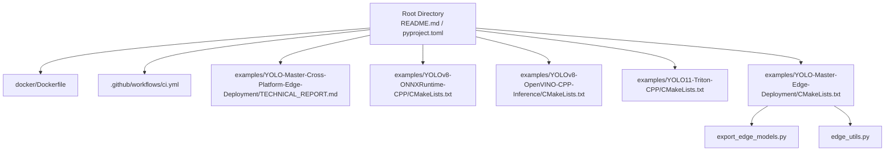
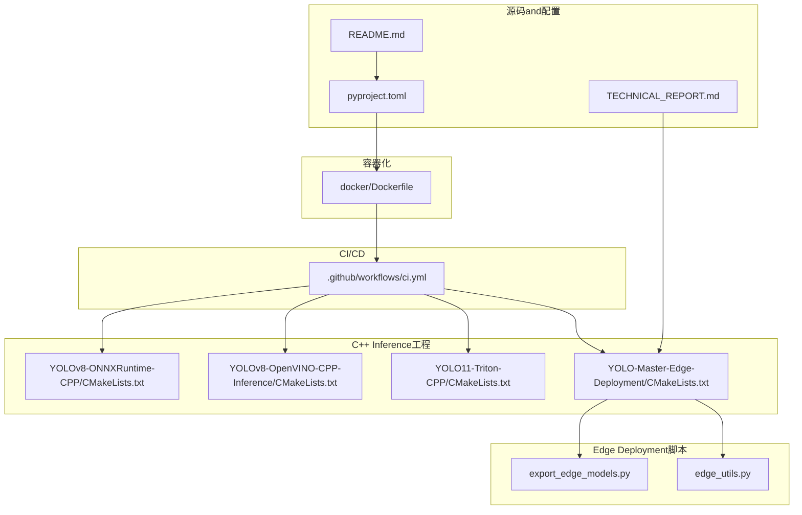
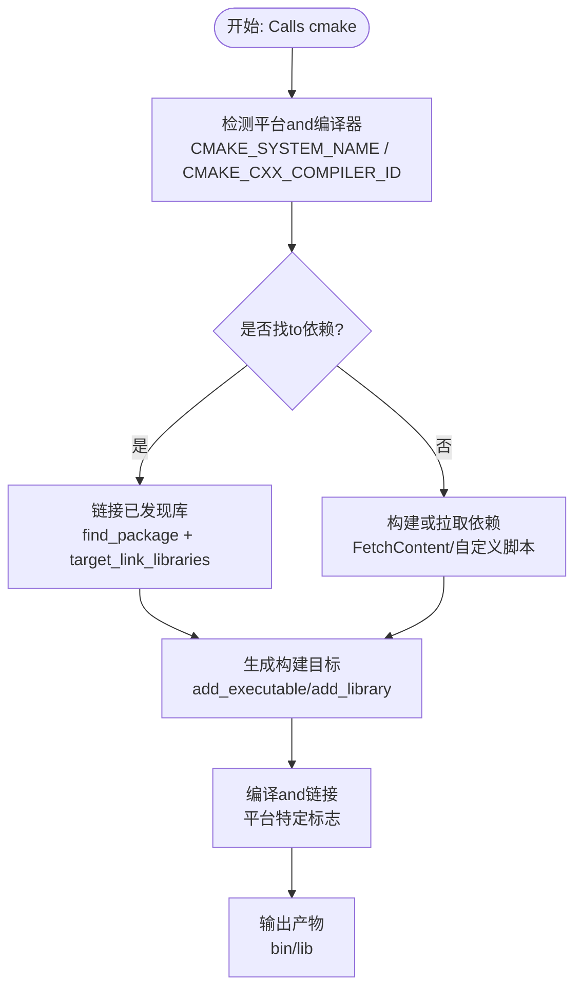
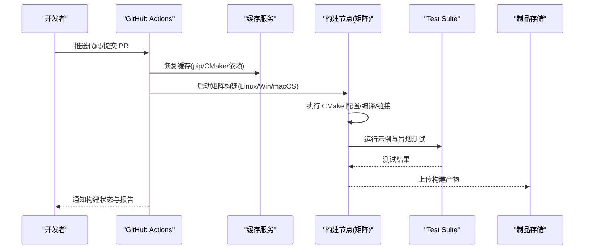
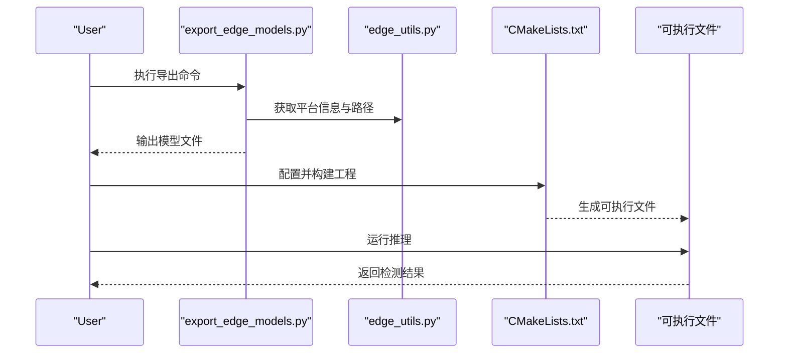
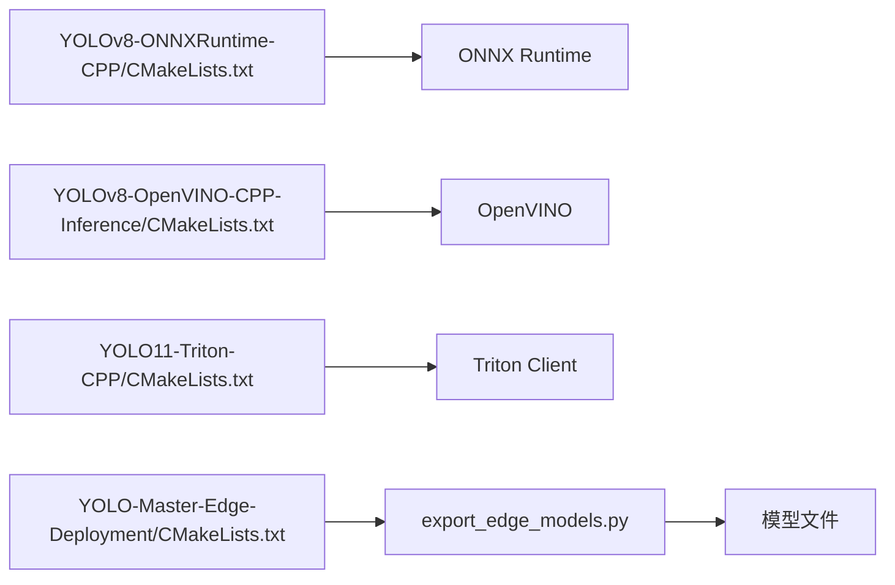

# 跨平台构建系统

<cite>
**Files Referenced in This Document**
- [Dockerfile](file://docker/Dockerfile)
- [.github/workflows/ci.yml](file://.github/workflows/ci.yml)
- [examples/YOLO-Master-Cross-Platform-Edge-Deployment/TECHNICAL_REPORT.md](file://examples/YOLO-Master-Cross-Platform-Edge-Deployment/TECHNICAL_REPORT.md)
- [examples/YOLOv8-ONNXRuntime-CPP/CMakeLists.txt](file://examples/YOLOv8-ONNXRuntime-CPP/CMakeLists.txt)
- [examples/YOLOv8-OpenVINO-CPP-Inference/CMakeLists.txt](file://examples/YOLOv8-OpenVINO-CPP-Inference/CMakeLists.txt)
- [examples/YOLO11-Triton-CPP/CMakeLists.txt](file://examples/YOLO11-Triton-CPP/CMakeLists.txt)
- [examples/YOLO-Master-Edge-Deployment/CMakeLists.txt](file://examples/YOLO-Master-Edge-Deployment/CMakeLists.txt)
- [examples/YOLO-Master-Edge-Deployment/export_edge_models.py](file://examples/YOLO-Master-Edge-Deployment/export_edge_models.py)
- [examples/YOLO-Master-Edge-Deployment/edge_utils.py](file://examples/YOLO-Master-Edge-Deployment/edge_utils.py)
- [pyproject.toml](file://pyproject.toml)
- [README.md](file://README.md)
</cite>

## Table of Contents
1. [Introduction](#Introduction)
2. [Project Structure](#Project Structure)
3. [Core Components](#Core Components)
4. [Architecture Overview](#Architecture Overview)
5. [Detailed Component Analysis](#Detailed Component Analysis)
6. [Dependency Analysis](#Dependency Analysis)
7. [Performance Considerations](#Performance Considerations)
8. [Troubleshooting Guide](#Troubleshooting Guide)
9. [Conclusion](#Conclusion)
10. [Appendix](#Appendix)

## Introduction
本技术Documentation聚焦于 YOLO-Master 的跨平台构建体系，围绕 CMake 构建系统的架构设计、平台检测and条件编译逻辑、第三方依赖管理策略（静态/动态链接）、Docker 容器化构建、CI/CD 流水线集成、增量编译and性能Optimization，Centered onand常见构建问题的诊断and解决方案进行系统化说明。Documentationtargeting不同背景的读者，既provides高层概览，也给出代码级映射andVisualization图示，帮助快速定位问题并提升构建效率。

## Project Structure
仓库采用“Examplesdrivers are installed”的跨平台构建组织方式：核心 Python 包Via pyproject.toml 管理，C++ Inferenceand部署ExamplesCentered on独立子工程形式存while，每个子工程自带 CMakeLists.txt；容器化构建由 docker/Dockerfile 统一编排；自动化测试and发布流程由 .github/workflows 下的 CI 配置drivers are installed。

Figure Source
- [README.md](file://README.md)
- [pyproject.toml](file://pyproject.toml)
- [Dockerfile](file://docker/Dockerfile)
- [.github/workflows/ci.yml](file://.github/workflows/ci.yml)
- [examples/YOLO-Master-Cross-Platform-Edge-Deployment/TECHNICAL_REPORT.md](file://examples/YOLO-Master-Cross-Platform-Edge-Deployment/TECHNICAL_REPORT.md)
- [examples/YOLOv8-ONNXRuntime-CPP/CMakeLists.txt](file://examples/YOLOv8-ONNXRuntime-CPP/CMakeLists.txt)
- [examples/YOLOv8-OpenVINO-CPP-Inference/CMakeLists.txt](file://examples/YOLOv8-OpenVINO-CPP-Inference/CMakeLists.txt)
- [examples/YOLO11-Triton-CPP/CMakeLists.txt](file://examples/YOLO11-Triton-CPP/CMakeLists.txt)
- [examples/YOLO-Master-Edge-Deployment/CMakeLists.txt](file://examples/YOLO-Master-Edge-Deployment/CMakeLists.txt)
- [examples/YOLO-Master-Edge-Deployment/export_edge_models.py](file://examples/YOLO-Master-Edge-Deployment/export_edge_models.py)
- [examples/YOLO-Master-Edge-Deployment/edge_utils.py](file://examples/YOLO-Master-Edge-Deployment/edge_utils.py)

Section Source
- [README.md](file://README.md)
- [pyproject.toml](file://pyproject.toml)
- [Dockerfile](file://docker/Dockerfile)
- [.github/workflows/ci.yml](file://.github/workflows/ci.yml)
- [examples/YOLO-Master-Cross-Platform-Edge-Deployment/TECHNICAL_REPORT.md](file://examples/YOLO-Master-Cross-Platform-Edge-Deployment/TECHNICAL_REPORT.md)
- [examples/YOLOv8-ONNXRuntime-CPP/CMakeLists.txt](file://examples/YOLOv8-ONNXRuntime-CPP/CMakeLists.txt)
- [examples/YOLOv8-OpenVINO-CPP-Inference/CMakeLists.txt](file://examples/YOLOv8-OpenVINO-CPP-Inference/CMakeLists.txt)
- [examples/YOLO11-Triton-CPP/CMakeLists.txt](file://examples/YOLO11-Triton-CPP/CMakeLists.txt)
- [examples/YOLO-Master-Edge-Deployment/CMakeLists.txt](file://examples/YOLO-Master-Edge-Deployment/CMakeLists.txt)
- [examples/YOLO-Master-Edge-Deployment/export_edge_models.py](file://examples/YOLO-Master-Edge-Deployment/export_edge_models.py)
- [examples/YOLO-Master-Edge-Deployment/edge_utils.py](file://examples/YOLO-Master-Edge-Deployment/edge_utils.py)

## Core Components
- 顶层构建入口and元数据
  - README.md：Project Overview、安装andUses指引、平台Supporting说明etc.。
  - pyproject.toml：Python 包元数据、依赖声明、Optional特性开关and脚本入口，for跨平台Environment Preparationand运行provides基础。
- Docker 容器化构建
  - docker/Dockerfile：定义多阶段构建镜像，包含编译器、运行时库、依赖安装and打包产物输出路径，确保可复现的跨平台构建环境。
- CI/CD 流水线
  - .github/workflows/ci.yml：触发条件、矩阵构建（多平台/多版本）、缓存策略、测试执行and制品上传，implementing自动化Validationand发布前置检查。
- C++ InferenceExamplesand CMake 工程
  - examples/YOLOv8-ONNXRuntime-CPP/CMakeLists.txt：基于 ONNX Runtime 的跨平台 C++ Inference工程，展示平台检测、依赖查找and目标生成。
  - examples/YOLOv8-OpenVINO-CPP-Inference/CMakeLists.txt：OpenVINO 后端Examples，体现 Linux/macOS/Windows 差异处理and工具链选择。
  - examples/YOLO11-Triton-CPP/CMakeLists.txt：Triton 客户端Examples，演示网络通信and外部服务集成。
  - examples/YOLO-Master-Edge-Deployment/CMakeLists.txt：Edge Deployment工程，CombiningExport脚本完成模型转换and二进制打包。
- Edge Deployment辅助脚本
  - export_edge_models.py：负责将 PyTorch/TensorFlow Model Exportfor ONNX/OpenVINO/TFLite etc.格式，供 C++ 工程加载。
  - edge_utils.py：Encapsulates平台探测、路径解析、环境变量注入andLoggingetc.通用capabilities。

Section Source
- [README.md](file://README.md)
- [pyproject.toml](file://pyproject.toml)
- [Dockerfile](file://docker/Dockerfile)
- [.github/workflows/ci.yml](file://.github/workflows/ci.yml)
- [examples/YOLOv8-ONNXRuntime-CPP/CMakeLists.txt](file://examples/YOLOv8-ONNXRuntime-CPP/CMakeLists.txt)
- [examples/YOLOv8-OpenVINO-CPP-Inference/CMakeLists.txt](file://examples/YOLOv8-OpenVINO-CPP-Inference/CMakeLists.txt)
- [examples/YOLO11-Triton-CPP/CMakeLists.txt](file://examples/YOLO11-Triton-CPP/CMakeLists.txt)
- [examples/YOLO-Master-Edge-Deployment/CMakeLists.txt](file://examples/YOLO-Master-Edge-Deployment/CMakeLists.txt)
- [examples/YOLO-Master-Edge-Deployment/export_edge_models.py](file://examples/YOLO-Master-Edge-Deployment/export_edge_models.py)
- [examples/YOLO-Master-Edge-Deployment/edge_utils.py](file://examples/YOLO-Master-Edge-Deployment/edge_utils.py)

## Architecture Overview
下图展示了从源码to可执行产物的端to端构建链路，涵盖 Python 层、C++ Inference层、容器化and CI 流水线的协作关系。

Figure Source
- [README.md](file://README.md)
- [pyproject.toml](file://pyproject.toml)
- [Dockerfile](file://docker/Dockerfile)
- [.github/workflows/ci.yml](file://.github/workflows/ci.yml)
- [examples/YOLO-Master-Cross-Platform-Edge-Deployment/TECHNICAL_REPORT.md](file://examples/YOLO-Master-Cross-Platform-Edge-Deployment/TECHNICAL_REPORT.md)
- [examples/YOLOv8-ONNXRuntime-CPP/CMakeLists.txt](file://examples/YOLOv8-ONNXRuntime-CPP/CMakeLists.txt)
- [examples/YOLOv8-OpenVINO-CPP-Inference/CMakeLists.txt](file://examples/YOLOv8-OpenVINO-CPP-Inference/CMakeLists.txt)
- [examples/YOLO11-Triton-CPP/CMakeLists.txt](file://examples/YOLO11-Triton-CPP/CMakeLists.txt)
- [examples/YOLO-Master-Edge-Deployment/CMakeLists.txt](file://examples/YOLO-Master-Edge-Deployment/CMakeLists.txt)
- [examples/YOLO-Master-Edge-Deployment/export_edge_models.py](file://examples/YOLO-Master-Edge-Deployment/export_edge_models.py)
- [examples/YOLO-Master-Edge-Deployment/edge_utils.py](file://examples/YOLO-Master-Edge-Deployment/edge_utils.py)

## Detailed Component Analysis

### CMake 构建系统and平台检测
- 平台检测and条件编译
  - 各 CMakeLists.txt 中通常ViaBuilt-in变量（such as CMAKE_SYSTEM_NAME、CMAKE_HOST_SYSTEM_PROCESSOR）判断Operating Systemand架构，从而启用特定选项或链接器标志。
  - 针对 Windows Uses MSVC 时，需设置运行时库and警告级别；Linux/macOS 则根据 GCC/Clang 版本调整Optimizationand ABI 兼容参数。
- 依赖解析策略
  - Prefer find_package 查找系统或User安装的第三方库（such as OpenCV、OpenVINO、ONNX Runtime、Triton Client）。
  - 当未找to系统依赖时，回退至预编译静态库或从源码构建（Via FetchContent 或自定义下载脚本），保证离线构建capabilities。
- 目标and接口
  - for每种后端（ONNXRuntime、OpenVINO、Triton）创建独立的可执行目标，并Via target_link_libraries 链接对应库。
  - Uses target_include_directories and target_compile_definitions 暴露平台相关宏，便于while C++ 代码中进行条件编译。

Figure Source
- [examples/YOLOv8-ONNXRuntime-CPP/CMakeLists.txt](file://examples/YOLOv8-ONNXRuntime-CPP/CMakeLists.txt)
- [examples/YOLOv8-OpenVINO-CPP-Inference/CMakeLists.txt](file://examples/YOLOv8-OpenVINO-CPP-Inference/CMakeLists.txt)
- [examples/YOLO11-Triton-CPP/CMakeLists.txt](file://examples/YOLO11-Triton-CPP/CMakeLists.txt)
- [examples/YOLO-Master-Edge-Deployment/CMakeLists.txt](file://examples/YOLO-Master-Edge-Deployment/CMakeLists.txt)

Section Source
- [examples/YOLOv8-ONNXRuntime-CPP/CMakeLists.txt](file://examples/YOLOv8-ONNXRuntime-CPP/CMakeLists.txt)
- [examples/YOLOv8-OpenVINO-CPP-Inference/CMakeLists.txt](file://examples/YOLOv8-OpenVINO-CPP-Inference/CMakeLists.txt)
- [examples/YOLO11-Triton-CPP/CMakeLists.txt](file://examples/YOLO11-Triton-CPP/CMakeLists.txt)
- [examples/YOLO-Master-Edge-Deployment/CMakeLists.txt](file://examples/YOLO-Master-Edge-Deployment/CMakeLists.txt)

### 平台差异and兼容性处理（Linux、Windows、macOS）
- Linux
  - 默认Uses GCC/Clang，开启 -O3/-march=native etc.Optimization；动态库路径Via LD_LIBRARY_PATH 或 rpath 管理。
  - 对 OpenVINO and ONNX Runtime 的系统包或 conda 包进行路径探测。
- Windows
  - Uses MSVC，注意运行时库（/MD 或 /MT）一致性and DLL 搜索路径；必要时Uses vcpkg 或 NuGet 管理依赖。
  - 路径分隔符and大小写敏感差异需while CMake and Python 脚本中统一处理。
- macOS
  - Uses Clang，注意 Homebrew 安装路径and SDK 版本；动态库后缀for .dylib，需正确设置 @rpath。
  - 对 CoreML 或 Metal 加速库的条件编译and链接。

Section Source
- [examples/YOLOv8-ONNXRuntime-CPP/CMakeLists.txt](file://examples/YOLOv8-ONNXRuntime-CPP/CMakeLists.txt)
- [examples/YOLOv8-OpenVINO-CPP-Inference/CMakeLists.txt](file://examples/YOLOv8-OpenVINO-CPP-Inference/CMakeLists.txt)
- [examples/YOLO11-Triton-CPP/CMakeLists.txt](file://examples/YOLO11-Triton-CPP/CMakeLists.txt)
- [examples/YOLO-Master-Edge-Deployment/CMakeLists.txt](file://examples/YOLO-Master-Edge-Deployment/CMakeLists.txt)

### 第三方依赖管理策略（静态链接 vs 动态链接）
- 动态链接
  - Advantages：体积更小、更新灵活；缺点：运行期需满足依赖版本and环境变量。
  - Applicable Scenarios：服务器/云端部署，具备集中式依赖管理and容器化环境。
- 静态链接
  - Advantages：自包含、部署简单；缺点：二进制体积大、升级成本高。
  - Applicable Scenarios：边缘设备、离线环境、严格合规要求。
- Mixture策略
  - Core Library静态链接，易变插件动态加载；Via CMake 选项控制链接模式，并while运行时校验可用库。

Section Source
- [examples/YOLOv8-ONNXRuntime-CPP/CMakeLists.txt](file://examples/YOLOv8-ONNXRuntime-CPP/CMakeLists.txt)
- [examples/YOLOv8-OpenVINO-CPP-Inference/CMakeLists.txt](file://examples/YOLOv8-OpenVINO-CPP-Inference/CMakeLists.txt)
- [examples/YOLO11-Triton-CPP/CMakeLists.txt](file://examples/YOLO11-Triton-CPP/CMakeLists.txt)
- [examples/YOLO-Master-Edge-Deployment/CMakeLists.txt](file://examples/YOLO-Master-Edge-Deployment/CMakeLists.txt)

### Docker 容器化构建
- 多阶段构建
  - 构建阶段：安装编译器、SDK、依赖包，执行 CMake 构建and测试。
  - 运行阶段：仅拷贝必要二进制and运行时库，减小镜像体积。
- 关键配置要点
  - 固定基础镜像版本and依赖版本，确保可复现性。
  - Uses缓存卷挂载加速 pip and CMake 依赖下载。
  - while镜像内设置好环境变量（such as OpenVINO 环境变量、LD_LIBRARY_PATH）。
- Uses方式
  - 本地构建：docker build -t yolo-master-build .
  - 运行构建：docker run --rm -v $(pwd)/out:/out yolo-master-build
  - 运行Inference：docker run --rm -v $(pwd)/models:/models yolo-master-runtime

Section Source
- [Dockerfile](file://docker/Dockerfile)

### CI/CD 流水线集成
- 触发and矩阵
  - 按分支/标签触发，矩阵覆盖多平台（Linux/Windows/macOS）and多编译器版本。
- 缓存and并行
  - 缓存 pip 包、CMake 依赖and下载资源，减少重复构建时间。
  - 并行执行多个Examples工程的构建and测试Tasks。
- 测试and制品
  - 单元测试and冒烟测试while构建后自动执行。
  - 构建产物（二进制、Model Export结果）作for工件上传，供后续发布或人工Validation。

Figure Source
- [.github/workflows/ci.yml](file://.github/workflows/ci.yml)

Section Source
- [.github/workflows/ci.yml](file://.github/workflows/ci.yml)

### Edge DeploymentandModel Export流程
- Export流程
  - Via export_edge_models.py 将Training好的权重Exporting to ONNX/OpenVINO/TFLite etc.格式，并输出to指定Table of Contents。
  - edge_utils.py provides平台探测、路径拼接、Loggingand错误Tips，确保while不同环境下稳定运行。
- 构建and运行
  - CMakeLists.txt 将Export的模型作for输入资源，链接相应Inference后端，生成可执行文件。
  - 运行前检查模型and库可用性，失败时给出明确诊断信息。

Figure Source
- [examples/YOLO-Master-Edge-Deployment/export_edge_models.py](file://examples/YOLO-Master-Edge-Deployment/export_edge_models.py)
- [examples/YOLO-Master-Edge-Deployment/edge_utils.py](file://examples/YOLO-Master-Edge-Deployment/edge_utils.py)
- [examples/YOLO-Master-Edge-Deployment/CMakeLists.txt](file://examples/YOLO-Master-Edge-Deployment/CMakeLists.txt)

Section Source
- [examples/YOLO-Master-Edge-Deployment/export_edge_models.py](file://examples/YOLO-Master-Edge-Deployment/export_edge_models.py)
- [examples/YOLO-Master-Edge-Deployment/edge_utils.py](file://examples/YOLO-Master-Edge-Deployment/edge_utils.py)
- [examples/YOLO-Master-Edge-Deployment/CMakeLists.txt](file://examples/YOLO-Master-Edge-Deployment/CMakeLists.txt)

## Dependency Analysis
- Modules耦合and内聚
  - CMakeLists.txt 之间相互独立，through a unifiedExportTable of Contents约定共享模型资源，降低耦合度。
  - Python Export脚本and C++ 工程Via文件路径and命令行参数解耦，便于替换后端。
- 直接/间接依赖
  - 直接依赖：ONNX Runtime、OpenVINO、Triton Client、OpenCV etc.。
  - 间接依赖：系统库（glibc、pthread、dl）、CUDA/ROCm（若启用 GPU acceleration）。
- 外部集成点
  - GitHub Actions 缓存and制品服务。
  - Container Images仓库（Optional，用于分发构建镜像）。

Figure Source
- [examples/YOLOv8-ONNXRuntime-CPP/CMakeLists.txt](file://examples/YOLOv8-ONNXRuntime-CPP/CMakeLists.txt)
- [examples/YOLOv8-OpenVINO-CPP-Inference/CMakeLists.txt](file://examples/YOLOv8-OpenVINO-CPP-Inference/CMakeLists.txt)
- [examples/YOLO11-Triton-CPP/CMakeLists.txt](file://examples/YOLO11-Triton-CPP/CMakeLists.txt)
- [examples/YOLO-Master-Edge-Deployment/CMakeLists.txt](file://examples/YOLO-Master-Edge-Deployment/CMakeLists.txt)
- [examples/YOLO-Master-Edge-Deployment/export_edge_models.py](file://examples/YOLO-Master-Edge-Deployment/export_edge_models.py)

Section Source
- [examples/YOLOv8-ONNXRuntime-CPP/CMakeLists.txt](file://examples/YOLOv8-ONNXRuntime-CPP/CMakeLists.txt)
- [examples/YOLOv8-OpenVINO-CPP-Inference/CMakeLists.txt](file://examples/YOLOv8-OpenVINO-CPP-Inference/CMakeLists.txt)
- [examples/YOLO11-Triton-CPP/CMakeLists.txt](file://examples/YOLO11-Triton-CPP/CMakeLists.txt)
- [examples/YOLO-Master-Edge-Deployment/CMakeLists.txt](file://examples/YOLO-Master-Edge-Deployment/CMakeLists.txt)
- [examples/YOLO-Master-Edge-Deployment/export_edge_models.py](file://examples/YOLO-Master-Edge-Deployment/export_edge_models.py)

## Performance Considerations
- 增量编译
  - Uses Ninja 生成器替代 Make，显著提升增量构建速度。
  - 合理划分源文件and头文件，避免不必要的重编译。
  - 利用 CMake 的 cache and external project 缓存机制，复用已下载的依赖。
- 并行构建
  - while CI 中Uses -j$(nproc) 或 ctest --parallel，充分利用多核 CPU。
- 链接Optimization
  - 生产构建启用 LTO（Link Time Optimization）and strip 符号，减小二进制体积并提升运行性能。
- 缓存策略
  - while GitHub Actions 中缓存 pip 包、Conda 环境and CMake 依赖Table of Contents，缩短冷启动时间。

[This section provides general guidance and does not directly analyze specific files]

## Troubleshooting Guide
- 依赖未找to
  - 现象：CMake 报错找不to OpenCV/OpenVINO/ONNX Runtime。
  - 排查：确认 find_package 路径and CMAKE_PREFIX_PATH；while Linux 下检查 ldconfig，Windows 下检查 PATH，macOS 下检查 Homebrew 路径。
- 运行时库缺失
  - 现象：可执行文件启动时报动态库未找to。
  - 排查：设置 LD_LIBRARY_PATH 或 rpath；while Windows 上复制 DLL to可执行同Table of Contents；while macOS 上Uses install_name_tool 修正 @rpath。
- 平台不兼容
  - 现象：MSVC/GCC/Clang 版本差异导致编译失败。
  - 排查：锁定编译器版本；while CMake 中添加最小版本检查；针对不同平台设置不同的编译标志。
- Model Export失败
  - 现象：export_edge_models.py 抛出形状或算子不Supporting错误。
  - 排查：查看ExportLogging，降级或替换不Supporting的算子；Uses onnx-simplifier 或 OpenVINO Model Optimizer 进行Post-Processing。
- CI 构建缓慢
  - 现象：每次构建都重新下载依赖。
  - 排查：启用缓存；拆分Tasks；Uses镜像加速源。

Section Source
- [examples/YOLOv8-ONNXRuntime-CPP/CMakeLists.txt](file://examples/YOLOv8-ONNXRuntime-CPP/CMakeLists.txt)
- [examples/YOLOv8-OpenVINO-CPP-Inference/CMakeLists.txt](file://examples/YOLOv8-OpenVINO-CPP-Inference/CMakeLists.txt)
- [examples/YOLO11-Triton-CPP/CMakeLists.txt](file://examples/YOLO11-Triton-CPP/CMakeLists.txt)
- [examples/YOLO-Master-Edge-Deployment/export_edge_models.py](file://examples/YOLO-Master-Edge-Deployment/export_edge_models.py)
- [examples/YOLO-Master-Edge-Deployment/edge_utils.py](file://examples/YOLO-Master-Edge-Deployment/edge_utils.py)

## Conclusion
YOLO-Master 的跨平台构建体系Centered on CMake for核心，Combining Docker and CI/CD implementing了高可复现、可扩展的构建and交付流程。Via平台检测、条件编译and灵活的依赖管理策略，项目while Linux、Windows、macOS 上均能稳定构建and运行。Combined with增量编译and缓存Optimization，显著提升了开发体验and流水线效率。建议while生产环境中优先采用容器化and静态链接策略，Centered on确保部署的一致性and安全性。

[This section is summary content and does not directly analyze specific files]

## Appendix
- Refer toDocumentation
  - TECHNICAL_REPORT.md：跨平台Edge Deployment的技术细节and实践案例。
- 快速上手
  - README.md：安装、基本用法and常见问题解答。
  - pyproject.toml：Python 依赖andOptional特性清单。

Section Source
- [examples/YOLO-Master-Cross-Platform-Edge-Deployment/TECHNICAL_REPORT.md](file://examples/YOLO-Master-Cross-Platform-Edge-Deployment/TECHNICAL_REPORT.md)
- [README.md](file://README.md)
- [pyproject.toml](file://pyproject.toml)