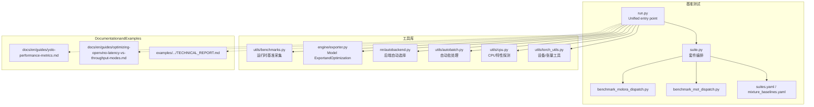
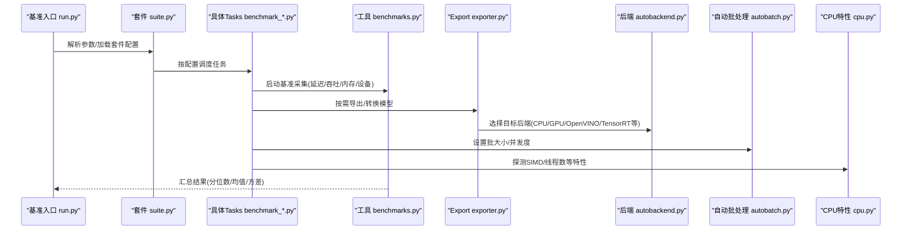
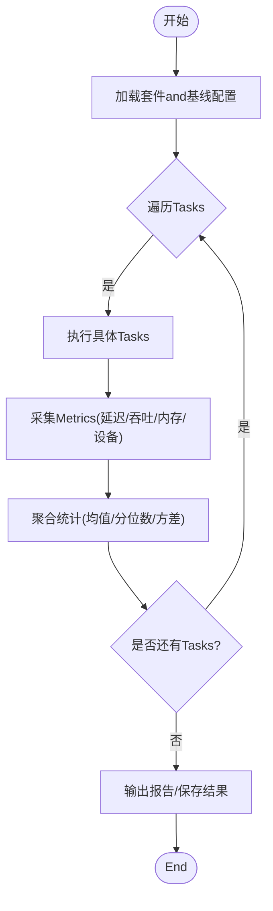
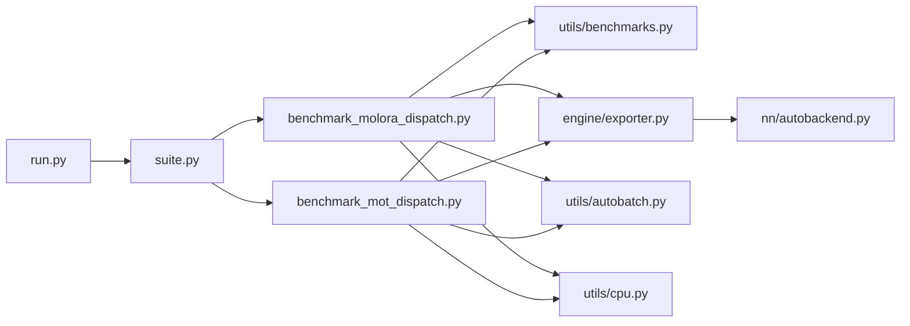

# 性能Optimizationand基准测试

<cite>
**Files Referenced in This Document**
- [benchmarks/run.py](file://benchmarks/run.py)
- [benchmarks/suite.py](file://benchmarks/suite.py)
- [benchmarks/benchmark_molora_dispatch.py](file://benchmarks/benchmark_molora_dispatch.py)
- [benchmarks/benchmark_mot_dispatch.py](file://benchmarks/benchmark_mot_dispatch.py)
- [benchmarks/suites.yaml](file://benchmarks/suites.yaml)
- [benchmarks/mixture_baselines.yaml](file://benchmarks/mixture_baselines.yaml)
- [ultralytics/utils/benchmarks.py](file://ultralytics/utils/benchmarks.py)
- [ultralytics/engine/exporter.py](file://ultralytics/engine/exporter.py)
- [ultralytics/nn/autobackend.py](file://ultralytics/nn/autobackend.py)
- [ultralytics/utils/autobatch.py](file://ultralytics/utils/autobatch.py)
- [ultralytics/utils/cpu.py](file://ultralytics/utils/cpu.py)
- [ultralytics/utils/torch_utils.py](file://ultralytics/utils/torch_utils.py)
- [examples/YOLO-Master-Cross-Platform-Edge-Deployment/TECHNICAL_REPORT.md](file://examples/YOLO-Master-Cross-Platform-Edge-Deployment/TECHNICAL_REPORT.md)
- [docs/en/guides/yolo-performance-metrics.md](file://docs/en/guides/yolo-performance-metrics.md)
- [docs/en/guides/optimizing-openvino-latency-vs-throughput-modes.md](file://docs/en/guides/optimizing-openvino-latency-vs-throughput-modes.md)
- [tests/test_benchmark_suite.py](file://tests/test_benchmark_suite.py)
</cite>

## Table of Contents
1. [Introduction](#Introduction)
2. [Project Structure](#Project Structure)
3. [Core Components](#Core Components)
4. [Architecture Overview](#Architecture Overview)
5. [Detailed Component Analysis](#Detailed Component Analysis)
6. [Dependency Analysis](#Dependency Analysis)
7. [性能考量](#性能考量)
8. [Troubleshooting Guide](#Troubleshooting Guide)
9. [Conclusion](#Conclusion)
10. [Appendix](#Appendix)

## Introduction
本技术Documentationtargeting边缘设备上的Inference PerformanceOptimization，围绕Centered on下目标unfold：
- provides可操作的Inference Performance分析方法，覆盖CPU利用率、内存占用andGPU加速效果测量。
- 解释Model Quantization、算子融合、内存池化and线程池Optimization的implementing原理and应用场景。
- 给出针对特定硬件平台的Optimization策略（SIMD指令集利用、缓存Optimization、并行计算）。
- Documentation化基准Test Suite的Uses方法and结果解读。
- 阐述延迟and吞吐量的平衡策略。
- provides实时监控and性能回归检测方案。
- Via实践案例指导bottlenecks定位and调优。

## Project Structure
本项目while“基准测试”和“工具库”两个层面provides了完整的性能分析andOptimizationcapabilities：
- 基准测试层：Unified entry point、套件编排、Tasks定义and结果汇总。
- 工具库层：运行时基准采集、Exportand后端选择、自动批处理、CPU/设备相关Optimization。
- DocumentationandExamples：平台级Optimization指南、OpenVINO延迟/吞吐模式说明、Cross-Platform Deployment技术报告。

Figure Source
- [benchmarks/run.py](file://benchmarks/run.py)
- [benchmarks/suite.py](file://benchmarks/suite.py)
- [benchmarks/benchmark_molora_dispatch.py](file://benchmarks/benchmark_molora_dispatch.py)
- [benchmarks/benchmark_mot_dispatch.py](file://benchmarks/benchmark_mot_dispatch.py)
- [benchmarks/suites.yaml](file://benchmarks/suites.yaml)
- [benchmarks/mixture_baselines.yaml](file://benchmarks/mixture_baselines.yaml)
- [ultralytics/utils/benchmarks.py](file://ultralytics/utils/benchmarks.py)
- [ultralytics/engine/exporter.py](file://ultralytics/engine/exporter.py)
- [ultralytics/nn/autobackend.py](file://ultralytics/nn/autobackend.py)
- [ultralytics/utils/autobatch.py](file://ultralytics/utils/autobatch.py)
- [ultralytics/utils/cpu.py](file://ultralytics/utils/cpu.py)
- [ultralytics/utils/torch_utils.py](file://ultralytics/utils/torch_utils.py)
- [docs/en/guides/yolo-performance-metrics.md](file://docs/en/guides/yolo-performance-metrics.md)
- [docs/en/guides/optimizing-openvino-latency-vs-throughput-modes.md](file://docs/en/guides/optimizing-openvino-latency-vs-throughput-modes.md)
- [examples/YOLO-Master-Cross-Platform-Edge-Deployment/TECHNICAL_REPORT.md](file://examples/YOLO-Master-Cross-Platform-Edge-Deployment/TECHNICAL_REPORT.md)

Section Source
- [benchmarks/run.py](file://benchmarks/run.py)
- [benchmarks/suite.py](file://benchmarks/suite.py)
- [benchmarks/benchmark_molora_dispatch.py](file://benchmarks/benchmark_molora_dispatch.py)
- [benchmarks/benchmark_mot_dispatch.py](file://benchmarks/benchmark_mot_dispatch.py)
- [benchmarks/suites.yaml](file://benchmarks/suites.yaml)
- [benchmarks/mixture_baselines.yaml](file://benchmarks/mixture_baselines.yaml)
- [ultralytics/utils/benchmarks.py](file://ultralytics/utils/benchmarks.py)
- [ultralytics/engine/exporter.py](file://ultralytics/engine/exporter.py)
- [ultralytics/nn/autobackend.py](file://ultralytics/nn/autobackend.py)
- [ultralytics/utils/autobatch.py](file://ultralytics/utils/autobatch.py)
- [ultralytics/utils/cpu.py](file://ultralytics/utils/cpu.py)
- [ultralytics/utils/torch_utils.py](file://ultralytics/utils/torch_utils.py)
- [docs/en/guides/yolo-performance-metrics.md](file://docs/en/guides/yolo-performance-metrics.md)
- [docs/en/guides/optimizing-openvino-latency-vs-throughput-modes.md](file://docs/en/guides/optimizing-openvino-latency-vs-throughput-modes.md)
- [examples/YOLO-Master-Cross-Platform-Edge-Deployment/TECHNICAL_REPORT.md](file://examples/YOLO-Master-Cross-Platform-Edge-Deployment/TECHNICAL_REPORT.md)

## Core Components
- 基准测试Unified entry pointand套件编排
  - Unified entry point负责解析参数、加载套件配置、调度具体基准Tasks并汇总输出。
  - 套件编排根据配置文件动态注册and执行不同Tasks（such asMolora路由分发、Multi-Object Tracking分发etc.）。
- 运行时基准采集
  - provides延迟、吞吐、内存and设备Uses率etc.Metrics的采集and统计方法，Supporting多次运行Centered on稳定估计。
- Model Exportand后端选择
  - Export流程集成多种Optimization（such as量化、图融合），并根据目标设备自动选择最优后端。
- 自动批处理andCPU特性探测
  - 自动批处理根据设备capabilitiesand内存约束选择合适批次；CPU特性探测用于启用SIMDetc.指令集Optimization。
- DocumentationandExamples
  - 性能Metrics说明、OpenVINO延迟/吞吐模式对比、Cross-Platform Deployment技术报告for实战providesRefer to。

Section Source
- [benchmarks/run.py](file://benchmarks/run.py)
- [benchmarks/suite.py](file://benchmarks/suite.py)
- [ultralytics/utils/benchmarks.py](file://ultralytics/utils/benchmarks.py)
- [ultralytics/engine/exporter.py](file://ultralytics/engine/exporter.py)
- [ultralytics/nn/autobackend.py](file://ultralytics/nn/autobackend.py)
- [ultralytics/utils/autobatch.py](file://ultralytics/utils/autobatch.py)
- [ultralytics/utils/cpu.py](file://ultralytics/utils/cpu.py)
- [docs/en/guides/yolo-performance-metrics.md](file://docs/en/guides/yolo-performance-metrics.md)
- [docs/en/guides/optimizing-openvino-latency-vs-throughput-modes.md](file://docs/en/guides/optimizing-openvino-latency-vs-throughput-modes.md)
- [examples/YOLO-Master-Cross-Platform-Edge-Deployment/TECHNICAL_REPORT.md](file://examples/YOLO-Master-Cross-Platform-Edge-Deployment/TECHNICAL_REPORT.md)

## Architecture Overview
下图展示了从基准入口to具体Tasks执行的Calls链，Centered onand工具库的支撑作用。

Figure Source
- [benchmarks/run.py](file://benchmarks/run.py)
- [benchmarks/suite.py](file://benchmarks/suite.py)
- [benchmarks/benchmark_molora_dispatch.py](file://benchmarks/benchmark_molora_dispatch.py)
- [benchmarks/benchmark_mot_dispatch.py](file://benchmarks/benchmark_mot_dispatch.py)
- [ultralytics/utils/benchmarks.py](file://ultralytics/utils/benchmarks.py)
- [ultralytics/engine/exporter.py](file://ultralytics/engine/exporter.py)
- [ultralytics/nn/autobackend.py](file://ultralytics/nn/autobackend.py)
- [ultralytics/utils/autobatch.py](file://ultralytics/utils/autobatch.py)
- [ultralytics/utils/cpu.py](file://ultralytics/utils/cpu.py)

## Detailed Component Analysis

### 基准Test SuiteandTasks
- 套件定义and基线
  - suites.yaml and mixture_baselines.yaml 定义了基准Tasks集合and基线配置，便于while不同模型/数据集/后端上复现实验。
- Tasksimplementing
  - Molora分发基准：Evaluation路由/专家选择路径对延迟and吞吐的影响。
  - MOT分发基准：EvaluationMulti-Object Tracking管线中各阶段的性能特征。
- 执行流程
  - 入口解析参数后，由套件管理器加载Tasks并依次执行，期间Calls工具库进行Metrics采集and结果汇总。

Figure Source
- [benchmarks/suite.py](file://benchmarks/suite.py)
- [benchmarks/benchmark_molora_dispatch.py](file://benchmarks/benchmark_molora_dispatch.py)
- [benchmarks/benchmark_mot_dispatch.py](file://benchmarks/benchmark_mot_dispatch.py)
- [benchmarks/suites.yaml](file://benchmarks/suites.yaml)
- [benchmarks/mixture_baselines.yaml](file://benchmarks/mixture_baselines.yaml)

Section Source
- [benchmarks/suite.py](file://benchmarks/suite.py)
- [benchmarks/benchmark_molora_dispatch.py](file://benchmarks/benchmark_molora_dispatch.py)
- [benchmarks/benchmark_mot_dispatch.py](file://benchmarks/benchmark_mot_dispatch.py)
- [benchmarks/suites.yaml](file://benchmarks/suites.yaml)
- [benchmarks/mixture_baselines.yaml](file://benchmarks/mixture_baselines.yaml)

### 运行时基准采集andMetrics
- Metrics维度
  - 延迟：端to端时延分布（P50/P90/P99）、每步耗时。
  - 吞吐：每秒处理样本数或帧数。
  - 资源：CPU利用率、内存峰值/常驻、GPU显存占用and利用率。
- 采集方式
  - 预热阶段消除冷启动影响；多次运行取稳健统计；必要时隔离进程/容器Centered on减少噪声。
- 结果解读
  - 关注长尾延迟and吞吐稳定性；Combining设备利用率判断是否存whileI/O或调度bottlenecks。

Section Source
- [ultralytics/utils/benchmarks.py](file://ultralytics/utils/benchmarks.py)
- [tests/test_benchmark_suite.py](file://tests/test_benchmark_suite.py)

### Model Exportand后端选择
- ExportOptimization
  - Supporting量化（INT8/FP16）、算子融合、图Optimizationetc.，减少运行时开销。
- 后端选择
  - 根据目标设备and可用库自动选择最优后端（such asOpenVINO、TensorRT、ONNX Runtimeetc.）。
- Applicable Scenarios
  - 边缘设备优先选择轻量后端and低精度量化；服务器侧可启用更高精度and更强Optimization。

Section Source
- [ultralytics/engine/exporter.py](file://ultralytics/engine/exporter.py)
- [ultralytics/nn/autobackend.py](file://ultralytics/nn/autobackend.py)

### 自动批处理andCPU特性探测
- 自动批处理
  - 依据设备内存and延迟目标自适应调整批大小，避免OOM并提升吞吐。
- CPU特性探测
  - 探测SIMD指令集、NUMA拓扑and线程亲和性，Set appropriately线程数and数据布局Centered on提升缓存命中。

Section Source
- [ultralytics/utils/autobatch.py](file://ultralytics/utils/autobatch.py)
- [ultralytics/utils/cpu.py](file://ultralytics/utils/cpu.py)
- [ultralytics/utils/torch_utils.py](file://ultralytics/utils/torch_utils.py)

### DocumentationandExamplesRefer to
- 性能Metrics说明
  - providesMetrics定义、采集方法and解读建议。
- OpenVINO延迟/吞吐模式
  - 对比不同Optimization模式对延迟and吞吐的影响，指导生产环境选择。
- Cross-Platform Deployment技术报告
  - 总结ARM/CPU/GPUetc.多平台部署经验andOptimization要点。

Section Source
- [docs/en/guides/yolo-performance-metrics.md](file://docs/en/guides/yolo-performance-metrics.md)
- [docs/en/guides/optimizing-openvino-latency-vs-throughput-modes.md](file://docs/en/guides/optimizing-openvino-latency-vs-throughput-modes.md)
- [examples/YOLO-Master-Cross-Platform-Edge-Deployment/TECHNICAL_REPORT.md](file://examples/YOLO-Master-Cross-Platform-Edge-Deployment/TECHNICAL_REPORT.md)

## Dependency Analysis
- 组件耦合
  - 基准入口and套件管理松耦合，Via配置drivers are installedTasks注册and执行。
  - Tasks层依赖工具库进行Metrics采集and设备交互，降低重复implementing。
- External Dependencies
  - Exportand后端选择依赖第三方Inference引擎and运行时库。
- Potential Cycles依赖
  - 当前结构清晰，未见明显循环依赖风险。

Figure Source
- [benchmarks/run.py](file://benchmarks/run.py)
- [benchmarks/suite.py](file://benchmarks/suite.py)
- [benchmarks/benchmark_molora_dispatch.py](file://benchmarks/benchmark_molora_dispatch.py)
- [benchmarks/benchmark_mot_dispatch.py](file://benchmarks/benchmark_mot_dispatch.py)
- [ultralytics/utils/benchmarks.py](file://ultralytics/utils/benchmarks.py)
- [ultralytics/engine/exporter.py](file://ultralytics/engine/exporter.py)
- [ultralytics/nn/autobackend.py](file://ultralytics/nn/autobackend.py)
- [ultralytics/utils/autobatch.py](file://ultralytics/utils/autobatch.py)
- [ultralytics/utils/cpu.py](file://ultralytics/utils/cpu.py)

Section Source
- [benchmarks/run.py](file://benchmarks/run.py)
- [benchmarks/suite.py](file://benchmarks/suite.py)
- [benchmarks/benchmark_molora_dispatch.py](file://benchmarks/benchmark_molora_dispatch.py)
- [benchmarks/benchmark_mot_dispatch.py](file://benchmarks/benchmark_mot_dispatch.py)
- [ultralytics/utils/benchmarks.py](file://ultralytics/utils/benchmarks.py)
- [ultralytics/engine/exporter.py](file://ultralytics/engine/exporter.py)
- [ultralytics/nn/autobackend.py](file://ultralytics/nn/autobackend.py)
- [ultralytics/utils/autobatch.py](file://ultralytics/utils/autobatch.py)
- [ultralytics/utils/cpu.py](file://ultralytics/utils/cpu.py)

## 性能考量
- 延迟and吞吐的平衡
  - 低延迟场景：减小批大小、关闭过度融合、采用更低精度但可控误差的量化。
  - 高吞吐场景：增大批大小、启用更多融合and并行、选择适合的后端Optimization模式。
- 量化and融合
  - INT8量化显著降低内存带宽压力，需Combined with校准集保证精度；算子融合减少内核启动and中间内存分配。
- 内存池化and线程池
  - 复用内存块and线程，降低频繁分配/释放and上下文切换开销。
- 硬件平台Optimization
  - SIMD指令集：对齐数据布局、向量化关键路径。
  - 缓存Optimization：提高局部性、减少跨NUMA访问。
  - 并行计算：合理划分Tasks粒度，避免同步热点。

[This section provides general guidance and does not directly analyze specific files]

## Troubleshooting Guide
- 常见问题
  - Metrics波动大：检查系统负载、电源模式、后台进程；增加预热and重复次数。
  - 内存不足：降低批大小、启用更激进的量化或图压缩。
  - GPU未充分利用：确认后端选择正确、输入形状and批大小匹配、避免频繁主机-设备拷贝。
- 回归检测
  - 将关键Metrics纳入CI，设定阈值门控；当延迟/吞吐退化超过阈值时触发告警。
- 定位步骤
  - 分层测量：预处理、Inference、Post-Processing分别计时。
  - 设备画像：CPU/GPU利用率曲线、内存峰值、I/Oetc.待时间。
  - 对比实验：不同后端/量化/批大小组合，快速收敛bottlenecks。

Section Source
- [tests/test_benchmark_suite.py](file://tests/test_benchmark_suite.py)
- [docs/en/guides/yolo-performance-metrics.md](file://docs/en/guides/yolo-performance-metrics.md)
- [docs/en/guides/optimizing-openvino-latency-vs-throughput-modes.md](file://docs/en/guides/optimizing-openvino-latency-vs-throughput-modes.md)

## Conclusion
through a unified基准Test Suiteand完善的工具库，本项目for边缘设备Inference PerformanceOptimizationprovides了系统化方法。Combining量化、融合、内存and线程Optimization，Centered onand针对不同硬件平台的策略，可while延迟and吞吐之间取得良好平衡。建议while持续集成中引入性能门控and回归检测，确保Optimization成果while生产环境中稳定落地。

[This section is summary content and does not directly analyze specific files]

## Appendix
- Uses建议
  - 先跑基线再尝试Optimization，记录每次变更的配置and结果。
  - 关注长尾延迟and稳定性，而非仅看平均值。
  - CombiningDocumentationandExamples，选择合适的后端andOptimization模式。

[本节for补充信息，不直接分析具体文件]