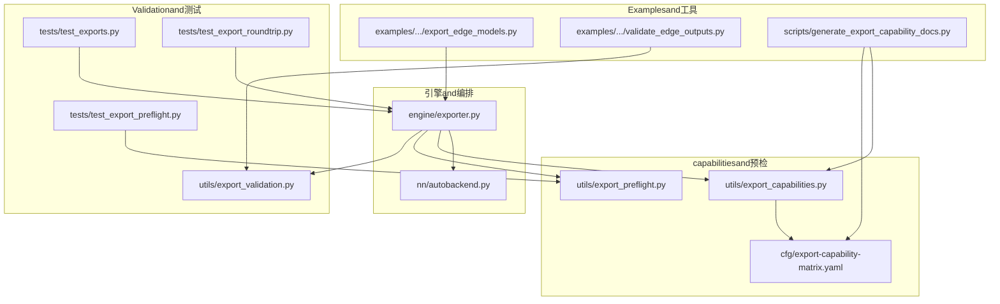
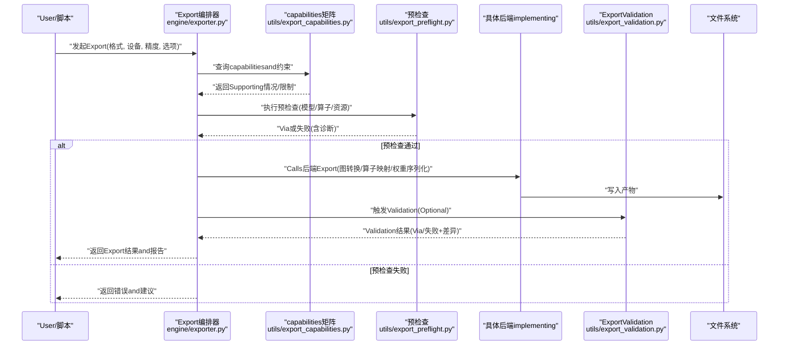
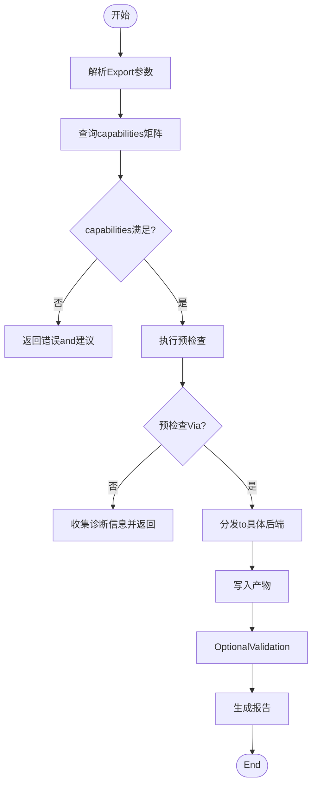
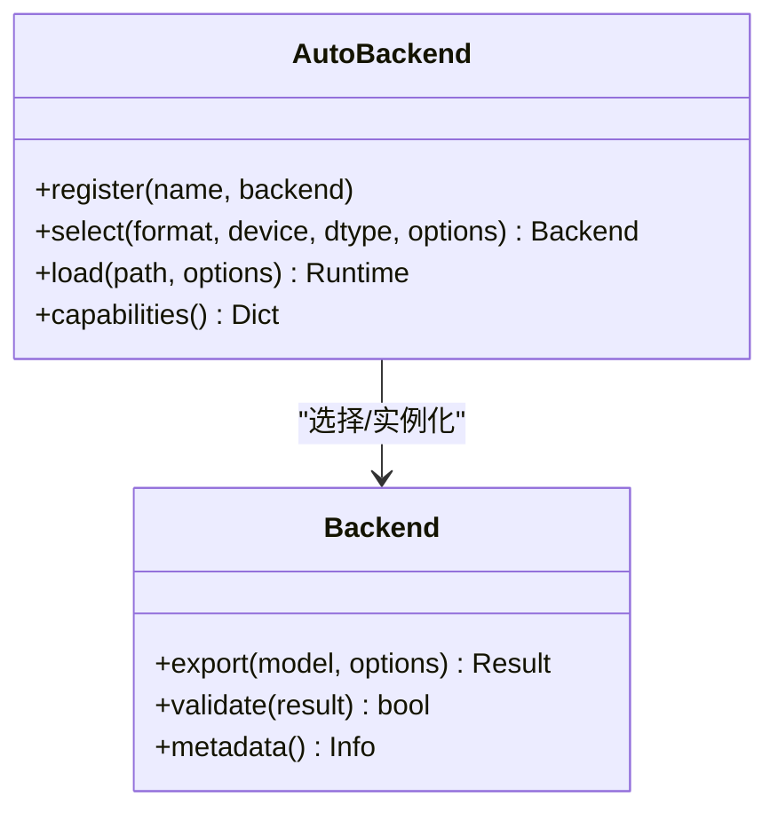
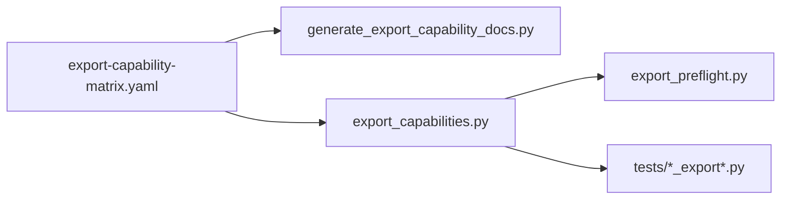
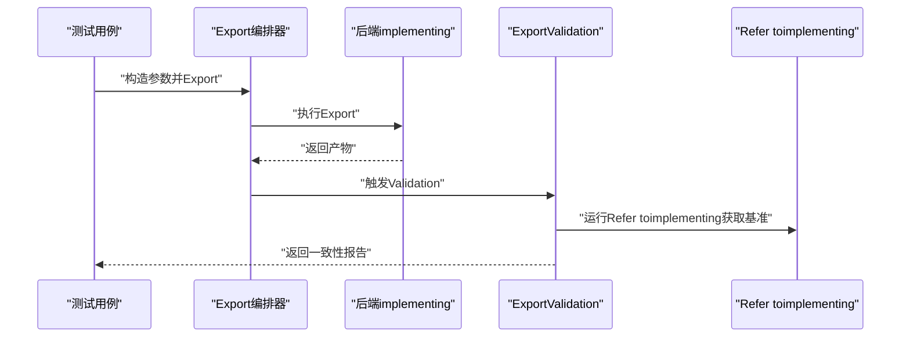
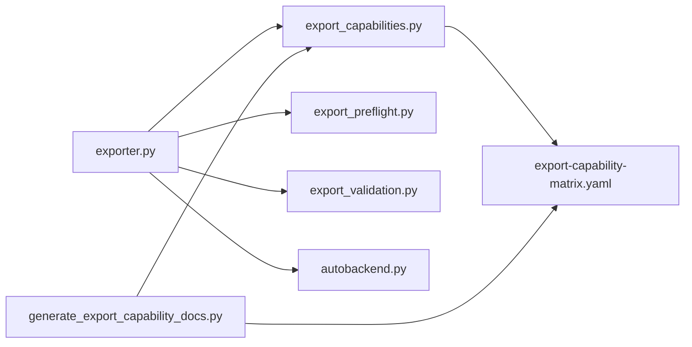

# 自定义Export Backends开发

<cite>
**Files Referenced in This Document**
- [exporter.py](file://ultralytics/engine/exporter.py)
- [autobackend.py](file://ultralytics/nn/autobackend.py)
- [export_validation.py](file://ultralytics/utils/export_validation.py)
- [export_preflight.py](file://ultralytics/utils/export_preflight.py)
- [export_capabilities.py](file://ultralytics/utils/export_capabilities.py)
- [test_export_roundtrip.py](file://tests/test_export_roundtrip.py)
- [test_export_preflight.py](file://tests/test_export_preflight.py)
- [test_exports.py](file://tests/test_exports.py)
- [export-capability-matrix.yaml](file://ultralytics/cfg/export-capability-matrix.yaml)
- [generate_export_capability_docs.py](file://scripts/generate_export_capability_docs.py)
- [export_edge_models.py](file://examples/YOLO-Master-Edge-Deployment/export_edge_models.py)
- [validate_edge_outputs.py](file://examples/YOLO-Master-Edge-Deployment/validate_edge_outputs.py)
</cite>

## Table of Contents
1. [Introduction](#Introduction)
2. [Project Structure](#Project Structure)
3. [Core Components](#Core Components)
4. [Architecture Overview](#Architecture Overview)
5. [Detailed Component Analysis](#Detailed Component Analysis)
6. [Dependency Analysis](#Dependency Analysis)
7. [性能考量](#性能考量)
8. [Troubleshooting Guide](#Troubleshooting Guide)
9. [Conclusion](#Conclusion)
10. [Appendix](#Appendix)

## Introduction
本技术Documentationtargeting希望while YOLO-Master 中implementing“自定义Export Backends”的开发者，系统阐述Export Backends的接口规范、注册机制and生命周期管理；解释模型图转换、算子映射and权重处理的implementing要点；Documentation化ExportValidation、测试框架and调试工具的Uses；并provides完整的自定义后端开发Examples（含错误处理、性能监控and资源管理），Centered onandand现有Export系统的集成方法and兼容性要求。最后给出代码审查标准and发布流程指导，帮助高质量地落地新后端。

## Project Structure
YOLO-Master 的Export子系统主要分布whileCentered on下位置：
- Engine LayerExport入口and编排：engine/exporter.py
- 运行时自动后端选择and适配：nn/autobackend.py
- Exportcapabilities矩阵and预检查：utils/export_capabilities.py、utils/export_preflight.py
- Export结果校验and一致性对比：utils/export_validation.py
- ExportcapabilitiesDocumentation生成：scripts/generate_export_capability_docs.py
- 端to端Export测试：tests/test_exports.py、tests/test_export_roundtrip.py、tests/test_export_preflight.py
- Edge DeploymentExamplesandValidation：examples/YOLO-Master-Edge-Deployment/export_edge_models.py、examples/YOLO-Master-Edge-Deployment/validate_edge_outputs.py
- Exportcapabilities配置清单：ultralytics/cfg/export-capability-matrix.yaml

Figure Source
- [exporter.py](file://ultralytics/engine/exporter.py)
- [autobackend.py](file://ultralytics/nn/autobackend.py)
- [export_capabilities.py](file://ultralytics/utils/export_capabilities.py)
- [export_preflight.py](file://ultralytics/utils/export_preflight.py)
- [export-capability-matrix.yaml](file://ultralytics/cfg/export-capability-matrix.yaml)
- [export_validation.py](file://ultralytics/utils/export_validation.py)
- [test_exports.py](file://tests/test_exports.py)
- [test_export_roundtrip.py](file://tests/test_export_roundtrip.py)
- [test_export_preflight.py](file://tests/test_export_preflight.py)
- [export_edge_models.py](file://examples/YOLO-Master-Edge-Deployment/export_edge_models.py)
- [validate_edge_outputs.py](file://examples/YOLO-Master-Edge-Deployment/validate_edge_outputs.py)
- [generate_export_capability_docs.py](file://scripts/generate_export_capability_docs.py)

Section Source
- [exporter.py](file://ultralytics/engine/exporter.py)
- [autobackend.py](file://ultralytics/nn/autobackend.py)
- [export_capabilities.py](file://ultralytics/utils/export_capabilities.py)
- [export_preflight.py](file://ultralytics/utils/export_preflight.py)
- [export_validation.py](file://ultralytics/utils/export_validation.py)
- [test_exports.py](file://tests/test_exports.py)
- [test_export_roundtrip.py](file://tests/test_export_roundtrip.py)
- [test_export_preflight.py](file://tests/test_export_preflight.py)
- [export-capability-matrix.yaml](file://ultralytics/cfg/export-capability-matrix.yaml)
- [generate_export_capability_docs.py](file://scripts/generate_export_capability_docs.py)
- [export_edge_models.py](file://examples/YOLO-Master-Edge-Deployment/export_edge_models.py)
- [validate_edge_outputs.py](file://examples/YOLO-Master-Edge-Deployment/validate_edge_outputs.py)

## Core Components
- Export编排器（Engine Exporter）
  - 职责：统一接收Export请求，解析参数，执行预检查，Calls具体后端implementing，完成权重序列化and产物落盘，并返回标准化Results Object。
  - 关键点：Supporting多后端并行调度、失败回退、LoggingandMetrics上报、资源清理。
- 自动后端选择（AutoBackend）
  - 职责：根据目标格式、设备、精度etc.约束，从已注册的后端中选择最优implementing；whileInference阶段负责加载and适配。
  - 关键点：后端发现、capabilities匹配、版本兼容、热插拔扩展。
- Exportcapabilities矩阵（Export Capability Matrix）
  - 职责：声明各后端Supporting的模型Tasks、输入形状、数据类型、Optimization选项etc.，用于预检查andDocumentation生成。
  - 关键点：YAML 清单drivers are installed、自动生成Documentation、CI 门禁。
- 预检查（Export Preflight）
  - 职责：while真正Export前进行静态检查（模型结构、算子Supporting、内存/磁盘空间、路径权限etc.）。
  - 关键点：快速失败、可修复建议、诊断信息收集。
- ExportValidation（Export Validation）
  - 职责：对Export产物进行数值一致性、形状and类型、边界条件and回归用例Validation。
  - 关键点：Refer toimplementing对比、容差策略、随机种子固定、覆盖率统计。
- Test Suite
  - 职责：覆盖端to端Export、往返一致性、预检查分支、capabilities矩阵变更影响面。
  - 关键点：参数化用例、隔离环境、缓存and加速。

Section Source
- [exporter.py](file://ultralytics/engine/exporter.py)
- [autobackend.py](file://ultralytics/nn/autobackend.py)
- [export_capabilities.py](file://ultralytics/utils/export_capabilities.py)
- [export_preflight.py](file://ultralytics/utils/export_preflight.py)
- [export_validation.py](file://ultralytics/utils/export_validation.py)
- [test_exports.py](file://tests/test_exports.py)
- [test_export_roundtrip.py](file://tests/test_export_roundtrip.py)
- [test_export_preflight.py](file://tests/test_export_preflight.py)

## Architecture Overview
下图展示了从UserCallsto后端落盘的完整流程，Centered onandcapabilities矩阵、预检查andValidation的协作关系。

Figure Source
- [exporter.py](file://ultralytics/engine/exporter.py)
- [export_capabilities.py](file://ultralytics/utils/export_capabilities.py)
- [export_preflight.py](file://ultralytics/utils/export_preflight.py)
- [export_validation.py](file://ultralytics/utils/export_validation.py)

## Detailed Component Analysis

### Export编排器（Engine Exporter）
- 关键职责
  - 参数解析and规范化
  - capabilities查询and冲突检测
  - 预检查and失败快速返回
  - 后端分发and并发控制
  - 产物校验and报告生成
  - 资源管理and异常兜底
- 设计要点
  - Centered on“capabilities矩阵 + 预检查”作for前置门控，避免无效计算
  - 将“图转换/算子映射/权重处理”下沉至后端，保持编排器稳定
  - provides统一的错误码and诊断上下文，便于定位问题
  - SupportingExport流水线回调（进度、Metrics、Logging）

Figure Source
- [exporter.py](file://ultralytics/engine/exporter.py)
- [export_capabilities.py](file://ultralytics/utils/export_capabilities.py)
- [export_preflight.py](file://ultralytics/utils/export_preflight.py)
- [export_validation.py](file://ultralytics/utils/export_validation.py)

Section Source
- [exporter.py](file://ultralytics/engine/exporter.py)

### 自动后端选择（AutoBackend）
- 关键职责
  - 后端注册and发现
  - 基于约束的最优后端选择
  - 运行时加载and适配
- 设计要点
  - Uses显式Registry，避免隐式耦合
  - Supporting按Tasks、格式、设备、精度etc.多维筛选
  - provides降级策略and回退路径

Figure Source
- [autobackend.py](file://ultralytics/nn/autobackend.py)

Section Source
- [autobackend.py](file://ultralytics/nn/autobackend.py)

### Exportcapabilities矩阵andDocumentation生成
- 关键职责
  - Centered on YAML 声明各后端capabilities（Tasks、输入、精度、Optimization项）
  - drivers are installed预检查规则and测试用例生成
  - 自动生成对外Documentation
- 设计要点
  - 单一事实源（SSOT），避免多处维护不一致
  - 变更即Documentation，减少人工同步成本

Figure Source
- [export-capability-matrix.yaml](file://ultralytics/cfg/export-capability-matrix.yaml)
- [generate_export_capability_docs.py](file://scripts/generate_export_capability_docs.py)
- [export_capabilities.py](file://ultralytics/utils/export_capabilities.py)
- [export_preflight.py](file://ultralytics/utils/export_preflight.py)
- [test_exports.py](file://tests/test_exports.py)
- [test_export_roundtrip.py](file://tests/test_export_roundtrip.py)
- [test_export_preflight.py](file://tests/test_export_preflight.py)

Section Source
- [export-capability-matrix.yaml](file://ultralytics/cfg/export-capability-matrix.yaml)
- [generate_export_capability_docs.py](file://scripts/generate_export_capability_docs.py)
- [export_capabilities.py](file://ultralytics/utils/export_capabilities.py)

### ExportValidationand测试框架
- Validation维度
  - 数值一致性：andRefer toimplementing对比，设置合理容差
  - 形状and类型：输出张量维度、dtype、设备一致
  - 边界条件：极端输入、空批、极小/极大尺寸
  - 回归用例：历史已知用例保证不退化
- 测试组织
  - 端to端Export测试：覆盖常用格式andTasks
  - 往返一致性测试：Export再导入Inference结果比对
  - 预检查分支测试：覆盖失败路径and诊断信息

Figure Source
- [test_exports.py](file://tests/test_exports.py)
- [test_export_roundtrip.py](file://tests/test_export_roundtrip.py)
- [test_export_preflight.py](file://tests/test_export_preflight.py)
- [export_validation.py](file://ultralytics/utils/export_validation.py)

Section Source
- [test_exports.py](file://tests/test_exports.py)
- [test_export_roundtrip.py](file://tests/test_export_roundtrip.py)
- [test_export_preflight.py](file://tests/test_export_preflight.py)
- [export_validation.py](file://ultralytics/utils/export_validation.py)

### Edge DeploymentExamplesandValidation
- Examples说明
  - provides一键Export脚本，Encapsulates常见边缘场景的参数组合
  - provides输出Validation脚本，确保产物可用性and一致性
- 实践建议
  - 将边缘约束（内存、IO、量化）纳入capabilities矩阵
  - while CI 中增加边缘产物最小集Validation

Section Source
- [export_edge_models.py](file://examples/YOLO-Master-Edge-Deployment/export_edge_models.py)
- [validate_edge_outputs.py](file://examples/YOLO-Master-Edge-Deployment/validate_edge_outputs.py)

## Dependency Analysis
- ModulesCohesion and Coupling
  - exporter.py 作for编排中心，低耦合地依赖capabilities矩阵、预检查andValidationModules
  - autobackend.py 仅关注后端注册and选择，避免侵入业务逻辑
  - export_capabilities.py and export-capability-matrix.yaml 形成“配置即代码”的闭环
- External Dependenciesand集成点
  - 具体后端implementing需遵循Unified Interface契约（Export、Validation、元数据）
  - 测试andDocumentation生成工具链依赖capabilities矩阵，确保一致性

Figure Source
- [exporter.py](file://ultralytics/engine/exporter.py)
- [autobackend.py](file://ultralytics/nn/autobackend.py)
- [export_capabilities.py](file://ultralytics/utils/export_capabilities.py)
- [export_preflight.py](file://ultralytics/utils/export_preflight.py)
- [export_validation.py](file://ultralytics/utils/export_validation.py)
- [export-capability-matrix.yaml](file://ultralytics/cfg/export-capability-matrix.yaml)
- [generate_export_capability_docs.py](file://scripts/generate_export_capability_docs.py)

Section Source
- [exporter.py](file://ultralytics/engine/exporter.py)
- [autobackend.py](file://ultralytics/nn/autobackend.py)
- [export_capabilities.py](file://ultralytics/utils/export_capabilities.py)
- [export_preflight.py](file://ultralytics/utils/export_preflight.py)
- [export_validation.py](file://ultralytics/utils/export_validation.py)
- [export-capability-matrix.yaml](file://ultralytics/cfg/export-capability-matrix.yaml)
- [generate_export_capability_docs.py](file://scripts/generate_export_capability_docs.py)

## 性能考量
- Export阶段
  - 图转换and常量折叠：尽量whileExport期完成，减少运行时开销
  - 算子融合and重排：针对目标后端特性进行融合，降低内核启动次数
  - 权重压缩and量化：按需启用，Combiningcapabilities矩阵中的精度选项
- Validation阶段
  - 采样策略：对大规模模型采用代表性样本集，平衡覆盖率and耗时
  - 并行and缓存：复用中间产物，避免重复计算
- 资源管理
  - 显存/内存峰值控制：分批Export、and时释放中间张量
  - I/O 吞吐：合并写入、异步落盘、断点续写（大模型）

[本节for通用指导，无需特定文件引用]

## Troubleshooting Guide
- 常见问题定位
  - 预检查失败：查看诊断信息and修复建议，确认capabilities矩阵是否更新
  - 数值不一致：检查容差设置、随机种子、浮点精度and后端Optimization开关
  - 运行时崩溃：捕获堆栈and上下文，复现最小用例
- 调试工具
  - ExportLogging：开启详细Logging，记录关键步骤and耗时
  - 中间产物：保存中间图/权重快照，辅助对比
  - 单元测试：优先用最小用例复现问题，逐步扩大范围

Section Source
- [export_preflight.py](file://ultralytics/utils/export_preflight.py)
- [export_validation.py](file://ultralytics/utils/export_validation.py)
- [test_export_preflight.py](file://tests/test_export_preflight.py)
- [test_export_roundtrip.py](file://tests/test_export_roundtrip.py)

## Conclusion
Via“capabilities矩阵 + 预检查 + Validation”的前置门控and后置保障，Combined with稳定的编排器and自动后端选择机制，YOLO-Master 的Export子系统具备良好的可Extensibilityand可维护性。新增自定义后端时，只需遵循Unified Interface契约、完善capabilities矩阵条目and测试用例，即可无缝集成to现有体系，并获得一致的体验and质量保障。

[本节for总结性内容，无需特定文件引用]

## Appendix

### 自定义后端接口规范（摘要）
- 必须implementing的接口
  - Export函数：接收模型andExport选项，返回标准化产物and元数据
  - Validation函数：对产物进行基本正确性检查（Optional但推荐）
  - 元数据：描述后端名称、版本、Supporting的Tasks/格式/精度etc.
- 约定and约束
  - 幂etc.性：相同输入应产生相同输出（固定随机种子）
  - 错误语义：明确错误码and消息，便于上层统一处理
  - 资源清理：确保临时文件and句柄释放

[本节for概念性说明，无需特定文件引用]

### 注册机制and生命周期管理（摘要）
- 注册机制
  - 显式Registry：后端while初始化时向 AutoBackend 注册自身capabilities
  - 动态发现：Supporting包/插件形式的后端发现（Optional）
- 生命周期
  - 初始化：加载依赖、预热缓存
  - Export：执行图转换、算子映射、权重序列化
  - 销毁：释放资源、清理临时文件

[本节for概念性说明，无需特定文件引用]

### 模型图转换、算子映射and权重处理（摘要）
- 图转换
  - 静态图构建：冻结Training态节点，确定输入/输出签名
  - 常量折叠：提前计算常量子图，减小运行时负担
- 算子映射
  - 算子etc.价替换：将不Supporting的算子映射for目标后端原生算子
  - 融合策略：相邻算子融合Centered on减少内存and内核启动
- 权重处理
  - 权重布局转换：对齐目标后端的数据布局
  - Quantization and Compression：按后端capabilities进行量化/打包

[本节for概念性说明，无需特定文件引用]

### ExportValidationand测试框架（摘要）
- Validation维度
  - 数值一致性、形状and类型、边界条件、回归用例
- 测试组织
  - 端to端Export、往返一致性、预检查分支
- 最佳实践
  - 固定随机种子、分层容差、增量回归

[本节for概念性说明，无需特定文件引用]

### 调试工具andLogging（摘要）
- Logging分级：INFO/WARN/ERROR 区分
- 诊断信息：包含模型签名、输入形状、后端选项、错误堆栈
- 中间产物：保存中间图/权重快照，便于离线分析

[本节for概念性说明，无需特定文件引用]

### 错误处理、性能监控and资源管理（摘要）
- 错误处理
  - 结构化错误对象，携带上下文and修复建议
- 性能监控
  - Export耗时、峰值内存、I/O 吞吐
- 资源管理
  - 显存/内存回收、临时文件清理、超时and中断保护

[本节for概念性说明，无需特定文件引用]

### and现有Export系统集成and兼容性要求（摘要）
- 集成方式
  - Via AutoBackend 注册，参andcapabilities矩阵and预检查
- 兼容性
  - 向后兼容：新版本不应破坏旧产物的读取
  - 向前兼容：旧版本能忽略未知字段并给出警告

[本节for概念性说明，无需特定文件引用]

### 代码审查标准and发布流程（摘要）
- 代码审查
  - 接口契约一致性、错误处理完备性、测试覆盖率、Documentation同步
- 发布流程
  - capabilities矩阵更新、Documentation自动生成、CI 全量回归、灰度发布

[本节for概念性说明，无需特定文件引用]