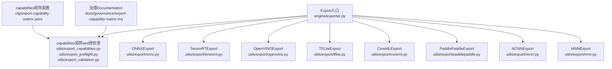
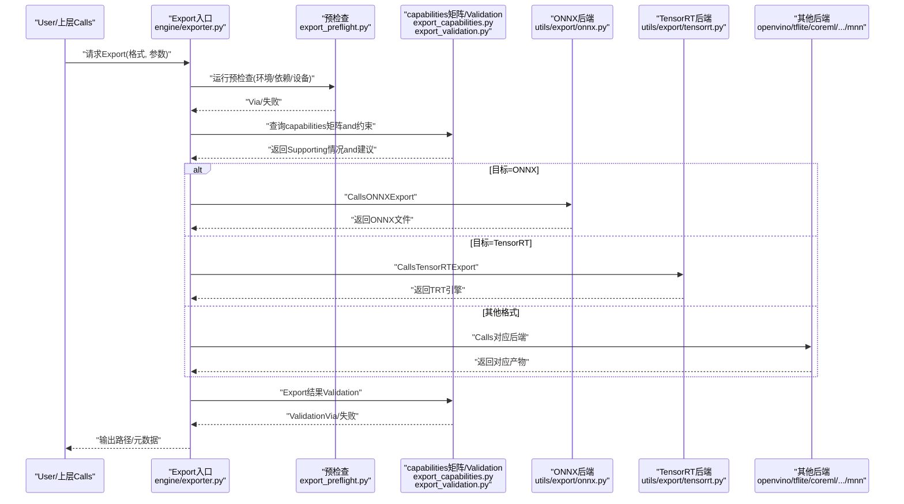
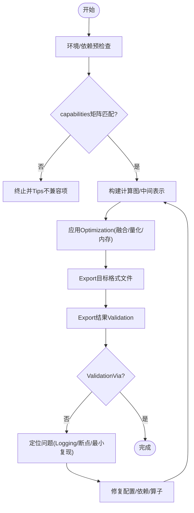
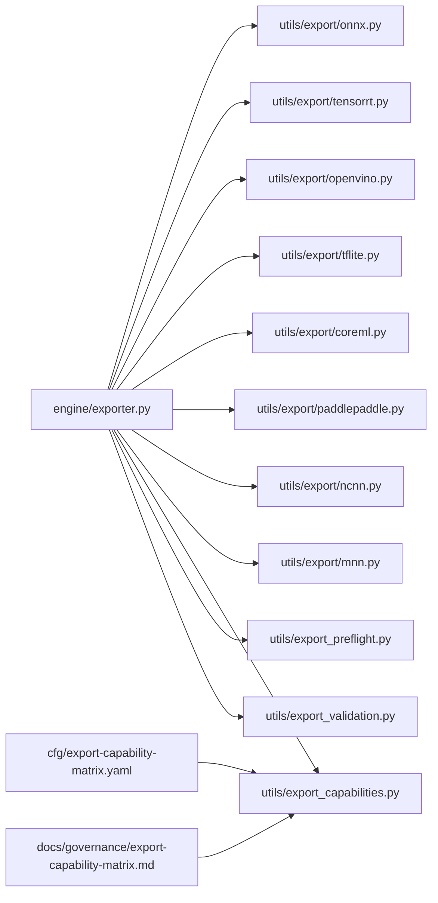

# Export Format Support

<cite>
**Files Referenced in This Document**
- [ultralytics/engine/exporter.py](file://ultralytics/engine/exporter.py)
- [ultralytics/utils/export/__init__.py](file://ultralytics/utils/export/__init__.py)
- [ultralytics/utils/export/onnx.py](file://ultralytics/utils/export/onnx.py)
- [ultralytics/utils/export/tensorrt.py](file://ultralytics/utils/export/tensorrt.py)
- [ultralytics/utils/export/openvino.py](file://ultralytics/utils/export/openvino.py)
- [ultralytics/utils/export/tflite.py](file://ultralytics/utils/export/tflite.py)
- [ultralytics/utils/export/coreml.py](file://ultralytics/utils/export/coreml.py)
- [ultralytics/utils/export/paddlepaddle.py](file://ultralytics/utils/export/paddlepaddle.py)
- [ultralytics/utils/export/ncnn.py](file://ultralytics/utils/export/ncnn.py)
- [ultralytics/utils/export/mnn.py](file://ultralytics/utils/export/mnn.py)
- [ultralytics/utils/export_capabilities.py](file://ultralytics/utils/export_capabilities.py)
- [ultralytics/utils/export_preflight.py](file://ultralytics/utils/export_preflight.py)
- [ultralytics/utils/export_validation.py](file://ultralytics/utils/export_validation.py)
- [ultralytics/cfg/export-capability-matrix.yaml](file://ultralytics/cfg/export-capability-matrix.yaml)
- [docs/governance/export-capability-matrix.md](file://docs/governance/export-capability-matrix.md)
- [examples/YOLO-Master-Cross-Platform-Edge-Deployment/coreml_export/export_coreml.py](file://examples/YOLO-Master-Cross-Platform-Edge-Deployment/coreml_export/export_coreml.py)
- [examples/YOLO-Master-Edge-Deployment/export_edge_models.py](file://examples/YOLO-Master-Edge-Deployment/export_edge_models.py)
- [tests/test_exports.py](file://tests/test_exports.py)
- [tests/test_export_capability_matrix.py](file://tests/test_export_capability_matrix.py)
- [tests/test_export_preflight.py](file://tests/test_export_preflight.py)
- [tests/test_export_roundtrip.py](file://tests/test_export_roundtrip.py)
</cite>

## Table of Contents
1. [Introduction](#Introduction)
2. [Project Structure](#Project Structure)
3. [Core Components](#Core Components)
4. [Architecture Overview](#Architecture Overview)
5. [Detailed Component Analysis](#Detailed Component Analysis)
6. [Dependency Analysis](#Dependency Analysis)
7. [性能andOptimization](#性能andOptimization)
8. [Troubleshooting Guide](#Troubleshooting Guide)
9. [Conclusion](#Conclusion)
10. [Appendix](#Appendix)

## Introduction
本文件targetingYOLO-Master的Model Export子系统，系统化说明Supporting的Export格式（ONNX、TensorRT、OpenVINO、TFLite、CoreML、PaddlePaddle、NCNN、MNNetc.）的转换流程、参数配置、Applicable Scenarios、性能特点and限制条件。Documentation同时覆盖Export选项andOptimization工具链（算子融合、量化压缩、内存Optimization）、不同格式的转换Examplesand最佳实践、兼容性矩阵and版本要求、错误处理and调试方法，Centered onand自定义Export Backends的开发指南。

## Project Structure
Export相关代码主要分布whileCentered on下位置：
- 统一Export入口and编排：engine层Exporter
- 各后端专用Exportimplementing：utils/export下按格式划分的Modules
- capabilities矩阵and预检查：export_capabilities、export_preflight、export_validation
- 配置and治理：export-capability-matrix.yaml、governanceDocumentation
- Examplesand测试：examplesandtests中对应脚本and用例

Figure Source
- [ultralytics/engine/exporter.py](file://ultralytics/engine/exporter.py)
- [ultralytics/utils/export/onnx.py](file://ultralytics/utils/export/onnx.py)
- [ultralytics/utils/export/tensorrt.py](file://ultralytics/utils/export/tensorrt.py)
- [ultralytics/utils/export/openvino.py](file://ultralytics/utils/export/openvino.py)
- [ultralytics/utils/export/tflite.py](file://ultralytics/utils/export/tflite.py)
- [ultralytics/utils/export/coreml.py](file://ultralytics/utils/export/coreml.py)
- [ultralytics/utils/export/paddlepaddle.py](file://ultralytics/utils/export/paddlepaddle.py)
- [ultralytics/utils/export/ncnn.py](file://ultralytics/utils/export/ncnn.py)
- [ultralytics/utils/export/mnn.py](file://ultralytics/utils/export/mnn.py)
- [ultralytics/utils/export_capabilities.py](file://ultralytics/utils/export_capabilities.py)
- [ultralytics/utils/export_preflight.py](file://ultralytics/utils/export_preflight.py)
- [ultralytics/utils/export_validation.py](file://ultralytics/utils/export_validation.py)
- [ultralytics/cfg/export-capability-matrix.yaml](file://ultralytics/cfg/export-capability-matrix.yaml)
- [docs/governance/export-capability-matrix.md](file://docs/governance/export-capability-matrix.md)

Section Source
- [ultralytics/engine/exporter.py](file://ultralytics/engine/exporter.py)
- [ultralytics/utils/export/__init__.py](file://ultralytics/utils/export/__init__.py)
- [ultralytics/utils/export_capabilities.py](file://ultralytics/utils/export_capabilities.py)
- [ultralytics/utils/export_preflight.py](file://ultralytics/utils/export_preflight.py)
- [ultralytics/utils/export_validation.py](file://ultralytics/utils/export_validation.py)
- [ultralytics/cfg/export-capability-matrix.yaml](file://ultralytics/cfg/export-capability-matrix.yaml)
- [docs/governance/export-capability-matrix.md](file://docs/governance/export-capability-matrix.md)

## Core Components
- 统一Export入口（engine/exporter.py）
  - 负责解析Export目标格式、调度预检查、Calls具体后端implementing、输出产物and元数据。
  - provides统一的参数接口（such as动态输入、精度、Optimization开关），并Encapsulates错误andLogging。
- capabilities矩阵and预检查（export_capabilities.py、export_preflight.py、export_validation.py）
  - export_capabilities：维护各格式的capabilities清单（是否SupportingTasks类型、动态维度、量化、算子集）。
  - export_preflight：whileExport前进行环境、依赖、设备、版本校验and冲突检测。
  - export_validation：对Export结果进行基本一致性Validation（形状、数值范围、关键节点存while性）。
- 各格式后端（utils/export/*）
  - onnx.py：构建ONNX图、设置动态轴、Exportonnx文件；可Combined with后续工具链进行Optimization。
  - tensorrt.py：基于ONNX生成TensorRT引擎，SupportingFP16/INT8、层融合、内核选择策略。
  - openvino.py：将模型转换forOpenVINO IR（IR+weights或bin），SupportingI/OOptimizationandCPU/GPU加速。
  - tflite.py：Exporting toTFLite模型，Supporting量化（FP16/INT8）、NPU后端选择。
  - coreml.py：Exporting toCoreML模型，适配iOS/macOSInference，SupportingMetal后端。
  - paddlepaddle.py：Exporting toPaddlePaddle静态图，便于Paddle部署生态Uses。
  - ncnn.py：Exporting toNCNN模型，targeting移动端/嵌入式高性能Inference。
  - mnn.py：Exporting toMNN模型，targeting多平台轻量级部署。

Section Source
- [ultralytics/engine/exporter.py](file://ultralytics/engine/exporter.py)
- [ultralytics/utils/export/onnx.py](file://ultralytics/utils/export/onnx.py)
- [ultralytics/utils/export/tensorrt.py](file://ultralytics/utils/export/tensorrt.py)
- [ultralytics/utils/export/openvino.py](file://ultralytics/utils/export/openvino.py)
- [ultralytics/utils/export/tflite.py](file://ultralytics/utils/export/tflite.py)
- [ultralytics/utils/export/coreml.py](file://ultralytics/utils/export/coreml.py)
- [ultralytics/utils/export/paddlepaddle.py](file://ultralytics/utils/export/paddlepaddle.py)
- [ultralytics/utils/export/ncnn.py](file://ultralytics/utils/export/ncnn.py)
- [ultralytics/utils/export/mnn.py](file://ultralytics/utils/export/mnn.py)
- [ultralytics/utils/export_capabilities.py](file://ultralytics/utils/export_capabilities.py)
- [ultralytics/utils/export_preflight.py](file://ultralytics/utils/export_preflight.py)
- [ultralytics/utils/export_validation.py](file://ultralytics/utils/export_validation.py)

## Architecture Overview
Export系统采用“前端编排 + 后端插件”的架构。Unified entry point根据目标格式选择相应后端，并while执行前后插入capabilities检查and结果Validation。

Figure Source
- [ultralytics/engine/exporter.py](file://ultralytics/engine/exporter.py)
- [ultralytics/utils/export/onnx.py](file://ultralytics/utils/export/onnx.py)
- [ultralytics/utils/export/tensorrt.py](file://ultralytics/utils/export/tensorrt.py)
- [ultralytics/utils/export/openvino.py](file://ultralytics/utils/export/openvino.py)
- [ultralytics/utils/export/tflite.py](file://ultralytics/utils/export/tflite.py)
- [ultralytics/utils/export/coreml.py](file://ultralytics/utils/export/coreml.py)
- [ultralytics/utils/export/paddlepaddle.py](file://ultralytics/utils/export/paddlepaddle.py)
- [ultralytics/utils/export/ncnn.py](file://ultralytics/utils/export/ncnn.py)
- [ultralytics/utils/export/mnn.py](file://ultralytics/utils/export/mnn.py)
- [ultralytics/utils/export_capabilities.py](file://ultralytics/utils/export_capabilities.py)
- [ultralytics/utils/export_preflight.py](file://ultralytics/utils/export_preflight.py)
- [ultralytics/utils/export_validation.py](file://ultralytics/utils/export_validation.py)

## Detailed Component Analysis

### ONNXExport
- 功能要点
  - 从PyTorchModel ExportforONNX，Supporting动态输入维度、批量大小、图像尺寸etc.。
  - 可and外部工具链集成进行进一步Optimization（such as算子融合、常量折叠）。
- 典型参数
  - 动态轴配置、输入形状、Export路径、opset版本、简化/Optimization开关。
- Applicable Scenarios
  - 跨框架通用交换格式，作for中间表示用于TensorRT/OpenVINO/TFLiteetc.二次转换。
- 性能and限制
  - 取决于目标运行时and算子Supporting；部分复杂算子可能需要自定义或降级。
- Refer toimplementing路径
  - [onnx.py](file://ultralytics/utils/export/onnx.py)

Section Source
- [ultralytics/utils/export/onnx.py](file://ultralytics/utils/export/onnx.py)

### TensorRTExport
- 功能要点
  - 基于ONNX构建TensorRT引擎，SupportingFP16/INT8量化、层融合、内核自动选择。
  - 可配置最大工作空间、Optimization级别、目标GPU架构。
- 典型参数
  - 精度模式、校准数据集（INT8）、最大批大小、动态输入、Optimization级别。
- Applicable Scenarios
  - NVIDIA GPU高吞吐低延迟Inference，适合服务器端and边缘GPU。
- 性能and限制
  - 需要兼容的CUDA/cuDNN/TRT版本；某些动态特性可能受限。
- Refer toimplementing路径
  - [tensorrt.py](file://ultralytics/utils/export/tensorrt.py)

Section Source
- [ultralytics/utils/export/tensorrt.py](file://ultralytics/utils/export/tensorrt.py)

### OpenVINOExport
- 功能要点
  - Exporting toOpenVINO IR（XML+BIN或ONNX直出），SupportingCPU/GPU/VPUetc.多后端。
  - 可进行I/OOptimization、常量传播、算子替换。
- 典型参数
  - 输入形状、动态维度、Optimization级别、目标设备、IR保存路径。
- Applicable Scenarios
  - Intel CPU/核显/Movidiusetc.硬件的高效Inference。
- 性能and限制
  - 需安装OpenVINO运行时；部分动态特性受限于IR规格。
- Refer toimplementing路径
  - [openvino.py](file://ultralytics/utils/export/openvino.py)

Section Source
- [ultralytics/utils/export/openvino.py](file://ultralytics/utils/export/openvino.py)

### TFLiteExport
- 功能要点
  - Exporting toTFLite模型，SupportingFP16/INT8量化，适配Android/iOS/NPU。
- 典型参数
  - 量化模式、代表数据集（INT8）、输入形状、Optimizer开关。
- Applicable Scenarios
  - 移动端and嵌入式设备，尤其是Google Edge TPUand手机NPU。
- 性能and限制
  - 量化可能带来精度损失；需确保算子被目标NPUSupporting。
- Refer toimplementing路径
  - [tflite.py](file://ultralytics/utils/export/tflite.py)

Section Source
- [ultralytics/utils/export/tflite.py](file://ultralytics/utils/export/tflite.py)

### CoreMLExport
- 功能要点
  - Exporting toCoreML模型，适配iOS/macOSInference，SupportingMetal后端。
- 典型参数
  - 输入形状、动态维度、Model Compression、目标平台版本。
- Applicable Scenarios
  - Apple生态设备的高能效Inference。
- 性能and限制
  - 依赖macOSandCoreML工具链；动态特性有限制。
- Refer toimplementing路径
  - [coreml.py](file://ultralytics/utils/export/coreml.py)
  - Examples脚本：[export_coreml.py](file://examples/YOLO-Master-Cross-Platform-Edge-Deployment/coreml_export/export_coreml.py)

Section Source
- [ultralytics/utils/export/coreml.py](file://ultralytics/utils/export/coreml.py)
- [examples/YOLO-Master-Cross-Platform-Edge-Deployment/coreml_export/export_coreml.py](file://examples/YOLO-Master-Cross-Platform-Edge-Deployment/coreml_export/export_coreml.py)

### PaddlePaddleExport
- 功能要点
  - Exporting toPaddlePaddle静态图，便于Paddle部署生态Uses。
- 典型参数
  - 输入形状、动态维度、保存路径。
- Applicable Scenarios
  - UsesPaddle Serving/Paddle Lite的部署场景。
- 性能and限制
  - 依赖PaddlePaddleExport工具链；部分动态特性受限。
- Refer toimplementing路径
  - [paddlepaddle.py](file://ultralytics/utils/export/paddlepaddle.py)

Section Source
- [ultralytics/utils/export/paddlepaddle.py](file://ultralytics/utils/export/paddlepaddle.py)

### NCNNExport
- 功能要点
  - Exporting toNCNN模型，targeting移动端/嵌入式高性能Inference。
- 典型参数
  - 输入形状、动态维度、Optimization开关。
- Applicable Scenarios
  - Android/iOS/ARM平台的轻量级部署。
- 性能and限制
  - 依赖NCNN工具链；动态特性有限。
- Refer toimplementing路径
  - [ncnn.py](file://ultralytics/utils/export/ncnn.py)

Section Source
- [ultralytics/utils/export/ncnn.py](file://ultralytics/utils/export/ncnn.py)

### MNNExport
- 功能要点
  - Exporting toMNN模型，targeting多平台轻量级部署。
- 典型参数
  - 输入形状、动态维度、Optimization开关。
- Applicable Scenarios
  - 阿里生态and多平台Mobile Deployment。
- 性能and限制
  - 依赖MNN工具链；动态特性有限。
- Refer toimplementing路径
  - [mnn.py](file://ultralytics/utils/export/mnn.py)

Section Source
- [ultralytics/utils/export/mnn.py](file://ultralytics/utils/export/mnn.py)

### Export流程and参数配置（通用）
- Unified entry point参数
  - 目标格式、输入形状/动态轴、精度模式、Optimization开关、输出路径、Logging级别。
- 预检查andcapabilities矩阵
  - 环境依赖、设备可用性、版本兼容性、Tasks类型Supporting。
- Export后Validation
  - 基本形状/数值范围检查、关键节点存while性、and原始模型对比（Optional）。

Figure Source
- [ultralytics/engine/exporter.py](file://ultralytics/engine/exporter.py)
- [ultralytics/utils/export_capabilities.py](file://ultralytics/utils/export_capabilities.py)
- [ultralytics/utils/export_preflight.py](file://ultralytics/utils/export_preflight.py)
- [ultralytics/utils/export_validation.py](file://ultralytics/utils/export_validation.py)

Section Source
- [ultralytics/engine/exporter.py](file://ultralytics/engine/exporter.py)
- [ultralytics/utils/export_capabilities.py](file://ultralytics/utils/export_capabilities.py)
- [ultralytics/utils/export_preflight.py](file://ultralytics/utils/export_preflight.py)
- [ultralytics/utils/export_validation.py](file://ultralytics/utils/export_validation.py)

### Examplesand最佳实践
- Examples脚本
  - CoreMLExportExamples：[export_coreml.py](file://examples/YOLO-Master-Cross-Platform-Edge-Deployment/coreml_export/export_coreml.py)
  - 边缘模型批量ExportExamples：[export_edge_models.py](file://examples/YOLO-Master-Edge-Deployment/export_edge_models.py)
- 最佳实践
  - 先ExportONNX再转目标格式，便于统一调试andOptimization。
  - 针对目标Device Selection合适的精度and量化策略，并进行回归Validation。
  - 固定输入形状Centered on最大化Optimization收益；动态输入仅while必要时启用。
  - 记录Export配置and环境信息，便于复现and审计。

Section Source
- [examples/YOLO-Master-Cross-Platform-Edge-Deployment/coreml_export/export_coreml.py](file://examples/YOLO-Master-Cross-Platform-Edge-Deployment/coreml_export/export_coreml.py)
- [examples/YOLO-Master-Edge-Deployment/export_edge_models.py](file://examples/YOLO-Master-Edge-Deployment/export_edge_models.py)

### 兼容性矩阵and版本要求
- capabilities矩阵配置
  - 集中定义各格式的TasksSupporting、动态维度、量化、算子覆盖etc.信息。
- 治理Documentation
  - provides矩阵解读、版本约束and演进策略。
- 建议
  - whileExport前读取capabilities矩阵，避免不Supporting的组合；遇to新特性时更新矩阵and预检查逻辑。

Section Source
- [ultralytics/cfg/export-capability-matrix.yaml](file://ultralytics/cfg/export-capability-matrix.yaml)
- [docs/governance/export-capability-matrix.md](file://docs/governance/export-capability-matrix.md)

### 错误处理and调试方法
- 常见错误类别
  - 环境/依赖缺失、版本不兼容、算子不Supporting、动态维度非法、量化校准失败。
- 调试手段
  - 开启详细Logging、最小化输入复现、分阶段Export（先ONNX再目标格式）、逐层Validation。
- 自动化Validation
  - UsesExportValidationModules进行基础一致性检查；Combining端to端测试用例。

Section Source
- [ultralytics/utils/export_preflight.py](file://ultralytics/utils/export_preflight.py)
- [ultralytics/utils/export_validation.py](file://ultralytics/utils/export_validation.py)
- [tests/test_export_preflight.py](file://tests/test_export_preflight.py)
- [tests/test_export_roundtrip.py](file://tests/test_export_roundtrip.py)

### 自定义Export Backends开发指南
- 步骤概览
  - 新增后端implementing文件（such as utils/export/custom_backend.py），遵循Unified Interface约定。
  - whileExport入口注册新后端，使其能被Unified entry point识别and调度。
  - 更新capabilities矩阵and预检查逻辑，声明新后端的Supporting范围and约束。
  - 编写单元测试andExamples脚本，覆盖正常路径and异常分支。
- 接口约定
  - 输入：模型对象、Export参数、输出路径。
  - 输出：目标格式文件路径、元数据（输入形状、精度、Optimization信息etc.）。
  - 错误：抛出明确异常并provides上下文信息。
- Refer toimplementing
  - Refer to现有后端（onnx/tensorrt/openvinoetc.）的implementing风格and错误处理。

Section Source
- [ultralytics/engine/exporter.py](file://ultralytics/engine/exporter.py)
- [ultralytics/utils/export/onnx.py](file://ultralytics/utils/export/onnx.py)
- [ultralytics/utils/export/tensorrt.py](file://ultralytics/utils/export/tensorrt.py)
- [ultralytics/utils/export/openvino.py](file://ultralytics/utils/export/openvino.py)
- [ultralytics/utils/export/tflite.py](file://ultralytics/utils/export/tflite.py)
- [ultralytics/utils/export/coreml.py](file://ultralytics/utils/export/coreml.py)
- [ultralytics/utils/export/paddlepaddle.py](file://ultralytics/utils/export/paddlepaddle.py)
- [ultralytics/utils/export/ncnn.py](file://ultralytics/utils/export/ncnn.py)
- [ultralytics/utils/export/mnn.py](file://ultralytics/utils/export/mnn.py)
- [ultralytics/utils/export_capabilities.py](file://ultralytics/utils/export_capabilities.py)
- [ultralytics/utils/export_preflight.py](file://ultralytics/utils/export_preflight.py)

## Dependency Analysis
Export系统内部依赖关系such as下：

Figure Source
- [ultralytics/engine/exporter.py](file://ultralytics/engine/exporter.py)
- [ultralytics/utils/export/onnx.py](file://ultralytics/utils/export/onnx.py)
- [ultralytics/utils/export/tensorrt.py](file://ultralytics/utils/export/tensorrt.py)
- [ultralytics/utils/export/openvino.py](file://ultralytics/utils/export/openvino.py)
- [ultralytics/utils/export/tflite.py](file://ultralytics/utils/export/tflite.py)
- [ultralytics/utils/export/coreml.py](file://ultralytics/utils/export/coreml.py)
- [ultralytics/utils/export/paddlepaddle.py](file://ultralytics/utils/export/paddlepaddle.py)
- [ultralytics/utils/export/ncnn.py](file://ultralytics/utils/export/ncnn.py)
- [ultralytics/utils/export/mnn.py](file://ultralytics/utils/export/mnn.py)
- [ultralytics/utils/export_capabilities.py](file://ultralytics/utils/export_capabilities.py)
- [ultralytics/utils/export_preflight.py](file://ultralytics/utils/export_preflight.py)
- [ultralytics/utils/export_validation.py](file://ultralytics/utils/export_validation.py)
- [ultralytics/cfg/export-capability-matrix.yaml](file://ultralytics/cfg/export-capability-matrix.yaml)
- [docs/governance/export-capability-matrix.md](file://docs/governance/export-capability-matrix.md)

Section Source
- [ultralytics/engine/exporter.py](file://ultralytics/engine/exporter.py)
- [ultralytics/utils/export_capabilities.py](file://ultralytics/utils/export_capabilities.py)
- [ultralytics/utils/export_preflight.py](file://ultralytics/utils/export_preflight.py)
- [ultralytics/utils/export_validation.py](file://ultralytics/utils/export_validation.py)
- [ultralytics/cfg/export-capability-matrix.yaml](file://ultralytics/cfg/export-capability-matrix.yaml)
- [docs/governance/export-capability-matrix.md](file://docs/governance/export-capability-matrix.md)

## 性能andOptimization
- 算子融合
  - whileONNX阶段或目标运行时启用融合，减少内核启动开销。
- 量化压缩
  - FP16/INT8量化显著降低内存and带宽需求；需校准数据保证精度。
- 内存Optimization
  - 固定输入形状、禁用不必要的动态特性、裁剪未用分支。
- 运行时选择
  - 根据目标Device Selection最优后端（GPU/CPU/NPU/Edge TPU/CoreML）。
- 基准and回归
  - 建立Export前后性能基线，持续监控延迟and吞吐变化。

[本节for通用指导，无需特定文件引用]

## Troubleshooting Guide
- 预检查失败
  - 检查依赖安装、版本匹配、设备可用性and权限。
- Export Failure
  - 确认输入形状合法、动态维度合理、目标格式Supporting该Tasks。
- 精度下降
  - 调整量化策略、增加校准样本、回退to更高精度。
- 运行时崩溃
  - 核对运行时版本、算子Supporting列表、模型输入输出签名。
- 自动化测试
  - UsesExportcapabilities矩阵测试and端to端回归测试快速定位问题。

Section Source
- [tests/test_export_preflight.py](file://tests/test_export_preflight.py)
- [tests/test_export_roundtrip.py](file://tests/test_export_roundtrip.py)
- [tests/test_exports.py](file://tests/test_exports.py)
- [tests/test_export_capability_matrix.py](file://tests/test_export_capability_matrix.py)

## Conclusion
YOLO-Master的Export系统ViaUnified entry pointandModules化后端implementing了多格式、多平台的Model Exportcapabilities。借助capabilities矩阵and预检查机制，系统while兼容性、稳定性and可维护性方面具备良好保障。推荐Centered onONNXfor中间表示，Combining目标运行时的Optimization工具链，implementing性能and精度的平衡。对于新后端，应遵循Unified Interface、完善capabilities矩阵and测试覆盖，确保整体生态的一致性and可Extensibility。

[本节for总结性内容，无需特定文件引用]

## Appendix
- Examples脚本
  - CoreMLExportExamples：[export_coreml.py](file://examples/YOLO-Master-Cross-Platform-Edge-Deployment/coreml_export/export_coreml.py)
  - 边缘模型批量ExportExamples：[export_edge_models.py](file://examples/YOLO-Master-Edge-Deployment/export_edge_models.py)
- 测试用例
  - Exportcapabilities矩阵测试：[test_export_capability_matrix.py](file://tests/test_export_capability_matrix.py)
  - Export预检查测试：[test_export_preflight.py](file://tests/test_export_preflight.py)
  - Export端to端测试：[test_export_roundtrip.py](file://tests/test_export_roundtrip.py)
  - Export综合测试：[test_exports.py](file://tests/test_exports.py)

Section Source
- [examples/YOLO-Master-Cross-Platform-Edge-Deployment/coreml_export/export_coreml.py](file://examples/YOLO-Master-Cross-Platform-Edge-Deployment/coreml_export/export_coreml.py)
- [examples/YOLO-Master-Edge-Deployment/export_edge_models.py](file://examples/YOLO-Master-Edge-Deployment/export_edge_models.py)
- [tests/test_export_capability_matrix.py](file://tests/test_export_capability_matrix.py)
- [tests/test_export_preflight.py](file://tests/test_export_preflight.py)
- [tests/test_export_roundtrip.py](file://tests/test_export_roundtrip.py)
- [tests/test_exports.py](file://tests/test_exports.py)