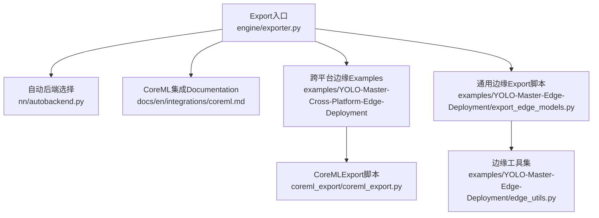
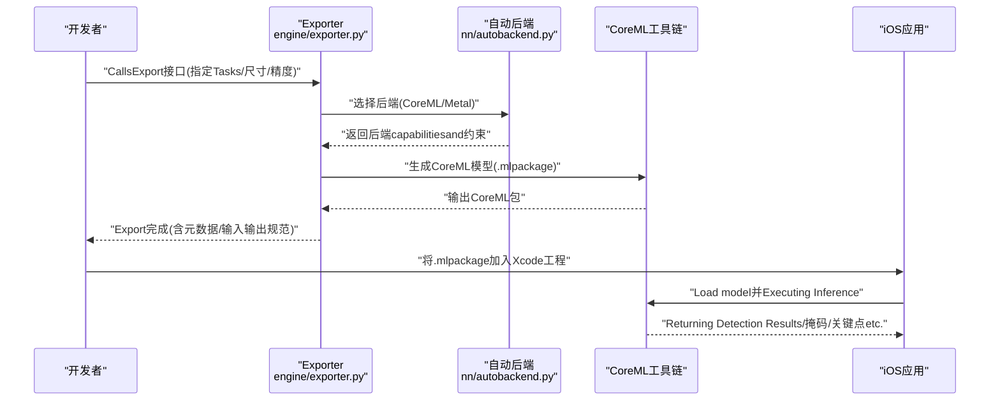
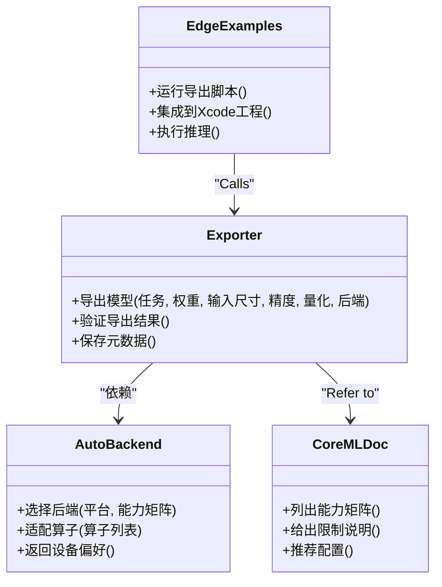
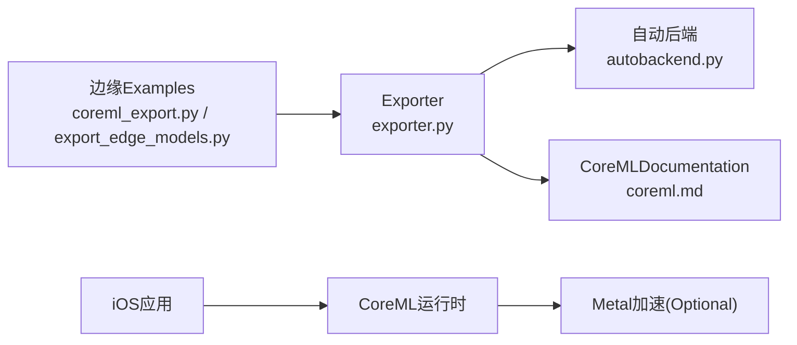

# CoreML移动端Export

<cite>
**Files Referenced in This Document**
- [exporter.py](file://ultralytics/engine/exporter.py)
- [autobackend.py](file://ultralytics/nn/autobackend.py)
- [coreml.md](file://docs/en/integrations/coreml.md)
- [README.md](file://examples/YOLO-Master-Cross-Platform-Edge-Deployment/README.md)
- [TECHNICAL_REPORT.md](file://examples/YOLO-Master-Cross-Platform-Edge-Deployment/TECHNICAL_REPORT.md)
- [coreml_export.py](file://examples/YOLO-Master-Cross-Platform-Edge-Deployment/coreml_export/coreml_export.py)
- [export_edge_models.py](file://examples/YOLO-Master-Edge-Deployment/export_edge_models.py)
- [edge_utils.py](file://examples/YOLO-Master-Edge-Deployment/edge_utils.py)
</cite>

## Table of Contents
1. [Introduction](#Introduction)
2. [Project Structure](#Project Structure)
3. [Core Components](#Core Components)
4. [Architecture Overview](#Architecture Overview)
5. [Detailed Component Analysis](#Detailed Component Analysis)
6. [Dependency Analysis](#Dependency Analysis)
7. [性能andOptimization](#性能andOptimization)
8. [Troubleshooting Guide](#Troubleshooting Guide)
9. [Conclusion](#Conclusion)
10. [Appendix](#Appendix)

## Introduction
本技术Documentation聚焦于将YOLO模型转换forCoreML格式并whileiOS设备上运行的完整流程。内容涵盖：
- CoreMLExport的配置选项、量化设置and性能Optimization参数
- iOS部署环境要求、Xcode集成方法andMetal后端Optimization
- 模型转换、加载andInference的端to端Examples（Centered on代码片段路径形式provides）
- 内存管理策略、实时性能调优and电池UsesOptimization最佳实践
- CoreML框架的限制条件and常见问题解决方案

## Project Structure
andCoreMLExport和Mobile Deployment相关的核心位置such as下：
- 引擎Export入口：ultralytics/engine/exporter.py
- 自动后端选择：ultralytics/nn/autobackend.py
- 官方集成Documentation：docs/en/integrations/coreml.md
- 跨平台Edge DeploymentExamples：examples/YOLO-Master-Cross-Platform-Edge-Deployment
- 通用边缘Export脚本：examples/YOLO-Master-Edge-Deployment

Figure Source
- [exporter.py](file://ultralytics/engine/exporter.py)
- [autobackend.py](file://ultralytics/nn/autobackend.py)
- [coreml.md](file://docs/en/integrations/coreml.md)
- [README.md](file://examples/YOLO-Master-Cross-Platform-Edge-Deployment/README.md)
- [TECHNICAL_REPORT.md](file://examples/YOLO-Master-Cross-Platform-Edge-Deployment/TECHNICAL_REPORT.md)
- [coreml_export.py](file://examples/YOLO-Master-Cross-Platform-Edge-Deployment/coreml_export/coreml_export.py)
- [export_edge_models.py](file://examples/YOLO-Master-Edge-Deployment/export_edge_models.py)
- [edge_utils.py](file://examples/YOLO-Master-Edge-Deployment/edge_utils.py)

Section Source
- [exporter.py](file://ultralytics/engine/exporter.py)
- [autobackend.py](file://ultralytics/nn/autobackend.py)
- [coreml.md](file://docs/en/integrations/coreml.md)
- [README.md](file://examples/YOLO-Master-Cross-Platform-Edge-Deployment/README.md)
- [TECHNICAL_REPORT.md](file://examples/YOLO-Master-Cross-Platform-Edge-Deployment/TECHNICAL_REPORT.md)
- [coreml_export.py](file://examples/YOLO-Master-Cross-Platform-Edge-Deployment/coreml_export/coreml_export.py)
- [export_edge_models.py](file://examples/YOLO-Master-Edge-Deployment/export_edge_models.py)
- [edge_utils.py](file://examples/YOLO-Master-Edge-Deployment/edge_utils.py)

## Core Components
- Export入口and流程编排：负责解析Export参数、构建中间表示（such asONNX）、Calls目标后端转换器，并输出CoreML包。
- 自动后端选择：根据目标平台and可用运行时动态选择最优后端（CoreML/Metaletc.）。
- 集成DocumentationandExamples：providesCoreMLcapabilities矩阵、限制说明Centered onand可复用的Export脚本and工程模板。

Section Source
- [exporter.py](file://ultralytics/engine/exporter.py)
- [autobackend.py](file://ultralytics/nn/autobackend.py)
- [coreml.md](file://docs/en/integrations/coreml.md)

## Architecture Overview
下图展示了从PyTorch模型toCoreML模型的转换链路，Centered onandiOS端的加载andInference流程。

Figure Source
- [exporter.py](file://ultralytics/engine/exporter.py)
- [autobackend.py](file://ultralytics/nn/autobackend.py)
- [coreml.md](file://docs/en/integrations/coreml.md)

## Detailed Component Analysis

### Export入口and参数体系（engine/exporter.py）
- 职责
  - 统一EncapsulatesExport流程：接收Tasks类型（检测/分割/姿态etc.）、输入尺寸、精度and量化选项，协调中间表示and目标后端。
  - 输出CoreML包，附带输入/输出描述and设备偏好（CPU/GPU/NPU）。
- 关键参数维度（概念性说明）
  - Tasksand模型：Tasks类型、权重路径、类别数、输入形状。
  - 精度and量化：半精度/整型量化、校准数据集或统计信息、算子Supporting范围。
  - 设备and后端：CoreML后端选择（CPU/GPU/NPU）、Metal加速开关。
  - Post-Processing：NMS阈值、Confidence Threshold、最大检测数、坐标归一化方式。
- 典型Calls路径
  - Via命令行或Python API触发Export；内部根据后端capabilities矩阵决定是否启用量化and特定Optimization。

Section Source
- [exporter.py](file://ultralytics/engine/exporter.py)

### 自动后端选择（nn/autobackend.py）
- 职责
  - while运行期或Export期判断可用后端and硬件特性，选择最优执行路径（CoreML+Metal优先）。
  - for不同后端provides统一的接口契约，屏蔽底层差异。
- 决策要点
  - 平台可用性（macOS/iOS）、CoreML版本、MetalSupporting情况、内存and算力预算。
  - 针对不Supporting的算子进行回退或替换策略。

Section Source
- [autobackend.py](file://ultralytics/nn/autobackend.py)

### CoreML集成Documentation（docs/en/integrations/coreml.md）
- 内容要点
  - CoreMLcapabilities矩阵：Supporting的模型族、Tasks、输入尺寸、精度and量化选项。
  - 限制and兼容性：不Supporting的算子、动态形状限制、iOS版本要求。
  - 推荐配置：targeting移动端的默认Export参数andOptimization建议。

Section Source
- [coreml.md](file://docs/en/integrations/coreml.md)

### 跨平台Edge DeploymentExamples（examples/YOLO-Master-Cross-Platform-Edge-Deployment）
- 目标
  - provides可while多平台（含iOS/macOS）复现的ExportandInferenceExamples，包含CoreMLExport脚本and工程组织。
- 关键文件
  - README：整体说明andEnvironment Preparation。
  - TECHNICAL_REPORT：技术细节and注意事项。
  - coreml_export/coreml_export.py：CoreMLExport脚本，演示such as何CallsExporter并配置量化and后端。

Section Source
- [README.md](file://examples/YOLO-Master-Cross-Platform-Edge-Deployment/README.md)
- [TECHNICAL_REPORT.md](file://examples/YOLO-Master-Cross-Platform-Edge-Deployment/TECHNICAL_REPORT.md)
- [coreml_export.py](file://examples/YOLO-Master-Cross-Platform-Edge-Deployment/coreml_export/coreml_export.py)

### 通用边缘Export脚本（examples/YOLO-Master-Edge-Deployment）
- 目标
  - provides一键Export多种边缘格式的脚本，包括CoreML，便于批量实验and回归测试。
- 关键文件
  - export_edge_models.py：Unified entry point，按配置Export不同后端格式。
  - edge_utils.py：边缘侧工具函数（such asIO、路径处理、Loggingetc.）。

Section Source
- [export_edge_models.py](file://examples/YOLO-Master-Edge-Deployment/export_edge_models.py)
- [edge_utils.py](file://examples/YOLO-Master-Edge-Deployment/edge_utils.py)

### 类图：Export相关核心类（示意）

Figure Source
- [exporter.py](file://ultralytics/engine/exporter.py)
- [autobackend.py](file://ultralytics/nn/autobackend.py)
- [coreml.md](file://docs/en/integrations/coreml.md)
- [coreml_export.py](file://examples/YOLO-Master-Cross-Platform-Edge-Deployment/coreml_export/coreml_export.py)

## Dependency Analysis
- Modules耦合
  - exporter.py 作编排者，依赖 autobackend.py 的后端选择逻辑，并Refer to coreml.md 的capabilitiesand限制。
  - Examples脚本ViaCallsExporter完成CoreMLExport，随后whileiOS工程中加载Inference。
- External Dependencies
  - CoreML工具链（macOS上用于转换andValidation）
  - iOS CoreML运行时（设备端执行）
  - Metal（Optional，用于GPU加速）

Figure Source
- [exporter.py](file://ultralytics/engine/exporter.py)
- [autobackend.py](file://ultralytics/nn/autobackend.py)
- [coreml.md](file://docs/en/integrations/coreml.md)
- [coreml_export.py](file://examples/YOLO-Master-Cross-Platform-Edge-Deployment/coreml_export/coreml_export.py)
- [export_edge_models.py](file://examples/YOLO-Master-Edge-Deployment/export_edge_models.py)

Section Source
- [exporter.py](file://ultralytics/engine/exporter.py)
- [autobackend.py](file://ultralytics/nn/autobackend.py)
- [coreml.md](file://docs/en/integrations/coreml.md)
- [coreml_export.py](file://examples/YOLO-Master-Cross-Platform-Edge-Deployment/coreml_export/coreml_export.py)
- [export_edge_models.py](file://examples/YOLO-Master-Edge-Deployment/export_edge_models.py)

## 性能andOptimization
- 量化and精度
  - 优先尝试半精度（FP16），若算子受限则回退至FP32；while满足精度的前提下EvaluationINT8量化的收益and风险。
  - Uses代表性校准数据或统计信息，避免分布偏移导致的精度损失。
- 输入尺寸and批大小
  - 移动端建议固定输入尺寸，减少动态形状带来的开销；根据场景调整分辨率and批大小平衡吞吐and延迟。
- 后端and设备
  - 优先启用CoreML+Metal组合Centered on获得GPU加速；必要时对比CPU/GPU/NPUwhile不同机型上的表现。
- Post-ProcessingOptimization
  - Set appropriatelyNMS阈值、Confidence Thresholdand最大检测数，降低不必要的计算。
- 内存and功耗
  - 复用输入缓冲区，避免频繁分配；控制并发Inference线程数，避免过热降频。
  - while后台Tasks中降低帧率或采用事件drivers are installedInference，延长续航。

[This section provides general guidance and does not directly analyze specific files]

## Troubleshooting Guide
- Export Failure或报错
  - 检查CoreML工具链版本andmacOS/iOS系统版本匹配。
  - 核对模型是否包含CoreML不Supporting的算子，Refer tocapabilities矩阵and限制说明。
- 精度异常
  - 确认量化配置and校准数据质量；对比FP32基线定位偏差来源。
  - 检查输入预处理（归一化、通道顺序、尺寸）是否andTraining一致。
- 运行时崩溃或卡顿
  - 检查输入形状and数据类型是否符合Export时的约定。
  - 关闭不必要的并发，观察是否由资源竞争导致。
- 电量消耗过高
  - 降低分辨率或帧率；减少Post-Processing复杂度；避免频繁唤醒GPU。

Section Source
- [coreml.md](file://docs/en/integrations/coreml.md)
- [TECHNICAL_REPORT.md](file://examples/YOLO-Master-Cross-Platform-Edge-Deployment/TECHNICAL_REPORT.md)

## Conclusion
Via将YOLOModel ExportforCoreML并CombiningMetal加速，可Centered onwhileiOS设备上implementing高效的Object Detectionand相关视觉Tasks。建议whileExport阶段充分Evaluationcapabilities矩阵and限制，Combining量化and输入尺寸调优，while精度、延迟and功耗之间取得平衡。利用Examples工程快速落地，并while真实设备上持续监控性能and稳定性。

[This section is summary content and does not directly analyze specific files]

## Appendix
- Quick Start（Centered on代码片段路径代替具体代码）
  - ExportCoreML模型：参见 [coreml_export.py](file://examples/YOLO-Master-Cross-Platform-Edge-Deployment/coreml_export/coreml_export.py)
  - 批量Export边缘模型：参见 [export_edge_models.py](file://examples/YOLO-Master-Edge-Deployment/export_edge_models.py)
  - 边缘工具函数：参见 [edge_utils.py](file://examples/YOLO-Master-Edge-Deployment/edge_utils.py)
- Xcode集成要点
  - 将生成的CoreML包添加to工程资源；确保目标设备and最低系统版本满足要求。
  - while应用中加载CoreML模型，传入符合约定的输入张量，获取检测结果并进行Visualization。
- Refer toDocumentation
  - CoreML集成Documentationandcapabilities矩阵：参见 [coreml.md](file://docs/en/integrations/coreml.md)
  - 跨平台Edge Deployment说明and技术报告：参见 [README.md](file://examples/YOLO-Master-Cross-Platform-Edge-Deployment/README.md)、[TECHNICAL_REPORT.md](file://examples/YOLO-Master-Cross-Platform-Edge-Deployment/TECHNICAL_REPORT.md)