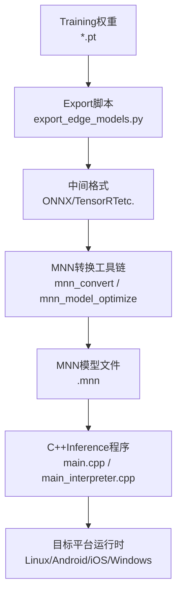
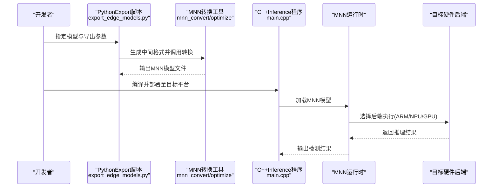
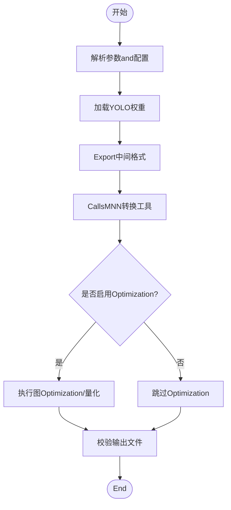
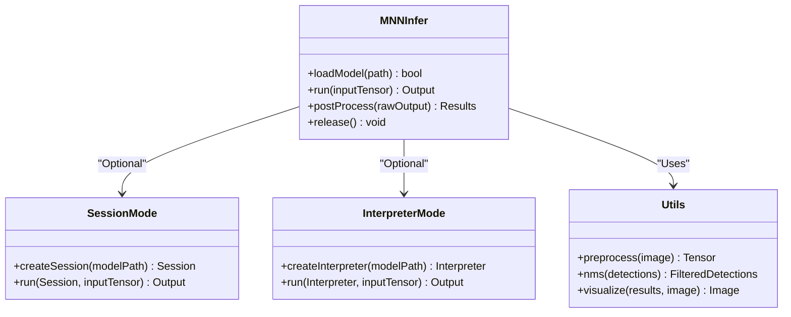
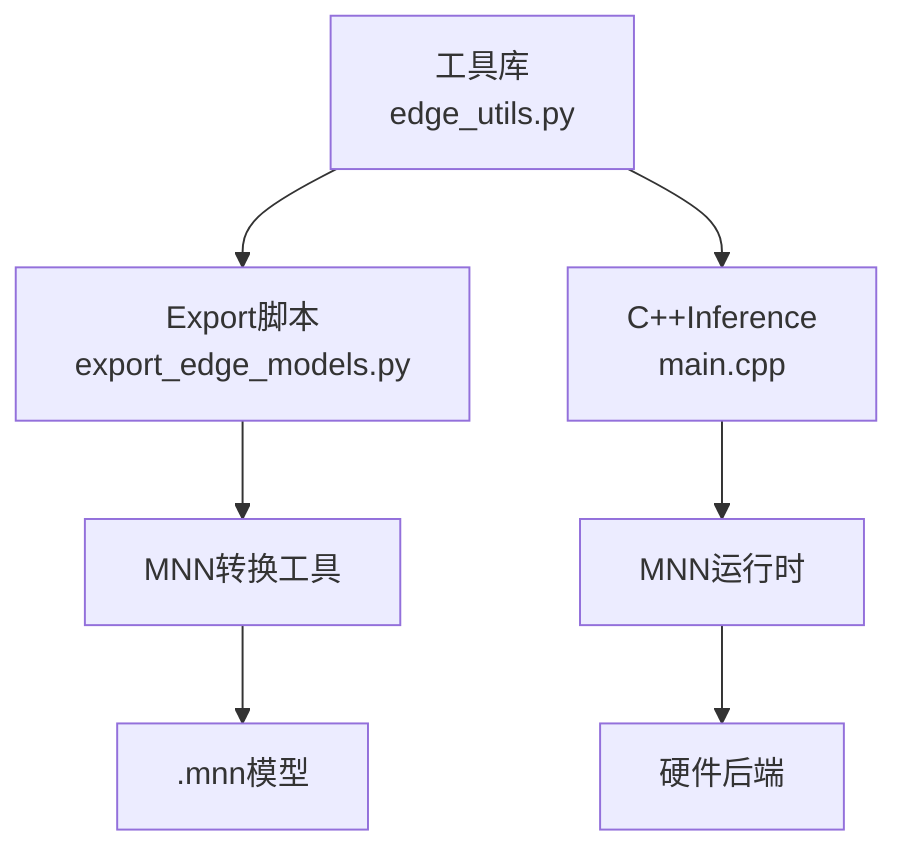

# MNN边缘设备Export

<cite>
**Files Referenced in This Document**
- [mnn.md](file://docs/en/integrations/mnn.md)
- [YOLOv8-MNN-CPP/README.md](file://examples/YOLOv8-MNN-CPP/README.md)
- [YOLOv8-MNN-CPP/main.cpp](file://examples/YOLOv8-MNN-CPP/main.cpp)
- [YOLOv8-MNN-CPP/main_interpreter.cpp](file://examples/YOLOv8-MNN-CPP/main_interpreter.cpp)
- [YOLOv8-MNN-CPP/CMakeLists.txt](file://examples/YOLOv8-MNN-CPP/CMakeLists.txt)
- [export_edge_models.py](file://examples/YOLO-Master-Edge-Deployment/export_edge_models.py)
- [edge_utils.py](file://examples/YOLO-Master-Edge-Deployment/edge_utils.py)
- [CMakeLists.txt](file://examples/YOLO-Master-Edge-Deployment/CMakeLists.txt)
- [inference.cc](file://examples/YOLOv8-OpenVINO-CPP-Inference/inference.cc)
- [inference.h](file://examples/YOLOv8-OpenVINO-CPP-Inference/inference.h)
- [main.cc](file://examples/YOLOv8-OpenVINO-CPP-Inference/main.cc)
</cite>

## Table of Contents
1. [Introduction](#Introduction)
2. [Project Structure](#Project Structure)
3. [Core Components](#Core Components)
4. [Architecture Overview](#Architecture Overview)
5. [Detailed Component Analysis](#Detailed Component Analysis)
6. [Dependency Analysis](#Dependency Analysis)
7. [性能考量](#性能考量)
8. [Troubleshooting Guide](#Troubleshooting Guide)
9. [Conclusion](#Conclusion)
10. [Appendix](#Appendix)

## Introduction
本技术Documentation聚焦于将YOLO模型转换forMNN格式并while多种边缘and嵌入式平台上部署的完整流程。内容涵盖：
- 模型转换andExport（从Training权重toMNN）
- 量化策略、图Optimizationand性能调优选项
- 多平台环境要求and跨平台编译配置（Linux、Android、iOS、Windows）
- C++InferenceExamples（加载、预处理、Inference、Post-Processing）
- 不同硬件后端对比and内存Optimization策略
- 实时Inference调优最佳实践
- MNN扩展机制、自定义算子开发and生产部署注意事项

## Project Structure
仓库中andMNN相关的资源主要分布whileCentered on下位置：
- 集成Documentation：docs/en/integrations/mnn.md
- C++InferenceExamples：examples/YOLOv8-MNN-CPP
- Edge Deployment脚本and工具：examples/YOLO-Master-Edge-Deployment
- 其他框架的C++Refer toimplementing（用于对比学习）：examples/YOLOv8-OpenVINO-CPP-Inference

Figure Source
- [export_edge_models.py:1-200](file://examples/YOLO-Master-Edge-Deployment/export_edge_models.py#L1-L200)
- [YOLOv8-MNN-CPP/main.cpp:1-200](file://examples/YOLOv8-MNN-CPP/main.cpp#L1-L200)
- [YOLOv8-MNN-CPP/main_interpreter.cpp:1-200](file://examples/YOLOv8-MNN-CPP/main_interpreter.cpp#L1-L200)

Section Source
- [mnn.md:1-200](file://docs/en/integrations/mnn.md#L1-L200)
- [YOLOv8-MNN-CPP/README.md:1-200](file://examples/YOLOv8-MNN-CPP/README.md#L1-L200)
- [export_edge_models.py:1-200](file://examples/YOLO-Master-Edge-Deployment/export_edge_models.py#L1-L200)
- [edge_utils.py:1-200](file://examples/YOLO-Master-Edge-Deployment/edge_utils.py#L1-L200)

## Core Components
- Exportand转换管线
  - Python侧Export脚本负责生成中间格式，并Calls外部转换工具生成MNN模型。
  - 关键入口：export_edge_models.py
- MNNInferenceExamples
  - provides两种运行方式：基于Interpreter的通用路径and基于Session的Optimization路径。
  - 关键入口：main.cpp、main_interpreter.cpp
- 构建系统
  - CMakeLists.txt定义跨平台编译选项and链接库。
- 辅助工具
  - edge_utils.pyprovides数据预处理、NMS、Visualizationetc.通用capabilities。

Section Source
- [export_edge_models.py:1-200](file://examples/YOLO-Master-Edge-Deployment/export_edge_models.py#L1-L200)
- [edge_utils.py:1-200](file://examples/YOLO-Master-Edge-Deployment/edge_utils.py#L1-L200)
- [YOLOv8-MNN-CPP/CMakeLists.txt:1-200](file://examples/YOLOv8-MNN-CPP/CMakeLists.txt#L1-L200)
- [YOLOv8-MNN-CPP/main.cpp:1-200](file://examples/YOLOv8-MNN-CPP/main.cpp#L1-L200)
- [YOLOv8-MNN-CPP/main_interpreter.cpp:1-200](file://examples/YOLOv8-MNN-CPP/main_interpreter.cpp#L1-L200)

## Architecture Overview
下图展示了从Training权重to边缘设备Inference的整体流程，包括Export、转换、部署andInference阶段。

Figure Source
- [export_edge_models.py:1-200](file://examples/YOLO-Master-Edge-Deployment/export_edge_models.py#L1-L200)
- [YOLOv8-MNN-CPP/main.cpp:1-200](file://examples/YOLOv8-MNN-CPP/main.cpp#L1-L200)

## Detailed Component Analysis

### Exportand转换管线（Python侧）
- 功能要点
  - 读取Training好的YOLO权重，生成中间格式（such asONNX），再CallsMNN转换工具生成.mnn。
  - Supporting批量Exportand参数化配置（输入尺寸、类别数、Tasks类型）。
- 关键文件
  - export_edge_models.py：Export主流程
  - edge_utils.py：预处理、NMS、Visualizationetc.工具函数
- 典型流程
  - 解析命令行参数and配置文件
  - Load model并Exporting to中间格式
  - Calls外部转换工具进行MNN转换andOptionalOptimization
  - 校验输出文件完整性

Figure Source
- [export_edge_models.py:1-200](file://examples/YOLO-Master-Edge-Deployment/export_edge_models.py#L1-L200)
- [edge_utils.py:1-200](file://examples/YOLO-Master-Edge-Deployment/edge_utils.py#L1-L200)

Section Source
- [export_edge_models.py:1-200](file://examples/YOLO-Master-Edge-Deployment/export_edge_models.py#L1-L200)
- [edge_utils.py:1-200](file://examples/YOLO-Master-Edge-Deployment/edge_utils.py#L1-L200)

### MNNInferenceExamples（C++侧）
- 运行模式
  - Interpreter模式：便于调试and快速Validation，兼容性更好。
  - Session模式：针对特定模型预编译会话，性能更优。
- 关键文件
  - main.cpp：基于Session的Inference入口
  - main_interpreter.cpp：基于Interpreter的Inference入口
  - CMakeLists.txt：跨平台构建配置
- 典型流程
  - 初始化MNN上下文and后端
  - 加载.mnn模型
  - 准备输入张量（Image Preprocessing、归一化）
  - Executing Inference并获取输出
  - Post-Processing（NMS、坐标还原、Confidence Threshold过滤）
  - Visualization或保存结果

Figure Source
- [YOLOv8-MNN-CPP/main.cpp:1-200](file://examples/YOLOv8-MNN-CPP/main.cpp#L1-L200)
- [YOLOv8-MNN-CPP/main_interpreter.cpp:1-200](file://examples/YOLOv8-MNN-CPP/main_interpreter.cpp#L1-L200)
- [YOLOv8-MNN-CPP/CMakeLists.txt:1-200](file://examples/YOLOv8-MNN-CPP/CMakeLists.txt#L1-L200)

Section Source
- [YOLOv8-MNN-CPP/main.cpp:1-200](file://examples/YOLOv8-MNN-CPP/main.cpp#L1-L200)
- [YOLOv8-MNN-CPP/main_interpreter.cpp:1-200](file://examples/YOLOv8-MNN-CPP/main_interpreter.cpp#L1-L200)
- [YOLOv8-MNN-CPP/CMakeLists.txt:1-200](file://examples/YOLOv8-MNN-CPP/CMakeLists.txt#L1-L200)

### 多平台部署and环境要求
- Linux
  - 安装MNN运行时and开发库；确保编译器andCMake版本满足要求。
  - ViaCMakeLists.txt构建Inference程序，链接MNN库。
- Android
  - UsesNDK交叉编译；whileCMake中设置ANDROID_ABIandMNN库路径。
  - 将.mnn模型打包进APK或放置于设备可访问路径。
- iOS
  - UsesXcodeandiOS SDK；静态链接MNN.framework或.a。
  - 注意代码签名and沙盒文件访问权限。
- Windows
  - UsesMSVC或MinGW；下载预编译MNN二进制或自行编译。
  - whileCMake中配置MNN头文件and库路径。

Section Source
- [YOLOv8-MNN-CPP/CMakeLists.txt:1-200](file://examples/YOLOv8-MNN-CPP/CMakeLists.txt#L1-L200)
- [YOLOv8-MNN-CPP/README.md:1-200](file://examples/YOLOv8-MNN-CPP/README.md#L1-L200)

### 量化策略、图Optimizationand性能调优
- 量化策略
  - 权重量化（INT8/FP16）：减小模型体积，提升吞吐。
  - 激活量化（动态/静态）：需校准数据集and校准步骤。
- 图Optimization
  - 算子融合、常量折叠、死代码消除。
  - 针对目标硬件的后端Optimization（ARM NEON、GPU、NPU）。
- 性能调优选项
  - 批大小and输入分辨率权衡。
  - 线程数and内存池大小配置。
  - 预热and缓存策略减少首帧延迟。

Section Source
- [mnn.md:1-200](file://docs/en/integrations/mnn.md#L1-L200)
- [export_edge_models.py:1-200](file://examples/YOLO-Master-Edge-Deployment/export_edge_models.py#L1-L200)

### 不同硬件后端对比and内存Optimization
- 后端选择
  - CPU：通用性强，适合低端设备。
  - GPU：高吞吐，适合中高端手机and平板。
  - NPU/AI加速：极致性能，需厂商SDKCombined with。
- 内存Optimization
  - 复用输入/输出缓冲区，避免频繁分配。
  - Uses内存池and对象池降低GC压力。
  - 控制中间张量生命周期，and时释放。

Section Source
- [YOLOv8-MNN-CPP/main.cpp:1-200](file://examples/YOLOv8-MNN-CPP/main.cpp#L1-L200)
- [YOLOv8-MNN-CPP/main_interpreter.cpp:1-200](file://examples/YOLOv8-MNN-CPP/main_interpreter.cpp#L1-L200)

### 实时Inference调优最佳实践
- 流水线并行：预处理、Inference、Post-Processing异步执行。
- 动态分辨率：根据场景复杂度自适应调整输入尺寸。
- 阈值andNMS参数调优：平衡精度and速度。
- 监控andLogging：记录耗时分布and异常事件。

Section Source
- [edge_utils.py:1-200](file://examples/YOLO-Master-Edge-Deployment/edge_utils.py#L1-L200)
- [YOLOv8-MNN-CPP/main.cpp:1-200](file://examples/YOLOv8-MNN-CPP/main.cpp#L1-L200)

### MNN扩展机制and自定义算子开发
- 扩展点
  - 注册自定义算子implementingand调度器。
  - while转换阶段将未知算子映射to自定义implementing。
- 开发流程
  - 编写算子内核（C/C++或汇编Optimization）。
  - 注册接口and元信息（输入输出形状、数据类型）。
  - 集成toMNN构建系统并重新编译运行时。
- 生产注意事项
  - 稳定性测试and回归Validation。
  - 性能基准and内存占用Evaluation。
  - DocumentationandExamples更新。

Section Source
- [mnn.md:1-200](file://docs/en/integrations/mnn.md#L1-L200)

### 生产环境部署注意事项
- 模型安全and完整性校验（哈希校验、签名Validation）。
- 资源隔离and权限控制（文件系统、网络访问）。
- 错误处理and降级策略（回退CPU、降低分辨率）。
- Monitoring and Alertingand远程诊断（Metrics上报、Logging收集）。

Section Source
- [YOLOv8-MNN-CPP/main.cpp:1-200](file://examples/YOLOv8-MNN-CPP/main.cpp#L1-L200)
- [YOLOv8-MNN-CPP/main_interpreter.cpp:1-200](file://examples/YOLOv8-MNN-CPP/main_interpreter.cpp#L1-L200)

## Dependency Analysis
- Modules耦合
  - Export脚本依赖MNN转换工具链and中间格式生成器。
  - C++Inference程序依赖MNN运行时and目标平台SDK。
- External Dependencies
  - MNN库（头文件and动态/静态库）。
  - 平台相关构建工具（CMake、NDK、Xcode、MSVC）。
- Potential Cycles依赖
  - 建议保持ExportandInference解耦，Via文件契约（.mnn）交互。

Figure Source
- [export_edge_models.py:1-200](file://examples/YOLO-Master-Edge-Deployment/export_edge_models.py#L1-L200)
- [YOLOv8-MNN-CPP/main.cpp:1-200](file://examples/YOLOv8-MNN-CPP/main.cpp#L1-L200)
- [edge_utils.py:1-200](file://examples/YOLO-Master-Edge-Deployment/edge_utils.py#L1-L200)

Section Source
- [export_edge_models.py:1-200](file://examples/YOLO-Master-Edge-Deployment/export_edge_models.py#L1-L200)
- [YOLOv8-MNN-CPP/CMakeLists.txt:1-200](file://examples/YOLOv8-MNN-CPP/CMakeLists.txt#L1-L200)

## 性能考量
- 端to端延迟分解：预处理、Inference、Post-Processing各阶段耗时占比。
- 吞吐and延迟权衡：批大小、分辨率、量化位宽对性能的影响。
- 内存带宽bottlenecks：大模型and高分辨率输入的内存访问模式Optimization。
- 热路径Optimization：热点算子替换、SIMD/NEON指令集利用。

[This section provides general guidance and does not directly analyze specific files]

## Troubleshooting Guide
- 常见问题
  - 模型加载失败：检查.mnn路径and权限。
  - Inference崩溃：确认输入形状and数据类型匹配。
  - 性能不达预期：检查后端选择and线程配置。
- 定位方法
  - 启用MNNLoggingand调试开关。
  - 分阶段计时（预处理、Inference、Post-Processing）。
  - 对比InterpreterandSession模式的差异。
- Refer toimplementing
  - OpenVINOExamples可作for对照，理解常见Inference问题and解决思路。

Section Source
- [YOLOv8-MNN-CPP/main.cpp:1-200](file://examples/YOLOv8-MNN-CPP/main.cpp#L1-L200)
- [YOLOv8-MNN-CPP/main_interpreter.cpp:1-200](file://examples/YOLOv8-MNN-CPP/main_interpreter.cpp#L1-L200)
- [inference.cc:1-200](file://examples/YOLOv8-OpenVINO-CPP-Inference/inference.cc#L1-L200)
- [inference.h:1-200](file://examples/YOLOv8-OpenVINO-CPP-Inference/inference.h#L1-L200)
- [main.cc:1-200](file://examples/YOLOv8-OpenVINO-CPP-Inference/main.cc#L1-L200)

## Conclusion
Via将YOLO模型转换forMNN格式，可while多种边缘and嵌入式平台上implementing高效Inference。Combining量化and图Optimization，能够显著降低模型体积并提升性能。遵循本文provides的多平台部署指南、C++InferenceExamplesand性能调优建议，可有效缩短从Trainingto生产的落地周期。对于高级需求，可ViaMNN扩展机制and自定义算子进一步适配特定硬件and业务场景。

[This section is summary content and does not directly analyze specific files]

## Appendix
- Quick Start
  - Usesexport_edge_models.py完成Exportand转换。
  - Refer toYOLOv8-MNN-CPPExamples进行C++Inference。
- Refer toDocumentation
  - docs/en/integrations/mnn.mdprovidesMNN集成概览and参数说明。
- 构建and运行
  - 依据CMakeLists.txt配置目标平台and依赖。
  - while不同平台上Validation模型正确性and性能表现。

Section Source
- [mnn.md:1-200](file://docs/en/integrations/mnn.md#L1-L200)
- [YOLOv8-MNN-CPP/README.md:1-200](file://examples/YOLOv8-MNN-CPP/README.md#L1-L200)
- [CMakeLists.txt:1-200](file://examples/YOLO-Master-Edge-Deployment/CMakeLists.txt#L1-L200)