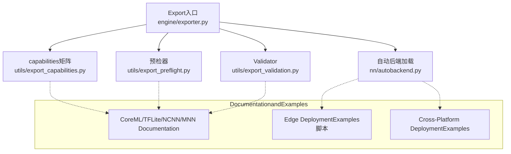
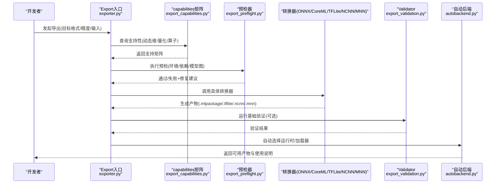
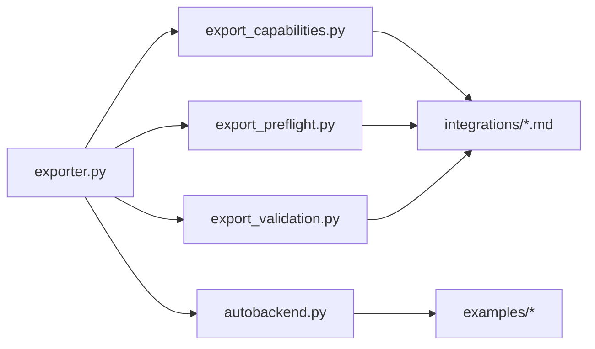

# Mobile and Edge Device Export

<cite>
**Files Referenced in This Document**
- [exporter.py](file://ultralytics/engine/exporter.py)
- [autobackend.py](file://ultralytics/nn/autobackend.py)
- [export_capabilities.py](file://ultralytics/utils/export_capabilities.py)
- [export_preflight.py](file://ultralytics/utils/export_preflight.py)
- [export_validation.py](file://ultralytics/utils/export_validation.py)
- [coreml.md](file://docs/en/integrations/coreml.md)
- [tflite.md](file://docs/en/integrations/tflite.md)
- [ncnn.md](file://docs/en/integrations/ncnn.md)
- [mnn.md](file://docs/en/integrations/mnn.md)
- [model-deployment-options.md](file://docs/en/guides/model-deployment-options.md)
- [model-deployment-practices.md](file://docs/en/guides/model-deployment-practices.md)
- [edge_utils.py](file://examples/YOLO-Master-Edge-Deployment/edge_utils.py)
- [export_edge_models.py](file://examples/YOLO-Master-Edge-Deployment/export_edge_models.py)
- [validate_edge_outputs.py](file://examples/YOLO-Master-Edge-Deployment/validate_edge_outputs.py)
- [README.md](file://examples/YOLO-Master-Cross-Platform-Edge-Deployment/README.md)
- [TECHNICAL_REPORT.md](file://examples/YOLO-Master-Cross-Platform-Edge-Deployment/TECHNICAL_REPORT.md)
- [test_export_capability_matrix.py](file://tests/test_export_capability_matrix.py)
- [test_export_preflight.py](file://tests/test_export_preflight.py)
- [test_export_roundtrip.py](file://tests/test_export_roundtrip.py)
</cite>

## Table of Contents
1. [Introduction](#Introduction)
2. [Project Structure](#Project Structure)
3. [Core Components](#Core Components)
4. [Architecture Overview](#Architecture Overview)
5. [Detailed Component Analysis](#Detailed Component Analysis)
6. [Dependency Analysis](#Dependency Analysis)
7. [性能andOptimization](#性能andOptimization)
8. [Troubleshooting Guide](#Troubleshooting Guide)
9. [Conclusion](#Conclusion)
10. [Appendix](#Appendix)

## Introduction
本技术Documentation聚焦于 YOLO-Master 的移动端and边缘设备Model Exportcapabilities，覆盖 CoreML（iOS）、TFLite（Android）、NCNN、MNN etc.主流移动框架的Export流程、Quantization and Compression策略、内存Optimization方法、部署要求and性能调优、跨平台兼容性检查and测试方法，Centered onandInference引擎集成、实时性能and电池UsesOptimization的最佳实践。同时总结各框架的限制条件and替代方案，帮助读者while不同目标平台上选择最优路径并落地生产。

## Project Structure
本项目whileExport链路中采用“统一Export入口 + 多后端适配”的架构：
- 统一Export入口位于Engine Layer，负责参数校验、预检、格式转换and产物输出。
- Exportcapabilities矩阵and预检逻辑集中while工具层，用于快速判断某模型while某后端是否可Exportand约束。
- Validationand回归测试覆盖Export前后一致性、capabilities矩阵正确性and预检行for。
- Examples工程provides端to端脚本andCross-Platform DeploymentRefer toimplementing。

Figure Source
- [exporter.py:1-200](file://ultralytics/engine/exporter.py#L1-200)
- [export_capabilities.py:1-200](file://ultralytics/utils/export_capabilities.py#L1-200)
- [export_preflight.py:1-200](file://ultralytics/utils/export_preflight.py#L1-200)
- [export_validation.py:1-200](file://ultralytics/utils/export_validation.py#L1-200)
- [autobackend.py:1-200](file://ultralytics/nn/autobackend.py#L1-200)
- [coreml.md:1-200](file://docs/en/integrations/coreml.md#L1-L200)
- [tflite.md:1-200](file://docs/en/integrations/tflite.md#L1-L200)
- [ncnn.md:1-200](file://docs/en/integrations/ncnn.md#L1-L200)
- [mnn.md:1-200](file://docs/en/integrations/mnn.md#L1-L200)
- [edge_utils.py:1-200](file://examples/YOLO-Master-Edge-Deployment/edge_utils.py#L1-L200)
- [export_edge_models.py:1-200](file://examples/YOLO-Master-Edge-Deployment/export_edge_models.py#L1-L200)
- [README.md:1-200](file://examples/YOLO-Master-Cross-Platform-Edge-Deployment/README.md#L1-L200)

Section Source
- [exporter.py:1-200](file://ultralytics/engine/exporter.py#L1-L200)
- [export_capabilities.py:1-200](file://ultralytics/utils/export_capabilities.py#L1-L200)
- [export_preflight.py:1-200](file://ultralytics/utils/export_preflight.py#L1-L200)
- [export_validation.py:1-200](file://ultralytics/utils/export_validation.py#L1-L200)
- [autobackend.py:1-200](file://ultralytics/nn/autobackend.py#L1-L200)
- [coreml.md:1-200](file://docs/en/integrations/coreml.md#L1-L200)
- [tflite.md:1-200](file://docs/en/integrations/tflite.md#L1-L200)
- [ncnn.md:1-200](file://docs/en/integrations/ncnn.md#L1-L200)
- [mnn.md:1-200](file://docs/en/integrations/mnn.md#L1-L200)
- [edge_utils.py:1-200](file://examples/YOLO-Master-Edge-Deployment/edge_utils.py#L1-L200)
- [export_edge_models.py:1-200](file://examples/YOLO-Master-Edge-Deployment/export_edge_models.py#L1-L200)
- [README.md:1-200](file://examples/YOLO-Master-Cross-Platform-Edge-Deployment/README.md#L1-L200)

## Core Components
- Export入口（engine/exporter.py）
  - 职责：接收ExportTasks（目标格式、精度、输入形状、动态维度etc.），协调预检、转换、Post-Processingand产物落盘；Encapsulates不同后端的差异化参数。
  - 关键点：Unified Interface、错误聚合、Loggingand进度回调、产物命名and路径管理。
- capabilities矩阵（utils/export_capabilities.py）
  - 职责：维护“模型类型 × Export格式 × 特性Supporting”的映射，such as动态尺寸、量化、特定算子Supporting情况。
  - 关键点：版本化、可扩展Registry、查询接口。
- 预检器（utils/export_preflight.py）
  - 职责：whileExport前进行环境、依赖、模型图、算子and配置合法性检查，提前拦截不可Export场景。
  - 关键点：失败原因分类、修复建议、最小复现Tips。
- Validator（utils/export_validation.py）
  - 职责：对Export产物进行基本完整性and数值一致性校验（Optional），辅助定位问题。
  - 关键点：容差阈值、对比基准、断言and报告。
- 自动后端加载（nn/autobackend.py）
  - 职责：根据目标平台and产物自动选择运行时and加载方式，屏蔽差异。
  - 关键点：运行时探测、缓存、降级策略。

Section Source
- [exporter.py:1-200](file://ultralytics/engine/exporter.py#L1-L200)
- [export_capabilities.py:1-200](file://ultralytics/utils/export_capabilities.py#L1-L200)
- [export_preflight.py:1-200](file://ultralytics/utils/export_preflight.py#L1-L200)
- [export_validation.py:1-200](file://ultralytics/utils/export_validation.py#L1-L200)
- [autobackend.py:1-200](file://ultralytics/nn/autobackend.py#L1-L200)

## Architecture Overview
下图展示从Training好的 PyTorch 模型to移动端/边缘产物的整体流程，包括预检、转换、量化andValidation环节。

Figure Source
- [exporter.py:1-200](file://ultralytics/engine/exporter.py#L1-L200)
- [export_capabilities.py:1-200](file://ultralytics/utils/export_capabilities.py#L1-L200)
- [export_preflight.py:1-200](file://ultralytics/utils/export_preflight.py#L1-L200)
- [export_validation.py:1-200](file://ultralytics/utils/export_validation.py#L1-L200)
- [autobackend.py:1-200](file://ultralytics/nn/autobackend.py#L1-L200)

## Detailed Component Analysis

### Export入口and流程控制（engine/exporter.py）
- 设计要点
  - 统一 API：Centered on目标格式fordrivers are installed，内部路由至对应转换器。
  - 参数标准化：将User参数转换for各后端所需的最小必要集。
  - 错误处理：捕获并归类异常，输出可读的诊断信息。
  - 产物管理：统一命名规则、Table of Contents结构and元数据写入。
- 关键流程
  - 解析参数 → 查询capabilities矩阵 → 预检 → 转换 → Validation → 产物归档。
- 扩展点
  - 新增后端时，仅需whilecapabilities矩阵and转换器路由处注册即可复用通用流程。

Section Source
- [exporter.py:1-200](file://ultralytics/engine/exporter.py#L1-L200)

### capabilities矩阵and兼容性（utils/export_capabilities.py）
- 设计要点
  - 结构化记录：模型族、Tasks类型、Export格式、特性开关（动态尺寸、量化、NMS 变体）。
  - 查询接口：按“模型×格式×特性”快速判定是否Supporting。
  - 演进策略：向后兼容、弃用标记、Migration指引。
- Typical Usage
  - Export前快速过滤不可行组合，避免无效转换。
  - forDocumentationand UI provides“Supporting度矩阵”数据来源。

Section Source
- [export_capabilities.py:1-200](file://ultralytics/utils/export_capabilities.py#L1-L200)

### 预检器（utils/export_preflight.py）
- 设计要点
  - 环境检查：Python/编译器/SDK 版本、第三方库可用性。
  - 模型检查：输入形状、动态维度、算子覆盖、权重格式。
  - 配置检查：Export选项冲突、不兼容组合。
- 输出
  - Via/失败状态、失败原因分类、修复建议and最小改动清单。

Section Source
- [export_preflight.py:1-200](file://ultralytics/utils/export_preflight.py#L1-L200)

### Validator（utils/export_validation.py）
- 设计要点
  - 完整性检查：文件存while、大小范围、元数据字段。
  - 数值一致性：and源模型或中间产物对比，设置合理容差。
  - 报告：汇总Via项and失败项，便于 CI 集成。

Section Source
- [export_validation.py:1-200](file://ultralytics/utils/export_validation.py#L1-L200)

### 自动后端加载（nn/autobackend.py）
- 设计要点
  - 运行时探测：识别目标平台（iOS/Android/Linux/ARM/x86）and可用加速库。
  - 加载策略：优先原生运行时，回退to通用Explainer。
  - 资源管理：会话生命周期、内存池、线程数and并行度。

Section Source
- [autobackend.py:1-200](file://ultralytics/nn/autobackend.py#L1-L200)

### 移动端and边缘框架Export详解

#### CoreML（iOS）
- Export流程
  - ViaExport入口指定目标for CoreML，内部Calls相应转换器生成 .mlpackage。
  - 可whileExport前启用量化and静态 shape Centered onOptimization iOS 设备Inference。
- Optimization策略
  - 量化：INT8/FP16 按需开启，Combining校准集提升精度保持。
  - 静态输入：固定分辨率减少运行时开销。
  - NMS 融合：尽量whileExport阶段融合Centered on提升吞吐。
- 部署要求
  - Xcode and Core ML Tools 版本匹配；iOS 最低版本需满足运行时要求。
- 限制and替代
  - 若遇to不Supporting算子，考虑 ONNX 中转或替换算子；必要时回退至 TFLite/NCNN。

Section Source
- [coreml.md:1-200](file://docs/en/integrations/coreml.md#L1-L200)
- [exporter.py:1-200](file://ultralytics/engine/exporter.py#L1-L200)

#### TFLite（Android/iOS）
- Export流程
  - Export入口选择 TFLite，生成 .tflite 模型；可Combined with TensorFlow Lite Converter 完成量化。
- Optimization策略
  - 量化：Post-training Quantization（PTQ）或 QAT；优先 INT8，必要时Mixture精度。
  - 算子白名单：确保所有节点while目标设备上受Supporting。
  - 输入Optimization：固定输入尺寸、Batch Inference。
- 部署要求
  - Android：TensorFlow Lite 运行时；iOS：Core ML 桥接或 TFLite Swift/C++ 运行时。
- 限制and替代
  - 某些自定义算子受限，可尝试 ONNX→TFLite 或改用 NCNN/MNN。

Section Source
- [tflite.md:1-200](file://docs/en/integrations/tflite.md#L1-L200)
- [exporter.py:1-200](file://ultralytics/engine/exporter.py#L1-L200)

#### NCNN（Android/iOS/Linux ARM）
- Export流程
  - ViaExport入口选择 NCNN，通常经 ONNX 中转生成 ncnn 模型and参数文件。
- Optimization策略
  - 量化：INT8 量化and FP16 Mixture；利用 NCNN 的算子Optimization内核。
  - 内存：关闭不必要中间缓冲，调整线程数and内存池。
- 部署要求
  - 交叉编译 NCNN 库；链接目标平台 ABI；注意 SIMD 指令集。
- 限制and替代
  - 若算子缺失，考虑替换或回退至 MNN/TFLite。

Section Source
- [ncnn.md:1-200](file://docs/en/integrations/ncnn.md#L1-L200)
- [exporter.py:1-200](file://ultralytics/engine/exporter.py#L1-L200)

#### MNN（Android/iOS/Linux）
- Export流程
  - Export入口选择 MNN，生成 .mnn 模型；可Combining MNN 量化工具链。
- Optimization策略
  - 量化：PTQ/QAT；针对 ARM NEON Optimization。
  - 图Optimization：常量折叠、算子融合、死代码消除。
- 部署要求
  - 集成 MNN Runtime；配置线程and内存池；注意平台 ABI。
- 限制and替代
  - 部分新算子Supporting滞后，可回退至 NCNN/TFLite。

Section Source
- [mnn.md:1-200](file://docs/en/integrations/mnn.md#L1-L200)
- [exporter.py:1-200](file://ultralytics/engine/exporter.py#L1-L200)

### 端to端Examplesand脚本
- 边缘Export脚本（examples/YOLO-Master-Edge-Deployment）
  - provides批量Export、参数化配置and自动化Validation脚本，适合 CI 流水线。
- Cross-Platform DeploymentExamples（examples/YOLO-Master-Cross-Platform-Edge-Deployment）
  - 包含多平台 README and技术报告，涵盖构建、部署and性能基线。

Section Source
- [export_edge_models.py:1-200](file://examples/YOLO-Master-Edge-Deployment/export_edge_models.py#L1-L200)
- [edge_utils.py:1-200](file://examples/YOLO-Master-Edge-Deployment/edge_utils.py#L1-L200)
- [README.md:1-200](file://examples/YOLO-Master-Cross-Platform-Edge-Deployment/README.md#L1-L200)
- [TECHNICAL_REPORT.md:1-200](file://examples/YOLO-Master-Cross-Platform-Edge-Deployment/TECHNICAL_REPORT.md#L1-L200)

## Dependency Analysis
Export子系统的关键依赖such as下：
- exporter.py 作for编排者，依赖 export_capabilities.py、export_preflight.py、export_validation.py and nn/autobackend.py。
- DocumentationandExamplesprovides平台特定的约束and最佳实践，指导Export参数选择。

Figure Source
- [exporter.py:1-200](file://ultralytics/engine/exporter.py#L1-L200)
- [export_capabilities.py:1-200](file://ultralytics/utils/export_capabilities.py#L1-L200)
- [export_preflight.py:1-200](file://ultralytics/utils/export_preflight.py#L1-L200)
- [export_validation.py:1-200](file://ultralytics/utils/export_validation.py#L1-L200)
- [autobackend.py:1-200](file://ultralytics/nn/autobackend.py#L1-L200)
- [coreml.md:1-200](file://docs/en/integrations/coreml.md#L1-L200)
- [tflite.md:1-200](file://docs/en/integrations/tflite.md#L1-L200)
- [ncnn.md:1-200](file://docs/en/integrations/ncnn.md#L1-L200)
- [mnn.md:1-200](file://docs/en/integrations/mnn.md#L1-L200)

Section Source
- [exporter.py:1-200](file://ultralytics/engine/exporter.py#L1-L200)
- [export_capabilities.py:1-200](file://ultralytics/utils/export_capabilities.py#L1-L200)
- [export_preflight.py:1-200](file://ultralytics/utils/export_preflight.py#L1-L200)
- [export_validation.py:1-200](file://ultralytics/utils/export_validation.py#L1-L200)
- [autobackend.py:1-200](file://ultralytics/nn/autobackend.py#L1-L200)

## 性能andOptimization
- Quantization and Compression
  - PTQ/QAT：优先 INT8，必要时Mixture精度；校准集需覆盖真实分布。
  - 权重压缩：稀疏化and剪枝可and量化联合Uses，但需Evaluation精度损失。
- 内存Optimization
  - 固定输入尺寸、减少动态分支；合并中间张量；Set appropriately线程and内存池。
- 实时Inference
  - 批处理and流水线并行；NMS 融合andPost-Processing GPU/NEON 加速。
- 电池Optimization
  - 降低频率and线程数；减少唤醒次数；按需Load modeland预热。
- 平台调优
  - iOS：Core ML 模型Optimizationand Metal 加速；Android：TFLite NNAPI/Hexagon/NPU；ARM：NCNN/MNN 的 SIMD Optimization。

Section Source
- [model-deployment-options.md:1-200](file://docs/en/guides/model-deployment-options.md#L1-L200)
- [model-deployment-practices.md:1-200](file://docs/en/guides/model-deployment-practices.md#L1-L200)

## Troubleshooting Guide
- 常见问题定位
  - 预检失败：检查环境依赖、模型图andExport参数冲突。
  - 转换失败：查看不Supporting算子列表，尝试替换或回退格式。
  - 精度下降：调整量化策略、校准集and容差阈值。
- 诊断and回归
  - UsesValidator输出对比报告；while CI 中固化基线and阈值。
- 相关测试
  - capabilities矩阵测试、预检行for测试、Export往返一致性测试。

Section Source
- [export_preflight.py:1-200](file://ultralytics/utils/export_preflight.py#L1-L200)
- [export_validation.py:1-200](file://ultralytics/utils/export_validation.py#L1-L200)
- [test_export_capability_matrix.py:1-200](file://tests/test_export_capability_matrix.py#L1-L200)
- [test_export_preflight.py:1-200](file://tests/test_export_preflight.py#L1-L200)
- [test_export_roundtrip.py:1-200](file://tests/test_export_roundtrip.py#L1-L200)

## Conclusion
YOLO-Master 的Export子系统Centered on统一的入口and清晰的职责划分，implementing了targeting多移动/边缘平台的稳定Exportcapabilities。借助capabilities矩阵and预检机制，可while早期规避不可行方案；Via量化、内存and运行时Optimization，能while资源受限设备上获得良好性能and能效。建议while工程中持续完善capabilities矩阵、强化端to端Validation，并Combining平台特性进行针对性调优。

## Appendix
- Quick Start
  - UsesExport入口指定目标格式and参数，运行预检and转换，随后while目标平台加载Inference。
- 推荐工作流
  - 离线Export → 预检andValidation → 平台打包 → 设备基准测试 → 回归and发布。