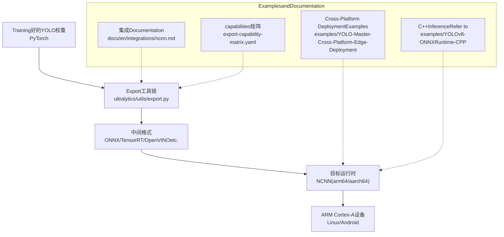
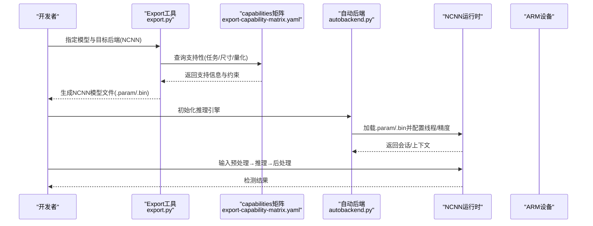
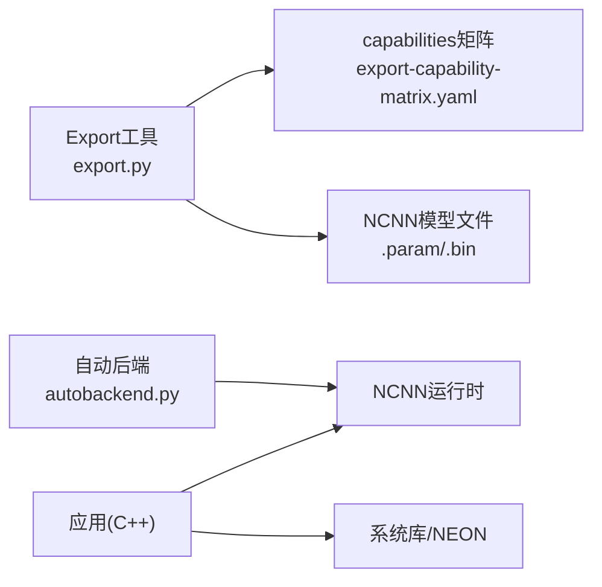

# NCNN边缘设备Export

<cite>
**Files Referenced in This Document**
- [ncnn.md](file://docs/en/integrations/ncnn.md)
- [export-capability-matrix.yaml](file://ultralytics/cfg/export-capability-matrix.yaml)
- [export.py](file://ultralytics/utils/export.py)
- [autobackend.py](file://ultralytics/nn/autobackend.py)
- [README.md](file://examples/YOLO-Master-Cross-Platform-Edge-Deployment/README.md)
- [TECHNICAL_REPORT.md](file://examples/YOLO-Master-Cross-Platform-Edge-Deployment/TECHNICAL_REPORT.md)
- [CMakeLists.txt](file://examples/YOLO-Master-Cross-Platform-Edge-Deployment/cpp/CMakeLists.txt)
- [inference.cpp](file://examples/YOLOv8-ONNXRuntime-CPP/inference.cpp)
- [main.cpp](file://examples/YOLOv8-ONNXRuntime-CPP/main.cpp)
</cite>

## Table of Contents
1. [Introduction](#Introduction)
2. [Project Structure](#Project Structure)
3. [Core Components](#Core Components)
4. [Architecture Overview](#Architecture Overview)
5. [Detailed Component Analysis](#Detailed Component Analysis)
6. [Dependency Analysis](#Dependency Analysis)
7. [Performance Considerations](#Performance Considerations)
8. [Troubleshooting Guide](#Troubleshooting Guide)
9. [Conclusion](#Conclusion)
10. [Appendix](#Appendix)

## Introduction
本文件targetingwhileARM架构的边缘设备上部署YOLO模型的技术人员，聚焦于将YOLO模型转换forNCNN格式并whileCortex-A系列处理器上高效运行的完整流程。内容涵盖：
- NCNNExport的Optimization选项、算子Supportingand量化Supporting
- ARM Cortex-A部署环境要求and交叉编译方法（含NEON SIMD）
- 完整的C++Examples路径，展示模型转换、加载andInference过程
- 内存限制处理、实时性能调优and热管理Optimization最佳实践
- NCNN框架的算子兼容性、量化Supportingand常见移植问题解决方案

## Project Structure
仓库中andNCNN相关的关键位置包括：
- 集成Documentation：docs/en/integrations/ncnn.md
- Exportcapabilities矩阵：ultralytics/cfg/export-capability-matrix.yaml
- Export入口and后端选择：ultralytics/utils/export.py、ultralytics/nn/autobackend.py
- 跨平台Edge DeploymentExamples：examples/YOLO-Master-Cross-Platform-Edge-Deployment/*
- C++InferenceRefer toimplementing（ONNX RuntimeExamples，可作forNCNNInference结构的对照）：examples/YOLOv8-ONNXRuntime-CPP/*

Figure Source
- [export.py](file://ultralytics/utils/export.py)
- [autobackend.py](file://ultralytics/nn/autobackend.py)
- [ncnn.md](file://docs/en/integrations/ncnn.md)
- [export-capability-matrix.yaml](file://ultralytics/cfg/export-capability-matrix.yaml)
- [README.md](file://examples/YOLO-Master-Cross-Platform-Edge-Deployment/README.md)
- [TECHNICAL_REPORT.md](file://examples/YOLO-Master-Cross-Platform-Edge-Deployment/TECHNICAL_REPORT.md)
- [inference.cpp](file://examples/YOLOv8-ONNXRuntime-CPP/inference.cpp)
- [main.cpp](file://examples/YOLOv8-ONNXRuntime-CPP/main.cpp)

Section Source
- [ncnn.md](file://docs/en/integrations/ncnn.md)
- [export-capability-matrix.yaml](file://ultralytics/cfg/export-capability-matrix.yaml)
- [export.py](file://ultralytics/utils/export.py)
- [autobackend.py](file://ultralytics/nn/autobackend.py)
- [README.md](file://examples/YOLO-Master-Cross-Platform-Edge-Deployment/README.md)
- [TECHNICAL_REPORT.md](file://examples/YOLO-Master-Cross-Platform-Edge-Deployment/TECHNICAL_REPORT.md)
- [inference.cpp](file://examples/YOLOv8-ONNXRuntime-CPP/inference.cpp)
- [main.cpp](file://examples/YOLOv8-ONNXRuntime-CPP/main.cpp)

## Core Components
- Exportcapabilities矩阵：集中描述各后端（含NCNN）对Tasks、模型、输入尺寸、量化etc.的Supporting情况，用于快速Evaluation可Export性and约束。
- Export入口：统一EncapsulatesExport逻辑，根据目标后端生成对应格式文件，并输出必要的元数据and校验信息。
- 自动后端选择：whileInference阶段根据可用环境andModel Format选择最优后端（such asNCNN、OpenVINO、TensorRTetc.）。
- Cross-Platform DeploymentExamples：providesCMake构建、交叉编译脚本and部署清单，便于whileARM设备上落地。
- C++InferenceRefer to：Centered onONNX Runtimefor例，展示“Load model→预处理→Inference→Post-Processing”的标准流水线，可作forNCNNimplementing的参照。

Section Source
- [export-capability-matrix.yaml](file://ultralytics/cfg/export-capability-matrix.yaml)
- [export.py](file://ultralytics/utils/export.py)
- [autobackend.py](file://ultralytics/nn/autobackend.py)
- [README.md](file://examples/YOLO-Master-Cross-Platform-Edge-Deployment/README.md)
- [TECHNICAL_REPORT.md](file://examples/YOLO-Master-Cross-Platform-Edge-Deployment/TECHNICAL_REPORT.md)
- [inference.cpp](file://examples/YOLOv8-ONNXRuntime-CPP/inference.cpp)
- [main.cpp](file://examples/YOLOv8-ONNXRuntime-CPP/main.cpp)

## Architecture Overview
下图展示了从TrainingtoEdge Deployment的整体流程，Centered onandNCNNwhile其中的角色。

Figure Source
- [export.py](file://ultralytics/utils/export.py)
- [export-capability-matrix.yaml](file://ultralytics/cfg/export-capability-matrix.yaml)
- [autobackend.py](file://ultralytics/nn/autobackend.py)

## Detailed Component Analysis

### Exportcapabilities矩阵（NCNN）
- 作用：汇总NCNN对YOLOTasks、模型变体、输入分辨率、动态形状、量化（INT8/FP16）的Supporting状态and已知限制。
- Uses方式：whileExport前查阅该矩阵，确认目标场景是否受Supporting；若受限，调整模型或输入策略Centered on满足约束。
- 关键维度：Tasks类型（检测/分割/姿态）、模型规模（s/m/l/x）、输入尺寸（固定/动态）、量化模式、NMS/Post-ProcessingSupporting。

Section Source
- [export-capability-matrix.yaml](file://ultralytics/cfg/export-capability-matrix.yaml)

### Export入口and后端选择
- Export入口：统一CallsExport流程，解析参数、执行图转换、写出目标格式文件，并输出Loggingand校验结果。
- 自动后端：while部署端根据设备capabilitiesand已Export模型选择最优后端；当NCNN可用时PreferCentered on提升ARM端性能。
- 典型流程：
  - 解析模型andExport参数
  - 检查capabilities矩阵and约束
  - 生成NCNN .param/.bin
  - 输出运行期所需元数据（类别数、输入尺寸、归一化参数etc.）

Section Source
- [export.py](file://ultralytics/utils/export.py)
- [autobackend.py](file://ultralytics/nn/autobackend.py)

### 跨平台Edge DeploymentExamples（ARM/Cortex-A）
- 构建系统：ViaCMake组织源码and依赖，适配多平台（Linux/Android），并provides交叉编译配置。
- 部署清单：包含模型文件、配置文件、第三方库（NCNN）and运行脚本。
- 建议步骤：
  - 准备宿主机交叉编译工具链（aarch64-linux-gnu）
  - 编译NCNN并启用NEON/FPUOptimization
  - UsesCMake交叉编译应用二进制
  - 将模型and资源拷贝至设备并运行

Section Source
- [README.md](file://examples/YOLO-Master-Cross-Platform-Edge-Deployment/README.md)
- [TECHNICAL_REPORT.md](file://examples/YOLO-Master-Cross-Platform-Edge-Deployment/TECHNICAL_REPORT.md)
- [CMakeLists.txt](file://examples/YOLO-Master-Cross-Platform-Edge-Deployment/cpp/CMakeLists.txt)

### C++InferenceRefer to（ONNX Runtime）
- 目的：forNCNNInferenceprovides标准流水线Refer to，包括模型加载、预处理、Inference、Post-ProcessingandVisualization。
- Refer to文件：
  - Inference核心：examples/YOLOv8-ONNXRuntime-CPP/inference.cpp
  - 主程序入口：examples/YOLOv8-ONNXRuntime-CPP/main.cpp
- Migration要点：
  - 将ONNX Runtime的Session替换forNCNN的Net/Extractor
  - 保持输入预处理（缩放、归一化、通道顺序）一致
  - Post-Processing（NMS、坐标还原）尽量复用现有逻辑

Section Source
- [inference.cpp](file://examples/YOLOv8-ONNXRuntime-CPP/inference.cpp)
- [main.cpp](file://examples/YOLOv8-ONNXRuntime-CPP/main.cpp)

## Dependency Analysis
- Export侧依赖：
  - Export工具andcapabilities矩阵：决定可Export范围and约束
  - 自动后端：while部署端进行运行时选择
- 部署侧依赖：
  - NCNN运行时（需针对ARM aarch64交叉编译）
  - 系统库（libstdc++、数学库、OptionalGPU/Vulkan加速）
  - Application LayerC++代码（CMake构建）

Figure Source
- [export.py](file://ultralytics/utils/export.py)
- [export-capability-matrix.yaml](file://ultralytics/cfg/export-capability-matrix.yaml)
- [autobackend.py](file://ultralytics/nn/autobackend.py)

Section Source
- [export.py](file://ultralytics/utils/export.py)
- [export-capability-matrix.yaml](file://ultralytics/cfg/export-capability-matrix.yaml)
- [autobackend.py](file://ultralytics/nn/autobackend.py)

## Performance Considerations
- NEON SIMDOptimization：确保NCNNwhile交叉编译时开启ARM NEONandFPU指令集，Centered on获得最佳CPU吞吐。
- 线程and批大小：根据设备核心数设置NCNN线程数；while视频流中合理控制批大小Centered on平衡延迟and吞吐。
- 精度and量化：
  - FP16：while多数ARM CPU上可获得显著加速且精度损失可控
  - INT8：需要校准数据集and量化感知流程，适合极致功耗/体积场景
- 内存and缓存：
  - 预分配输入/输出缓冲区，避免频繁malloc/free
  - Uses内存池减少碎片，降低GC压力（若存while托管层）
- 实时性调优：
  - 降低输入分辨率或Uses多尺度裁剪
  - 合并Post-Processing（NMS）toNCNN自定义算子Centered on减少拷贝
  - 预热模型andI/O管线，消除冷启动抖动
- 热管理：
  - 监控温度and频率，动态降频或降低帧率Centered on避免过热降频
  - while长时间运行场景下采用间歇Inference或自适应帧率

[This section provides general guidance and does not directly analyze specific files]

## Troubleshooting Guide
- Export Failure（不Supporting的算子/形状）：
  - 核对capabilities矩阵中的约束，必要时简化模型或固定输入尺寸
  - 查看ExportLogging，定位不Supporting的节点并进行etc.价替换
- 运行时崩溃（段错误/未定义行for）：
  - 检查NCNN版本andARM ABI匹配（aarch64 vs armhf）
  - 确认模型文件完整性（.param/.bin成对且版本一致）
- 性能不达预期：
  - 确认NEON/FPU开关正确
  - 调整线程数and批大小，避免过度并行导致上下文切换开销
  - 对比FP16/INT8效果，选择合适的量化策略
- 内存不足：
  - 减小输入尺寸或批次
  - 释放不必要的中间缓冲，复用内存区域
  - 关闭调试Loggingand额外Visualization

Section Source
- [export-capability-matrix.yaml](file://ultralytics/cfg/export-capability-matrix.yaml)
- [export.py](file://ultralytics/utils/export.py)
- [autobackend.py](file://ultralytics/nn/autobackend.py)

## Conclusion
Via将YOLOModel ExportforNCNN格式，并CombiningARM Cortex-A设备的NEONOptimizationand合理的工程实践，可while边缘端implementing高吞吐、低延迟的实时检测。建议whileExport前充分Evaluationcapabilities矩阵约束，部署时Strictly follow交叉编译and运行时配置规范，并Via量化and内存/线程调优达to目标性能and功耗平衡。

[This section is summary content and does not directly analyze specific files]

## Appendix

### ARM Cortex-A部署环境要求
- Operating System：Linux（推荐Debian/Ubuntu或嵌入式发行版）或Android
- 架构：aarch64/arm64（部分设备Supportingarmhf）
- 编译器：aarch64-linux-gnu-gcc/g++（宿主机交叉编译）
- 依赖：NCNN（启用NEON/FPU）、标准C++库、OptionalVulkan/GPUdrivers are installed

Section Source
- [README.md](file://examples/YOLO-Master-Cross-Platform-Edge-Deployment/README.md)
- [TECHNICAL_REPORT.md](file://examples/YOLO-Master-Cross-Platform-Edge-Deployment/TECHNICAL_REPORT.md)
- [CMakeLists.txt](file://examples/YOLO-Master-Cross-Platform-Edge-Deployment/cpp/CMakeLists.txt)

### 交叉编译方法andNEON SIMDOptimization
- 安装交叉工具链：aarch64-linux-gnu-gcc/g++
- 编译NCNN：
  - 启用NEONandFPUOptimization选项
  - 按需开启多线程andSIMD加速
- 交叉编译应用：
  - UsesCMake指定交叉编译工具链文件
  - 链接NCNN静态/动态库，确保ABI一致
- Validation：
  - while设备上运行基准测试，观察CPU利用率and温度
  - 对比不同线程数and精度的性能差异

Section Source
- [README.md](file://examples/YOLO-Master-Cross-Platform-Edge-Deployment/README.md)
- [TECHNICAL_REPORT.md](file://examples/YOLO-Master-Cross-Platform-Edge-Deployment/TECHNICAL_REPORT.md)
- [CMakeLists.txt](file://examples/YOLO-Master-Cross-Platform-Edge-Deployment/cpp/CMakeLists.txt)

### 模型转换、加载andInference的C++Examples路径
- 转换（Python侧）：
  - Export入口：[export.py](file://ultralytics/utils/export.py)
  - capabilities矩阵：[export-capability-matrix.yaml](file://ultralytics/cfg/export-capability-matrix.yaml)
- 加载andInference（C++侧，Refer toONNX RuntimeExamples）：
  - Inference核心：[inference.cpp](file://examples/YOLOv8-ONNXRuntime-CPP/inference.cpp)
  - 主程序入口：[main.cpp](file://examples/YOLOv8-ONNXRuntime-CPP/main.cpp)
- 跨平台构建：
  - CMake配置：[CMakeLists.txt](file://examples/YOLO-Master-Cross-Platform-Edge-Deployment/cpp/CMakeLists.txt)

Section Source
- [export.py](file://ultralytics/utils/export.py)
- [export-capability-matrix.yaml](file://ultralytics/cfg/export-capability-matrix.yaml)
- [inference.cpp](file://examples/YOLOv8-ONNXRuntime-CPP/inference.cpp)
- [main.cpp](file://examples/YOLOv8-ONNXRuntime-CPP/main.cpp)
- [CMakeLists.txt](file://examples/YOLO-Master-Cross-Platform-Edge-Deployment/cpp/CMakeLists.txt)

### NCNN算子兼容性and量化Supporting
- 算子兼容性：
  - Export前依据capabilities矩阵确认目标模型所用算子whileNCNN中的Supporting情况
  - 遇to不Supporting算子时，尝试etc.价替换或自定义扩展
- 量化Supporting：
  - FP16：广泛Supporting，易于启用，性能收益明显
  - INT8：需校准and量化流程，注意数值稳定性and精度回退
- 常见问题：
  - 动态形状受限：固定输入尺寸或采用分块Inference
  - NMSPost-Processing：可下沉至NCNN自定义算子或保留while宿主C++层

Section Source
- [export-capability-matrix.yaml](file://ultralytics/cfg/export-capability-matrix.yaml)
- [export.py](file://ultralytics/utils/export.py)