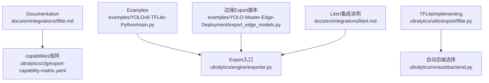
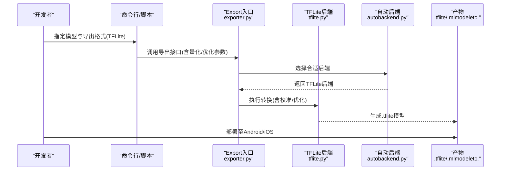
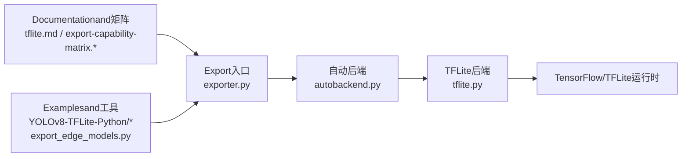

# TFLite移动端Export

<cite>
**Files Referenced in This Document**
- [tflite.md](file://docs/en/integrations/tflite.md)
- [YOLOv8-TFLite-Python/README.md](file://examples/YOLOv8-TFLite-Python/README.md)
- [YOLOv8-TFLite-Python/main.py](file://examples/YOLOv8-TFLite-Python/main.py)
- [export_edge_models.py](file://examples/YOLO-Master-Edge-Deployment/export_edge_models.py)
- [edge_utils.py](file://examples/YOLO-Master-Edge-Deployment/edge_utils.py)
- [validate_edge_outputs.py](file://examples/YOLO-Master-Edge-Deployment/validate_edge_outputs.py)
- [export-capability-matrix.yaml](file://ultralytics/cfg/export-capability-matrix.yaml)
- [export-capability-matrix.md](file://docs/governance/export-capability-matrix.md)
- [exporter.py](file://ultralytics/engine/exporter.py)
- [autobackend.py](file://ultralytics/nn/autobackend.py)
- [tflite.py](file://ultralytics/utils/export/tflite.py)
- [litert.md](file://docs/en/integrations/litert.md)
</cite>

## Table of Contents
1. [Introduction](#Introduction)
2. [Project Structure](#Project Structure)
3. [Core Components](#Core Components)
4. [Architecture Overview](#Architecture Overview)
5. [Detailed Component Analysis](#Detailed Component Analysis)
6. [Dependency Analysis](#Dependency Analysis)
7. [性能and功耗Optimization](#性能and功耗Optimization)
8. [Troubleshooting Guide](#Troubleshooting Guide)
9. [Conclusion](#Conclusion)
10. [Appendix](#Appendix)

## Introduction
本技术Documentation聚焦于将 YOLO-Master Model Exportfor TensorFlow Lite（TFLite）格式，Centered onwhile Android 和 iOS 设备上部署Inference。内容涵盖：
- Export流程and关键参数（量化、Optimizer、性能调优）
- 移动端环境要求and集成方法（Android NDK、iOS Core ML/TFLite）
- GPU acceleration配置and注意事项
- 完整的转换、加载andInferenceExamples路径
- 内存Optimization、实时性能调优and功耗管理最佳实践
- TFLite 框架限制、兼容性and高版本Migration建议

## Project Structure
围绕 TFLite Export的相关文件分布whileDocumentation、Examplesand源码三个层面：
- Documentation层：TFLite 集成说明andcapabilities矩阵
- Examples层：Python 端 TFLite InferenceExamplesand边缘Export脚本
- 源码层：统一Export入口、后端自动选择and TFLite 专用implementing

Figure Source
- [tflite.md](file://docs/en/integrations/tflite.md)
- [export-capability-matrix.yaml](file://ultralytics/cfg/export-capability-matrix.yaml)
- [YOLOv8-TFLite-Python/main.py](file://examples/YOLOv8-TFLite-Python/main.py)
- [export_edge_models.py](file://examples/YOLO-Master-Edge-Deployment/export_edge_models.py)
- [tflite.py](file://ultralytics/utils/export/tflite.py)
- [autobackend.py](file://ultralytics/nn/autobackend.py)
- [litert.md](file://docs/en/integrations/litert.md)

Section Source
- [tflite.md](file://docs/en/integrations/tflite.md)
- [export-capability-matrix.yaml](file://ultralytics/cfg/export-capability-matrix.yaml)
- [YOLOv8-TFLite-Python/README.md](file://examples/YOLOv8-TFLite-Python/README.md)
- [YOLOv8-TFLite-Python/main.py](file://examples/YOLOv8-TFLite-Python/main.py)
- [export_edge_models.py](file://examples/YOLO-Master-Edge-Deployment/export_edge_models.py)
- [edge_utils.py](file://examples/YOLO-Master-Edge-Deployment/edge_utils.py)
- [validate_edge_outputs.py](file://examples/YOLO-Master-Edge-Deployment/validate_edge_outputs.py)
- [export-capability-matrix.md](file://docs/governance/export-capability-matrix.md)
- [exporter.py](file://ultralytics/engine/exporter.py)
- [autobackend.py](file://ultralytics/nn/autobackend.py)
- [tflite.py](file://ultralytics/utils/export/tflite.py)
- [litert.md](file://docs/en/integrations/litert.md)

## Core Components
- 统一Export入口：provides跨后端的Exportcapabilities，包括 TFLite；负责参数解析、预检、Calls具体后端implementing并生成产物。
- TFLite 后端implementing：Encapsulates TensorFlow/TFLite 的转换逻辑，Supporting量化andOptimization选项。
- 自动后端选择：根据目标平台and可用运行时，选择合适的执行后端。
- capabilities矩阵：定义各Tasks/模型对Export格式的Supporting情况，便于快速判断可行性。
- Examplesand工具：包含 Python 端 TFLite InferenceExamplesand边缘Export脚本，辅助Validationand集成。

Section Source
- [exporter.py](file://ultralytics/engine/exporter.py)
- [tflite.py](file://ultralytics/utils/export/tflite.py)
- [autobackend.py](file://ultralytics/nn/autobackend.py)
- [export-capability-matrix.yaml](file://ultralytics/cfg/export-capability-matrix.yaml)
- [export-capability-matrix.md](file://docs/governance/export-capability-matrix.md)
- [YOLOv8-TFLite-Python/main.py](file://examples/YOLOv8-TFLite-Python/main.py)
- [export_edge_models.py](file://examples/YOLO-Master-Edge-Deployment/export_edge_models.py)
- [edge_utils.py](file://examples/YOLO-Master-Edge-Deployment/edge_utils.py)
- [validate_edge_outputs.py](file://examples/YOLO-Master-Edge-Deployment/validate_edge_outputs.py)

## Architecture Overview
下图展示了从Training权重to移动端可执行模型的端to端流程，Centered onand关键组件间的交互。

Figure Source
- [exporter.py](file://ultralytics/engine/exporter.py)
- [tflite.py](file://ultralytics/utils/export/tflite.py)
- [autobackend.py](file://ultralytics/nn/autobackend.py)

## Detailed Component Analysis

### Export入口and后端选择
- 职责
  - 接收Export请求（格式、精度、Optimization开关）
  - 预检查（模型兼容性、依赖可用性）
  - 路由to具体后端（such as TFLite）
  - 输出产物and元数据
- 关键点
  - 参数校验and默认值策略
  - 多后端共存时的优先级and回退机制
  - Loggingand错误信息规范化

Section Source
- [exporter.py](file://ultralytics/engine/exporter.py)
- [autobackend.py](file://ultralytics/nn/autobackend.py)

### TFLite 后端implementing
- 职责
  - 将 PyTorch/ONNX/SavedModel 转换for .tflite
  - Supporting量化（INT8、FP16）and图Optimization
  - 处理动态形状and输入约束
- 关键点
  - 量化：需要校准数据集或代表集；注意算子Supportingand数值稳定性
  - FP16：减少体积and带宽占用，需设备Supporting
  - Optimization：常量折叠、算子融合、死代码消除etc.
  - 输入/输出张量类型and维度对齐

Section Source
- [tflite.py](file://ultralytics/utils/export/tflite.py)
- [tflite.md](file://docs/en/integrations/tflite.md)

### capabilities矩阵and兼容性
- 作用
  - 明确不同Tasks/模型对 TFLite 的Supporting范围
  - 指导Export前可行性Evaluation
- Uses方式
  - Via配置文件或治理Documentation查询Supporting矩阵
  - CombiningExport预检结果进行决策

Section Source
- [export-capability-matrix.yaml](file://ultralytics/cfg/export-capability-matrix.yaml)
- [export-capability-matrix.md](file://docs/governance/export-capability-matrix.md)

### Examplesand工具链
- Python 端 TFLite InferenceExamples
  - 展示such as何加载 .tflite、预处理输入、运行InferenceandPost-Processing
  - 适用于快速Validationand本地调试
- 边缘Export脚本
  - 批量Export多种格式，便于对比and回归测试
  - 集成Validation脚本，确保Export前后一致性
- 工具函数
  - 通用预处理/Post-Processing、IO 工具、Visualization辅助

Section Source
- [YOLOv8-TFLite-Python/README.md](file://examples/YOLOv8-TFLite-Python/README.md)
- [YOLOv8-TFLite-Python/main.py](file://examples/YOLOv8-TFLite-Python/main.py)
- [export_edge_models.py](file://examples/YOLO-Master-Edge-Deployment/export_edge_models.py)
- [edge_utils.py](file://examples/YOLO-Master-Edge-Deployment/edge_utils.py)
- [validate_edge_outputs.py](file://examples/YOLO-Master-Edge-Deployment/validate_edge_outputs.py)

### Litert 集成说明
- 作用
  - 介绍 litert 作for TFLite 的轻量级绑定/包装方案
  - provideswhile Python 环境中更便捷的Calls方式
- Applicable Scenarios
  - 快速原型Validation
  - and现有 Python 工作流集成

Section Source
- [litert.md](file://docs/en/integrations/litert.md)

## Dependency Analysis
- 组件耦合
  - Export入口依赖自动后端选择and具体后端implementing
  - TFLite 后端依赖 TensorFlow/TFLite 运行时and相关工具链
- External Dependencies
  - TensorFlow/TFLite 版本and算子Supporting
  - 设备端运行时（Android NNAPI、iOS Core ML/TFLite Runtime）
- Potential Cycles依赖
  - Via分层设计避免：入口层不直接依赖后端细节

Figure Source
- [exporter.py](file://ultralytics/engine/exporter.py)
- [autobackend.py](file://ultralytics/nn/autobackend.py)
- [tflite.py](file://ultralytics/utils/export/tflite.py)
- [tflite.md](file://docs/en/integrations/tflite.md)
- [export-capability-matrix.yaml](file://ultralytics/cfg/export-capability-matrix.yaml)
- [YOLOv8-TFLite-Python/main.py](file://examples/YOLOv8-TFLite-Python/main.py)
- [export_edge_models.py](file://examples/YOLO-Master-Edge-Deployment/export_edge_models.py)

Section Source
- [exporter.py](file://ultralytics/engine/exporter.py)
- [autobackend.py](file://ultralytics/nn/autobackend.py)
- [tflite.py](file://ultralytics/utils/export/tflite.py)
- [tflite.md](file://docs/en/integrations/tflite.md)
- [export-capability-matrix.yaml](file://ultralytics/cfg/export-capability-matrix.yaml)
- [YOLOv8-TFLite-Python/main.py](file://examples/YOLOv8-TFLite-Python/main.py)
- [export_edge_models.py](file://examples/YOLO-Master-Edge-Deployment/export_edge_models.py)

## 性能and功耗Optimization
- 量化策略
  - INT8：显著减小模型体积and内存占用，提升吞吐；需准备代表性校准数据，关注精度损失and异常值处理
  - FP16：降低带宽and内存压力，适合Supporting半精度的设备；精度保持较好，体积适中
- Optimizerand图Optimization
  - 常量折叠、算子融合、死代码消除、输入形状固定化
  - 针对移动端常见算子启用特定Optimization路径
- 运行时andhardware acceleration
  - Android：优先启用 NNAPI/GPU Delegate；Set appropriately线程数and批大小
  - iOS：Prefer Core ML 或 Metal Performance Shaders；必要时回退 CPU
- 内存and实时性
  - 控制输入分辨率and批大小；复用缓冲区；避免频繁分配
  - 流水线并行：采集-预处理-Inference-Post-Processing解耦
- 功耗管理
  - 动态调整帧率and分辨率；利用设备空闲时批量处理
  - 监控温度and功耗，触发降频策略

[本节for通用指导，无需列出具体文件来源]

## Troubleshooting Guide
- Export Failure
  - 检查模型是否被capabilities矩阵Supporting
  - 确认 TensorFlow/TFLite 版本and算子兼容性
  - 查看Export预检andLogging定位问题
- 量化精度下降
  - 扩大校准集覆盖度；检查极端值and分布偏移
  - 尝试Mixture精度或回退to FP16
- 运行时崩溃或卡顿
  - 核对输入维度and数据类型
  - 关闭不必要的Optimization或降级to CPU Validation
  - 检查设备drivers are installedand运行时版本
- 回归不一致
  - UsesValidation脚本对比Export前后输出差异
  - 固定随机种子and预处理流程

Section Source
- [export-capability-matrix.md](file://docs/governance/export-capability-matrix.md)
- [validate_edge_outputs.py](file://examples/YOLO-Master-Edge-Deployment/validate_edge_outputs.py)
- [YOLOv8-TFLite-Python/main.py](file://examples/YOLOv8-TFLite-Python/main.py)

## Conclusion
Via将 YOLO-Master Exporting to TFLite，可while Android and iOS 设备上获得良好的Inference效率and资源占用表现。建议whileExport前依据capabilities矩阵进行可行性Evaluation，选择合适的量化andOptimization策略，并while设备端Combininghardware accelerationand运行时调参Centered on获得最佳性能and功耗平衡。遇to兼容性问题时，优先Refer toDocumentationandExamples，逐步缩小问题范围并进行回归Validation。

[本节for总结性内容，无需列出具体文件来源]

## Appendix
- 完整Examples路径
  - Python 端 TFLite InferenceExamples：[YOLOv8-TFLite-Python/main.py](file://examples/YOLOv8-TFLite-Python/main.py)
  - 边缘Export脚本andValidation：[export_edge_models.py](file://examples/YOLO-Master-Edge-Deployment/export_edge_models.py)、[validate_edge_outputs.py](file://examples/YOLO-Master-Edge-Deployment/validate_edge_outputs.py)
- Documentationand规范
  - TFLite 集成说明：[tflite.md](file://docs/en/integrations/tflite.md)
  - capabilities矩阵（配置andDocumentation）：[export-capability-matrix.yaml](file://ultralytics/cfg/export-capability-matrix.yaml)、[export-capability-matrix.md](file://docs/governance/export-capability-matrix.md)
  - Litert 集成说明：[litert.md](file://docs/en/integrations/litert.md)
- 源码implementing
  - Export入口and自动后端：[exporter.py](file://ultralytics/engine/exporter.py)、[autobackend.py](file://ultralytics/nn/autobackend.py)
  - TFLite 后端implementing：[tflite.py](file://ultralytics/utils/export/tflite.py)