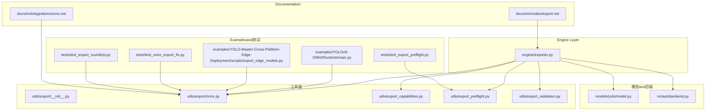
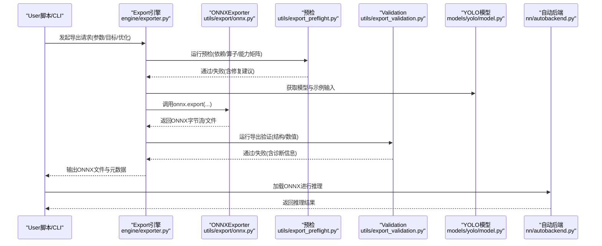
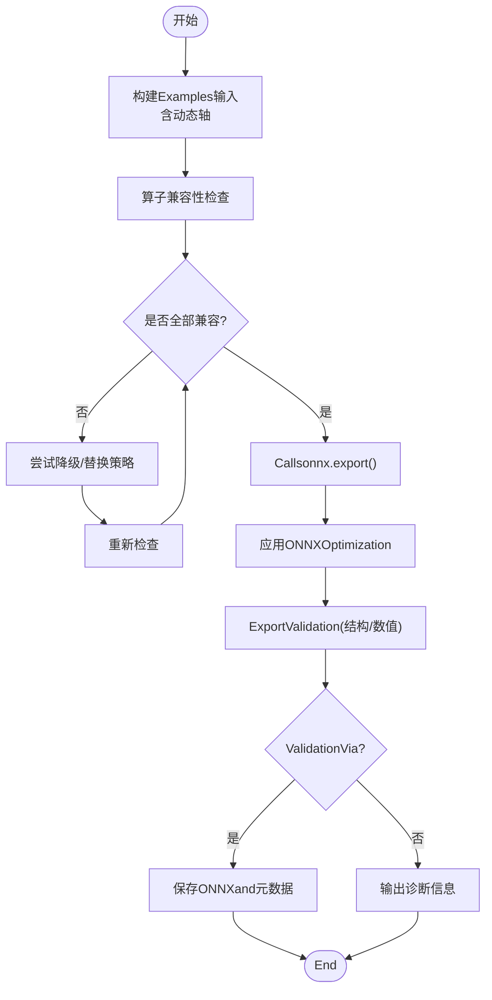
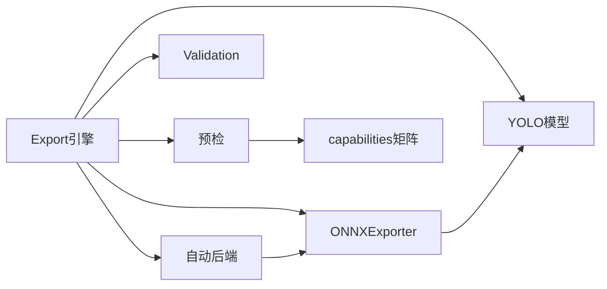

# ONNX格式Export

<cite>
**Files Referenced in This Document**
- [engine/exporter.py](file://ultralytics/engine/exporter.py)
- [utils/export/__init__.py](file://ultralytics/utils/export/__init__.py)
- [utils/export/onnx.py](file://ultralytics/utils/export/onnx.py)
- [utils/export_capabilities.py](file://ultralytics/utils/export_capabilities.py)
- [utils/export_preflight.py](file://ultralytics/utils/export_preflight.py)
- [utils/export_validation.py](file://ultralytics/utils/export_validation.py)
- [models/yolo/model.py](file://ultralytics/models/yolo/model.py)
- [nn/autobackend.py](file://ultralytics/nn/autobackend.py)
- [examples/YOLOv8-ONNXRuntime/main.py](file://examples/YOLOv8-ONNXRuntime/main.py)
- [examples/YOLO-Master-Cross-Platform-Edge-Deployment/scripts/export_edge_models.py](file://examples/YOLO-Master-Cross-Platform-Edge-Deployment/scripts/export_edge_models.py)
- [tests/test_onnx_export_fix.py](file://tests/test_onnx_export_fix.py)
- [tests/test_export_roundtrip.py](file://tests/test_export_roundtrip.py)
- [tests/test_export_preflight.py](file://tests/test_export_preflight.py)
- [docs/en/integrations/onnx.md](file://docs/en/integrations/onnx.md)
- [docs/en/modes/export.md](file://docs/en/modes/export.md)
</cite>

## Table of Contents
1. [Introduction](#Introduction)
2. [Project Structure](#Project Structure)
3. [Core Components](#Core Components)
4. [Architecture Overview](#Architecture Overview)
5. [Detailed Component Analysis](#Detailed Component Analysis)
6. [Dependency Analysis](#Dependency Analysis)
7. [性能andOptimization](#性能andOptimization)
8. [故障排除指南](#故障排除指南)
9. [Conclusion](#Conclusion)
10. [Appendix：命令andAPI速查](#Appendix命令andapi速查)

## Introduction
本文件targetingYOLO-Master的ONNXModel Exportcapabilities，系统性说明从PyTorchtoONNX的转换流程、参数配置andOptimization选项；解释动态形状Supporting、算子兼容性检查and版本要求；Documentation化命令行andPython API的Uses方法（输入输出张量定义、Optimization级别设置and调试技巧）；并providesEdge Device Deployment、跨平台Inferenceand性能Optimization的最佳实践。同时给出常见错误处理and排障建议，帮助读者快速定位并解决问题。

## Project Structure
andONNXExport相关的代码主要分布whileCentered on下Modules：
- Engine Layer：统一Export入口and流程编排
- 工具层：ONNX专用Export逻辑、预检andValidation、capabilities矩阵
- 模型适配：自动后端选择and运行时加载
- Examplesand测试：端to端Uses样例and回归用例
- Documentation：集成and模式Uses说明

Figure Source
- [engine/exporter.py](file://ultralytics/engine/exporter.py)
- [utils/export/onnx.py](file://ultralytics/utils/export/onnx.py)
- [utils/export_capabilities.py](file://ultralytics/utils/export_capabilities.py)
- [utils/export_preflight.py](file://ultralytics/utils/export_preflight.py)
- [utils/export_validation.py](file://ultralytics/utils/export_validation.py)
- [models/yolo/model.py](file://ultralytics/models/yolo/model.py)
- [nn/autobackend.py](file://ultralytics/nn/autobackend.py)
- [examples/YOLOv8-ONNXRuntime/main.py](file://examples/YOLOv8-ONNXRuntime/main.py)
- [examples/YOLO-Master-Cross-Platform-Edge-Deployment/scripts/export_edge_models.py](file://examples/YOLO-Master-Cross-Platform-Edge-Deployment/scripts/export_edge_models.py)
- [tests/test_onnx_export_fix.py](file://tests/test_onnx_export_fix.py)
- [tests/test_export_roundtrip.py](file://tests/test_export_roundtrip.py)
- [tests/test_export_preflight.py](file://tests/test_export_preflight.py)
- [docs/en/integrations/onnx.md](file://docs/en/integrations/onnx.md)
- [docs/en/modes/export.md](file://docs/en/modes/export.md)

Section Source
- [engine/exporter.py](file://ultralytics/engine/exporter.py)
- [utils/export/onnx.py](file://ultralytics/utils/export/onnx.py)
- [utils/export_capabilities.py](file://ultralytics/utils/export_capabilities.py)
- [utils/export_preflight.py](file://ultralytics/utils/export_preflight.py)
- [utils/export_validation.py](file://ultralytics/utils/export_validation.py)
- [models/yolo/model.py](file://ultralytics/models/yolo/model.py)
- [nn/autobackend.py](file://ultralytics/nn/autobackend.py)
- [examples/YOLOv8-ONNXRuntime/main.py](file://examples/YOLOv8-ONNXRuntime/main.py)
- [examples/YOLO-Master-Cross-Platform-Edge-Deployment/scripts/export_edge_models.py](file://examples/YOLO-Master-Cross-Platform-Edge-Deployment/scripts/export_edge_models.py)
- [tests/test_onnx_export_fix.py](file://tests/test_onnx_export_fix.py)
- [tests/test_export_roundtrip.py](file://tests/test_export_roundtrip.py)
- [tests/test_export_preflight.py](file://tests/test_export_preflight.py)
- [docs/en/integrations/onnx.md](file://docs/en/integrations/onnx.md)
- [docs/en/modes/export.md](file://docs/en/modes/export.md)

## Core Components
- Export引擎（engine/exporter.py）
  - 负责统一的Export流程编排：解析参数、构建Examples输入、Calls具体后端Exporter、执行预检andValidation、生成元数据andLogging。
  - provides命令行andPython API的Unified entry point，屏蔽不同后端的差异。
- ONNXExporter（utils/export/onnx.py）
  - implementingPyTorchtoONNX的具体转换逻辑：动态形状处理、算子映射、常量折叠、Optimization开关、版本控制etc.。
  - 维护输入/输出张量的签名and类型信息，确保下游Inference框架正确消费。
- capabilities矩阵（utils/export_capabilities.py）
  - 描述各Tasks/模型对Export目标的Supporting度，用于whileExport前进行可行性判断andTips。
- 预检andValidation（utils/export_preflight.py, utils/export_validation.py）
  - 预检：whileExport前检查环境、依赖、模型结构and算子兼容性。
  - Validation：Export后对结果进行数值一致性或结构校验，保障Export质量。
- 自动后端（nn/autobackend.py）
  - 根据目标环境and模型特征选择最优运行时（such asONNX Runtime），并EncapsulatesInference接口。
- 模型适配（models/yolo/model.py）
  - providesExport所需的模型实例andExamples输入构造方法，保证Export图的可追踪性。

Section Source
- [engine/exporter.py](file://ultralytics/engine/exporter.py)
- [utils/export/onnx.py](file://ultralytics/utils/export/onnx.py)
- [utils/export_capabilities.py](file://ultralytics/utils/export_capabilities.py)
- [utils/export_preflight.py](file://ultralytics/utils/export_preflight.py)
- [utils/export_validation.py](file://ultralytics/utils/export_validation.py)
- [nn/autobackend.py](file://ultralytics/nn/autobackend.py)
- [models/yolo/model.py](file://ultralytics/models/yolo/model.py)

## Architecture Overview
下图展示了从Training好的PyTorch模型toONNX文件的完整Export链路，Centered onand后续Inference加载的关键路径。

Figure Source
- [engine/exporter.py](file://ultralytics/engine/exporter.py)
- [utils/export/onnx.py](file://ultralytics/utils/export/onnx.py)
- [utils/export_preflight.py](file://ultralytics/utils/export_preflight.py)
- [utils/export_validation.py](file://ultralytics/utils/export_validation.py)
- [models/yolo/model.py](file://ultralytics/models/yolo/model.py)
- [nn/autobackend.py](file://ultralytics/nn/autobackend.py)

## Detailed Component Analysis

### Export引擎（engine/exporter.py）
- 职责
  - 统一接收Export参数（目标格式、Optimization选项、动态形状、IO签名etc.）。
  - 协调预检、Export、Validationand产物落盘。
  - for不同Tasks/模型provides一致的Export体验。
- 关键流程
  - 参数解析and默认值合并
  - 构建Examples输入（包含动态维度占位）
  - Calls具体Exporter（ONNX/TensorRTetc.）
  - 执行Export后Validationand报告生成
- and外部交互
  - 暴露Command Line InterfaceandPython API
  - and自动后端协作Centered on完成Inference侧加载

Section Source
- [engine/exporter.py](file://ultralytics/engine/exporter.py)

### ONNXExporter（utils/export/onnx.py）
- 职责
  - 将PyTorch模型转换forONNX图，处理动态形状、算子兼容性and版本约束。
  - 管理输入/输出张量签名（名称、形状、数据类型）。
  - 应用ONNXOptimization（常量折叠、算子融合、死代码消除etc.）。
- 动态形状Supporting
  - ViaExamples输入中的动态轴标记，Export可变的批大小或空间尺寸。
  - 针对检测/分割and other tasks的特殊维度（such as候选框数量）进行灵活处理。
- 算子兼容性and版本
  - 依据目标运行时andONNX版本，选择兼容的opsetand算子implementing。
  - 对不Supporting的算子provides降级策略或替换方案。
- Optimization选项
  - 常量折叠、图级Optimization、内存布局Optimizationetc.，可按场景开启/关闭。
- 调试技巧
  - 启用中间节点Export、打印符号形状、保存简化图Centered on便定位问题。

Figure Source
- [utils/export/onnx.py](file://ultralytics/utils/export/onnx.py)

Section Source
- [utils/export/onnx.py](file://ultralytics/utils/export/onnx.py)

### 预检andValidation（utils/export_preflight.py, utils/export_validation.py）
- 预检
  - 检查依赖库版本、GPU/CPU可用性、ONNX运行时capabilities。
  - 基于capabilities矩阵Evaluation当前模型/Tasks是否Supporting目标Export。
- Validation
  - 对比Export前后关键节点的输出一致性。
  - 检查ONNX图的拓扑合法性andIO签名完整性。
- 典型输出
  - Via/失败状态、警告and建议、失败原因and定位线索。

Section Source
- [utils/export_preflight.py](file://ultralytics/utils/export_preflight.py)
- [utils/export_validation.py](file://ultralytics/utils/export_validation.py)

### capabilities矩阵（utils/export_capabilities.py）
- 作用
  - 汇总各Tasks（检测、分割、姿态etc.）、模型变体andExport目标的兼容性。
  - 指导UserwhileExport前选择合适的目标and参数组合。
- Uses方式
  - whileExport前查询capabilities矩阵，避免无效Export尝试。
  - Combining预检结果给出更明确的失败原因and替代方案。

Section Source
- [utils/export_capabilities.py](file://ultralytics/utils/export_capabilities.py)

### 自动后端（nn/autobackend.py）
- 作用
  - 根据目标环境and模型特征选择最优运行时（such asONNX Runtime）。
  - Encapsulates统一的Inference接口，屏蔽后端差异。
- andExport的关系
  - Export完成后，自动后端可直接加载生成的ONNX文件进行Inference。

Section Source
- [nn/autobackend.py](file://ultralytics/nn/autobackend.py)

### 模型适配（models/yolo/model.py）
- 作用
  - provides模型实例andExamples输入构造方法，确保Export图的可追踪性and稳定性。
  - 针对不同Tasks调整输出结构，便于ONNXExporter正确处理。

Section Source
- [models/yolo/model.py](file://ultralytics/models/yolo/model.py)

### Examplesand测试
- Examples
  - YOLOv8-ONNXRuntimeExamples展示such as何whilePython中加载ONNX并进行Inference。
  - 跨平台Edge DeploymentExamples演示批量Exportand部署脚本。
- 测试
  - ONNXExport修复用例、往返一致性测试、预检覆盖测试，保障功能稳定。

Section Source
- [examples/YOLOv8-ONNXRuntime/main.py](file://examples/YOLOv8-ONNXRuntime/main.py)
- [examples/YOLO-Master-Cross-Platform-Edge-Deployment/scripts/export_edge_models.py](file://examples/YOLO-Master-Cross-Platform-Edge-Deployment/scripts/export_edge_models.py)
- [tests/test_onnx_export_fix.py](file://tests/test_onnx_export_fix.py)
- [tests/test_export_roundtrip.py](file://tests/test_export_roundtrip.py)
- [tests/test_export_preflight.py](file://tests/test_export_preflight.py)

## Dependency Analysis
- 内部依赖
  - Export引擎依赖ONNXExporter、预检andValidationModules、模型适配and自动后端。
  - 预检依赖capabilities矩阵and环境探测。
  - Validation依赖Export后的图and权重资源。
- External Dependencies
  - PyTorch、ONNX、ONNX Runtime（Optional）、其他目标运行时（such asTensorRT/OpenVINO，视目标而定）。
- 耦合and内聚
  - Export引擎作for协调者，保持高内聚workflow编排；具体Export逻辑下沉至工具层，降低耦合。
- Potential Cycles依赖
  - Via分层设计避免循环导入；若出现，应引入抽象接口或延迟导入。

Figure Source
- [engine/exporter.py](file://ultralytics/engine/exporter.py)
- [utils/export/onnx.py](file://ultralytics/utils/export/onnx.py)
- [utils/export_preflight.py](file://ultralytics/utils/export_preflight.py)
- [utils/export_validation.py](file://ultralytics/utils/export_validation.py)
- [utils/export_capabilities.py](file://ultralytics/utils/export_capabilities.py)
- [models/yolo/model.py](file://ultralytics/models/yolo/model.py)
- [nn/autobackend.py](file://ultralytics/nn/autobackend.py)

Section Source
- [engine/exporter.py](file://ultralytics/engine/exporter.py)
- [utils/export/onnx.py](file://ultralytics/utils/export/onnx.py)
- [utils/export_capabilities.py](file://ultralytics/utils/export_capabilities.py)
- [utils/export_preflight.py](file://ultralytics/utils/export_preflight.py)
- [utils/export_validation.py](file://ultralytics/utils/export_validation.py)
- [models/yolo/model.py](file://ultralytics/models/yolo/model.py)
- [nn/autobackend.py](file://ultralytics/nn/autobackend.py)

## 性能andOptimization
- 动态形状
  - Set appropriately可变维度（such as批大小、分辨率），避免过度动态导致运行时无法Optimization。
  - while边缘设备上，固定常用分辨率可获得更好性能。
- 算子Optimization
  - 启用常量折叠and图级Optimization，减少冗余计算。
  - 对不Supporting的算子采用etc.价替换或自定义implementing。
- 精度and速度权衡
  - Mixture精度或量化可while部分后端获得加速，但需Validation精度损失。
- 批处理and缓存
  - whileInference侧启用会话缓存and批处理，提升吞吐。
- 监控and基准
  - UsesBuilt-in基准工具对比不同Optimization配置的延迟and吞吐。

[This section provides general guidance and does not directly analyze specific files]

## 故障排除指南
- 常见问题
  - 算子不Supporting：查看预检andcapabilities矩阵，按建议降级或替换算子。
  - 动态形状报错：检查Examples输入的形状定义andExport参数的一致性。
  - 数值不一致：启用ExportValidation，定位差异节点，必要时关闭特定Optimization。
  - 运行时加载失败：确认ONNX版本andopset匹配，检查IO签名。
- 调试技巧
  - Export简化图并Visualization，观察异常分支。
  - 逐步关闭Optimization项，定位引发问题的Optimization。
  - 打印中间张量形状and类型，核对动态轴。
- Refer to用例
  - Refer toExport修复and往返一致性测试，对照排查自身问题。

Section Source
- [tests/test_onnx_export_fix.py](file://tests/test_onnx_export_fix.py)
- [tests/test_export_roundtrip.py](file://tests/test_export_roundtrip.py)
- [tests/test_export_preflight.py](file://tests/test_export_preflight.py)

## Conclusion
YOLO-Master的ONNXExport体系Via“引擎+工具+预检/Validation”的分层设计，provides了稳定、可扩展且易于调试的Exportcapabilities。借助动态形状Supportingand算子兼容性检查，User可Centered onwhile多平台and多后端上高效部署。Combined withOptimization选项and调试技巧，能够while性能and精度之间取得良好平衡。

[本节for总结，不直接分析具体文件]

## Appendix：命令andAPI速查
- 命令行Export
  - 基本用法：指定模型and目标格式forONNX，设置动态形状andOptimization选项。
  - Refer toDocumentation：Export模式and参数说明。
- Python API
  - ViaExport引擎接口传入模型、Examples输入andExport参数，获取ONNX文件路径and元数据。
  - Refer toExamples：ONNX RuntimeInferenceExamplesandEdge Deployment脚本。
- 输入输出张量定义
  - 明确输入形状（含动态轴）and输出结构（类别、框、掩码etc.），确保and下游一致。
- Optimization级别设置
  - 根据目标设备and运行时选择合适Optimization级别，必要时关闭特定OptimizationCentered on保稳定。
- 调试技巧
  - 启用预检andValidation的详细Logging，Export简化图，逐步缩小问题范围。

Section Source
- [docs/en/modes/export.md](file://docs/en/modes/export.md)
- [docs/en/integrations/onnx.md](file://docs/en/integrations/onnx.md)
- [examples/YOLOv8-ONNXRuntime/main.py](file://examples/YOLOv8-ONNXRuntime/main.py)
- [examples/YOLO-Master-Cross-Platform-Edge-Deployment/scripts/export_edge_models.py](file://examples/YOLO-Master-Cross-Platform-Edge-Deployment/scripts/export_edge_models.py)