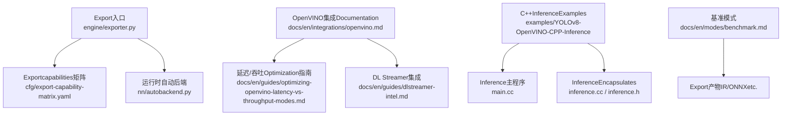
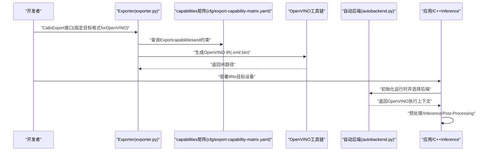
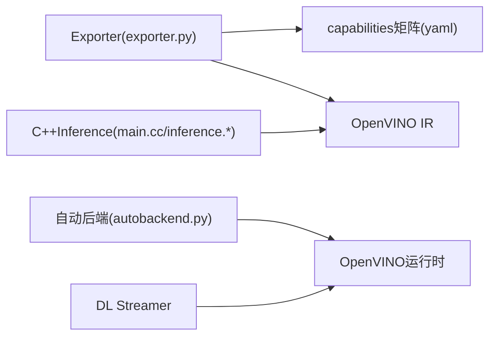
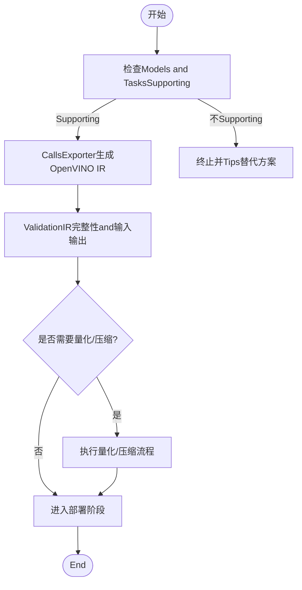

# OpenVINO格式Export

<cite>
**Files Referenced in This Document**
- [exporter.py](file://ultralytics/engine/exporter.py)
- [autobackend.py](file://ultralytics/nn/autobackend.py)
- [openvino.md](file://docs/en/integrations/openvino.md)
- [YOLOv8-OpenVINO-CPP-Inference/main.cc](file://examples/YOLOv8-OpenVINO-CPP-Inference/main.cc)
- [YOLOv8-OpenVINO-CPP-Inference/inference.cc](file://examples/YOLOv8-OpenVINO-CPP-Inference/inference.cc)
- [YOLOv8-OpenVINO-CPP-Inference/inference.h](file://examples/YOLOv8-OpenVINO-CPP-Inference/inference.h)
- [dlstreamer-intel.md](file://docs/en/guides/dlstreamer-intel.md)
- [optimizing-openvino-latency-vs-throughput-modes.md](file://docs/en/guides/optimizing-openvino-latency-vs-throughput-modes.md)
- [model-deployment-options.md](file://docs/en/guides/model-deployment-options.md)
- [yolo-thread-safe-inference.md](file://docs/en/guides/yolo-thread-safe-inference.md)
- [benchmark.md](file://docs/en/modes/benchmark.md)
- [export-capability-matrix.yaml](file://ultralytics/cfg/export-capability-matrix.yaml)
</cite>

## Table of Contents
1. [Introduction](#Introduction)
2. [Project Structure](#Project Structure)
3. [Core Components](#Core Components)
4. [Architecture Overview](#Architecture Overview)
5. [Detailed Component Analysis](#Detailed Component Analysis)
6. [Dependency Analysis](#Dependency Analysis)
7. [性能andOptimization](#性能andOptimization)
8. [部署Examplesand实践](#部署Examplesand实践)
9. [故障排除指南](#故障排除指南)
10. [Conclusion](#Conclusion)

## Introduction
本文件targetingYOLO-Master的OpenVINOModel Export and Deployment，系统性说明从PyTorch权重toOpenVINO IR（Intermediate Representation）的转换流程、硬件后端配置（CPU/GPU/VPU）、Model Compressionand量化策略、Inference服务搭建、批量处理and实时监控方法，Centered onand环境配置and常见问题排查。Documentation同时provides代码级架构图and流程图，帮助读者快速定位implementing位置并落地实践。

## Project Structure
围绕OpenVINOExportand部署的关键路径such as下：
- Export入口andcapabilities矩阵：引擎ExporterandExportcapabilities清单
- 运行时自动后端选择：统一设备抽象and后端加载
- 官方集成Documentation：OpenVINOUses指南、延迟/吞吐模式Optimization、DL Streamer集成
- C++InferenceExamples：OpenVINO C++Inference工程
- 基准测试：Export后性能Evaluation模式

Figure Source
- [exporter.py:1-200](file://ultralytics/engine/exporter.py#L1-200)
- [export-capability-matrix.yaml:1-200](file://ultralytics/cfg/export-capability-matrix.yaml#L1-200)
- [autobackend.py:1-200](file://ultralytics/nn/autobackend.py#L1-200)
- [openvino.md:1-200](file://docs/en/integrations/openvino.md#L1-L200)
- [optimizing-openvino-latency-vs-throughput-modes.md:1-200](file://docs/en/guides/optimizing-openvino-latency-vs-throughput-modes.md#L1-L200)
- [dlstreamer-intel.md:1-200](file://docs/en/guides/dlstreamer-intel.md#L1-L200)
- [YOLOv8-OpenVINO-CPP-Inference/main.cc:1-200](file://examples/YOLOv8-OpenVINO-CPP-Inference/main.cc#L1-L200)
- [YOLOv8-OpenVINO-CPP-Inference/inference.cc:1-200](file://examples/YOLOv8-OpenVINO-CPP-Inference/inference.cc#L1-L200)
- [YOLOv8-OpenVINO-CPP-Inference/inference.h:1-200](file://examples/YOLOv8-OpenVINO-CPP-Inference/inference.h#L1-L200)
- [benchmark.md:1-200](file://docs/en/modes/benchmark.md#L1-L200)

Section Source
- [exporter.py:1-200](file://ultralytics/engine/exporter.py#L1-L200)
- [export-capability-matrix.yaml:1-200](file://ultralytics/cfg/export-capability-matrix.yaml#L1-L200)
- [autobackend.py:1-200](file://ultralytics/nn/autobackend.py#L1-L200)
- [openvino.md:1-200](file://docs/en/integrations/openvino.md#L1-L200)
- [YOLOv8-OpenVINO-CPP-Inference/main.cc:1-200](file://examples/YOLOv8-OpenVINO-CPP-Inference/main.cc#L1-L200)
- [YOLOv8-OpenVINO-CPP-Inference/inference.cc:1-200](file://examples/YOLOv8-OpenVINO-CPP-Inference/inference.cc#L1-L200)
- [YOLOv8-OpenVINO-CPP-Inference/inference.h:1-200](file://examples/YOLOv8-OpenVINO-CPP-Inference/inference.h#L1-L200)
- [dlstreamer-intel.md:1-200](file://docs/en/guides/dlstreamer-intel.md#L1-L200)
- [optimizing-openvino-latency-vs-throughput-modes.md:1-200](file://docs/en/guides/optimizing-openvino-latency-vs-throughput-modes.md#L1-L200)
- [benchmark.md:1-200](file://docs/en/modes/benchmark.md#L1-L200)

## Core Components
- Exporter（Engine Exporter）
  - 负责将Training好的模型转换for多种目标格式，包括OpenVINO IR。
  - Viacapabilities矩阵控制各Tasks/模型的ExportSupporting情况。
- 自动后端（AutoBackend）
  - whileInference阶段根据目标设备and可用后端动态选择执行引擎（such asOpenVINO）。
- OpenVINO集成Documentation
  - providesOpenVINO安装、Device Selection、模型转换andOptimization的官方指引。
- C++InferenceExamples
  - 展示such as何whileC++中加载OpenVINO IR并进行Inference。
- DL Streamer集成
  - 基于Intel Media SDK/DL Streamer的视频流Inference流水线Refer to。
- 基准模式
  - 用于Export后while不同设备上Evaluation延迟and吞吐。

Section Source
- [exporter.py:1-200](file://ultralytics/engine/exporter.py#L1-L200)
- [export-capability-matrix.yaml:1-200](file://ultralytics/cfg/export-capability-matrix.yaml#L1-L200)
- [autobackend.py:1-200](file://ultralytics/nn/autobackend.py#L1-L200)
- [openvino.md:1-200](file://docs/en/integrations/openvino.md#L1-L200)
- [YOLOv8-OpenVINO-CPP-Inference/main.cc:1-200](file://examples/YOLOv8-OpenVINO-CPP-Inference/main.cc#L1-L200)
- [YOLOv8-OpenVINO-CPP-Inference/inference.cc:1-200](file://examples/YOLOv8-OpenVINO-CPP-Inference/inference.cc#L1-L200)
- [YOLOv8-OpenVINO-CPP-Inference/inference.h:1-200](file://examples/YOLOv8-OpenVINO-CPP-Inference/inference.h#L1-L200)
- [dlstreamer-intel.md:1-200](file://docs/en/guides/dlstreamer-intel.md#L1-L200)
- [benchmark.md:1-200](file://docs/en/modes/benchmark.md#L1-L200)

## Architecture Overview
下图展示了从Training权重toOpenVINO IRExport、再to多端部署的整体流程。

Figure Source
- [exporter.py:1-200](file://ultralytics/engine/exporter.py#L1-L200)
- [export-capability-matrix.yaml:1-200](file://ultralytics/cfg/export-capability-matrix.yaml#L1-L200)
- [autobackend.py:1-200](file://ultralytics/nn/autobackend.py#L1-L200)

## Detailed Component Analysis

### Exporterandcapabilities矩阵
- 职责
  - 解析Export参数、校验Models and Tasks兼容性、Calls后端转换器生成目标格式。
  - 针对OpenVINO，输出IR文件（模型描述and权重），并可附带元数据。
- 关键要点
  - Viacapabilities矩阵决定某模型是否SupportingOpenVINOExportandOptionalOptimization选项。
  - Export前进行预检（输入形状、算子Supporting、精度要求etc.）。
- 建议
  - whileExport前明确目标设备and运行模式（延迟优先或吞吐优先），Centered on便选择合适的Optimization开关。

Section Source
- [exporter.py:1-200](file://ultralytics/engine/exporter.py#L1-L200)
- [export-capability-matrix.yaml:1-200](file://ultralytics/cfg/export-capability-matrix.yaml#L1-L200)

### 自动后端andDevice Selection
- 职责
  - whileInference时根据环境变量、设备枚举and可用性，自动选择OpenVINO或其他后端。
  - 管理会话生命周期、输入输出绑定and内存布局。
- 关键要点
  - 对OpenVINO而言，需正确设置设备字符串（such as“CPU”、“GPU”、“MYRIAD”etc.）。
  - Supporting热切换and回退策略，提升部署鲁棒性。
- 建议
  - while生产环境中显式指定设备，避免隐式选择导致的不一致。

Section Source
- [autobackend.py:1-200](file://ultralytics/nn/autobackend.py#L1-L200)

### OpenVINO集成DocumentationandOptimization指南
- 内容覆盖
  - 安装andEnvironment Preparation、设备drivers are installedand运行时版本匹配。
  - 模型转换参数、Quantization and Compression选项、不同设备的最佳实践。
  - 延迟and吞吐模式的权衡and调优。
- 建议
  - 遵循官方Documentation的设备anddrivers are installed版本矩阵，确保稳定性。
  - 针对不同Tasks（检测/分割/姿态）采用对应的Optimization策略。

Section Source
- [openvino.md:1-200](file://docs/en/integrations/openvino.md#L1-L200)
- [optimizing-openvino-latency-vs-throughput-modes.md:1-200](file://docs/en/guides/optimizing-openvino-latency-vs-throughput-modes.md#L1-L200)

### C++InferenceExamples（OpenVINO）
- 结构
  - main.cc：程序入口、命令行参数解析、资源加载and循环Inference。
  - inference.h/cc：EncapsulatesOpenVINO模型加载、输入输出张量操作andInferenceCalls。
- 关键点
  - 正确读取IR文件、设置输入形状and数据类型。
  - 处理NMS/解码etc.Post-Processing逻辑，保证andPython端一致性。
- 建议
  - Uses线程池and批处理提高吞吐；注意锁and内存复用。

Section Source
- [YOLOv8-OpenVINO-CPP-Inference/main.cc:1-200](file://examples/YOLOv8-OpenVINO-CPP-Inference/main.cc#L1-L200)
- [YOLOv8-OpenVINO-CPP-Inference/inference.h:1-200](file://examples/YOLOv8-OpenVINO-CPP-Inference/inference.h#L1-L200)
- [YOLOv8-OpenVINO-CPP-Inference/inference.cc:1-200](file://examples/YOLOv8-OpenVINO-CPP-Inference/inference.cc#L1-L200)

### DL Streamer集成
- Applicable Scenarios
  - 基于Intel媒体栈的高性能视频流Inference，适合摄像头/RTSP/文件etc.多源输入。
- 关键点
  - 构建Pipeline：Source→Decoder→Preprocess→Model→Postprocess→Sink。
  - 利用硬件编解码and加速内核降低CPU占用。
- 建议
  - Set appropriately队列长度and帧率，避免背压and丢帧。

Section Source
- [dlstreamer-intel.md:1-200](file://docs/en/guides/dlstreamer-intel.md#L1-L200)

### 基准模式
- 用途
  - while目标设备上EvaluationExport模型的延迟and吞吐，辅助选择最优配置。
- 关键点
  - 固定输入尺寸andBatch Size，多次采样取稳定Metrics。
  - 对比不同设备andOptimization开关的效果。

Section Source
- [benchmark.md:1-200](file://docs/en/modes/benchmark.md#L1-L200)

## Dependency Analysis
- Modules耦合
  - Exporter依赖capabilities矩阵进行可行性判断；自动后端依赖运行时库and设备drivers are installed。
  - C++Examples直接依赖OpenVINO C API。
- External Dependencies
  - OpenVINO运行时、设备drivers are installed（CPU/GPU/VPU）、媒体栈（DL Streamer）。
- 潜while风险
  - 版本不匹配导致算子不Supporting或性能退化；设备权限anddrivers are installed缺失。

Figure Source
- [exporter.py:1-200](file://ultralytics/engine/exporter.py#L1-L200)
- [export-capability-matrix.yaml:1-200](file://ultralytics/cfg/export-capability-matrix.yaml#L1-L200)
- [autobackend.py:1-200](file://ultralytics/nn/autobackend.py#L1-L200)
- [YOLOv8-OpenVINO-CPP-Inference/main.cc:1-200](file://examples/YOLOv8-OpenVINO-CPP-Inference/main.cc#L1-L200)
- [YOLOv8-OpenVINO-CPP-Inference/inference.cc:1-200](file://examples/YOLOv8-OpenVINO-CPP-Inference/inference.cc#L1-L200)
- [YOLOv8-OpenVINO-CPP-Inference/inference.h:1-200](file://examples/YOLOv8-OpenVINO-CPP-Inference/inference.h#L1-L200)

## 性能andOptimization
- Model Compressionand量化
  - UsesINT8/FP16量化减少体积and提升速度；校准数据集需具代表性。
  - Combining稀疏化and剪枝进一步降低计算量（视Tasksand设备Supporting而定）。
- 运行模式
  - 延迟优先：减小批大小、启用低延迟Optimization；吞吐优先：增大批大小、并行化。
- 设备特性
  - CPU：关注多线程and缓存友好；GPU：关注带宽and并行度；VPU：关注内存and算子映射。
- 监控and回归
  - 建立基线Metrics，持续监控延迟/吞吐/准确率漂移。

Section Source
- [openvino.md:1-200](file://docs/en/integrations/openvino.md#L1-L200)
- [optimizing-openvino-latency-vs-throughput-modes.md:1-200](file://docs/en/guides/optimizing-openvino-latency-vs-throughput-modes.md#L1-L200)
- [benchmark.md:1-200](file://docs/en/modes/benchmark.md#L1-L200)

## 部署Examplesand实践

### 环境配置and依赖管理
- 系统要求
  - Operating Systemand内核版本、drivers are installedand固件版本需满足OpenVINO矩阵要求。
- Python环境
  - 安装对应版本的OpenVINO Python包and依赖；确认CUDA/ROCm（若UsesGPU）兼容。
- C++环境
  - 安装OpenVINO开发包andCMake；链接必要的库and头文件。

Section Source
- [openvino.md:1-200](file://docs/en/integrations/openvino.md#L1-L200)
- [YOLOv8-OpenVINO-CPP-Inference/main.cc:1-200](file://examples/YOLOv8-OpenVINO-CPP-Inference/main.cc#L1-L200)

### Model Export流程（OpenVINO IR）

Figure Source
- [exporter.py:1-200](file://ultralytics/engine/exporter.py#L1-L200)
- [export-capability-matrix.yaml:1-200](file://ultralytics/cfg/export-capability-matrix.yaml#L1-L200)

### 硬件后端配置andUses
- Intel CPU
  - 设备标识通常for“CPU”；可开启多线程and缓存Optimization。
- Intel GPU
  - 设备标识通常for“GPU”；需安装相应drivers are installedandOpenCL/ICD配置。
- Intel VPU（such asMovidius MyriadX）
  - 设备标识通常for“MYRIAD”；需安装USBdrivers are installedand权限配置。
- 自动后端选择
  - Via自动后端按优先级探测可用设备并创建执行上下文。

Section Source
- [autobackend.py:1-200](file://ultralytics/nn/autobackend.py#L1-L200)
- [openvino.md:1-200](file://docs/en/integrations/openvino.md#L1-L200)

### Inference服务搭建（Python/C++）
- Python
  - Uses自动后端加载IR，EncapsulatesHTTP/gRPC服务；加入请求队列and限流。
- C++
  - Refer toExamples工程，构建单进程或多进程服务；注意线程安全and内存复用。
- 线程安全
  - 遵循线程安全Inference指南，避免共享状态冲突。

Section Source
- [YOLOv8-OpenVINO-CPP-Inference/main.cc:1-200](file://examples/YOLOv8-OpenVINO-CPP-Inference/main.cc#L1-L200)
- [YOLOv8-OpenVINO-CPP-Inference/inference.cc:1-200](file://examples/YOLOv8-OpenVINO-CPP-Inference/inference.cc#L1-L200)
- [YOLOv8-OpenVINO-CPP-Inference/inference.h:1-200](file://examples/YOLOv8-OpenVINO-CPP-Inference/inference.h#L1-L200)
- [yolo-thread-safe-inference.md:1-200](file://docs/en/guides/yolo-thread-safe-inference.md#L1-L200)

### 批量处理and实时流
- 批量处理
  - 合并多帧for批次输入，提升吞吐；注意动态形状and填充策略。
- 实时流
  - CombiningDL Streamer构建End-to-end pipeline，降低端to端延迟。
- 监控
  - 采集QPS、P99延迟、丢帧率and错误率，纳入告警and看板。

Section Source
- [dlstreamer-intel.md:1-200](file://docs/en/guides/dlstreamer-intel.md#L1-L200)
- [benchmark.md:1-200](file://docs/en/modes/benchmark.md#L1-L200)

### 最佳实践
- 先离线Evaluation再上线：while目标设备上完成基准测试and回归Validation。
- 固定输入尺寸：减少动态形状带来的编译and调度开销。
- 分层Optimization：数据预处理andPost-Processing尽量向硬件或SIMD靠拢。
- 灰度发布：小流量Validation后再全量上线。

Section Source
- [model-deployment-options.md:1-200](file://docs/en/guides/model-deployment-options.md#L1-L200)
- [optimizing-openvino-latency-vs-throughput-modes.md:1-200](file://docs/en/guides/optimizing-openvino-latency-vs-throughput-modes.md#L1-L200)

## 故障排除指南
- 常见错误
  - 设备不可用或权限不足：检查drivers are installed、udev规则andUser组。
  - 算子不Supporting：查看OpenVINO版本and模型算子集，必要时降级或替换算子。
  - 量化精度下降：调整校准集and量化策略，必要时回退至FP16。
- 诊断步骤
  - Uses基准模式复现问题；对比不同设备andOptimization开关。
  - 检查IR输入输出维度and数据类型是否andInference端一致。
- Loggingand监控
  - 开启详细Logging，记录设备信息、模型信息and运行时统计。

Section Source
- [openvino.md:1-200](file://docs/en/integrations/openvino.md#L1-L200)
- [benchmark.md:1-200](file://docs/en/modes/benchmark.md#L1-L200)

## Conclusion
through a unifiedExporterand自动后端机制，YOLO-Master能够高效地将模型转换forOpenVINO IR并while多类Intel硬件上获得良好性能。Combining量化压缩、延迟/吞吐模式OptimizationandDL Streamer流水线，可while边缘and云端implementing高吞吐、低延迟的部署。建议while上线前完成严格的基准测试and回归Validation，并建立持续的监控and告警体系。