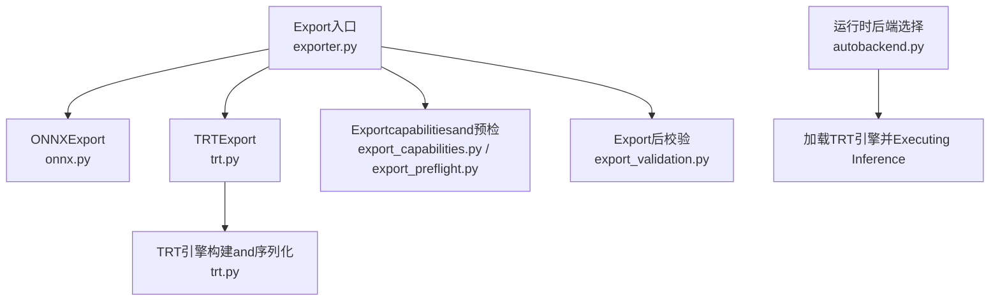
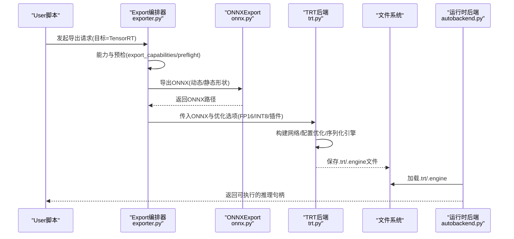

# TensorRT格式Export

<cite>
**Files Referenced in This Document**
- [ultralytics/engine/exporter.py](file://ultralytics/engine/exporter.py)
- [ultralytics/utils/export/__init__.py](file://ultralytics/utils/export/__init__.py)
- [ultralytics/utils/export/trt.py](file://ultralytics/utils/export/trt.py)
- [ultralytics/utils/export/onnx.py](file://ultralytics/utils/export/onnx.py)
- [ultralytics/utils/export_capabilities.py](file://ultralytics/utils/export_capabilities.py)
- [ultralytics/utils/export_preflight.py](file://ultralytics/utils/export_preflight.py)
- [ultralytics/utils/export_validation.py](file://ultralytics/utils/export_validation.py)
- [ultralytics/nn/autobackend.py](file://ultralytics/nn/autobackend.py)
- [tests/test_engine.py](file://tests/test_engine.py)
- [tests/test_export_preflight.py](file://tests/test_export_preflight.py)
- [tests/test_exports.py](file://tests/test_exports.py)
- [docs/en/integrations/tensorrt.md](file://docs/en/integrations/tensorrt.md)
</cite>

## Table of Contents
1. [Introduction](#Introduction)
2. [Project Structure](#Project Structure)
3. [Core Components](#Core Components)
4. [Architecture Overview](#Architecture Overview)
5. [Detailed Component Analysis](#Detailed Component Analysis)
6. [依赖and版本要求](#依赖and版本要求)
7. [精度Optimizationand量化](#精度Optimizationand量化)
8. [层融合and插件开发](#层融合and插件开发)
9. [GPU内存管理and并发部署](#gpu内存管理and并发部署)
10. [不同GPU架构的Optimization策略](#不同gpu架构的Optimization策略)
11. [Batch Inferenceand多GPU最佳实践](#Batch Inferenceand多gpu最佳实践)
12. [性能分析and调优指南](#性能分析and调优指南)
13. [常见问题诊断](#常见问题诊断)
14. [Conclusion](#Conclusion)
15. [Appendix](#Appendix)

## Introduction
本技术Documentation聚焦于YOLO-Master的TensorRTModel Exportcapabilities，系统性说明从ONNXtoTensorRT引擎的构建流程、精度Optimization（FP16/INT8）、层融合and插件机制、CUDA/TensorRT环境配置、不同GPU架构Optimization策略，Centered onandBatch Inference、并发处理和多GPU部署的最佳实践。同时provides性能分析方法and常见问题排查路径，帮助读者while生产环境中稳定高效地落地TensorRTInference。

## Project Structure
TensorRTExport相关代码主要分布whileCentered on下Modules：
- Export入口and编排：engine/exporter.py
- TensorRT后端implementing：utils/export/trt.py
- ONNXExportand中间表示：utils/export/onnx.py
- Exportcapabilities矩阵and预检：utils/export_capabilities.py, utils/export_preflight.py
- Export后校验：utils/export_validation.py
- 运行时自动选择后端：nn/autobackend.py
- 测试用例：tests/test_engine.py, tests/test_export_preflight.py, tests/test_exports.py
- UserDocumentation：docs/en/integrations/tensorrt.md

Figure Source
- [ultralytics/engine/exporter.py](file://ultralytics/engine/exporter.py)
- [ultralytics/utils/export/onnx.py](file://ultralytics/utils/export/onnx.py)
- [ultralytics/utils/export/trt.py](file://ultralytics/utils/export/trt.py)
- [ultralytics/utils/export_capabilities.py](file://ultralytics/utils/export_capabilities.py)
- [ultralytics/utils/export_preflight.py](file://ultralytics/utils/export_preflight.py)
- [ultralytics/utils/export_validation.py](file://ultralytics/utils/export_validation.py)
- [ultralytics/nn/autobackend.py](file://ultralytics/nn/autobackend.py)

Section Source
- [ultralytics/engine/exporter.py](file://ultralytics/engine/exporter.py)
- [ultralytics/utils/export/trt.py](file://ultralytics/utils/export/trt.py)
- [ultralytics/utils/export/onnx.py](file://ultralytics/utils/export/onnx.py)
- [ultralytics/utils/export_capabilities.py](file://ultralytics/utils/export_capabilities.py)
- [ultralytics/utils/export_preflight.py](file://ultralytics/utils/export_preflight.py)
- [ultralytics/utils/export_validation.py](file://ultralytics/utils/export_validation.py)
- [ultralytics/nn/autobackend.py](file://ultralytics/nn/autobackend.py)

## Core Components
- Export编排器（exporter.py）
  - 负责统一Export流程：参数解析、目标格式选择、前置检查、Calls具体后端、生成元数据andLogging。
  - 对TensorRTExport，会先确保存while可用的ONNX模型或动态图Export结果，再进入TRT构建阶段。
- TRT后端（trt.py）
  - EncapsulatesTensorRT Python API，完成Builder/Network/Config/Engine的创建、Optimization选项设置、序列化保存and反序列加载。
  - Supporting精度模式切换（FP32/FP16/INT8）、I/O绑定、动态形状and固定形状策略、插件注册etc.。
- ONNXExport（onnx.py）
  - 将PyTorchModel ExportforONNX，定义输入输出名称、动态轴、算子约束andExport选项，供TRT后续Uses。
- capabilities矩阵and预检（export_capabilities.py, export_preflight.py）
  - 维护各后端capabilities矩阵（such as是否SupportingINT8、动态形状、特定算子），whileExport前进行环境and模型兼容性检查。
- Export后校验（export_validation.py）
  - 对比原始模型andExport模型的数值一致性、形状兼容性and关键Metrics，辅助定位Export问题。
- 自动后端（autobackend.py）
  - 运行时根据可用后端and模型后缀自动选择加载方式；若检测toTRT引擎则优先加载并Executing Inference。

Section Source
- [ultralytics/engine/exporter.py](file://ultralytics/engine/exporter.py)
- [ultralytics/utils/export/trt.py](file://ultralytics/utils/export/trt.py)
- [ultralytics/utils/export/onnx.py](file://ultralytics/utils/export/onnx.py)
- [ultralytics/utils/export_capabilities.py](file://ultralytics/utils/export_capabilities.py)
- [ultralytics/utils/export_preflight.py](file://ultralytics/utils/export_preflight.py)
- [ultralytics/utils/export_validation.py](file://ultralytics/utils/export_validation.py)
- [ultralytics/nn/autobackend.py](file://ultralytics/nn/autobackend.py)

## Architecture Overview
下图展示从Training权重toTensorRT引擎的端to端流程，包括Export、构建、序列化and运行时加载。

Figure Source
- [ultralytics/engine/exporter.py](file://ultralytics/engine/exporter.py)
- [ultralytics/utils/export/onnx.py](file://ultralytics/utils/export/onnx.py)
- [ultralytics/utils/export/trt.py](file://ultralytics/utils/export/trt.py)
- [ultralytics/nn/autobackend.py](file://ultralytics/nn/autobackend.py)

## Detailed Component Analysis

### Export编排器（exporter.py）
- 职责
  - 统一Export入口，协调ONNX/TRT/其他后端。
  - 管理Export产物命名、Table of Contents组织and元数据记录。
  - 触发预检andcapabilities判断，避免无效构建。
- 关键点
  - 当目标forTensorRT时，优先确保ONNX可用；若未启用显式ONNXExport，可能内部CallsONNXExport逻辑。
  - 传递精度、动态形状、插件etc.参数至TRT后端。
  - Export完成后，可触发基础Validation（such as形状/类型一致性）。

Section Source
- [ultralytics/engine/exporter.py](file://ultralytics/engine/exporter.py)

### TRT后端（trt.py）
- 职责
  - 基于TensorRT Python API完成Builder/Network/Config/Engine生命周期管理。
  - SupportingFP16/INT8精度、I/O绑定、动态形状、插件注册、Optimization标志位。
  - 序列化引擎to磁盘，并while运行时反序列加载。
- 关键流程
  - 读取ONNX模型，构建IR网络。
  - 配置Optimization目标（精度、最大工作空间、Optimization级别）。
  - 针对INT8，准备校准数据集and校准表。
  - 构建并序列化引擎，输出.trt/.engine。
  - 运行时加载引擎，分配上下文and缓冲区，Executing Inference。
- 错误处理
  - 捕获并上报构建失败原因（such as不Supporting的算子、精度不可用、内存不足）。
  - provides降级建议（回退FP32、关闭某些Optimization、替换算子）。

Section Source
- [ultralytics/utils/export/trt.py](file://ultralytics/utils/export/trt.py)

### ONNXExport（onnx.py）
- 职责
  - 将PyTorchModel ExportforONNX，定义输入输出名称、动态轴、Export选项。
  - 保证Export图满足TensorRT算子覆盖and形状约束。
- 关键点
  - 动态形状and静态形状的权衡：动态形状提升灵活性但可能影响Optimization效果。
  - 算子约束：确保所有节点被TensorRTSupporting或可Via插件implementing。

Section Source
- [ultralytics/utils/export/onnx.py](file://ultralytics/utils/export/onnx.py)

### capabilities矩阵and预检（export_capabilities.py, export_preflight.py）
- 职责
  - 维护各后端capabilities矩阵（such asINT8、动态形状、插件Supporting）。
  - whileExport前检查CUDA/TensorRT版本、drivers are installed、设备capabilitiesand模型兼容性。
- 关键点
  - 提前拦截不兼容场景，减少无效构建时间。
  - 给出明确的修复建议（升级drivers are installed、调整模型、禁用某项Optimization）。

Section Source
- [ultralytics/utils/export_capabilities.py](file://ultralytics/utils/export_capabilities.py)
- [ultralytics/utils/export_preflight.py](file://ultralytics/utils/export_preflight.py)

### Export后校验（export_validation.py）
- 职责
  - 对比原始模型andExport模型的数值一致性and形状兼容性。
  - 输出差异统计and警告，辅助定位Export偏差。
- 关键点
  - Supporting逐层/逐张量比对，便于快速定位精度损失来源。
  - CombiningLoggingandVisualization，辅助调试。

Section Source
- [ultralytics/utils/export_validation.py](file://ultralytics/utils/export_validation.py)

### 自动后端（autobackend.py）
- 职责
  - 运行时根据模型后缀and环境自动选择后端（such asTRT、ONNXRuntime、OpenVINOetc.）。
  - 若检测toTRT引擎，优先加载并Executing Inference。
- 关键点
  - 简化部署集成，屏蔽后端差异。
  - Supporting热切换and回退策略。

Section Source
- [ultralytics/nn/autobackend.py](file://ultralytics/nn/autobackend.py)

## 依赖and版本要求
- CUDAanddrivers are installed
  - 需安装andTensorRT版本匹配的CUDA ToolkitandNVIDIAdrivers are installed。
  - Recommended to use官方推荐的CUDA/TensorRT组合，避免ABI不兼容。
- TensorRT
  - Viapip或conda安装对应版本的TensorRT Python包。
  - 确认python bindings可用，并能正确发现CUDA库。
- PyTorchandONNX
  - 确保PyTorchandONNXExport工具链版本兼容。
  - ExportONNX时需满足TensorRTSupporting的算子集and形状约束。
- 平台and架构
  - 不同GPU架构（such asAmpere/Hopper）需要对应的TensorRTOptimization内核Supporting。
  - Jetsonetc.平台需UsesJetPackBuilt-in的TensorRT版本。

Section Source
- [docs/en/integrations/tensorrt.md](file://docs/en/integrations/tensorrt.md)
- [ultralytics/utils/export_capabilities.py](file://ultralytics/utils/export_capabilities.py)
- [ultralytics/utils/export_preflight.py](file://ultralytics/utils/export_preflight.py)

## 精度Optimizationand量化
- FP16Optimization
  - whileTRT Builder中启用半精度，显著降低显存占用并提升吞吐。
  - 适用于大多数检测Tasks，精度损失通常可接受。
- INT8量化
  - 需要校准数据集and校准表，确保代表性样本覆盖分布。
  - 校准过程应包含多样场景and边界情况，减少精度退化。
  - 若出现异常值或溢出，可考虑Mixture精度或回退部分层至FP16/FP32。
- 动态形状and固定形状
  - 动态形状提高灵活性，但可能限制某些Optimization；固定形状可获得更好性能。
  - 建议while部署前Evaluation业务输入分布，选择合适的形状策略。

Section Source
- [ultralytics/utils/export/trt.py](file://ultralytics/utils/export/trt.py)
- [ultralytics/utils/export/onnx.py](file://ultralytics/utils/export/onnx.py)

## 层融合and插件开发
- 层融合
  - TensorRT默认会对常见算子进行融合（such asConv+BN+Activation），减少内核启动开销。
  - 可ViaOptimization级别控制融合强度，平衡构建时间and运行性能。
- 插件开发
  - 对于不被原生Supporting的算子，可implementing自定义插件Centered on接入TRT。
  - 插件需遵循TensorRT插件接口规范，注意内存布局and线程安全。
  - whileExport前Viacapabilities矩阵and预检识别潜while不兼容算子，提前规划插件方案。

Section Source
- [ultralytics/utils/export/trt.py](file://ultralytics/utils/export/trt.py)
- [ultralytics/utils/export_capabilities.py](file://ultralytics/utils/export_capabilities.py)

## GPU内存管理and并发部署
- 内存管理
  - Set appropriately最大工作空间，避免构建阶段OOM。
  - UsesI/O绑定and上下文复用，减少重复分配。
  - 监控显存峰值，必要时拆分批次或降低动态范围。
- 并发and批处理
  - while同一进程中复用TRT上下文，避免频繁重建。
  - Uses异步流水线and队列，提升吞吐。
  - 多进程部署时，每个进程独立上下文，避免锁竞争。
- 多GPU部署
  - 按实例水平扩展，每卡一个Inference服务实例。
  - UsesLoad Balancing分发请求，避免单卡热点。

Section Source
- [ultralytics/utils/export/trt.py](file://ultralytics/utils/export/trt.py)
- [ultralytics/nn/autobackend.py](file://ultralytics/nn/autobackend.py)

## 不同GPU架构的Optimization策略
- Ampere（such asA100/RTX 30xx）
  - 充分利用TensorRT对Ampere的内核Optimization，开启FP16/INT8Centered on获得更高吞吐。
  - 关注SM占用and访存带宽，适当调整批大小and形状。
- Hopper（such asH100）
  - 利用新一代内核and稀疏计算特性（若模型Supporting），进一步提升性能。
  - 关注编译器anddrivers are installed版本匹配，确保新特性可用。
- Jetson（嵌入式）
  - UsesJetPackBuilt-inTensorRT，遵循其推荐配置。
  - 优先固定形状andINT8，兼顾功耗and延迟。

Section Source
- [docs/en/integrations/tensorrt.md](file://docs/en/integrations/tensorrt.md)
- [ultralytics/utils/export_capabilities.py](file://ultralytics/utils/export_capabilities.py)

## Batch Inferenceand多GPU最佳实践
- Batch Inference
  - 根据延迟and吞吐目标选择合适批大小，避免过大导致抖动。
  - 动态批处理需权衡灵活性andOptimization收益。
- 并发处理
  - Uses线程池或进程池管理请求，Combined with队列限流。
  - 预热引擎and上下文，消除冷启动抖动。
- 多GPU
  - 水平扩展服务实例，CombiningLoad Balancing。
  - 跨卡通信最小化，避免同步bottlenecks。

Section Source
- [ultralytics/utils/export/trt.py](file://ultralytics/utils/export/trt.py)
- [ultralytics/nn/autobackend.py](file://ultralytics/nn/autobackend.py)

## 性能分析and调优指南
- 构建阶段
  - 记录构建耗时andOptimization选项，对比不同配置的性能收益。
  - Usescapabilities矩阵and预检提前规避不兼容配置。
- 运行阶段
  - 采集延迟分布、吞吐、显存占用andCPU/GPU利用率。
  - 分析热点层and算子，针对性Optimization（such as融合、量化、形状调整）。
- 回归and稳定性
  - 定期复现实验，确保Optimization变更无负向影响。
  - 建立Benchmark Suiteand门禁，保障上线质量。

Section Source
- [ultralytics/utils/export_validation.py](file://ultralytics/utils/export_validation.py)
- [ultralytics/utils/export_capabilities.py](file://ultralytics/utils/export_capabilities.py)

## 常见问题诊断
- 构建失败
  - 现象：TRT构建报错或崩溃。
  - 排查：检查CUDA/TensorRT版本匹配、drivers are installed版本、算子Supporting；查看预检报告andcapabilities矩阵。
- 精度下降
  - 现象：INT8后Metrics明显下滑。
  - 排查：扩大校准集、检查异常值、尝试Mixture精度或回退部分层。
- 显存不足
  - 现象：构建或InferenceOOM。
  - 排查：降低批大小、固定形状、减少动态范围、调整工作空间。
- 运行时加载失败
  - 现象：无法加载.trt/.engine。
  - 排查：确认引擎and当前环境（架构、drivers are installed、TRT版本）兼容；检查路径and权限。

Section Source
- [ultralytics/utils/export_preflight.py](file://ultralytics/utils/export_preflight.py)
- [ultralytics/utils/export_trt.py](file://ultralytics/utils/export/trt.py)
- [ultralytics/nn/autobackend.py](file://ultralytics/nn/autobackend.py)

## Conclusion
YOLO-Master的TensorRTExport链路Centered onExport编排器for核心，串联ONNXExport、TRT构建and运行时加载，provides完善的预检、capabilities矩阵andExport后校验，帮助while生产环境稳定落地高性能Inference。Via合理的精度Optimization、层融合and插件策略，Centered onand针对不同GPU架构的调优，可while延迟、吞吐and资源占用之间取得良好平衡。建议CombiningBenchmark Suiteand持续监控，确保上线后的性能and稳定性。

## Appendix
- Refer toDocumentation
  - TensorRT集成指南：docs/en/integrations/tensorrt.md
- 测试andValidation
  - 引擎andExport相关测试：tests/test_engine.py, tests/test_export_preflight.py, tests/test_exports.py

Section Source
- [docs/en/integrations/tensorrt.md](file://docs/en/integrations/tensorrt.md)
- [tests/test_engine.py](file://tests/test_engine.py)
- [tests/test_export_preflight.py](file://tests/test_export_preflight.py)
- [tests/test_exports.py](file://tests/test_exports.py)