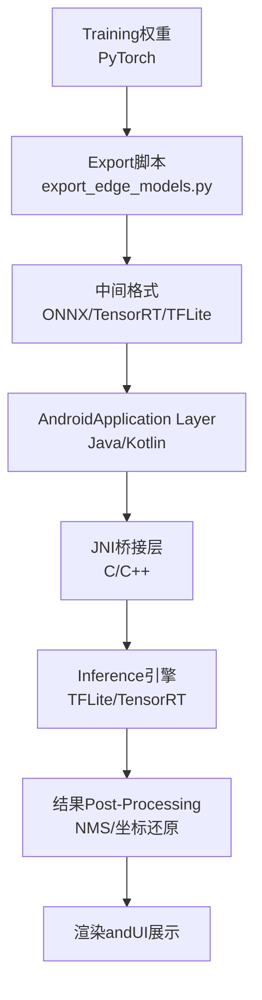
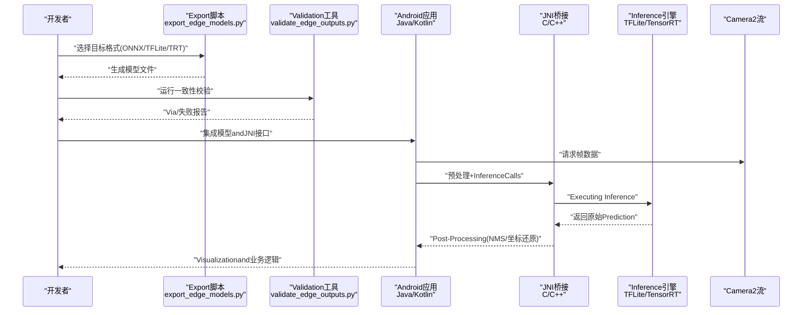
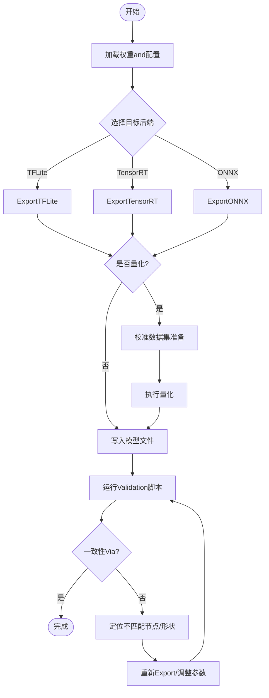
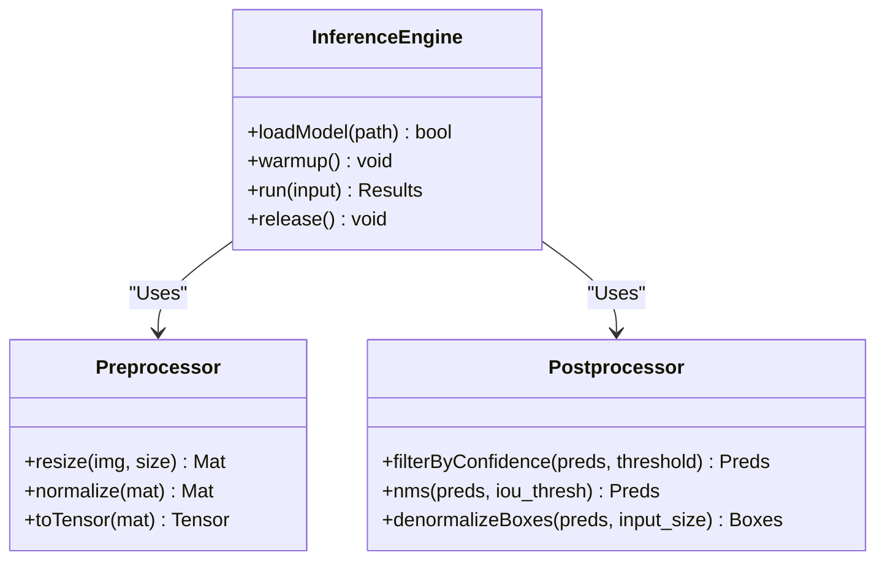
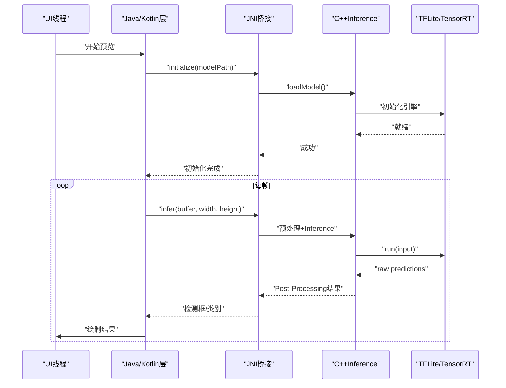
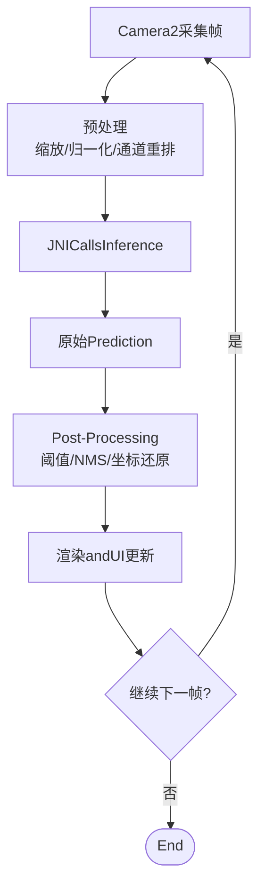
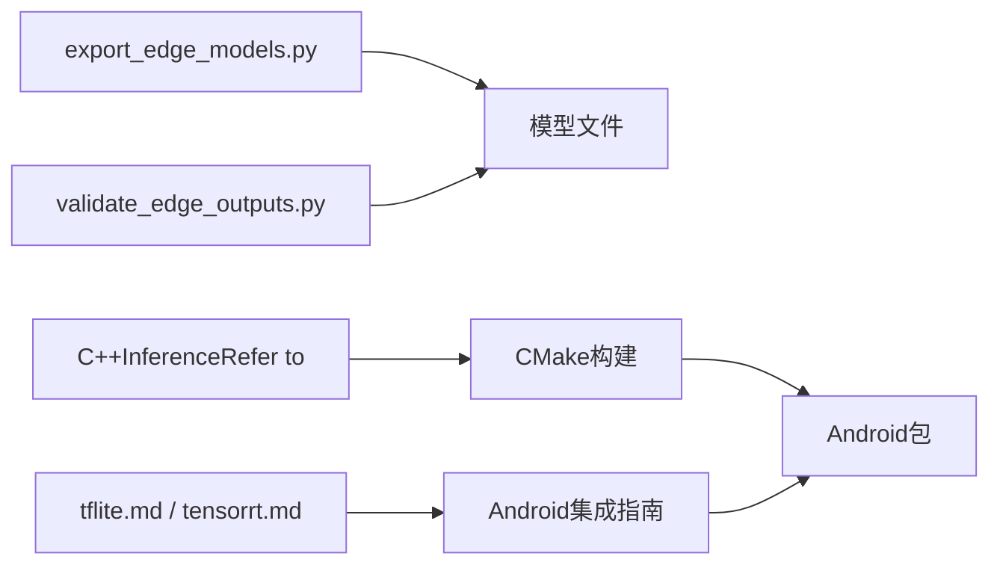

# Android平台部署

<cite>
**Files Referenced in This Document**
- [README.md](file://README.md)
- [export_edge_models.py](file://examples/YOLO-Master-Edge-Deployment/export_edge_models.py)
- [edge_utils.py](file://examples/YOLO-Master-Edge-Deployment/edge_utils.py)
- [validate_edge_outputs.py](file://examples/YOLO-Master-Edge-Deployment/validate_edge_outputs.py)
- [CMakeLists.txt](file://examples/YOLO-Master-Edge-Deployment/CMakeLists.txt)
- [inference.cpp](file://examples/YOLOv8-CPP-Inference/inference.cpp)
- [inference.h](file://examples/YOLOv8-CPP-Inference/inference.h)
- [main.cpp](file://examples/YOLOv8-CPP-Inference/main.cpp)
- [tflite.md](file://docs/en/integrations/tflite.md)
- [tensorrt.md](file://docs/en/integrations/tensorrt.md)
- [model-deployment-options.md](file://docs/en/guides/model-deployment-options.md)
- [model-deployment-practices.md](file://docs/en/guides/model-deployment-practices.md)
</cite>

## Table of Contents
1. [Introduction](#Introduction)
2. [Project Structure](#Project Structure)
3. [Core Components](#Core Components)
4. [Architecture Overview](#Architecture Overview)
5. [Detailed Component Analysis](#Detailed Component Analysis)
6. [Dependency Analysis](#Dependency Analysis)
7. [性能考量](#性能考量)
8. [Troubleshooting Guide](#Troubleshooting Guide)
9. [Conclusion](#Conclusion)
10. [Appendix](#Appendix)

## Introduction
本文件targetingwhileAndroid平台上部署YOLO-Master的工程实践，聚焦Centered on下目标：
- 模型转换andOptimization：从PyTorchExporttoTensorRTandTFLite，覆盖格式转换、量化加速and内存Optimization。
- Android原生集成：NDK开发、JNI桥接andC++Inference引擎集成路径。
- 摄像头实时Inference：Camera2 API接入、Image PreprocessingandPost-ProcessingOptimization。
- Examplesand构建：provides可复用的Examples工程结构andGradle构建配置要点。
- 性能监控：UsesAndroid Studio ProfilerandPerfetto进行端to端性能分析。
- 兼容性and适配：不同Android版本and设备差异的适配策略。
- 发布准备：APK打包OptimizationandGoogle Play发布检查清单。

## Project Structure
仓库中andAndroid部署相关的资源主要分布whileCentered on下位置：
- Edge deployment examples and scripts：examples/YOLO-Master-Edge-Deployment
- C++InferenceRefer toimplementing：examples/YOLOv8-CPP-Inference（可作forAndroid NDK集成的Refer to）
- 官方Documentation：docs/en/integrations/tflite.md、docs/en/integrations/tensorrt.md、docs/en/guides/model-deployment-options.md、docs/en/guides/model-deployment-practices.md

Figure Source
- [export_edge_models.py:1-200](file://examples/YOLO-Master-Edge-Deployment/export_edge_models.py#L1-L200)
- [tflite.md:1-200](file://docs/en/integrations/tflite.md#L1-L200)
- [tensorrt.md:1-200](file://docs/en/integrations/tensorrt.md#L1-L200)

Section Source
- [README.md:1-200](file://README.md#L1-L200)
- [export_edge_models.py:1-200](file://examples/YOLO-Master-Edge-Deployment/export_edge_models.py#L1-L200)
- [tflite.md:1-200](file://docs/en/integrations/tflite.md#L1-L200)
- [tensorrt.md:1-200](file://docs/en/integrations/tensorrt.md#L1-L200)

## Core Components
- Model ExportandValidation
  - Export脚本负责将Training好的YOLO-Master模型转换for边缘可用格式，并输出校验工具用于一致性Validation。
  - 关键文件：export_edge_models.py、validate_edge_outputs.py、edge_utils.py。
- C++InferenceRefer to
  - providesC++Inference入口andEncapsulates，便于移植toAndroid NDK环境。
  - 关键文件：inference.cpp、inference.h、main.cpp、CMakeLists.txt。
- 官方集成Documentation
  - TFLiteandTensorRT的集成说明、最佳实践and注意事项。
  - 关键文件：tflite.md、tensorrt.md、model-deployment-options.md、model-deployment-practices.md。

Section Source
- [export_edge_models.py:1-200](file://examples/YOLO-Master-Edge-Deployment/export_edge_models.py#L1-L200)
- [validate_edge_outputs.py:1-200](file://examples/YOLO-Master-Edge-Deployment/validate_edge_outputs.py#L1-L200)
- [edge_utils.py:1-200](file://examples/YOLO-Master-Edge-Deployment/edge_utils.py#L1-L200)
- [inference.cpp:1-200](file://examples/YOLOv8-CPP-Inference/inference.cpp#L1-L200)
- [inference.h:1-200](file://examples/YOLOv8-CPP-Inference/inference.h#L1-L200)
- [main.cpp:1-200](file://examples/YOLOv8-CPP-Inference/main.cpp#L1-L200)
- [CMakeLists.txt:1-200](file://examples/YOLO-Master-Edge-Deployment/CMakeLists.txt#L1-L200)
- [tflite.md:1-200](file://docs/en/integrations/tflite.md#L1-L200)
- [tensorrt.md:1-200](file://docs/en/integrations/tensorrt.md#L1-L200)
- [model-deployment-options.md:1-200](file://docs/en/guides/model-deployment-options.md#L1-L200)
- [model-deployment-practices.md:1-200](file://docs/en/guides/model-deployment-practices.md#L1-L200)

## Architecture Overview
下图展示了从TrainingtoAndroid端Inference的整体流程，包括Export、量化、JNI桥接and摄像头流水线。

Figure Source
- [export_edge_models.py:1-200](file://examples/YOLO-Master-Edge-Deployment/export_edge_models.py#L1-L200)
- [validate_edge_outputs.py:1-200](file://examples/YOLO-Master-Edge-Deployment/validate_edge_outputs.py#L1-L200)
- [tflite.md:1-200](file://docs/en/integrations/tflite.md#L1-L200)
- [tensorrt.md:1-200](file://docs/en/integrations/tensorrt.md#L1-L200)

## Detailed Component Analysis

### Model ExportandValidation（Python侧）
- 功能概述
  - 将YOLO-MasterModel ExportforEdge Deployment所需格式（such asONNX、TFLite、TensorRT）。
  - providesExport参数控制（输入尺寸、精度、动态形状etc.），Centered onand批量Exportcapabilities。
  - 配套Validation脚本用于对比Export前后输出一致性，确保转换正确性。
- 关键流程
  - 加载Training权重and配置。
  - 根据目标后端选择ExporterandOptimization选项。
  - 写入模型文件and元数据。
  - 运行Validation脚本进行数值一致性检查。
- 复杂度andOptimization点
  - Export阶段的时间复杂度受模型规模and图Optimization影响；建议开启算子融合and常量折叠。
  - 量化阶段需校准数据集，注意校准误差对精度的影响。
- 错误处理
  - 针对不Supporting的算子或形状约束，应给出明确错误Tipsand回退方案（such as禁用某些Optimization）。

Section Source
- [export_edge_models.py:1-200](file://examples/YOLO-Master-Edge-Deployment/export_edge_models.py#L1-L200)
- [validate_edge_outputs.py:1-200](file://examples/YOLO-Master-Edge-Deployment/validate_edge_outputs.py#L1-L200)
- [edge_utils.py:1-200](file://examples/YOLO-Master-Edge-Deployment/edge_utils.py#L1-L200)

#### Export流程图

Figure Source
- [export_edge_models.py:1-200](file://examples/YOLO-Master-Edge-Deployment/export_edge_models.py#L1-L200)
- [validate_edge_outputs.py:1-200](file://examples/YOLO-Master-Edge-Deployment/validate_edge_outputs.py#L1-L200)

### C++InferenceRefer to（Android NDK集成基础）
- 功能概述
  - provides统一的Inference接口Encapsulates，包含模型加载、输入预处理、Inference执行and结果解析。
  - 作forAndroid NDK集成的Refer toimplementing，便于Migration至C++Inference引擎（TFLite/TensorRT）。
- 关键类and方法
  - InferenceEncapsulates类：负责生命周期管理（初始化、预热、Inference、释放）。
  - 输入预处理：图像缩放、归一化、通道重排。
  - Post-Processing：Confidence Threshold过滤、NMS、坐标还原。
- 构建系统
  - UsesCMake组织源码and依赖，便于交叉编译toAndroid ABI（arm64-v8a、armeabi-v7a）。
- 性能要点
  - 避免频繁分配内存，复用缓冲区。
  - Set appropriately线程数and批大小，平衡吞吐and时延。
  - 利用SIMD指令and底层库Optimization（OpenBLAS、ARM Compute Libraryetc.）。

Section Source
- [inference.cpp:1-200](file://examples/YOLOv8-CPP-Inference/inference.cpp#L1-L200)
- [inference.h:1-200](file://examples/YOLOv8-CPP-Inference/inference.h#L1-L200)
- [main.cpp:1-200](file://examples/YOLOv8-CPP-Inference/main.cpp#L1-L200)
- [CMakeLists.txt:1-200](file://examples/YOLO-Master-Edge-Deployment/CMakeLists.txt#L1-L200)

#### Inference类图（概念映射）

Figure Source
- [inference.cpp:1-200](file://examples/YOLOv8-CPP-Inference/inference.cpp#L1-L200)
- [inference.h:1-200](file://examples/YOLOv8-CPP-Inference/inference.h#L1-L200)

### Android集成andJNI桥接
- 集成步骤
  - whileAndroid工程中引入预编译的Native库（.so），并ViaCMake或ndk-build链接。
  - 定义JNI接口，暴露模型加载、Inferenceand资源释放方法给Java/Kotlin层。
  - whileJava/Kotlin中CallsJNI，传递Bitmap或ByteBuffer，接收检测结果。
- 关键注意事项
  - 线程安全：确保Inference对象跨线程访问时的同步and状态隔离。
  - 内存管理：避免while高频回调中创建临时对象，尽量复用缓冲区。
  - 异常处理：捕获底层异常并向上抛出友好错误信息。
- 摄像头流水线
  - UsesCamera2 API获取YUV/RGB帧，进行必要的颜色空间转换and尺寸对齐。
  - 将帧送入预处理Modules，再CallsJNIInference，最后whilePost-Processing阶段绘制标注。

Section Source
- [tflite.md:1-200](file://docs/en/integrations/tflite.md#L1-L200)
- [tensorrt.md:1-200](file://docs/en/integrations/tensorrt.md#L1-L200)
- [model-deployment-options.md:1-200](file://docs/en/guides/model-deployment-options.md#L1-L200)
- [model-deployment-practices.md:1-200](file://docs/en/guides/model-deployment-practices.md#L1-L200)

#### JNICalls序列图

Figure Source
- [inference.cpp:1-200](file://examples/YOLOv8-CPP-Inference/inference.cpp#L1-L200)
- [tflite.md:1-200](file://docs/en/integrations/tflite.md#L1-L200)
- [tensorrt.md:1-200](file://docs/en/integrations/tensorrt.md#L1-L200)

### 摄像头实时Inference（Camera2 + 预处理/Post-Processing）
- 数据流
  - Camera2providesImageReader回调，获取帧数据。
  - 预处理：尺寸缩放、归一化、通道顺序调整。
  - Inference：ViaJNICallsC++Inference，得to原始Prediction。
  - Post-Processing：置信度过滤、NMS、坐标还原and边界框规范化。
- Optimization建议
  - UsesDirectBuffer减少拷贝。
  - 采用异步流水线，分离采集、预处理、Inferenceand渲染。
  - 根据设备capabilities动态调整分辨率and批大小。

Section Source
- [tflite.md:1-200](file://docs/en/integrations/tflite.md#L1-L200)
- [tensorrt.md:1-200](file://docs/en/integrations/tensorrt.md#L1-L200)
- [model-deployment-practices.md:1-200](file://docs/en/guides/model-deployment-practices.md#L1-L200)

#### 实时Inference流程图

Figure Source
- [tflite.md:1-200](file://docs/en/integrations/tflite.md#L1-L200)
- [tensorrt.md:1-200](file://docs/en/integrations/tensorrt.md#L1-L200)

## Dependency Analysis
- ExportandValidation
  - export_edge_models.py依赖Training权重and配置，输出多格式模型。
  - validate_edge_outputs.py依赖Export产物，进行一致性校验。
- Inferenceand构建
  - C++InferenceRefer toimplementingViaCMake组织，便于交叉编译toAndroid ABI。
- 官方Documentation
  - tflite.mdandtensorrt.mdprovides后端集成细节and最佳实践。

Figure Source
- [export_edge_models.py:1-200](file://examples/YOLO-Master-Edge-Deployment/export_edge_models.py#L1-L200)
- [validate_edge_outputs.py:1-200](file://examples/YOLO-Master-Edge-Deployment/validate_edge_outputs.py#L1-L200)
- [CMakeLists.txt:1-200](file://examples/YOLO-Master-Edge-Deployment/CMakeLists.txt#L1-L200)
- [tflite.md:1-200](file://docs/en/integrations/tflite.md#L1-L200)
- [tensorrt.md:1-200](file://docs/en/integrations/tensorrt.md#L1-L200)

Section Source
- [export_edge_models.py:1-200](file://examples/YOLO-Master-Edge-Deployment/export_edge_models.py#L1-L200)
- [validate_edge_outputs.py:1-200](file://examples/YOLO-Master-Edge-Deployment/validate_edge_outputs.py#L1-L200)
- [CMakeLists.txt:1-200](file://examples/YOLO-Master-Edge-Deployment/CMakeLists.txt#L1-L200)
- [tflite.md:1-200](file://docs/en/integrations/tflite.md#L1-L200)
- [tensorrt.md:1-200](file://docs/en/integrations/tensorrt.md#L1-L200)

## 性能考量
- 模型层面
  - 量化：INT8/FP16权衡精度and速度，选择合适的校准集。
  - 图Optimization：启用算子融合、常量折叠、死代码消除。
- 运行时层面
  - 线程池and批处理：根据设备CPU/GPUcapabilities调优并行度。
  - 内存复用：避免频繁分配，Uses对象池and环形缓冲。
- 管线层面
  - 异步流水线：解耦采集、预处理、Inferenceand渲染，降低主线程压力。
  - 动态分辨率：根据场景复杂度自适应调整输入尺寸。

[本节for通用指导，无需特定文件引用]

## Troubleshooting Guide
- Export不一致
  - 现象：Export后精度下降或输出不一致。
  - 排查：核对输入形状、归一化参数、NMS阈值；UsesValidation脚本定位差异节点。
- Inference崩溃或卡顿
  - 现象：JNICalls崩溃、ANR或帧率骤降。
  - 排查：检查线程安全、内存泄漏、缓冲区越界；UsesProfiler定位热点。
- 摄像头问题
  - 现象：黑屏、画面旋转错误或延迟高。
  - 排查：确认ImageFormatand色彩空间、Surface绑定、回调频率。

Section Source
- [validate_edge_outputs.py:1-200](file://examples/YOLO-Master-Edge-Deployment/validate_edge_outputs.py#L1-L200)
- [inference.cpp:1-200](file://examples/YOLOv8-CPP-Inference/inference.cpp#L1-L200)
- [tflite.md:1-200](file://docs/en/integrations/tflite.md#L1-L200)
- [tensorrt.md:1-200](file://docs/en/integrations/tensorrt.md#L1-L200)

## Conclusion
ViawhilePython侧完成Model ExportandValidation，并whileAndroid端Centered onJNI桥接C++Inference引擎，可implementingYOLO-Master的高效部署。CombiningCamera2流水线and性能监控工具，可while不同设备上取得稳定且高效的实时检测体验。建议while发布前进行全面的兼容性测试and性能回归，确保满足User体验and商店审核要求。

[本节for总结，无需特定文件引用]

## Appendix

### AndroidExamples项目andGradle构建要点
- ExamplesRefer to
  - UsesC++InferenceRefer toimplementing作forJNI集成的基础，CombiningCMake构建Android ABI。
- Gradle关键点
  - 配置ndkBuild或CMake路径，指定ABI过滤器（arm64-v8a、armeabi-v7a）。
  - 将预编译.so放入jniLibsTable of Contents或ViaCMake直接构建。
  - whilebuild.gradle中启用外部Native库and资源压缩。

Section Source
- [CMakeLists.txt:1-200](file://examples/YOLO-Master-Edge-Deployment/CMakeLists.txt#L1-L200)
- [inference.cpp:1-200](file://examples/YOLOv8-CPP-Inference/inference.cpp#L1-L200)
- [inference.h:1-200](file://examples/YOLOv8-CPP-Inference/inference.h#L1-L200)
- [main.cpp:1-200](file://examples/YOLOv8-CPP-Inference/main.cpp#L1-L200)

### Android特有性能监控工具
- Android Studio Profiler
  - CPU/内存/网络/电池视图，定位热点函数and内存泄漏。
- Perfetto
  - 系统级追踪，记录GPU/CPU调度、I/Oand合成事件，适合端to端bottlenecks分析。
- Uses建议
  - while真实设备上录制长时Tasks，关注Jankand帧时间分布。
  - CombiningLoggingandTraceView/Perfetto，形成闭环Optimization。

[本节for通用指导，无需特定文件引用]

### 兼容性and设备适配策略
- Android版本
  - 最低API级别and目标API级别需and依赖库兼容。
  - 针对旧设备降级策略（such as关闭高级Optimization、降低分辨率）。
- 设备差异
  - CPU架构（arm64-v8a优先）、GPUdrivers are installedSupporting（TensorRT/OpenGL/Vulkan）。
  - 内存and存储限制，动态加载and按需卸载资源。

Section Source
- [model-deployment-options.md:1-200](file://docs/en/guides/model-deployment-options.md#L1-L200)
- [model-deployment-practices.md:1-200](file://docs/en/guides/model-deployment-practices.md#L1-L200)

### APK打包OptimizationandGoogle Play发布检查清单
- 打包Optimization
  - 启用资源压缩and混淆（R8/ProGuard）。
  - 仅保留必要ABIand资源，减小APK体积。
- 发布检查
  - 权限最小化、隐私政策合规。
  - 性能基准回归Via，稳定性测试无崩溃。
  - 商店描述and截图符合规范。

[本节for通用指导，无需特定文件引用]