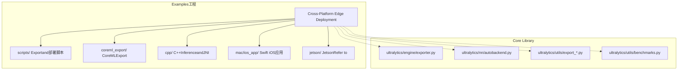
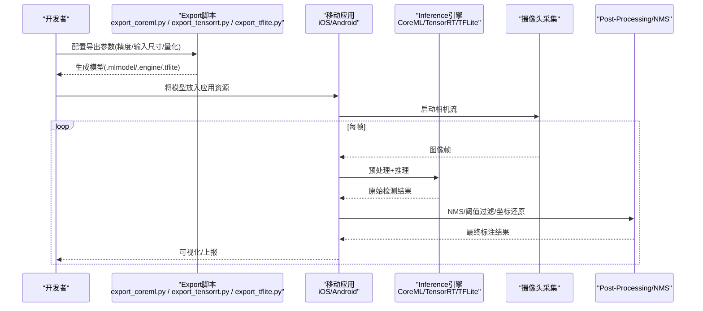
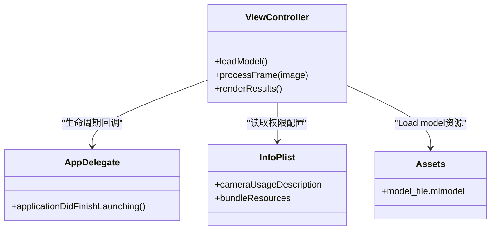
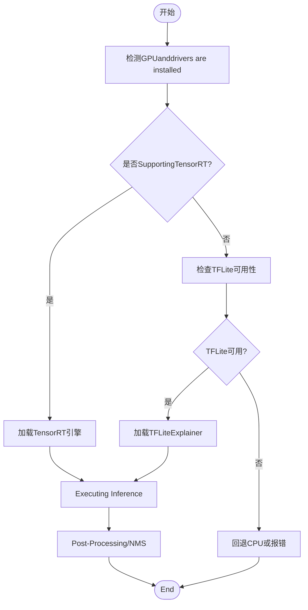
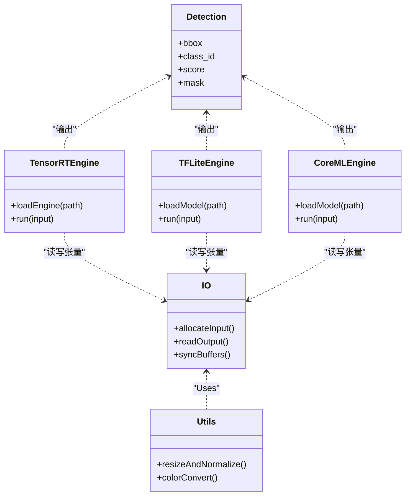
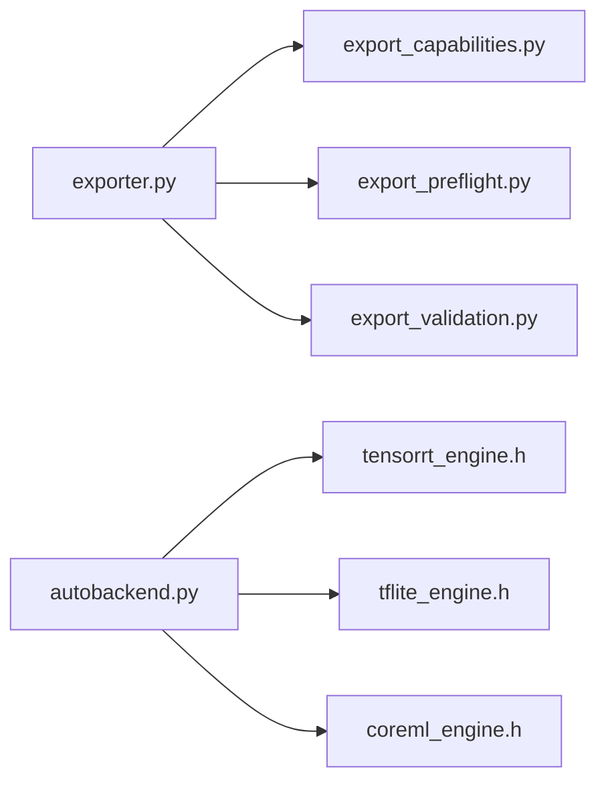
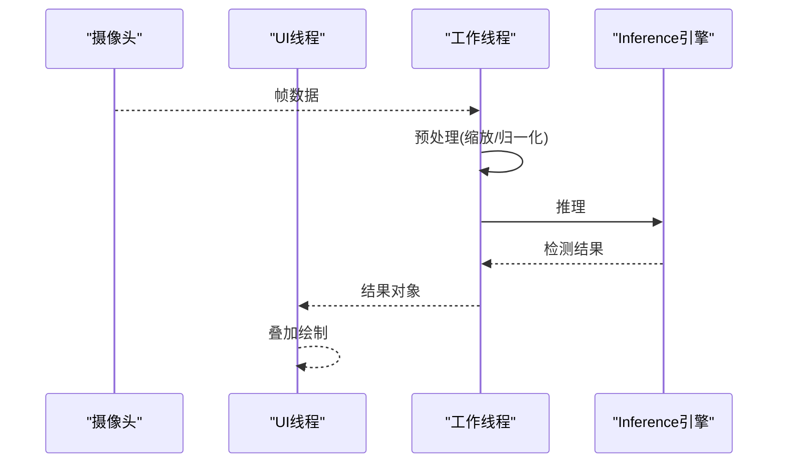

# Mobile Deployment

<cite>
**Files Referenced in This Document**
- [README.md](file://README.md)
- [examples/YOLO-Master-Cross-Platform-Edge-Deployment/README.md](file://examples/YOLO-Master-Cross-Platform-Edge-Deployment/README.md)
- [examples/YOLO-Master-Cross-Platform-Edge-Deployment/TECHNICAL_REPORT.md](file://examples/YOLO-Master-Cross-Platform-Edge-Deployment/TECHNICAL_REPORT.md)
- [examples/YOLO-Master-Cross-Platform-Edge-Deployment/scripts/export_coreml.py](file://examples/YOLO-Master-Cross-Platform-Edge-Deployment/scripts/export_coreml.py)
- [examples/YOLO-Master-Cross-Platform-Edge-Deployment/coreml_export/export_coreml.py](file://examples/YOLO-Master-Cross-Platform-Edge-Deployment/coreml_export/export_coreml.py)
- [examples/YOLO-Master-Cross-Platform-Edge-Deployment/mac/ios_app/ViewController.swift](file://examples/YOLO-Master-Cross-Platform-Edge-Deployment/mac/ios_app/ViewController.swift)
- [examples/YOLO-Master-Cross-Platform-Edge-Deployment/mac/ios_app/AppDelegate.swift](file://examples/YOLO-Master-Cross-Platform-Edge-Deployment/mac/ios_app/AppDelegate.swift)
- [examples/YOLO-Master-Cross-Platform-Edge-Deployment/mac/ios_app/Info.plist](file://examples/YOLO-Master-Cross-Platform-Edge-Deployment/mac/ios_app/Info.plist)
- [examples/YOLO-Master-Cross-Platform-Edge-Deployment/mac/ios_app/Assets.xcassets/Contents.json](file://examples/YOLO-Master-Cross-Platform-Edge-Deployment/mac/ios_app/Assets.xcassets/Contents.json)
- [examples/YOLO-Master-Cross-Platform-Edge-Deployment/cpp/android/app/src/main/java/com/yolo/master/MainActivity.java](file://examples/YOLO-Master-Cross-Platform-Edge-Deployment/cpp/android/app/src/main/java/com/yolo/master/MainActivity.java)
- [examples/YOLO-Master-Cross-Platform-Edge-Deployment/cpp/android/app/build.gradle](file://examples/YOLO-Master-Cross-Platform-Edge-Deployment/cpp/android/app/build.gradle)
- [examples/YOLO-Master-Cross-Platform-Edge-Deployment/cpp/android/app/CMakeLists.txt](file://examples/YOLO-Master-Cross-Platform-Edge-Deployment/cpp/android/app/CMakeLists.txt)
- [examples/YOLO-Master-Cross-Platform-Edge-Deployment/cpp/android/app/src/main/jni/inference.cpp](file://examples/YOLO-Master-Cross-Platform-Edge-Deployment/cpp/android/app/src/main/jni/inference.cpp)
- [examples/YOLO-Master-Cross-Platform-Edge-Deployment/cpp/common/io.h](file://examples/YOLO-Master-Cross-Platform-Edge-Deployment/cpp/common/io.h)
- [examples/YOLO-Master-Cross-Platform-Edge-Deployment/cpp/common/utils.h](file://examples/YOLO-Master-Cross-Platform-Edge-Deployment/cpp/common/utils.h)
- [examples/YOLO-Master-Cross-Platform-Edge-Deployment/cpp/common/detection.h](file://examples/YOLO-Master-Cross-Platform-Edge-Deployment/cpp/common/detection.h)
- [examples/YOLO-Master-Cross-Platform-Edge-Deployment/cpp/common/tensorrt_engine.h](file://examples/YOLO-Master-Cross-Platform-Edge-Deployment/cpp/common/tensorrt_engine.h)
- [examples/YOLO-Master-Cross-Platform-Edge-Deployment/cpp/common/tflite_engine.h](file://examples/YOLO-Master-Cross-Platform-Edge-Deployment/cpp/common/tflite_engine.h)
- [examples/YOLO-Master-Cross-Platform-Edge-Deployment/cpp/common/coreml_engine.h](file://examples/YOLO-Master-Cross-Platform-Edge-Deployment/cpp/common/coreml_engine.h)
- [examples/YOLO-Master-Cross-Platform-Edge-Deployment/cpp/common/engine_factory.h](file://examples/YOLO-Master-Cross-Platform-Edge-Deployment/cpp/common/engine_factory.h]
- [examples/YOLO-Master-Cross-Platform-Edge-Deployment/scripts/export_tensorrt.py](file://examples/YOLO-Master-Cross-Platform-Edge-Deployment/scripts/export_tensorrt.py)
- [examples/YOLO-Master-Cross-Platform-Edge-Deployment/scripts/export_tflite.py](file://examples/YOLO-Master-Cross-Platform-Edge-Deployment/scripts/export_tflite.py)
- [examples/YOLO-Master-Cross-Platform-Edge-Deployment/scripts/benchmark_mobile.sh](file://examples/YOLO-Master-Cross-Platform-Edge-Deployment/scripts/benchmark_mobile.sh)
- [examples/YOLO-Master-Cross-Platform-Edge-Deployment/scripts/deploy_ios.sh](file://examples/YOLO-Master-Cross-Platform-Edge-Deployment/scripts/deploy_ios.sh)
- [examples/YOLO-Master-Cross-Platform-Edge-Deployment/scripts/deploy_android.sh](file://examples/YOLO-Master-Cross-Platform-Edge-Deployment/scripts/deploy_android.sh)
- [examples/YOLO-Master-Cross-Platform-Edge-Deployment/jetson/run_infer.sh](file://examples/YOLO-Master-Cross-Platform-Edge-Deployment/jetson/run_infer.sh)
- [examples/YOLO-Master-Cross-Platform-Edge-Deployment/jetson/config.yaml](file://examples/YOLO-Master-Cross-Platform-Edge-Deployment/jetson/config.yaml)
- [ultralytics/utils/export_capabilities.py](file://ultralytics/utils/export_capabilities.py)
- [ultralytics/utils/export_preflight.py](file://ultralytics/utils/export_preflight.py)
- [ultralytics/utils/export_validation.py](file://ultralytics/utils/export_validation.py)
- [ultralytics/nn/autobackend.py](file://ultralytics/nn/autobackend.py)
- [ultralytics/engine/exporter.py](file://ultralytics/engine/exporter.py)
- [ultralytics/utils/benchmarks.py](file://ultralytics/utils/benchmarks.py)
- [ultralytics/utils/errors.py](file://ultralytics/utils/errors.py)
</cite>

## Table of Contents
1. [Introduction](#Introduction)
2. [Project Structure](#Project Structure)
3. [Core Components](#Core Components)
4. [Architecture Overview](#Architecture Overview)
5. [Detailed Component Analysis](#Detailed Component Analysis)
6. [Dependency Analysis](#Dependency Analysis)
7. [性能and内存Optimization](#性能and内存Optimization)
8. [摄像头集成and实时Inference](#摄像头集成and实时Inference)
9. [应用开发模式](#应用开发模式)
10. [构建and部署脚本](#构建and部署脚本)
11. [性能监控and分析工具](#性能监控and分析工具)
12. [错误处理and异常恢复](#错误处理and异常恢复)
13. [平台适配and对比](#平台适配and对比)
14. [Troubleshooting Guide](#Troubleshooting Guide)
15. [Conclusion](#Conclusion)

## Introduction
本技术DocumentationtargetingYOLO-MasterwhileiOSandAndroid平台的Mobile Deployment，覆盖CoreML、TensorRT、TFLiteetc.Inference框架的集成方法；阐述Model Compression、量化加速and内存池管理etc.Optimization策略；说明原生应用集成、Flutter插件andReact Native桥接的开发模式；provides摄像头采集and实时InferenceOptimization方案；给出Examples工程and构建脚本路径；并包含移动端性能监控、错误处理and多芯片平台适配建议。

## Project Structure
移动端相关代码主要位于跨平台Edge DeploymentExamples工程中，包含：
- iOS端：Swift原生工程，UsesCoreML进行Inference
- Android端：C++Inference引擎（TensorRT/TFLite/CoreML）ViaJNI暴露给Java层
- Exportand转换脚本：CoreML/TensorRT/TFLiteExport流程
- 基准测试and部署脚本：一键Export、构建and运行
- JetsonRefer toimplementing：用于对比andMigrationRefer to

Figure Source
- [examples/YOLO-Master-Cross-Platform-Edge-Deployment/README.md](file://examples/YOLO-Master-Cross-Platform-Edge-Deployment/README.md)
- [examples/YOLO-Master-Cross-Platform-Edge-Deployment/TECHNICAL_REPORT.md](file://examples/YOLO-Master-Cross-Platform-Edge-Deployment/TECHNICAL_REPORT.md)
- [ultralytics/engine/exporter.py](file://ultralytics/engine/exporter.py)
- [ultralytics/nn/autobackend.py](file://ultralytics/nn/autobackend.py)

Section Source
- [examples/YOLO-Master-Cross-Platform-Edge-Deployment/README.md](file://examples/YOLO-Master-Cross-Platform-Edge-Deployment/README.md)
- [examples/YOLO-Master-Cross-Platform-Edge-Deployment/TECHNICAL_REPORT.md](file://examples/YOLO-Master-Cross-Platform-Edge-Deployment/TECHNICAL_REPORT.md)

## Core Components
- Exportand预检capabilities
  - 统一Export入口andcapabilities矩阵：定义各后端Supporting情况and参数约束
  - Export前检查：Validation输入形状、精度、设备可用性
  - Export后校验：确保输出一致性、数值稳定性
- 自动后端选择
  - 根据目标平台and可用运行时动态选择最优后端
- 基准测试工具
  - provides端to端延迟、吞吐、内存占用统计

Section Source
- [ultralytics/utils/export_capabilities.py](file://ultralytics/utils/export_capabilities.py)
- [ultralytics/utils/export_preflight.py](file://ultralytics/utils/export_preflight.py)
- [ultralytics/utils/export_validation.py](file://ultralytics/utils/export_validation.py)
- [ultralytics/nn/autobackend.py](file://ultralytics/nn/autobackend.py)
- [ultralytics/utils/benchmarks.py](file://ultralytics/utils/benchmarks.py)
- [ultralytics/engine/exporter.py](file://ultralytics/engine/exporter.py)

## Architecture Overview
移动端Inference整体流程：Training权重 → Exporting to特定格式（CoreML/TensorRT/TFLite）→ 打包至应用资源 → 运行时加载引擎 → 摄像头帧预处理 → Inference → NMSandPost-Processing → 结果渲染and上报。

Figure Source
- [examples/YOLO-Master-Cross-Platform-Edge-Deployment/scripts/export_coreml.py](file://examples/YOLO-Master-Cross-Platform-Edge-Deployment/scripts/export_coreml.py)
- [examples/YOLO-Master-Cross-Platform-Edge-Deployment/scripts/export_tensorrt.py](file://examples/YOLO-Master-Cross-Platform-Edge-Deployment/scripts/export_tensorrt.py)
- [examples/YOLO-Master-Cross-Platform-Edge-Deployment/scripts/export_tflite.py](file://examples/YOLO-Master-Cross-Platform-Edge-Deployment/scripts/export_tflite.py)
- [examples/YOLO-Master-Cross-Platform-Edge-Deployment/mac/ios_app/ViewController.swift](file://examples/YOLO-Master-Cross-Platform-Edge-Deployment/mac/ios_app/ViewController.swift)
- [examples/YOLO-Master-Cross-Platform-Edge-Deployment/cpp/android/app/src/main/java/com/yolo/master/MainActivity.java](file://examples/YOLO-Master-Cross-Platform-Edge-Deployment/cpp/android/app/src/main/java/com/yolo/master/MainActivity.java)

## Detailed Component Analysis

### iOS端（CoreML）
- Export流程
  - UsesCoreMLExport脚本完成权重to.mlmodel的转换，可配置输入尺寸、精度and量化选项
  - Export后校验确保andPython端一致
- 应用集成
  - Swift工程加载CoreML模型，EncapsulatesPrediction接口
  - 相机权限and预览whileInfo.plist中声明，控制器负责帧捕获andInference调度
  - 资源管理：模型文件置于Assets或Bundle中，按需懒加载

Figure Source
- [examples/YOLO-Master-Cross-Platform-Edge-Deployment/mac/ios_app/ViewController.swift](file://examples/YOLO-Master-Cross-Platform-Edge-Deployment/mac/ios_app/ViewController.swift)
- [examples/YOLO-Master-Cross-Platform-Edge-Deployment/mac/ios_app/AppDelegate.swift](file://examples/YOLO-Master-Cross-Platform-Edge-Deployment/mac/ios_app/AppDelegate.swift)
- [examples/YOLO-Master-Cross-Platform-Edge-Deployment/mac/ios_app/Info.plist](file://examples/YOLO-Master-Cross-Platform-Edge-Deployment/mac/ios_app/Info.plist)
- [examples/YOLO-Master-Cross-Platform-Edge-Deployment/mac/ios_app/Assets.xcassets/Contents.json](file://examples/YOLO-Master-Cross-Platform-Edge-Deployment/mac/ios_app/Assets.xcassets/Contents.json)
- [examples/YOLO-Master-Cross-Platform-Edge-Deployment/scripts/export_coreml.py](file://examples/YOLO-Master-Cross-Platform-Edge-Deployment/scripts/export_coreml.py)
- [examples/YOLO-Master-Cross-Platform-Edge-Deployment/coreml_export/export_coreml.py](file://examples/YOLO-Master-Cross-Platform-Edge-Deployment/coreml_export/export_coreml.py)

Section Source
- [examples/YOLO-Master-Cross-Platform-Edge-Deployment/mac/ios_app/ViewController.swift](file://examples/YOLO-Master-Cross-Platform-Edge-Deployment/mac/ios_app/ViewController.swift)
- [examples/YOLO-Master-Cross-Platform-Edge-Deployment/mac/ios_app/AppDelegate.swift](file://examples/YOLO-Master-Cross-Platform-Edge-Deployment/mac/ios_app/AppDelegate.swift)
- [examples/YOLO-Master-Cross-Platform-Edge-Deployment/mac/ios_app/Info.plist](file://examples/YOLO-Master-Cross-Platform-Edge-Deployment/mac/ios_app/Info.plist)
- [examples/YOLO-Master-Cross-Platform-Edge-Deployment/mac/ios_app/Assets.xcassets/Contents.json](file://examples/YOLO-Master-Cross-Platform-Edge-Deployment/mac/ios_app/Assets.xcassets/Contents.json)
- [examples/YOLO-Master-Cross-Platform-Edge-Deployment/scripts/export_coreml.py](file://examples/YOLO-Master-Cross-Platform-Edge-Deployment/scripts/export_coreml.py)
- [examples/YOLO-Master-Cross-Platform-Edge-Deployment/coreml_export/export_coreml.py](file://examples/YOLO-Master-Cross-Platform-Edge-Deployment/coreml_export/export_coreml.py)

### Android端（TensorRT/TFLite）
- Export流程
  - TensorRTExport需指定GPU架构and精度（FP16/INT8），生成.engine文件
  - TFLiteExport可启用量化andOptimizer，生成.tflite文件
- 应用集成
  - Java层ViaJNICallsC++InferenceModules
  - C++层Encapsulates不同引擎的Unified Interface，按平台特性选择最佳后端
  - 构建系统UsesCMake编译原生库，Gradle集成toAndroid应用

Figure Source
- [examples/YOLO-Master-Cross-Platform-Edge-Deployment/scripts/export_tensorrt.py](file://examples/YOLO-Master-Cross-Platform-Edge-Deployment/scripts/export_tensorrt.py)
- [examples/YOLO-Master-Cross-Platform-Edge-Deployment/scripts/export_tflite.py](file://examples/YOLO-Master-Cross-Platform-Edge-Deployment/scripts/export_tflite.py)
- [examples/YOLO-Master-Cross-Platform-Edge-Deployment/cpp/android/app/src/main/java/com/yolo/master/MainActivity.java](file://examples/YOLO-Master-Cross-Platform-Edge-Deployment/cpp/android/app/src/main/java/com/yolo/master/MainActivity.java)
- [examples/YOLO-Master-Cross-Platform-Edge-Deployment/cpp/android/app/src/main/jni/inference.cpp](file://examples/YOLO-Master-Cross-Platform-Edge-Deployment/cpp/android/app/src/main/jni/inference.cpp)
- [examples/YOLO-Master-Cross-Platform-Edge-Deployment/cpp/common/tensorrt_engine.h](file://examples/YOLO-Master-Cross-Platform-Edge-Deployment/cpp/common/tensorrt_engine.h)
- [examples/YOLO-Master-Cross-Platform-Edge-Deployment/cpp/common/tflite_engine.h](file://examples/YOLO-Master-Cross-Platform-Edge-Deployment/cpp/common/tflite_engine.h)
- [examples/YOLO-Master-Cross-Platform-Edge-Deployment/cpp/common/engine_factory.h](file://examples/YOLO-Master-Cross-Platform-Edge-Deployment/cpp/common/engine_factory.h)

Section Source
- [examples/YOLO-Master-Cross-Platform-Edge-Deployment/cpp/android/app/src/main/java/com/yolo/master/MainActivity.java](file://examples/YOLO-Master-Cross-Platform-Edge-Deployment/cpp/android/app/src/main/java/com/yolo/master/MainActivity.java)
- [examples/YOLO-Master-Cross-Platform-Edge-Deployment/cpp/android/app/build.gradle](file://examples/YOLO-Master-Cross-Platform-Edge-Deployment/cpp/android/app/build.gradle)
- [examples/YOLO-Master-Cross-Platform-Edge-Deployment/cpp/android/app/CMakeLists.txt](file://examples/YOLO-Master-Cross-Platform-Edge-Deployment/cpp/android/app/CMakeLists.txt)
- [examples/YOLO-Master-Cross-Platform-Edge-Deployment/cpp/android/app/src/main/jni/inference.cpp](file://examples/YOLO-Master-Cross-Platform-Edge-Deployment/cpp/android/app/src/main/jni/inference.cpp)
- [examples/YOLO-Master-Cross-Platform-Edge-Deployment/cpp/common/tensorrt_engine.h](file://examples/YOLO-Master-Cross-Platform-Edge-Deployment/cpp/common/tensorrt_engine.h)
- [examples/YOLO-Master-Cross-Platform-Edge-Deployment/cpp/common/tflite_engine.h](file://examples/YOLO-Master-Cross-Platform-Edge-Deployment/cpp/common/tflite_engine.h)
- [examples/YOLO-Master-Cross-Platform-Edge-Deployment/cpp/common/engine_factory.h](file://examples/YOLO-Master-Cross-Platform-Edge-Deployment/cpp/common/engine_factory.h)

### 通用C++Inference接口
- IOand张量操作
  - 统一的输入输出Encapsulates，屏蔽底层差异
- 工具函数
  - 图像缩放、归一化、颜色空间转换
- 检测数据结构
  - 边界框、类别、置信度、掩码etc.
- 引擎抽象
  - forTensorRT/TFLite/CoreMLprovidesUnified Interface

Figure Source
- [examples/YOLO-Master-Cross-Platform-Edge-Deployment/cpp/common/io.h](file://examples/YOLO-Master-Cross-Platform-Edge-Deployment/cpp/common/io.h)
- [examples/YOLO-Master-Cross-Platform-Edge-Deployment/cpp/common/utils.h](file://examples/YOLO-Master-Cross-Platform-Edge-Deployment/cpp/common/utils.h)
- [examples/YOLO-Master-Cross-Platform-Edge-Deployment/cpp/common/detection.h](file://examples/YOLO-Master-Cross-Platform-Edge-Deployment/cpp/common/detection.h)
- [examples/YOLO-Master-Cross-Platform-Edge-Deployment/cpp/common/tensorrt_engine.h](file://examples/YOLO-Master-Cross-Platform-Edge-Deployment/cpp/common/tensorrt_engine.h)
- [examples/YOLO-Master-Cross-Platform-Edge-Deployment/cpp/common/tflite_engine.h](file://examples/YOLO-Master-Cross-Platform-Edge-Deployment/cpp/common/tflite_engine.h)
- [examples/YOLO-Master-Cross-Platform-Edge-Deployment/cpp/common/coreml_engine.h](file://examples/YOLO-Master-Cross-Platform-Edge-Deployment/cpp/common/coreml_engine.h)

Section Source
- [examples/YOLO-Master-Cross-Platform-Edge-Deployment/cpp/common/io.h](file://examples/YOLO-Master-Cross-Platform-Edge-Deployment/cpp/common/io.h)
- [examples/YOLO-Master-Cross-Platform-Edge-Deployment/cpp/common/utils.h](file://examples/YOLO-Master-Cross-Platform-Edge-Deployment/cpp/common/utils.h)
- [examples/YOLO-Master-Cross-Platform-Edge-Deployment/cpp/common/detection.h](file://examples/YOLO-Master-Cross-Platform-Edge-Deployment/cpp/common/detection.h)
- [examples/YOLO-Master-Cross-Platform-Edge-Deployment/cpp/common/tensorrt_engine.h](file://examples/YOLO-Master-Cross-Platform-Edge-Deployment/cpp/common/tensorrt_engine.h)
- [examples/YOLO-Master-Cross-Platform-Edge-Deployment/cpp/common/tflite_engine.h](file://examples/YOLO-Master-Cross-Platform-Edge-Deployment/cpp/common/tflite_engine.h)
- [examples/YOLO-Master-Cross-Platform-Edge-Deployment/cpp/common/coreml_engine.h](file://examples/YOLO-Master-Cross-Platform-Edge-Deployment/cpp/common/coreml_engine.h)

## Dependency Analysis
- Export链路
  - exporter.py作forUnified entry point，Callsexport_capabilities.pyandexport_preflight.py进行capabilitiesand前置检查，再执行具体后端Export
  - Export后由export_validation.py进行一致性校验
- 运行时链路
  - autobackend.py根据平台and可用库选择后端
  - Examples工程的C++层对TensorRT/TFLite/CoreML进行Encapsulates并ViaJNI暴露给上层

Figure Source
- [ultralytics/engine/exporter.py](file://ultralytics/engine/exporter.py)
- [ultralytics/utils/export_capabilities.py](file://ultralytics/utils/export_capabilities.py)
- [ultralytics/utils/export_preflight.py](file://ultralytics/utils/export_preflight.py)
- [ultralytics/utils/export_validation.py](file://ultralytics/utils/export_validation.py)
- [ultralytics/nn/autobackend.py](file://ultralytics/nn/autobackend.py)
- [examples/YOLO-Master-Cross-Platform-Edge-Deployment/cpp/common/tensorrt_engine.h](file://examples/YOLO-Master-Cross-Platform-Edge-Deployment/cpp/common/tensorrt_engine.h)
- [examples/YOLO-Master-Cross-Platform-Edge-Deployment/cpp/common/tflite_engine.h](file://examples/YOLO-Master-Cross-Platform-Edge-Deployment/cpp/common/tflite_engine.h)
- [examples/YOLO-Master-Cross-Platform-Edge-Deployment/cpp/common/coreml_engine.h](file://examples/YOLO-Master-Cross-Platform-Edge-Deployment/cpp/common/coreml_engine.h)

Section Source
- [ultralytics/engine/exporter.py](file://ultralytics/engine/exporter.py)
- [ultralytics/utils/export_capabilities.py](file://ultralytics/utils/export_capabilities.py)
- [ultralytics/utils/export_preflight.py](file://ultralytics/utils/export_preflight.py)
- [ultralytics/utils/export_validation.py](file://ultralytics/utils/export_validation.py)
- [ultralytics/nn/autobackend.py](file://ultralytics/nn/autobackend.py)

## 性能and内存Optimization
- Model Compression
  - 剪枝andKnowledge Distillation可whileTraining阶段完成，Export时仅保留必要算子
  - 结构化剪枝有利于后端融合and缓存友好
- 量化加速
  - INT8量化需校准数据集and校准集统计，注意数值溢出and精度回退
  - FP16whileSupporting半精度的设备上显著降低带宽and功耗
- 内存池管理
  - 复用输入/输出缓冲区，避免频繁分配释放
  - 控制中间张量生命周期，减少峰值内存
- 批处理and流水线
  - Set appropriatelybatch size，Combining异步I/O提升吞吐
  - 前Post-ProcessingandInference并行化，利用双缓冲

[This section provides general guidance and does not directly analyze specific files]

## 摄像头集成and实时Inference
- iOS
  - UsesAVFoundation捕获视频帧，转换forCoreML输入格式
  - while后台队列Executing Inference，主线程渲染结果
- Android
  - CameraX或Camera2获取帧，转forNV21/RGB并预处理
  - JNICallsC++Inference，结果返回Java层绘制

[此图for概念流程图，无需Figure Source]

## 应用开发模式
- 原生应用集成
  - iOS：Swift工程直接CallsCoreML API
  - Android：Java/KotlinViaJNICallsC++Inference库
- Flutter插件
  - ViaPlatform Channel传递字节数组，C++侧Executing Inference并返回序列化结果
- React Native桥接
  - Uses原生Modules暴露Inference接口，JS侧Calls并处理结果

[This section provides general guidance and does not directly analyze specific files]

## 构建and部署脚本
- Export脚本
  - CoreML：export_coreml.py
  - TensorRT：export_tensorrt.py
  - TFLite：export_tflite.py
- 部署脚本
  - iOS：deploy_ios.sh（打包资源、签名、安装）
  - Android：deploy_android.sh（构建NDK、拷贝模型、安装APK）
- 基准测试
  - benchmark_mobile.sh（端to端延迟/吞吐统计）
- JetsonRefer to
  - run_infer.shandconfig.yaml用于对比andMigration

Section Source
- [examples/YOLO-Master-Cross-Platform-Edge-Deployment/scripts/export_coreml.py](file://examples/YOLO-Master-Cross-Platform-Edge-Deployment/scripts/export_coreml.py)
- [examples/YOLO-Master-Cross-Platform-Edge-Deployment/scripts/export_tensorrt.py](file://examples/YOLO-Master-Cross-Platform-Edge-Deployment/scripts/export_tensorrt.py)
- [examples/YOLO-Master-Cross-Platform-Edge-Deployment/scripts/export_tflite.py](file://examples/YOLO-Master-Cross-Platform-Edge-Deployment/scripts/export_tflite.py)
- [examples/YOLO-Master-Cross-Platform-Edge-Deployment/scripts/benchmark_mobile.sh](file://examples/YOLO-Master-Cross-Platform-Edge-Deployment/scripts/benchmark_mobile.sh)
- [examples/YOLO-Master-Cross-Platform-Edge-Deployment/scripts/deploy_ios.sh](file://examples/YOLO-Master-Cross-Platform-Edge-Deployment/scripts/deploy_ios.sh)
- [examples/YOLO-Master-Cross-Platform-Edge-Deployment/scripts/deploy_android.sh](file://examples/YOLO-Master-Cross-Platform-Edge-Deployment/scripts/deploy_android.sh)
- [examples/YOLO-Master-Cross-Platform-Edge-Deployment/jetson/run_infer.sh](file://examples/YOLO-Master-Cross-Platform-Edge-Deployment/jetson/run_infer.sh)
- [examples/YOLO-Master-Cross-Platform-Edge-Deployment/jetson/config.yaml](file://examples/YOLO-Master-Cross-Platform-Edge-Deployment/jetson/config.yaml)

## 性能监控and分析工具
- Python端基准
  - benchmarks.pyprovides端to端Metrics采集
- 移动端
  - iOS：Instruments（Time Profiler、Allocations、Leaks）
  - Android：Perfetto、Systrace、Profiler
- Loggingand诊断
  - 记录关键节点耗时、内存峰值、错误码

Section Source
- [ultralytics/utils/benchmarks.py](file://ultralytics/utils/benchmarks.py)

## 错误处理and异常恢复
- Export阶段
  - 前置检查失败时快速失败，Tips缺失依赖或不兼容参数
  - Export后校验失败时输出差异报告，辅助定位
- 运行阶段
  - 引擎加载失败is available, fall back to其他后端或CPU
  - 输入尺寸不匹配时抛出明确错误并终止
- 统一错误类型
  - Useserrors.py中的错误类进行规范化处理

Section Source
- [ultralytics/utils/export_preflight.py](file://ultralytics/utils/export_preflight.py)
- [ultralytics/utils/export_validation.py](file://ultralytics/utils/export_validation.py)
- [ultralytics/utils/errors.py](file://ultralytics/utils/errors.py)

## 平台适配and对比
- iOS（CoreML）
  - 优势：系统级Optimization、低功耗、易用性
  - 注意：模型大小限制、部分算子Supporting差异
- Android（TensorRT/TFLite）
  - TensorRT：GPU加速强，适合高通/联发科Adreno/Mali GPU
  - TFLite：跨设备兼容性好，CPU/GPU/NPU均可
- JetsonRefer to
  - 用于对比服务器/嵌入式场景，便于Migration策略制定

Section Source
- [examples/YOLO-Master-Cross-Platform-Edge-Deployment/TECHNICAL_REPORT.md](file://examples/YOLO-Master-Cross-Platform-Edge-Deployment/TECHNICAL_REPORT.md)
- [examples/YOLO-Master-Cross-Platform-Edge-Deployment/jetson/run_infer.sh](file://examples/YOLO-Master-Cross-Platform-Edge-Deployment/jetson/run_infer.sh)
- [examples/YOLO-Master-Cross-Platform-Edge-Deployment/jetson/config.yaml](file://examples/YOLO-Master-Cross-Platform-Edge-Deployment/jetson/config.yaml)

## Troubleshooting Guide
- Export问题
  - 检查export_capabilities.py确认后端Supporting
  - 查看export_preflight.py的错误信息，修正输入形状或精度
  - Usesexport_validation.py比对输出一致性
- 运行时问题
  - 确认模型文件路径and权限
  - 检查设备drivers are installedand库版本（such asTensorRT）
  - 调整量化参数或回退to更高精度
- 性能问题
  - Usesbenchmarks.py定位bottlenecks
  - 增大批处理或开启异步I/O
  - 减少不必要的拷贝and转换

Section Source
- [ultralytics/utils/export_capabilities.py](file://ultralytics/utils/export_capabilities.py)
- [ultralytics/utils/export_preflight.py](file://ultralytics/utils/export_preflight.py)
- [ultralytics/utils/export_validation.py](file://ultralytics/utils/export_validation.py)
- [ultralytics/utils/benchmarks.py](file://ultralytics/utils/benchmarks.py)

## Conclusion
本指南系统化梳理了YOLO-MasterwhileiOSandAndroid的Mobile Deployment路径，涵盖Export、集成、Optimizationand监控全流程。ViaExamples工程and脚本，开发者可快速落地高性能、低延迟的实时检测应用。建议while生产环境Combining设备特性进行量化and内存Optimization，并建立完善的错误处理and性能回归体系。