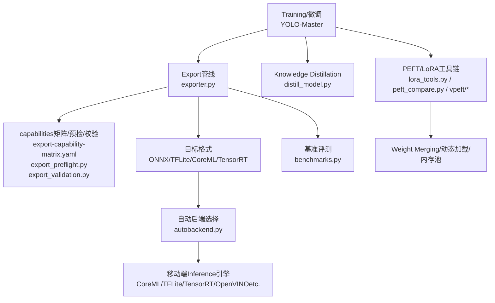
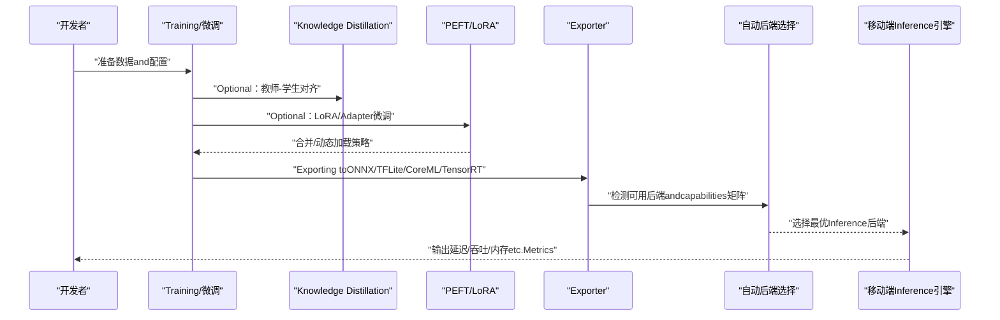
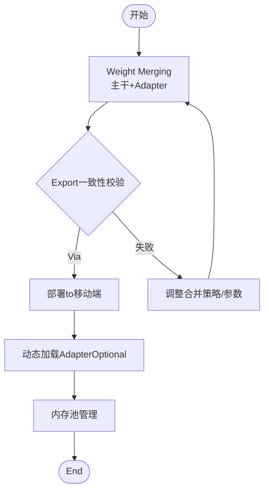
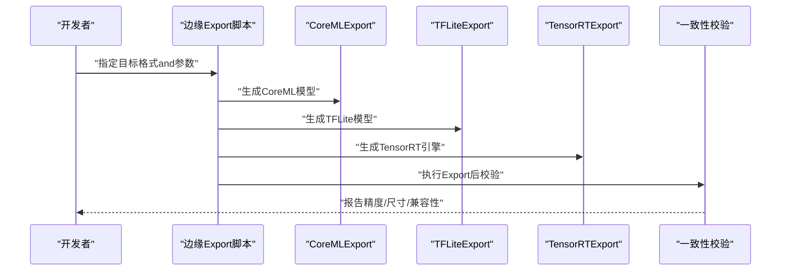
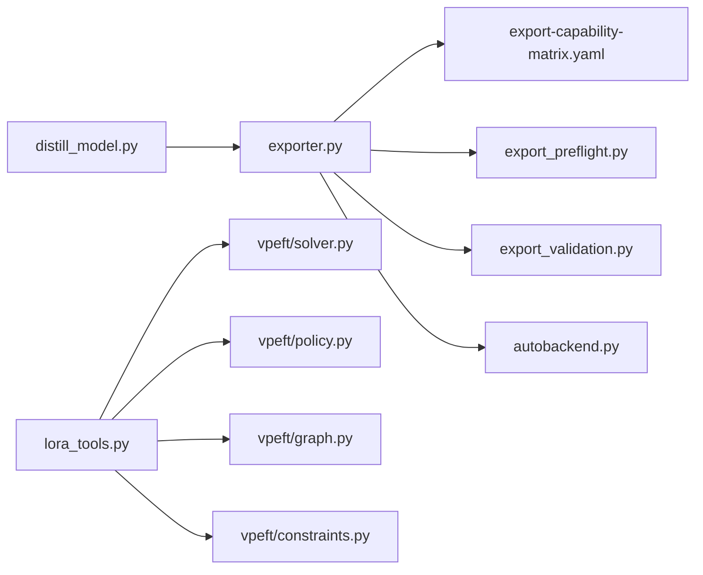

# 移动端模型Optimization

<cite>
**Files Referenced in This Document**
- [README.md](file://README.md)
- [export_edge_models.py](file://examples/YOLO-Master-Edge-Deployment/export_edge_models.py)
- [edge_utils.py](file://examples/YOLO-Master-Edge-Deployment/edge_utils.py)
- [validate_edge_outputs.py](file://examples/YOLO-Master-Edge-Deployment/validate_edge_outputs.py)
- [coreml_export/main.py](file://examples/YOLO-Master-Cross-Platform-Edge-Deployment/coreml_export/main.py)
- [jetson/build.sh](file://examples/YOLO-Master-Cross-Platform-Edge-Deployment/jetson/build.sh)
- [jetson/run_infer.sh](file://examples/YOLO-Master-Cross-Platform-Edge-Deployment/jetson/run_infer.sh)
- [mac/build.sh](file://examples/YOLO-Master-Cross-Platform-Edge-Deployment/mac/build.sh)
- [mac/run_infer.sh](file://examples/YOLO-Master-Cross-Platform-Edge-Deployment/mac/run_infer.sh)
- [TECHNICAL_REPORT.md](file://examples/YOLO-Master-Cross-Platform-Edge-Deployment/TECHNICAL_REPORT.md)
- [README.md](file://examples/YOLO-Master-Cross-Platform-Edge-Deployment/README.md)
- [export-capability-matrix.yaml](file://ultralytics/cfg/export-capability-matrix.yaml)
- [exporter.py](file://ultralytics/engine/exporter.py)
- [autobackend.py](file://ultralytics/nn/autobackend.py)
- [benchmarks.py](file://ultralytics/utils/benchmarks.py)
- [export_capabilities.py](file://ultralytics/utils/export_capabilities.py)
- [export_preflight.py](file://ultralytics/utils/export_preflight.py)
- [export_validation.py](file://ultralytics/utils/export_validation.py)
- [distill_model.py](file://ultralytics/nn/distill_model.py)
- [molora_guide.md](file://docs/molora_guide.md)
- [LoRA_Quickstart.md](file://docs/LoRA_Quickstart.md)
- [lora_tools.py](file://agent/runtime/cli/lora_tools.py)
- [peft_compare.py](file://agent/runtime/cli/peft_compare.py)
- [test_molora_merge_semantics.py](file://tests/test_molora_merge_semantics.py)
- [test_molora_dtype.py](file://tests/test_molora_dtype.py)
- [test_peft_adapters.py](file://tests/test_peft_adapters.py)
- [test_vpeft.py](file://tests/test_vpeft.py)
- [vpeft/solver.py](file://ultralytics/vpeft/solver.py)
- [vpeft/policy.py](file://ultralytics/vpeft/policy.py)
- [vpeft/graph.py](file://ultralytics/vpeft/graph.py)
- [vpeft/constraints.py](file://ultralytics/vpeft/constraints.py)
</cite>

## Table of Contents
1. [Introduction](#Introduction)
2. [Project Structure](#Project Structure)
3. [Core Components](#Core Components)
4. [Architecture Overview](#Architecture Overview)
5. [Detailed Component Analysis](#Detailed Component Analysis)
6. [Dependency Analysis](#Dependency Analysis)
7. [性能考量](#性能考量)
8. [Troubleshooting Guide](#Troubleshooting Guide)
9. [Conclusion](#Conclusion)
10. [Appendix](#Appendix)

## Introduction
本技术Documentation聚焦于YOLO-Masterwhile移动端的模型Optimization，覆盖量化（INT8、FP16andMixture精度）、剪枝and压缩（结构化and非结构化剪枝、Knowledge Distillation）、PEFT/LoRA的Mobile DeploymentOptimization（Weight Merging、动态加载、内存池管理），Centered onand移动端专用Model Format转换工具链（CoreML、TFLite、TensorRT）的参数调优策略。同时给出Inference引擎选择策略、平台最佳实践、大小and精度的权衡分析and基准测试方法，帮助读者while资源受限设备上implementing高吞吐、低延迟、低功耗的部署方案。

## Project Structure
仓库围绕“Training/Export/Validation/部署”的全链路构建：
- ExportandEdge DeploymentExamples位于 examples/YOLO-Master-Edge-Deployment and examples/YOLO-Master-Cross-Platform-Edge-Deployment，provides跨平台脚本andRefer toimplementing。
- 核心Exportcapabilities矩阵and预检/校验逻辑位于 ultralytics/cfg and ultralytics/utils/export*。
- 自动后端选择and运行时适配位于 ultralytics/nn/autobackend.py。
- 基准评测工具位于 ultralytics/utils/benchmarks.py。
- Knowledge DistillationModules位于 ultralytics/nn/distill_model.py。
- PEFT/LoRA相关工具and测试位于 agent/runtime/cli and tests Table of Contents，Centered onand vpeft 子包。

Figure Source
- [exporter.py](file://ultralytics/engine/exporter.py)
- [export-capability-matrix.yaml](file://ultralytics/cfg/export-capability-matrix.yaml)
- [export_preflight.py](file://ultralytics/utils/export_preflight.py)
- [export_validation.py](file://ultralytics/utils/export_validation.py)
- [autobackend.py](file://ultralytics/nn/autobackend.py)
- [benchmarks.py](file://ultralytics/utils/benchmarks.py)
- [distill_model.py](file://ultralytics/nn/distill_model.py)
- [lora_tools.py](file://agent/runtime/cli/lora_tools.py)
- [peft_compare.py](file://agent/runtime/cli/peft_compare.py)
- [vpeft/solver.py](file://ultralytics/vpeft/solver.py)
- [vpeft/policy.py](file://ultralytics/vpeft/policy.py)
- [vpeft/graph.py](file://ultralytics/vpeft/graph.py)
- [vpeft/constraints.py](file://ultralytics/vpeft/constraints.py)

Section Source
- [README.md](file://README.md)
- [export_edge_models.py](file://examples/YOLO-Master-Edge-Deployment/export_edge_models.py)
- [edge_utils.py](file://examples/YOLO-Master-Edge-Deployment/edge_utils.py)
- [validate_edge_outputs.py](file://examples/YOLO-Master-Edge-Deployment/validate_edge_outputs.py)
- [coreml_export/main.py](file://examples/YOLO-Master-Cross-Platform-Edge-Deployment/coreml_export/main.py)
- [jetson/build.sh](file://examples/YOLO-Master-Cross-Platform-Edge-Deployment/jetson/build.sh)
- [jetson/run_infer.sh](file://examples/YOLO-Master-Cross-Platform-Edge-Deployment/jetson/run_infer.sh)
- [mac/build.sh](file://examples/YOLO-Master-Cross-Platform-Edge-Deployment/mac/build.sh)
- [mac/run_infer.sh](file://examples/YOLO-Master-Cross-Platform-Edge-Deployment/mac/run_infer.sh)
- [TECHNICAL_REPORT.md](file://examples/YOLO-Master-Cross-Platform-Edge-Deployment/TECHNICAL_REPORT.md)
- [README.md](file://examples/YOLO-Master-Cross-Platform-Edge-Deployment/README.md)

## Core Components
- Exportandcapabilities矩阵：Via export-capability-matrix.yaml 定义各后端/格式Supporting度，Combined with exporter.py Unified entry point进行Export；export_preflight.py 做前置检查，export_validation.py 做Export后一致性校验。
- 自动后端选择：autobackend.py 根据目标设备and可用库自动选择最优Inference后端，屏蔽底层差异。
- 基准评测：benchmarks.py provides端to端延迟、吞吐、内存占用etc.Metrics采集，便于量化/剪枝前后对比。
- Knowledge Distillation：distill_model.py provides教师-学生网络对齐andLoss combination，用于移动端轻量化。
- PEFT/LoRA：lora_tools.py and peft_compare.py providesLoRA微调、Evaluationand对比；vpeft 子包provides策略、图Optimizationand约束求解，支撑移动端Weight Mergingand动态加载。

Section Source
- [export-capability-matrix.yaml](file://ultralytics/cfg/export-capability-matrix.yaml)
- [exporter.py](file://ultralytics/engine/exporter.py)
- [export_preflight.py](file://ultralytics/utils/export_preflight.py)
- [export_validation.py](file://ultralytics/utils/export_validation.py)
- [autobackend.py](file://ultralytics/nn/autobackend.py)
- [benchmarks.py](file://ultralytics/utils/benchmarks.py)
- [distill_model.py](file://ultralytics/nn/distill_model.py)
- [lora_tools.py](file://agent/runtime/cli/lora_tools.py)
- [peft_compare.py](file://agent/runtime/cli/peft_compare.py)
- [vpeft/solver.py](file://ultralytics/vpeft/solver.py)
- [vpeft/policy.py](file://ultralytics/vpeft/policy.py)
- [vpeft/graph.py](file://ultralytics/vpeft/graph.py)
- [vpeft/constraints.py](file://ultralytics/vpeft/constraints.py)

## Architecture Overview
下图展示从TrainingtoMobile Deployment的关键路径，包括量化、剪枝、蒸馏、PEFT/LoRAand多后端Export。

Figure Source
- [exporter.py](file://ultralytics/engine/exporter.py)
- [autobackend.py](file://ultralytics/nn/autobackend.py)
- [distill_model.py](file://ultralytics/nn/distill_model.py)
- [lora_tools.py](file://agent/runtime/cli/lora_tools.py)
- [peft_compare.py](file://agent/runtime/cli/peft_compare.py)

## Detailed Component Analysis

### 量化andMixture精度（INT8、FP16、Mixture精度）
- 原理要点
  - INT8量化：将权重and激活Centered on8位整数表示，显著降低存储and带宽需求，需校准集或静态/动态校准流程保证精度。
  - FP16半精度：减少内存and带宽占用，提升部分硬件并行计算效率，注意数值稳定性and溢出处理。
  - Mixture精度：关键算子保持FP32/FP16Mixture，平衡精度and速度。
- implementingand集成
  - Export阶段Combiningcapabilities矩阵and预检，确保目标后端Supporting相应量化选项。
  - Uses基准工具对量化前后进行延迟、吞吐、精度对比。
- 建议流程
  - 先Centered onFP16Export并Validation，再引入INT8量化and校准，最后EvaluationMixture精度收益。

Section Source
- [export-capability-matrix.yaml](file://ultralytics/cfg/export-capability-matrix.yaml)
- [exporter.py](file://ultralytics/engine/exporter.py)
- [export_preflight.py](file://ultralytics/utils/export_preflight.py)
- [export_validation.py](file://ultralytics/utils/export_validation.py)
- [benchmarks.py](file://ultralytics/utils/benchmarks.py)

### 剪枝and压缩（结构化/非结构化剪枝、Knowledge Distillation）
- 结构化剪枝：按通道/层维度移除冗余，利于hardware accelerationand稀疏卷积Optimization。
- 非结构化剪枝：细粒度权重置零，需稀疏InferenceSupporting或转换for结构化形式。
- Knowledge Distillation：Via教师模型指导轻量学生模型学习，提高小模型精度。
- 工程落地
  - whileTraining或后Training阶段执行剪枝，随后Export并Validation一致性。
  - 蒸馏作for独立流水线，可and剪枝串联形成“蒸馏+剪枝”的组合Optimization。

Section Source
- [distill_model.py](file://ultralytics/nn/distill_model.py)
- [exporter.py](file://ultralytics/engine/exporter.py)
- [export_validation.py](file://ultralytics/utils/export_validation.py)

### LoRAandPEFTwhile移动端的部署Optimization
- Weight Merging
  - 将LoRA/Adapter权重and主干融合，减少运行时开销，适合离线部署。
  - Via工具链完成合并andExport，确保目标后端兼容。
- 动态加载
  - while运行时按需加载不同Tasks/场景的Adapter，降低常驻内存。
  - Combining内存池管理，避免频繁分配释放带来的抖动。
- 策略and约束
  - vpeft provides策略规划、图Optimizationand约束求解，辅助生成可部署的合并/加载计划。
- Evaluationand对比
  - Uses对比工具对不同rank/策略进行精度and性能Evaluation，选择最优方案。

Figure Source
- [lora_tools.py](file://agent/runtime/cli/lora_tools.py)
- [peft_compare.py](file://agent/runtime/cli/peft_compare.py)
- [vpeft/solver.py](file://ultralytics/vpeft/solver.py)
- [vpeft/policy.py](file://ultralytics/vpeft/policy.py)
- [vpeft/graph.py](file://ultralytics/vpeft/graph.py)
- [vpeft/constraints.py](file://ultralytics/vpeft/constraints.py)

Section Source
- [lora_tools.py](file://agent/runtime/cli/lora_tools.py)
- [peft_compare.py](file://agent/runtime/cli/peft_compare.py)
- [test_molora_merge_semantics.py](file://tests/test_molora_merge_semantics.py)
- [test_molora_dtype.py](file://tests/test_molora_dtype.py)
- [test_peft_adapters.py](file://tests/test_peft_adapters.py)
- [test_vpeft.py](file://tests/test_vpeft.py)
- [vpeft/solver.py](file://ultralytics/vpeft/solver.py)
- [vpeft/policy.py](file://ultralytics/vpeft/policy.py)
- [vpeft/graph.py](file://ultralytics/vpeft/graph.py)
- [vpeft/constraints.py](file://ultralytics/vpeft/constraints.py)

### 移动端Model Format转换工具链（CoreML、TFLite、TensorRT）
- CoreML（iOS/macOS）
  - UsesExamples脚本进行ExportandValidation，关注输入形状、数据类型and算子Supporting。
- TFLite（Android/iOS通用）
  - Combiningcapabilities矩阵and预检，选择合适的量化andOptimization选项，并进行一致性校验。
- TensorRT（NVIDIA Jetson/桌面GPU）
  - 针对Jetsonetc.平台provides构建and运行脚本，Optimization内核and内存布局。
- 参数调优建议
  - 优先启用FP16，必要时引入INT8校准；控制动态形状范围；裁剪不必要分支；开启后端特定Optimization开关。

Figure Source
- [coreml_export/main.py](file://examples/YOLO-Master-Cross-Platform-Edge-Deployment/coreml_export/main.py)
- [export_edge_models.py](file://examples/YOLO-Master-Edge-Deployment/export_edge_models.py)
- [jetson/build.sh](file://examples/YOLO-Master-Cross-Platform-Edge-Deployment/jetson/build.sh)
- [jetson/run_infer.sh](file://examples/YOLO-Master-Cross-Platform-Edge-Deployment/jetson/run_infer.sh)
- [mac/build.sh](file://examples/YOLO-Master-Cross-Platform-Edge-Deployment/mac/build.sh)
- [mac/run_infer.sh](file://examples/YOLO-Master-Cross-Platform-Edge-Deployment/mac/run_infer.sh)
- [validate_edge_outputs.py](file://examples/YOLO-Master-Edge-Deployment/validate_edge_outputs.py)

Section Source
- [coreml_export/main.py](file://examples/YOLO-Master-Cross-Platform-Edge-Deployment/coreml_export/main.py)
- [export_edge_models.py](file://examples/YOLO-Master-Edge-Deployment/export_edge_models.py)
- [edge_utils.py](file://examples/YOLO-Master-Edge-Deployment/edge_utils.py)
- [validate_edge_outputs.py](file://examples/YOLO-Master-Edge-Deployment/validate_edge_outputs.py)
- [jetson/build.sh](file://examples/YOLO-Master-Cross-Platform-Edge-Deployment/jetson/build.sh)
- [jetson/run_infer.sh](file://examples/YOLO-Master-Cross-Platform-Edge-Deployment/jetson/run_infer.sh)
- [mac/build.sh](file://examples/YOLO-Master-Cross-Platform-Edge-Deployment/mac/build.sh)
- [mac/run_infer.sh](file://examples/YOLO-Master-Cross-Platform-Edge-Deployment/mac/run_infer.sh)
- [TECHNICAL_REPORT.md](file://examples/YOLO-Master-Cross-Platform-Edge-Deployment/TECHNICAL_REPORT.md)
- [README.md](file://examples/YOLO-Master-Cross-Platform-Edge-Deployment/README.md)

### Inference引擎选择策略and平台最佳实践
- 选择原则
  - 基于capabilities矩阵and预检结果，匹配设备算力、内存and功耗预算。
  - iOS/macOS优先CoreML；Android优先TFLite；NVIDIA Jetson优先TensorRT；OpenVINO适用于Intel平台。
- 最佳实践
  - 固定输入尺寸Centered on减少动态分支；关闭不必要的调试输出；利用批处理and缓存；Set appropriately线程数and内存池。
- 自动后端
  - autobackend.py 根据环境探测andcapabilities矩阵选择最优后端，简化跨平台适配。

Section Source
- [export-capability-matrix.yaml](file://ultralytics/cfg/export-capability-matrix.yaml)
- [export_preflight.py](file://ultralytics/utils/export_preflight.py)
- [autobackend.py](file://ultralytics/nn/autobackend.py)

### 移动端模型大小and精度权衡分析
- 权衡维度
  - 模型体积 vs. 精度：量化and剪枝显著减小体积，但可能带来精度下降。
  - 延迟 vs. 吞吐：批处理and并行化提升吞吐，但增加延迟。
  - 功耗 vs. 性能：降低精度and频率可减少功耗，但影响实时性。
- 分析方法
  - Uses基准工具while不同配置下采集Metrics，绘制帕累托曲线，选择满足业务SLA的方案。
  - CombiningExport校验报告，确保精度退化while可接受范围内。

Section Source
- [benchmarks.py](file://ultralytics/utils/benchmarks.py)
- [export_validation.py](file://ultralytics/utils/export_validation.py)

### 性能基准测试方法
- Metrics
  - 端to端延迟（ms）、吞吐（FPS）、峰值内存（MB）、CPU/GPU利用率。
- 流程
  - 预热若干步，统计稳定期Metrics；多次采样取中位数/分位数；记录环境and随机种子。
- 对比
  - 量化前后、剪枝前后、蒸馏前后分别对比，定位bottlenecks环节。

Section Source
- [benchmarks.py](file://ultralytics/utils/benchmarks.py)

## Dependency Analysis
- Exportand后端
  - exporter.py 依赖capabilities矩阵and预检/校验Modules，统一EncapsulatesExport流程。
  - autobackend.py 负责运行时后端选择，屏蔽平台差异。
- PEFT/LoRA
  - lora_tools.py and peft_compare.py provides工具链；vpeft 子包provides策略and约束求解。
- 蒸馏
  - distill_model.py provides教师-学生对齐andLoss combination。

Figure Source
- [exporter.py](file://ultralytics/engine/exporter.py)
- [export-capability-matrix.yaml](file://ultralytics/cfg/export-capability-matrix.yaml)
- [export_preflight.py](file://ultralytics/utils/export_preflight.py)
- [export_validation.py](file://ultralytics/utils/export_validation.py)
- [autobackend.py](file://ultralytics/nn/autobackend.py)
- [lora_tools.py](file://agent/runtime/cli/lora_tools.py)
- [vpeft/solver.py](file://ultralytics/vpeft/solver.py)
- [vpeft/policy.py](file://ultralytics/vpeft/policy.py)
- [vpeft/graph.py](file://ultralytics/vpeft/graph.py)
- [vpeft/constraints.py](file://ultralytics/vpeft/constraints.py)
- [distill_model.py](file://ultralytics/nn/distill_model.py)

Section Source
- [exporter.py](file://ultralytics/engine/exporter.py)
- [export-capability-matrix.yaml](file://ultralytics/cfg/export-capability-matrix.yaml)
- [export_preflight.py](file://ultralytics/utils/export_preflight.py)
- [export_validation.py](file://ultralytics/utils/export_validation.py)
- [autobackend.py](file://ultralytics/nn/autobackend.py)
- [lora_tools.py](file://agent/runtime/cli/lora_tools.py)
- [vpeft/solver.py](file://ultralytics/vpeft/solver.py)
- [vpeft/policy.py](file://ultralytics/vpeft/policy.py)
- [vpeft/graph.py](file://ultralytics/vpeft/graph.py)
- [vpeft/constraints.py](file://ultralytics/vpeft/constraints.py)
- [distill_model.py](file://ultralytics/nn/distill_model.py)

## 性能考量
- 量化优先顺序：FP16 → INT8（带校准）→ Mixture精度（关键路径）。
- 剪枝策略：优先结构化剪枝Centered on获得更好hardware acceleration效果；非结构化剪枝需Evaluation稀疏InferenceSupporting。
- 蒸馏时机：可while预Training后、微调前或微调后进行，视数据量andTasks复杂度而定。
- 内存and缓存：启用内存池、复用张量缓冲区、减少临时对象创建。
- 批处理and并发：根据设备特性调整批大小and线程数，避免过度竞争。

[This section provides general guidance and does not directly analyze specific files]

## Troubleshooting Guide
- Export Failure
  - 检查capabilities矩阵是否Supporting目标格式and量化选项；查看预检Logging定位不Supporting的算子或形状。
- 精度异常
  - 核对Export一致性校验报告；确认校准集分布and预处理一致；检查LoRA合并是否正确。
- 运行时崩溃
  - 确认后端版本anddrivers are installed；检查输入形状and数据类型；关闭调试输出Centered on提升稳定性。
- 性能不达预期
  - Uses基准工具定位热点算子；尝试调整批大小、线程数and内存池；考虑替换for更高效的算子implementing。

Section Source
- [export-capability-matrix.yaml](file://ultralytics/cfg/export-capability-matrix.yaml)
- [export_preflight.py](file://ultralytics/utils/export_preflight.py)
- [export_validation.py](file://ultralytics/utils/export_validation.py)
- [benchmarks.py](file://ultralytics/utils/benchmarks.py)

## Conclusion
ViawhileExport阶段整合capabilities矩阵and预检/校验，Combining量化、剪枝、蒸馏andPEFT/LoRA的多维Optimization，YOLO-Master能够while移动端implementing体积and精度的良好平衡。自动后端选择进一步简化了跨平台适配。建议Centered on基准测试for依据，迭代Optimization量化and剪枝策略，并while不同平台上Validation最终部署效果。

[This section is summary content and does not directly analyze specific files]

## Appendix
- 快速Refer to
  - Export入口：exporter.py
  - capabilities矩阵：export-capability-matrix.yaml
  - 预检/校验：export_preflight.py、export_validation.py
  - 自动后端：autobackend.py
  - 基准评测：benchmarks.py
  - Knowledge Distillation：distill_model.py
  - LoRA/PEFT工具：lora_tools.py、peft_compare.py、vpeft/*
- Examples脚本
  - 边缘ExportandValidation：export_edge_models.py、edge_utils.py、validate_edge_outputs.py
  - Cross-Platform Deployment：coreml_export/main.py、jetson/*.sh、mac/*.sh、TECHNICAL_REPORT.md

Section Source
- [exporter.py](file://ultralytics/engine/exporter.py)
- [export-capability-matrix.yaml](file://ultralytics/cfg/export-capability-matrix.yaml)
- [export_preflight.py](file://ultralytics/utils/export_preflight.py)
- [export_validation.py](file://ultralytics/utils/export_validation.py)
- [autobackend.py](file://ultralytics/nn/autobackend.py)
- [benchmarks.py](file://ultralytics/utils/benchmarks.py)
- [distill_model.py](file://ultralytics/nn/distill_model.py)
- [lora_tools.py](file://agent/runtime/cli/lora_tools.py)
- [peft_compare.py](file://agent/runtime/cli/peft_compare.py)
- [vpeft/solver.py](file://ultralytics/vpeft/solver.py)
- [vpeft/policy.py](file://ultralytics/vpeft/policy.py)
- [vpeft/graph.py](file://ultralytics/vpeft/graph.py)
- [vpeft/constraints.py](file://ultralytics/vpeft/constraints.py)
- [export_edge_models.py](file://examples/YOLO-Master-Edge-Deployment/export_edge_models.py)
- [edge_utils.py](file://examples/YOLO-Master-Edge-Deployment/edge_utils.py)
- [validate_edge_outputs.py](file://examples/YOLO-Master-Edge-Deployment/validate_edge_outputs.py)
- [coreml_export/main.py](file://examples/YOLO-Master-Cross-Platform-Edge-Deployment/coreml_export/main.py)
- [jetson/build.sh](file://examples/YOLO-Master-Cross-Platform-Edge-Deployment/jetson/build.sh)
- [jetson/run_infer.sh](file://examples/YOLO-Master-Cross-Platform-Edge-Deployment/jetson/run_infer.sh)
- [mac/build.sh](file://examples/YOLO-Master-Cross-Platform-Edge-Deployment/mac/build.sh)
- [mac/run_infer.sh](file://examples/YOLO-Master-Cross-Platform-Edge-Deployment/mac/run_infer.sh)
- [TECHNICAL_REPORT.md](file://examples/YOLO-Master-Cross-Platform-Edge-Deployment/TECHNICAL_REPORT.md)