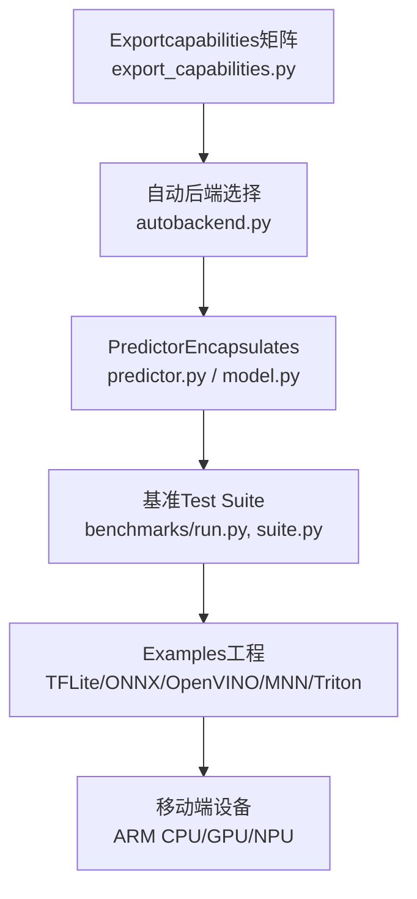
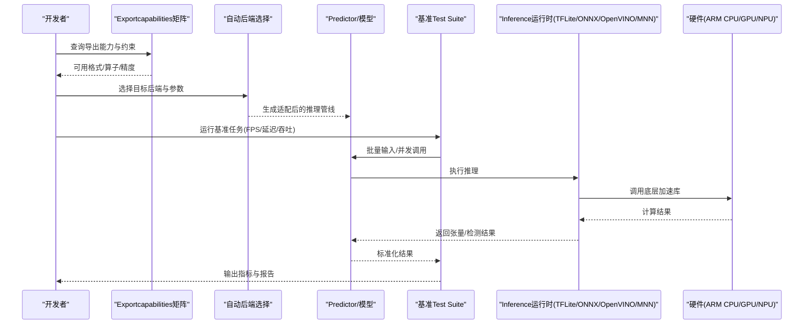
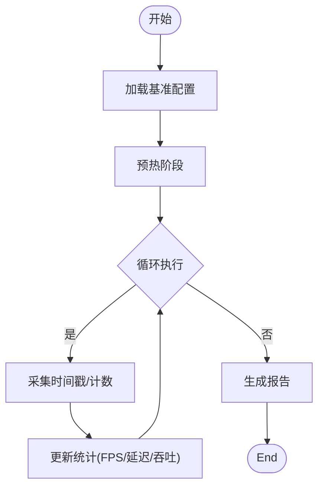
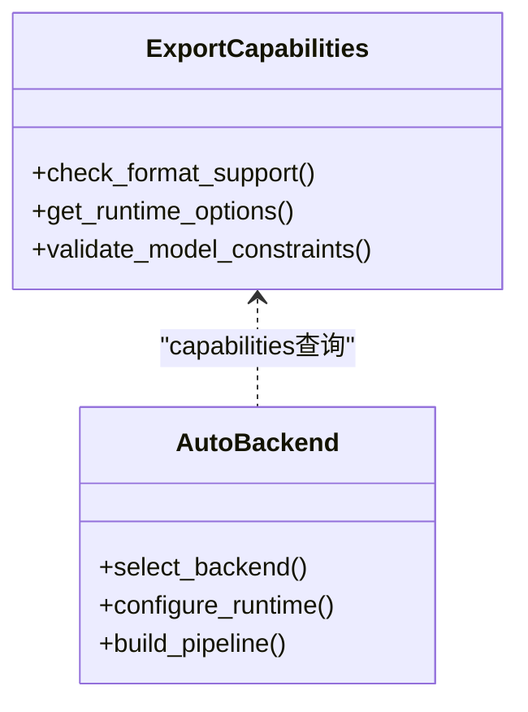
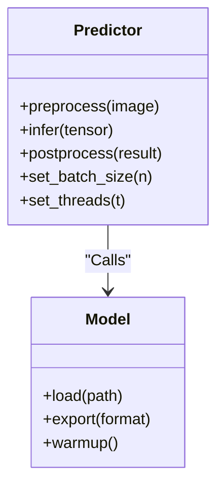

# 移动端性能调优

<cite>
**Files Referenced in This Document**
- [benchmarks/run.py](file://benchmarks/run.py)
- [benchmarks/suite.py](file://benchmarks/suite.py)
- [benchmarks/benchmark_molora_dispatch.py](file://benchmarks/benchmark_molora_dispatch.py)
- [benchmarks/benchmark_mot_dispatch.py](file://benchmarks/benchmark_mot_dispatch.py)
- [ultralytics/utils/benchmarks.py](file://ultralytics/utils/benchmarks.py)
- [ultralytics/engine/predictor.py](file://ultralytics/engine/predictor.py)
- [ultralytics/engine/model.py](file://ultralytics/engine/model.py)
- [ultralytics/nn/autobackend.py](file://ultralytics/nn/autobackend.py)
- [ultralytics/utils/autodevice.py](file://ultralytics/utils/autodevice.py)
- [ultralytics/utils/export_capabilities.py](file://ultralytics/utils/export_capabilities.py)
- [examples/YOLO-Master-Cross-Platform-Edge-Deployment/TECHNICAL_REPORT.md](file://examples/YOLO-Master-Cross-Platform-Edge-Deployment/TECHNICAL_REPORT.md)
- [examples/YOLO-Master-Edge-Deployment/export_edge_models.py](file://examples/YOLO-Master-Edge-Deployment/export_edge_models.py)
- [examples/YOLO-Master-Edge-Deployment/edge_utils.py](file://examples/YOLO-Master-Edge-Deployment/edge_utils.py)
- [examples/YOLOv8-TFLite-Python/main.py](file://examples/YOLOv8-TFLite-Python/main.py)
- [examples/YOLOv8-ONNXRuntime-Rust/Cargo.toml](file://examples/YOLOv8-ONNXRuntime-Rust/Cargo.toml)
- [examples/YOLOv8-OpenVINO-CPP-Inference/main.cc](file://examples/YOLOv8-OpenVINO-CPP-Inference/main.cc)
- [examples/YOLOv8-OpenVINO-CPP-Inference/inference.cc](file://examples/YOLOv8-OpenVINO-CPP-Inference/inference.cc)
- [examples/YOLOv8-ONNXRuntime-CPP/inference.cpp](file://examples/YOLOv8-ONNXRuntime-CPP/inference.cpp)
- [examples/YOLOv8-ONNXRuntime-CPP/main.cpp](file://examples/YOLOv8-ONNXRuntime-CPP/main.cpp)
- [examples/YOLOv8-MNN-CPP/main.cpp](file://examples/YOLOv8-MNN-CPP/main.cpp)
- [examples/YOLO11-Triton-CPP/inference.cpp](file://examples/YOLO11-Triton-CPP/inference.cpp)
- [examples/YOLO11-Triton-CPP/main.cpp](file://examples/YOLO11-Triton-CPP/main.cpp)
- [tests/test_benchmark_suite.py](file://tests/test_benchmark_suite.py)
- [tests/test_autobackend_warmup.py](file://tests/test_autobackend_warmup.py)
</cite>

## Table of Contents
1. [Introduction](#Introduction)
2. [Project Structure](#Project Structure)
3. [Core Components](#Core Components)
4. [Architecture Overview](#Architecture Overview)
5. [Detailed Component Analysis](#Detailed Component Analysis)
6. [Dependency Analysis](#Dependency Analysis)
7. [性能考量](#性能考量)
8. [Troubleshooting Guide](#Troubleshooting Guide)
9. [Conclusion](#Conclusion)
10. [Appendix](#Appendix)

## Introduction
本文件targetingYOLO-Masterwhile移动端的性能调优，系统化阐述Centered on下主题：
- 移动端性能分析方法：CPU/GPU利用率监控、内存Uses分析and电池消耗Evaluation
- InferenceOptimization技术：批处理Optimization、线程池管理、异步Inferenceimplementing
- 多平台Optimization策略：ARM CPU、GPU、NPUand专用AI加速器（such asTFLite、ONNX Runtime、OpenVINO、MNNetc.）
- 基准Test SuiteUses方法：FPS测量、延迟分析and吞吐量测试
- 内存管理最佳实践：内存池设计、对象复用and垃圾回收Optimization
- 启动Optimization：热启动and冷启动时间减少策略
- 诊断工具and调试技巧：定位bottlenecks、ValidationOptimization效果

## Project Structure
本项目围绕“Model Export—端侧Inference—基准评测”的闭环构建。and移动端性能相关的关键路径包括：
- Exportcapabilities矩阵and自动后端选择，决定目标设备可用的Inference引擎and算子Supporting
- 端to端PredictorEncapsulates，统一输入预处理、Inference执行andPost-Processing流程
- 基准Test Suite，provides可复用的FPS、延迟and吞吐度量
- Examples工程覆盖主流移动端Inference框架（TFLite、ONNX Runtime、OpenVINO、MNN、Tritonetc.），便于跨平台对比

Figure Source
- [ultralytics/utils/export_capabilities.py](file://ultralytics/utils/export_capabilities.py)
- [ultralytics/nn/autobackend.py](file://ultralytics/nn/autobackend.py)
- [ultralytics/engine/predictor.py](file://ultralytics/engine/predictor.py)
- [ultralytics/engine/model.py](file://ultralytics/engine/model.py)
- [benchmarks/run.py](file://benchmarks/run.py)
- [benchmarks/suite.py](file://benchmarks/suite.py)

Section Source
- [ultralytics/utils/export_capabilities.py](file://ultralytics/utils/export_capabilities.py)
- [ultralytics/nn/autobackend.py](file://ultralytics/nn/autobackend.py)
- [ultralytics/engine/predictor.py](file://ultralytics/engine/predictor.py)
- [ultralytics/engine/model.py](file://ultralytics/engine/model.py)
- [benchmarks/run.py](file://benchmarks/run.py)
- [benchmarks/suite.py](file://benchmarks/suite.py)

## Core Components
- Exportcapabilities矩阵and自动后端
  - Viacapabilities矩阵判断目标设备Supporting的Export格式and运行时特性，drivers are installed自动后端选择
  - 关键文件：[ultralytics/utils/export_capabilities.py](file://ultralytics/utils/export_capabilities.py)、[ultralytics/nn/autobackend.py](file://ultralytics/nn/autobackend.py)
- PredictorandModel Encapsulation
  - 统一Encapsulates预处理、Inference、Post-Processingand结果解析，屏蔽不同后端差异
  - 关键文件：[ultralytics/engine/predictor.py](file://ultralytics/engine/predictor.py)、[ultralytics/engine/model.py](file://ultralytics/engine/model.py)
- 基准Test Suite
  - provides统一的基准入口and用例编排，SupportingFPS、延迟、吞吐etc.Metrics采集
  - 关键文件：[benchmarks/run.py](file://benchmarks/run.py)、[benchmarks/suite.py](file://benchmarks/suite.py)、[ultralytics/utils/benchmarks.py](file://ultralytics/utils/benchmarks.py)
- 移动端Examples工程
  - TFLite、ONNX Runtime、OpenVINO、MNN、Tritonetc.Examples，覆盖PythonandC++/Rustimplementing
  - 关键文件：见“Project Structure”中的Examples路径

Section Source
- [ultralytics/utils/export_capabilities.py](file://ultralytics/utils/export_capabilities.py)
- [ultralytics/nn/autobackend.py](file://ultralytics/nn/autobackend.py)
- [ultralytics/engine/predictor.py](file://ultralytics/engine/predictor.py)
- [ultralytics/engine/model.py](file://ultralytics/engine/model.py)
- [benchmarks/run.py](file://benchmarks/run.py)
- [benchmarks/suite.py](file://benchmarks/suite.py)
- [ultralytics/utils/benchmarks.py](file://ultralytics/utils/benchmarks.py)

## Architecture Overview
下图展示从Model Exportto端侧Inferenceand基准评测的整体流程，Centered onand各层职责and交互。

Figure Source
- [ultralytics/utils/export_capabilities.py](file://ultralytics/utils/export_capabilities.py)
- [ultralytics/nn/autobackend.py](file://ultralytics/nn/autobackend.py)
- [ultralytics/engine/predictor.py](file://ultralytics/engine/predictor.py)
- [benchmarks/run.py](file://benchmarks/run.py)
- [benchmarks/suite.py](file://benchmarks/suite.py)

## Detailed Component Analysis

### 组件A：基准Test Suite（FPS、延迟、吞吐）
- 功能要点
  - Unified entry pointrun.pyand用例编排suite.py，Supporting多场景、多模型、多后端对比
  - Metrics采集：FPS、P50/P95/P99延迟、吞吐、内存峰值（由具体implementing扩展）
  - 可扩展：新增用例只需遵循suite接口规范
- Uses建议
  - 固定输入尺寸andBatch Size，确保可比性
  - 预热阶段排除冷启动影响，统计稳定区间
  - 多次重复取中位数或分位数，降低抖动

Figure Source
- [benchmarks/run.py](file://benchmarks/run.py)
- [benchmarks/suite.py](file://benchmarks/suite.py)
- [ultralytics/utils/benchmarks.py](file://ultralytics/utils/benchmarks.py)

Section Source
- [benchmarks/run.py](file://benchmarks/run.py)
- [benchmarks/suite.py](file://benchmarks/suite.py)
- [ultralytics/utils/benchmarks.py](file://ultralytics/utils/benchmarks.py)
- [tests/test_benchmark_suite.py](file://tests/test_benchmark_suite.py)

### 组件B：自动后端选择andExportcapabilities矩阵
- 功能要点
  - 根据设备capabilitiesand模型约束，选择最优Export格式and运行时（TFLite/ONNX/OpenVINO/MNNetc.）
  - 校验算子Supportingand精度模式，避免运行时失败
- Uses建议
  - 优先选择目标设备原生运行时（such asAndroid NNAPI、iOS CoreML、RKNNetc.）
  - 针对移动端限制，启用量化and图Optimization选项

Figure Source
- [ultralytics/utils/export_capabilities.py](file://ultralytics/utils/export_capabilities.py)
- [ultralytics/nn/autobackend.py](file://ultralytics/nn/autobackend.py)

Section Source
- [ultralytics/utils/export_capabilities.py](file://ultralytics/utils/export_capabilities.py)
- [ultralytics/nn/autobackend.py](file://ultralytics/nn/autobackend.py)

### 组件C：PredictorandModel Encapsulation
- 功能要点
  - 统一预处理、Inference、Post-Processingand结果解析
  - Supporting多后端切换and参数透传（such asbatch size、线程数、精度）
- Uses建议
  - Set appropriatelybatch sizeand线程数，平衡吞吐and延迟
  - 对长视频流采用流水线并行，避免阻塞

Figure Source
- [ultralytics/engine/predictor.py](file://ultralytics/engine/predictor.py)
- [ultralytics/engine/model.py](file://ultralytics/engine/model.py)

Section Source
- [ultralytics/engine/predictor.py](file://ultralytics/engine/predictor.py)
- [ultralytics/engine/model.py](file://ultralytics/engine/model.py)

### 组件D：移动端Examples工程（TFLite/ONNX/OpenVINO/MNN/Triton）
- 功能要点
  - provides多语言、多框架的InferenceExamples，覆盖PythonandC++/Rust
  - 演示such as何while移动端设备上Load model、Executing InferenceandVisualization结果
- Uses建议
  - PreferC++/RustCentered on获得更低开销and更好控制
  - Combining系统级工具进行性能分析（such asAndroid Studio Profiler、Xcode Instruments）

Section Source
- [examples/YOLOv8-TFLite-Python/main.py](file://examples/YOLOv8-TFLite-Python/main.py)
- [examples/YOLOv8-ONNXRuntime-Rust/Cargo.toml](file://examples/YOLOv8-ONNXRuntime-Rust/Cargo.toml)
- [examples/YOLOv8-OpenVINO-CPP-Inference/main.cc](file://examples/YOLOv8-OpenVINO-CPP-Inference/main.cc)
- [examples/YOLOv8-OpenVINO-CPP-Inference/inference.cc](file://examples/YOLOv8-OpenVINO-CPP-Inference/inference.cc)
- [examples/YOLOv8-ONNXRuntime-CPP/inference.cpp](file://examples/YOLOv8-ONNXRuntime-CPP/inference.cpp)
- [examples/YOLOv8-ONNXRuntime-CPP/main.cpp](file://examples/YOLOv8-ONNXRuntime-CPP/main.cpp)
- [examples/YOLOv8-MNN-CPP/main.cpp](file://examples/YOLOv8-MNN-CPP/main.cpp)
- [examples/YOLO11-Triton-CPP/inference.cpp](file://examples/YOLO11-Triton-CPP/inference.cpp)
- [examples/YOLO11-Triton-CPP/main.cpp](file://examples/YOLO11-Triton-CPP/main.cpp)

## Dependency Analysis
- Modules耦合
  - Exportcapabilities矩阵for自动后端选择provides依据，后者再drivers are installedPredictorandBenchmark Suite
  - Benchmark Suite依赖PredictorandModel Encapsulation，屏蔽后端差异
- External Dependencies
  - Inference运行时（TFLite、ONNX Runtime、OpenVINO、MNN、Tritonetc.）
  - 系统级性能工具（CPU/GPU/NPU计数器、内存and功耗监控）

Figure Source
- [ultralytics/utils/export_capabilities.py](file://ultralytics/utils/export_capabilities.py)
- [ultralytics/nn/autobackend.py](file://ultralytics/nn/autobackend.py)
- [ultralytics/engine/predictor.py](file://ultralytics/engine/predictor.py)
- [benchmarks/run.py](file://benchmarks/run.py)

Section Source
- [ultralytics/utils/export_capabilities.py](file://ultralytics/utils/export_capabilities.py)
- [ultralytics/nn/autobackend.py](file://ultralytics/nn/autobackend.py)
- [ultralytics/engine/predictor.py](file://ultralytics/engine/predictor.py)
- [benchmarks/run.py](file://benchmarks/run.py)

## 性能考量
- CPU/GPU利用率监控
  - Uses系统工具（such asAndroid Studio Profiler、Xcode Instruments、Linux perf）观察CPU/GPU占用and热点
  - 关注线程竞争and上下文切换开销
- 内存Uses分析
  - 监控峰值内存and分配频率，避免频繁分配/释放
  - Uses内存池and对象复用减少GC压力
- 电池消耗Evaluation
  - Combining功耗计或系统功耗接口，Evaluation高负载and空闲态功耗
  - Optimization调度策略，避免长时间满载
- 批处理Optimization
  - Set appropriatelybatch size，平衡吞吐and延迟
  - Uses零拷贝and内存对齐提升数据搬运效率
- 线程池管理
  - 根据设备核心数配置线程池大小，避免过度并行
  - 区分IOand计算线程，避免阻塞
- 异步Inferenceimplementing
  - Uses生产者-消费者队列，流水线化预处理、InferenceandPost-Processing
  - 保证线程安全and结果顺序一致性

## Troubleshooting Guide
- 常见问题
  - Export Failure：检查算子Supportingand精度模式
  - 运行时崩溃：核对输入尺寸、数据类型and内存布局
  - 性能不达预期：分析热点函数、内存分配and线程竞争
- 调试技巧
  - UsesBenchmark Suite逐步缩小问题范围
  - 开启详细Loggingand性能事件采集
  - 对比不同后端and参数组合，定位bottlenecks

Section Source
- [tests/test_benchmark_suite.py](file://tests/test_benchmark_suite.py)
- [tests/test_autobackend_warmup.py](file://tests/test_autobackend_warmup.py)

## Conclusion
Via系统化的性能分析方法andOptimization技术，Combining多平台Inference框架and基准Test Suite，可while移动端implementingYOLO-Master的高性能部署。关键while于：
- 选择合适的Export格式and运行时
- 精细调优批处理、线程and异步策略
- 持续监控CPU/GPU/内存/功耗，迭代Optimization

## Appendix
- Cross-Platform Deployment技术报告Refer to
- Edge DeploymentExport脚本and工具集
- 移动端InferenceExamples工程清单

Section Source
- [examples/YOLO-Master-Cross-Platform-Edge-Deployment/TECHNICAL_REPORT.md](file://examples/YOLO-Master-Cross-Platform-Edge-Deployment/TECHNICAL_REPORT.md)
- [examples/YOLO-Master-Edge-Deployment/export_edge_models.py](file://examples/YOLO-Master-Edge-Deployment/export_edge_models.py)
- [examples/YOLO-Master-Edge-Deployment/edge_utils.py](file://examples/YOLO-Master-Edge-Deployment/edge_utils.py)