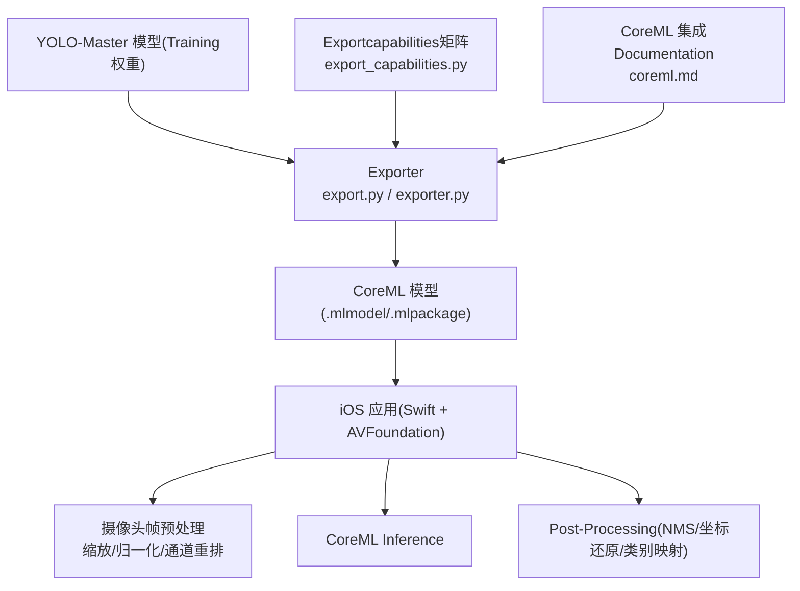
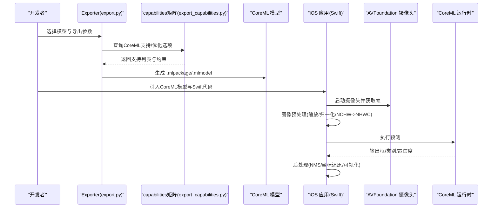
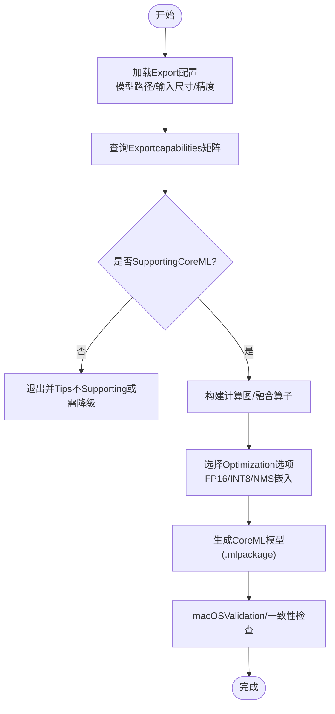
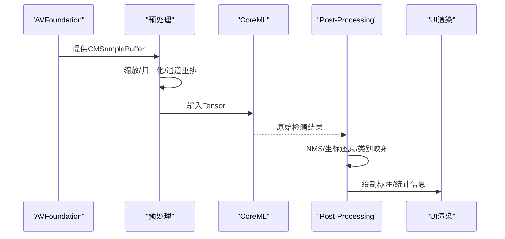
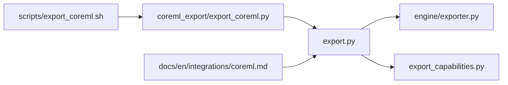

# iOS平台部署

<cite>
**Files Referenced in This Document**
- [README.md](file://README.md)
- [examples/YOLO-Master-Cross-Platform-Edge-Deployment/README.md](file://examples/YOLO-Master-Cross-Platform-Edge-Deployment/README.md)
- [examples/YOLO-Master-Cross-Platform-Edge-Deployment/coreml_export/export_coreml.py](file://examples/YOLO-Master-Cross-Platform-Edge-Deployment/coreml_export/export_coreml.py)
- [examples/YOLO-Master-Cross-Platform-Edge-Deployment/mac/README.md](file://examples/YOLO-Master-Cross-Platform-Edge-Deployment/mac/README.md)
- [examples/YOLO-Master-Cross-Platform-Edge-Deployment/scripts/export_coreml.sh](file://examples/YOLO-Master-Cross-Platform-Edge-Deployment/scripts/export_coreml.sh)
- [ultralytics/utils/export.py](file://ultralytics/utils/export.py)
- [ultralytics/engine/exporter.py](file://ultralytics/engine/exporter.py)
- [ultralytics/utils/export_capabilities.py](file://ultralytics/utils/export_capabilities.py)
- [docs/en/integrations/coreml.md](file://docs/en/integrations/coreml.md)
</cite>

## Table of Contents
1. [Introduction](#Introduction)
2. [Project Structure](#Project Structure)
3. [Core Components](#Core Components)
4. [Architecture Overview](#Architecture Overview)
5. [Detailed Component Analysis](#Detailed Component Analysis)
6. [Dependency Analysis](#Dependency Analysis)
7. [性能考量](#性能考量)
8. [Troubleshooting Guide](#Troubleshooting Guide)
9. [Conclusion](#Conclusion)
10. [Appendix](#Appendix)

## Introduction
本文件targetingwhileiOS平台上部署YOLO-Master的EngineersandResearchers，聚焦于CoreML模型的转换、量化andOptimization，Swift原生集成（Xcode配置、APICalls、内存管理），Centered onand基于AVFoundation的摄像头实时Inference流水线。Documentation同时给出Examples工程结构and构建脚本说明，并覆盖Instruments性能分析and内存泄漏检测、iOS版本兼容性and设备适配策略，Centered onandApp Store发布前的Optimization检查and打包流程。

## Project Structure
仓库中andiOS/Edge部署相关的资源主要集中while跨平台Edge DeploymentExamplesandExportcapabilitiesDocumentation中：
- 跨平台Edge DeploymentExamples：包含CoreMLExport脚本、macOSRefer toimplementingandUses说明
- CoreMLExportcapabilitiesandDocumentation：providesExport参数、兼容性矩阵and最佳实践
- 引擎and工具层：统一的Export入口andcapabilities探测Modules

Figure Source
- [ultralytics/utils/export.py](file://ultralytics/utils/export.py)
- [ultralytics/engine/exporter.py](file://ultralytics/engine/exporter.py)
- [ultralytics/utils/export_capabilities.py](file://ultralytics/utils/export_capabilities.py)
- [docs/en/integrations/coreml.md](file://docs/en/integrations/coreml.md)

Section Source
- [examples/YOLO-Master-Cross-Platform-Edge-Deployment/README.md](file://examples/YOLO-Master-Cross-Platform-Edge-Deployment/README.md)
- [docs/en/integrations/coreml.md](file://docs/en/integrations/coreml.md)

## Core Components
- Export管线
  - 统一Export入口and后端调度：负责将PyTorch/TorchScriptetc.中间表示转换for目标格式（含CoreML）
  - Exportcapabilities探测：根据模型算子andTasks类型判断是否SupportingCoreMLExportand可用Optimization选项
- CoreMLExport脚本andExamples
  - provides一键Export脚本andPythonEncapsulates，便于批量生成不同尺寸/精度的CoreML模型
  - macOSRefer toimplementing用于ValidationExport产物andInference一致性
- iOS集成要点
  - Xcode工程配置、CoreML模型资源引入、Swift APICallsand线程/内存管理
  - 基于AVFoundation的摄像头采集、Image PreprocessingandPost-ProcessingOptimization

Section Source
- [ultralytics/utils/export.py](file://ultralytics/utils/export.py)
- [ultralytics/engine/exporter.py](file://ultralytics/engine/exporter.py)
- [ultralytics/utils/export_capabilities.py](file://ultralytics/utils/export_capabilities.py)
- [examples/YOLO-Master-Cross-Platform-Edge-Deployment/coreml_export/export_coreml.py](file://examples/YOLO-Master-Cross-Platform-Edge-Deployment/coreml_export/export_coreml.py)
- [examples/YOLO-Master-Cross-Platform-Edge-Deployment/scripts/export_coreml.sh](file://examples/YOLO-Master-Cross-Platform-Edge-Deployment/scripts/export_coreml.sh)
- [examples/YOLO-Master-Cross-Platform-Edge-Deployment/mac/README.md](file://examples/YOLO-Master-Cross-Platform-Edge-Deployment/mac/README.md)

## Architecture Overview
下图展示从Training权重toiOS端实时Inference的整体数据流and控制流。

Figure Source
- [ultralytics/utils/export.py](file://ultralytics/utils/export.py)
- [ultralytics/utils/export_capabilities.py](file://ultralytics/utils/export_capabilities.py)
- [examples/YOLO-Master-Cross-Platform-Edge-Deployment/coreml_export/export_coreml.py](file://examples/YOLO-Master-Cross-Platform-Edge-Deployment/coreml_export/export_coreml.py)

## Detailed Component Analysis

### CoreMLExportandOptimization
- Export入口and后端调度
  - Via统一Export接口指定目标格式forCoreML，内部会Calls相应后端进行图转换andOptimization
  - 可配置输入形状、精度、NMS/Post-Processing嵌入etc.选项（Centered onExportcapabilities矩阵for准）
- Exportcapabilities探测
  - 依据模型结构、算子集andTasks类型判定是否SupportingCoreMLExport
  - 返回Supporting的Optimization开关（such asFP16、INT8量化、NMS嵌入etc.）
- Examples脚本and批处理
  - PythonEncapsulatesandShell脚本provides便捷的一键Export流程，Supporting多尺寸/多精度批量生成
  - macOSRefer toimplementing可用于快速ValidationExport结果andInference一致性

Figure Source
- [ultralytics/utils/export.py](file://ultralytics/utils/export.py)
- [ultralytics/utils/export_capabilities.py](file://ultralytics/utils/export_capabilities.py)
- [examples/YOLO-Master-Cross-Platform-Edge-Deployment/coreml_export/export_coreml.py](file://examples/YOLO-Master-Cross-Platform-Edge-Deployment/coreml_export/export_coreml.py)
- [examples/YOLO-Master-Cross-Platform-Edge-Deployment/scripts/export_coreml.sh](file://examples/YOLO-Master-Cross-Platform-Edge-Deployment/scripts/export_coreml.sh)

Section Source
- [ultralytics/utils/export.py](file://ultralytics/utils/export.py)
- [ultralytics/engine/exporter.py](file://ultralytics/engine/exporter.py)
- [ultralytics/utils/export_capabilities.py](file://ultralytics/utils/export_capabilities.py)
- [examples/YOLO-Master-Cross-Platform-Edge-Deployment/coreml_export/export_coreml.py](file://examples/YOLO-Master-Cross-Platform-Edge-Deployment/coreml_export/export_coreml.py)
- [examples/YOLO-Master-Cross-Platform-Edge-Deployment/scripts/export_coreml.sh](file://examples/YOLO-Master-Cross-Platform-Edge-Deployment/scripts/export_coreml.sh)
- [docs/en/integrations/coreml.md](file://docs/en/integrations/coreml.md)

### Swift原生集成andXcode配置
- 工程配置
  - 将CoreML模型作for资源添加toXcode工程中，确保Build Phases正确引用
  - whileInfo.plist中声明相机权限（such as需）
- CoreML APICalls
  - UsesVision+CoreML或纯CoreML API进行Inference；注意输入张量维度and数据类型匹配
  - 建议将模型加载and预热放while后台队列，避免阻塞主线程
- 内存管理
  - 复用模型实例，避免重复加载；and时释放不再Uses的缓冲区
  - 控制并发Inference数量，防止峰值内存过高导致系统回收

Section Source
- [examples/YOLO-Master-Cross-Platform-Edge-Deployment/mac/README.md](file://examples/YOLO-Master-Cross-Platform-Edge-Deployment/mac/README.md)

### 摄像头实时Inference流水线（AVFoundation）
- 数据采集
  - UsesAVCaptureSession采集视频帧，回调中获取CMSampleBuffer
- Image Preprocessing
  - 将像素转for模型所需格式（尺寸缩放、归一化、通道顺序调整）
  - 尽量UsesMetal/GPU加速Centered on减少CPU拷贝and转换开销
- InferenceandPost-Processing
  - CallsCoreML模型得to原始检测结果
  - 执行NMS、坐标还原、类别映射andVisualization绘制
- 渲染andUI
  - while主线程更新UI，但保持InferenceandI/Owhile后台队列执行

[本节for概念性流程图，不直接映射具体源码文件]

## Dependency Analysis
- Export层依赖
  - export.py 作forUnified entry point，Callsengine/exporter.py进行后端调度
  - export_capabilities.py providescapabilities探测and约束校验
- Examples层依赖
  - coreml_export/export_coreml.py EncapsulatesExport流程
  - scripts/export_coreml.sh provides命令行批处理
  - mac/README.md providesmacOS侧ValidationandRefer toimplementing指引
- Documentation层依赖
  - docs/en/integrations/coreml.md providesCoreML集成注意事项and最佳实践

Figure Source
- [ultralytics/utils/export.py](file://ultralytics/utils/export.py)
- [ultralytics/engine/exporter.py](file://ultralytics/engine/exporter.py)
- [ultralytics/utils/export_capabilities.py](file://ultralytics/utils/export_capabilities.py)
- [examples/YOLO-Master-Cross-Platform-Edge-Deployment/coreml_export/export_coreml.py](file://examples/YOLO-Master-Cross-Platform-Edge-Deployment/coreml_export/export_coreml.py)
- [examples/YOLO-Master-Cross-Platform-Edge-Deployment/scripts/export_coreml.sh](file://examples/YOLO-Master-Cross-Platform-Edge-Deployment/scripts/export_coreml.sh)
- [docs/en/integrations/coreml.md](file://docs/en/integrations/coreml.md)

Section Source
- [ultralytics/utils/export.py](file://ultralytics/utils/export.py)
- [ultralytics/engine/exporter.py](file://ultralytics/engine/exporter.py)
- [ultralytics/utils/export_capabilities.py](file://ultralytics/utils/export_capabilities.py)
- [examples/YOLO-Master-Cross-Platform-Edge-Deployment/coreml_export/export_coreml.py](file://examples/YOLO-Master-Cross-Platform-Edge-Deployment/coreml_export/export_coreml.py)
- [examples/YOLO-Master-Cross-Platform-Edge-Deployment/scripts/export_coreml.sh](file://examples/YOLO-Master-Cross-Platform-Edge-Deployment/scripts/export_coreml.sh)
- [docs/en/integrations/coreml.md](file://docs/en/integrations/coreml.md)

## 性能考量
- 模型层面
  - 优先启用FP16；while精度可接受时尝试INT8量化，Combining校准集提升稳定性
  - 若Tasks允许，将NMS/Post-Processing嵌入模型Centered on降低运行时开销
- 输入and预处理
  - Set appropriately输入分辨率，平衡精度and延迟；避免不必要的多次缩放
  - UsesGPU/Metal加速预处理，减少CPU-GPU拷贝
- 运行时and线程
  - 预加载并缓存模型实例；限制并发Inference数，避免内存抖动
  - 将耗时操作放入后台队列，主线程仅做UI更新
- 监控and调优
  - UsesInstruments的Time Profiler定位热点；Memory Graph检查潜while泄漏
  - 关注峰值内存and热机时间，必要时拆分大帧或降低分辨率

[This section provides general guidance and does not directly analyze specific files]

## Troubleshooting Guide
- Export Failure
  - 检查Exportcapabilities矩阵是否Supporting当前Models and Tasks；确认输入形状and数据类型
  - 查看ExportLogging中的算子不SupportingTips，考虑替换或禁用相关Optimization
- Inference异常
  - 核对预处理维度and归一化参数是否andExport一致
  - 检查CoreML模型版本andiOS系统版本兼容性
- 性能问题
  - UsesInstruments分析CPU/GPU占用and内存曲线，定位bottlenecks
  - Evaluation是否可Via减小输入尺寸、关闭非必要Post-Processing或切换精度模式改善

Section Source
- [docs/en/integrations/coreml.md](file://docs/en/integrations/coreml.md)
- [examples/YOLO-Master-Cross-Platform-Edge-Deployment/mac/README.md](file://examples/YOLO-Master-Cross-Platform-Edge-Deployment/mac/README.md)

## Conclusion
Via将YOLO-MasterExporting toCoreML并whileiOS端进行高效集成，可implementing低延迟、低功耗的实时检测。关键while于：准确的ExportcapabilitiesEvaluationandOptimization选项选择、严格的预处理/Post-Processing一致性、合理的线程and内存管理，Centered onand完善的性能监控and回归测试。遵循本Documentationworkflowand清单，可while保证精度的前提下获得稳定的移动端体验。

## Appendix

### iOSExamplesProject Structureand构建脚本
- Examples位置
  - 跨平台Edge DeploymentExamples位于 examples/YOLO-Master-Cross-Platform-Edge-Deployment
  - CoreMLExport脚本位于 coreml_export and scripts Table of Contents
- 构建andExport
  - Uses脚本一键ExportCoreML模型，Supporting多尺寸/多精度批量生成
  - macOSRefer toimplementing用于快速ValidationExport产物andInference一致性
- 工程组织建议
  - 将CoreML模型作for资源加入Xcode工程
  - 将预处理/Post-Processing逻辑Modules化，便于while不同Tasks间复用

Section Source
- [examples/YOLO-Master-Cross-Platform-Edge-Deployment/README.md](file://examples/YOLO-Master-Cross-Platform-Edge-Deployment/README.md)
- [examples/YOLO-Master-Cross-Platform-Edge-Deployment/coreml_export/export_coreml.py](file://examples/YOLO-Master-Cross-Platform-Edge-Deployment/coreml_export/export_coreml.py)
- [examples/YOLO-Master-Cross-Platform-Edge-Deployment/scripts/export_coreml.sh](file://examples/YOLO-Master-Cross-Platform-Edge-Deployment/scripts/export_coreml.sh)
- [examples/YOLO-Master-Cross-Platform-Edge-Deployment/mac/README.md](file://examples/YOLO-Master-Cross-Platform-Edge-Deployment/mac/README.md)

### iOS版本兼容性and设备适配策略
- 最低系统版本
  - 建议Centered on较新的iOS版本for目标，充分利用CoreML最新Optimization特性
- 设备差异
  - 针对不同芯片（A系列/神经网络引擎capabilities）动态选择模型精度and输入尺寸
  - 对低端机型采用更低分辨率或更轻量模型变体
- 运行时回退
  - 当检测to不Supporting的Optimization或算子时，自动降级至兼容模式

Section Source
- [docs/en/integrations/coreml.md](file://docs/en/integrations/coreml.md)

### App Store发布前Optimization检查and打包流程
- Optimization检查清单
  - 模型体积and量化策略复核
  - 预处理/Post-Processing性能基准回归
  - 内存峰值and泄漏扫描
  - 多设备/多系统版本兼容性Validation
- 打包流程
  - 清理构建产物，确保仅包含必要资源
  - UsesRelease配置and符号表剥离
  - 提交前进行真机端to端测试and压力测试

[本节for通用流程指导，不直接分析具体文件]