# Model Export and Deployment

<cite>
**Files Referenced in This Document**
- [engine/exporter.py](file://ultralytics/engine/exporter.py)
- [utils/export/__init__.py](file://ultralytics/utils/export/__init__.py)
- [utils/export/onnx.py](file://ultralytics/utils/export/onnx.py)
- [utils/export/tensorrt.py](file://ultralytics/utils/export/tensorrt.py)
- [utils/export/openvino.py](file://ultralytics/utils/export/openvino.py)
- [utils/export/tflite.py](file://ultralytics/utils/export/tflite.py)
- [utils/export/coreml.py](file://ultralytics/utils/export/coreml.py)
- [utils/export_capabilities.py](file://ultralytics/utils/export_capabilities.py)
- [utils/export_preflight.py](file://ultralytics/utils/export_preflight.py)
- [utils/export_validation.py](file://ultralytics/utils/export_validation.py)
- [nn/autobackend.py](file://ultralytics/nn/autobackend.py)
- [examples/YOLO-Master-Cross-Platform-Edge-Deployment/TECHNICAL_REPORT.md](file://examples/YOLO-Master-Cross-Platform-Edge-Deployment/TECHNICAL_REPORT.md)
- [examples/YOLO-Master-Cross-Platform-Edge-Deployment/cpp/main.cpp](file://examples/YOLO-Master-Cross-Platform-Edge-Deployment/cpp/main.cpp)
- [examples/YOLO-Master-Cross-Platform-Edge-Deployment/cpp/inference.h](file://examples/YOLO-Master-Cross-Platform-Edge-Deployment/cpp/inference.h)
- [examples/YOLO-Master-Cross-Platform-Edge-Deployment/cpp/CMakeLists.txt](file://examples/YOLO-Master-Cross-Platform-Edge-Deployment/cpp/CMakeLists.txt)
- [examples/YOLO-Master-Cross-Platform-Edge-Deployment/mac/main.mm](file://examples/YOLO-Master-Cross-Platform-Edge-Deployment/mac/main.mm)
- [examples/YOLO-Master-Cross-Platform-Edge-Deployment/jetson/build.sh](file://examples/YOLO-Master-Cross-Platform-Edge-Deployment/jetson/build.sh)
- [examples/YOLO-Master-Edge-Deployment/export_edge_models.py](file://examples/YOLO-Master-Edge-Deployment/export_edge_models.py)
- [examples/YOLO-Master-Edge-Deployment/edge_utils.py](file://examples/YOLO-Master-Edge-Deployment/edge_utils.py)
- [examples/YOLO-Master-Edge-Deployment/validate_edge_outputs.py](file://examples/YOLO-Master-Edge-Deployment/validate_edge_outputs.py)
- [examples/YOLOv8-ONNXRuntime-CPP/main.cpp](file://examples/YOLOv8-ONNXRuntime-CPP/main.cpp)
- [examples/YOLOv8-OpenVINO-CPP-Inference/main.cc](file://examples/YOLOv8-OpenVINO-CPP-Inference/main.cc)
- [examples/YOLO11-Triton-CPP/main.cpp](file://examples/YOLO11-Triton-CPP/main.cpp)
- [docker/Dockerfile](file://docker/Dockerfile)
- [benchmarks/run.py](file://benchmarks/run.py)
- [benchmarks/suite.py](file://benchmarks/suite.py)
- [tests/test_export_roundtrip.py](file://tests/test_export_roundtrip.py)
- [tests/test_exports.py](file://tests/test_exports.py)
- [tests/test_autobackend_warmup.py](file://tests/test_autobackend_warmup.py)
- [tests/test_export_capability_matrix.py](file://tests/test_export_capability_matrix.py)
- [tests/test_export_preflight.py](file://tests/test_export_preflight.py)
- [docs/en/guides/model-deployment-options.md](file://docs/en/guides/model-deployment-options.md)
- [docs/en/guides/model-deployment-practices.md](file://docs/en/guides/model-deployment-practices.md)
- [docs/en/guides/triton-inference-server.md](file://docs/en/guides/triton-inference-server.md)
- [docs/en/guides/nvidia-jetson.md](file://docs/en/guides/nvidia-jetson.md)
- [docs/en/guides/raspberry-pi.md](file://docs/en/guides/raspberry-pi.md)
- [docs/en/integrations/onnx.md](file://docs/en/integrations/onnx.md)
- [docs/en/integrations/tensorrt.md](file://docs/en/integrations/tensorrt.md)
- [docs/en/integrations/openvino.md](file://docs/en/integrations/openvino.md)
- [docs/en/integrations/tflite.md](file://docs/en/integrations/tflite.md)
- [docs/en/integrations/coreml.md](file://docs/en/integrations/coreml.md)
</cite>

## Table of Contents
1. [Introduction](#Introduction)
2. [Project Structure](#Project Structure)
3. [Core Components](#Core Components)
4. [Architecture Overview](#Architecture Overview)
5. [Detailed Component Analysis](#Detailed Component Analysis)
6. [Dependency Analysis](#Dependency Analysis)
7. [性能考量](#性能考量)
8. [故障排除指南](#故障排除指南)
9. [Conclusion](#Conclusion)
10. [Appendix](#Appendix)

## Introduction
本技术Documentation围绕 YOLO-Master 的“Model Export and Deployment”capabilities，系统化梳理Supporting的Export格式（ONNX、TensorRT、OpenVINO、TFLite、CoreML etc.）、转换流程andOptimization选项；覆盖边缘设备 C++ Inference引擎构建and集成、移动端（iOS/Android）适配策略、云服务容器化and微服务最佳实践；并给出量化压缩（INT8、稀疏化）、编译Optimization（算子融合、内存Optimization）、多硬件后端（GPU/NPU/FPGA）部署指南，Centered onand部署后监控维护、性能基准and回归测试方法、故障排查and调试工具Uses建议。

## Project Structure
andExport和部署相关的代码主要分布whileCentered on下位置：
- Export核心and预检/校验：ultralytics/engine/exporter.py、ultralytics/utils/export_*、ultralytics/utils/export_capabilities.py
- 各后端Exportimplementing：ultralytics/utils/export/{onnx,tensorrt,openvino,tflite,coreml}.py
- 自动后端加载：ultralytics/nn/autobackend.py
- 跨平台边缘Examples：examples/YOLO-Master-Cross-Platform-Edge-Deployment、examples/YOLO-Master-Edge-Deployment
- 云服务andInference服务器Examples：examples/YOLO11-Triton-CPP、docs 中 Triton 指南
- 基准and回归测试：benchmarks/*、tests/test_export*、tests/test_autobackend_warmup.py
- Documentationand集成说明：docs/en/guides/*、docs/en/integrations/*

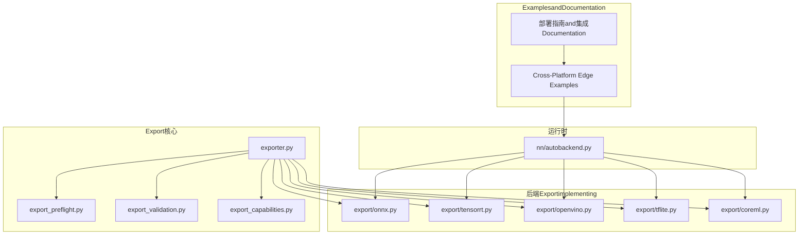

Figure Source
- [engine/exporter.py](file://ultralytics/engine/exporter.py)
- [utils/export/onnx.py](file://ultralytics/utils/export/onnx.py)
- [utils/export/tensorrt.py](file://ultralytics/utils/export/tensorrt.py)
- [utils/export/openvino.py](file://ultralytics/utils/export/openvino.py)
- [utils/export/tflite.py](file://ultralytics/utils/export/tflite.py)
- [utils/export/coreml.py](file://ultralytics/utils/export/coreml.py)
- [utils/export_preflight.py](file://ultralytics/utils/export_preflight.py)
- [utils/export_validation.py](file://ultralytics/utils/export_validation.py)
- [utils/export_capabilities.py](file://ultralytics/utils/export_capabilities.py)
- [nn/autobackend.py](file://ultralytics/nn/autobackend.py)
- [examples/YOLO-Master-Cross-Platform-Edge-Deployment/TECHNICAL_REPORT.md](file://examples/YOLO-Master-Cross-Platform-Edge-Deployment/TECHNICAL_REPORT.md)
- [docs/en/guides/model-deployment-options.md](file://docs/en/guides/model-deployment-options.md)

Section Source
- [engine/exporter.py](file://ultralytics/engine/exporter.py)
- [utils/export/onnx.py](file://ultralytics/utils/export/onnx.py)
- [utils/export/tensorrt.py](file://ultralytics/utils/export/tensorrt.py)
- [utils/export/openvino.py](file://ultralytics/utils/export/openvino.py)
- [utils/export/tflite.py](file://ultralytics/utils/export/tflite.py)
- [utils/export/coreml.py](file://ultralytics/utils/export/coreml.py)
- [utils/export_capabilities.py](file://ultralytics/utils/export_capabilities.py)
- [utils/export_preflight.py](file://ultralytics/utils/export_preflight.py)
- [utils/export_validation.py](file://ultralytics/utils/export_validation.py)
- [nn/autobackend.py](file://ultralytics/nn/autobackend.py)
- [examples/YOLO-Master-Cross-Platform-Edge-Deployment/TECHNICAL_REPORT.md](file://examples/YOLO-Master-Cross-Platform-Edge-Deployment/TECHNICAL_REPORT.md)
- [docs/en/guides/model-deployment-options.md](file://docs/en/guides/model-deployment-options.md)

## Core Components
- Export编排器：负责Unified entry point、参数解析、预检、Calls具体后端Exporter、输出产物and元数据管理。
- 预检查Modules：whileExport前Validation环境、依赖、模型图兼容性、目标平台capabilities矩阵。
- Exportcapabilities矩阵：集中描述各后端对Tasks类型、输入形状、精度、动态轴etc.的Supporting情况。
- Export校验：Export后一致性/数值稳定性/形状契约校验，保障端to端可复现。
- 自动后端：根据模型后缀或配置自动选择对应Inference后端（ONNXRuntime、TensorRT、OpenVINO、TFLite、CoreML）。

Section Source
- [engine/exporter.py](file://ultralytics/engine/exporter.py)
- [utils/export_capabilities.py](file://ultralytics/utils/export_capabilities.py)
- [utils/export_preflight.py](file://ultralytics/utils/export_preflight.py)
- [utils/export_validation.py](file://ultralytics/utils/export_validation.py)
- [nn/autobackend.py](file://ultralytics/nn/autobackend.py)

## Architecture Overview
下图展示从Training权重to多后端部署产物的完整链路，包括预检、Export、校验、自动加载and运行。

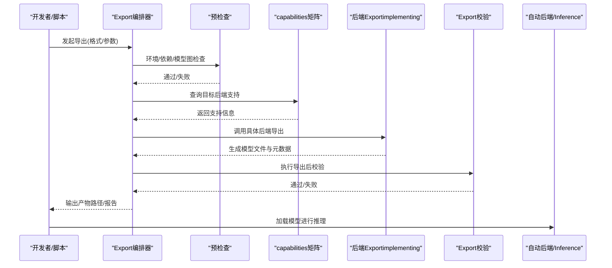

Figure Source
- [engine/exporter.py](file://ultralytics/engine/exporter.py)
- [utils/export_preflight.py](file://ultralytics/utils/export_preflight.py)
- [utils/export_capabilities.py](file://ultralytics/utils/export_capabilities.py)
- [utils/export/onnx.py](file://ultralytics/utils/export/onnx.py)
- [utils/export/tensorrt.py](file://ultralytics/utils/export/tensorrt.py)
- [utils/export/openvino.py](file://ultralytics/utils/export/openvino.py)
- [utils/export/tflite.py](file://ultralytics/utils/export/tflite.py)
- [utils/export/coreml.py](file://ultralytics/utils/export/coreml.py)
- [utils/export_validation.py](file://ultralytics/utils/export_validation.py)
- [nn/autobackend.py](file://ultralytics/nn/autobackend.py)

## Detailed Component Analysis

### Export编排器and预检查/校验
- 职责
  - 统一Export入口，解析Export参数（such as输入尺寸、动态轴、精度、Optimization开关）。
  - Calls预检查ModulesValidation环境and依赖，Combiningcapabilities矩阵判断是否可Export。
  - 分发至具体后端Exporter，收集产物andLogging。
  - 触发Export后校验（形状、数值、契约），输出报告。
- 关键流程
  - 预检查失败直接中止，避免无效Export。
  - capabilities矩阵用于快速Tips不Supporting的组合（such as某Tasks+某后端+动态输入）。
  - 校验阶段对比 PyTorch Refer to输出and后端输出，确保etc.价性。

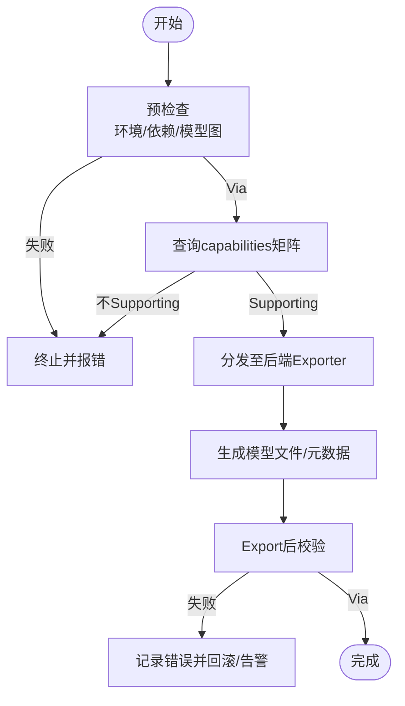

Figure Source
- [engine/exporter.py](file://ultralytics/engine/exporter.py)
- [utils/export_preflight.py](file://ultralytics/utils/export_preflight.py)
- [utils/export_capabilities.py](file://ultralytics/utils/export_capabilities.py)
- [utils/export_validation.py](file://ultralytics/utils/export_validation.py)

Section Source
- [engine/exporter.py](file://ultralytics/engine/exporter.py)
- [utils/export_preflight.py](file://ultralytics/utils/export_preflight.py)
- [utils/export_capabilities.py](file://ultralytics/utils/export_capabilities.py)
- [utils/export_validation.py](file://ultralytics/utils/export_validation.py)

### ONNX Export
- 流程要点
  - 将 PyTorch Model Exportfor ONNX，Supporting动态轴and静态形状配置。
  - OptionalOptimization：算子融合、常量折叠、简化图（取决于后端and版本）。
  - Export后可由 ONNXRuntime 直接Inference，或Via其他后端二次转换。
- Typical Usage
  - 指定输入形状、动态维度、opset 版本、Optimization级别。
  - Export后Uses自动后端加载 ONNX 模型进行Inference。

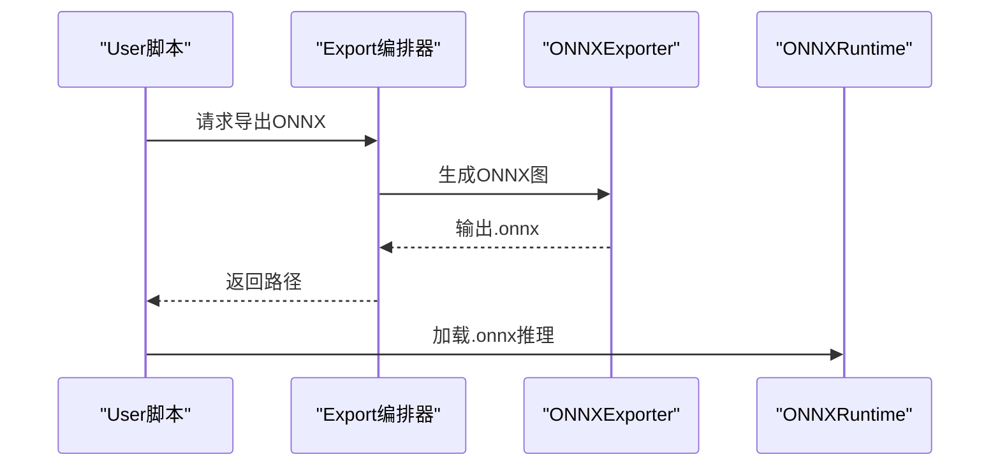

Figure Source
- [utils/export/onnx.py](file://ultralytics/utils/export/onnx.py)
- [nn/autobackend.py](file://ultralytics/nn/autobackend.py)

Section Source
- [utils/export/onnx.py](file://ultralytics/utils/export/onnx.py)
- [nn/autobackend.py](file://ultralytics/nn/autobackend.py)

### TensorRT Export
- 流程要点
  - 基于 ONNX 或原生接口构建 TensorRT 引擎，Supporting FP16/INT8 量化and校准数据集。
  - 针对 GPU 架构Optimization内核and内存布局，显著提升吞吐and延迟。
  - 需安装对应版本的 TensorRT and CUDA 工具链。
- Optimization选项
  - 精度模式（FP32/FP16/INT8）、最大批大小、工作空间、显存限制、校准集。
- Typical Usage
  - provides校准数据and精度设置，生成 .engine 文件，自动后端可直接加载。

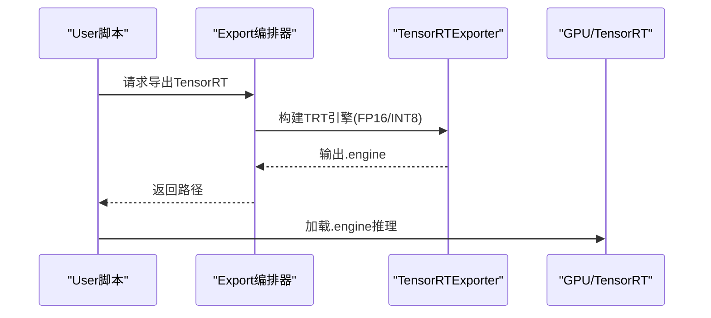

Figure Source
- [utils/export/tensorrt.py](file://ultralytics/utils/export/tensorrt.py)
- [nn/autobackend.py](file://ultralytics/nn/autobackend.py)

Section Source
- [utils/export/tensorrt.py](file://ultralytics/utils/export/tensorrt.py)
- [nn/autobackend.py](file://ultralytics/nn/autobackend.py)

### OpenVINO Export
- 流程要点
  - 将模型转换for IR（.xml/.bin）或直接Export OpenVINO 中间表示，Supporting CPU/GPU/iGPU/VPU etc.后端。
  - 可进行图Optimization、算子替换、量化（INT8）andModel Compression。
- Optimization选项
  - 精度（FP32/FP16/INT8）、IR Optimization级别、目标设备、缓存and预热。
- Typical Usage
  - Export IR 后，Uses OpenVINO Runtime 加载Inference；也可Via自动后端透明加载。

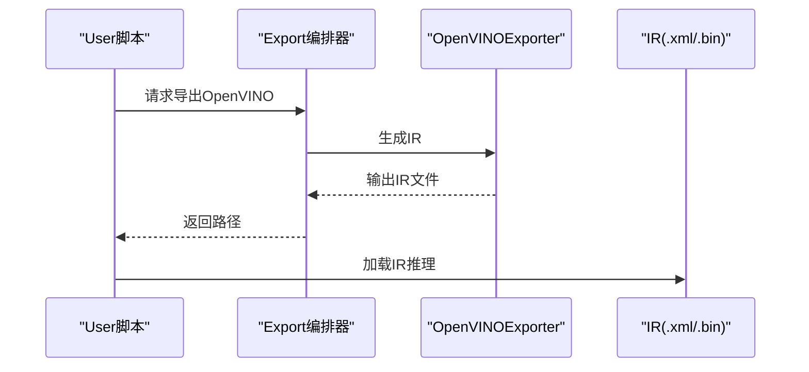

Figure Source
- [utils/export/openvino.py](file://ultralytics/utils/export/openvino.py)
- [nn/autobackend.py](file://ultralytics/nn/autobackend.py)

Section Source
- [utils/export/openvino.py](file://ultralytics/utils/export/openvino.py)
- [nn/autobackend.py](file://ultralytics/nn/autobackend.py)

### TFLite Export
- 流程要点
  - 将Model Exportfor .tflite，适用于 Android/iOS and嵌入式设备。
  - Supporting INT8 量化（含校准）、选择性算子降级and兼容处理。
- Optimization选项
  - 量化（FP16/INT8）、算子白名单/黑名单、输入形状约束。
- Typical Usage
  - Export后while移动端Uses TFLite Runtime 加载Inference。

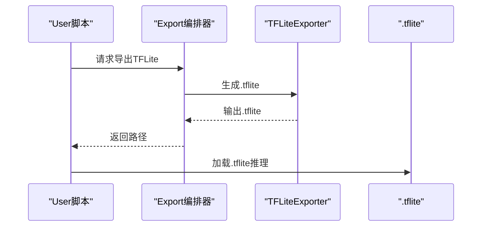

Figure Source
- [utils/export/tflite.py](file://ultralytics/utils/export/tflite.py)
- [nn/autobackend.py](file://ultralytics/nn/autobackend.py)

Section Source
- [utils/export/tflite.py](file://ultralytics/utils/export/tflite.py)
- [nn/autobackend.py](file://ultralytics/nn/autobackend.py)

### CoreML Export
- 流程要点
  - 将Model Exportfor .mlmodel，适配 iOS/macOS 生态，利用 Metal Performance Shaders 加速。
  - Supporting精度and计算图Optimization，便于while设备上高效Inference。
- Optimization选项
  - 精度（FP32/FP16）、Metal 后端启用、输入形状约束。
- Typical Usage
  - while Xcode 工程中加载 .mlmodel 进行Inference。

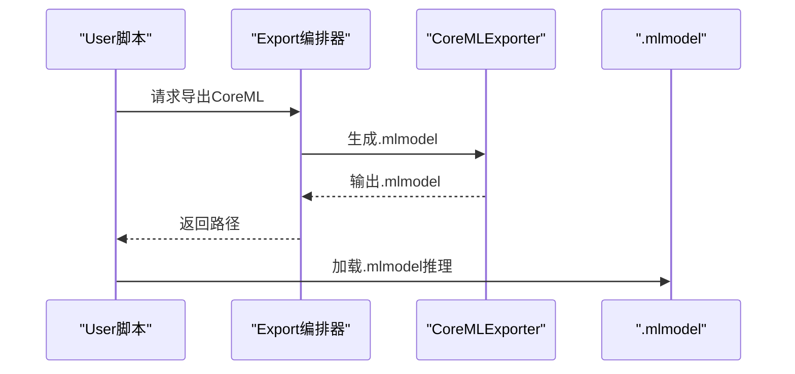

Figure Source
- [utils/export/coreml.py](file://ultralytics/utils/export/coreml.py)
- [nn/autobackend.py](file://ultralytics/nn/autobackend.py)

Section Source
- [utils/export/coreml.py](file://ultralytics/utils/export/coreml.py)
- [nn/autobackend.py](file://ultralytics/nn/autobackend.py)

### 自动后端and运行时集成
- 功能
  - 根据模型后缀或配置自动选择Inference后端（ONNXRuntime、TensorRT、OpenVINO、TFLite、CoreML）。
  - 统一Inference接口，屏蔽后端差异，简化部署集成。
- Applicable Scenarios
  - 同一套业务代码while不同平台切换后端，无需修改上层逻辑。

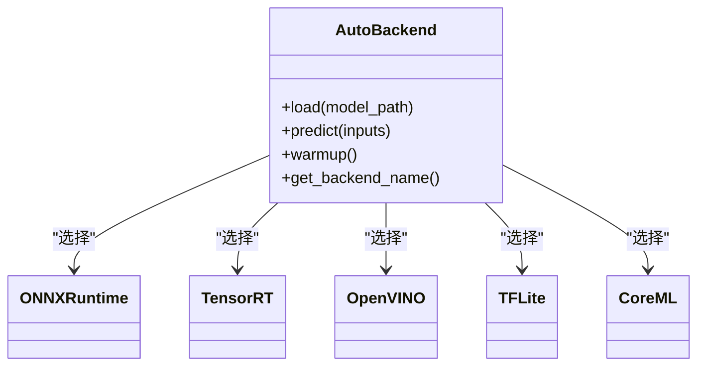

Figure Source
- [nn/autobackend.py](file://ultralytics/nn/autobackend.py)

Section Source
- [nn/autobackend.py](file://ultralytics/nn/autobackend.py)

### 边缘设备 C++ Inference引擎构建and集成
- Examples工程
  - Cross-Platform Edge Examplesprovides C++ Inference入口、CMake 构建脚本and平台适配（macOS/Jetson）。
  - 包含InferenceEncapsulates头文件and主程序，演示such as何加载Export模型并进行Prediction。
- 构建步骤（概述）
  - 准备依赖（CMake、编译器、目标后端 SDK）。
  - 配置 CMakeLists.txt，链接Inference库and模型文件。
  - 编译生成可执行程序，部署至目标设备运行。
- 集成要点
  - 输入预处理andPost-Processing对齐Export配置。
  - 线程安全and内存池管理，提升吞吐。
  - 平台特定Optimization（such as Jetson 的 TensorRT、macOS 的 CoreML）。

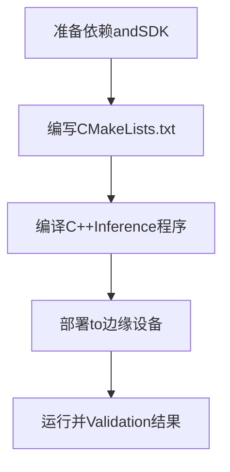

Figure Source
- [examples/YOLO-Master-Cross-Platform-Edge-Deployment/cpp/main.cpp](file://examples/YOLO-Master-Cross-Platform-Edge-Deployment/cpp/main.cpp)
- [examples/YOLO-Master-Cross-Platform-Edge-Deployment/cpp/inference.h](file://examples/YOLO-Master-Cross-Platform-Edge-Deployment/cpp/inference.h)
- [examples/YOLO-Master-Cross-Platform-Edge-Deployment/cpp/CMakeLists.txt](file://examples/YOLO-Master-Cross-Platform-Edge-Deployment/cpp/CMakeLists.txt)
- [examples/YOLO-Master-Cross-Platform-Edge-Deployment/jetson/build.sh](file://examples/YOLO-Master-Cross-Platform-Edge-Deployment/jetson/build.sh)
- [examples/YOLO-Master-Cross-Platform-Edge-Deployment/mac/main.mm](file://examples/YOLO-Master-Cross-Platform-Edge-Deployment/mac/main.mm)
- [examples/YOLO-Master-Cross-Platform-Edge-Deployment/TECHNICAL_REPORT.md](file://examples/YOLO-Master-Cross-Platform-Edge-Deployment/TECHNICAL_REPORT.md)

Section Source
- [examples/YOLO-Master-Cross-Platform-Edge-Deployment/cpp/main.cpp](file://examples/YOLO-Master-Cross-Platform-Edge-Deployment/cpp/main.cpp)
- [examples/YOLO-Master-Cross-Platform-Edge-Deployment/cpp/inference.h](file://examples/YOLO-Master-Cross-Platform-Edge-Deployment/cpp/inference.h)
- [examples/YOLO-Master-Cross-Platform-Edge-Deployment/cpp/CMakeLists.txt](file://examples/YOLO-Master-Cross-Platform-Edge-Deployment/cpp/CMakeLists.txt)
- [examples/YOLO-Master-Cross-Platform-Edge-Deployment/jetson/build.sh](file://examples/YOLO-Master-Cross-Platform-Edge-Deployment/jetson/build.sh)
- [examples/YOLO-Master-Cross-Platform-Edge-Deployment/mac/main.mm](file://examples/YOLO-Master-Cross-Platform-Edge-Deployment/mac/main.mm)
- [examples/YOLO-Master-Cross-Platform-Edge-Deployment/TECHNICAL_REPORT.md](file://examples/YOLO-Master-Cross-Platform-Edge-Deployment/TECHNICAL_REPORT.md)

### Mobile Deployment策略（iOS/Android）
- iOS
  - Uses CoreML Export .mlmodel，while Xcode 工程中集成，利用 Metal 加速。
  - 注意输入形状and预处理一致，Set appropriately精度Centered on平衡精度and速度。
- Android
  - Uses TFLite Export .tflite，Combined with NNAPI 或 GPU Delegate 加速。
  - 推荐 INT8 量化Centered on降低体积and功耗，同时Evaluation精度损失。
- 通用建议
  - 固定输入尺寸Centered on提升性能and减少内存碎片。
  - 离线打包模型资产，避免运行时下载。
  - Uses自动后端或平台专用运行时Unified Interface。

Section Source
- [utils/export/coreml.py](file://ultralytics/utils/export/coreml.py)
- [utils/export/tflite.py](file://ultralytics/utils/export/tflite.py)
- [docs/en/integrations/coreml.md](file://docs/en/integrations/coreml.md)
- [docs/en/integrations/tflite.md](file://docs/en/integrations/tflite.md)

### Cloud Service Deployment最佳实践（容器化/微服务/Load Balancing）
- 容器化
  - Uses Docker 镜像EncapsulatesInference环境，固化依赖anddrivers are installed版本。
  - 将模型文件作for只读卷挂载，Supporting热更新and灰度发布。
- 微服务
  - 将Inference服务拆分for独立微服务，按Tasks或模型版本划分。
  - Uses消息队列或 API 网关进行请求路由and限流。
- Load Balancing
  - while多实例间分配请求，Combining健康检查and自动扩缩容。
  - 针对高吞吐场景，优先选择 TensorRT/OpenVINO 后端。

Section Source
- [docker/Dockerfile](file://docker/Dockerfile)
- [docs/en/guides/triton-inference-server.md](file://docs/en/guides/triton-inference-server.md)
- [docs/en/guides/model-deployment-options.md](file://docs/en/guides/model-deployment-options.md)

### Quantization and Compression（INT8/稀疏化）
- INT8 量化
  - TensorRT/OpenVINO/TFLite 均Supporting INT8 量化，需provides校准数据集。
  - 量化前后进行Export校验，确保精度达标。
- 稀疏化
  - CombiningTraining期稀疏正则或后Training稀疏化，降低计算量and存储。
  - 需要后端Supporting稀疏算子Centered on获得实际加速收益。
- 实践建议
  - 先 FP16 再 INT8，逐步Evaluation精度and性能。
  - 针对不同Tasksand输入尺寸分别调优。

Section Source
- [utils/export/tensorrt.py](file://ultralytics/utils/export/tensorrt.py)
- [utils/export/openvino.py](file://ultralytics/utils/export/openvino.py)
- [utils/export/tflite.py](file://ultralytics/utils/export/tflite.py)
- [utils/export_validation.py](file://ultralytics/utils/export_validation.py)

### 模型编译andOptimization（算子融合/内存Optimization）
- 算子融合
  - Export阶段尽可能融合相邻算子，减少图节点and内存访问。
  - 不同后端融合策略不同，需Combiningcapabilities矩阵and后端Documentation。
- 内存Optimization
  - 固定输入形状、复用缓冲区、避免频繁分配。
  - UsesBatch Inferenceand流水线并行提升吞吐。
- 预热and缓存
  - 首次Inference预热内核and缓存，稳定延迟。
  - 服务端场景开启模型and引擎缓存。

Section Source
- [utils/export/onnx.py](file://ultralytics/utils/export/onnx.py)
- [utils/export/tensorrt.py](file://ultralytics/utils/export/tensorrt.py)
- [utils/export/openvino.py](file://ultralytics/utils/export/openvino.py)
- [utils/export_validation.py](file://ultralytics/utils/export_validation.py)

### 多硬件平台部署指南（GPU/NPU/FPGA）
- GPU（NVIDIA）
  - Uses TensorRT 构建引擎，选择合适精度and工作空间。
  - 关注显存占用and并发批大小。
- NPU（Intel/OpenVINO）
  - Export IR 并while iGPU/VPU 上运行，启用 INT8 and图Optimization。
- FPGA
  - Combining厂商工具链and OpenVINO 适配，Evaluation延迟and吞吐。
- 通用建议
  - Usescapabilities矩阵确认目标平台Supporting。
  - ViaBenchmark Suite对比不同后端and配置。

Section Source
- [utils/export/tensorrt.py](file://ultralytics/utils/export/tensorrt.py)
- [utils/export/openvino.py](file://ultralytics/utils/export/openvino.py)
- [utils/export_capabilities.py](file://ultralytics/utils/export_capabilities.py)
- [docs/en/guides/nvidia-jetson.md](file://docs/en/guides/nvidia-jetson.md)

### 部署后监控and维护
- Metrics采集
  - 延迟、吞吐、错误率、资源利用率（CPU/GPU/内存）。
- Loggingand追踪
  - 结构化Logging、请求 ID 追踪、异常堆栈上报。
- 模型版本管理
  - 模型Registry、灰度发布、回滚策略。
- 自动化运维
  - 健康检查、自动扩缩容、告警阈值。

Section Source
- [docs/en/guides/model-deployment-practices.md](file://docs/en/guides/model-deployment-practices.md)
- [docs/en/guides/model-monitoring-and-maintenance.md](file://docs/en/guides/model-monitoring-and-maintenance.md)

### 性能基准测试and回归测试
- 基准测试
  - Uses benchmarks 套件对不同后端and配置进行延迟/吞吐测量。
  - 固定随机种子and输入分布，保证可比性。
- 回归测试
  - Export后校验对比Refer to输出，检测数值漂移。
  - 自动后端预热and加载测试，确保运行时稳定性。
- 持续集成
  - while CI 中运行基准and回归用例，阻断性能退化。

Section Source
- [benchmarks/run.py](file://benchmarks/run.py)
- [benchmarks/suite.py](file://benchmarks/suite.py)
- [tests/test_export_roundtrip.py](file://tests/test_export_roundtrip.py)
- [tests/test_exports.py](file://tests/test_exports.py)
- [tests/test_autobackend_warmup.py](file://tests/test_autobackend_warmup.py)

### 故障排除and调试工具
- 常见问题
  - 依赖缺失或版本不匹配、动态轴不Supporting、精度不达标、内存不足。
- 定位方法
  - 查看预检查andExport校验报告，定位失败阶段。
  - Uses最小复现用例and固定输入，隔离问题。
- 调试技巧
  - 关闭Optimization选项逐步排查，对比不同后端行for。
  - 增加Logging级别，捕获运行时异常and堆栈。

Section Source
- [utils/export_preflight.py](file://ultralytics/utils/export_preflight.py)
- [utils/export_validation.py](file://ultralytics/utils/export_validation.py)
- [tests/test_export_preflight.py](file://tests/test_export_preflight.py)
- [tests/test_export_capability_matrix.py](file://tests/test_export_capability_matrix.py)

## Dependency Analysis
- 组件耦合
  - Export编排器依赖预检查、capabilities矩阵and具体后端Exporter。
  - 自动后端依赖各后端运行时库，统一Inference接口。
- External Dependencies
  - ONNXRuntime、TensorRT、OpenVINO、TFLite、CoreML etc.运行时。
- 潜while风险
  - 版本不兼容导致Export Failure或运行时崩溃。
  - 动态轴and某些后端不兼容，需固定输入或降级。

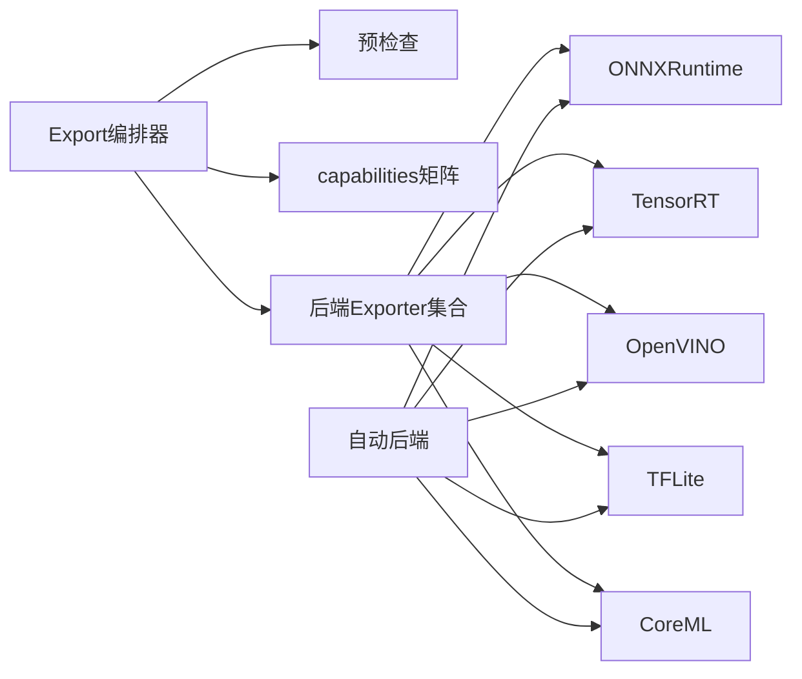

Figure Source
- [engine/exporter.py](file://ultralytics/engine/exporter.py)
- [utils/export/onnx.py](file://ultralytics/utils/export/onnx.py)
- [utils/export/tensorrt.py](file://ultralytics/utils/export/tensorrt.py)
- [utils/export/openvino.py](file://ultralytics/utils/export/openvino.py)
- [utils/export/tflite.py](file://ultralytics/utils/export/tflite.py)
- [utils/export/coreml.py](file://ultralytics/utils/export/coreml.py)
- [nn/autobackend.py](file://ultralytics/nn/autobackend.py)

Section Source
- [engine/exporter.py](file://ultralytics/engine/exporter.py)
- [nn/autobackend.py](file://ultralytics/nn/autobackend.py)

## 性能考量
- 选择合适后端and精度：GPU 首选 TensorRT，CPU/iGPU 首选 OpenVINO，移动端首选 TFLite/CoreML。
- 固定输入形状andBatch Inference：减少内存分配and上下文切换。
- 预热and缓存：首帧预热，服务端缓存引擎and模型。
- 资源监控：关注显存/CPU/内存峰值，调整批大小and工作空间。
- 量化权衡：INT8 显著降体积and功耗，需Evaluation精度损失。

[This section provides general guidance and does not directly analyze specific files]

## 故障排除指南
- Export Failure
  - 检查预检查报告andcapabilities矩阵，确认目标组合受Supporting。
  - 降低Optimizationetc.级或关闭动态轴，逐步定位问题。
- 运行时异常
  - 核对后端版本anddrivers are installed，确保andExport时一致。
  - Uses自动后端预热and最小输入复现，捕获堆栈。
- 精度不达标
  - 重新校准量化参数，检查预处理一致性。
  - 对比Refer to输出，定位数值漂移环节。

Section Source
- [utils/export_preflight.py](file://ultralytics/utils/export_preflight.py)
- [utils/export_validation.py](file://ultralytics/utils/export_validation.py)
- [tests/test_export_preflight.py](file://tests/test_export_preflight.py)
- [tests/test_export_roundtrip.py](file://tests/test_export_roundtrip.py)

## Conclusion
YOLO-Master provides了完善的Model Export and Deployment体系：统一的Export编排、严格的预检查andExport校验、丰富的后端Supportingand自动后端加载、跨平台边缘and移动端Examples、云服务的容器化and微服务实践，Centered onand量化and编译Optimization手段。Via基准and回归测试保障质量，借助监控and维护策略确保生产稳定。建议while实际项目中依据capabilities矩阵and目标平台特性选择合适的后端andOptimization策略，并Centered on自动化测试and监控闭环持续提升可靠性and性能。

[本节for总结，不直接分析具体文件]

## Appendix
- 相关Documentationand集成指南
  - 部署选项and实践：docs/en/guides/model-deployment-options.md、docs/en/guides/model-deployment-practices.md
  - Inference服务器：docs/en/guides/triton-inference-server.md
  - 平台指南：docs/en/guides/nvidia-jetson.md、docs/en/guides/raspberry-pi.md
  - 后端集成：docs/en/integrations/onnx.md、docs/en/integrations/tensorrt.md、docs/en/integrations/openvino.md、docs/en/integrations/tflite.md、docs/en/integrations/coreml.md
- Examples工程
  - Edge DeploymentExamples：examples/YOLO-Master-Cross-Platform-Edge-Deployment、examples/YOLO-Master-Edge-Deployment
  - C++ InferenceExamples：examples/YOLOv8-ONNXRuntime-CPP、examples/YOLOv8-OpenVINO-CPP-Inference、examples/YOLO11-Triton-CPP

[本节for索引，不直接分析具体文件]