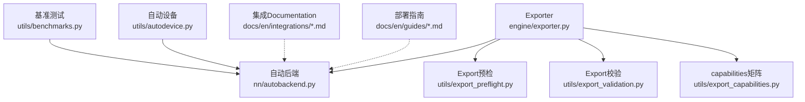
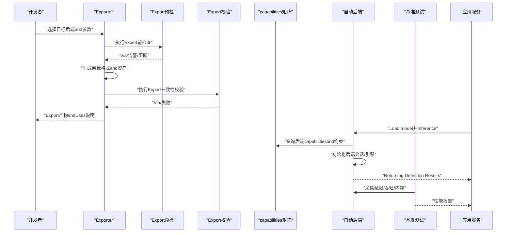
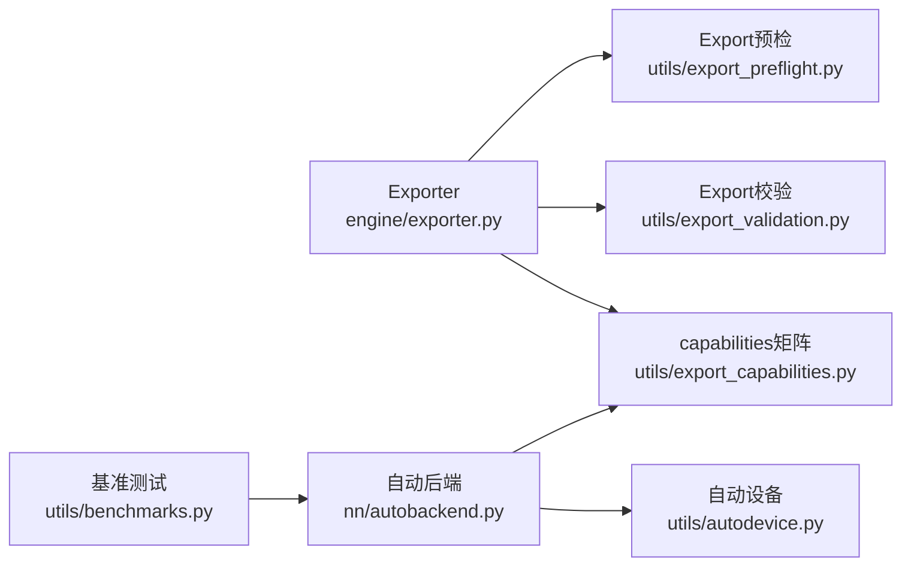

# 压缩后端and部署Optimization

<cite>
**Files Referenced in This Document**
- [exporter.py](file://ultralytics/engine/exporter.py)
- [autobackend.py](file://ultralytics/nn/autobackend.py)
- [export_preflight.py](file://ultralytics/utils/export_preflight.py)
- [export_validation.py](file://ultralytics/utils/export_validation.py)
- [export_capabilities.py](file://ultralytics/utils/export_capabilities.py)
- [benchmarks.py](file://ultralytics/utils/benchmarks.py)
- [autodevice.py](file://ultralytics/utils/autodevice.py)
- [tensorrt.md](file://docs/en/integrations/tensorrt.md)
- [openvino.md](file://docs/en/integrations/openvino.md)
- [coreml.md](file://docs/en/integrations/coreml.md)
- [tflite.md](file://docs/en/integrations/tflite.md)
- [model-deployment-options.md](file://docs/en/guides/model-deployment-options.md)
- [model-deployment-practices.md](file://docs/en/guides/model-deployment-practices.md)
- [triton-inference-server.md](file://docs/en/guides/triton-inference-server.md)
- [nvidia-jetson.md](file://docs/en/guides/nvidia-jetson.md)
- [raspberry-pi.md](file://docs/en/guides/raspberry-pi.md)
- [edge-tpu.md](file://docs/en/integrations/edge-tpu.md)
- [ncnn.md](file://docs/en/integrations/ncnn.md)
- [mnn.md](file://docs/en/integrations/mnn.md)
- [litert.md](file://docs/en/integrations/litert.md)
- [executorch.md](file://docs/en/integrations/executorch.md)
- [rockchip-rknn.md](file://docs/en/integrations/rockchip-rknn.md)
- [hailo.md](file://docs/en/integrations/hailo.md)
- [deepstream-nvidia-jetson.md](file://docs/en/guides/deepstream-nvidia-jetson.md)
- [dlstreamer-intel.md](file://docs/en/guides/dlstreamer-intel.md)
- [optimize-openvino-latency-vs-throughput-modes.md](file://docs/en/guides/optimizing-openvino-latency-vs-throughput-modes.md)
- [test_autobackend_warmup.py](file://tests/test_autobackend_warmup.py)
- [test_export_preflight.py](file://tests/test_export_preflight.py)
- [test_export_roundtrip.py](file://tests/test_export_roundtrip.py)
- [test_engine.py](file://tests/test_engine.py)
- [test_integrations.py](file://tests/test_integrations.py)
</cite>

## Table of Contents
1. [Introduction](#Introduction)
2. [Project Structure](#Project Structure)
3. [Core Components](#Core Components)
4. [Architecture Overview](#Architecture Overview)
5. [Detailed Component Analysis](#Detailed Component Analysis)
6. [Dependency Analysis](#Dependency Analysis)
7. [Performance Considerations](#Performance Considerations)
8. [Troubleshooting Guide](#Troubleshooting Guide)
9. [Conclusion](#Conclusion)
10. [Appendix](#Appendix)

## Introduction
本技术Documentation聚焦于YOLO-Master的“压缩后端and部署Optimization系统”，覆盖Centered on下关键主题：
- 多后端Exportand运行：TensorRT、OpenVINO、CoreML、TFLiteetc.后端的集成方法and配置要点
- Edge Device Deployment：内存、算力、功耗约束下的适配策略
- 移动端Optimization：iOSandAndroid平台的部署方案
- 云端部署：Batch Inferenceand服务化（such asTriton）的性能Optimization
- hardware acceleration器适配：GPU、NPU、DSPetc.加速器的选择and调优
- 部署前Validationand兼容性检查：Export预检、Export校验、端to端一致性
- 跨平台Unified Interfaceand抽象层：Autobackend的统一Inference入口
- 错误诊断and性能调优：从ExporttoInference的全链路问题定位方法

## Project Structure
and压缩后端和部署Optimization相关的核心代码andDocumentation分布such as下：
- 引擎andExport
  - 引擎Exporter：负责将PyTorch模型转换for多种目标格式，并生成运行时所需资产
  - 自动后端：whileInference阶段根据目标环境and可用库动态加载最优后端
- 工具andcapabilities矩阵
  - Export预检：whileExport前进行算子/特性Supporting性检查，避免失败或不可用
  - Export校验：对转换结果进行数值一致性and形状完整性校验
  - capabilities矩阵：汇总各后端对不同Tasks/算子的Supporting情况
- 基准测试and设备探测
  - 基准测试：provides端to端延迟/吞吐测量and对比
  - 自动设备：自动选择CPU/GPU/NPUetc.可用设备
- DocumentationandExamples
  - 集成Documentation：针对各后端的Uses说明、参数and注意事项
  - 部署实践：targeting边缘、移动端、云端的最佳实践and案例

Figure Source
- [exporter.py](file://ultralytics/engine/exporter.py)
- [autobackend.py](file://ultralytics/nn/autobackend.py)
- [export_preflight.py](file://ultralytics/utils/export_preflight.py)
- [export_validation.py](file://ultralytics/utils/export_validation.py)
- [export_capabilities.py](file://ultralytics/utils/export_capabilities.py)
- [benchmarks.py](file://ultralytics/utils/benchmarks.py)
- [autodevice.py](file://ultralytics/utils/autodevice.py)

Section Source
- [exporter.py](file://ultralytics/engine/exporter.py)
- [autobackend.py](file://ultralytics/nn/autobackend.py)
- [export_preflight.py](file://ultralytics/utils/export_preflight.py)
- [export_validation.py](file://ultralytics/utils/export_validation.py)
- [export_capabilities.py](file://ultralytics/utils/export_capabilities.py)
- [benchmarks.py](file://ultralytics/utils/benchmarks.py)
- [autodevice.py](file://ultralytics/utils/autodevice.py)

## Core Components
- Exporter（Exporter）
  - 职责：将Training好的Model ExportforONNXand目标后端专用格式；管理权重、配置文件and运行时资产；触发预检and校验流程。
  - 关键点：目标格式选择、精度设置、输入形状and动态轴、算子兼容性and图Optimization开关。
- 自动后端（AutoBackend）
  - 职责：whileInference时根据环境检测andcapabilities矩阵，选择最合适的后端（such asTensorRT、OpenVINO、CoreML、TFLiteetc.），并provides统一Calls接口。
  - 关键点：后端发现、会话/引擎初始化、预热、设备绑定、异常回退。
- Export预检（Export Preflight）
  - 职责：whileExport前检查模型结构、算子Supporting、输入输出规格、目标平台限制，提前暴露不兼容项。
  - 关键点：规则集、告警级别、修复建议。
- Export校验（Export Validation）
  - 职责：对比原始模型andExport模型的输出一致性、形状and类型，确保转换正确性。
  - 关键点：容差阈值、随机种子、样本集构造。
- capabilities矩阵（Export Capabilities）
  - 职责：维护不同后端对Tasks、算子、精度的Supporting矩阵，指导Export策略and降级路径。
  - 关键点：版本差异、平台差异、Tasks维度。
- 基准测试（Benchmarks）
  - 职责：while不同后端and设备上测量延迟、吞吐、内存占用，辅助选型and调参。
  - 关键点：批大小、输入分辨率、预热轮次、统计Metrics。
- 自动设备（AutoDevice）
  - 职责：探测可用设备（CPU/GPU/NPU/DSP），返回优先级排序and资源信息。
  - 关键点：drivers are installed可用性、显存/内存容量、设备拓扑。

Section Source
- [exporter.py](file://ultralytics/engine/exporter.py)
- [autobackend.py](file://ultralytics/nn/autobackend.py)
- [export_preflight.py](file://ultralytics/utils/export_preflight.py)
- [export_validation.py](file://ultralytics/utils/export_validation.py)
- [export_capabilities.py](file://ultralytics/utils/export_capabilities.py)
- [benchmarks.py](file://ultralytics/utils/benchmarks.py)
- [autodevice.py](file://ultralytics/utils/autodevice.py)

## Architecture Overview
下图展示了从Model Exportto多后端Inference的整体流程，Centered onand预检、校验、capabilities矩阵and基准测试的协作关系。

Figure Source
- [exporter.py](file://ultralytics/engine/exporter.py)
- [export_preflight.py](file://ultralytics/utils/export_preflight.py)
- [export_validation.py](file://ultralytics/utils/export_validation.py)
- [export_capabilities.py](file://ultralytics/utils/export_capabilities.py)
- [autobackend.py](file://ultralytics/nn/autobackend.py)
- [benchmarks.py](file://ultralytics/utils/benchmarks.py)

## Detailed Component Analysis

### Exporter（Exporter）
- 功能要点
  - Supporting多目标格式Export（例such asONNX、TensorRT、OpenVINO、CoreML、TFLiteetc.）
  - 管理Export选项：输入形状、动态轴、精度、算子融合、Optimization开关
  - 生成运行时所需资产：权重、配置文件、元数据
- 设计模式
  - 工厂式选择目标后端
  - 钩子机制用于预检and校验
- 典型流程
  - 解析Export参数 -> 构建中间表示（such asONNX）-> 应用后端特定Optimization -> 生成最终产物 -> 触发校验

Section Source
- [exporter.py](file://ultralytics/engine/exporter.py)

### 自动后端（AutoBackend）
- 功能要点
  - 运行时自动选择最优后端（依据capabilities矩阵and环境检测）
  - 统一Inference接口，屏蔽后端差异
  - Supporting后端预热、设备绑定、异常回退
- 设计模式
  - Adapter模式：Encapsulates不同后端API
  - 策略模式：按条件选择具体后端implementing
- 典型流程
  - 探测设备and库 -> 查询capabilities矩阵 -> 选择后端 -> 初始化会话/引擎 -> Executing Inference -> 收集Metrics

Section Source
- [autobackend.py](file://ultralytics/nn/autobackend.py)

### Export预检（Export Preflight）
- 功能要点
  - 检查模型结构and算子是否受目标后端Supporting
  - 检查输入输出形状、数据类型、动态范围
  - 给出修复建议或降级策略
- 设计模式
  - 规则引擎：可插拔的检查规则集合
- 典型流程
  - 遍历模型节点 -> 匹配规则 -> 记录告警/阻断 -> 输出报告

Section Source
- [export_preflight.py](file://ultralytics/utils/export_preflight.py)

### Export校验（Export Validation）
- 功能要点
  - 对比原始模型andExport模型的输出一致性
  - 检查形状、类型、数值误差是否while容差范围内
- 设计模式
  - 采样drivers are installed：Uses代表性样本集进行回归测试
- 典型流程
  - 准备样本 -> 运行原始模型andExport模型 -> 计算误差 -> 判定Via/失败

Section Source
- [export_validation.py](file://ultralytics/utils/export_validation.py)

### capabilities矩阵（Export Capabilities）
- 功能要点
  - 维护后端-Tasks-算子-精度的Supporting矩阵
  - 随版本更新扩展，指导Export策略and回退路径
- 设计模式
  - Registry：集中管理capabilities声明
- 典型流程
  - 查询某后端while某Tasks上的capabilities -> 决定Export选项andOptimization开关

Section Source
- [export_capabilities.py](file://ultralytics/utils/export_capabilities.py)

### 基准测试（Benchmarks）
- 功能要点
  - 测量延迟、吞吐、内存占用
  - Supporting多后端、多设备、多批次的对比实验
- 设计模式
  - 可配置实验套件：批大小、分辨率、预热轮次、统计Metrics
- 典型流程
  - Load model -> 预热 -> 循环Inference -> 统计Metrics -> 输出报告

Section Source
- [benchmarks.py](file://ultralytics/utils/benchmarks.py)

### 自动设备（AutoDevice）
- 功能要点
  - 探测CPU/GPU/NPU/DSPdevices可用性
  - 返回设备优先级and资源信息（显存/内存）
- 设计模式
  - 插件式设备发现：可扩展新设备类型
- 典型流程
  - 扫描设备 -> Evaluation资源 -> 排序推荐 -> 供后端选择

Section Source
- [autodevice.py](file://ultralytics/utils/autodevice.py)

### 后端集成and配置要点（TensorRT、OpenVINO、CoreML、TFLite）
- TensorRT
  - Applicable Scenarios：NVIDIA GPU高性能Inference
  - 关键配置：精度（FP16/INT8）、动态输入、层融合、Optimization级别
  - Refer toDocumentation：[tensorrt.md](file://docs/en/integrations/tensorrt.md)
- OpenVINO
  - Applicable Scenarios：Intel CPU/集成GPU/NPU
  - 关键配置：精度、I/O布局、Optimization模式（延迟/吞吐）
  - Refer toDocumentation：[openvino.md](file://docs/en/integrations/openvino.md)、[optimize-openvino-latency-vs-throughput-modes.md](file://docs/en/guides/optimizing-openvino-latency-vs-throughput-modes.md)
- CoreML
  - Applicable Scenarios：Apple生态（macOS/iOS）
  - 关键配置：精度、Metal加速、Model Compression
  - Refer toDocumentation：[coreml.md](file://docs/en/integrations/coreml.md)
- TFLite
  - Applicable Scenarios：Android/iOS移动端
  - 关键配置：量化（INT8）、NNAPI/Delegate、线程数
  - Refer toDocumentation：[tflite.md](file://docs/en/integrations/tflite.md)

Section Source
- [tensorrt.md](file://docs/en/integrations/tensorrt.md)
- [openvino.md](file://docs/en/integrations/openvino.md)
- [coreml.md](file://docs/en/integrations/coreml.md)
- [tflite.md](file://docs/en/integrations/tflite.md)
- [optimize-openvino-latency-vs-throughput-modes.md](file://docs/en/guides/optimizing-openvino-latency-vs-throughput-modes.md)

### Edge Device Deployment特殊考虑
- 内存限制
  - 控制模型体积and中间激活大小，优先选择低精度and量化
  - Refer to：[raspberry-pi.md](file://docs/en/guides/raspberry-pi.md)
- 计算capabilities
  - 选择适合的设备（CPU/集成GPU/NPU），调整批大小and分辨率
  - Refer to：[nvidia-jetson.md](file://docs/en/guides/nvidia-jetson.md)
- 功耗约束
  - 降低频率、减少预热、采用低功耗模式
  - Refer to：[deepstream-nvidia-jetson.md](file://docs/en/guides/deepstream-nvidia-jetson.md)

Section Source
- [raspberry-pi.md](file://docs/en/guides/raspberry-pi.md)
- [nvidia-jetson.md](file://docs/en/guides/nvidia-jetson.md)
- [deepstream-nvidia-jetson.md](file://docs/en/guides/deepstream-nvidia-jetson.md)

### 移动端Optimization（iOSandAndroid）
- iOS
  - UsesCoreMLandMetal加速，CombiningXcode工具链Optimization
  - Refer to：[coreml.md](file://docs/en/integrations/coreml.md)
- Android
  - UsesTFLiteandNNAPI/Delegate，Combining量化and线程池Optimization
  - Refer to：[tflite.md](file://docs/en/integrations/tflite.md)
- 其他移动端后端
  - NCNN、MNN、LiteRT、ExecutorTorchetc.
  - Refer to：[ncnn.md](file://docs/en/integrations/ncnn.md)、[mnn.md](file://docs/en/integrations/mnn.md)、[litert.md](file://docs/en/integrations/litert.md)、[executorch.md](file://docs/en/integrations/executorch.md)

Section Source
- [coreml.md](file://docs/en/integrations/coreml.md)
- [tflite.md](file://docs/en/integrations/tflite.md)
- [ncnn.md](file://docs/en/integrations/ncnn.md)
- [mnn.md](file://docs/en/integrations/mnn.md)
- [litert.md](file://docs/en/integrations/litert.md)
- [executorch.md](file://docs/en/integrations/executorch.md)

### 云端部署性能Optimization（Batch Inferenceand服务化）
- Batch Inference
  - Set appropriately批大小and输入分辨率，平衡延迟and吞吐
  - Refer to：[benchmarks.py](file://ultralytics/utils/benchmarks.py)
- 服务化部署
  - UsesTriton Inference Server进行高并发服务化
  - Refer to：[triton-inference-server.md](file://docs/en/guides/triton-inference-server.md)
- 通用部署实践
  - 容器化、健康检查、监控andLogging
  - Refer to：[model-deployment-options.md](file://docs/en/guides/model-deployment-options.md)、[model-deployment-practices.md](file://docs/en/guides/model-deployment-practices.md)

Section Source
- [benchmarks.py](file://ultralytics/utils/benchmarks.py)
- [triton-inference-server.md](file://docs/en/guides/triton-inference-server.md)
- [model-deployment-options.md](file://docs/en/guides/model-deployment-options.md)
- [model-deployment-practices.md](file://docs/en/guides/model-deployment-practices.md)

### hardware acceleration器适配（GPU、NPU、DSP）
- NVIDIA GPU（TensorRT、DeepStream）
  - Refer to：[tensorrt.md](file://docs/en/integrations/tensorrt.md)、[deepstream-nvidia-jetson.md](file://docs/en/guides/deepstream-nvidia-jetson.md)
- Intel CPU/集成GPU/NPU（OpenVINO、DLStreamer）
  - Refer to：[openvino.md](file://docs/en/integrations/openvino.md)、[dlstreamer-intel.md](file://docs/en/guides/dlstreamer-intel.md)
- Apple NPU（CoreML）
  - Refer to：[coreml.md](file://docs/en/integrations/coreml.md)
- Edge TPU（Coral）
  - Refer to：[edge-tpu.md](file://docs/en/integrations/edge-tpu.md)
- 其他NPU/DSP（Rockchip RKNN、Hailo）
  - Refer to：[rockchip-rknn.md](file://docs/en/integrations/rockchip-rknn.md)、[hailo.md](file://docs/en/integrations/hailo.md)

Section Source
- [tensorrt.md](file://docs/en/integrations/tensorrt.md)
- [deepstream-nvidia-jetson.md](file://docs/en/guides/deepstream-nvidia-jetson.md)
- [openvino.md](file://docs/en/integrations/openvino.md)
- [dlstreamer-intel.md](file://docs/en/guides/dlstreamer-intel.md)
- [coreml.md](file://docs/en/integrations/coreml.md)
- [edge-tpu.md](file://docs/en/integrations/edge-tpu.md)
- [rockchip-rknn.md](file://docs/en/integrations/rockchip-rknn.md)
- [hailo.md](file://docs/en/integrations/hailo.md)

### 部署前Validationand兼容性检查
- Export预检
  - whileExport前进行算子and特性Supporting检查，避免失败
  - Refer to：[export_preflight.py](file://ultralytics/utils/export_preflight.py)、[test_export_preflight.py](file://tests/test_export_preflight.py)
- Export校验
  - 对比原始andExport模型输出一致性，确保转换正确
  - Refer to：[export_validation.py](file://ultralytics/utils/export_validation.py)、[test_export_roundtrip.py](file://tests/test_export_roundtrip.py)
- 端to端引擎测试
  - ValidationExport产物while目标后端上可正常Inference
  - Refer to：[test_engine.py](file://tests/test_engine.py)
- 集成测试
  - 覆盖多后端and多设备的集成用例
  - Refer to：[test_integrations.py](file://tests/test_integrations.py)

Section Source
- [export_preflight.py](file://ultralytics/utils/export_preflight.py)
- [test_export_preflight.py](file://tests/test_export_preflight.py)
- [export_validation.py](file://ultralytics/utils/export_validation.py)
- [test_export_roundtrip.py](file://tests/test_export_roundtrip.py)
- [test_engine.py](file://tests/test_engine.py)
- [test_integrations.py](file://tests/test_integrations.py)

### 跨平台Unified Interfaceand抽象层设计
- 统一Inference入口
  - Via自动后端屏蔽不同后端API差异，provides一致的Prediction接口
  - Refer to：[autobackend.py](file://ultralytics/nn/autobackend.py)
- 设备and资源抽象
  - 自动设备探测and资源信息上报，辅助后端选择
  - Refer to：[autodevice.py](file://ultralytics/utils/autodevice.py)
- capabilities矩阵drivers are installed的策略
  - 基于capabilities矩阵的动态选择and回退策略
  - Refer to：[export_capabilities.py](file://ultralytics/utils/export_capabilities.py)

Section Source
- [autobackend.py](file://ultralytics/nn/autobackend.py)
- [autodevice.py](file://ultralytics/utils/autodevice.py)
- [export_capabilities.py](file://ultralytics/utils/export_capabilities.py)

### 部署过程中的错误诊断and性能调优
- 错误诊断
  - Export Failure：查看预检报告andcapabilities矩阵，定位不Supporting的算子或配置
  - Inference异常：检查设备状态、后端初始化Logging、输入形状and数据类型
  - Refer to：[test_autobackend_warmup.py](file://tests/test_autobackend_warmup.py)
- 性能调优
  - 调整批大小、输入分辨率、精度andOptimization开关
  - Uses基准测试对比不同配置的效果
  - Refer to：[benchmarks.py](file://ultralytics/utils/benchmarks.py)

Section Source
- [test_autobackend_warmup.py](file://tests/test_autobackend_warmup.py)
- [benchmarks.py](file://ultralytics/utils/benchmarks.py)

## Dependency Analysis
下图展示核心Modules之间的依赖关系and交互方式。

Figure Source
- [exporter.py](file://ultralytics/engine/exporter.py)
- [export_preflight.py](file://ultralytics/utils/export_preflight.py)
- [export_validation.py](file://ultralytics/utils/export_validation.py)
- [export_capabilities.py](file://ultralytics/utils/export_capabilities.py)
- [autobackend.py](file://ultralytics/nn/autobackend.py)
- [autodevice.py](file://ultralytics/utils/autodevice.py)
- [benchmarks.py](file://ultralytics/utils/benchmarks.py)

Section Source
- [exporter.py](file://ultralytics/engine/exporter.py)
- [autobackend.py](file://ultralytics/nn/autobackend.py)
- [export_preflight.py](file://ultralytics/utils/export_preflight.py)
- [export_validation.py](file://ultralytics/utils/export_validation.py)
- [export_capabilities.py](file://ultralytics/utils/export_capabilities.py)
- [benchmarks.py](file://ultralytics/utils/benchmarks.py)
- [autodevice.py](file://ultralytics/utils/autodevice.py)

## Performance Considerations
- 精度and速度权衡
  - FP16/INT8量化可显著降低内存and提升吞吐，但需关注精度损失
- 批大小and分辨率
  - 增大批大小提高吞吐，但会增加延迟and内存占用；分辨率影响计算量
- 后端Optimization开关
  - 层融合、算子替换、内存复用etc.Optimization手段需Combining目标平台特性启用
- 预热and冷启动
  - 首次加载可能较慢，预热可减少首帧延迟
- 监控and回归
  - 持续采集延迟/吞吐/内存Metrics，建立回归基线

[本节for通用性能指导，无需引用具体文件]

## Troubleshooting Guide
- Export阶段
  - 预检失败：检查capabilities矩阵and算子Supporting，调整Export选项或降级策略
  - 校验失败：核对输入形状、数据类型and容差设置，复现实验样本
- Inference阶段
  - 后端初始化失败：确认drivers are installedand库版本，检查设备资源and权限
  - 输出不一致：比对原始andExport模型，逐步定位算子差异
- 性能问题
  - 延迟过高：降低分辨率或批大小，尝试更高精度或不同后端
  - 吞吐不足：增加并行度、Optimization预处理流水线、Uses服务化部署

Section Source
- [test_export_preflight.py](file://tests/test_export_preflight.py)
- [test_export_roundtrip.py](file://tests/test_export_roundtrip.py)
- [test_autobackend_warmup.py](file://tests/test_autobackend_warmup.py)
- [test_engine.py](file://tests/test_engine.py)
- [test_integrations.py](file://tests/test_integrations.py)

## Conclusion
YOLO-MasterViaExporter、自动后端、预检and校验、capabilities矩阵and基准测试etc.组件，构建了完整的压缩后端and部署Optimization体系。借助统一的抽象层and丰富的集成Documentation，User可while边缘、移动端and云端高效部署，并while不同hardware acceleration器上获得稳定且高性能的Inference体验。建议while部署前充分Uses预检and校验工具，Combining基准测试进行参数调优，并Via服务化and监控保障生产环境的稳定性and可观测性。

[本节for总结性内容，无需引用具体文件]

## Appendix
- 相关Documentation索引
  - 集成Documentation：[tensorrt.md](file://docs/en/integrations/tensorrt.md)、[openvino.md](file://docs/en/integrations/openvino.md)、[coreml.md](file://docs/en/integrations/coreml.md)、[tflite.md](file://docs/en/integrations/tflite.md)
  - 部署指南：[model-deployment-options.md](file://docs/en/guides/model-deployment-options.md)、[model-deployment-practices.md](file://docs/en/guides/model-deployment-practices.md)、[triton-inference-server.md](file://docs/en/guides/triton-inference-server.md)
  - 平台指南：[nvidia-jetson.md](file://docs/en/guides/nvidia-jetson.md)、[raspberry-pi.md](file://docs/en/guides/raspberry-pi.md)、[deepstream-nvidia-jetson.md](file://docs/en/guides/deepstream-nvidia-jetson.md)、[dlstreamer-intel.md](file://docs/en/guides/dlstreamer-intel.md)
  - 其他后端：[edge-tpu.md](file://docs/en/integrations/edge-tpu.md)、[ncnn.md](file://docs/en/integrations/ncnn.md)、[mnn.md](file://docs/en/integrations/mnn.md)、[litert.md](file://docs/en/integrations/litert.md)、[executorch.md](file://docs/en/integrations/executorch.md)、[rockchip-rknn.md](file://docs/en/integrations/rockchip-rknn.md)、[hailo.md](file://docs/en/integrations/hailo.md)

[本节for索引性内容，无需引用具体文件]