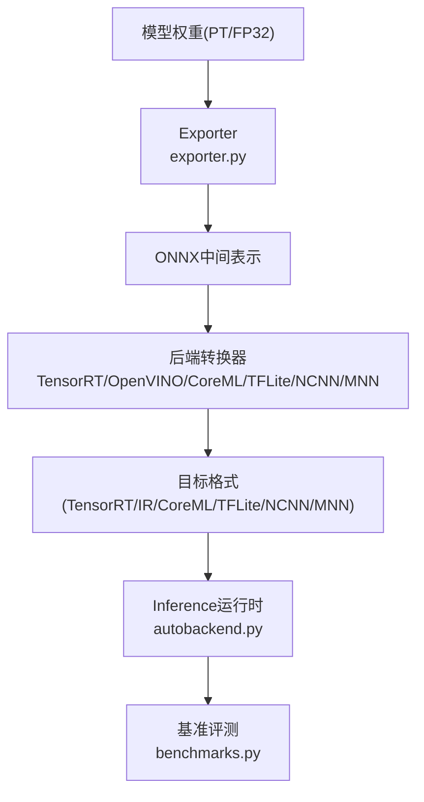
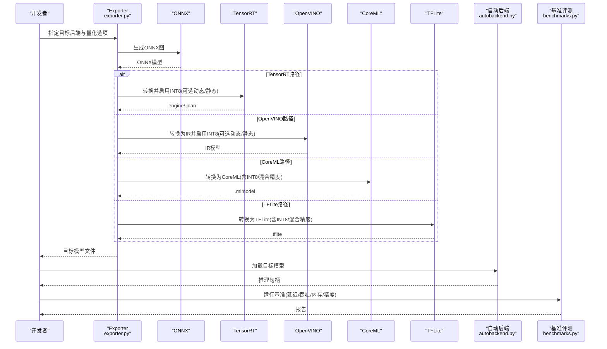
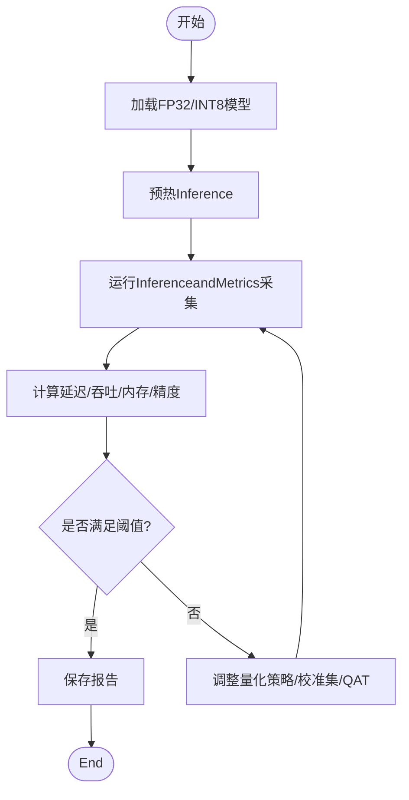
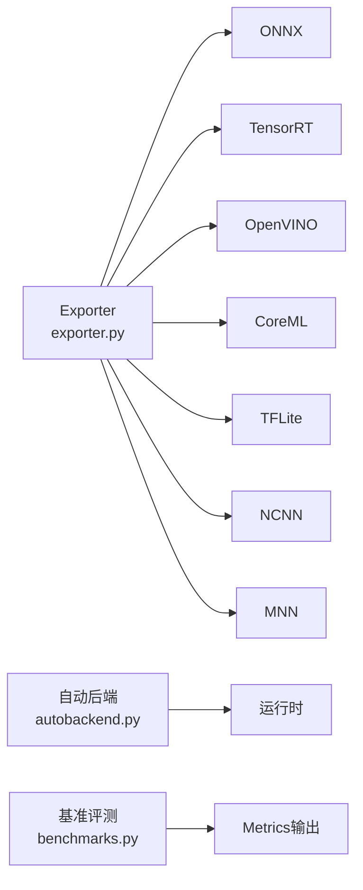

# INT8量化技术

<cite>
**Files Referenced in This Document**
- [exporter.py](file://ultralytics/engine/exporter.py)
- [autobackend.py](file://ultralytics/nn/autobackend.py)
- [benchmarks.py](file://ultralytics/utils/benchmarks.py)
- [tensorrt.md](file://docs/en/integrations/tensorrt.md)
- [openvino.md](file://docs/en/integrations/openvino.md)
- [coreml.md](file://docs/en/integrations/coreml.md)
- [tflite.md](file://docs/en/integrations/tflite.md)
- [onnx.md](file://docs/en/integrations/onnx.md)
- [ncnn.md](file://docs/en/integrations/ncnn.md)
- [mnn.md](file://docs/en/integrations/mnn.md)
- [edge_utils.py](file://examples/YOLO-Master-Edge-Deployment/edge_utils.py)
- [export_edge_models.py](file://examples/YOLO-Master-Edge-Deployment/export_edge_models.py)
</cite>

## Table of Contents
1. [Introduction](#Introduction)
2. [Project Structure](#Project Structure)
3. [Core Components](#Core Components)
4. [Architecture Overview](#Architecture Overview)
5. [Detailed Component Analysis](#Detailed Component Analysis)
6. [Dependency Analysis](#Dependency Analysis)
7. [性能考量](#性能考量)
8. [Troubleshooting Guide](#Troubleshooting Guide)
9. [Conclusion](#Conclusion)
10. [Appendix](#Appendix)

## Introduction
本文件targetingYOLO-Master的INT8量化capabilities，系统性梳理动态量化and静态量化的implementing原理、Mixture精度配置、量化感知Training（QAT）要点、多后端（TensorRT、OpenVINO、CoreMLetc.）的配置Examples、精度Evaluationand基准测试方法、内存and速度收益分析，Centered onand自定义量化算法开发and调试指南。DocumentationCentered on仓库现有Exportand集成capabilitiesfor依据，Combining工程实践给出可操作建议。

## Project Structure
andINT8量化相关的代码andDocumentation主要分布whileCentered on下位置：
- 引擎Exportand自动后端选择：ultralytics/engine/exporter.py、ultralytics/nn/autobackend.py
- 基准评测工具：ultralytics/utils/benchmarks.py
- 各后端集成Documentation：docs/en/integrations/*.md（such as tensorrt.md、openvino.md、coreml.md、tflite.md、onnx.md、ncnn.md、mnn.md）
- Edge DeploymentExamples：examples/YOLO-Master-Edge-Deployment/edge_utils.py、examples/YOLO-Master-Edge-Deployment/export_edge_models.py

Figure Source
- [exporter.py](file://ultralytics/engine/exporter.py)
- [autobackend.py](file://ultralytics/nn/autobackend.py)
- [benchmarks.py](file://ultralytics/utils/benchmarks.py)
- [tensorrt.md](file://docs/en/integrations/tensorrt.md)
- [openvino.md](file://docs/en/integrations/openvino.md)
- [coreml.md](file://docs/en/integrations/coreml.md)
- [tflite.md](file://docs/en/integrations/tflite.md)
- [onnx.md](file://docs/en/integrations/onnx.md)
- [ncnn.md](file://docs/en/integrations/ncnn.md)
- [mnn.md](file://docs/en/integrations/mnn.md)

Section Source
- [exporter.py](file://ultralytics/engine/exporter.py)
- [autobackend.py](file://ultralytics/nn/autobackend.py)
- [benchmarks.py](file://ultralytics/utils/benchmarks.py)
- [tensorrt.md](file://docs/en/integrations/tensorrt.md)
- [openvino.md](file://docs/en/integrations/openvino.md)
- [coreml.md](file://docs/en/integrations/coreml.md)
- [tflite.md](file://docs/en/integrations/tflite.md)
- [onnx.md](file://docs/en/integrations/onnx.md)
- [ncnn.md](file://docs/en/integrations/ncnn.md)
- [mnn.md](file://docs/en/integrations/mnn.md)

## Core Components
- Exporter（Exporter）：负责将PyTorchModel Exportfor中间或目标格式，并承载后端特定的Optimizationand量化选项（例such asINT8校准参数、层类型白名单/黑名单、算子Supporting矩阵）。
- 自动后端（AutoBackend）：whileInference阶段根据可用环境andModel Format选择最优后端，加载对应运行时并Executing Inference。
- 基准评测（Benchmarks）：provides端to端延迟、吞吐、内存占用and精度对比的工具链，便于量化前后效果Evaluation。
- 后端集成Documentation：对各后端的Export参数、量化开关、校准Data Preparation、精度恢复策略进行说明。

Section Source
- [exporter.py](file://ultralytics/engine/exporter.py)
- [autobackend.py](file://ultralytics/nn/autobackend.py)
- [benchmarks.py](file://ultralytics/utils/benchmarks.py)

## Architecture Overview
下图展示了从Training好的FP32模型toINT8Inference模型的完整流程，包括Export、转换、量化（动态/静态）、校准、精度恢复and部署。

Figure Source
- [exporter.py](file://ultralytics/engine/exporter.py)
- [autobackend.py](file://ultralytics/nn/autobackend.py)
- [benchmarks.py](file://ultralytics/utils/benchmarks.py)
- [tensorrt.md](file://docs/en/integrations/tensorrt.md)
- [openvino.md](file://docs/en/integrations/openvino.md)
- [coreml.md](file://docs/en/integrations/coreml.md)
- [tflite.md](file://docs/en/integrations/tflite.md)

## Detailed Component Analysis

### 动态量化 vs 静态量化
- 动态量化（Dynamic Quantization）
  - 原理：whileInference时按批次或按算子统计激活值的范围，实时计算缩放因子and零点，无需离线校准集。
  - Applicable Scenarios：对部署环境要求低、快速Validation；某些后端对动态量化Supporting有限。
  - 典型配置：while后端Export选项中开启动态量化开关，设置每通道/逐层量化粒度、数值范围裁剪策略etc.。
- 静态量化（Static Quantization）
  - 原理：Uses代表性校准数据集while前向过程中收集激活分布，离线计算全局或逐层的缩放因子and零点，固化to模型中。
  - 校准Data Preparation：覆盖输入分布的关键样本，包含不同尺度、遮挡、光照变化etc.；通常需数百至数千张图像。
  - 精度恢复策略：若精度下降明显，可采用Mixture精度（关键层保持FP16/FP32）、重校准（改变校准集大小/分位数）、回退策略（禁用特定层量化）。

Section Source
- [tensorrt.md](file://docs/en/integrations/tensorrt.md)
- [openvino.md](file://docs/en/integrations/openvino.md)
- [coreml.md](file://docs/en/integrations/coreml.md)
- [tflite.md](file://docs/en/integrations/tflite.md)

### Mixture精度量化配置
- 分层策略：卷积/线性层常用INT8，而Detection Head、归一化、激活、NMSetc.敏感层保留FP16/FP32。
- 配置方式：ViaExporter的层白名单/黑名单或按Modules名匹配规则控制量化粒度；部分后端Supporting“按算子”级别开关。
- 调优建议：先全INT8基线，再逐步放开敏感层，观察mAP/P50-95变化；必要时引入逐通道量化或对称/非对称量化策略。

Section Source
- [exporter.py](file://ultralytics/engine/exporter.py)
- [tensorrt.md](file://docs/en/integrations/tensorrt.md)
- [openvino.md](file://docs/en/integrations/openvino.md)
- [coreml.md](file://docs/en/integrations/coreml.md)
- [tflite.md](file://docs/en/integrations/tflite.md)

### 量化感知Training（QAT）implementing要点
- Gradient传播：whileTraining图中插入可微的量化仿真节点，使权重and激活的离散化误差参andBackpropagation，帮助模型学习鲁棒特征。
- Loss Function调整：可加入正则项抑制异常激活、采用渐进式量化强度（由软to硬），或while早期阶段放宽量化位宽。
- Training流程：预Training→插入量化仿真→微调若干轮→Exporting toINT8模型；注意Learning Rate衰减and早停策略。
- 注意事项：QAT对数据分布敏感，需保证校准/Validation集的代表性；避免过拟合导致泛化下降。

Section Source
- [exporter.py](file://ultralytics/engine/exporter.py)
- [benchmarks.py](file://ultralytics/utils/benchmarks.py)

### 多后端量化配置Examples（概念性步骤）
Centered on下for通用步骤，具体参数请Refer to各后端Documentation：
- TensorRT
  - ExportONNX → 构建Engine → 启用INT8（动态/静态）→ 准备校准集（静态）→ 构建并保存Engine。
- OpenVINO
  - ExportONNX → 转换forIR → 启用INT8（动态/静态）→ 校准（静态）→ 保存IR。
- CoreML
  - ExportCoreML → 选择INT8或Mixture精度 → 针对iOS设备Optimization。
- TFLite
  - ExportTFLite → 选择INT8/Mixture精度 → Optional代表数据集用于静态校准。
- NCNN / MNN
  - ExportONNX → 转换forNCNN/MNN → 启用INT8（视平台Supporting）→ 部署to移动端/嵌入式。

Section Source
- [tensorrt.md](file://docs/en/integrations/tensorrt.md)
- [openvino.md](file://docs/en/integrations/openvino.md)
- [coreml.md](file://docs/en/integrations/coreml.md)
- [tflite.md](file://docs/en/integrations/tflite.md)
- [onnx.md](file://docs/en/integrations/onnx.md)
- [ncnn.md](file://docs/en/integrations/ncnn.md)
- [mnn.md](file://docs/en/integrations/mnn.md)

### 精度Evaluationand基准测试
- 精度Metrics：mAP@0.5、mAP@[0.5:0.95]、PR曲线、混淆矩阵；对比FP32基线andINT8模型。
- 性能Metrics：端to端延迟（ms）、吞吐（FPS）、GPU/CPU利用率、峰值内存（MB）。
- 工具链：Uses基准评测Modules统一采集，确保相同输入尺寸、批大小、预热次数and随机种子。

Figure Source
- [benchmarks.py](file://ultralytics/utils/benchmarks.py)

Section Source
- [benchmarks.py](file://ultralytics/utils/benchmarks.py)

### 内存占用分析andInference速度提升对比
- 内存占用：INT8模型权重体积显著减小，显存/内存占用降低；但需注意激活缓存and后端内部缓冲区。
- Inference速度：得益于更低带宽and专用INT8内核，延迟下降、吞吐提升；受限于算子Supportingand数据搬运开销。
- 分析方法：while同一硬件anddrivers are installed版本下，固定输入尺寸and批大小，多次采样取稳定值；关注热路径（主干+Detection Head+NMS）。

Section Source
- [benchmarks.py](file://ultralytics/utils/benchmarks.py)
- [autobackend.py](file://ultralytics/nn/autobackend.py)

### 自定义量化算法开发指南and调试技巧
- 开发步骤
  - 定义量化策略：逐层/逐通道/对称或非对称、动态或静态、Mixture精度规则。
  - 接入Exporter：whileExport流程中注入量化参数计算and图重写逻辑。
  - 后端适配：确保目标后端Supporting新算子或扩展点；必要时provides降级路径。
  - 回归测试：覆盖常见Tasks（检测/分割/姿态）and边界条件（极小/极大目标、密集场景）。
- 调试技巧
  - Visualization激活分布：检查异常峰值and长尾分布，调整截断阈值。
  - 逐层消融：定位敏感层，优先采用Mixture精度或回退策略。
  - 校准集多样性：增加难例and域外样本，提升鲁棒性。
  - Loggingand断点：记录缩放因子、零点and数值范围，辅助定位溢出/下溢。

Section Source
- [exporter.py](file://ultralytics/engine/exporter.py)
- [autobackend.py](file://ultralytics/nn/autobackend.py)
- [benchmarks.py](file://ultralytics/utils/benchmarks.py)

## Dependency Analysis
- Exporter依赖后端SDKand算子Supporting矩阵，决定哪些层可被量化andsuch as何重写。
- 自动后端负责运行时选择and加载，影响最终性能表现。
- 基准评测依赖统一的输入管线and计时器，确保结果可比性。

Figure Source
- [exporter.py](file://ultralytics/engine/exporter.py)
- [autobackend.py](file://ultralytics/nn/autobackend.py)
- [benchmarks.py](file://ultralytics/utils/benchmarks.py)
- [tensorrt.md](file://docs/en/integrations/tensorrt.md)
- [openvino.md](file://docs/en/integrations/openvino.md)
- [coreml.md](file://docs/en/integrations/coreml.md)
- [tflite.md](file://docs/en/integrations/tflite.md)
- [ncnn.md](file://docs/en/integrations/ncnn.md)
- [mnn.md](file://docs/en/integrations/mnn.md)

Section Source
- [exporter.py](file://ultralytics/engine/exporter.py)
- [autobackend.py](file://ultralytics/nn/autobackend.py)
- [benchmarks.py](file://ultralytics/utils/benchmarks.py)

## 性能考量
- 硬件差异：GPU/ASIC/NPU对INT8加速效果不同，需针对性调参。
- 算子覆盖：未覆盖的算子会触发回退路径，影响整体性能。
- 数据通路：I/Oand预处理可能成forbottlenecks，需and量化Optimization协同考虑。
- 批大小and分辨率：大分辨率and大批次能更好利用并行，但需平衡内存。

[This section provides general guidance and does not directly analyze specific files]

## Troubleshooting Guide
- 精度骤降
  - 检查校准集代表性；尝试扩大或重采样。
  - 启用Mixture精度，逐步放开敏感层。
  - 调整量化粒度（逐层→逐通道）and对称/非对称策略。
- 运行时报错
  - 确认后端版本and算子Supporting；查看ExportLogging中的不Supporting算子列表。
  - 检查输入形状and数据类型是否andExport一致。
- 性能不达预期
  - 关闭不必要的Optimization，定位热点层。
  - 调整批大小、预热次数and测量窗口。

Section Source
- [tensorrt.md](file://docs/en/integrations/tensorrt.md)
- [openvino.md](file://docs/en/integrations/openvino.md)
- [coreml.md](file://docs/en/integrations/coreml.md)
- [tflite.md](file://docs/en/integrations/tflite.md)
- [onnx.md](file://docs/en/integrations/onnx.md)
- [ncnn.md](file://docs/en/integrations/ncnn.md)
- [mnn.md](file://docs/en/integrations/mnn.md)

## Conclusion
YOLO-Masterthrough a unifiedExporterand自动后端机制，forINT8量化provides了灵活且可扩展的工程基础。动态量化适合快速迭代，静态量化Combined with校准andMixture精度可获得更稳定的精度and性能。借助基准评测工具and后端Documentation，可while多平台上高效完成量化部署and调优。对于高级需求，可whileExporter中注入自定义量化策略，并Via系统化的调试手段保障质量and性能。

[本节for总结，不直接分析具体文件]

## Appendix
- Edge DeploymentRefer to脚本and工具：
  - [edge_utils.py](file://examples/YOLO-Master-Edge-Deployment/edge_utils.py)
  - [export_edge_models.py](file://examples/YOLO-Master-Edge-Deployment/export_edge_models.py)

Section Source
- [edge_utils.py](file://examples/YOLO-Master-Edge-Deployment/edge_utils.py)
- [export_edge_models.py](file://examples/YOLO-Master-Edge-Deployment/export_edge_models.py)