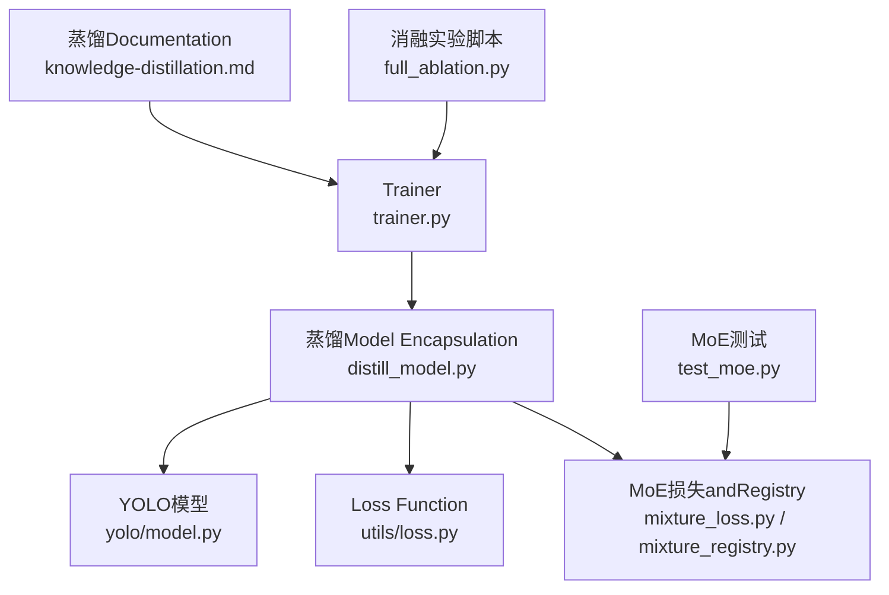
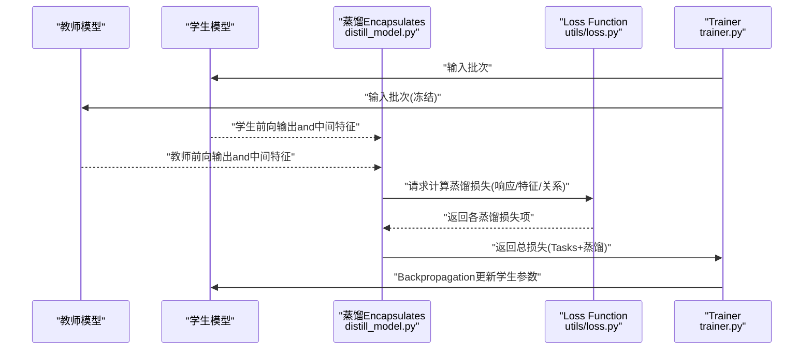
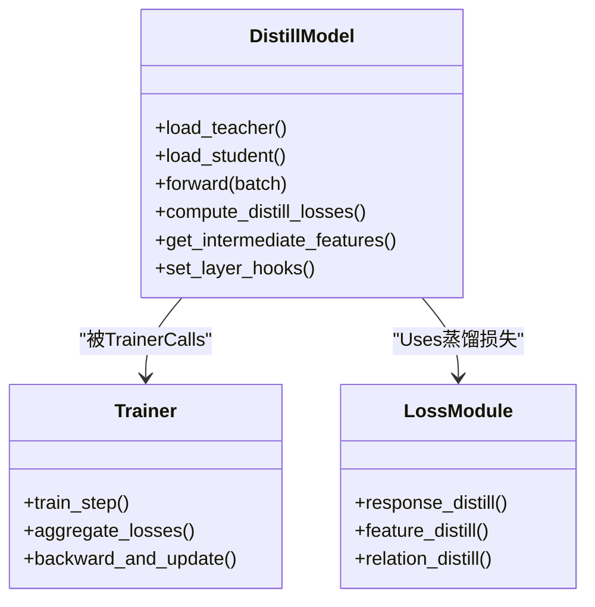
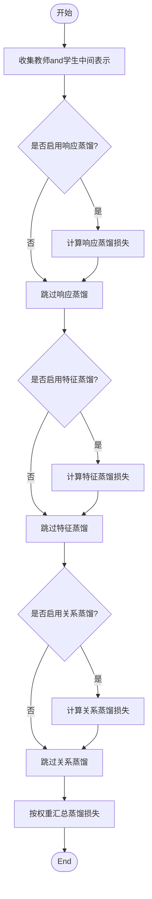
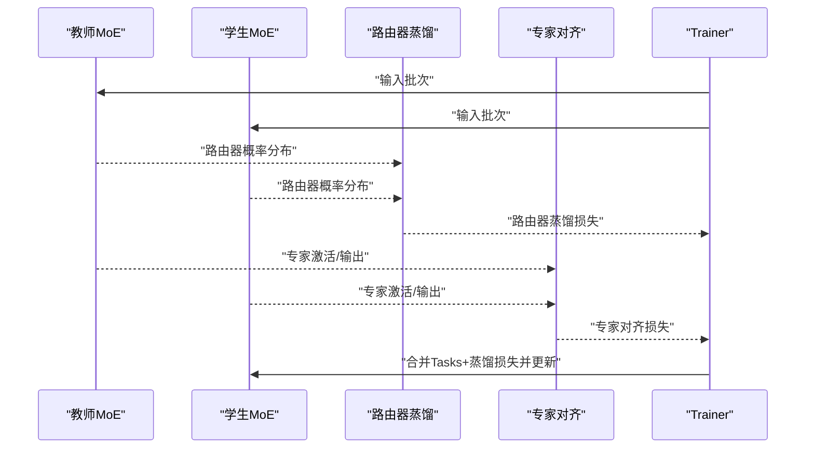
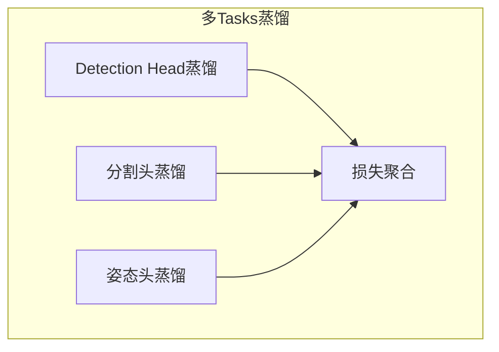
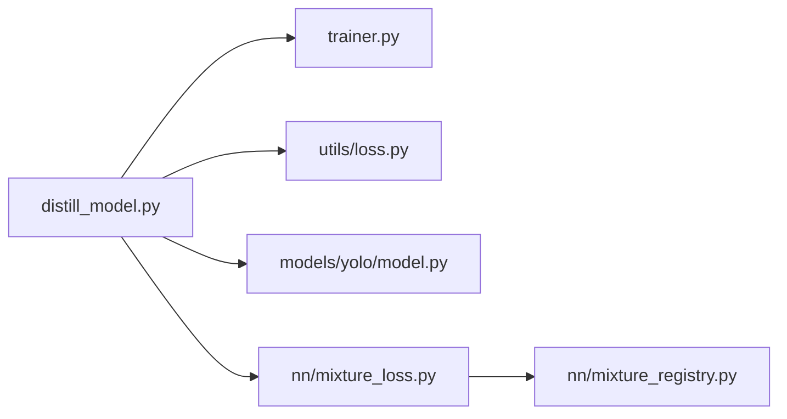

# Knowledge DistillationandModel Compression

<cite>
**Files Referenced in This Document**
- [ultralytics/nn/distill_model.py](file://ultralytics/nn/distill_model.py)
- [ultralytics/engine/trainer.py](file://ultralytics/engine/trainer.py)
- [ultralytics/utils/loss.py](file://ultralytics/utils/loss.py)
- [ultralytics/models/yolo/model.py](file://ultralytics/models/yolo/model.py)
- [docs/en/guides/knowledge-distillation.md](file://docs/en/guides/knowledge-distillation.md)
- [ultralytics/nn/mixture_loss.py](file://ultralytics/nn/mixture_loss.py)
- [ultralytics/nn/mixture_registry.py](file://ultralytics/nn/mixture_registry.py)
- [scripts/ablation_suite/full_ablation.py](file://scripts/ablation_suite/full_ablation.py)
- [tests/test_moe.py](file://tests/test_moe.py)
</cite>

## Table of Contents
1. [Introduction](#Introduction)
2. [Project Structure](#Project Structure)
3. [Core Components](#Core Components)
4. [Architecture Overview](#Architecture Overview)
5. [Detailed Component Analysis](#Detailed Component Analysis)
6. [Dependency Analysis](#Dependency Analysis)
7. [性能考量](#性能考量)
8. [Troubleshooting Guide](#Troubleshooting Guide)
9. [Conclusion](#Conclusion)
10. [Appendix](#Appendix)

## Introduction
本技术Documentation围绕YOLO-Master的Knowledge DistillationandModel Compression体系，系统阐述教师-学生Training架构、特征/响应/关系三类蒸馏策略、MoE（Mixture专家）中的知识Migrationand路由器蒸馏Optimization、多Tasks联合蒸馏（检测、分割、Pose Estimationetc.）、跨规模模型蒸馏配置Examples、Loss Function设计and超参数调优策略、EvaluationMetricsand对比分析方法，Centered onand自定义蒸馏算法开发and实验设计建议。DocumentationCentered on仓库现有implementingfor依据，Combining工程化实践给出可操作的指导。

## Project Structure
andKnowledge Distillation和Model Compression相关的核心代码主要分布whileCentered on下位置：
- 蒸馏Model Encapsulationand装配：ultralytics/nn/distill_model.py
- Training流程集成：ultralytics/engine/trainer.py
- Loss Functionand蒸馏损失：ultralytics/utils/loss.py
- YOLO模型入口and配置解析：ultralytics/models/yolo/model.py
- MoE相关损失andRegistry：ultralytics/nn/mixture_loss.py, ultralytics/nn/mixture_registry.py
- 蒸馏Documentation说明：docs/en/guides/knowledge-distillation.md
- 蒸馏消融and实验脚本：scripts/ablation_suite/full_ablation.py
- MoE测试用例：tests/test_moe.py

Figure Source
- [ultralytics/engine/trainer.py](file://ultralytics/engine/trainer.py)
- [ultralytics/nn/distill_model.py](file://ultralytics/nn/distill_model.py)
- [ultralytics/models/yolo/model.py](file://ultralytics/models/yolo/model.py)
- [ultralytics/utils/loss.py](file://ultralytics/utils/loss.py)
- [ultralytics/nn/mixture_loss.py](file://ultralytics/nn/mixture_loss.py)
- [ultralytics/nn/mixture_registry.py](file://ultralytics/nn/mixture_registry.py)
- [docs/en/guides/knowledge-distillation.md](file://docs/en/guides/knowledge-distillation.md)
- [scripts/ablation_suite/full_ablation.py](file://scripts/ablation_suite/full_ablation.py)
- [tests/test_moe.py](file://tests/test_moe.py)

Section Source
- [ultralytics/nn/distill_model.py](file://ultralytics/nn/distill_model.py)
- [ultralytics/engine/trainer.py](file://ultralytics/engine/trainer.py)
- [ultralytics/utils/loss.py](file://ultralytics/utils/loss.py)
- [ultralytics/models/yolo/model.py](file://ultralytics/models/yolo/model.py)
- [docs/en/guides/knowledge-distillation.md](file://docs/en/guides/knowledge-distillation.md)
- [ultralytics/nn/mixture_loss.py](file://ultralytics/nn/mixture_loss.py)
- [ultralytics/nn/mixture_registry.py](file://ultralytics/nn/mixture_registry.py)
- [scripts/ablation_suite/full_ablation.py](file://scripts/ablation_suite/full_ablation.py)
- [tests/test_moe.py](file://tests/test_moe.py)

## Core Components
- 蒸馏Model Encapsulation：负责将教师and学生模型组合，提取中间层特征、响应输出and关系信息，并计算蒸馏损失。
- Trainer集成：while标准Training循环中注入蒸馏前向、损失聚合andBackpropagation逻辑。
- Loss Function库：provides响应级、特征级and关系级蒸馏损失的implementingand权重调度。
- MoE蒸馏Supporting：whileMixture专家场景下对专家知识and路由器决策进行蒸馏Optimization。
- 多Tasks蒸馏：targeting检测、分割、Pose Estimationetc.多Tasks的统一蒸馏接口andTasks特定头对齐。
- 配置andDocumentation：Via配置文件andDocumentation指引完成不同规模模型的蒸馏设置and复现实验。

Section Source
- [ultralytics/nn/distill_model.py](file://ultralytics/nn/distill_model.py)
- [ultralytics/engine/trainer.py](file://ultralytics/engine/trainer.py)
- [ultralytics/utils/loss.py](file://ultralytics/utils/loss.py)
- [ultralytics/nn/mixture_loss.py](file://ultralytics/nn/mixture_loss.py)
- [ultralytics/nn/mixture_registry.py](file://ultralytics/nn/mixture_registry.py)
- [docs/en/guides/knowledge-distillation.md](file://docs/en/guides/knowledge-distillation.md)

## Architecture Overview
下图展示教师-学生蒸馏的整体数据流and控制流，包括前向传播、中间层对齐、损失聚合andGradient回传路径。

Figure Source
- [ultralytics/nn/distill_model.py](file://ultralytics/nn/distill_model.py)
- [ultralytics/utils/loss.py](file://ultralytics/utils/loss.py)
- [ultralytics/engine/trainer.py](file://ultralytics/engine/trainer.py)

## Detailed Component Analysis

### 蒸馏Model Encapsulation（教师-学生装配）
- 职责：加载教师and学生模型，建立中间层钩子或访问点，收集教师and学生对应层的特征and响应，Calls蒸馏损失Modules计算对齐误差。
- 关键流程：
  - 初始化阶段：根据配置选择需要蒸馏的层索引and通道映射策略。
  - 前向阶段：并行执行教师and学生前向，缓存必要中间表示。
  - 损失阶段：按策略组合响应蒸馏、特征蒸馏and关系蒸馏，并andTasks损失加权求和。
  - 控制流：由Trainerdrivers are installed，Supporting动态权重andLearning Rate调度。

Figure Source
- [ultralytics/nn/distill_model.py](file://ultralytics/nn/distill_model.py)
- [ultralytics/engine/trainer.py](file://ultralytics/engine/trainer.py)
- [ultralytics/utils/loss.py](file://ultralytics/utils/loss.py)

Section Source
- [ultralytics/nn/distill_model.py](file://ultralytics/nn/distill_model.py)
- [ultralytics/engine/trainer.py](file://ultralytics/engine/trainer.py)
- [ultralytics/utils/loss.py](file://ultralytics/utils/loss.py)

### 蒸馏策略：响应、特征and关系
- 响应蒸馏：对学生and教师的最终输出（such as分类概率、边界框回归量）进行软标签对齐，常用KL散度或MSE。
- 特征蒸馏：对中间层激活进行空间或通道维度的对齐，常采用归一化后的MSE或余弦相似度约束。
- 关系蒸馏：对特征图之间的相关性矩阵（such asGram矩阵）进行匹配，捕获高层语义关系。

Figure Source
- [ultralytics/utils/loss.py](file://ultralytics/utils/loss.py)
- [ultralytics/nn/distill_model.py](file://ultralytics/nn/distill_model.py)

Section Source
- [ultralytics/utils/loss.py](file://ultralytics/utils/loss.py)
- [ultralytics/nn/distill_model.py](file://ultralytics/nn/distill_model.py)

### MoE架构中的Knowledge Distillation
- 专家知识Migration：whileMoETraining中，教师模型的不同专家可provides领域特化的表征；学生可Via蒸馏学习路由器的软选择and专家输出的融合策略。
- 路由器蒸馏Optimization：对教师的路由器概率分布进行监督，使学生路由器学会相似的场景-专家分配模式，提升稀疏性and稳定性。
- 损失组成：除常规Tasks损失外，加入专家激活对齐and路由器分布对齐的辅助蒸馏项。

Figure Source
- [ultralytics/nn/mixture_loss.py](file://ultralytics/nn/mixture_loss.py)
- [ultralytics/nn/mixture_registry.py](file://ultralytics/nn/mixture_registry.py)
- [ultralytics/engine/trainer.py](file://ultralytics/engine/trainer.py)

Section Source
- [ultralytics/nn/mixture_loss.py](file://ultralytics/nn/mixture_loss.py)
- [ultralytics/nn/mixture_registry.py](file://ultralytics/nn/mixture_registry.py)
- [tests/test_moe.py](file://tests/test_moe.py)

### 多TasksKnowledge Distillation（检测、分割、Pose Estimation）
- Unified Interface：while多Tasks模型中，蒸馏Encapsulates对各Tasks头的输出and中间特征进行统一采集and对齐。
- Tasks特定对齐：针对不同Tasks头的尺度and语义差异，采用适配的归一化and损失形式（such as分割掩码的像素级对齐、姿态关键点的热图对齐）。
- 联合Training：while单轮Training中同时Optimization多个Tasks的蒸馏损失，并Via权重调度平衡Tasks贡献。

Section Source
- [ultralytics/nn/distill_model.py](file://ultralytics/nn/distill_model.py)
- [ultralytics/utils/loss.py](file://ultralytics/utils/loss.py)

### 跨规模模型蒸馏配置Examples
- 大型预Trainingto轻量部署：从大参数量教师模型蒸馏至小参数学生模型，重点while于特征通道降维and响应软标签的温度缩放。
- 同构and异构：同构模型可直接层对层对齐；异构模型需引入投影层或自适应池化进行维度匹配。
- 配置要点：指定蒸馏层索引、温度系数、损失权重and正则项；whileTrainer中启用蒸馏开关andLogging。

Section Source
- [docs/en/guides/knowledge-distillation.md](file://docs/en/guides/knowledge-distillation.md)
- [ultralytics/models/yolo/model.py](file://ultralytics/models/yolo/model.py)
- [ultralytics/engine/trainer.py](file://ultralytics/engine/trainer.py)

### Loss Function设计and超参数调优
- 损失设计：Tasks损失and蒸馏损失线性加权；蒸馏内部包含响应、特征、关系三项，可按Tasks特性调整比例。
- 超参数：温度系数、蒸馏权重、特征对齐正则强度、路由器蒸馏权重（MoE场景）。
- 调优策略：网格搜索或贝叶斯Optimization；监控Validation集MetricsandTraining稳定性（NaN/Gradient爆炸），逐步放宽蒸馏权重。

Section Source
- [ultralytics/utils/loss.py](file://ultralytics/utils/loss.py)
- [scripts/ablation_suite/full_ablation.py](file://scripts/ablation_suite/full_ablation.py)

### EvaluationMetricsand性能对比
- 精度Metrics：检测AP、分割mIoU、姿态mAPand other tasksMetrics；蒸馏前后对比。
- 效率Metrics：参数量、FLOPs、Inference时延、吞吐；Export后while不同后端（ONNX/TensorRT/OpenVINO）上评测。
- 报告生成：Via基准脚本andVisualization脚本汇总结果，形成对比表格and曲线。

Section Source
- [scripts/ablation_suite/full_ablation.py](file://scripts/ablation_suite/full_ablation.py)
- [docs/en/guides/knowledge-distillation.md](file://docs/en/guides/knowledge-distillation.md)

### 自定义蒸馏算法开发指南and实验设计
- 扩展点：while蒸馏Encapsulates中插入新的中间层采集逻辑；while损失Modules中添加新的蒸馏项；whileTrainer中注册新损失权重调度。
- 实验设计：基线蒸馏 vs 自定义蒸馏；A/B对比；消融研究（逐项移除响应/特征/关系）；跨数据集泛化性Validation。
- 复现and审计：固定随机种子、记录配置andLogging、保存中间统计（路由器分布、专家激活直方图）。

Section Source
- [ultralytics/nn/distill_model.py](file://ultralytics/nn/distill_model.py)
- [ultralytics/utils/loss.py](file://ultralytics/utils/loss.py)
- [ultralytics/engine/trainer.py](file://ultralytics/engine/trainer.py)

## Dependency Analysis
- 耦合and内聚：蒸馏Encapsulates集中管理教师-学生交互and损失计算，内聚性高；Trainer仅负责调度andOptimization，耦合清晰。
- External Dependencies：损失Modules依赖数值稳定工具；MoE蒸馏依赖Mixture损失andRegistry；YOLO模型provides统一的中间层访问接口。
- Potential Cycles：避免蒸馏Encapsulates直接依赖Trainer内部状态，Via接口回调传递损失andLogging。

Figure Source
- [ultralytics/nn/distill_model.py](file://ultralytics/nn/distill_model.py)
- [ultralytics/engine/trainer.py](file://ultralytics/engine/trainer.py)
- [ultralytics/utils/loss.py](file://ultralytics/utils/loss.py)
- [ultralytics/models/yolo/model.py](file://ultralytics/models/yolo/model.py)
- [ultralytics/nn/mixture_loss.py](file://ultralytics/nn/mixture_loss.py)
- [ultralytics/nn/mixture_registry.py](file://ultralytics/nn/mixture_registry.py)

Section Source
- [ultralytics/nn/distill_model.py](file://ultralytics/nn/distill_model.py)
- [ultralytics/engine/trainer.py](file://ultralytics/engine/trainer.py)
- [ultralytics/utils/loss.py](file://ultralytics/utils/loss.py)
- [ultralytics/models/yolo/model.py](file://ultralytics/models/yolo/model.py)
- [ultralytics/nn/mixture_loss.py](file://ultralytics/nn/mixture_loss.py)
- [ultralytics/nn/mixture_registry.py](file://ultralytics/nn/mixture_registry.py)

## 性能考量
- 内存占用：教师模型通常冻结，但仍需保留中间特征缓存；合理选择蒸馏层数量and通道维度Centered on降低显存压力。
- 计算开销：蒸馏损失多for逐元素或矩阵运算，注意批量大小and设备利用率；必要时采用异步或分块计算。
- Exportand部署：蒸馏后模型应Exporting to轻量化格式并进行端to端延迟测试；关注算子兼容性and量化友好性。

## Troubleshooting Guide
- NaNandGradient异常：检查蒸馏损失数值范围and温度系数；确认特征归一化and正则项强度。
- 路由器不稳定（MoE）：观察路由器熵and专家Uses分布；适当增加路由器蒸馏权重或引入Load BalancingAuxiliary Loss。
- 多Tasks不平衡：调整Tasks损失and蒸馏损失的权重比例；针对困难Tasks增强Data Augmentationand采样策略。
- 复现问题：固定随机种子、记录完整配置andLogging；Uses消融脚本逐项Validation改动影响。

Section Source
- [ultralytics/utils/loss.py](file://ultralytics/utils/loss.py)
- [ultralytics/nn/mixture_loss.py](file://ultralytics/nn/mixture_loss.py)
- [scripts/ablation_suite/full_ablation.py](file://scripts/ablation_suite/full_ablation.py)

## Conclusion
YOLO-Master的Knowledge DistillationandModel Compression体系provides了完整的教师-学生Training框架，覆盖响应、特征and关系三类蒸馏策略，并whileMoEand多Tasks场景中具备可Extensibility。Via合理的损失设计and超参数调优，可While maintaining精度显著降低模型规模andInference成本。建议while实际工程中Combining基准Evaluationand消融实验，持续迭代蒸馏策略and部署流程。

## Appendix
- 快速上手：Refer to蒸馏DocumentationandExamples脚本，完成基础蒸馏TrainingandExport。
- 高级定制：基于蒸馏Encapsulatesand损失Modules扩展自定义蒸馏项，Combined withTrainer调度implementing复杂实验。
- 资源链接：Documentationand脚本路径已while“Files Referenced in This Document”中列出，便于定位and复现。