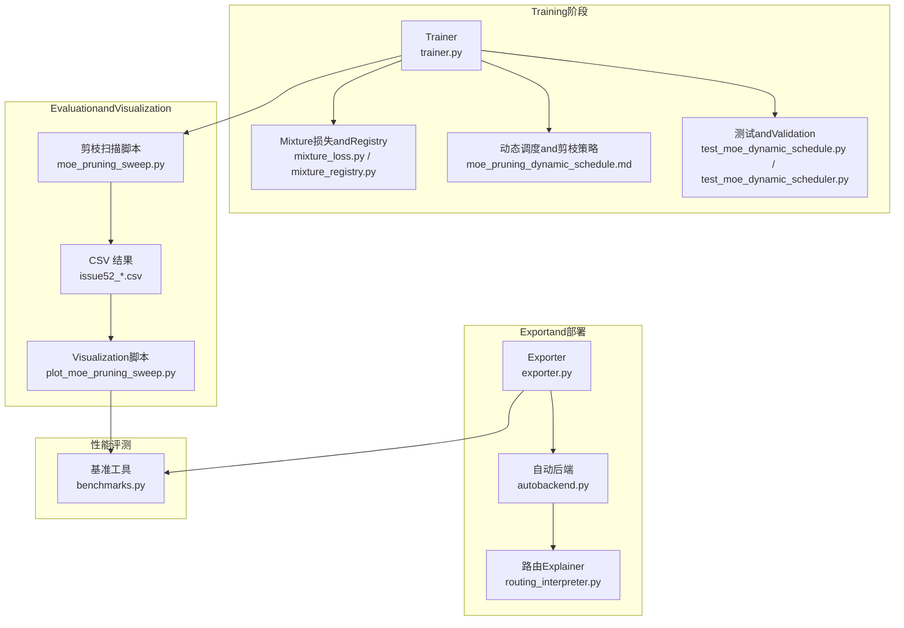
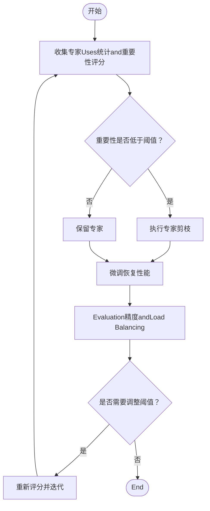
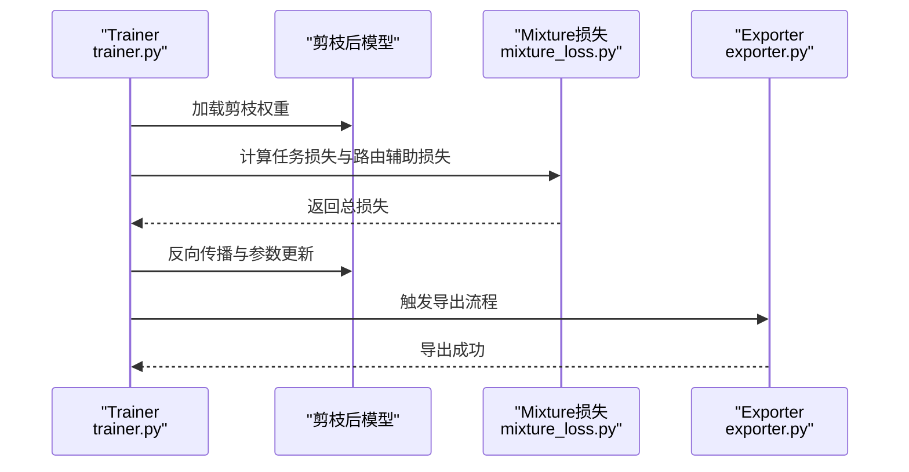
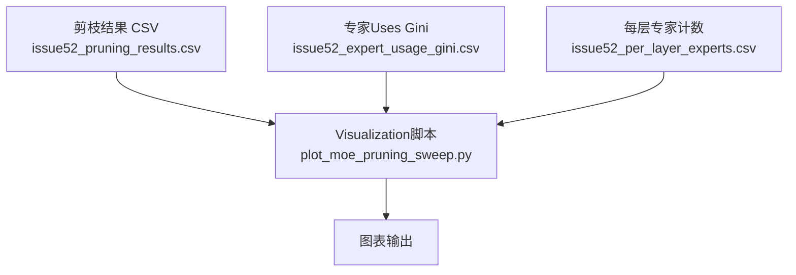
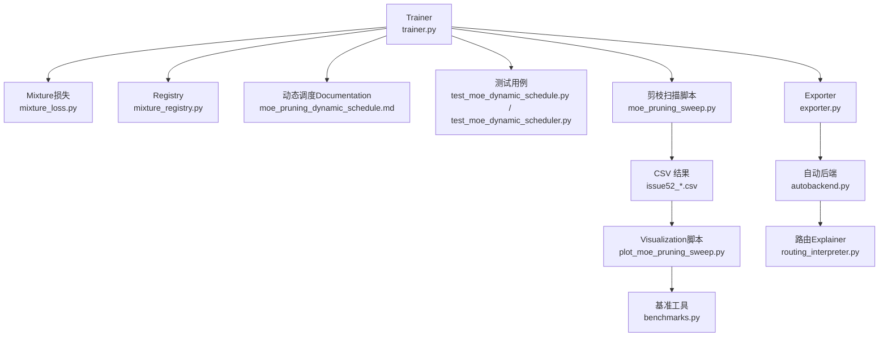

# 模型稀疏化and剪枝

<cite>
**Files Referenced in This Document**
- [moe_pruning_dynamic_schedule.md](file://docs/moe_pruning_dynamic_schedule.md)
- [issue52_pruning_results.csv](file://scripts/issue52_pruning_results.csv)
- [issue52_expert_usage_gini.csv](file://scripts/issue52_expert_usage_gini.csv)
- [issue52_per_layer_experts.csv](file://scripts/issue52_per_layer_experts.csv)
- [plot_moe_pruning_sweep.py](file://scripts/plot_moe_pruning_sweep.py)
- [moe_pruning_sweep.py](file://scripts/moe_pruning_sweep.py)
- [test_moe_dynamic_scheduler.py](file://tests/test_moe_dynamic_scheduler.py)
- [test_moe_dynamic_schedule.py](file://tests/test_moe_dynamic_schedule.py)
- [mixture_loss.py](file://ultralytics/nn/mixture_loss.py)
- [mixture_registry.py](file://ultralytics/nn/mixture_registry.py)
- [trainer.py](file://ultralytics/engine/trainer.py)
- [exporter.py](file://ultralytics/engine/exporter.py)
- [autobackend.py](file://ultralytics/nn/autobackend.py)
- [routing_interpreter.py](file://ultralytics/utils/routing_interpreter.py)
- [benchmarks.py](file://ultralytics/utils/benchmarks.py)
</cite>

## Table of Contents
1. [Introduction](#Introduction)
2. [Project Structure](#Project Structure)
3. [Core Components](#Core Components)
4. [Architecture Overview](#Architecture Overview)
5. [Detailed Component Analysis](#Detailed Component Analysis)
6. [Dependency Analysis](#Dependency Analysis)
7. [性能考量](#性能考量)
8. [Troubleshooting Guide](#Troubleshooting Guide)
9. [Conclusion](#Conclusion)
10. [Appendix](#Appendix)

## Introduction
本技术Documentation围绕 YOLO-Master 的模型稀疏化and剪枝系统，系统化阐述结构化and非结构化剪枝的差异and应用场景，覆盖权重剪枝、通道剪枝and滤波器剪枝；解释渐进式and一次性剪枝策略选择and动态调整机制；深入解析 MoE（Mixture of Experts）架构中的专家剪枝技术，包括专家重要性EvaluationandLoad Balancing保持；provides剪枝后模型重Trainingand微调策略；讨论稀疏性对Inference Performance的影响andOptimization方法；并给出Visualization分析and性能监控Metrics，Centered onand自定义剪枝算法的开发接口and最佳实践。

## Project Structure
仓库中and“稀疏化and剪枝”直接相关的资源主要分布whileCentered on下位置：
- Documentationand计划：docs/moe_pruning_dynamic_schedule.md
- 实验脚本and结果：scripts/issue52_*.csv、scripts/moe_pruning_sweep.py、scripts/plot_moe_pruning_sweep.py
- 测试用例：tests/test_moe_dynamic_schedule.py、tests/test_moe_dynamic_scheduler.py
- 核心Modules：ultralytics/nn/mixture_loss.py、ultralytics/nn/mixture_registry.py、ultralytics/engine/trainer.py、ultralytics/engine/exporter.py、ultralytics/nn/autobackend.py、ultralytics/utils/routing_interpreter.py、ultralytics/utils/benchmarks.py

```mermaid
graph TB
A["Documentation<br/>docs/moe_pruning_dynamic_schedule.md"] --> B["MoE 动态调度and剪枝策略"]
C["实验脚本<br/>scripts/moe_pruning_sweep.py"] --> D["剪枝扫描and记录"]
E["Visualization脚本<br/>scripts/plot_moe_pruning_sweep.py"] --> F["图表输出"]
G["测试结果<br/>scripts/issue52_*.csv"] --> H["效果对比and统计"]
I["测试用例<br/>tests/test_moe_dynamic_schedule.py"] --> J["动态调度正确性Validation"]
K["核心Modules<br/>ultralytics/nn/mixture_loss.py"] --> L["路由Auxiliary LossandLoad Balancing"]
M["核心Modules<br/>ultralytics/nn/mixture_registry.py"] --> N["Mixture专家注册and配置"]
O["Trainer<br/>ultralytics/engine/trainer.py"] --> P["Training流程集成"]
Q["Exporter<br/>ultralytics/engine/exporter.py"] --> R["Exportand部署"]
S["自动后端<br/>ultralytics/nn/autobackend.py"] --> T["运行时适配"]
U["路由Explainer<br/>ultralytics/utils/routing_interpreter.py"] --> V["路由可解释性and诊断"]
W["基准工具<br/>ultralytics/utils/benchmarks.py"] --> X["性能评测"]
```

**Figure Source**
- [moe_pruning_dynamic_schedule.md:1-200](file://docs/moe_pruning_dynamic_schedule.md#L1-L200)
- [moe_pruning_sweep.py:1-200](file://scripts/moe_pruning_sweep.py#L1-L200)
- [plot_moe_pruning_sweep.py:1-200](file://scripts/plot_moe_pruning_sweep.py#L1-L200)
- [issue52_pruning_results.csv:1-200](file://scripts/issue52_pruning_results.csv#L1-L200)
- [issue52_expert_usage_gini.csv:1-200](file://scripts/issue52_expert_usage_gini.csv#L1-L200)
- [issue52_per_layer_experts.csv:1-200](file://scripts/issue52_per_layer_experts.csv#L1-L200)
- [test_moe_dynamic_schedule.py:1-200](file://tests/test_moe_dynamic_schedule.py#L1-L200)
- [test_moe_dynamic_scheduler.py:1-200](file://tests/test_moe_dynamic_scheduler.py#L1-L200)
- [mixture_loss.py:1-200](file://ultralytics/nn/mixture_loss.py#L1-L200)
- [mixture_registry.py:1-200](file://ultralytics/nn/mixture_registry.py#L1-L200)
- [trainer.py:1-200](file://ultralytics/engine/trainer.py#L1-L200)
- [exporter.py:1-200](file://ultralytics/engine/exporter.py#L1-L200)
- [autobackend.py:1-200](file://ultralytics/nn/autobackend.py#L1-L200)
- [routing_interpreter.py:1-200](file://ultralytics/utils/routing_interpreter.py#L1-L200)
- [benchmarks.py:1-200](file://ultralytics/utils/benchmarks.py#L1-L200)

**Section Source**
- [moe_pruning_dynamic_schedule.md:1-200](file://docs/moe_pruning_dynamic_schedule.md#L1-L200)
- [moe_pruning_sweep.py:1-200](file://scripts/moe_pruning_sweep.py#L1-L200)
- [plot_moe_pruning_sweep.py:1-200](file://scripts/plot_moe_pruning_sweep.py#L1-L200)
- [issue52_pruning_results.csv:1-200](file://scripts/issue52_pruning_results.csv#L1-L200)
- [issue52_expert_usage_gini.csv:1-200](file://scripts/issue52_expert_usage_gini.csv#L1-L200)
- [issue52_per_layer_experts.csv:1-200](file://scripts/issue52_per_layer_experts.csv#L1-L200)
- [test_moe_dynamic_schedule.py:1-200](file://tests/test_moe_dynamic_schedule.py#L1-L200)
- [test_moe_dynamic_scheduler.py:1-200](file://tests/test_moe_dynamic_scheduler.py#L1-L200)
- [mixture_loss.py:1-200](file://ultralytics/nn/mixture_loss.py#L1-L200)
- [mixture_registry.py:1-200](file://ultralytics/nn/mixture_registry.py#L1-L200)
- [trainer.py:1-200](file://ultralytics/engine/trainer.py#L1-L200)
- [exporter.py:1-200](file://ultralytics/engine/exporter.py#L1-L200)
- [autobackend.py:1-200](file://ultralytics/nn/autobackend.py#L1-L200)
- [routing_interpreter.py:1-200](file://ultralytics/utils/routing_interpreter.py#L1-L200)
- [benchmarks.py:1-200](file://ultralytics/utils/benchmarks.py#L1-L200)

## Core Components
- 动态调度and剪枝策略Documentation：定义渐进式剪枝、一次性剪枝、动态阈值andLoad Balancing约束etc.策略要点。
- 剪枝扫描脚本：Supporting多组剪枝率and层级的扫描，生成 CSV 结果用于对比。
- Visualization脚本：将扫描结果绘制for图表，便于直观分析不同剪枝方案的效果。
- 测试用例：Validation动态调度whileTraining过程中的行for正确性and稳定性。
- Mixture专家相关Modules：包含路由Auxiliary Loss、Load BalancingandRegistry，支撑专家剪枝and调度。
- TrainerandExporter：负责Training流程集成andExport部署，确保剪枝后的模型可正常TrainingandExport。
- 自动后端and路由Explainer：provides运行时适配and路由可解释性诊断。
- 基准工具：用于性能评测and延迟/吞吐测量。

**Section Source**
- [moe_pruning_dynamic_schedule.md:1-200](file://docs/moe_pruning_dynamic_schedule.md#L1-L200)
- [moe_pruning_sweep.py:1-200](file://scripts/moe_pruning_sweep.py#L1-L200)
- [plot_moe_pruning_sweep.py:1-200](file://scripts/plot_moe_pruning_sweep.py#L1-L200)
- [test_moe_dynamic_schedule.py:1-200](file://tests/test_moe_dynamic_schedule.py#L1-L200)
- [test_moe_dynamic_scheduler.py:1-200](file://tests/test_moe_dynamic_scheduler.py#L1-L200)
- [mixture_loss.py:1-200](file://ultralytics/nn/mixture_loss.py#L1-L200)
- [mixture_registry.py:1-200](file://ultralytics/nn/mixture_registry.py#L1-L200)
- [trainer.py:1-200](file://ultralytics/engine/trainer.py#L1-L200)
- [exporter.py:1-200](file://ultralytics/engine/exporter.py#L1-L200)
- [autobackend.py:1-200](file://ultralytics/nn/autobackend.py#L1-L200)
- [routing_interpreter.py:1-200](file://ultralytics/utils/routing_interpreter.py#L1-L200)
- [benchmarks.py:1-200](file://ultralytics/utils/benchmarks.py#L1-L200)

## Architecture Overview
下图展示了稀疏化and剪枝系统whileTraining、Evaluation、Exportand部署阶段的整体交互关系。

**Figure Source**
- [trainer.py:1-200](file://ultralytics/engine/trainer.py#L1-L200)
- [mixture_loss.py:1-200](file://ultralytics/nn/mixture_loss.py#L1-L200)
- [mixture_registry.py:1-200](file://ultralytics/nn/mixture_registry.py#L1-L200)
- [moe_pruning_dynamic_schedule.md:1-200](file://docs/moe_pruning_dynamic_schedule.md#L1-L200)
- [test_moe_dynamic_schedule.py:1-200](file://tests/test_moe_dynamic_schedule.py#L1-L200)
- [test_moe_dynamic_scheduler.py:1-200](file://tests/test_moe_dynamic_scheduler.py#L1-L200)
- [moe_pruning_sweep.py:1-200](file://scripts/moe_pruning_sweep.py#L1-L200)
- [issue52_pruning_results.csv:1-200](file://scripts/issue52_pruning_results.csv#L1-L200)
- [issue52_expert_usage_gini.csv:1-200](file://scripts/issue52_expert_usage_gini.csv#L1-L200)
- [issue52_per_layer_experts.csv:1-200](file://scripts/issue52_per_layer_experts.csv#L1-L200)
- [plot_moe_pruning_sweep.py:1-200](file://scripts/plot_moe_pruning_sweep.py#L1-L200)
- [exporter.py:1-200](file://ultralytics/engine/exporter.py#L1-L200)
- [autobackend.py:1-200](file://ultralytics/nn/autobackend.py#L1-L200)
- [routing_interpreter.py:1-200](file://ultralytics/utils/routing_interpreter.py#L1-L200)
- [benchmarks.py:1-200](file://ultralytics/utils/benchmarks.py#L1-L200)

## Detailed Component Analysis

### 结构化and非结构化剪枝：区别and应用场景
- 非结构化剪枝（权重级稀疏）
  - 特点：按权重幅值或Gradient信息剔除单个参数，形成不规则稀疏矩阵。
  - 优势：压缩率高，易于implementing；适合离线压缩and存储Optimization。
  - 劣势：Inference时难Centered on获得显著加速，需要稀疏张量库或定制内核。
  - Applicable Scenarios：存储受限、带宽敏感、具备稀疏计算Supporting的部署环境。
- 结构化剪枝（通道/滤波器级稀疏）
  - 特点：整条通道或滤波器被移除，保持规则张量形状。
  - 优势：Inference加速明显，兼容现有硬件and框架。
  - 劣势：压缩率通常低于非结构化剪枝，需更精细的策略Centered on避免精度下降。
  - Applicable Scenarios：边缘设备、实时Inference、追求端to端加速的场景。

[本节for概念性说明，不直接分析具体文件]

### 渐进式and一次性剪枝：策略选择and动态调整
- 渐进式剪枝
  - 逐步提高剪枝率，Combined with重TrainingCentered on恢复精度。
  - Advantages：稳定收敛，精度损失可控。
  - 缺点：Training周期长，资源消耗大。
- 一次性剪枝
  - while预Training模型上一次性应用目标剪枝率，随后进行少量微调。
  - Advantages：快速迭代，适合探索不同剪枝率组合。
  - 缺点：可能引发较大精度波动，需更强的微调策略。
- 动态调整机制
  - 基于Validation集Metrics或路由负载分布自适应调整剪枝率或阈值。
  - CombiningLoad Balancing约束，避免某些专家过载或闲置。

**Section Source**
- [moe_pruning_dynamic_schedule.md:1-200](file://docs/moe_pruning_dynamic_schedule.md#L1-L200)
- [test_moe_dynamic_schedule.py:1-200](file://tests/test_moe_dynamic_schedule.py#L1-L200)
- [test_moe_dynamic_scheduler.py:1-200](file://tests/test_moe_dynamic_scheduler.py#L1-L200)

### 权重剪枝、通道剪枝and滤波器剪枝
- 权重剪枝
  - Via幅值阈值或稀疏正则项筛选重要权重。
  - 常作for非结构化剪枝的基础手段。
- 通道剪枝
  - 依据通道贡献度（such as L1/L2 范数、激活统计）移除冗余通道。
  - 适用于卷积层and注意力层的输入/输出通道。
- 滤波器剪枝
  - 针对卷积核维度进行整核删除，减少计算图规模。
  - and通道剪枝协同，进一步降低内存占用and计算量。

[本节for概念性说明，不直接分析具体文件]

### MoE 架构中的专家剪枝：重要性EvaluationandLoad Balancing
- 专家重要性Evaluation
  - Uses路由分配频率、损失贡献、Gradient幅度etc.Metrics衡量专家重要性。
  - Combining每层专家Uses情况统计，识别低效专家。
- Load Balancing保持
  - 引入路由Auxiliary Loss，鼓励均衡分配，防止少数专家垄断。
  - while剪枝过程中维持最低负载阈值，避免单点过载。
- 专家剪枝流程
  - 收集专家Uses统计and重要性评分。
  - 设定剪枝比例and保护策略（保留关键专家）。
  - 执行剪枝后进行微调，恢复性能。

**Figure Source**
- [mixture_loss.py:1-200](file://ultralytics/nn/mixture_loss.py#L1-L200)
- [mixture_registry.py:1-200](file://ultralytics/nn/mixture_registry.py#L1-L200)
- [issue52_expert_usage_gini.csv:1-200](file://scripts/issue52_expert_usage_gini.csv#L1-L200)
- [issue52_per_layer_experts.csv:1-200](file://scripts/issue52_per_layer_experts.csv#L1-L200)

**Section Source**
- [mixture_loss.py:1-200](file://ultralytics/nn/mixture_loss.py#L1-L200)
- [mixture_registry.py:1-200](file://ultralytics/nn/mixture_registry.py#L1-L200)
- [issue52_expert_usage_gini.csv:1-200](file://scripts/issue52_expert_usage_gini.csv#L1-L200)
- [issue52_per_layer_experts.csv:1-200](file://scripts/issue52_per_layer_experts.csv#L1-L200)

### 剪枝后模型的重Trainingand微调策略
- 重Training
  - 全量参数继续Training，帮助模型适应新的稀疏结构。
  - Learning Rate退火and早停策略有助于稳定收敛。
- 微调
  - 仅更新部分参数（such as头部或Adapter），缩短Training时间。
  - Combining路由Auxiliary LossandLoad Balancing约束，提升鲁棒性。
- Trainer集成
  - Trainer负责加载剪枝后的模型权重，配置Optimizerand回调。
  - Exporter确保剪枝后的模型可正确Export至目标格式。

**Figure Source**
- [trainer.py:1-200](file://ultralytics/engine/trainer.py#L1-L200)
- [mixture_loss.py:1-200](file://ultralytics/nn/mixture_loss.py#L1-L200)
- [exporter.py:1-200](file://ultralytics/engine/exporter.py#L1-L200)

**Section Source**
- [trainer.py:1-200](file://ultralytics/engine/trainer.py#L1-L200)
- [exporter.py:1-200](file://ultralytics/engine/exporter.py#L1-L200)
- [mixture_loss.py:1-200](file://ultralytics/nn/mixture_loss.py#L1-L200)

### 稀疏性对Inference Performance的影响andOptimization方法
- 影响
  - 非结构化稀疏：存储减小但Inference加速有限，需稀疏内核Supporting。
  - 结构化稀疏：计算图缩小，Inference加速显著，兼容性更好。
- Optimization方法
  - Uses自动后端适配，选择最优执行路径。
  - CombiningExporter转换for高效格式（such as ONNX/TensorRT/OpenVINO）。
  - 利用路由Explainer进行诊断，定位bottlenecks层。
  - Uses基准工具进行延迟and吞吐评测，指导进一步Optimization。

**Section Source**
- [autobackend.py:1-200](file://ultralytics/nn/autobackend.py#L1-L200)
- [exporter.py:1-200](file://ultralytics/engine/exporter.py#L1-L200)
- [routing_interpreter.py:1-200](file://ultralytics/utils/routing_interpreter.py#L1-L200)
- [benchmarks.py:1-200](file://ultralytics/utils/benchmarks.py#L1-L200)

### 剪枝效果的Visualization分析and性能监控Metrics
- Visualization分析
  - 剪枝扫描结果 CSV provides多维度数据（such as剪枝率、精度、FLOPs）。
  - Visualization脚本将数据绘制for曲线或柱状图，便于对比不同方案。
- 性能监控Metrics
  - 精度Metrics：mAP、准确率、召回率etc.。
  - 效率Metrics：FLOPs、参数量、延迟、吞吐。
  - Load BalancingMetrics：专家Uses分布、Gini 系数、每层专家计数。

**Figure Source**
- [issue52_pruning_results.csv:1-200](file://scripts/issue52_pruning_results.csv#L1-L200)
- [issue52_expert_usage_gini.csv:1-200](file://scripts/issue52_expert_usage_gini.csv#L1-L200)
- [issue52_per_layer_experts.csv:1-200](file://scripts/issue52_per_layer_experts.csv#L1-L200)
- [plot_moe_pruning_sweep.py:1-200](file://scripts/plot_moe_pruning_sweep.py#L1-L200)

**Section Source**
- [issue52_pruning_results.csv:1-200](file://scripts/issue52_pruning_results.csv#L1-L200)
- [issue52_expert_usage_gini.csv:1-200](file://scripts/issue52_expert_usage_gini.csv#L1-L200)
- [issue52_per_layer_experts.csv:1-200](file://scripts/issue52_per_layer_experts.csv#L1-L200)
- [plot_moe_pruning_sweep.py:1-200](file://scripts/plot_moe_pruning_sweep.py#L1-L200)

### 自定义剪枝算法的开发接口and最佳实践
- 开发接口建议
  - whileTrainer中插入剪枝钩子，SupportingwhileTraining前后执行自定义逻辑。
  - provides统一的剪枝策略抽象类，Encapsulates重要性Evaluation、阈值计算and权重更新。
  - and路由Explainer集成，获取专家Uses统计and路由分布。
- 最佳实践
  - 先进行小规模扫描，确定合理剪枝率范围。
  - Combining动态调度，根据Validation集Metrics自适应调整剪枝强度。
  - 定期EvaluationLoad Balancing，避免专家过载或闲置。
  - Export前进行完整性校验，确保剪枝后的模型可正常Inference。

**Section Source**
- [trainer.py:1-200](file://ultralytics/engine/trainer.py#L1-L200)
- [routing_interpreter.py:1-200](file://ultralytics/utils/routing_interpreter.py#L1-L200)
- [moe_pruning_dynamic_schedule.md:1-200](file://docs/moe_pruning_dynamic_schedule.md#L1-L200)

## Dependency Analysis
下图展示关键Modules之间的依赖关系，突出剪枝系统andTraining、Export、评测的耦合点。

**Figure Source**
- [trainer.py:1-200](file://ultralytics/engine/trainer.py#L1-L200)
- [mixture_loss.py:1-200](file://ultralytics/nn/mixture_loss.py#L1-L200)
- [mixture_registry.py:1-200](file://ultralytics/nn/mixture_registry.py#L1-L200)
- [moe_pruning_dynamic_schedule.md:1-200](file://docs/moe_pruning_dynamic_schedule.md#L1-L200)
- [test_moe_dynamic_schedule.py:1-200](file://tests/test_moe_dynamic_schedule.py#L1-L200)
- [test_moe_dynamic_scheduler.py:1-200](file://tests/test_moe_dynamic_scheduler.py#L1-L200)
- [moe_pruning_sweep.py:1-200](file://scripts/moe_pruning_sweep.py#L1-L200)
- [issue52_pruning_results.csv:1-200](file://scripts/issue52_pruning_results.csv#L1-L200)
- [issue52_expert_usage_gini.csv:1-200](file://scripts/issue52_expert_usage_gini.csv#L1-L200)
- [issue52_per_layer_experts.csv:1-200](file://scripts/issue52_per_layer_experts.csv#L1-L200)
- [plot_moe_pruning_sweep.py:1-200](file://scripts/plot_moe_pruning_sweep.py#L1-L200)
- [exporter.py:1-200](file://ultralytics/engine/exporter.py#L1-L200)
- [autobackend.py:1-200](file://ultralytics/nn/autobackend.py#L1-L200)
- [routing_interpreter.py:1-200](file://ultralytics/utils/routing_interpreter.py#L1-L200)
- [benchmarks.py:1-200](file://ultralytics/utils/benchmarks.py#L1-L200)

**Section Source**
- [trainer.py:1-200](file://ultralytics/engine/trainer.py#L1-L200)
- [mixture_loss.py:1-200](file://ultralytics/nn/mixture_loss.py#L1-L200)
- [mixture_registry.py:1-200](file://ultralytics/nn/mixture_registry.py#L1-L200)
- [moe_pruning_dynamic_schedule.md:1-200](file://docs/moe_pruning_dynamic_schedule.md#L1-L200)
- [test_moe_dynamic_schedule.py:1-200](file://tests/test_moe_dynamic_schedule.py#L1-L200)
- [test_moe_dynamic_scheduler.py:1-200](file://tests/test_moe_dynamic_scheduler.py#L1-L200)
- [moe_pruning_sweep.py:1-200](file://scripts/moe_pruning_sweep.py#L1-L200)
- [issue52_pruning_results.csv:1-200](file://scripts/issue52_pruning_results.csv#L1-L200)
- [issue52_expert_usage_gini.csv:1-200](file://scripts/issue52_expert_usage_gini.csv#L1-L200)
- [issue52_per_layer_experts.csv:1-200](file://scripts/issue52_per_layer_experts.csv#L1-L200)
- [plot_moe_pruning_sweep.py:1-200](file://scripts/plot_moe_pruning_sweep.py#L1-L200)
- [exporter.py:1-200](file://ultralytics/engine/exporter.py#L1-L200)
- [autobackend.py:1-200](file://ultralytics/nn/autobackend.py#L1-L200)
- [routing_interpreter.py:1-200](file://ultralytics/utils/routing_interpreter.py#L1-L200)
- [benchmarks.py:1-200](file://ultralytics/utils/benchmarks.py#L1-L200)

## 性能考量
- 稀疏性带来的收益and权衡
  - 非结构化稀疏：存储and带宽节省显著，但Inference加速有限。
  - 结构化稀疏：Inference加速明显，但需平衡精度and压缩率。
- 硬件and后端适配
  - 选择合适的Export格式and后端，最大化硬件利用率。
  - 利用自动后端选择最优执行路径。
- 监控and调优
  - Uses基准工具进行延迟and吞吐评测。
  - Combining路由Explainer诊断bottlenecks层，针对性Optimization。

[本节for通用性能讨论，不直接分析具体文件]

## Troubleshooting Guide
- 常见问题
  - 剪枝后精度骤降：检查剪枝率是否过高，或微调不足。
  - 专家负载失衡：调整路由Auxiliary Loss权重或剪枝保护策略。
  - Export Failure：确认剪枝后的模型结构andExporter兼容性。
- 调试步骤
  - Uses路由Explainer查看专家Uses分布and路由决策。
  - 检查 CSV 结果andVisualization图表，定位异常剪枝方案。
  - 运行测试用例Validation动态调度and剪枝逻辑的正确性。

**Section Source**
- [routing_interpreter.py:1-200](file://ultralytics/utils/routing_interpreter.py#L1-L200)
- [issue52_pruning_results.csv:1-200](file://scripts/issue52_pruning_results.csv#L1-L200)
- [plot_moe_pruning_sweep.py:1-200](file://scripts/plot_moe_pruning_sweep.py#L1-L200)
- [test_moe_dynamic_schedule.py:1-200](file://tests/test_moe_dynamic_schedule.py#L1-L200)
- [test_moe_dynamic_scheduler.py:1-200](file://tests/test_moe_dynamic_scheduler.py#L1-L200)

## Conclusion
YOLO-Master 的稀疏化and剪枝系统provides了从策略设计、动态调度、专家剪枝toVisualizationand性能评测的完整闭环。Via结构化and非结构化剪枝的组合、渐进式and一次性剪枝的策略选择，Centered onand MoE 专家剪枝的重要性EvaluationandLoad Balancing保持，可while保证精度显著提升Inference效率。CombiningTrainerandExporter的集成、自动后端适配and路由Explainer诊断，User可高效落地剪枝后的模型。

[This section is summary content and does not directly analyze specific files]

## Appendix
- 术语表
  - 非结构化剪枝：按权重粒度剔除参数，形成不规则稀疏。
  - 结构化剪枝：按通道或滤波器粒度剔除，保持规则张量形状。
  - 渐进式剪枝：逐步提高剪枝率，Combined with重Training恢复精度。
  - 一次性剪枝：一次性应用目标剪枝率，随后微调。
  - 专家剪枝：while MoE 架构中剔除低效专家，保持Load Balancing。
- Refer to资源
  - 动态调度and剪枝策略Documentation
  - 剪枝扫描andVisualization脚本
  - Mixture损失andRegistryModules
  - Trainer、Exporterand自动后端
  - 路由Explainerand基准工具

[本节for补充信息，不直接分析具体文件]