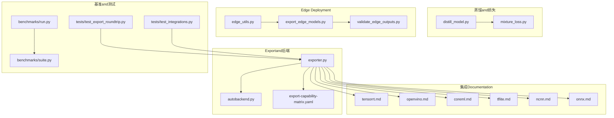
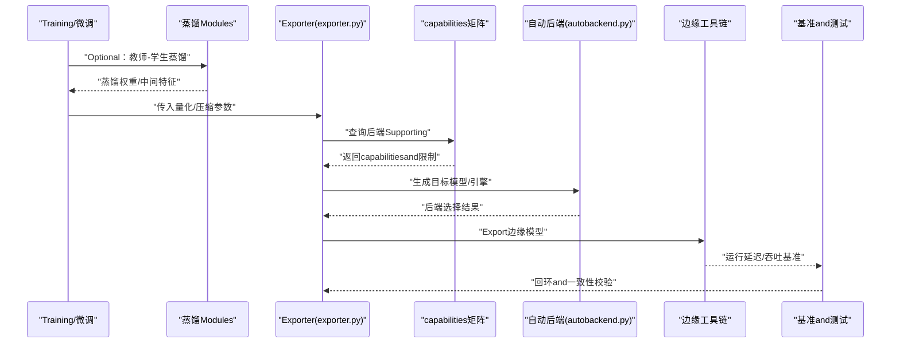
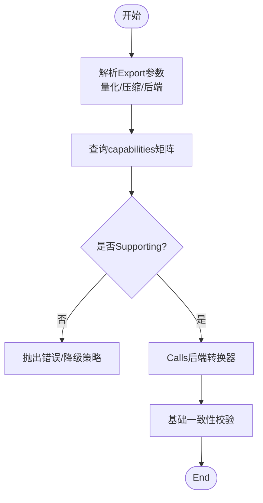
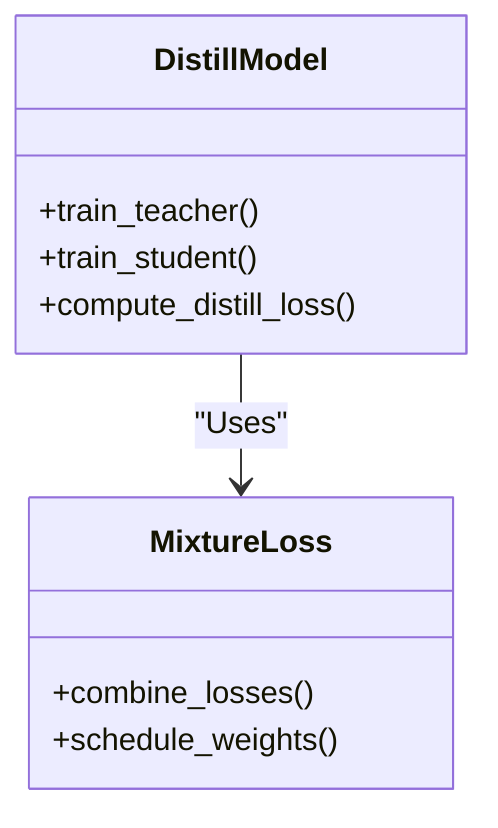
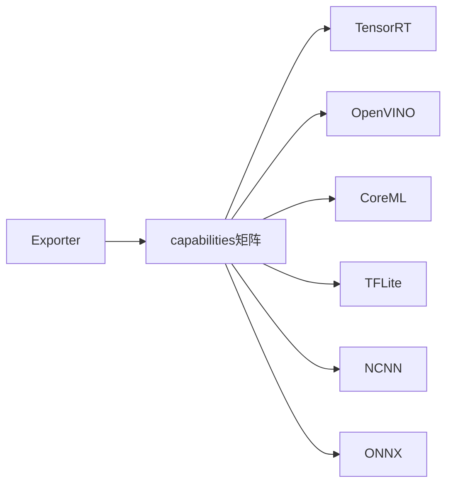
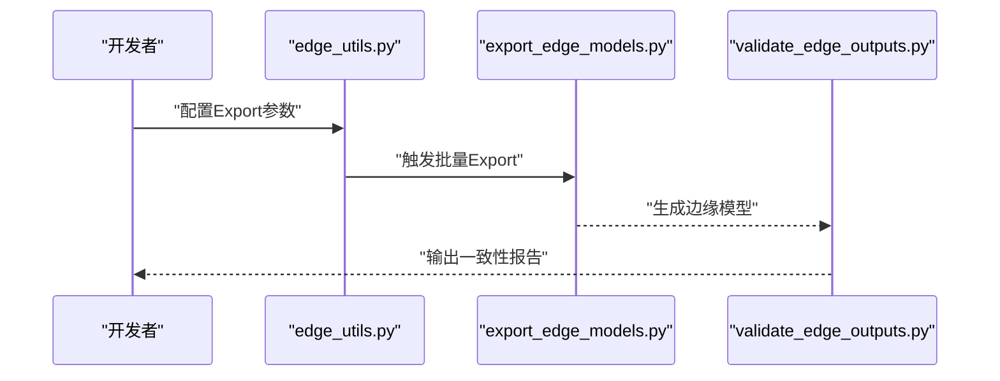
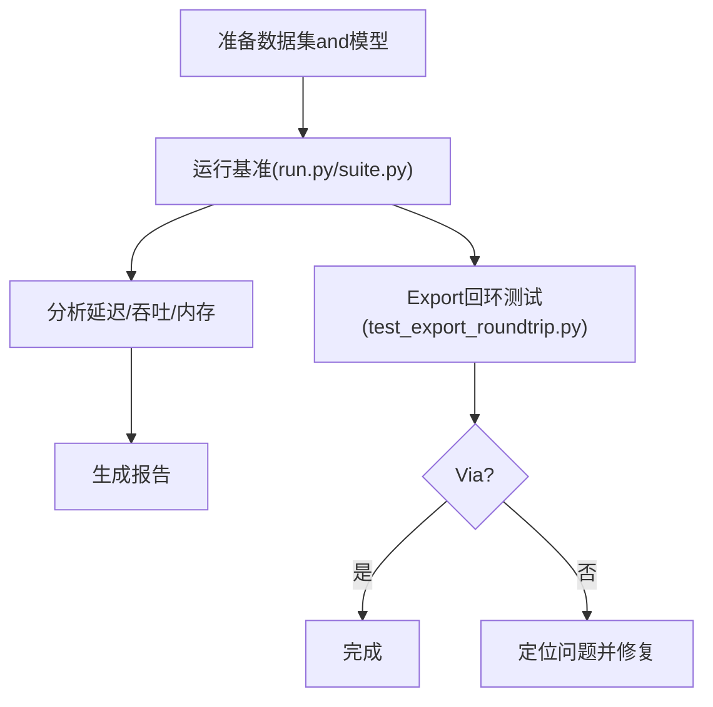
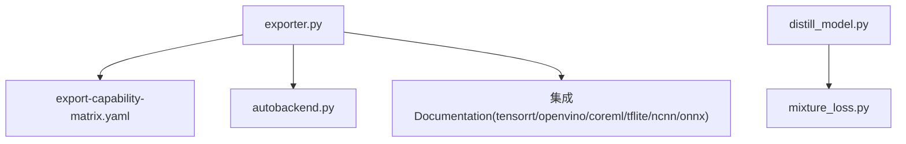

# Quantization and Compression

<cite>
**Files Referenced in This Document**
- [exporter.py](file://ultralytics/engine/exporter.py)
- [autobackend.py](file://ultralytics/nn/autobackend.py)
- [distill_model.py](file://ultralytics/nn/distill_model.py)
- [mixture_loss.py](file://ultralytics/nn/mixture_loss.py)
- [knowledge-distillation.md](file://docs/en/guides/knowledge-distillation.md)
- [tensorrt.md](file://docs/en/integrations/tensorrt.md)
- [openvino.md](file://docs/en/integrations/openvino.md)
- [coreml.md](file://docs/en/integrations/coreml.md)
- [tflite.md](file://docs/en/integrations/tflite.md)
- [ncnn.md](file://docs/en/integrations/ncnn.md)
- [onnx.md](file://docs/en/integrations/onnx.md)
- [edge_utils.py](file://examples/YOLO-Master-Edge-Deployment/edge_utils.py)
- [export_edge_models.py](file://examples/YOLO-Master-Edge-Deployment/export_edge_models.py)
- [validate_edge_outputs.py](file://examples/YOLO-Master-Edge-Deployment/validate_edge_outputs.py)
- [benchmark_molora_dispatch.py](file://benchmarks/benchmark_molora_dispatch.py)
- [benchmark_mot_dispatch.py](file://benchmarks/benchmark_mot_dispatch.py)
- [run.py](file://benchmarks/run.py)
- [suite.py](file://benchmarks/suite.py)
- [test_export_roundtrip.py](file://tests/test_export_roundtrip.py)
- [test_integrations.py](file://tests/test_integrations.py)
- [test_export_capability_matrix.py](file://tests/test_export_capability_matrix.py)
- [export-capability-matrix.yaml](file://ultralytics/cfg/export-capability-matrix.yaml)
- [yolo_master_advanced_modules_analysis.md](file://YOLO-Master-v0708-深度分析报告.md)
</cite>

## Table of Contents
1. [Introduction](#Introduction)
2. [Project Structure](#Project Structure)
3. [Core Components](#Core Components)
4. [Architecture Overview](#Architecture Overview)
5. [Detailed Component Analysis](#Detailed Component Analysis)
6. [Dependency Analysis](#Dependency Analysis)
7. [性能考量](#性能考量)
8. [Troubleshooting Guide](#Troubleshooting Guide)
9. [Conclusion](#Conclusion)
10. [Appendix](#Appendix)

## Introduction
本技术Documentation聚焦于 YOLO-Master 的Quantization and Compression体系，覆盖 INT8 量化（动态、静态、Mixture精度）、稀疏化and剪枝（结构化and非结构化）、Knowledge Distillationand教师-学生Training策略、量化感知TrainingandTraining后量化的差异andApplicable Scenarios、主流后端Supporting（TensorRT、OpenVINO、CoreML etc.）、精度损失Evaluationand校准Data Preparation、量化后的性能提升and内存占用对比，Centered onand自定义量化算法的开发指南and最佳实践。DocumentationCentered on仓库现有implementingfor依据，CombiningExportcapabilities矩阵and集成Documentation进行系统化说明。

## Project Structure
andQuantization and Compression相关的代码主要分布whileCentered on下位置：
- 引擎Exportand自动后端选择：ultralytics/engine/exporter.py、ultralytics/nn/autobackend.py
- 模型蒸馏andAuxiliary Loss：ultralytics/nn/distill_model.py、ultralytics/nn/mixture_loss.py
- Exportcapabilities矩阵and集成Documentation：ultralytics/cfg/export-capability-matrix.yaml、docs/en/integrations/*.md
- Edge DeploymentExamplesandValidation脚本：examples/YOLO-Master-Edge-Deployment/*
- 基准Test Suite：benchmarks/*
- 相关测试用例：tests/test_export_*.py、tests/test_integrations.py

Figure Source
- [exporter.py](file://ultralytics/engine/exporter.py)
- [autobackend.py](file://ultralytics/nn/autobackend.py)
- [export-capability-matrix.yaml](file://ultralytics/cfg/export-capability-matrix.yaml)
- [tensorrt.md](file://docs/en/integrations/tensorrt.md)
- [openvino.md](file://docs/en/integrations/openvino.md)
- [coreml.md](file://docs/en/integrations/coreml.md)
- [tflite.md](file://docs/en/integrations/tflite.md)
- [ncnn.md](file://docs/en/integrations/ncnn.md)
- [onnx.md](file://docs/en/integrations/onnx.md)
- [edge_utils.py](file://examples/YOLO-Master-Edge-Deployment/edge_utils.py)
- [export_edge_models.py](file://examples/YOLO-Master-Edge-Deployment/export_edge_models.py)
- [validate_edge_outputs.py](file://examples/YOLO-Master-Edge-Deployment/validate_edge_outputs.py)
- [run.py](file://benchmarks/run.py)
- [suite.py](file://benchmarks/suite.py)
- [test_export_roundtrip.py](file://tests/test_export_roundtrip.py)
- [test_integrations.py](file://tests/test_integrations.py)

Section Source
- [exporter.py](file://ultralytics/engine/exporter.py)
- [autobackend.py](file://ultralytics/nn/autobackend.py)
- [export-capability-matrix.yaml](file://ultralytics/cfg/export-capability-matrix.yaml)
- [knowledge-distillation.md](file://docs/en/guides/knowledge-distillation.md)
- [tensorrt.md](file://docs/en/integrations/tensorrt.md)
- [openvino.md](file://docs/en/integrations/openvino.md)
- [coreml.md](file://docs/en/integrations/coreml.md)
- [tflite.md](file://docs/en/integrations/tflite.md)
- [ncnn.md](file://docs/en/integrations/ncnn.md)
- [onnx.md](file://docs/en/integrations/onnx.md)
- [edge_utils.py](file://examples/YOLO-Master-Edge-Deployment/edge_utils.py)
- [export_edge_models.py](file://examples/YOLO-Master-Edge-Deployment/export_edge_models.py)
- [validate_edge_outputs.py](file://examples/YOLO-Master-Edge-Deployment/validate_edge_outputs.py)
- [benchmark_molora_dispatch.py](file://benchmarks/benchmark_molora_dispatch.py)
- [benchmark_mot_dispatch.py](file://benchmarks/benchmark_mot_dispatch.py)
- [run.py](file://benchmarks/run.py)
- [suite.py](file://benchmarks/suite.py)
- [test_export_roundtrip.py](file://tests/test_export_roundtrip.py)
- [test_integrations.py](file://tests/test_integrations.py)
- [test_export_capability_matrix.py](file://tests/test_export_capability_matrix.py)
- [yolo_master_advanced_modules_analysis.md](file://YOLO-Master-v0708-深度分析报告.md)

## Core Components
- Exporterand自动后端
  - exporter.py：统一Export入口，负责将 PyTorch 模型转换for目标格式（ONNX、TensorRT、OpenVINO、CoreML、TFLite、NCNN etc.），并承载Quantization and CompressionParameter Passing。
  - autobackend.py：运行时自动选择最优后端，根据设备and可用库决定执行路径。
- 蒸馏andMixture损失
  - distill_model.py：provides教师-学生蒸馏框架and接口。
  - mixture_loss.py：MixtureTasks/专家损失的组合and调度，可用于多Tasks或 MoE 场景下的蒸馏and正则化。
- Exportcapabilities矩阵
  - export-capability-matrix.yaml：定义各后端对模型类型、输入形状、Quantization and Compressioncapabilities的Supporting矩阵，用于Export前预检and兼容性校验。
- Edge DeploymentandValidation
  - edge_utils.py、export_edge_models.py、validate_edge_outputs.py：targeting边缘设备的Export流程Encapsulatesand输出一致性校验。
- 基准and测试
  - benchmarks/*：端to端Inference延迟and吞吐基准。
  - tests/test_export_roundtrip.py、tests/test_integrations.py、tests/test_export_capability_matrix.py：Export回环、集成andcapabilities矩阵的回归测试。

Section Source
- [exporter.py](file://ultralytics/engine/exporter.py)
- [autobackend.py](file://ultralytics/nn/autobackend.py)
- [distill_model.py](file://ultralytics/nn/distill_model.py)
- [mixture_loss.py](file://ultralytics/nn/mixture_loss.py)
- [export-capability-matrix.yaml](file://ultralytics/cfg/export-capability-matrix.yaml)
- [edge_utils.py](file://examples/YOLO-Master-Edge-Deployment/edge_utils.py)
- [export_edge_models.py](file://examples/YOLO-Master-Edge-Deployment/export_edge_models.py)
- [validate_edge_outputs.py](file://examples/YOLO-Master-Edge-Deployment/validate_edge_outputs.py)
- [run.py](file://benchmarks/run.py)
- [suite.py](file://benchmarks/suite.py)
- [test_export_roundtrip.py](file://tests/test_export_roundtrip.py)
- [test_integrations.py](file://tests/test_integrations.py)
- [test_export_capability_matrix.py](file://tests/test_export_capability_matrix.py)

## Architecture Overview
下图展示了从TrainingtoExport的整体流程，包括Quantization and Compression选项、后端适配andValidation环节。

Figure Source
- [exporter.py](file://ultralytics/engine/exporter.py)
- [autobackend.py](file://ultralytics/nn/autobackend.py)
- [export-capability-matrix.yaml](file://ultralytics/cfg/export-capability-matrix.yaml)
- [distill_model.py](file://ultralytics/nn/distill_model.py)
- [edge_utils.py](file://examples/YOLO-Master-Edge-Deployment/edge_utils.py)
- [run.py](file://benchmarks/run.py)
- [suite.py](file://benchmarks/suite.py)
- [test_export_roundtrip.py](file://tests/test_export_roundtrip.py)

## Detailed Component Analysis

### Exporterand自动后端
- 职责
  - 统一Export接口：接收模型、输入形状、目标后端and量化/压缩配置，Calls相应转换器。
  - capabilities预检：依据 export-capability-matrix.yaml 检查目标后端是否Supporting当前模型and配置。
  - 自动后端选择：while运行时根据设备and可用库选择最优执行路径。
- 关键流程
  - 解析Export参数（包含量化位宽、稀疏化开关、Mixture精度etc.）。
  - 查询capabilities矩阵，确定Supporting的格式and约束。
  - Calls具体后端转换（such as TensorRT、OpenVINO、CoreML、TFLite、NCNN、ONNX）。
  - 生成可部署产物并进行基本一致性校验。

Figure Source
- [exporter.py](file://ultralytics/engine/exporter.py)
- [export-capability-matrix.yaml](file://ultralytics/cfg/export-capability-matrix.yaml)

Section Source
- [exporter.py](file://ultralytics/engine/exporter.py)
- [autobackend.py](file://ultralytics/nn/autobackend.py)
- [export-capability-matrix.yaml](file://ultralytics/cfg/export-capability-matrix.yaml)

### Knowledge DistillationandMixture损失
- 蒸馏框架
  - distill_model.py provides教师-学生模型的Training接口，Supporting中间层特征对齐and输出分布匹配。
  - 可andMixture损失 mixture_loss.py Combining，while多Tasks或 MoE 场景下联合Optimization。
- Training策略
  - 教师模型：高精度大模型，作for监督信号源。
  - 学生模型：轻量小模型，Via蒸馏损失逼近教师表现。
  - Mixture损失：针对不同Tasks或专家分支的损失加权and调度，提升稳定性and收敛性。

Figure Source
- [distill_model.py](file://ultralytics/nn/distill_model.py)
- [mixture_loss.py](file://ultralytics/nn/mixture_loss.py)

Section Source
- [distill_model.py](file://ultralytics/nn/distill_model.py)
- [mixture_loss.py](file://ultralytics/nn/mixture_loss.py)
- [knowledge-distillation.md](file://docs/en/guides/knowledge-distillation.md)

### Quantization and Compressioncapabilities矩阵
- capabilities矩阵
  - export-capability-matrix.yaml 定义了不同后端对模型类型、输入尺寸、Quantization and Compression的Supporting情况。
  - Export前Via该矩阵进行预检，避免不兼容配置导致的失败。
- 集成Documentation
  - tensorrt.md、openvino.md、coreml.md、tflite.md、ncnn.md、onnx.md provides了各后端的安装、配置andUses指南。

Figure Source
- [export-capability-matrix.yaml](file://ultralytics/cfg/export-capability-matrix.yaml)
- [tensorrt.md](file://docs/en/integrations/tensorrt.md)
- [openvino.md](file://docs/en/integrations/openvino.md)
- [coreml.md](file://docs/en/integrations/coreml.md)
- [tflite.md](file://docs/en/integrations/tflite.md)
- [ncnn.md](file://docs/en/integrations/ncnn.md)
- [onnx.md](file://docs/en/integrations/onnx.md)

Section Source
- [export-capability-matrix.yaml](file://ultralytics/cfg/export-capability-matrix.yaml)
- [tensorrt.md](file://docs/en/integrations/tensorrt.md)
- [openvino.md](file://docs/en/integrations/openvino.md)
- [coreml.md](file://docs/en/integrations/coreml.md)
- [tflite.md](file://docs/en/integrations/tflite.md)
- [ncnn.md](file://docs/en/integrations/ncnn.md)
- [onnx.md](file://docs/en/integrations/onnx.md)

### Edge DeploymentandValidation
- 边缘工具链
  - edge_utils.py：Encapsulates边缘Export常用操作（such as输入预处理、批量Export、路径管理）。
  - export_edge_models.py：targeting边缘目标的批量Export脚本。
  - validate_edge_outputs.py：Validation边缘模型输出andRefer to输出的差异，确保一致性。
- 典型流程
  - 准备校准/Validation数据集。
  - 执行Export（Optional择Quantization and Compression选项）。
  - 运行一致性校验and基准测试。

Figure Source
- [edge_utils.py](file://examples/YOLO-Master-Edge-Deployment/edge_utils.py)
- [export_edge_models.py](file://examples/YOLO-Master-Edge-Deployment/export_edge_models.py)
- [validate_edge_outputs.py](file://examples/YOLO-Master-Edge-Deployment/validate_edge_outputs.py)

Section Source
- [edge_utils.py](file://examples/YOLO-Master-Edge-Deployment/edge_utils.py)
- [export_edge_models.py](file://examples/YOLO-Master-Edge-Deployment/export_edge_models.py)
- [validate_edge_outputs.py](file://examples/YOLO-Master-Edge-Deployment/validate_edge_outputs.py)

### 基准and测试
- Benchmark Suite
  - run.py、suite.py：组织and执行基准Tasks，测量延迟、吞吐and资源占用。
  - benchmark_molora_dispatch.py、benchmark_mot_dispatch.py：针对特定Modules的专项基准。
- 测试用例
  - test_export_roundtrip.py：Export回环测试，确保前后端一致性。
  - test_integrations.py：集成测试，覆盖多后端导入andExport。
  - test_export_capability_matrix.py：capabilities矩阵的回归测试。

Figure Source
- [run.py](file://benchmarks/run.py)
- [suite.py](file://benchmarks/suite.py)
- [benchmark_molora_dispatch.py](file://benchmarks/benchmark_molora_dispatch.py)
- [benchmark_mot_dispatch.py](file://benchmarks/benchmark_mot_dispatch.py)
- [test_export_roundtrip.py](file://tests/test_export_roundtrip.py)
- [test_integrations.py](file://tests/test_integrations.py)
- [test_export_capability_matrix.py](file://tests/test_export_capability_matrix.py)

Section Source
- [run.py](file://benchmarks/run.py)
- [suite.py](file://benchmarks/suite.py)
- [benchmark_molora_dispatch.py](file://benchmarks/benchmark_molora_dispatch.py)
- [benchmark_mot_dispatch.py](file://benchmarks/benchmark_mot_dispatch.py)
- [test_export_roundtrip.py](file://tests/test_export_roundtrip.py)
- [test_integrations.py](file://tests/test_integrations.py)
- [test_export_capability_matrix.py](file://tests/test_export_capability_matrix.py)

## Dependency Analysis
- 组件耦合
  - exporter.py 强依赖 export-capability-matrix.yaml 进行capabilities预检。
  - autobackend.py and exporter.py 协作，while运行时选择最优后端。
  - distill_model.py and mixture_loss.py 解耦良好，便于扩展新的蒸馏策略。
- External Dependencies
  - 各后端Documentation（tensorrt.md、openvino.md、coreml.md、tflite.md、ncnn.md、onnx.md）描述了第三方库的安装and配置要求。
- Potential Cycles依赖
  - Exportand后端选择for单向依赖，未见循环引用。
- 接口契约
  - Exporter对外暴露统一的Export函数and参数约定；capabilities矩阵定义了对各后端的capabilities契约。

Figure Source
- [exporter.py](file://ultralytics/engine/exporter.py)
- [autobackend.py](file://ultralytics/nn/autobackend.py)
- [export-capability-matrix.yaml](file://ultralytics/cfg/export-capability-matrix.yaml)
- [distill_model.py](file://ultralytics/nn/distill_model.py)
- [mixture_loss.py](file://ultralytics/nn/mixture_loss.py)
- [tensorrt.md](file://docs/en/integrations/tensorrt.md)
- [openvino.md](file://docs/en/integrations/openvino.md)
- [coreml.md](file://docs/en/integrations/coreml.md)
- [tflite.md](file://docs/en/integrations/tflite.md)
- [ncnn.md](file://docs/en/integrations/ncnn.md)
- [onnx.md](file://docs/en/integrations/onnx.md)

Section Source
- [exporter.py](file://ultralytics/engine/exporter.py)
- [autobackend.py](file://ultralytics/nn/autobackend.py)
- [export-capability-matrix.yaml](file://ultralytics/cfg/export-capability-matrix.yaml)
- [distill_model.py](file://ultralytics/nn/distill_model.py)
- [mixture_loss.py](file://ultralytics/nn/mixture_loss.py)
- [tensorrt.md](file://docs/en/integrations/tensorrt.md)
- [openvino.md](file://docs/en/integrations/openvino.md)
- [coreml.md](file://docs/en/integrations/coreml.md)
- [tflite.md](file://docs/en/integrations/tflite.md)
- [ncnn.md](file://docs/en/integrations/ncnn.md)
- [onnx.md](file://docs/en/integrations/onnx.md)

## 性能考量
- Quantization and Compression的收益
  - 内存占用：INT8 量化通常显著降低模型体积and显存占用。
  - Inference速度：whileSupportinghardware acceleration的后端（such as TensorRT、OpenVINO）上可获得明显延迟下降。
  - 精度权衡：需Via校准and蒸馏etc.手段控制精度损失。
- 基准方法
  - Uses benchmarks/run.py and suite.py 组织端to端基准，记录延迟、吞吐and内存。
  - Uses validate_edge_outputs.py 进行输出一致性校验，确保量化/压缩未引入偏差。
- 建议
  - 优先while目标后端上进行Quantization and Compression，Centered on获得更真实的性能收益。
  - CombiningKnowledge Distillation提升学生模型while低比特下的鲁棒性。

[This section provides general guidance and does not directly analyze specific files]

## Troubleshooting Guide
- 常见问题
  - Export Failure：检查 export-capability-matrix.yaml 中对应后端的capabilities项，确认模型类型and输入形状受Supporting。
  - 精度异常：增加校准数据规模，调整量化策略（动态/静态/Mixture精度），并Combining蒸馏恢复精度。
  - 后端不可用：按集成Documentation安装必要依赖，确认环境版本anddrivers are installed兼容。
- 调试手段
  - Uses test_export_roundtrip.py 进行Export回环测试，定位不一致环节。
  - Uses test_integrations.py Validation多后端导入/Export链路。
  - Uses validate_edge_outputs.py 对比边缘模型输出andRefer to输出。

Section Source
- [export-capability-matrix.yaml](file://ultralytics/cfg/export-capability-matrix.yaml)
- [test_export_roundtrip.py](file://tests/test_export_roundtrip.py)
- [test_integrations.py](file://tests/test_integrations.py)
- [validate_edge_outputs.py](file://examples/YOLO-Master-Edge-Deployment/validate_edge_outputs.py)

## Conclusion
YOLO-Master 的Quantization and Compression体系Centered onExporterfor核心，Combiningcapabilities矩阵and自动后端选择，形成从Trainingto部署的完整闭环。ViaKnowledge DistillationandMixture损失增强学生模型的低比特鲁棒性，借助边缘工具链and基准测试保障一致性and性能。建议while目标后端上进行Quantization and Compression，并Centered on校准and蒸馏for抓手控制精度损失，最终while内存and延迟之间取得平衡。

[This section is summary content and does not directly analyze specific files]

## Appendix

### INT8 量化implementing原理and配置方法
- 动态量化
  - 特点：whileInference时实时量化激活值，无需离线校准数据。
  - 适用：快速Validationand部署受限场景。
  - 配置要点：while后端启用动态量化开关，关注算子Supportingand数值范围估计。
- 静态量化
  - 特点：基于校准数据集统计激活分布，离线计算缩放因子and零点。
  - 适用：追求更高性能and稳定性的生产环境。
  - 配置要点：准备代表性校准数据，选择合适的校准算法and通道维度。
- Mixture精度量化
  - 特点：对不同层或通道采用不同位宽，平衡精度and效率。
  - 适用：对关键层保持较高精度的复杂模型。
  - 配置要点：依据capabilities矩阵and后端Supporting，逐层设置位宽策略。

Section Source
- [exporter.py](file://ultralytics/engine/exporter.py)
- [export-capability-matrix.yaml](file://ultralytics/cfg/export-capability-matrix.yaml)
- [tensorrt.md](file://docs/en/integrations/tensorrt.md)
- [openvino.md](file://docs/en/integrations/openvino.md)
- [coreml.md](file://docs/en/integrations/coreml.md)
- [tflite.md](file://docs/en/integrations/tflite.md)
- [ncnn.md](file://docs/en/integrations/ncnn.md)
- [onnx.md](file://docs/en/integrations/onnx.md)

### 模型稀疏化and剪枝技术
- 非结构化剪枝
  - 特点：对单个权重进行零化，减少参数量但可能影响并行度。
  - 适用：需要极致压缩且后端Supporting稀疏张量的场景。
- 结构化剪枝
  - 特点：按通道/滤波器/层进行整块剪枝，利于hardware acceleration。
  - 适用：移动端and嵌入式平台，追求速度and内存双优。
- 应用建议
  - CombiningExportcapabilities矩阵确认后端对稀疏结构的OptimizationSupporting。
  - while蒸馏过程中引入稀疏正则，提升剪枝后精度。

Section Source
- [export-capability-matrix.yaml](file://ultralytics/cfg/export-capability-matrix.yaml)
- [distill_model.py](file://ultralytics/nn/distill_model.py)
- [mixture_loss.py](file://ultralytics/nn/mixture_loss.py)

### Knowledge Distillationand教师-学生Training策略
- 教师-学生模型
  - 教师：高精度大模型，provides软标签and中间特征。
  - 学生：轻量小模型，Via蒸馏损失学习教师行for。
- Training策略
  - Loss combination：分类损失+蒸馏损失，必要时加入Mixture损失Centered on稳定Training。
  - 课程学习：逐步提高蒸馏权重，促进收敛。
- Applicable Scenarios
  - 低比特量化前的精度恢复。
  - 跨TasksMigrationand领域自适应。

Section Source
- [distill_model.py](file://ultralytics/nn/distill_model.py)
- [mixture_loss.py](file://ultralytics/nn/mixture_loss.py)
- [knowledge-distillation.md](file://docs/en/guides/knowledge-distillation.md)

### 量化感知TrainingandTraining后量化的区别andApplicable Scenarios
- 量化感知Training（QAT）
  - 特点：whileTraining中模拟量化噪声，使模型适应低比特表示。
  - 适用：对精度敏感且具备充足算力and数据的场景。
- Training后量化（PTQ）
  - 特点：whileTraining完成后进行量化，依赖校准数据。
  - 适用：快速部署and资源受限场景。
- 选择建议
  - 若后端Supporting QAT 且时间充裕，优先 QAT。
  - 否则采用 PTQ，并Via蒸馏andMixture精度提升效果。

Section Source
- [exporter.py](file://ultralytics/engine/exporter.py)
- [export-capability-matrix.yaml](file://ultralytics/cfg/export-capability-matrix.yaml)
- [tensorrt.md](file://docs/en/integrations/tensorrt.md)
- [openvino.md](file://docs/en/integrations/openvino.md)
- [coreml.md](file://docs/en/integrations/coreml.md)
- [tflite.md](file://docs/en/integrations/tflite.md)
- [ncnn.md](file://docs/en/integrations/ncnn.md)
- [onnx.md](file://docs/en/integrations/onnx.md)

### 不同量化后端的Supporting情况
- TensorRT
  - 优势：GPU 高吞吐，INT8 Optimization成熟。
  - 注意：需准备校准数据and合适的输入形状。
- OpenVINO
  - 优势：CPU/加速器广泛Supporting，INT8 工具链完善。
  - 注意：模型图结构and算子需满足 IR 规范。
- CoreML
  - 优势：iOS/macOS 原生Optimization。
  - 注意：遵循 Apple 生态的模型规格。
- TFLite
  - 优势：移动端and嵌入式友好。
  - 注意：算子Supportingand量化表需对齐。
- NCNN/ONNX
  - 优势：跨平台and灵活转换。
  - 注意：后端implementing差异可能导致性能波动。

Section Source
- [tensorrt.md](file://docs/en/integrations/tensorrt.md)
- [openvino.md](file://docs/en/integrations/openvino.md)
- [coreml.md](file://docs/en/integrations/coreml.md)
- [tflite.md](file://docs/en/integrations/tflite.md)
- [ncnn.md](file://docs/en/integrations/ncnn.md)
- [onnx.md](file://docs/en/integrations/onnx.md)

### 精度损失Evaluationand校准Data Preparation
- 精度Evaluation
  - Metrics：mAP、F1、混淆矩阵、误差分布。
  - 方法：对比量化前后模型whileValidation集上的表现。
- 校准数据
  - 要求：代表性、多样性、足够样本量。
  - 处理：标准化、去噪、类别均衡。
- 回环测试
  - Uses test_export_roundtrip.py ValidationExport一致性。
  - Uses validate_edge_outputs.py 对比边缘输出。

Section Source
- [test_export_roundtrip.py](file://tests/test_export_roundtrip.py)
- [validate_edge_outputs.py](file://examples/YOLO-Master-Edge-Deployment/validate_edge_outputs.py)
- [run.py](file://benchmarks/run.py)
- [suite.py](file://benchmarks/suite.py)

### 量化后的性能提升分析and内存占用对比
- 分析方法
  - 延迟：端to端Inference时间（ms）。
  - 吞吐：每秒处理样本数（FPS）。
  - 内存：模型文件大小and运行时显存/内存占用。
- 工具
  - benchmarks/run.py、suite.py 组织基准Tasks。
  - validate_edge_outputs.py 保证输出一致性。
- 报告
  - 生成对比表格and曲线，标注不同后端and量化策略的效果。

Section Source
- [run.py](file://benchmarks/run.py)
- [suite.py](file://benchmarks/suite.py)
- [validate_edge_outputs.py](file://examples/YOLO-Master-Edge-Deployment/validate_edge_outputs.py)

### 自定义量化算法开发指南and最佳实践
- 开发步骤
  - 设计量化策略：位宽分配、通道/层粒度、动态/静态模式。
  - implementing量化算子：while前向andBackpropagation中插入量化节点。
  - 集成Exporter：while exporter.py 中注册新策略，更新capabilities矩阵。
  - 编写测试：回环and一致性测试，覆盖边界条件。
- 最佳实践
  - 渐进式量化：先全图再局部调优。
  - 蒸馏辅助：while低比特阶段引入蒸馏损失。
  - 监控数值稳定性：Gradient裁剪、EMA 平滑。
  - 持续回归：Via test_export_capability_matrix.py and集成测试保障兼容性。

Section Source
- [exporter.py](file://ultralytics/engine/exporter.py)
- [export-capability-matrix.yaml](file://ultralytics/cfg/export-capability-matrix.yaml)
- [test_export_capability_matrix.py](file://tests/test_export_capability_matrix.py)
- [test_integrations.py](file://tests/test_integrations.py)
- [yolo_master_advanced_modules_analysis.md](file://YOLO-Master-v0708-深度分析报告.md)