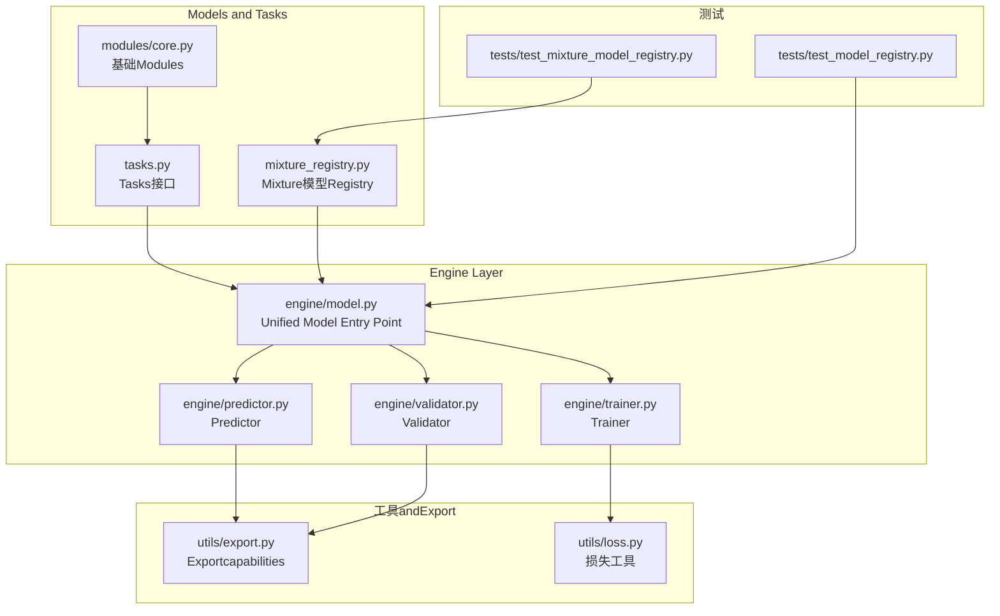
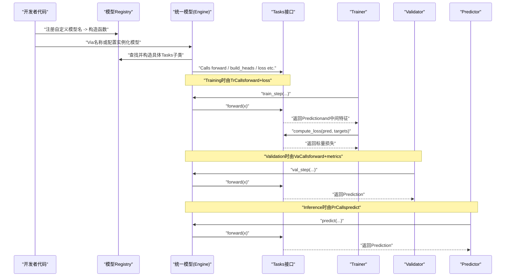
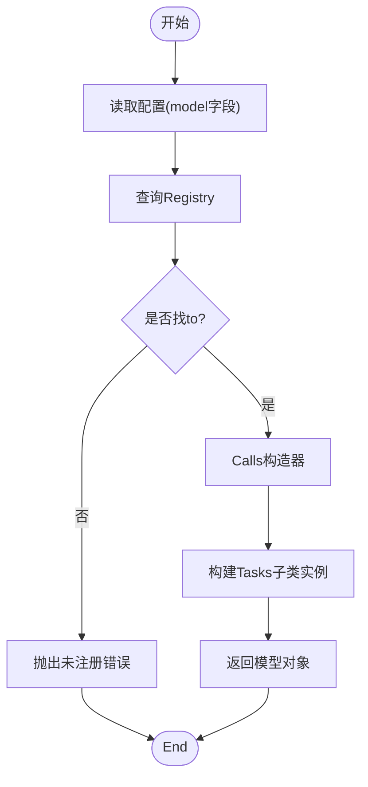
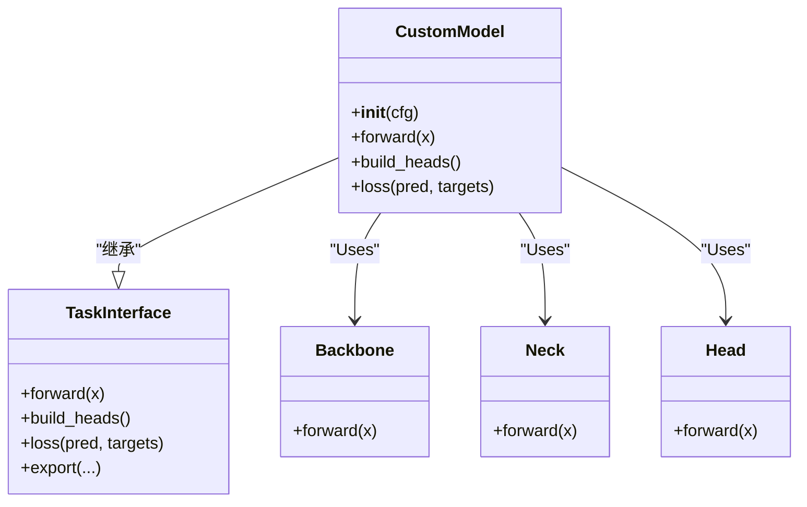
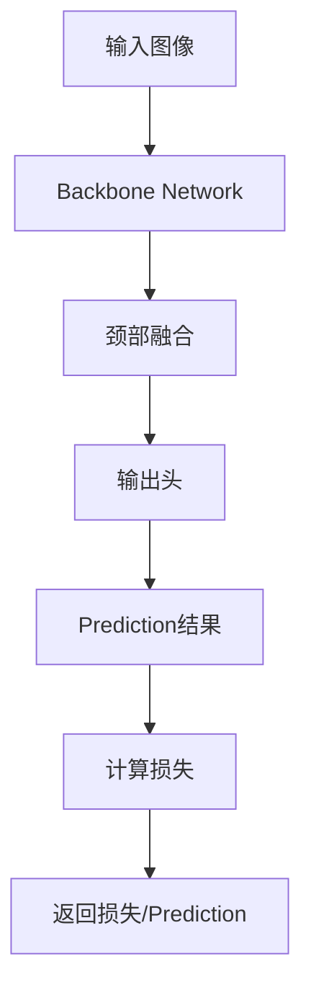
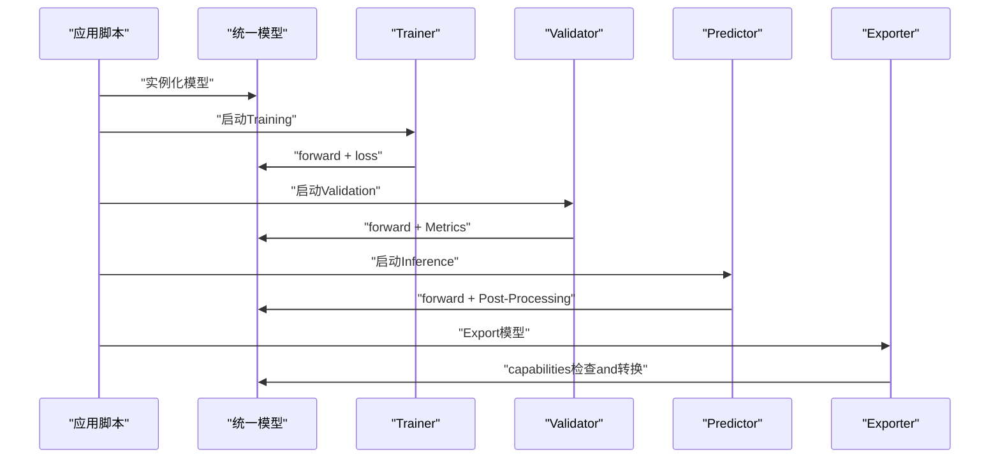
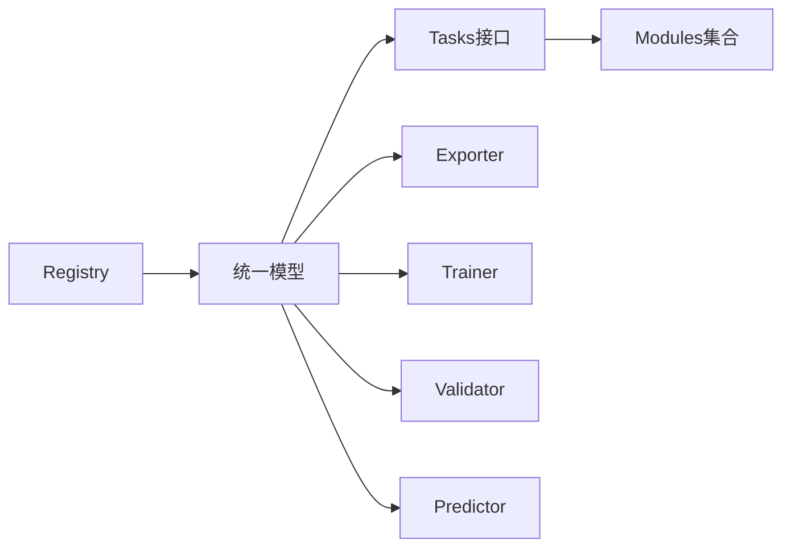

# 自定义模型开发

<cite>
**Files Referenced in This Document**
- [README.md](file://README.md)
- [ultralytics/models/__init__.py](file://ultralytics/models/__init__.py)
- [ultralytics/nn/mixture_registry.py](file://ultralytics/nn/mixture_registry.py)
- [ultralytics/nn/tasks.py](file://ultralytics/nn/tasks.py)
- [ultralytics/engine/model.py](file://ultralytics/engine/model.py)
- [ultralytics/engine/trainer.py](file://ultralytics/engine/trainer.py)
- [ultralytics/engine/predictor.py](file://ultralytics/engine/predictor.py)
- [ultralytics/engine/validator.py](file://ultralytics/engine/validator.py)
- [ultralytics/nn/modules/core.py](file://ultralytics/nn/modules/core.py)
- [ultralytics/utils/export.py](file://ultralytics/utils/export.py)
- [ultralytics/utils/loss.py](file://ultralytics/utils/loss.py)
- [tests/test_model_registry.py](file://tests/test_model_registry.py)
- [tests/test_mixture_model_registry.py](file://tests/test_mixture_model_registry.py)
</cite>

## Table of Contents
1. [Introduction](#Introduction)
2. [Project Structure](#Project Structure)
3. [Core Components](#Core Components)
4. [Architecture Overview](#Architecture Overview)
5. [Detailed Component Analysis](#Detailed Component Analysis)
6. [Dependency Analysis](#Dependency Analysis)
7. [Performance Considerations](#Performance Considerations)
8. [Troubleshooting Guide](#Troubleshooting Guide)
9. [Conclusion](#Conclusion)
10. [Appendix](#Appendix)

## Introduction
本指南targeting希望从零开始implementing并集成“自定义模型类型”的开发者。内容覆盖：
- 模型类定义、前向传播andLoss Functionimplementing要点
- 模型注册机制and动态加载原理
- 新网络Modulesand自定义层的集成方式
- 从原型to生产的完整工作流
- 测试andValidation最佳实践
- and现有Training/Inference框架的集成方法
- 性能Optimizationand内存管理策略
- 可复用的模板andExamples路径

## Project Structure
本项目采用分层组织：
- Models and Tasks抽象位于 ultralytics/nn 下，包含Tasks接口、Mixture模型Registryetc.
- Engine Layer（Training/Validation/Prediction）位于 ultralytics/engine 下，is responsible for lifecycle orchestration
- 工具andExportcapabilities位于 ultralytics/utils 下
- 配置and默认模型while ultralytics/cfg 下
- 测试用例位于 tests 下，覆盖注册、兼容性、数值稳定性etc.

Figure Source
- [ultralytics/nn/tasks.py](file://ultralytics/nn/tasks.py)
- [ultralytics/nn/mixture_registry.py](file://ultralytics/nn/mixture_registry.py)
- [ultralytics/nn/modules/core.py](file://ultralytics/nn/modules/core.py)
- [ultralytics/engine/model.py](file://ultralytics/engine/model.py)
- [ultralytics/engine/trainer.py](file://ultralytics/engine/trainer.py)
- [ultralytics/engine/predictor.py](file://ultralytics/engine/predictor.py)
- [ultralytics/engine/validator.py](file://ultralytics/engine/validator.py)
- [ultralytics/utils/export.py](file://ultralytics/utils/export.py)
- [ultralytics/utils/loss.py](file://ultralytics/utils/loss.py)
- [tests/test_model_registry.py](file://tests/test_model_registry.py)
- [tests/test_mixture_model_registry.py](file://tests/test_mixture_model_registry.py)

Section Source
- [README.md](file://README.md)

## Core Components
- Tasks接口and基类：provides统一的 forward、头构建、损失组装、Export钩子etc.契约，确保不同Tasks（检测、分割、姿态etc.）一致接入引擎。
- 模型Registry：集中维护模型名称to构造函数的映射，Supporting按名称动态实例化，便于 YAML 配置drivers are installed创建。
- 引擎Model Encapsulation：统一处理权重加载、设备放置、Export开关、Training/Validation/Inference流程调度。
- Training/Validation/Predictor：分别负责参数更新、Metrics统计、结果Post-ProcessingandVisualization。
- Exportand损失工具：for ONNX/TorchScript etc.目标providescapabilities矩阵and兼容检查；provides常用Loss combinationand辅助函数。

Section Source
- [ultralytics/nn/tasks.py](file://ultralytics/nn/tasks.py)
- [ultralytics/nn/mixture_registry.py](file://ultralytics/nn/mixture_registry.py)
- [ultralytics/engine/model.py](file://ultralytics/engine/model.py)
- [ultralytics/engine/trainer.py](file://ultralytics/engine/trainer.py)
- [ultralytics/engine/predictor.py](file://ultralytics/engine/predictor.py)
- [ultralytics/engine/validator.py](file://ultralytics/engine/validator.py)
- [ultralytics/utils/export.py](file://ultralytics/utils/export.py)
- [ultralytics/utils/loss.py](file://ultralytics/utils/loss.py)

## Architecture Overview
下图展示了“自定义模型”从注册to被引擎Calls的端to端路径。

Figure Source
- [ultralytics/nn/mixture_registry.py](file://ultralytics/nn/mixture_registry.py)
- [ultralytics/nn/tasks.py](file://ultralytics/nn/tasks.py)
- [ultralytics/engine/model.py](file://ultralytics/engine/model.py)
- [ultralytics/engine/trainer.py](file://ultralytics/engine/trainer.py)
- [ultralytics/engine/validator.py](file://ultralytics/engine/validator.py)
- [ultralytics/engine/predictor.py](file://ultralytics/engine/predictor.py)

## Detailed Component Analysis

### 模型注册and动态加载
- Registry职责：维护“模型名 -> 构造器”的映射，供Unified Model Entry Point按名称解析并实例化。
- 典型流程：
  - whileModules初始化时完成注册
  - 统一模型根据配置中的 model 字段查找对应构造器
  - 构造器内部再实例化具体Tasks子类（such as检测/分割/姿态etc.）
- 扩展点：新增模型只需whileRegistry中登记，并whileTasks接口中implementing相应逻辑。

Figure Source
- [ultralytics/nn/mixture_registry.py](file://ultralytics/nn/mixture_registry.py)
- [ultralytics/engine/model.py](file://ultralytics/engine/model.py)

Section Source
- [ultralytics/nn/mixture_registry.py](file://ultralytics/nn/mixture_registry.py)
- [ultralytics/engine/model.py](file://ultralytics/engine/model.py)
- [tests/test_mixture_model_registry.py](file://tests/test_mixture_model_registry.py)

### Tasks接口and模型类定义
- Tasks接口约定：
  - forward：接收输入张量，返回Prediction结果andOptional中间表示
  - build_heads：根据Tasks类型构建输出头（分类/回归/掩码etc.）
  - loss：将Predictionand标签组合成损失项，Supporting多Tasks加权
  - export：声明Supporting的Export Backendsand约束
- 自定义模型类建议：
  - 继承Tasks接口基类
  - while __init__ 中声明骨干、颈部、头部and可学习参数
  - while forward 中串联骨干/颈部/头部，必要时保留中间特征用于损失或调试
  - while loss 中implementingTasks相关损失（such as分类交叉熵、边界框回归、掩码 Dice etc.）

Figure Source
- [ultralytics/nn/tasks.py](file://ultralytics/nn/tasks.py)
- [ultralytics/nn/modules/core.py](file://ultralytics/nn/modules/core.py)

Section Source
- [ultralytics/nn/tasks.py](file://ultralytics/nn/tasks.py)
- [ultralytics/nn/modules/core.py](file://ultralytics/nn/modules/core.py)

### 前向传播andLoss Functionimplementing
- 前向传播：
  - 数据流：输入 -> 骨干提取特征 -> 颈部融合 -> 头部解码 -> Prediction
  - 注意形状and通道对齐，避免广播陷阱
  - 对大尺寸图像可采用分块或多尺度策略
- Loss Function：
  - 分类：交叉熵/焦点损失
  - 定位：GIoU/CIoU/DIoU
  - 分割：Dice/BCE 组合
  - 多Tasks：加权求和，注意Gradient尺度平衡
  - 可利用 utils/loss provides的通用组件进行组合

Figure Source
- [ultralytics/nn/tasks.py](file://ultralytics/nn/tasks.py)
- [ultralytics/utils/loss.py](file://ultralytics/utils/loss.py)

Section Source
- [ultralytics/nn/tasks.py](file://ultralytics/nn/tasks.py)
- [ultralytics/utils/loss.py](file://ultralytics/utils/loss.py)

### 集成新的网络Modulesand自定义层
- Modules设计原则：
  - 单一职责，输入输出形状明确
  - 可配置化（通道数、扩张率、注意力头数etc.）
  - and torch.nn.Module 生态兼容
- 集成步骤：
  - while modules Table of Contents下implementing自定义层
  - whileTasks或模型中按需引用
  - 若涉andExport，需while export capabilities矩阵中声明Supporting情况
- 注意事项：
  - 避免不可导操作
  - 控制显存峰值（复用中间变量、and时释放）
  - 保证算子while目标后端可用（ONNX/TensorRT/OpenVINO etc.）

Section Source
- [ultralytics/nn/modules/core.py](file://ultralytics/nn/modules/core.py)
- [ultralytics/utils/export.py](file://ultralytics/utils/export.py)

### andTraining/Inference框架的集成
- Training：
  - ViaUnified Model Entry Point实例化后交由 Trainer 管理
  - Training循环自动Calls forward and loss，并进行BackpropagationandOptimizer更新
- Validation：
  - Validator Calls forward 并累积Metrics（such as mAP、精度、召回etc.）
- Inference：
  - Predictor 负责预处理、前向、Post-Processing（NMS、阈值过滤、Visualization）
- Export：
  - Exporter 根据capabilities矩阵生成目标格式，失败时回退或报错

Figure Source
- [ultralytics/engine/model.py](file://ultralytics/engine/model.py)
- [ultralytics/engine/trainer.py](file://ultralytics/engine/trainer.py)
- [ultralytics/engine/validator.py](file://ultralytics/engine/validator.py)
- [ultralytics/engine/predictor.py](file://ultralytics/engine/predictor.py)
- [ultralytics/utils/export.py](file://ultralytics/utils/export.py)

Section Source
- [ultralytics/engine/model.py](file://ultralytics/engine/model.py)
- [ultralytics/engine/trainer.py](file://ultralytics/engine/trainer.py)
- [ultralytics/engine/validator.py](file://ultralytics/engine/validator.py)
- [ultralytics/engine/predictor.py](file://ultralytics/engine/predictor.py)
- [ultralytics/utils/export.py](file://ultralytics/utils/export.py)

### 模型测试andValidation最佳实践
- 单元测试：
  - Registry：校验名称唯一性、构造成功、默认参数正确
  - Tasks接口：校验 forward 形状、loss 可导、Exportcapabilities声明
  - 数值稳定性：小批量、极端输入、NaN/Inf 检测
- 集成测试：
  - 端to端Training/Validation/Inference链路
  - 跨后端Export一致性（PyTorch vs ONNX/TorchScript）
- 基准and回归：
  - 固定随机种子，记录关键Metricsand耗时
  - 变更前后对比，设置门限告警

Section Source
- [tests/test_model_registry.py](file://tests/test_model_registry.py)
- [tests/test_mixture_model_registry.py](file://tests/test_mixture_model_registry.py)

## Dependency Analysis
- 松耦合：
  - RegistryandTasks解耦，新增模型无需改动引擎
  - Tasks接口屏蔽具体implementing差异，引擎仅依赖契约
- 内聚性：
  - Tasks类内部聚合骨干/颈部/头部，减少外部拼装复杂度
- 潜while风险：
  - Registry命名冲突
  - Exportcapabilities不一致导致运行时异常
  - 自定义层while后端不Supporting

Figure Source
- [ultralytics/nn/mixture_registry.py](file://ultralytics/nn/mixture_registry.py)
- [ultralytics/nn/tasks.py](file://ultralytics/nn/tasks.py)
- [ultralytics/engine/model.py](file://ultralytics/engine/model.py)
- [ultralytics/utils/export.py](file://ultralytics/utils/export.py)

Section Source
- [ultralytics/nn/mixture_registry.py](file://ultralytics/nn/mixture_registry.py)
- [ultralytics/nn/tasks.py](file://ultralytics/nn/tasks.py)
- [ultralytics/engine/model.py](file://ultralytics/engine/model.py)
- [ultralytics/utils/export.py](file://ultralytics/utils/export.py)

## Performance Considerations
- 计算图and算子：
  - Prefer内核友好的算子，避免频繁 Python 分支
  - 合并冗余操作（批归一化融合、激活重排）
- 内存管理：
  - and时释放中间张量，避免不必要的副本
  - UsesGradientCheckpoint（while极深网络场景）
- 并行and分布式：
  - Set appropriately batch size andGradient累积步数
  - DDP 下关注通信开销and同步点
- ExportOptimization：
  - 选择合适后端（TensorRT/OpenVINO/TFLite），遵循capabilities矩阵
  - 量化and剪枝需Combined with校准集andValidation Set Evaluation

[This section provides general guidance and does not directly analyze specific files]

## Troubleshooting Guide
- 常见问题：
  - 模型未注册：检查Registry键名and导入时机
  - 形状不匹配：打印各阶段张量形状，核对卷积/全连接维度
  - Export Failure：对照capabilities矩阵，替换不Supporting的算子
  - NaN/Inf：检查Learning Rate、损失数值范围、Gradient裁剪
- 定位手段：
  - 启用最小复现脚本and固定随机种子
  - 逐步注释法缩小问题范围
  - UsesExporter预检功能提前发现兼容性问题

Section Source
- [ultralytics/utils/export.py](file://ultralytics/utils/export.py)
- [tests/test_model_registry.py](file://tests/test_model_registry.py)
- [tests/test_mixture_model_registry.py](file://tests/test_mixture_model_registry.py)

## Conclusion
Via遵循Tasks接口契约、利用Registry进行动态加载、whileEngine Layer统一编排Training/Validation/Inference/Export流程，开发者可Centered on高效地implementing并集成自定义模型。Combining完善的测试and性能Optimization策略，可将自定义模型从原型快速推进至生产部署。

[This section is summary content and does not directly analyze specific files]

## Appendix

### 从零to一的开发清单
- 设计Tasks接口implementing
  - 定义骨干/颈部/头部结构
  - implementing forward、build_heads、loss、export
- 注册模型
  - whileRegistry中登记模型名and构造器
- 编写测试
  - Registry、Tasks接口、Exportcapabilities、数值稳定性
- TrainingandValidation
  - Uses Trainer/Validator 进行端to端Validation
- InferenceandExport
  - Uses Predictor 进行Inference
  - Uses Exporter 生成目标格式
- 性能Optimization
  - 算子替换、内存Optimization、量化/剪枝

[本节for流程性说明，不直接分析具体文件]