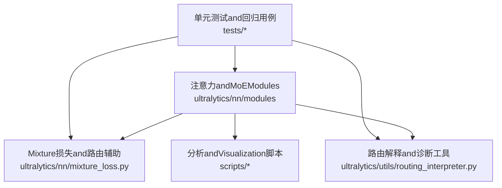
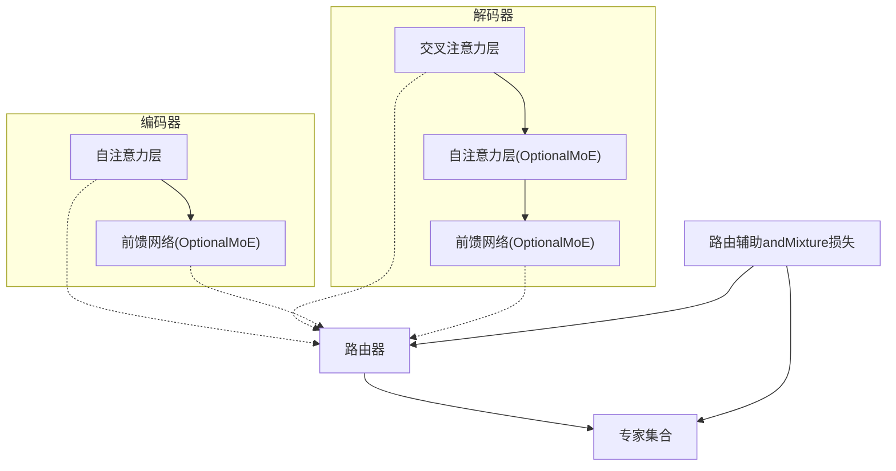
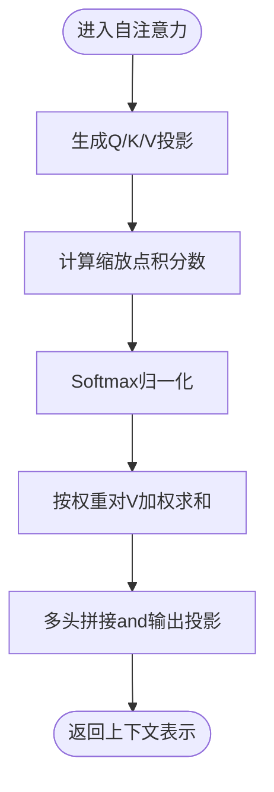
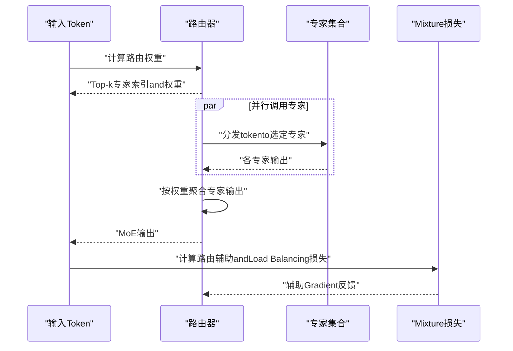
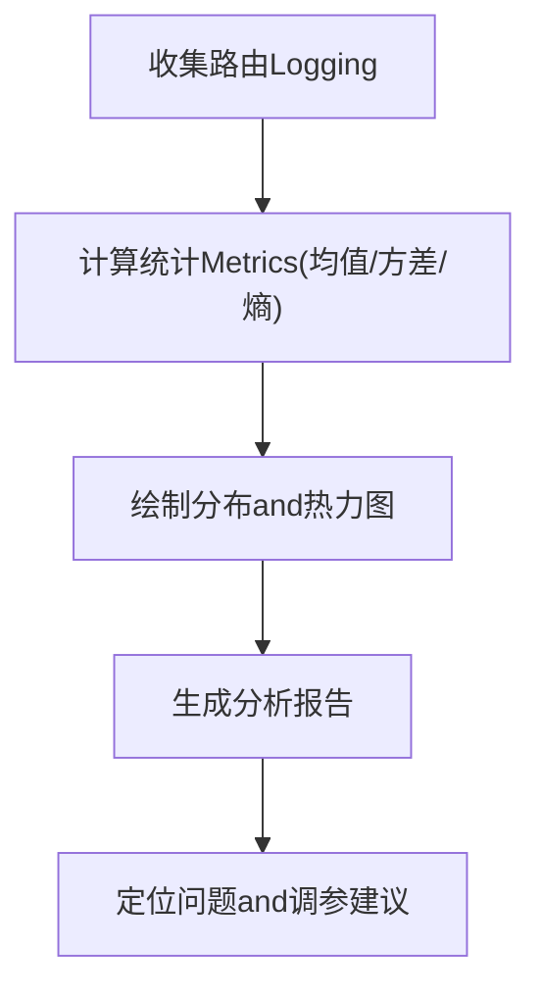
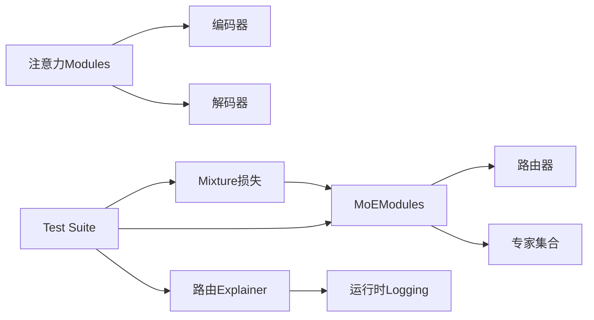

# 注意力Modules

<cite>
**Files Referenced in This Document**
- [ultralytics/nn/modules/attention.py](file://ultralytics/nn/modules/attention.py)
- [ultralytics/nn/modules/moe.py](file://ultralytics/nn/modules/moe.py)
- [ultralytics/nn/mixture_loss.py](file://ultralytics/nn/mixture_loss.py)
- [ultralytics/utils/routing_interpreter.py](file://ultralytics/utils/routing_interpreter.py)
- [scripts/analyze_mot_routing.py](file://scripts/analyze_mot_routing.py)
- [scripts/diagnose_mot_routing.py](file://scripts/diagnose_mot_routing.py)
- [tests/test_moe.py](file://tests/test_moe.py)
- [tests/test_moe_router_boundaries.py](file://tests/test_moe_router_boundaries.py)
- [tests/test_moe_dynamic_scheduler.py](file://tests/test_moe_dynamic_scheduler.py)
- [tests/test_moe_usage_audit.py](file://tests/test_moe_usage_audit.py)
- [tests/test_moe_validation_collectives.py](file://tests/test_moe_validation_collectives.py)
- [tests/test_molora_sparse_dispatch.py](file://tests/test_molora_sparse_dispatch.py)
- [tests/test_molora_routing_aware_merge.py](file://tests/test_molora_routing_aware_merge.py)
- [tests/test_mixture_config_registry.py](file://tests/test_mixture_config_registry.py)
- [tests/test_mixture_export.py](file://tests/test_mixture_export.py)
- [tests/test_mixture_numeric.py](file://tests/test_mixture_numeric.py)
- [tests/test_mixture_aux_loss.py](file://tests/test_mixture_aux_loss.py)
- [tests/test_mixture_compile.py](file://tests/test_mixture_compile.py)
- [tests/test_mixture_model_registry.py](file://tests/test_mixture_model_registry.py)
- [tests/test_mixture_loss_composition.py](file://tests/test_mixture_loss_composition.py)
- [tests/test_moa.py](file://tests/test_moa.py)
- [tests/test_moa_mot_ddp_math.py](file://tests/test_moa_mot_ddp_math.py)
- [tests/test_moa_mot_ssot.py](file://tests/test_moa_mot_ssot.py)
- [tests/test_routing_aux_contract.py](file://tests/test_routing_aux_contract.py)
- [tests/test_routing_interpreter.py](file://tests/test_routing_interpreter.py)
- [tests/test_routed_module_protocol.py](file://tests/test_routed_module_protocol.py)
- [tests/test_moe_amp_index_add.py](file://tests/test_moe_amp_index_add.py)
- [tests/test_moe_ddp_fixes.py](file://tests/test_moe_ddp_fixes.py)
- [tests/test_moe_variant_contract.py](file://tests/test_moe_variant_contract.py)
- [tests/test_moe_ssot.py](file://tests/test_moe_ssot.py)
- [tests/test_moe_aware_peft.py](file://tests/test_moe_aware_peft.py)
- [tests/test_molora.py](file://tests/test_molora.py)
- [tests/test_molora_dtype.py](file://tests/test_molora_dtype.py)
- [tests/test_molora_merge_semantics.py](file://tests/test_molora_merge_semantics.py)
- [tests/test_molora_supplementary.py](file://tests/test_molora_supplementary.py)
- [tests/test_mot.py](file://tests/test_mot.py)
- [tests/test_mot_routing_diagnostics.py](file://tests/test_mot_routing_diagnostics.py)
- [tests/test_mot_scene_aware_router.py](file://tests/test_mot_scene_aware_router.py)
- [tests/test_mot_sparse_parity.py](file://tests/test_mot_sparse_parity.py)
</cite>

## Table of Contents
1. [Introduction](#Introduction)
2. [Project Structure](#Project Structure)
3. [Core Components](#Core Components)
4. [Architecture Overview](#Architecture Overview)
5. [Detailed Component Analysis](#Detailed Component Analysis)
6. [Dependency Analysis](#Dependency Analysis)
7. [性能考量](#性能考量)
8. [Troubleshooting Guide](#Troubleshooting Guide)
9. [Conclusion](#Conclusion)
10. [Appendix](#Appendix)

## Introduction
本技术Documentation聚焦于注意力Modules，覆盖自注意力(Self-Attention)、交叉注意力(Cross-Attention)、多头注意力(Multi-Head Attention)的数学原理andPyTorchimplementing要点；深入解析Transformer编码器-解码器架构中的设计模式andOptimization技巧；阐述Routing Mechanism(Routing)while注意力分配中的作用andimplementing；解释Mixture-of-Experts(MoE)中专家路由andLoad Balancing策略；并provides注意力Modules的配置方法and性能调优指南，Centered onand注意力权重Visualizationand分析工具的Uses说明。

## Project Structure
本项目将注意力相关capabilities集中while神经网络Modules层and工具层：
- 注意力andMoE核心implementing位于 nn/modules 下，包含注意力、门控、路由and专家etc.关键类。
- Mixture损失and路由辅助项位于 nn/mixture_loss.py。
- 路由解释and诊断工具位于 utils/routing_interpreter.py and scripts 下的分析脚本。
- 大量测试覆盖路由边界、动态调度、稀疏分发、数值稳定性、Export兼容性andDDP一致性etc.。

Figure Source
- [ultralytics/nn/modules/attention.py](file://ultralytics/nn/modules/attention.py)
- [ultralytics/nn/modules/moe.py](file://ultralytics/nn/modules/moe.py)
- [ultralytics/nn/mixture_loss.py](file://ultralytics/nn/mixture_loss.py)
- [ultralytics/utils/routing_interpreter.py](file://ultralytics/utils/routing_interpreter.py)
- [scripts/analyze_mot_routing.py](file://scripts/analyze_mot_routing.py)
- [scripts/diagnose_mot_routing.py](file://scripts/diagnose_mot_routing.py)

Section Source
- [ultralytics/nn/modules/attention.py](file://ultralytics/nn/modules/attention.py)
- [ultralytics/nn/modules/moe.py](file://ultralytics/nn/modules/moe.py)
- [ultralytics/nn/mixture_loss.py](file://ultralytics/nn/mixture_loss.py)
- [ultralytics/utils/routing_interpreter.py](file://ultralytics/utils/routing_interpreter.py)
- [scripts/analyze_mot_routing.py](file://scripts/analyze_mot_routing.py)
- [scripts/diagnose_mot_routing.py](file://scripts/diagnose_mot_routing.py)

## Core Components
- 自注意力and交叉注意力：Via查询(Q)、键(K)、值(V)的缩放点积计算注意力权重，并加权求和得to上下文表示。多头注意力并行多个子空间Centered on增强表达capabilities。
- Routing Mechanism：根据Input Features或场景信息选择专家或注意力头，控制稀疏激活and负载分布。
- MoE（Mixture专家）：将前馈或注意力块替换for“路由器+多专家”的结构，CombiningLoad BalancingAuxiliary Loss提升Training稳定性and吞吐。
- Mixture损失and路由辅助：包括路由熵正则、容量因子惩罚、专家Uses均衡etc.辅助项，用于稳定MoETraining。
- 路由解释andVisualization：provides注意力权重and路由权重的统计、热力图and分布分析，便于调试and解释。

Section Source
- [ultralytics/nn/modules/attention.py](file://ultralytics/nn/modules/attention.py)
- [ultralytics/nn/modules/moe.py](file://ultralytics/nn/modules/moe.py)
- [ultralytics/nn/mixture_loss.py](file://ultralytics/nn/mixture_loss.py)
- [ultralytics/utils/routing_interpreter.py](file://ultralytics/utils/routing_interpreter.py)

## Architecture Overview
下图展示了注意力andMoEwhile模型中的典型位置and交互关系：编码器-解码器结构中，编码器内部Uses自注意力，解码器引入交叉注意力；MoE可嵌入to注意力或FFN中Centered on获得稀疏计算优势；路由辅助andMixture损失参andTraining阶段。

Figure Source
- [ultralytics/nn/modules/attention.py](file://ultralytics/nn/modules/attention.py)
- [ultralytics/nn/modules/moe.py](file://ultralytics/nn/modules/moe.py)
- [ultralytics/nn/mixture_loss.py](file://ultralytics/nn/mixture_loss.py)

## Detailed Component Analysis

### 自注意力and交叉注意力
- 数学要点
  - 自注意力：对同一序列的Q、K、V进行缩放点积andSoftmax，再对V加权求和。
  - 交叉注意力：解码器的Qand编码器的K、V进行注意力计算，implementing跨模态/跨阶段的条件建模。
  - 多头注意力：将Q、K、V投影至多个子空间并行计算注意力，再拼接并线性变换，提高表征多样性。
- PyTorchimplementing要点
  - 维度对齐and形状广播：确保[B, T, d]或[B, H, W, d]etc.维度的正确性。
  - 数值稳定性：缩放因子andSoftmax前的数值裁剪，避免溢出andNaN。
  - 内存Optimization：分块计算、GradientCheckpoint、避免中间张量重复创建。
- 配置方法
  - 头数、隐藏维度、dropout、是否Uses偏置、是否启用残差and层归一化顺序etc.。
- 性能调优
  - Uses高效算子and内核融合；Set appropriatelybatchand序列长度；whileInference时缓存KVCentered on提升速度。

Section Source
- [ultralytics/nn/modules/attention.py](file://ultralytics/nn/modules/attention.py)

#### 自注意力计算流程

Figure Source
- [ultralytics/nn/modules/attention.py](file://ultralytics/nn/modules/attention.py)

### Routing MechanismandMoE
- 路由目标
  - 将输入样本或token分配to少数专家，降低计算成本并提升容量。
  - 平衡专家负载，避免“热点专家”导致bottlenecks。
- routing strategies
  - Top-k选择：每个token选择k个专家，Supporting软路由或硬路由。
  - 容量因子：限制每批内每个专家的最大token数，防止过载。
  - Load Balancing辅助：基于专家Uses率的熵或方差正则，鼓励均匀利用。
- implementing要点
  - 路由权重and专家输出的聚合方式（such as加权求和）。
  - andDDP/AMP的兼容性：索引累加andGradient同步的正确性。
  - 稀疏分发and合并：减少不必要的通信and计算。
- 配置方法
  - 专家数量、Top-k、容量因子、路由温度、Auxiliary Loss权重、动态调度开关etc.。
- 性能调优
  - 动态调度：根据历史负载调整路由偏好；批内重排Centered on减少碎片；whileInference阶段固定路由路径Centered on降低开销。

Section Source
- [ultralytics/nn/modules/moe.py](file://ultralytics/nn/modules/moe.py)
- [ultralytics/nn/mixture_loss.py](file://ultralytics/nn/mixture_loss.py)

#### MoE路由and专家执行时序

Figure Source
- [ultralytics/nn/modules/moe.py](file://ultralytics/nn/modules/moe.py)
- [ultralytics/nn/mixture_loss.py](file://ultralytics/nn/mixture_loss.py)

### 路由解释andVisualization
- 功能
  - 统计注意力权重and路由权重的分布、熵、峰值and尾部行for。
  - 生成热力图and时间序列曲线，帮助定位异常路由and过拟合。
- Uses方法
  - whileTraining回调或Validation阶段收集路由Logging，CallsExplainer接口进行汇总and绘图。
  - 针对多TasksTracking(MOT)场景，可按场景类型分组分析路由差异。
- 工具入口
  - 路由ExplainerAPIand脚本化分析工具，Supporting批量Export报告。

Section Source
- [ultralytics/utils/routing_interpreter.py](file://ultralytics/utils/routing_interpreter.py)
- [scripts/analyze_mot_routing.py](file://scripts/analyze_mot_routing.py)
- [scripts/diagnose_mot_routing.py](file://scripts/diagnose_mot_routing.py)

#### 路由权重分析流程

Figure Source
- [ultralytics/utils/routing_interpreter.py](file://ultralytics/utils/routing_interpreter.py)
- [scripts/analyze_mot_routing.py](file://scripts/analyze_mot_routing.py)

## Dependency Analysis
注意力andMoEModules之间的耦合关系such as下：
- 注意力Modules作for基础构建块，被编码器/解码器复用。
- MoEModules依赖路由器and专家集合，并ViaMixture损失provides辅助信号。
- 路由Explainer依赖运行时Logging，不反向依赖模型Modules，保持解耦。
- Test Suite覆盖路由边界、动态调度、稀疏分发、数值稳定性、ExportandDDP一致性etc.，保障鲁棒性。

Figure Source
- [ultralytics/nn/modules/attention.py](file://ultralytics/nn/modules/attention.py)
- [ultralytics/nn/modules/moe.py](file://ultralytics/nn/modules/moe.py)
- [ultralytics/nn/mixture_loss.py](file://ultralytics/nn/mixture_loss.py)
- [ultralytics/utils/routing_interpreter.py](file://ultralytics/utils/routing_interpreter.py)
- [tests/test_moe.py](file://tests/test_moe.py)
- [tests/test_moe_router_boundaries.py](file://tests/test_moe_router_boundaries.py)
- [tests/test_moe_dynamic_scheduler.py](file://tests/test_moe_dynamic_scheduler.py)
- [tests/test_moe_usage_audit.py](file://tests/test_moe_usage_audit.py)
- [tests/test_moe_validation_collectives.py](file://tests/test_moe_validation_collectives.py)
- [tests/test_molora_sparse_dispatch.py](file://tests/test_molora_sparse_dispatch.py)
- [tests/test_molora_routing_aware_merge.py](file://tests/test_molora_routing_aware_merge.py)
- [tests/test_mixture_config_registry.py](file://tests/test_mixture_config_registry.py)
- [tests/test_mixture_export.py](file://tests/test_mixture_export.py)
- [tests/test_mixture_numeric.py](file://tests/test_mixture_numeric.py)
- [tests/test_mixture_aux_loss.py](file://tests/test_mixture_aux_loss.py)
- [tests/test_mixture_compile.py](file://tests/test_mixture_compile.py)
- [tests/test_mixture_model_registry.py](file://tests/test_mixture_model_registry.py)
- [tests/test_mixture_loss_composition.py](file://tests/test_mixture_loss_composition.py)
- [tests/test_moa.py](file://tests/test_moa.py)
- [tests/test_moa_mot_ddp_math.py](file://tests/test_moa_mot_ddp_math.py)
- [tests/test_moa_mot_ssot.py](file://tests/test_moa_mot_ssot.py)
- [tests/test_routing_aux_contract.py](file://tests/test_routing_aux_contract.py)
- [tests/test_routing_interpreter.py](file://tests/test_routing_interpreter.py)
- [tests/test_routed_module_protocol.py](file://tests/test_routed_module_protocol.py)
- [tests/test_moe_amp_index_add.py](file://tests/test_moe_amp_index_add.py)
- [tests/test_moe_ddp_fixes.py](file://tests/test_moe_ddp_fixes.py)
- [tests/test_moe_variant_contract.py](file://tests/test_moe_variant_contract.py)
- [tests/test_moe_ssot.py](file://tests/test_moe_ssot.py)
- [tests/test_moe_aware_peft.py](file://tests/test_moe_aware_peft.py)
- [tests/test_molora.py](file://tests/test_molora.py)
- [tests/test_molora_dtype.py](file://tests/test_molora_dtype.py)
- [tests/test_molora_merge_semantics.py](file://tests/test_molora_merge_semantics.py)
- [tests/test_molora_supplementary.py](file://tests/test_molora_supplementary.py)
- [tests/test_mot.py](file://tests/test_mot.py)
- [tests/test_mot_routing_diagnostics.py](file://tests/test_mot_routing_diagnostics.py)
- [tests/test_mot_scene_aware_router.py](file://tests/test_mot_scene_aware_router.py)
- [tests/test_mot_sparse_parity.py](file://tests/test_mot_sparse_parity.py)

## 性能考量
- 注意力
  - Uses高效的矩阵乘法andSoftmax内核；while长序列场景采用分块或近似注意力。
  - Inference时缓存KV，减少重复计算；Set appropriately头数and维度Centered on平衡精度and速度。
- MoE
  - 动态调度and容量因子调节可降低热点专家风险；Top-k越小越稀疏但需保证表达力。
  - 路由Auxiliary Loss权重需随Training阶段调整，避免过度平滑导致路由退化。
  - whileDDP环境下注意索引累加的数值稳定性and通信开销。
- Mixture损失
  - Auxiliary Loss的组合and权重需要and主Tasks损失协同调参，避免主导或失效。
- 编译andExport
  - 关注路由路径的可Export性and静态图约束；必要时UsesRouting-Aware Merging策略。

[本节for通用指导，无需具体文件引用]

## Troubleshooting Guide
- 路由不稳定或NaN
  - 检查Softmax前的数值裁剪and缩放因子；确认路由温度andTop-k设置。
  - 查看路由Auxiliary Loss是否过大导致Gradient爆炸。
- 专家负载不均
  - 增加容量因子或调整Auxiliary Loss权重；启用动态调度Centered on缓解热点。
  - Uses路由Explainer分析分布and熵，定位异常场景。
- DDP/AMP相关问题
  - Validation索引累加andGradient同步逻辑；检查不同设备上的数值一致性and收敛性。
- Exportand部署
  - 确认路由路径whileExport后仍保持一致；必要时UsesRouting-Aware Mergingand静态路径固化。

Section Source
- [tests/test_moe.py](file://tests/test_moe.py)
- [tests/test_moe_router_boundaries.py](file://tests/test_moe_router_boundaries.py)
- [tests/test_moe_dynamic_scheduler.py](file://tests/test_moe_dynamic_scheduler.py)
- [tests/test_moe_usage_audit.py](file://tests/test_moe_usage_audit.py)
- [tests/test_moe_validation_collectives.py](file://tests/test_moe_validation_collectives.py)
- [tests/test_molora_sparse_dispatch.py](file://tests/test_molora_sparse_dispatch.py)
- [tests/test_molora_routing_aware_merge.py](file://tests/test_molora_routing_aware_merge.py)
- [tests/test_mixture_config_registry.py](file://tests/test_mixture_config_registry.py)
- [tests/test_mixture_export.py](file://tests/test_mixture_export.py)
- [tests/test_mixture_numeric.py](file://tests/test_mixture_numeric.py)
- [tests/test_mixture_aux_loss.py](file://tests/test_mixture_aux_loss.py)
- [tests/test_mixture_compile.py](file://tests/test_mixture_compile.py)
- [tests/test_mixture_model_registry.py](file://tests/test_mixture_model_registry.py)
- [tests/test_mixture_loss_composition.py](file://tests/test_mixture_loss_composition.py)
- [tests/test_moa.py](file://tests/test_moa.py)
- [tests/test_moa_mot_ddp_math.py](file://tests/test_moa_mot_ddp_math.py)
- [tests/test_moa_mot_ssot.py](file://tests/test_moa_mot_ssot.py)
- [tests/test_routing_aux_contract.py](file://tests/test_routing_aux_contract.py)
- [tests/test_routing_interpreter.py](file://tests/test_routing_interpreter.py)
- [tests/test_routed_module_protocol.py](file://tests/test_routed_module_protocol.py)
- [tests/test_moe_amp_index_add.py](file://tests/test_moe_amp_index_add.py)
- [tests/test_moe_ddp_fixes.py](file://tests/test_moe_ddp_fixes.py)
- [tests/test_moe_variant_contract.py](file://tests/test_moe_variant_contract.py)
- [tests/test_moe_ssot.py](file://tests/test_moe_ssot.py)
- [tests/test_moe_aware_peft.py](file://tests/test_moe_aware_peft.py)
- [tests/test_molora.py](file://tests/test_molora.py)
- [tests/test_molora_dtype.py](file://tests/test_molora_dtype.py)
- [tests/test_molora_merge_semantics.py](file://tests/test_molora_merge_semantics.py)
- [tests/test_molora_supplementary.py](file://tests/test_molora_supplementary.py)
- [tests/test_mot.py](file://tests/test_mot.py)
- [tests/test_mot_routing_diagnostics.py](file://tests/test_mot_routing_diagnostics.py)
- [tests/test_mot_scene_aware_router.py](file://tests/test_mot_scene_aware_router.py)
- [tests/test_mot_sparse_parity.py](file://tests/test_mot_sparse_parity.py)

## Conclusion
注意力Moduleswhile本项目中provides了自注意力and交叉注意力的基础capabilities，并Via多头并行增强表征；MoEandRouting Mechanism进一步提升了模型的容量and效率。Combined withMixture损失and路由解释工具，可whileTrainingandInference阶段implementing稳定的稀疏计算and可解释的路由行for。Via合理的配置and调优，能够while精度、速度and资源占用之间取得良好平衡。

[本节for总结性内容，无需具体文件引用]

## Appendix
- 配置清单（Examples字段）
  - 注意力：头数、隐藏维度、dropout、残差连接、层归一化顺序、KV缓存开关。
  - MoE：专家数量、Top-k、容量因子、路由温度、Auxiliary Loss权重、动态调度开关。
- Visualizationand分析
  - Uses路由Explainer生成注意力and路由权重分布图；按场景分组对比路由差异。
- Reference Test Cases
  - 路由边界and动态调度：Validation极端条件下的稳定性。
  - 稀疏分发andRouting-Aware Merging：确保Exportand部署的一致性。
  - 数值稳定性andDDP一致性：保障多卡Training的可靠性。

[本节for补充信息，无需具体文件引用]