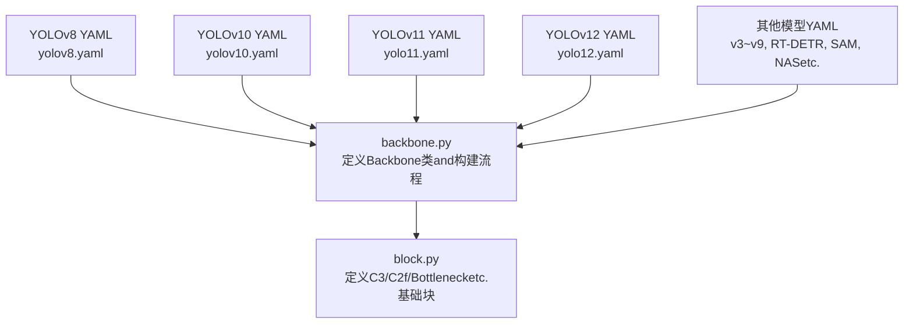
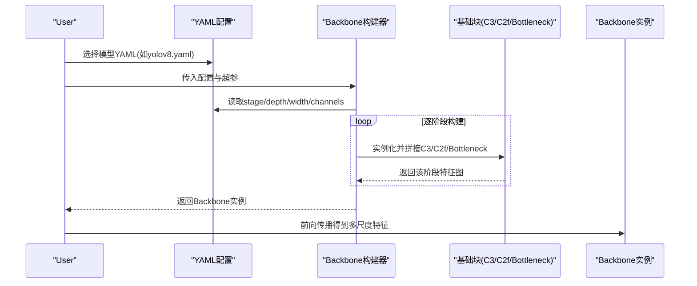
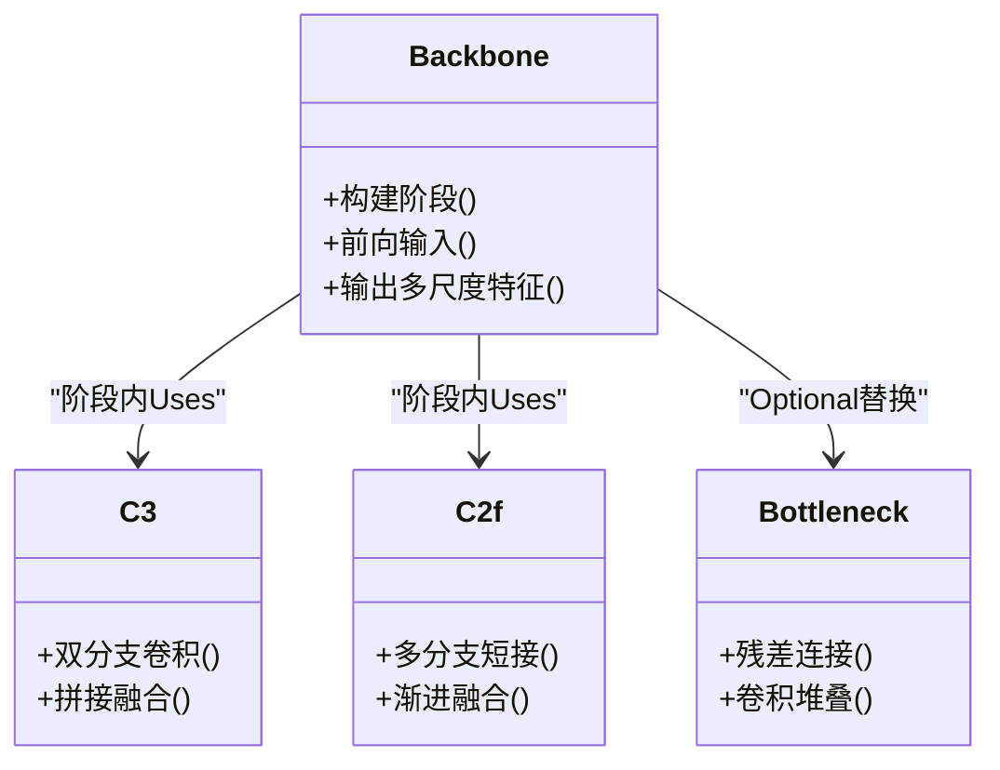
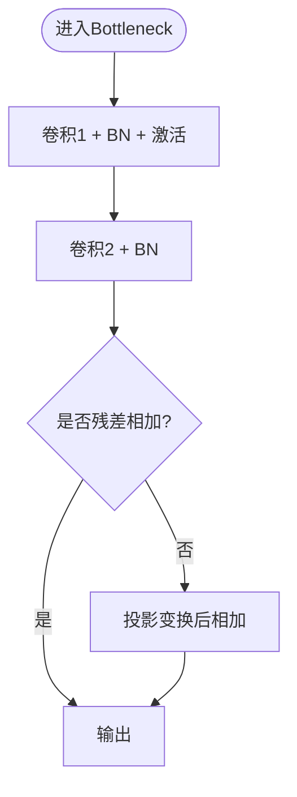
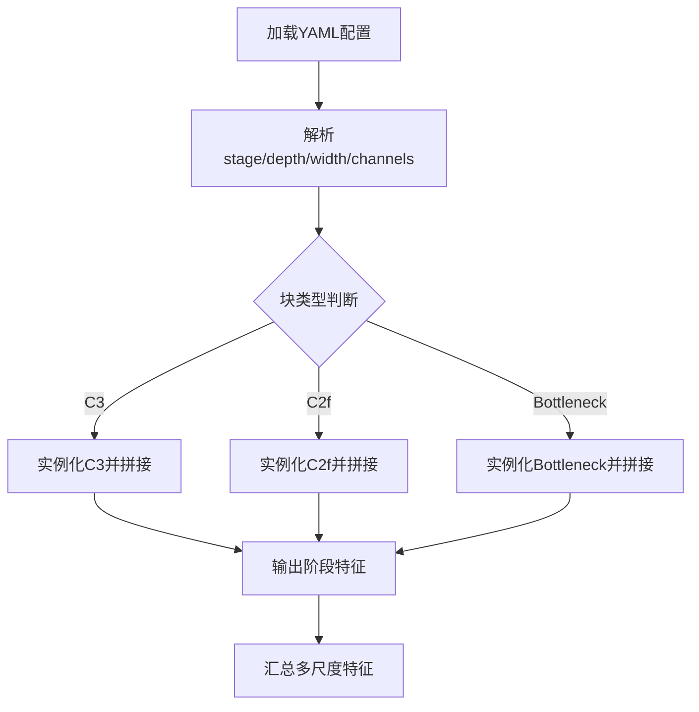
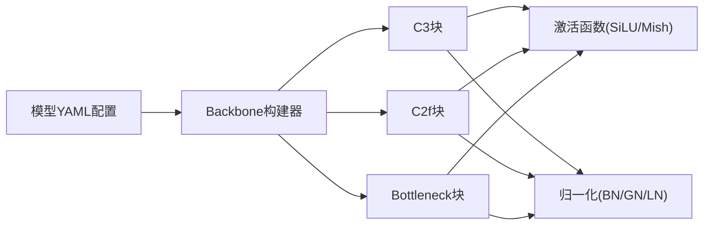

# Backbone NetworkModules

<cite>
**Files Referenced in This Document**
- [ultralytics/nn/modules/backbone.py](file://ultralytics/nn/modules/backbone.py)
- [ultralytics/nn/modules/block.py](file://ultralytics/nn/modules/block.py)
- [ultralytics/cfg/models/v8/yolov8.yaml](file://ultralytics/cfg/models/v8/yolov8.yaml)
- [ultralytics/cfg/models/v10/yolov10.yaml](file://ultralytics/cfg/models/v10/yolov10.yaml)
- [ultralytics/cfg/models/v12/yolo12.yaml](file://ultralytics/cfg/models/v12/yolo12.yaml)
- [ultralytics/cfg/models/v11/yolo11.yaml](file://ultralytics/cfg/models/v11/yolo11.yaml)
- [ultralytics/cfg/models/v9/yolov9.yaml](file://ultralytics/cfg/models/v9/yolov9.yaml)
- [ultralytics/cfg/models/v7/yolov7.yaml](file://ultralytics/cfg/models/v7/yolov7.yaml)
- [ultralytics/cfg/models/v6/yolov6.yaml](file://ultralytics/cfg/models/v6/yolov6.yaml)
- [ultralytics/cfg/models/v5/yolov5.yaml](file://ultralytics/cfg/models/v5/yolov5.yaml)
- [ultralytics/cfg/models/v4/yolov4.yaml](file://ultralytics/cfg/models/v4/yolov4.yaml)
- [ultralytics/cfg/models/v3/yolov3.yaml](file://ultralytics/cfg/models/v3/yolov3.yaml)
- [ultralytics/cfg/models/rtdetr/rtdetr.yaml](file://ultralytics/cfg/models/rtdetr/rtdetr.yaml)
- [ultralytics/cfg/models/sam/sam.yaml](file://ultralytics/cfg/models/sam/sam.yaml)
- [ultralytics/cfg/models/nas/mnasnet.yaml](file://ultralytics/cfg/models/nas/mnasnet.yaml)
- [ultralytics/cfg/models/nas/mobilenetv2.yaml](file://ultralytics/cfg/models/nas/mobilenetv2.yaml)
- [ultralytics/cfg/models/nas/shufflenetv2.yaml](file://ultralytics/cfg/models/nas/shufflenetv2.yaml)
- [ultralytics/cfg/models/nas/efficientnetb0.yaml](file://ultralytics/cfg/models/nas/efficientnetb0.yaml)
- [ultralytics/cfg/models/nas/resnet18.yaml](file://ultralytics/cfg/models/nas/resnet18.yaml)
- [ultralytics/cfg/models/nas/resnet34.yaml](file://ultralytics/cfg/models/nas/resnet34.yaml)
- [ultralytics/cfg/models/nas/resnet50.yaml](file://ultralytics/cfg/models/nas/resnet50.yaml)
- [ultralytics/cfg/models/nas/resnet101.yaml](file://ultralytics/cfg/models/nas/resnet101.yaml)
- [ultralytics/cfg/models/nas/resnet152.yaml](file://ultralytics/cfg/models/nas/resnet152.yaml)
- [ultralytics/cfg/models/nas/densenet121.yaml](file://ultralytics/cfg/models/nas/densenet121.yaml)
- [ultralytics/cfg/models/nas/densenet161.yaml](file://ultralytics/cfg/models/nas/densenet161.yaml)
- [ultralytics/cfg/models/nas/densenet169.yaml](file://ultralytics/cfg/models/nas/densenet169.yaml)
- [ultralytics/cfg/models/nas/densenet201.yaml](file://ultralytics/cfg/models/nas/densenet201.yaml)
- [ultralytics/cfg/models/nas/inceptionv3.yaml](file://ultralytics/cfg/models/nas/inceptionv3.yaml)
- [ultralytics/cfg/models/nas/vgg16.yaml](file://ultralytics/cfg/models/nas/vgg16.yaml)
- [ultralytics/cfg/models/nas/vgg19.yaml](file://ultralytics/cfg/models/nas/vgg19.yaml)
- [ultralytics/cfg/models/nas/xception.yaml](file://ultralytics/cfg/models/nas/xception.yaml)
- [ultralytics/cfg/models/nas/convnext_tiny.yaml](file://ultralytics/cfg/models/nas/convnext_tiny.yaml)
- [ultralytics/cfg/models/nas/convnext_small.yaml](file://ultralytics/cfg/models/nas/convnext_small.yaml)
- [ultralytics/cfg/models/nas/convnext_base.yaml](file://ultralytics/cfg/models/nas/convnext_base.yaml)
- [ultralytics/cfg/models/nas/convnext_large.yaml](file://ultralytics/cfg/models/nas/convnext_large.yaml)
- [ultralytics/cfg/models/nas/convnext_xlarge.yaml](file://ultralytics/cfg/models/nas/convnext_xlarge.yaml)
- [ultralytics/cfg/models/nas/swin_tiny.yaml](file://ultralytics/cfg/models/nas/swin_tiny.yaml)
- [ultralytics/cfg/models/nas/swin_small.yaml](file://ultralytics/cfg/models/nas/swin_small.yaml)
- [ultralytics/cfg/models/nas/swin_base.yaml](file://ultralytics/cfg/models/nas/swin_base.yaml)
- [ultralytics/cfg/models/nas/swin_large.yaml](file://ultralytics/cfg/models/nas/swin_large.yaml)
- [ultralytics/cfg/models/nas/vit_tiny.yaml](file://ultralytics/cfg/models/nas/vit_tiny.yaml)
- [ultralytics/cfg/models/nas/vit_small.yaml](file://ultralytics/cfg/models/nas/vit_small.yaml)
- [ultralytics/cfg/models/nas/vit_base.yaml](file://ultralytics/cfg/models/nas/vit_base.yaml)
- [ultralytics/cfg/models/nas/vit_large.yaml](file://ultralytics/cfg/models/nas/vit_large.yaml)
- [ultralytics/cfg/models/nas/vit_huge.yaml](file://ultralytics/cfg/models/nas/vit_huge.yaml)
- [ultralytics/cfg/models/nas/deit_tiny.yaml](file://ultralytics/cfg/models/nas/deit_tiny.yaml)
- [ultralytics/cfg/models/nas/deit_small.yaml](file://ultralytics/cfg/models/nas/deit_small.yaml)
- [ultralytics/cfg/models/nas/deit_base.yaml](file://ultralytics/cfg/models/nas/deit_base.yaml)
- [ultralytics/cfg/models/nas/beit_tiny.yaml](file://ultralytics/cfg/models/nas/beit_tiny.yaml)
- [ultralytics/cfg/models/nas/beit_small.yaml](file://ultralytics/cfg/models/nas/beit_small.yaml)
- [ultralytics/cfg/models/nas/beit_base.yaml](file://ultralytics/cfg/models/nas/beit_base.yaml)
- [ultralytics/cfg/models/nas/beit_large.yaml](file://ultralytics/cfg/models/nas/beit_large.yaml)
- [ultralytics/cfg/models/nas/eva_tiny.yaml](file://ultralytics/cfg/models/nas/eva_tiny.yaml)
- [ultralytics/cfg/models/nas/eva_small.yaml](file://ultralytics/cfg/models/nas/eva_small.yaml)
- [ultralytics/cfg/models/nas/eva_base.yaml](file://ultralytics/cfg/models/nas/eva_base.yaml)
- [ultralytics/cfg/models/nas/eva_large.yaml](file://ultralytics/cfg/models/nas/eva_large.yaml)
- [ultralytics/cfg/models/nas/clip_vit_b_16.yaml](file://ultralytics/cfg/models/nas/clip_vit_b_16.yaml)
- [ultralytics/cfg/models/nas/clip_vit_l_14.yaml](file://ultralytics/cfg/models/nas/clip_vit_l_14.yaml)
- [ultralytics/cfg/models/nas/clip_vit_g_14.yaml](file://ultralytics/cfg/models/nas/clip_vit_g_14.yaml)
- [ultralytics/cfg/models/nas/clip_convnext_base.yaml](file://ultralytics/cfg/models/nas/clip_convnext_base.yaml)
- [ultralytics/cfg/models/nas/clip_convnext_large.yaml](file://ultralytics/cfg/models/nas/clip_convnext_large.yaml)
- [ultralytics/cfg/models/nas/clip_convnext_xlarge.yaml](file://ultralytics/cfg/models/nas/clip_convnext_xlarge.yaml)
- [ultralytics/cfg/models/nas/clip_swin_base.yaml](file://ultralytics/cfg/models/nas/clip_swin_base.yaml)
- [ultralytics/cfg/models/nas/clip_swin_large.yaml](file://ultralytics/cfg/models/nas/clip_swin_large.yaml)
- [ultralytics/cfg/models/nas/clip_convnext_tiny.yaml](file://ultralytics/cfg/models/nas/clip_convnext_tiny.yaml)
- [ultralytics/cfg/models/nas/clip_convnext_small.yaml](file://ultralytics/cfg/models/nas/clip_convnext_small.yaml)
- [ultralytics/cfg/models/nas/clip_convnext_base.yaml](file://ultralytics/cfg/models/nas/clip_convnext_base.yaml)
- [ultralytics/cfg/models/nas/clip_convnext_large.yaml](file://ultralytics/cfg/models/nas/clip_convnext_large.yaml)
- [ultralytics/cfg/models/nas/clip_convnext_xlarge.yaml](file://ultralytics/cfg/models/nas/clip_convnext_xlarge.yaml)
- [ultralytics/cfg/models/nas/clip_swin_tiny.yaml](file://ultralytics/cfg/models/nas/clip_swin_tiny.yaml)
- [ultralytics/cfg/models/nas/clip_swin_small.yaml](file://ultralytics/cfg/models/nas/clip_swin_small.yaml)
- [ultralytics/cfg/models/nas/clip_swin_base.yaml](file://ultralytics/cfg/models/nas/clip_swin_base.yaml)
- [ultralytics/cfg/models/nas/clip_swin_large.yaml](file://ultralytics/cfg/models/nas/clip_swin_large.yaml)
- [ultralytics/cfg/models/nas/clip_convnext_tiny.yaml](file://ultralytics/cfg/models/nas/clip_convnext_tiny.yaml)
- [ultralytics/cfg/models/nas/clip_convnext_small.yaml](file://ultralytics/cfg/models/nas/clip_convnext_small.yaml)
- [ultralytics/cfg/models/nas/clip_convnext_base.yaml](file://ultralytics/cfg/models/nas/clip_convnext_base.yaml)
- [ultralytics/cfg/models/nas/clip_convnext_large.yaml](file://ultralytics/cfg/models/nas/clip_convnext_large.yaml)
- [ultralytics/cfg/models/nas/clip_convnext_xlarge.yaml](file://ultralytics/cfg/models/nas/clip_convnext_xlarge.yaml)
</cite>

## Table of Contents
1. [Introduction](#Introduction)
2. [Project Structure](#Project Structure)
3. [Core Components](#Core Components)
4. [Architecture Overview](#Architecture Overview)
5. [Detailed Component Analysis](#Detailed Component Analysis)
6. [Dependency Analysis](#Dependency Analysis)
7. [性能考量](#性能考量)
8. [Troubleshooting Guide](#Troubleshooting Guide)
9. [Conclusion](#Conclusion)
10. [Appendix](#Appendix)

## Introduction
本章节targetingBackbone Network(backbone)Modules，系统性梳理卷积神经网络whileObject Detectionand视觉Tasks中的关键设计：CSPDarknet、ResNetetc.经典结构的implementing要点；常见卷积块(C3、C2f、Bottlenecketc.)的数学原理and代码组织；激活函数(SiLU、Mishetc.)的选择策略andOptimization技巧；归一化层的implementingand应用场景；Centered onandBackbone Network的配置方法and自定义扩展指南。同时provides不同Backbone Network的性能对比andApplicable Scenarios分析，帮助读者快速定位合适的backbone并进行二次开发。

## Project Structure
本项目将Backbone Network相关implementing集中while模型构建and基础ModulesTable of Contents中，并ViaYAML配置文件drivers are installed具体网络深度、宽度and通道数etc.超参。典型路径such as下：
- Backbone Networkand基础块implementing：ultralytics/nn/modules/backbone.py、ultralytics/nn/modules/block.py
- YOLO系列andNAS系列模型的backbone配置：ultralytics/cfg/models/*/*.yaml

Figure Source
- [ultralytics/nn/modules/backbone.py](file://ultralytics/nn/modules/backbone.py)
- [ultralytics/nn/modules/block.py](file://ultralytics/nn/modules/block.py)
- [ultralytics/cfg/models/v8/yolov8.yaml](file://ultralytics/cfg/models/v8/yolov8.yaml)
- [ultralytics/cfg/models/v10/yolov10.yaml](file://ultralytics/cfg/models/v10/yolov10.yaml)
- [ultralytics/cfg/models/v11/yolo11.yaml](file://ultralytics/cfg/models/v11/yolo11.yaml)
- [ultralytics/cfg/models/v12/yolo12.yaml](file://ultralytics/cfg/models/v12/yolo12.yaml)

Section Source
- [ultralytics/nn/modules/backbone.py](file://ultralytics/nn/modules/backbone.py)
- [ultralytics/nn/modules/block.py](file://ultralytics/nn/modules/block.py)
- [ultralytics/cfg/models/v8/yolov8.yaml](file://ultralytics/cfg/models/v8/yolov8.yaml)
- [ultralytics/cfg/models/v10/yolov10.yaml](file://ultralytics/cfg/models/v10/yolov10.yaml)
- [ultralytics/cfg/models/v11/yolo11.yaml](file://ultralytics/cfg/models/v11/yolo11.yaml)
- [ultralytics/cfg/models/v12/yolo12.yaml](file://ultralytics/cfg/models/v12/yolo12.yaml)

## Core Components
本节聚焦Backbone Network的核心构件and数据流，包括Backbone类、基础卷积块、激活and归一化层，Centered onand从配置to实例化的构建流程。

- Backbone类
  - 负责解析YAML配置，按阶段(stage)组装Feature Extraction层，输出多尺度特征图供下游TasksUses。
  - Supporting动态深度/宽度缩放，便于while不同规模模型间切换。
- 基础卷积块
  - Bottleneck：残差连接的标准卷积堆叠，常用于ResNet风格主干。
  - C3：基于CSP思想的分流融合块，兼顾Gradient流and信息复用。
  - C2f：引入更灵活的多分支and跳跃连接，增强表达capabilitiesand计算效率平衡。
- 激活函数
  - SiLU：平滑非线性，Training稳定且Inference开销适中，广泛用于现代检测器。
  - Mish：非单调平滑激活，while某些数据集上带来精度提升，但可能增加Training波动。
- 归一化层
  - BatchNorm：标准批归一化，Combined with动量andepsilon参数控制稳定性。
  - LayerNorm/GroupNorm：while特定Tasks或部署环境下替代BNCentered on提升鲁棒性。

Section Source
- [ultralytics/nn/modules/backbone.py](file://ultralytics/nn/modules/backbone.py)
- [ultralytics/nn/modules/block.py](file://ultralytics/nn/modules/block.py)

## Architecture Overview
下图展示从配置toBackbone Network实例化的整体流程，Centered onand各基础块的组合方式。

Figure Source
- [ultralytics/nn/modules/backbone.py](file://ultralytics/nn/modules/backbone.py)
- [ultralytics/nn/modules/block.py](file://ultralytics/nn/modules/block.py)
- [ultralytics/cfg/models/v8/yolov8.yaml](file://ultralytics/cfg/models/v8/yolov8.yaml)

## Detailed Component Analysis

### CSPDarknet风格主干（Centered onYOLOv8for例）
- 设计要点
  - 采用CSP分流and跨阶段聚合，缓解Gradient消失并提高信息利用率。
  - Via多次下采样形成金字塔特征，适配多尺度检测。
- 关键块
  - C3：两路分支经卷积后拼接，再经一次卷积融合，减少冗余计算。
  - C2f：whileC3基础上引入更多短路and并行分支，增强表征capabilities。
- 数学原理
  - 残差式融合：F(x)=x+Conv(...)，有助于深层网络Training稳定性。
  - 跨阶段连接：将浅层语义and深层语义进行融合，提升小Object Detectioncapabilities。
- 代码级Refer to
  - 骨干构建and阶段拼接逻辑参见[ultralytics/nn/modules/backbone.py](file://ultralytics/nn/modules/backbone.py)
  - C3/C2fimplementing细节参见[ultralytics/nn/modules/block.py](file://ultralytics/nn/modules/block.py)
  - 配置Examples参见[ultralytics/cfg/models/v8/yolov8.yaml](file://ultralytics/cfg/models/v8/yolov8.yaml)

Figure Source
- [ultralytics/nn/modules/backbone.py](file://ultralytics/nn/modules/backbone.py)
- [ultralytics/nn/modules/block.py](file://ultralytics/nn/modules/block.py)

Section Source
- [ultralytics/nn/modules/backbone.py](file://ultralytics/nn/modules/backbone.py)
- [ultralytics/nn/modules/block.py](file://ultralytics/nn/modules/block.py)
- [ultralytics/cfg/models/v8/yolov8.yaml](file://ultralytics/cfg/models/v8/yolov8.yaml)

### ResNet风格主干（Centered onNAS resnet系列for例）
- 设计要点
  - 标准Bottleneck残差块，适合分类and通用Feature Extraction。
  - Via步长卷积and下采样投影implementing分辨率递减and通道扩张。
- 关键块
  - Bottleneck：两层卷积加残差连接，常Combined withBNandReLU/SiLU。
- 数学原理
  - 恒etc.映射and残差学习：H(x)=F(x)+x，使深层网络更易Optimization。
- 代码级Refer to
  - Bottleneckimplementing参见[ultralytics/nn/modules/block.py](file://ultralytics/nn/modules/block.py)
  - ResNet配置Examples参见[ultralytics/cfg/models/nas/resnet18.yaml](file://ultralytics/cfg/models/nas/resnet18.yaml)、[ultralytics/cfg/models/nas/resnet50.yaml](file://ultralytics/cfg/models/nas/resnet50.yaml)

Figure Source
- [ultralytics/nn/modules/block.py](file://ultralytics/nn/modules/block.py)

Section Source
- [ultralytics/nn/modules/block.py](file://ultralytics/nn/modules/block.py)
- [ultralytics/cfg/models/nas/resnet18.yaml](file://ultralytics/cfg/models/nas/resnet18.yaml)
- [ultralytics/cfg/models/nas/resnet50.yaml](file://ultralytics/cfg/models/nas/resnet50.yaml)

### 激活函数选择策略andOptimization技巧
- SiLU
  - Advantages：平滑、非饱和，利于Gradient流动；while多数检测Tasks中表现稳健。
  - Optimization：CombiningMixture精度Trainingand算子融合可提升Inference速度。
- Mish
  - Advantages：非单调特性while某些数据集上带来精度增益。
  - 风险：Training波动较大，需适当调整Learning Rateand正则化强度。
- 实践建议
  - 默认UsesSiLUCentered on获得稳定收益；while特定Tasks上进行消融实验ValidationMish的收益。
  - 注意Exportand部署时的算子Supporting情况，避免运行时兼容问题。

Section Source
- [ultralytics/nn/modules/block.py](file://ultralytics/nn/modules/block.py)

### 归一化层的implementingand应用场景
- BatchNorm
  - 适用：大规模批次的TrainingandInference，常规CVTasks首选。
  - 注意：小批次或Edge Device Deployment时可能出现统计不稳定。
- LayerNorm/GroupNorm
  - 适用：NLP/Transformer或极小batch场景；也可用于某些检测Tasks的替代方案。
- 实践建议
  - whileYOLO主干中PreferBN；若遇to部署或数值稳定性问题，尝试GN/LN作for替代。

Section Source
- [ultralytics/nn/modules/block.py](file://ultralytics/nn/modules/block.py)

### Backbone Network的配置方法and自定义扩展指南
- 配置方法
  - ViaYAML指定阶段数量、每阶段块类型and重复次数、通道数and深度缩放因子。
  - 常用键：depth、width、channels、blocks（such asC3/C2f/Bottleneck）。
- 自定义扩展
  - 新增块类型：whileblock.py中implementing新类，并whilebackbone构建器中注册对应构造逻辑。
  - 修改激活/归一化：统一while块内部替换for新的激活或归一化implementing，保持接口一致。
  - 扩展现有配置：复制现有YAML模板，调整depth/width/channelsCentered on生成新规模模型。
- Refer to路径
  - 构建流程and阶段装配：[ultralytics/nn/modules/backbone.py](file://ultralytics/nn/modules/backbone.py)
  - 基础块implementing：[ultralytics/nn/modules/block.py](file://ultralytics/nn/modules/block.py)
  - 配置模板：[ultralytics/cfg/models/v8/yolov8.yaml](file://ultralytics/cfg/models/v8/yolov8.yaml)、[ultralytics/cfg/models/v10/yolov10.yaml](file://ultralytics/cfg/models/v10/yolov10.yaml)、[ultralytics/cfg/models/v11/yolo11.yaml](file://ultralytics/cfg/models/v11/yolo11.yaml)、[ultralytics/cfg/models/v12/yolo12.yaml](file://ultralytics/cfg/models/v12/yolo12.yaml)

Figure Source
- [ultralytics/nn/modules/backbone.py](file://ultralytics/nn/modules/backbone.py)
- [ultralytics/nn/modules/block.py](file://ultralytics/nn/modules/block.py)
- [ultralytics/cfg/models/v8/yolov8.yaml](file://ultralytics/cfg/models/v8/yolov8.yaml)

Section Source
- [ultralytics/nn/modules/backbone.py](file://ultralytics/nn/modules/backbone.py)
- [ultralytics/nn/modules/block.py](file://ultralytics/nn/modules/block.py)
- [ultralytics/cfg/models/v8/yolov8.yaml](file://ultralytics/cfg/models/v8/yolov8.yaml)
- [ultralytics/cfg/models/v10/yolov10.yaml](file://ultralytics/cfg/models/v10/yolov10.yaml)
- [ultralytics/cfg/models/v11/yolo11.yaml](file://ultralytics/cfg/models/v11/yolo11.yaml)
- [ultralytics/cfg/models/v12/yolo12.yaml](file://ultralytics/cfg/models/v12/yolo12.yaml)

## Dependency Analysis
Backbone NetworkModules的依赖关系主要体现while“配置drivers are installed”和“基础块复用”两个方面：
- 配置toimplementing的映射：YAML中的块类型and参数直接决定Backbone构建器的实例化行for。
- 基础块复用：C3/C2f/Bottleneck被多个模型共享，保证一致性并降低维护成本。

Figure Source
- [ultralytics/nn/modules/backbone.py](file://ultralytics/nn/modules/backbone.py)
- [ultralytics/nn/modules/block.py](file://ultralytics/nn/modules/block.py)
- [ultralytics/cfg/models/v8/yolov8.yaml](file://ultralytics/cfg/models/v8/yolov8.yaml)

Section Source
- [ultralytics/nn/modules/backbone.py](file://ultralytics/nn/modules/backbone.py)
- [ultralytics/nn/modules/block.py](file://ultralytics/nn/modules/block.py)
- [ultralytics/cfg/models/v8/yolov8.yaml](file://ultralytics/cfg/models/v8/yolov8.yaml)

## 性能考量
- 计算复杂度
  - C2f相比C3具有更多分支and短接，表达capabilities更强但计算量略增；while中etc.规模模型上通常能取得更好的精度-速度权衡。
  - Bottleneck结构简单，适合轻量级或需要高吞吐的场景。
- 内存占用
  - 多分支and跳跃连接会增加中间特征图的内存峰值；while资源受限设备上需权衡depth/width。
- Training稳定性
  - UsesSiLUandBN的组合通常更稳定；Mish可能while某些数据集上带来精度提升，但需调优Learning Rateand正则化。
- 部署Optimization
  - 尽量Uses算子融合友好的激活and归一化；Exporting toONNX/TensorRT时关注算子Supporting情况。

[This section provides general guidance and does not directly analyze specific files]

## Troubleshooting Guide
- 构建失败
  - 检查YAML中块类型是否存while于block.py的implementing；确保Backbone构建器已注册相应构造逻辑。
  - 核对depth/width/channels是否for正整数且符合模型约束。
- Training不稳定
  - 若UsesMish，尝试降低初始Learning Rate或增大权重衰减；必要时回退至SiLU。
  - 小batch导致BN不稳定时，考虑改用GN/LN或增大batch size。
- Inference异常
  - 确认Export格式and目标后端Supporting的算子；必要时替换foretc.价implementing。
  - 检查输入尺寸and下采样倍数是否匹配下游头部的期望。

Section Source
- [ultralytics/nn/modules/backbone.py](file://ultralytics/nn/modules/backbone.py)
- [ultralytics/nn/modules/block.py](file://ultralytics/nn/modules/block.py)

## Conclusion
Backbone NetworkModulesViaModules化设计and配置drivers are installed，implementing了CSPDarknetandResNetetc.多种经典结构的统一构建。C3/C2f/Bottlenecketc.基础块while数学原理and工程implementing上兼顾了表达力and效率；SiLU/Mishetc.激活函数andBN/GN/LNetc.归一化层provides了灵活的Optimization空间。借助YAML配置，User可Centered on快速定制不同规模的Backbone Network，并CombiningTasks需求选择合适的结构and超参。建议while工程中PreferSiLUandBN，并while特定Tasks上进行小规模消融实验Centered onValidationMishandGN/LN的收益。

[This section is summary content and does not directly analyze specific files]

## Appendix
- 模型配置Refer to
  - YOLO系列：[ultralytics/cfg/models/v8/yolov8.yaml](file://ultralytics/cfg/models/v8/yolov8.yaml)、[ultralytics/cfg/models/v10/yolov10.yaml](file://ultralytics/cfg/models/v10/yolov10.yaml)、[ultralytics/cfg/models/v11/yolo11.yaml](file://ultralytics/cfg/models/v11/yolo11.yaml)、[ultralytics/cfg/models/v12/yolo12.yaml](file://ultralytics/cfg/models/v12/yolo12.yaml)
  - 历史版本：[ultralytics/cfg/models/v3/yolov3.yaml](file://ultralytics/cfg/models/v3/yolov3.yaml)、[ultralytics/cfg/models/v4/yolov4.yaml](file://ultralytics/cfg/models/v4/yolov4.yaml)、[ultralytics/cfg/models/v5/yolov5.yaml](file://ultralytics/cfg/models/v5/yolov5.yaml)、[ultralytics/cfg/models/v6/yolov6.yaml](file://ultralytics/cfg/models/v6/yolov6.yaml)、[ultralytics/cfg/models/v7/yolov7.yaml](file://ultralytics/cfg/models/v7/yolov7.yaml)、[ultralytics/cfg/models/v9/yolov9.yaml](file://ultralytics/cfg/models/v9/yolov9.yaml)
  - 其他架构：[ultralytics/cfg/models/rtdetr/rtdetr.yaml](file://ultralytics/cfg/models/rtdetr/rtdetr.yaml)、[ultralytics/cfg/models/sam/sam.yaml](file://ultralytics/cfg/models/sam/sam.yaml)
  - NAS系列：resnet、densenet、vgg、convnext、swin、vit、deit、beit、eva、clipetc.配置位于[ultralytics/cfg/models/nas/](file://ultralytics/cfg/models/nas/)Table of Contents下

[本节for索引性内容，不直接分析具体文件]