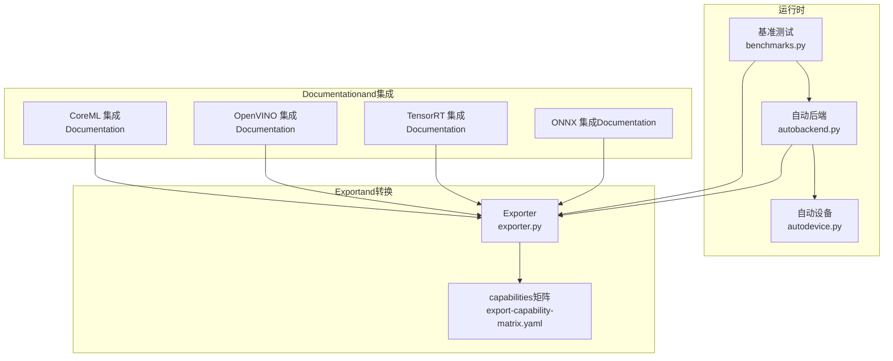
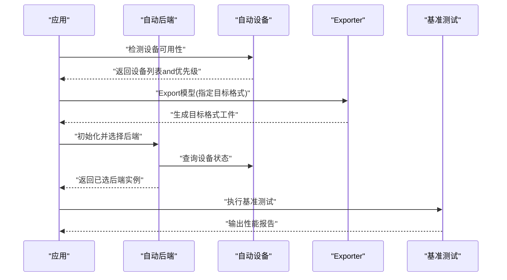
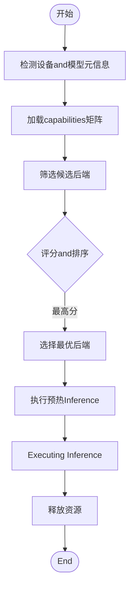
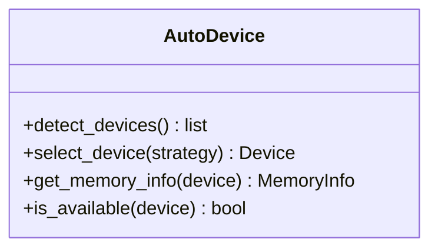
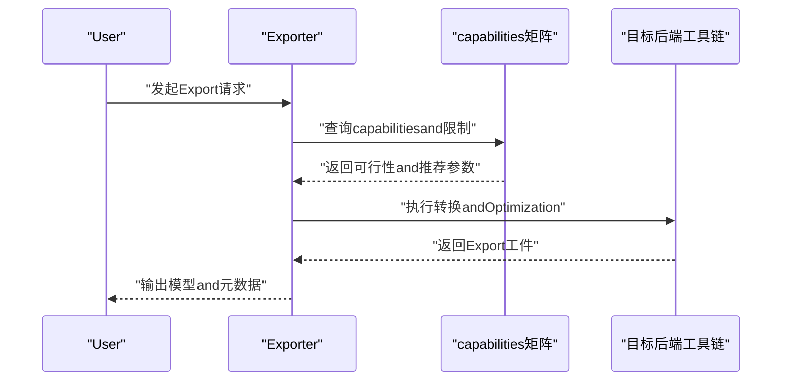
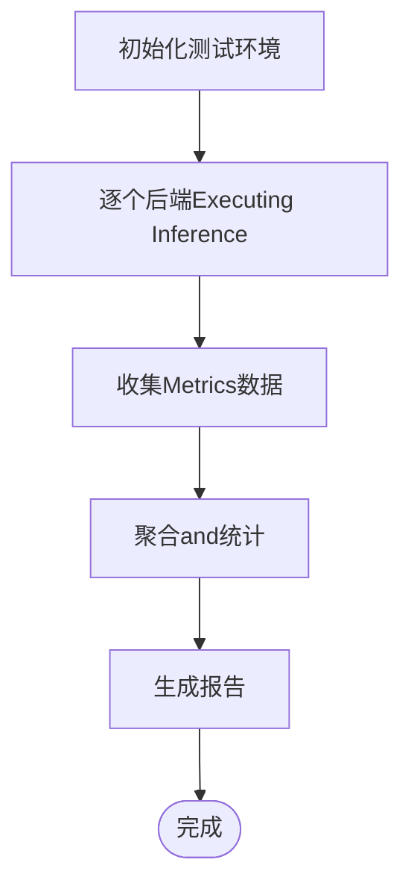
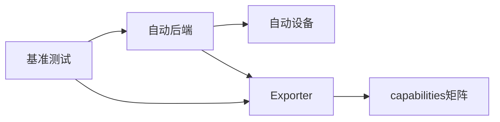

# 后端Adapter

<cite>
**Files Referenced in This Document**
- [autobackend.py](file://ultralytics/nn/autobackend.py)
- [exporter.py](file://ultralytics/engine/exporter.py)
- [autodevice.py](file://ultralytics/utils/autodevice.py)
- [benchmarks.py](file://ultralytics/utils/benchmarks.py)
- [test_autobackend_warmup.py](file://tests/test_autobackend_warmup.py)
- [test_adapter_backend_contract.py](file://tests/test_adapter_backend_contract.py)
- [export-capability-matrix.yaml](file://ultralytics/cfg/export-capability-matrix.yaml)
- [tensorrt.md](file://docs/en/integrations/tensorrt.md)
- [openvino.md](file://docs/en/integrations/openvino.md)
- [coreml.md](file://docs/en/integrations/coreml.md)
- [onnx.md](file://docs/en/integrations/onnx.md)
</cite>

## Table of Contents
1. [Introduction](#Introduction)
2. [Project Structure](#Project Structure)
3. [Core Components](#Core Components)
4. [Architecture Overview](#Architecture Overview)
5. [Detailed Component Analysis](#Detailed Component Analysis)
6. [Dependency Analysis](#Dependency Analysis)
7. [性能考量](#性能考量)
8. [Troubleshooting Guide](#Troubleshooting Guide)
9. [Conclusion](#Conclusion)
10. [Appendix](#Appendix)

## Introduction
本技术Documentation围绕“后端Adapter系统”unfold，聚焦多后端Supporting架构的设计模式and接口规范，深入解析Inference后端的集成方式（ONNX Runtime、TensorRT、OpenVINO、CoreMLetc.），说明自动后端选择算法的工作原理and性能Optimization策略，阐述Model Format转换andOptimizationworkflow，解释内存管理and设备适配的implementing机制，并provides新后端集成的开发指南and测试方法。同时汇总各后端的性能基准测试结果andApplicable Scenarios分析，帮助读者while不同硬件and部署环境下做出最优选择。

## Project Structure
后端Adapter相关代码主要分布whileCentered on下Modules：
- 自动后端andDevice Selection：位于 nn 层and utils 层，负责运行时设备探测、后端选择and预热。
- Exportand格式转换：位于 engine and utils/export，负责将Training好的Model Exportfor多种目标格式并执行预检查andcapabilities矩阵校验。
- 基准测试andEvaluation：位于 utils/benchmarks，provides跨后端统一的性能评测入口。
- 测试用例：位于 tests，覆盖自动后端预热、后端契约一致性etc.关键路径。
- Documentationandcapabilities矩阵：位于 docs and cfg，provides集成说明andExportcapabilities矩阵配置。

Figure Source
- [autobackend.py](file://ultralytics/nn/autobackend.py)
- [autodevice.py](file://ultralytics/utils/autodevice.py)
- [exporter.py](file://ultralytics/engine/exporter.py)
- [benchmarks.py](file://ultralytics/utils/benchmarks.py)
- [export-capability-matrix.yaml](file://ultralytics/cfg/export-capability-matrix.yaml)
- [onnx.md](file://docs/en/integrations/onnx.md)
- [tensorrt.md](file://docs/en/integrations/tensorrt.md)
- [openvino.md](file://docs/en/integrations/openvino.md)
- [coreml.md](file://docs/en/integrations/coreml.md)

Section Source
- [autobackend.py](file://ultralytics/nn/autobackend.py)
- [autodevice.py](file://ultralytics/utils/autodevice.py)
- [exporter.py](file://ultralytics/engine/exporter.py)
- [benchmarks.py](file://ultralytics/utils/benchmarks.py)
- [export-capability-matrix.yaml](file://ultralytics/cfg/export-capability-matrix.yaml)

## Core Components
- 自动后端（AutoBackend）
  - 职责：根据可用环境andModel Format，选择最优Inference后端；Encapsulates统一Inference接口；管理后端生命周期（加载、预热、释放）。
  - 关键点：设备探测、后端优先级、热启动缓存、错误降级。
- 自动设备（AutoDevice）
  - 职责：检测 CPU/GPU/NPU devices可用性；按策略选择运行设备；处理显存/内存约束。
- Exporter（Exporter）
  - 职责：将 PyTorch 模型转换for ONNX/TensorRT/OpenVINO/CoreML etc.格式；执行Export前检查andcapabilities矩阵Validation；生成可部署工件。
- 基准测试（Benchmarks）
  - 职责：对多后端进行延迟、吞吐、内存占用etc.Metrics的统一评测；输出对比报告。
- capabilities矩阵（Export Capability Matrix）
  - 职责：声明不同Tasks/模型/后端的capabilities组合；用于Export前可行性判断and回退策略。

Section Source
- [autobackend.py](file://ultralytics/nn/autobackend.py)
- [autodevice.py](file://ultralytics/utils/autodevice.py)
- [exporter.py](file://ultralytics/engine/exporter.py)
- [benchmarks.py](file://ultralytics/utils/benchmarks.py)
- [export-capability-matrix.yaml](file://ultralytics/cfg/export-capability-matrix.yaml)

## Architecture Overview
后端Adapter采用“Unified Interface + 多implementing + 自动选择”的架构模式：
- Unified Interface：Exposing a consistentInference API，屏蔽后端差异。
- 多implementing：针对 ONNX Runtime、TensorRT、OpenVINO、CoreML etc.后端provides具体implementing。
- 自动选择：基于设备capabilities、Model Format、Tasks类型and性能特征，动态选择最佳后端。
- Export链路：Training完成后ViaExporter生成目标格式，并进行capabilities矩阵校验andOptimization。

Figure Source
- [autobackend.py](file://ultralytics/nn/autobackend.py)
- [autodevice.py](file://ultralytics/utils/autodevice.py)
- [exporter.py](file://ultralytics/engine/exporter.py)
- [benchmarks.py](file://ultralytics/utils/benchmarks.py)

## Detailed Component Analysis

### 自动后端（AutoBackend）
- 设计要点
  - 后端注册and发现：维护后端implementing清单，Supporting按需加载。
  - 选择策略：Combining设备capabilities、Model Format、Tasks类型and历史性能数据，计算得分并选择最优后端。
  - 生命周期管理：加载权重、构建会话/引擎、预热、Inference、清理资源。
  - 错误处理：当某后端不可用或失败时，自动回退to次优后端。
- 关键流程
  - 初始化阶段：探测设备、读取模型元信息、加载capabilities矩阵。
  - 选择阶段：遍历候选后端，Evaluation兼容性、性能预估and资源占用。
  - 预热阶段：执行最小批次的InferenceCentered on稳定性能。
  - Inference阶段：统一输入预处理、Calls后端Inference、结果Post-Processing。
  - 清理阶段：释放会话/引擎句柄and内存。

Figure Source
- [autobackend.py](file://ultralytics/nn/autobackend.py)
- [export-capability-matrix.yaml](file://ultralytics/cfg/export-capability-matrix.yaml)

Section Source
- [autobackend.py](file://ultralytics/nn/autobackend.py)
- [export-capability-matrix.yaml](file://ultralytics/cfg/export-capability-matrix.yaml)

### 自动设备（AutoDevice）
- 功能概述
  - 枚举可用设备（CPU、GPU、NPU etc.），返回设备属性（such as显存大小、drivers are installed版本）。
  - 依据策略选择运行设备（优先 GPU，其次 NPU，最后 CPU）。
  - 处理设备切换and资源隔离，避免跨设备数据拷贝开销。
- 典型行for
  - while Windows/Linux/macOS 上分别处理 CUDA/MPS/NPU 的检测逻辑。
  - 当显存不足时，自动降级至 CPU 或较小批处理。

Figure Source
- [autodevice.py](file://ultralytics/utils/autodevice.py)

Section Source
- [autodevice.py](file://ultralytics/utils/autodevice.py)

### Exporter（Exporter）
- 功能概述
  - 将 PyTorch Model Exportfor ONNX、TensorRT、OpenVINO、CoreML etc.格式。
  - 执行Export前检查（算子Supporting、输入形状、精度设置）。
  - Usescapabilities矩阵ValidationExport可行性，必要时Tips回退方案。
- Export流程
  - 准备阶段：解析模型and配置，确定目标格式andOptimization选项。
  - 转换阶段：Calls对应后端工具链完成格式转换。
  - Validation阶段：执行capabilities矩阵校验and简单InferenceValidation。
  - 输出阶段：保存模型工件and元数据。

Figure Source
- [exporter.py](file://ultralytics/engine/exporter.py)
- [export-capability-matrix.yaml](file://ultralytics/cfg/export-capability-matrix.yaml)

Section Source
- [exporter.py](file://ultralytics/engine/exporter.py)
- [export-capability-matrix.yaml](file://ultralytics/cfg/export-capability-matrix.yaml)

### 基准测试（Benchmarks）
- 功能概述
  - 对多后端进行统一评测，包括延迟、吞吐、内存占用、功耗etc.Metrics。
  - Supporting批量测试and回归对比，生成Visualization报告。
- 测试流程
  - 配置阶段：选择模型、数据集、后端andMetrics。
  - 执行阶段：对每个后端执行多次Inference，收集统计信息。
  - 报告阶段：汇总结果并输出对比图表。

Figure Source
- [benchmarks.py](file://ultralytics/utils/benchmarks.py)

Section Source
- [benchmarks.py](file://ultralytics/utils/benchmarks.py)

### 集成Documentationandcapabilities矩阵
- 集成Documentation
  - ONNX：通用中间格式，跨平台兼容性好，适合多后端Unified entry point。
  - TensorRT：NVIDIA GPU 高性能Inference，需特定drivers are installedand库Supporting。
  - OpenVINO：Intel CPU/NPU Optimization，适合边缘and服务器部署。
  - CoreML：Apple 生态Optimization，适合 iOS/macOS 设备。
- capabilities矩阵
  - 定义不同Tasks（检测、分割、姿态etc.）while各后端的ExportandInferencecapabilities。
  - 用于Export前可行性判断and回退策略。

Section Source
- [onnx.md](file://docs/en/integrations/onnx.md)
- [tensorrt.md](file://docs/en/integrations/tensorrt.md)
- [openvino.md](file://docs/en/integrations/openvino.md)
- [coreml.md](file://docs/en/integrations/coreml.md)
- [export-capability-matrix.yaml](file://ultralytics/cfg/export-capability-matrix.yaml)

## Dependency Analysis
- 组件耦合
  - 自动后端依赖自动设备andExporter，用于设备探测and模型工件获取。
  - Exporter依赖capabilities矩阵，用于Export可行性and参数建议。
  - 基准测试依赖自动后端andExporter，用于端to端评测。
- External Dependencies
  - ONNX Runtime、TensorRT、OpenVINO、CoreML etc.第三方库。
  - Operating Systemand硬件drivers are installed（CUDA、MPS、NPU SDK etc.）。

Figure Source
- [autobackend.py](file://ultralytics/nn/autobackend.py)
- [autodevice.py](file://ultralytics/utils/autodevice.py)
- [exporter.py](file://ultralytics/engine/exporter.py)
- [benchmarks.py](file://ultralytics/utils/benchmarks.py)
- [export-capability-matrix.yaml](file://ultralytics/cfg/export-capability-matrix.yaml)

Section Source
- [autobackend.py](file://ultralytics/nn/autobackend.py)
- [autodevice.py](file://ultralytics/utils/autodevice.py)
- [exporter.py](file://ultralytics/engine/exporter.py)
- [benchmarks.py](file://ultralytics/utils/benchmarks.py)
- [export-capability-matrix.yaml](file://ultralytics/cfg/export-capability-matrix.yaml)

## 性能考量
- 后端选择策略
  - 基于设备capabilities（显存、算力）、模型复杂度andTasks类型，综合评分选择最优后端。
  - 引入历史性能数据and预热结果，提升选择准确性。
- 内存管理
  - 控制Batch Sizeand张量精度，避免显存溢出。
  - and时释放会话/引擎句柄，减少内存碎片。
- Optimization技巧
  - 启用图级Optimization（such as TensorRT 的 FP16/INT8 量化）。
  - Uses内核融合and算子替换，降低运行时开销。
  - Set appropriately线程数and并行度，平衡延迟and吞吐。

[This section provides general guidance and does not directly analyze specific files]

## Troubleshooting Guide
- 常见问题
  - 后端不可用：检查drivers are installedand库安装，确认设备可用性。
  - Export Failure：核对capabilities矩阵and模型算子Supporting，调整Export参数。
  - 性能异常：检查预热是否执行，确认批大小and精度设置。
- 调试建议
  - 启用Loggingand诊断输出，定位错误堆栈。
  - Uses最小复现用例，逐步缩小问题范围。
  - 对比不同后端的基准测试结果，识别bottlenecks点。

Section Source
- [test_autobackend_warmup.py](file://tests/test_autobackend_warmup.py)
- [test_adapter_backend_contract.py](file://tests/test_adapter_backend_contract.py)

## Conclusion
后端Adapter系统ViaUnified Interfaceand自动选择机制，有效屏蔽了多后端差异，提升了部署灵活性and性能表现。CombiningExporterandcapabilities矩阵，implementing了从Trainingto部署的完整链路自动化。建议while工程实践中Combining业务场景and硬件条件，选择合适的后端andOptimization策略，并Via基准测试持续Validationand调优。

[This section is summary content and does not directly analyze specific files]

## Appendix
- 新后端集成开发指南
  - 定义后端接口：implementing统一的Inference API（加载、预热、Inference、清理）。
  - 注册后端：while后端清单中登记新后端，provides元信息and依赖说明。
  - 更新capabilities矩阵：for新后端添加Tasksand模型的Supporting情况。
  - 编写测试用例：覆盖基本Inference、错误处理and性能回归。
- 测试方法
  - 单元测试：Validation后端接口的正确性and边界条件。
  - 集成测试：端to端ExportandInference流程Validation。
  - 基准测试：跨后端性能对比and回归检测。

[This section provides general guidance and does not directly analyze specific files]