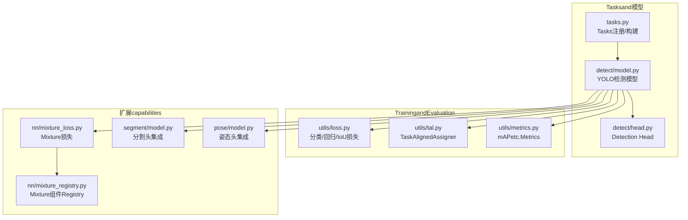
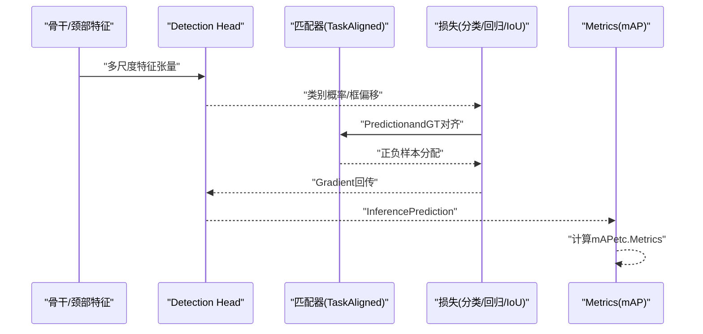
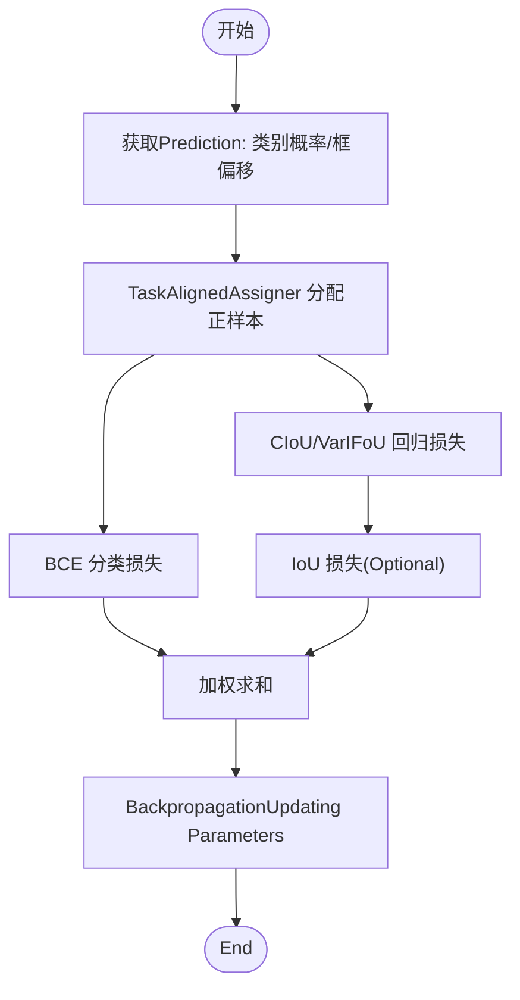
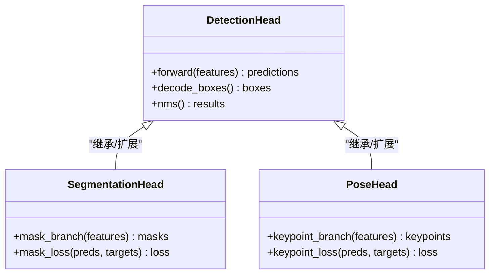
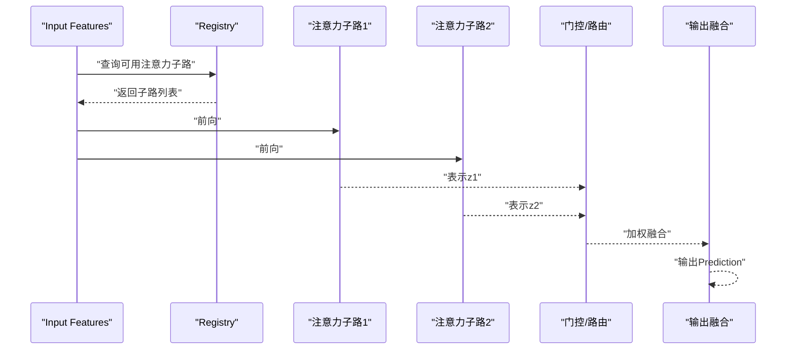
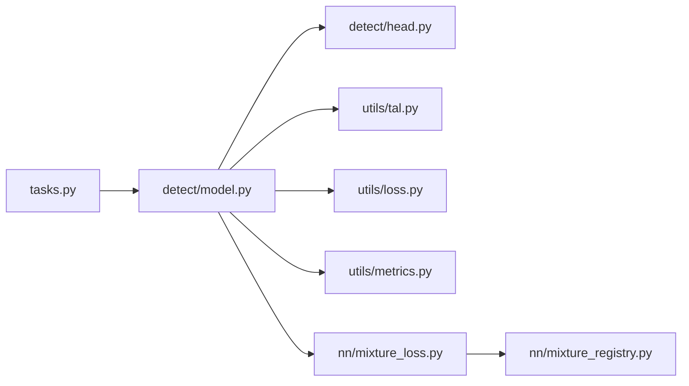

# Detection HeadModules

<cite>
**Files Referenced in This Document**
- [ultralytics/nn/tasks.py](file://ultralytics/nn/tasks.py)
- [ultralytics/models/yolo/detect/model.py](file://ultralytics/models/yolo/detect/model.py)
- [ultralytics/models/yolo/detect/head.py](file://ultralytics/models/yolo/detect/head.py)
- [ultralytics/utils/loss.py](file://ultralytics/utils/loss.py)
- [ultralytics/utils/tal.py](file://ultralytics/utils/tal.py)
- [ultralytics/utils/metrics.py](file://ultralytics/utils/metrics.py)
- [ultralytics/nn/mixture_loss.py](file://ultralytics/nn/mixture_loss.py)
- [ultralytics/nn/mixture_registry.py](file://ultralytics/nn/mixture_registry.py)
- [ultralytics/models/yolo/segment/model.py](file://ultralytics/models/yolo/segment/model.py)
- [ultralytics/models/yolo/pose/model.py](file://ultralytics/models/yolo/pose/model.py)
- [tests/test_moa.py](file://tests/test_moa.py)
- [tests/test_moa_mot_ddp_math.py](file://tests/test_moa_mot_ddp_math.py)
</cite>

## Table of Contents
1. [Introduction](#Introduction)
2. [Project Structure](#Project Structure)
3. [Core Components](#Core Components)
4. [Architecture Overview](#Architecture Overview)
5. [Detailed Component Analysis](#Detailed Component Analysis)
6. [Dependency Analysis](#Dependency Analysis)
7. [性能考量](#性能考量)
8. [Troubleshooting Guide](#Troubleshooting Guide)
9. [Conclusion](#Conclusion)
10. [Appendix](#Appendix)

## Introduction
本技术Documentation聚焦于Detection Head（Detection Head）Modules，系统梳理 Anchor-based and Anchor-free 两种范式whileimplementing上的差异、优缺点andApplicable Scenarios；深入解析 YOLO 系列Detection Head的Loss Function设计（分类损失、回归损失、IoU 损失）and其数学动机；阐述Tasks特定头部（such as分割头、Pose Estimation头）的设计模式；介绍 MoA（Mixture of Attention）Detection Head的MixtureAttention Mechanism；并provides配置参数详解、性能Optimization策略、精度分析and错误诊断方法。

## Project Structure
检测相关代码主要分布whileCentered on下位置：
- Tasksand模型装配：ultralytics/nn/tasks.py
- YOLO 检测模型andDetection Head：ultralytics/models/yolo/detect/model.py, ultralytics/models/yolo/detect/head.py
- 损失and匹配策略：ultralytics/utils/loss.py, ultralytics/utils/tal.py
- Metrics计算：ultralytics/utils/metrics.py
- Mixture注意力andMixture损失：ultralytics/nn/mixture_loss.py, ultralytics/nn/mixture_registry.py
- Tasks特定头部Examples（分割、姿态）：ultralytics/models/yolo/segment/model.py, ultralytics/models/yolo/pose/model.py
- MoA 测试用例：tests/test_moa.py, tests/test_moa_mot_ddp_math.py

Figure Source
- [ultralytics/nn/tasks.py](file://ultralytics/nn/tasks.py)
- [ultralytics/models/yolo/detect/model.py](file://ultralytics/models/yolo/detect/model.py)
- [ultralytics/models/yolo/detect/head.py](file://ultralytics/models/yolo/detect/head.py)
- [ultralytics/utils/loss.py](file://ultralytics/utils/loss.py)
- [ultralytics/utils/tal.py](file://ultralytics/utils/tal.py)
- [ultralytics/utils/metrics.py](file://ultralytics/utils/metrics.py)
- [ultralytics/nn/mixture_loss.py](file://ultralytics/nn/mixture_loss.py)
- [ultralytics/nn/mixture_registry.py](file://ultralytics/nn/mixture_registry.py)
- [ultralytics/models/yolo/segment/model.py](file://ultralytics/models/yolo/segment/model.py)
- [ultralytics/models/yolo/pose/model.py](file://ultralytics/models/yolo/pose/model.py)

Section Source
- [ultralytics/nn/tasks.py](file://ultralytics/nn/tasks.py)
- [ultralytics/models/yolo/detect/model.py](file://ultralytics/models/yolo/detect/model.py)
- [ultralytics/models/yolo/detect/head.py](file://ultralytics/models/yolo/detect/head.py)
- [ultralytics/utils/loss.py](file://ultralytics/utils/loss.py)
- [ultralytics/utils/tal.py](file://ultralytics/utils/tal.py)
- [ultralytics/utils/metrics.py](file://ultralytics/utils/metrics.py)
- [ultralytics/nn/mixture_loss.py](file://ultralytics/nn/mixture_loss.py)
- [ultralytics/nn/mixture_registry.py](file://ultralytics/nn/mixture_registry.py)
- [ultralytics/models/yolo/segment/model.py](file://ultralytics/models/yolo/segment/model.py)
- [ultralytics/models/yolo/pose/model.py](file://ultralytics/models/yolo/pose/model.py)

## Core Components
- Detection Head（Anchor-free）：基于特征图逐点Prediction类别概率and边界框偏移，Combining动态正样本分配策略进行Training。
- Tasks特定头部：while通用Detection Head基础上扩展分支，输出实例掩码或关键点坐标and other tasks专属结果。
- 损失and匹配：分类损失、回归损失、IoU Loss combination，Combined with TaskAlignedAssigner 完成高质量正负样本选择。
- Mixture注意力（MoA）：Via多注意力子路径的加权融合提升表征capabilities，并可ViaRegistry灵活接入。

Section Source
- [ultralytics/models/yolo/detect/head.py](file://ultralytics/models/yolo/detect/head.py)
- [ultralytics/utils/tal.py](file://ultralytics/utils/tal.py)
- [ultralytics/utils/loss.py](file://ultralytics/utils/loss.py)
- [ultralytics/nn/mixture_loss.py](file://ultralytics/nn/mixture_loss.py)
- [ultralytics/nn/mixture_registry.py](file://ultralytics/nn/mixture_registry.py)

## Architecture Overview
YOLO 检测流程中，Detection Head负责将Backbone Network输出的多尺度特征映射for最终Prediction：类别置信度and边界框参数。Training阶段由损失Modulesand匹配器共同drivers are installed学习；Inference阶段则ViaPost-Processing（NMS/TopK）得to最终检测结果。

Figure Source
- [ultralytics/models/yolo/detect/head.py](file://ultralytics/models/yolo/detect/head.py)
- [ultralytics/utils/tal.py](file://ultralytics/utils/tal.py)
- [ultralytics/utils/loss.py](file://ultralytics/utils/loss.py)
- [ultralytics/utils/metrics.py](file://ultralytics/utils/metrics.py)

## Detailed Component Analysis

### Anchor-based and Anchor-free Detection Head对比
- Anchor-based
  - Advantages：先验丰富，对小目标and常见形状有较好初始化；易于and经典Post-Processing衔接。
  - 缺点：锚点数量大导致冗余计算；对超参敏感；跨域泛化需重新设计锚点集。
- Anchor-free
  - Advantages：无需预设锚点，减少超参and计算开销；and动态分配策略Combining更稳定；端to端简洁。
  - 缺点：对小目标and密集场景的正样本选择更依赖匹配策略；需要更强的分类and回归头设计。

while本仓库中，YOLO Detection Head采用 Anchor-free 范式，并Via TaskAlignedAssigner implementing高质量的正样本分配，从而兼顾精度and效率。

Section Source
- [ultralytics/models/yolo/detect/head.py](file://ultralytics/models/yolo/detect/head.py)
- [ultralytics/utils/tal.py](file://ultralytics/utils/tal.py)

### YOLO Detection HeadLoss Function设计and数学原理
- 分类损失
  - 通常采用 BCEWithLogitsLoss，直接对每类概率进行二值交叉熵，避免 Softmax 带来的数值不稳定and额外计算。
  - 标签平滑and焦点因子可缓解类别不平衡and易分样本主导问题。
- 回归损失
  - 常用 CIoU/VarIFoU/DIoU etc. IoU 族损失，强调重叠面积、中心距离and长宽比一致性，加速收敛并提高定位精度。
  - 部分implementingUses GIoU 作for兜底，确保非重叠情况下的Gradient信号。
- IoU 损失
  - 作for回归损失的补充或替代，直接OptimizationPrediction框and GT 的重叠度量，增强几何一致性。
- 正样本分配
  - TaskAlignedAssigner 根据类别置信度and IoU 的联合评分动态选择 Top-K 正样本，平衡分类and回归信号，降低误检and漏检。

Figure Source
- [ultralytics/utils/tal.py](file://ultralytics/utils/tal.py)
- [ultralytics/utils/loss.py](file://ultralytics/utils/loss.py)

Section Source
- [ultralytics/utils/loss.py](file://ultralytics/utils/loss.py)
- [ultralytics/utils/tal.py](file://ultralytics/utils/tal.py)

### Tasks特定头部（Segmentation/Pose）设计模式
- 分割头
  - whileDetection Head基础上增加掩码分支，输出and类别相关的实例掩码权重或直接像素级掩码。
  - 掩码损失常采用 Dice/BCE 组合，强化边界细节and前景一致性。
- Pose Estimation头
  - whileDetection Head基础上增加关键点分支，输出关键点坐标and可见性。
  - 关键点损失常用 MSE/SmoothL1，并Combining可见性权重抑制不可见点的干扰。

Figure Source
- [ultralytics/models/yolo/segment/model.py](file://ultralytics/models/yolo/segment/model.py)
- [ultralytics/models/yolo/pose/model.py](file://ultralytics/models/yolo/pose/model.py)
- [ultralytics/models/yolo/detect/head.py](file://ultralytics/models/yolo/detect/head.py)

Section Source
- [ultralytics/models/yolo/segment/model.py](file://ultralytics/models/yolo/segment/model.py)
- [ultralytics/models/yolo/pose/model.py](file://ultralytics/models/yolo/pose/model.py)
- [ultralytics/models/yolo/detect/head.py](file://ultralytics/models/yolo/detect/head.py)

### MoA（Mixture of Attention）Detection HeadandMixtureAttention Mechanism
- 设计思想
  - Via多个注意力子路径并行提取不同感受野and语义层次的表征，并Centered on可学习的门控或路由进行加权融合，增强模型表达capabilities。
- 注册and组合
  - 利用Mixture组件Registry统一管理and加载注意力子Modules，SupportingTraining时动态组合andInference时on-demand activation。
- Training稳定性
  - Via损失解耦and正则项控制各子路径贡献，避免某一路径主导导致退化。

Figure Source
- [ultralytics/nn/mixture_loss.py](file://ultralytics/nn/mixture_loss.py)
- [ultralytics/nn/mixture_registry.py](file://ultralytics/nn/mixture_registry.py)
- [tests/test_moa.py](file://tests/test_moa.py)
- [tests/test_moa_mot_ddp_math.py](file://tests/test_moa_mot_ddP_math.py)

Section Source
- [ultralytics/nn/mixture_loss.py](file://ultralytics/nn/mixture_loss.py)
- [ultralytics/nn/mixture_registry.py](file://ultralytics/nn/mixture_registry.py)
- [tests/test_moa.py](file://tests/test_moa.py)
- [tests/test_moa_mot_ddP_math.py](file://tests/test_moa_mot_ddP_math.py)

## Dependency Analysis
- Detection Head依赖Tasks装配接口Centered on正确注册and构建。
- Training阶段强依赖匹配器and损失Modules，二者共同决定正样本质量andOptimization方向。
- MetricsModules用于Validationand监控 mAP、召回率etc.关键性能。
- Mixture注意力ViaRegistryand损失Modules协同工作，保证可Extensibilityand稳定性。

Figure Source
- [ultralytics/nn/tasks.py](file://ultralytics/nn/tasks.py)
- [ultralytics/models/yolo/detect/model.py](file://ultralytics/models/yolo/detect/model.py)
- [ultralytics/models/yolo/detect/head.py](file://ultralytics/models/yolo/detect/head.py)
- [ultralytics/utils/tal.py](file://ultralytics/utils/tal.py)
- [ultralytics/utils/loss.py](file://ultralytics/utils/loss.py)
- [ultralytics/utils/metrics.py](file://ultralytics/utils/metrics.py)
- [ultralytics/nn/mixture_loss.py](file://ultralytics/nn/mixture_loss.py)
- [ultralytics/nn/mixture_registry.py](file://ultralytics/nn/mixture_registry.py)

Section Source
- [ultralytics/nn/tasks.py](file://ultralytics/nn/tasks.py)
- [ultralytics/models/yolo/detect/model.py](file://ultralytics/models/yolo/detect/model.py)
- [ultralytics/models/yolo/detect/head.py](file://ultralytics/models/yolo/detect/head.py)
- [ultralytics/utils/tal.py](file://ultralytics/utils/tal.py)
- [ultralytics/utils/loss.py](file://ultralytics/utils/loss.py)
- [ultralytics/utils/metrics.py](file://ultralytics/utils/metrics.py)
- [ultralytics/nn/mixture_loss.py](file://ultralytics/nn/mixture_loss.py)
- [ultralytics/nn/mixture_registry.py](file://ultralytics/nn/mixture_registry.py)

## 性能考量
- 匹配策略调优
  - 调整 Top-K and阈值Centered on平衡正样本数量and质量，避免过多噪声或过少信号。
- 损失权重配比
  - 分类、回归and IoU 损失的权重需随数据集难度and目标尺度分布进行微调。
- Data Augmentationand归一化
  - 合理的Data Augmentation（缩放、裁剪、MixUp/Copy-Paste）有助于提升小目标and遮挡场景鲁棒性。
- Mixture注意力（MoA）
  - 控制子路数量and门控复杂度，防止过度拟合；whileInference时可按场景选择性激活Centered on降低延迟。
- 部署Optimization
  - Exporting to ONNX/TensorRT 并进行算子融合and量化，显著降低Inference时延and内存占用。

[本节provides一般性指导，不直接分析具体文件]

## Troubleshooting Guide
- Training发散或 NaN
  - 检查Learning Rateand损失权重是否过大；确认 BCE and IoU implementing的数值稳定性。
  - 查看匹配器分配的负样本比例是否异常偏高。
- mAP 停滞或下降
  - 调整 Top-K and阈值；检查类别不平衡and数据标注质量。
  - ValidationPost-Processing NMS 阈值设置是否合理。
- MoA 不稳定
  - 检查门控权重是否出现极端值；引入正则项或限制子路深度。
  - 核对Registry加载顺序and参数初始化。

Section Source
- [ultralytics/utils/loss.py](file://ultralytics/utils/loss.py)
- [ultralytics/utils/tal.py](file://ultralytics/utils/tal.py)
- [ultralytics/nn/mixture_loss.py](file://ultralytics/nn/mixture_loss.py)
- [ultralytics/nn/mixture_registry.py](file://ultralytics/nn/mixture_registry.py)

## Conclusion
本仓库中的Detection Head采用 Anchor-free 范式，Combining TaskAlignedAssigner and分类/回归/IoU 损失，implementing了高效且稳定的Object Detection。Tasks特定头部ViaModules化扩展满足分割and姿态etc.多Tasks需求。MoA MixtureAttention Mechanismprovides了更强的表征capabilitiesand灵活性。Via合理的配置andOptimization策略，可while精度and效率之间取得良好平衡。

[This section is summary content and does not directly analyze specific files]

## Appendix
- 配置参数建议
  - 分类损失：BCEWithLogitsLoss，可启用标签平滑。
  - 回归损失：优先 CIoU/VarIFoU，必要时回退 GIoU。
  - 匹配器：Top-K and阈值根据数据集规模and目标密度调节。
  - MoA：子路数量and门控强度需Combining算力and精度目标权衡。
- Refer toimplementing路径
  - Detection Headand模型装配：[ultralytics/models/yolo/detect/head.py](file://ultralytics/models/yolo/detect/head.py), [ultralytics/models/yolo/detect/model.py](file://ultralytics/models/yolo/detect/model.py)
  - 匹配and损失：[ultralytics/utils/tal.py](file://ultralytics/utils/tal.py), [ultralytics/utils/loss.py](file://ultralytics/utils/loss.py)
  - MetricsandEvaluation：[ultralytics/utils/metrics.py](file://ultralytics/utils/metrics.py)
  - Mixture注意力andRegistry：[ultralytics/nn/mixture_loss.py](file://ultralytics/nn/mixture_loss.py), [ultralytics/nn/mixture_registry.py](file://ultralytics/nn/mixture_registry.py)
  - Tasks特定头部：[ultralytics/models/yolo/segment/model.py](file://ultralytics/models/yolo/segment/model.py), [ultralytics/models/yolo/pose/model.py](file://ultralytics/models/yolo/pose/model.py)
  - MoA 测试：[tests/test_moa.py](file://tests/test_moa.py), [tests/test_moa_mot_ddP_math.py](file://tests/test_moa_mot_ddP_math.py)