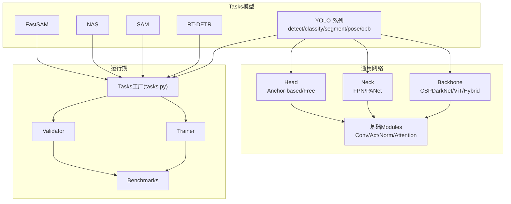
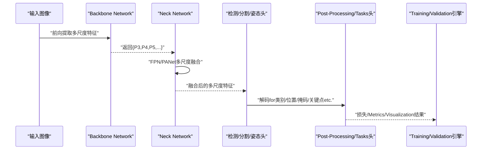
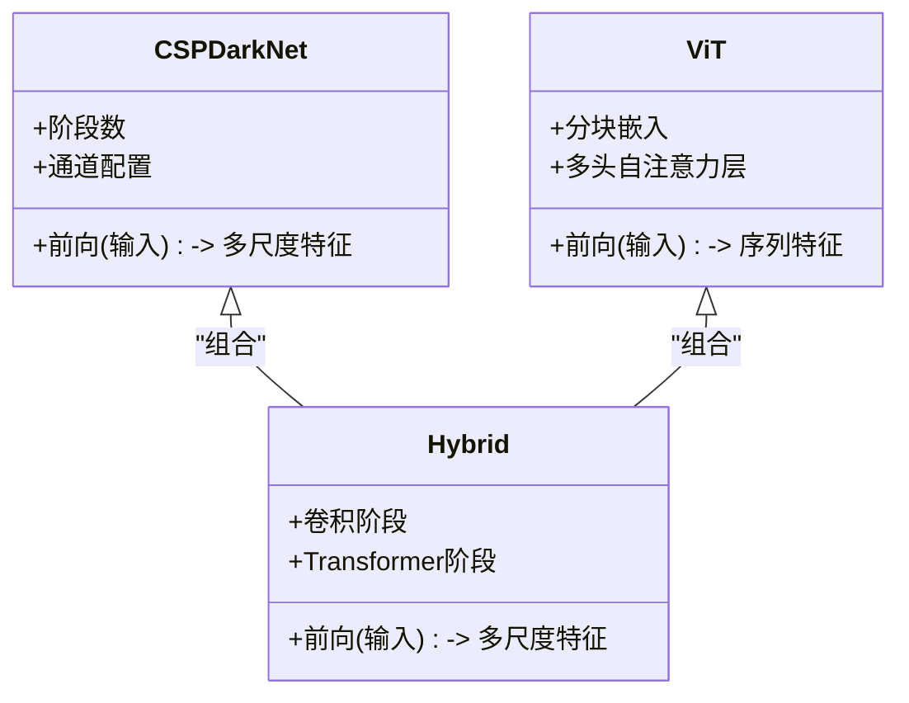
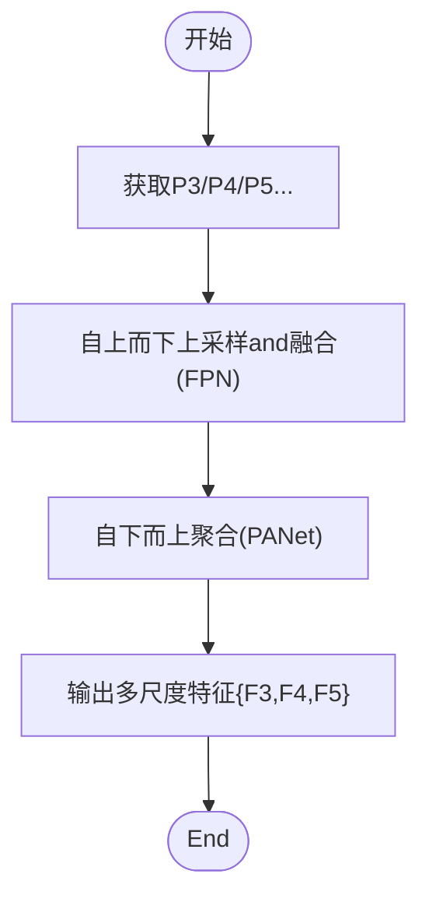
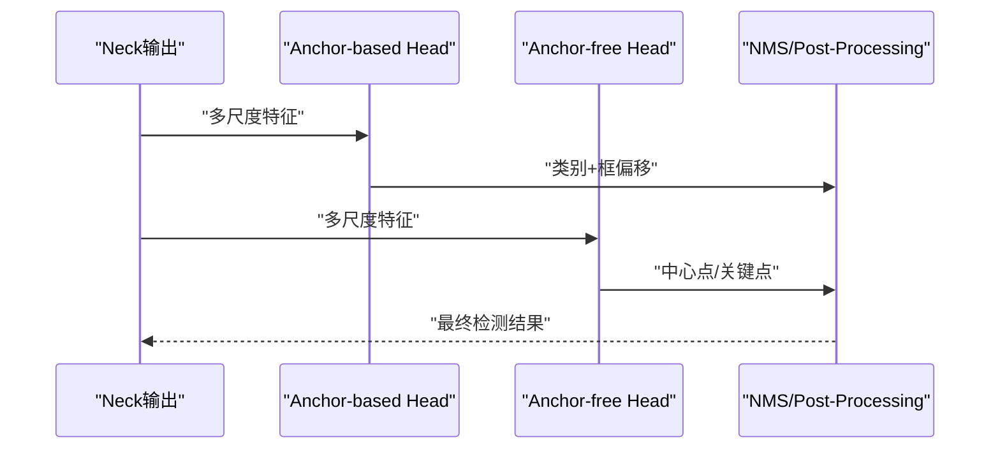
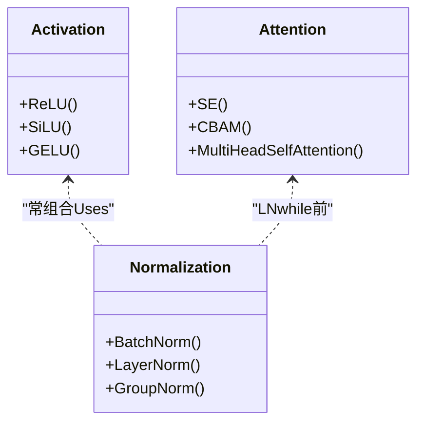
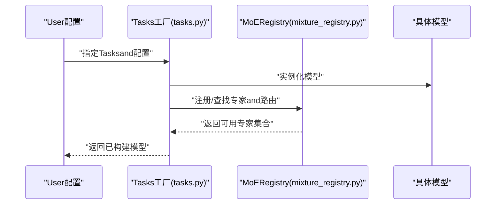

# Model Architecture Components

<cite>
**Files Referenced in This Document**
- [ultralytics/nn/tasks.py](file://ultralytics/nn/tasks.py)
- [ultralytics/models/yolo/model.py](file://ultralytics/models/yolo/model.py)
- [ultralytics/models/yolo/detect/train.py](file://ultralytics/models/yolo/detect/train.py)
- [ultralytics/models/yolo/detect/val.py](file://ultralytics/models/yolo/detect/val.py)
- [ultralytics/models/yolo/classify/model.py](file://ultralytics/models/yolo/classify/model.py)
- [ultralytics/models/yolo/segment/model.py](file://ultralytics/models/yolo/segment/model.py)
- [ultralytics/models/yolo/pose/model.py](file://ultralytics/models/yolo/pose/model.py)
- [ultralytics/models/yolo/obb/model.py](file://ultralytics/models/yolo/obb/model.py)
- [ultralytics/models/rtdetr/model.py](file://ultralytics/models/rtdetr/model.py)
- [ultralytics/models/sam/model.py](file://ultralytics/models/sam/model.py)
- [ultralytics/models/nas/model.py](file://ultralytics/models/nas/model.py)
- [ultralytics/models/fastsam/model.py](file://ultralytics/models/fastsam/model.py)
- [ultralytics/nn/mixture_registry.py](file://ultralytics/nn/mixture_registry.py)
- [ultralytics/nn/mixture_loss.py](file://ultralytics/nn/mixture_loss.py)
- [ultralytics/nn/modules/core.py](file://ultralytics/nn/modules/core.py)
- [ultralytics/nn/modules/head.py](file://ultralytics/nn/modules/head.py)
- [ultralytics/nn/modules/block.py](file://ultralytics/nn/modules/block.py)
- [ultralytics/nn/modules/transformer.py](file://ultralytics/nn/modules/transformer.py)
- [ultralytics/nn/modules/attention.py](file://ultralytics/nn/modules/attention.py)
- [ultralytics/nn/modules/conv.py](file://ultralytics/nn/modules/conv.py)
- [ultralytics/nn/modules/normalize.py](file://ultralytics/nn/modules/normalize.py)
- [ultralytics/nn/modules/activation.py](file://ultralytics/nn/modules/activation.py)
- [ultralytics/nn/modules/neck.py](file://ultralytics/nn/modules/neck.py)
- [ultralytics/nn/backbones/cspdarknet.py](file://ultralytics/nn/backbones/cspdarknet.py)
- [ultralytics/nn/backbones/vit.py](file://ultralytics/nn/backbones/vit.py)
- [ultralytics/nn/backbones/hybrid.py](file://ultralytics/nn/backbones/hybrid.py)
- [ultralytics/engine/trainer.py](file://ultralytics/engine/trainer.py)
- [ultralytics/engine/validator.py](file://ultralytics/engine/validator.py)
- [ultralytics/utils/benchmarks.py](file://ultralytics/utils/benchmarks.py)
- [ultralytics/utils/torch_utils.py](file://ultralytics/utils/torch_utils.py)
</cite>

## Table of Contents
1. [Introduction](#Introduction)
2. [Project Structure](#Project Structure)
3. [Core Components](#Core Components)
4. [Architecture Overview](#Architecture Overview)
5. [Detailed Component Analysis](#Detailed Component Analysis)
6. [Dependency Analysis](#Dependency Analysis)
7. [性能考量](#性能考量)
8. [Troubleshooting Guide](#Troubleshooting Guide)
9. [Conclusion](#Conclusion)
10. [Appendix](#Appendix)

## Introduction
本技术Documentation聚焦于YOLO-Master中“模型架构”的Core Components，系统性梳理Backbone Network(backbone)、Neck Network(neck)、Detection Head(head)的设计模式andimplementing原理，覆盖卷积、TransformerandMixture架构；阐述多尺度特征融合机制（such asFPN、PANet）；对比Anchor-basedandAnchor-free的Detection Head设计；详解激活函数、归一化层and注意力Modules的implementing要点；说明模型注册机制and动态加载系统的工作原理；并provides自定义Modules开发指南、最佳实践Centered onand复杂度分析and性能Evaluation方法。

## Project Structure
本项目采用Tasks导向的Modules化组织方式：
- 通用神经网络Modules集中于 nn 子包，包含backbone、neck、head、基础算子and注意力etc.
- 各Tasks模型位于 models 下对应Table of Contents，统一Via tasks.py 的Tasks工厂进行实例化
- TrainingandValidation流程由 engine provides，utils provides工具and基准评测capabilities

Figure Source
- [ultralytics/nn/tasks.py](file://ultralytics/nn/tasks.py)
- [ultralytics/models/yolo/model.py](file://ultralytics/models/yolo/model.py)
- [ultralytics/nn/backbones/cspdarknet.py](file://ultralytics/nn/backbones/cspdarknet.py)
- [ultralytics/nn/backbones/vit.py](file://ultralytics/nn/backbones/vit.py)
- [ultralytics/nn/backbones/hybrid.py](file://ultralytics/nn/backbones/hybrid.py)
- [ultralytics/nn/modules/neck.py](file://ultralytics/nn/modules/neck.py)
- [ultralytics/nn/modules/head.py](file://ultralytics/nn/modules/head.py)
- [ultralytics/engine/trainer.py](file://ultralytics/engine/trainer.py)
- [ultralytics/engine/validator.py](file://ultralytics/engine/validator.py)
- [ultralytics/utils/benchmarks.py](file://ultralytics/utils/benchmarks.py)

Section Source
- [ultralytics/nn/tasks.py](file://ultralytics/nn/tasks.py)
- [ultralytics/models/yolo/model.py](file://ultralytics/models/yolo/model.py)

## Core Components
- Backbone Network(backbone)
  - 卷积型：Centered onCSPDarkNetfor代表，强调跨阶段残差and通道重排，兼顾速度and精度
  - Transformer型：ViT类主干，利用自注意力建模全局上下文
  - Mixture型：将CNN局部归纳偏置andTransformer全局建模Combining，提升多尺度表征capabilities
- Neck Network(neck)
  - FPN：自上而下路径增强高层语义
  - PANet：自下而上路径强化低层定位信息
  - 多分支融合：while关键层级进行拼接或加权融合，形成稳定多尺度输出
- Detection Head(head)
  - Anchor-based：基于预设锚框回归类别and边界框偏移
  - Anchor-free：直接Prediction关键点或中心点，减少超参并简化Post-Processing
- 基础Modules
  - 激活函数：ReLU/SiLU/GELUetc.，不同Tasks对非线性强度有不同偏好
  - 归一化层：BN/LN/GroupNormetc.，适配不同批大小and部署环境
  - 注意力Modules：SE/CBAM/多头自注意力etc.，用于通道/空间/跨模态增强
- 模型注册and动态加载
  - ViaTasks工厂and配置drivers are installed，按名称解析并构建具体模型
  - SupportingMixture-of-Expertsetc.Dynamic Routingand专家选择

Section Source
- [ultralytics/nn/backbones/cspdarknet.py](file://ultralytics/nn/backbones/cspdarknet.py)
- [ultralytics/nn/backbones/vit.py](file://ultralytics/nn/backbones/vit.py)
- [ultralytics/nn/backbones/hybrid.py](file://ultralytics/nn/backbones/hybrid.py)
- [ultralytics/nn/modules/neck.py](file://ultralytics/nn/modules/neck.py)
- [ultralytics/nn/modules/head.py](file://ultralytics/nn/modules/head.py)
- [ultralytics/nn/modules/activation.py](file://ultralytics/nn/modules/activation.py)
- [ultralytics/nn/modules/normalize.py](file://ultralytics/nn/modules/normalize.py)
- [ultralytics/nn/modules/attention.py](file://ultralytics/nn/modules/attention.py)
- [ultralytics/nn/tasks.py](file://ultralytics/nn/tasks.py)

## Architecture Overview
下图展示从输入图像toTasks输出的端to端数据流，包括骨干提取、颈部融合、头部解码andTasks特定Post-Processing。

Figure Source
- [ultralytics/nn/backbones/cspdarknet.py](file://ultralytics/nn/backbones/cspdarknet.py)
- [ultralytics/nn/backbones/vit.py](file://ultralytics/nn/backbones/vit.py)
- [ultralytics/nn/backbones/hybrid.py](file://ultralytics/nn/backbones/hybrid.py)
- [ultralytics/nn/modules/neck.py](file://ultralytics/nn/modules/neck.py)
- [ultralytics/nn/modules/head.py](file://ultralytics/nn/modules/head.py)
- [ultralytics/engine/trainer.py](file://ultralytics/engine/trainer.py)
- [ultralytics/engine/validator.py](file://ultralytics/engine/validator.py)

## Detailed Component Analysis

### Backbone Network(backbone)
- CSPDarkNet（卷积主干）
  - 特点：跨阶段残差连接、bottlenecks块、通道重排，降低计算冗余，提高Gradient流动
  - 适用：实时检测、Mobile Deployment
- ViT（Transformer主干）
  - 特点：分块嵌入+多层自注意力，强全局建模capabilities
  - 适用：需要长程依赖的场景，Combined with高分辨率输入时计算开销较大
- Hybrid（Mixture主干）
  - 特点：早期Uses卷积捕获局部特征，后期引入Transformer增强全局交互
  - 适用：平衡效率and精度的通用场景

Figure Source
- [ultralytics/nn/backbones/cspdarknet.py](file://ultralytics/nn/backbones/cspdarknet.py)
- [ultralytics/nn/backbones/vit.py](file://ultralytics/nn/backbones/vit.py)
- [ultralytics/nn/backbones/hybrid.py](file://ultralytics/nn/backbones/hybrid.py)

Section Source
- [ultralytics/nn/backbones/cspdarknet.py](file://ultralytics/nn/backbones/cspdarknet.py)
- [ultralytics/nn/backbones/vit.py](file://ultralytics/nn/backbones/vit.py)
- [ultralytics/nn/backbones/hybrid.py](file://ultralytics/nn/backbones/hybrid.py)

### Neck Network(neck)
- FPN（Feature Pyramid Network）
  - 自上而下的路径增强高层语义，并Via上采样and侧路连接融合浅层细节
- PANet（Path Aggregation Network）
  - whileFPN基础上增加自下而上的聚合路径，强化低层定位信息
- 多尺度融合策略
  - 常见操作：逐元素相加、拼接(concat)、可学习权重融合
  - 输出：通常生成3~4个尺度的特征图，供后续头Uses

Figure Source
- [ultralytics/nn/modules/neck.py](file://ultralytics/nn/modules/neck.py)

Section Source
- [ultralytics/nn/modules/neck.py](file://ultralytics/nn/modules/neck.py)

### Detection Head(head)
- Anchor-based
  - 基于预设锚框，Prediction类别概率and边界框相对偏移
  - Advantages：成熟稳定，易于andNMS集成
  - 缺点：锚框超参敏感，需针对数据集调优
- Anchor-free
  - 直接Prediction目标中心点或关键点，无需锚框
  - Advantages：减少超参，简化Post-Processing
  - 缺点：对小目标and密集场景鲁棒性需加强

Figure Source
- [ultralytics/nn/modules/head.py](file://ultralytics/nn/modules/head.py)
- [ultralytics/models/yolo/detect/train.py](file://ultralytics/models/yolo/detect/train.py)
- [ultralytics/models/yolo/detect/val.py](file://ultralytics/models/yolo/detect/val.py)

Section Source
- [ultralytics/nn/modules/head.py](file://ultralytics/nn/modules/head.py)
- [ultralytics/models/yolo/detect/train.py](file://ultralytics/models/yolo/detect/train.py)
- [ultralytics/models/yolo/detect/val.py](file://ultralytics/models/yolo/detect/val.py)

### 激活函数、归一化层and注意力Modules
- 激活函数
  - ReLU/SiLU/GELUetc.，SiLU常用于轻量级主干，GELUwhileTransformer中更常见
- 归一化层
  - BN适合大batch，LN/GroupNormwhile小batch或Inference时更稳健
- 注意力Modules
  - SE/CBAM用于通道/空间注意力；多头自注意力用于全局建模
  - 可and卷积或Transformer阶段组合，提升表征capabilities

Figure Source
- [ultralytics/nn/modules/activation.py](file://ultralytics/nn/modules/activation.py)
- [ultralytics/nn/modules/normalize.py](file://ultralytics/nn/modules/normalize.py)
- [ultralytics/nn/modules/attention.py](file://ultralytics/nn/modules/attention.py)

Section Source
- [ultralytics/nn/modules/activation.py](file://ultralytics/nn/modules/activation.py)
- [ultralytics/nn/modules/normalize.py](file://ultralytics/nn/modules/normalize.py)
- [ultralytics/nn/modules/attention.py](file://ultralytics/nn/modules/attention.py)

### 模型注册机制and动态加载系统
- Tasks工厂
  - ViaUnified Interface根据Tasks类型and配置创建具体模型实例
  - SupportingYOLO、RT-DETR、SAM、NAS、FastSAMetc.多Tasks
- Mixture-of-Experts(MoE)注册
  - Viamixture_registry管理专家androuting strategies，Supporting动态加载and选择
- 动态加载
  - 运行时根据配置解析Modules名称，按需实例化and挂载

Figure Source
- [ultralytics/nn/tasks.py](file://ultralytics/nn/tasks.py)
- [ultralytics/nn/mixture_registry.py](file://ultralytics/nn/mixture_registry.py)
- [ultralytics/models/yolo/model.py](file://ultralytics/models/yolo/model.py)
- [ultralytics/models/rtdetr/model.py](file://ultralytics/models/rtdetr/model.py)
- [ultralytics/models/sam/model.py](file://ultralytics/models/sam/model.py)
- [ultralytics/models/nas/model.py](file://ultralytics/models/nas/model.py)
- [ultralytics/models/fastsam/model.py](file://ultralytics/models/fastsam/model.py)

Section Source
- [ultralytics/nn/tasks.py](file://ultralytics/nn/tasks.py)
- [ultralytics/nn/mixture_registry.py](file://ultralytics/nn/mixture_registry.py)
- [ultralytics/models/yolo/model.py](file://ultralytics/models/yolo/model.py)
- [ultralytics/models/rtdetr/model.py](file://ultralytics/models/rtdetr/model.py)
- [ultralytics/models/sam/model.py](file://ultralytics/models/sam/model.py)
- [ultralytics/models/nas/model.py](file://ultralytics/models/nas/model.py)
- [ultralytics/models/fastsam/model.py](file://ultralytics/models/fastsam/model.py)

### 自定义网络Modules开发指南and最佳实践
- 设计原则
  - 保持Modules内聚and接口清晰，遵循现有Conv/Act/Norm/Attention的组合范式
  - 避免隐式状态，确保可复现and可Export
- 注册and发现
  - 若需加入Tasks工厂或MoERegistry，需while相应注册处声明Modules名称and构造参数
- 兼容性
  - 保证andTraining/Validation引擎的输入输出契约一致
  - 考虑Export格式（ONNX/TensorRTetc.）的算子Supporting
- 测试and基准
  - provides单元测试and数值稳定性检查
  - Uses基准脚本Evaluation延迟and吞吐

Section Source
- [ultralytics/nn/modules/core.py](file://ultralytics/nn/modules/core.py)
- [ultralytics/nn/modules/conv.py](file://ultralytics/nn/modules/conv.py)
- [ultralytics/nn/modules/block.py](file://ultralytics/nn/modules/block.py)
- [ultralytics/nn/mixture_registry.py](file://ultralytics/nn/mixture_registry.py)
- [ultralytics/nn/tasks.py](file://ultralytics/nn/tasks.py)

### Tasks相关模型概览
- YOLO系列
  - detect/classify/segment/pose/obb分别对应不同Tasks头andPost-Processing逻辑
- RT-DETR
  - 基于Transformer的检测器，端to端Prediction，无需NMS
- SAM/FastSAM
  - 分割模型，targeting开放世界and快速Inference场景
- NAS
  - 神经架构搜索相关模型and流程

Section Source
- [ultralytics/models/yolo/detect/train.py](file://ultralytics/models/yolo/detect/train.py)
- [ultralytics/models/yolo/detect/val.py](file://ultralytics/models/yolo/detect/val.py)
- [ultralytics/models/yolo/classify/model.py](file://ultralytics/models/yolo/classify/model.py)
- [ultralytics/models/yolo/segment/model.py](file://ultralytics/models/yolo/segment/model.py)
- [ultralytics/models/yolo/pose/model.py](file://ultralytics/models/yolo/pose/model.py)
- [ultralytics/models/yolo/obb/model.py](file://ultralytics/models/yolo/obb/model.py)
- [ultralytics/models/rtdetr/model.py](file://ultralytics/models/rtdetr/model.py)
- [ultralytics/models/sam/model.py](file://ultralytics/models/sam/model.py)
- [ultralytics/models/nas/model.py](file://ultralytics/models/nas/model.py)
- [ultralytics/models/fastsam/model.py](file://ultralytics/models/fastsam/model.py)

## Dependency Analysis
- 组件耦合
  - backbone/neck/head之间Via明确的多尺度特征接口解耦
  - Tasks模型ViaTasks工厂统一接入，降低耦合度
- External Dependencies
  - Training/Validation引擎and基准工具provides标准接口，便于替换and扩展
- Potential Cycles依赖
  - ViaRegistryand工厂模式避免直接导入造成的循环

Figure Source
- [ultralytics/nn/tasks.py](file://ultralytics/nn/tasks.py)
- [ultralytics/engine/trainer.py](file://ultralytics/engine/trainer.py)
- [ultralytics/engine/validator.py](file://ultralytics/engine/validator.py)
- [ultralytics/utils/benchmarks.py](file://ultralytics/utils/benchmarks.py)

Section Source
- [ultralytics/nn/tasks.py](file://ultralytics/nn/tasks.py)
- [ultralytics/engine/trainer.py](file://ultralytics/engine/trainer.py)
- [ultralytics/engine/validator.py](file://ultralytics/engine/validator.py)
- [ultralytics/utils/benchmarks.py](file://ultralytics/utils/benchmarks.py)

## 性能考量
- 复杂度分析
  - 关注FLOPsand参数量，优先选择轻量化主干and高效融合策略
  - 小目标场景可适当增加浅层特征通道或引入注意力
- TrainingandInferenceOptimization
  - Set appropriately批大小andLearning Rate调度，避免Gradient爆炸/消失
  - UsesMixture精度and编译加速（such as适用）
- 基准Evaluation
  - Uses统一基准脚本Evaluation延迟、吞吐and精度，确保可比性

Section Source
- [ultralytics/utils/benchmarks.py](file://ultralytics/utils/benchmarks.py)
- [ultralytics/utils/torch_utils.py](file://ultralytics/utils/torch_utils.py)

## Troubleshooting Guide
- 常见问题
  - 维度不匹配：检查backbone/neck/head之间的通道and尺寸对齐
  - 数值不稳定：调整归一化andLearning Rate，必要时启用Gradient裁剪
  - Export Failure：确认Uses的算子while目标后端有Supporting
- 诊断建议
  - 打印中间特征分布and统计量
  - 逐步替换Modules定位问题来源
  - Uses最小可复现实例Validation

Section Source
- [ultralytics/nn/mixture_loss.py](file://ultralytics/nn/mixture_loss.py)
- [ultralytics/utils/torch_utils.py](file://ultralytics/utils/torch_utils.py)

## Conclusion
YOLO-Master的模型架构Centered on清晰的Modules化设计and统一的注册机制for核心，Supporting多种骨干、颈部and头的灵活组合。ViaCSPDarkNet、ViTandMixture主干，Centered onandFPN/PANetetc.融合策略，能够覆盖广泛的视觉Tasks需求。CombiningTasks工厂andMoERegistry，系统while可Extensibilityand动态加载方面具备良好工程实践。建议while自定义Modules开发时遵循接口契约andExport兼容性要求，并Uses基准工具进行系统化Evaluation。

## Appendix
- 术语
  - Backbone：负责从输入中提取多尺度特征
  - Neck：负责多尺度特征融合
  - Head：负责解码forTasks特定的输出
- Refer toimplementing路径
  - 骨干：[cspdarknet.py](file://ultralytics/nn/backbones/cspdarknet.py), [vit.py](file://ultralytics/nn/backbones/vit.py), [hybrid.py](file://ultralytics/nn/backbones/hybrid.py)
  - 颈部：[neck.py](file://ultralytics/nn/modules/neck.py)
  - 头部：[head.py](file://ultralytics/nn/modules/head.py)
  - 基础Modules：[core.py](file://ultralytics/nn/modules/core.py), [conv.py](file://ultralytics/nn/modules/conv.py), [block.py](file://ultralytics/nn/modules/block.py), [activation.py](file://ultralytics/nn/modules/activation.py), [normalize.py](file://ultralytics/nn/modules/normalize.py), [attention.py](file://ultralytics/nn/modules/attention.py)
  - Tasksand注册：[tasks.py](file://ultralytics/nn/tasks.py), [mixture_registry.py](file://ultralytics/nn/mixture_registry.py)
  - Tasks模型：[yolo/model.py](file://ultralytics/models/yolo/model.py), [rtdetr/model.py](file://ultralytics/models/rtdetr/model.py), [sam/model.py](file://ultralytics/models/sam/model.py), [nas/model.py](file://ultralytics/models/nas/model.py), [fastsam/model.py](file://ultralytics/models/fastsam/model.py)
  - 运行期：[trainer.py](file://ultralytics/engine/trainer.py), [validator.py](file://ultralytics/engine/validator.py), [benchmarks.py](file://ultralytics/utils/benchmarks.py), [torch_utils.py](file://ultralytics/utils/torch_utils.py)