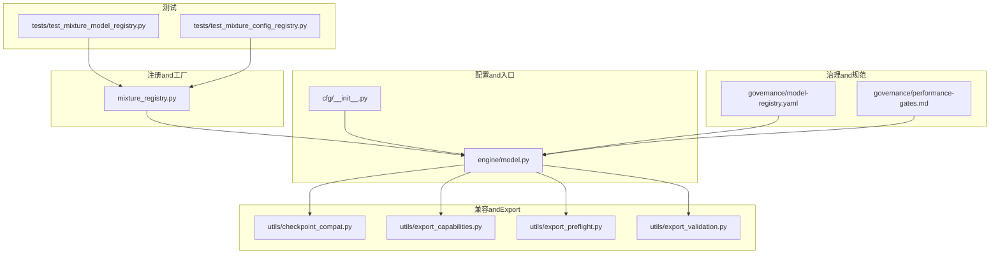
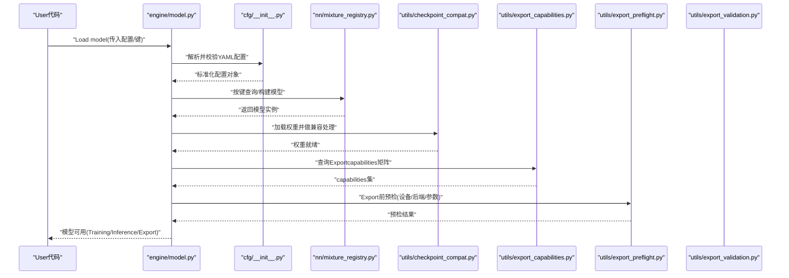
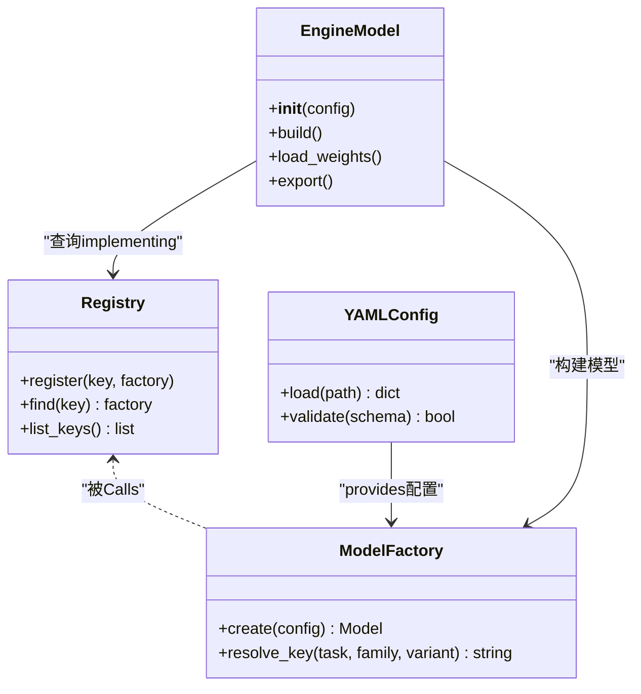
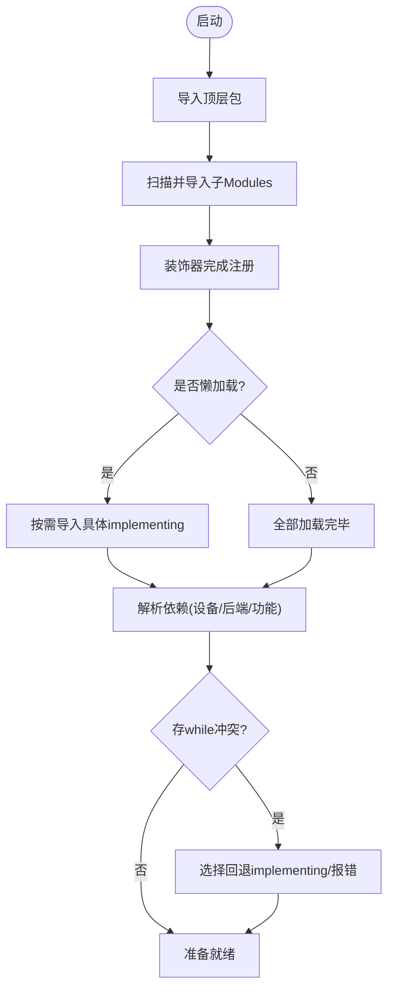
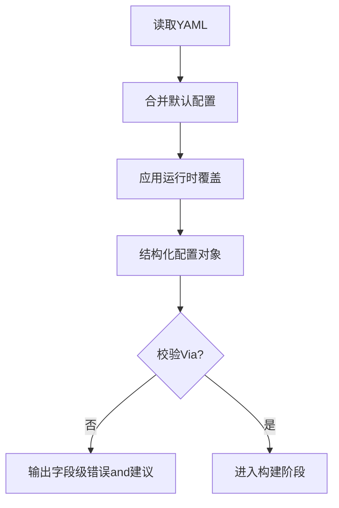
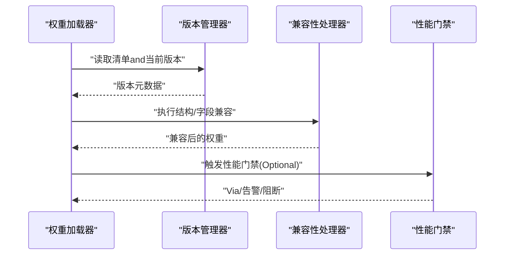
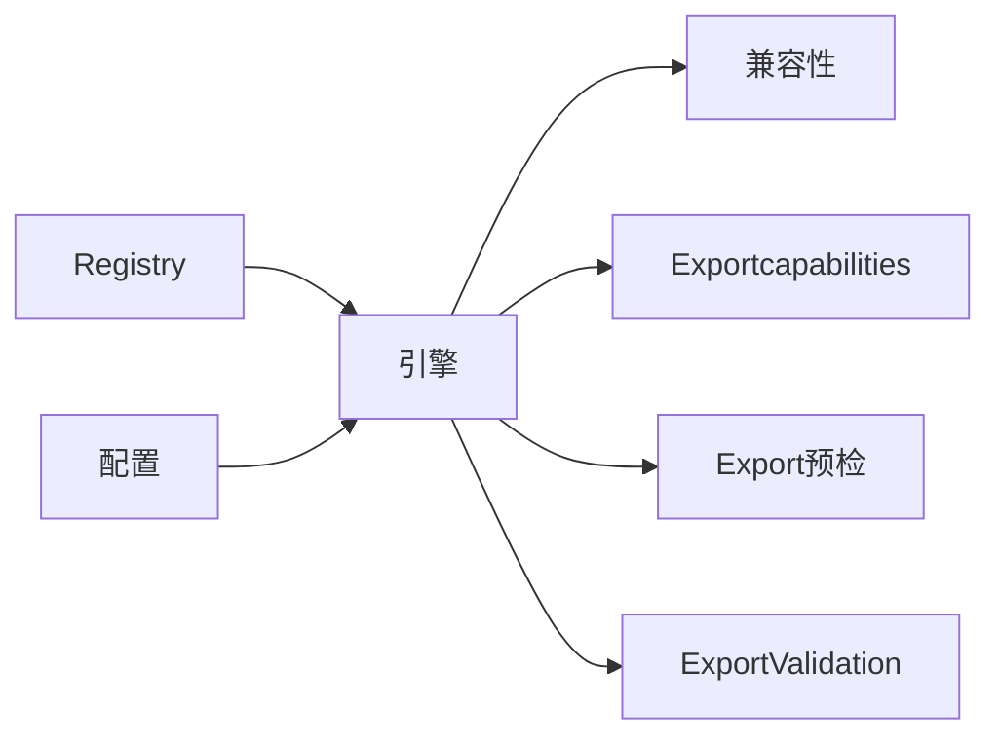

# Modules注册系统

<cite>
**Files Referenced in This Document**
- [ultralytics/nn/mixture_registry.py](file://ultralytics/nn/mixture_registry.py)
- [tests/test_mixture_model_registry.py](file://tests/test_mixture_model_registry.py)
- [tests/test_mixture_config_registry.py](file://tests/test_mixture_config_registry.py)
- [ultralytics/cfg/__init__.py](file://ultralytics/cfg/__init__.py)
- [ultralytics/engine/model.py](file://ultralytics/engine/model.py)
- [ultralytics/utils/checkpoint_compat.py](file://ultralytics/utils/checkpoint_compat.py)
- [ultralytics/utils/export_capabilities.py](file://ultralytics/utils/export_capabilities.py)
- [ultralytics/utils/export_preflight.py](file://ultralytics/utils/export_preflight.py)
- [ultralytics/utils/export_validation.py](file://ultralytics/utils/export_validation.py)
- [ultralytics/utils/routing_interpreter.py](file://ultralytics/utils/routing_interpreter.py)
- [ultralytics/utils/benchmarks.py](file://ultralytics/utils/benchmarks.py)
- [ultralytics/utils/logger.py](file://ultralytics/utils/logger.py)
- [ultralytics/utils/errors.py](file://ultralytics/utils/errors.py)
- [governance/model-registry.yaml](file://governance/model-registry.yaml)
- [governance/performance-gates.md](file://governance/performance-gates.md)
</cite>

## Table of Contents
1. [Introduction](#Introduction)
2. [Project Structure](#Project Structure)
3. [Core Components](#Core Components)
4. [Architecture Overview](#Architecture Overview)
5. [Detailed Component Analysis](#Detailed Component Analysis)
6. [Dependency Analysis](#Dependency Analysis)
7. [性能考量](#性能考量)
8. [Troubleshooting Guide](#Troubleshooting Guide)
9. [Conclusion](#Conclusion)
10. [Appendix](#Appendix)

## Introduction
本技术Documentation围绕“Modules注册系统”unfold，聚焦模型注册机制的设计andimplementing。该系统Centered on装饰器模式and工厂模式for核心，Combining配置drivers are installed（YAML）的模型构建流程，provides动态Modules加载、依赖解析、版本管理and兼容性检查、调试and性能监控capabilities，并定义Modules间通信协议and数据传递机制。Documentationtargeting不同层次读者，既provides高层Architecture Overview，也深入to关键源码路径andCalls序列，帮助开发者快速理解并扩展系统。

## Project Structure
从仓库视角看，Modules注册相关capabilities主要分布whileCentered on下位置：
- Registryand工厂：位于 nn 层，负责模型and配置的注册、查找and构建
- 配置入口：cfg 包provides统一配置加载and默认值管理
- 引擎集成：engine.model 将注册系统and模型生命周期绑定
- 兼容性andExport：utils 下provides权重兼容、Exportcapabilities矩阵、预检andValidationetc.
- 治理and规范：governance 下维护模型注册清单and性能门禁
- 测试用例：tests 覆盖Registry、配置解析、兼容性etc.关键路径

Figure Source
- [ultralytics/nn/mixture_registry.py](file://ultralytics/nn/mixture_registry.py)
- [ultralytics/cfg/__init__.py](file://ultralytics/cfg/__init__.py)
- [ultralytics/engine/model.py](file://ultralytics/engine/model.py)
- [ultralytics/utils/checkpoint_compat.py](file://ultralytics/utils/checkpoint_compat.py)
- [ultralytics/utils/export_capabilities.py](file://ultralytics/utils/export_capabilities.py)
- [ultralytics/utils/export_preflight.py](file://ultralytics/utils/export_preflight.py)
- [ultralytics/utils/export_validation.py](file://ultralytics/utils/export_validation.py)
- [governance/model-registry.yaml](file://governance/model-registry.yaml)
- [governance/performance-gates.md](file://governance/performance-gates.md)
- [tests/test_mixture_model_registry.py](file://tests/test_mixture_model_registry.py)
- [tests/test_mixture_config_registry.py](file://tests/test_mixture_config_registry.py)

Section Source
- [ultralytics/nn/mixture_registry.py](file://ultralytics/nn/mixture_registry.py)
- [ultralytics/cfg/__init__.py](file://ultralytics/cfg/__init__.py)
- [ultralytics/engine/model.py](file://ultralytics/engine/model.py)
- [ultralytics/utils/checkpoint_compat.py](file://ultralytics/utils/checkpoint_compat.py)
- [ultralytics/utils/export_capabilities.py](file://ultralytics/utils/export_capabilities.py)
- [ultralytics/utils/export_preflight.py](file://ultralytics/utils/export_preflight.py)
- [ultralytics/utils/export_validation.py](file://ultralytics/utils/export_validation.py)
- [governance/model-registry.yaml](file://governance/model-registry.yaml)
- [governance/performance-gates.md](file://governance/performance-gates.md)
- [tests/test_mixture_model_registry.py](file://tests/test_mixture_model_registry.py)
- [tests/test_mixture_config_registry.py](file://tests/test_mixture_config_registry.py)

## Core Components
- 模型Registryand工厂
  - 职责：集中维护模型类型to构造函数的映射；provides按名称或键查找and实例化capabilities；Supporting装饰器式自动注册and显式注册；while构建阶段根据配置选择具体implementing。
  - 设计要点：
    - 装饰器模式：Via装饰器将类或函数注册to全局映射，降低耦合，便于插件化扩展。
    - 工厂模式：对外暴露统一的创建接口，内部依据键名解析并返回对应实例，屏蔽具体implementing差异。
    - 配置drivers are installed：读取 YAML 中的Tasks、模型族、变体etc.字段，组合出最终键，再查表构建。
- 配置加载and校验
  - 职责：加载 YAML 配置，合并默认值，进行必要校验（必填项、取值范围、互斥约束），for后续构建provides稳定输入。
  - 设计要点：分层合并（默认→User→运行时）、严格校验and友好错误信息、可插拔校验规则。
- 引擎集成
  - 职责：while模型生命周期中CallsRegistry完成构建、加载权重、初始化Exportcapabilitiesand兼容性检查。
  - 设计要点：andTraining/Inference/Export管线解耦，ViaRegistry抽象替换具体implementing。
- 兼容性andExportcapabilities
  - 职责：处理权重格式兼容、Export目标capabilities矩阵、Export前预检andExport后Validation。
  - 设计要点：capabilities矩阵drivers are installed、预检失败快速失败、Validation闭环保障一致性。
- 治理and规范
  - 职责：维护模型注册清单、版本策略、性能门禁and回归基线。
  - 设计要点：清单即契约、门禁即质量门、变更需评审。

Section Source
- [ultralytics/nn/mixture_registry.py](file://ultralytics/nn/mixture_registry.py)
- [ultralytics/cfg/__init__.py](file://ultralytics/cfg/__init__.py)
- [ultralytics/engine/model.py](file://ultralytics/engine/model.py)
- [ultralytics/utils/checkpoint_compat.py](file://ultralytics/utils/checkpoint_compat.py)
- [ultralytics/utils/export_capabilities.py](file://ultralytics/utils/export_capabilities.py)
- [ultralytics/utils/export_preflight.py](file://ultralytics/utils/export_preflight.py)
- [ultralytics/utils/export_validation.py](file://ultralytics/utils/export_validation.py)
- [governance/model-registry.yaml](file://governance/model-registry.yaml)
- [governance/performance-gates.md](file://governance/performance-gates.md)

## Architecture Overview
下图展示从配置to模型实例化的端to端流程，Centered onandRegistry、工厂、配置、引擎andExport/兼容Modules之间的交互。

Figure Source
- [ultralytics/engine/model.py](file://ultralytics/engine/model.py)
- [ultralytics/cfg/__init__.py](file://ultralytics/cfg/__init__.py)
- [ultralytics/nn/mixture_registry.py](file://ultralytics/nn/mixture_registry.py)
- [ultralytics/utils/checkpoint_compat.py](file://ultralytics/utils/checkpoint_compat.py)
- [ultralytics/utils/export_capabilities.py](file://ultralytics/utils/export_capabilities.py)
- [ultralytics/utils/export_preflight.py](file://ultralytics/utils/export_preflight.py)
- [ultralytics/utils/export_validation.py](file://ultralytics/utils/export_validation.py)

## Detailed Component Analysis

### 模型Registryand工厂（装饰器+工厂）
- 设计原理
  - 装饰器：whileModules导入时自动将目标类/函数注册to全局映射，避免手动维护Registry。
  - 工厂：对外provides create/find 接口，内部根据键名解析具体implementing，屏蔽多态细节。
  - 配置drivers are installed：YAML 中的Tasks、模型族、变体etc.字段组合成键，再由工厂定位implementing。
- 关键流程
  - 启动期：扫描并导入各子Modules，触发装饰器完成注册。
  - 运行期：根据配置生成键，查表获取构造函数，执行构建。
  - 扩展点：新增模型只需添加装饰器and最小配置即可接入。
- 复杂度and性能
  - Registry查找for O(1)，构建成本取决于具体模型。
  - 建议对热路径Uses缓存（such as已构建实例或轻量级原型）。
- 错误处理
  - 未找to键：抛出明确异常，附带可用键列表。
  - 重复注册：记录警告或拒绝覆盖，保证单例语义。
- 最佳实践
  - 装饰器仅用于注册，不承载业务逻辑。
  - 工厂方法保持幂etc.and线程安全。
  - 配置键命名遵循“Tasks.模型族.变体”的分层约定。

Figure Source
- [ultralytics/nn/mixture_registry.py](file://ultralytics/nn/mixture_registry.py)
- [ultralytics/cfg/__init__.py](file://ultralytics/cfg/__init__.py)
- [ultralytics/engine/model.py](file://ultralytics/engine/model.py)

Section Source
- [ultralytics/nn/mixture_registry.py](file://ultralytics/nn/mixture_registry.py)
- [ultralytics/cfg/__init__.py](file://ultralytics/cfg/__init__.py)
- [ultralytics/engine/model.py](file://ultralytics/engine/model.py)

### 动态Modules加载and依赖解析
- 启动流程
  - 引导程序导入顶层包，触发子Modules加载。
  - 子Moduleswhile导入时执行装饰器注册逻辑，完成自发现。
  - Optional：按需懒加载（仅while首次Uses时导入具体implementing）。
- 依赖解析
  - 基于配置声明依赖（such as后端、算子、数据集格式）。
  - 解析顺序：先基础依赖（设备、后端），再功能依赖（Export目标、Tracking器etc.）。
  - 冲突检测：同一依赖的多版本或互斥implementing给出明确Tips。
- 容错and回退
  - 缺失依赖：降级to通用implementing或抛出清晰错误。
  - 版本不兼容：根据兼容性矩阵选择适配层或拒绝运行。

Section Source
- [ultralytics/nn/mixture_registry.py](file://ultralytics/nn/mixture_registry.py)
- [ultralytics/engine/model.py](file://ultralytics/engine/model.py)

### 配置drivers are installed的模型构建（YAML 解析and校验）
- 解析流程
  - 读取 YAML → 合并默认配置 → 应用运行时覆盖 → 结构化对象。
- 校验规则
  - 必填字段、枚举取值、数值范围、互斥/依赖关系。
  - 自定义校验钩子：允许扩展特定Tasks的校验逻辑。
- 错误反馈
  - 精确to字段路径的错误消息，附带修复建议。
- ExamplesRefer to
  - 参见测试中对配置注册and解析的用例，了解Typical Usageand边界条件。

Section Source
- [ultralytics/cfg/__init__.py](file://ultralytics/cfg/__init__.py)
- [tests/test_mixture_config_registry.py](file://tests/test_mixture_config_registry.py)

### Modules版本管理and兼容性检查
- 版本策略
  - 模型清单（model-registry.yaml）维护版本、别名、弃用状态andMigration指引。
  - 权重格式and模型结构版本分离，分别进行兼容处理。
- 兼容性检查
  - 加载权重时进行结构对齐、字段映射and缺失补齐。
  - Export前检查capabilities矩阵，确保目标后端Supporting所需特性。
- 门禁and回归
  - performance-gates.md 定义性能阈值and回归判定，CI 中强制执行。

Figure Source
- [governance/model-registry.yaml](file://governance/model-registry.yaml)
- [ultralytics/utils/checkpoint_compat.py](file://ultralytics/utils/checkpoint_compat.py)
- [governance/performance-gates.md](file://governance/performance-gates.md)

Section Source
- [governance/model-registry.yaml](file://governance/model-registry.yaml)
- [ultralytics/utils/checkpoint_compat.py](file://ultralytics/utils/checkpoint_compat.py)
- [governance/performance-gates.md](file://governance/performance-gates.md)

### 自定义Modules注册开发指南and最佳实践
- 步骤
  - while目标Modules中定义类/函数，并Uses注册装饰器将其注册toRegistry。
  - while YAML 配置中声明对应的键（Tasks.模型族.变体）。
  - 编写单元测试覆盖注册、构建and基本行for。
- 最佳实践
  - 单一职责：注册装饰器只负责注册，不包含业务逻辑。
  - 幂etc.性：重复注册应给出明确Tips而非静默覆盖。
  - 可观测性：while构建and关键路径埋点Logging，便于追踪。
  - 向后兼容：新增字段需有默认值andMigration策略。
- Refer to用例
  - 查看Registry相关测试，学习常见用法and异常场景。

Section Source
- [ultralytics/nn/mixture_registry.py](file://ultralytics/nn/mixture_registry.py)
- [tests/test_mixture_model_registry.py](file://tests/test_mixture_model_registry.py)

### Modules调试工具and性能监控
- 路由Explainer
  - 用于Visualization/诊断路由决策and激活分布，辅助定位热点andbottlenecks。
- 基准and计时
  - provides轻量基准工具，统计关键路径耗时and吞吐。
- Loggingand事件
  - 统一Loggingand事件上报，便于聚合分析and告警。
- Exportcapabilitiesand预检
  - Exportcapabilities矩阵and预检工具可while早期发现不兼容问题。

Section Source
- [ultralytics/utils/routing_interpreter.py](file://ultralytics/utils/routing_interpreter.py)
- [ultralytics/utils/benchmarks.py](file://ultralytics/utils/benchmarks.py)
- [ultralytics/utils/logger.py](file://ultralytics/utils/logger.py)
- [ultralytics/utils/export_capabilities.py](file://ultralytics/utils/export_capabilities.py)
- [ultralytics/utils/export_preflight.py](file://ultralytics/utils/export_preflight.py)

### Modules间通信协议and数据传递机制
- 协议要点
  - 输入/输出采用结构化对象（such as张量、检测结果、元数据字典），避免裸字符串。
  - 事件总线：Via统一事件通道传递Training/Inference/Export过程中的关键事件。
  - 错误传播：异常携带上下文（Modules名、阶段、输入摘要），便于定位。
- 数据流
  - 配置 → 构建 → 权重加载 → Inference/Training → Export/Evaluation，每步产出可审计的中间产物。
- 可观测性
  - 关键Metrics（延迟、吞吐、内存、GPU利用率）ViaLogging/回调上报。

Section Source
- [ultralytics/engine/model.py](file://ultralytics/engine/model.py)
- [ultralytics/utils/logger.py](file://ultralytics/utils/logger.py)
- [ultralytics/utils/events.py](file://ultralytics/utils/events.py)

## Dependency Analysis
- Cohesion and Coupling
  - Registryand工厂高度内聚，对外暴露稳定接口；and引擎Via配置and键名松耦合。
  - 兼容andExportModules作for横切关注点，被引擎按需Calls。
- External Dependencies
  - YAML 解析、设备/后端抽象、Loggingand事件框架。
- 循环依赖
  - Via延迟导入and接口抽象避免循环引用。
- 风险点
  - 全局Registry的并发访问需加锁或无锁设计。
  - 配置键命名不一致会导致运行时查找失败。

Figure Source
- [ultralytics/nn/mixture_registry.py](file://ultralytics/nn/mixture_registry.py)
- [ultralytics/engine/model.py](file://ultralytics/engine/model.py)
- [ultralytics/utils/checkpoint_compat.py](file://ultralytics/utils/checkpoint_compat.py)
- [ultralytics/utils/export_capabilities.py](file://ultralytics/utils/export_capabilities.py)
- [ultralytics/utils/export_preflight.py](file://ultralytics/utils/export_preflight.py)
- [ultralytics/utils/export_validation.py](file://ultralytics/utils/export_validation.py)

Section Source
- [ultralytics/nn/mixture_registry.py](file://ultralytics/nn/mixture_registry.py)
- [ultralytics/engine/model.py](file://ultralytics/engine/model.py)
- [ultralytics/utils/checkpoint_compat.py](file://ultralytics/utils/checkpoint_compat.py)
- [ultralytics/utils/export_capabilities.py](file://ultralytics/utils/export_capabilities.py)
- [ultralytics/utils/export_preflight.py](file://ultralytics/utils/export_preflight.py)
- [ultralytics/utils/export_validation.py](file://ultralytics/utils/export_validation.py)

## 性能考量
- 注册and查找
  - Registry查找for O(1)，建议while进程启动时完成全量注册，避免运行时反射开销。
- 构建and缓存
  - 对频繁Uses的模型实例或原型进行缓存，减少重复构建。
- I/O and权重加载
  - Uses异步/并行 I/O 提升大权重加载效率；必要时分块加载。
- ExportandValidation
  - Exportcapabilities矩阵预计算，避免重复判断；预检失败尽早返回。
- 监控andOptimization
  - 利用基准工具andLogging采集关键Metrics，识别热点路径并进行针对性Optimization。

[本节for通用指导，无需列出具体文件来源]

## Troubleshooting Guide
- 常见问题
  - 找不to模型键：检查 YAML 键名andRegistry是否一致，确认Modules已导入。
  - 权重不兼容：查看兼容性处理Logging，确认权重版本and模型结构匹配。
  - Export Failure：核对Exportcapabilities矩阵and预检结果，确认后端and设备Supporting。
- 定位手段
  - 启用详细Loggingand事件追踪，定位失败阶段and输入摘要。
  - Uses路由Explainerand基准工具分析异常路径。
- 恢复策略
  - 回退to已知稳定版本或默认配置。
  - Uses兼容性处理器进行字段映射and补齐。

Section Source
- [ultralytics/utils/errors.py](file://ultralytics/utils/errors.py)
- [ultralytics/utils/logger.py](file://ultralytics/utils/logger.py)
- [ultralytics/utils/checkpoint_compat.py](file://ultralytics/utils/checkpoint_compat.py)
- [ultralytics/utils/export_preflight.py](file://ultralytics/utils/export_preflight.py)

## Conclusion
本Modules注册系统Centered on装饰器and工厂模式for基础，Combining配置drivers are installedand治理规范，implementing了可扩展、可观测、可演进的模型构建and生命周期管理。Via清晰的键空间、严格的校验and兼容性处理、完善的调试and性能工具链，系统while工程实践中具备高可用性and高可维护性。建议while新Modules开发中遵循既定规范，持续完善清单and门禁，保障整体质量and稳定性。

[本节for总结性内容，无需列出具体文件来源]

## Appendix
- 术语
  - Registry：维护键toimplementing的映射的全局表
  - 工厂：根据键创建对象的Unified Interface
  - 配置drivers are installed：Centered on YAML 配置控制构建流程
  - 兼容性：权重and模型结构的版本适配
  - 性能门禁：基于阈值的回归检测
- Refer to用例
  - Registryand配置解析的测试用例可作for扩展时的样板。

Section Source
- [tests/test_mixture_model_registry.py](file://tests/test_mixture_model_registry.py)
- [tests/test_mixture_config_registry.py](file://tests/test_mixture_config_registry.py)