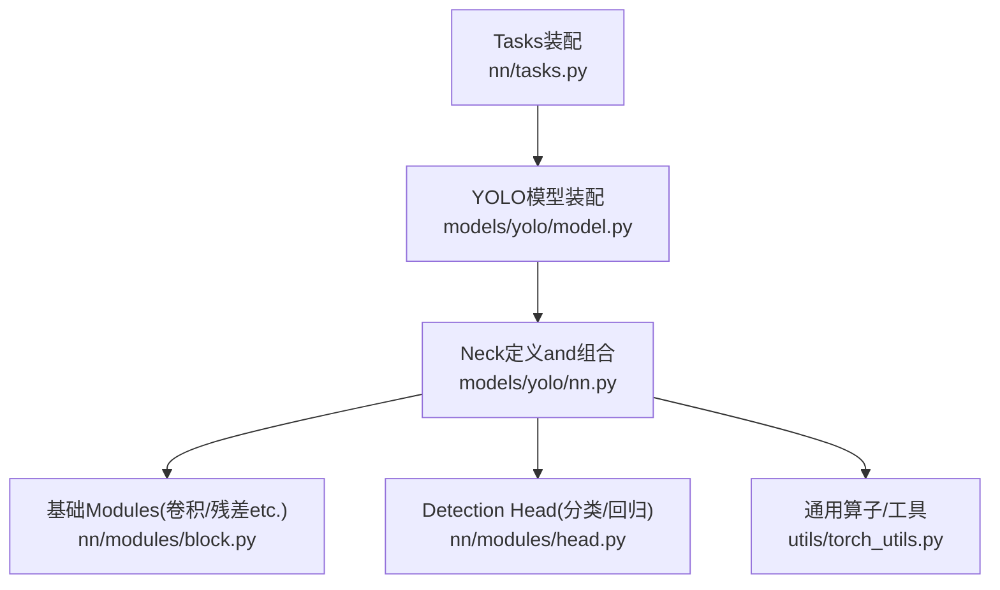
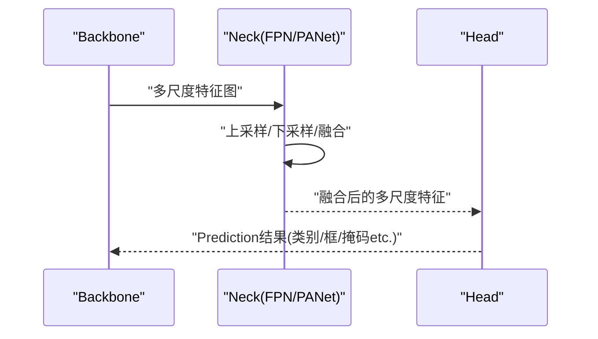
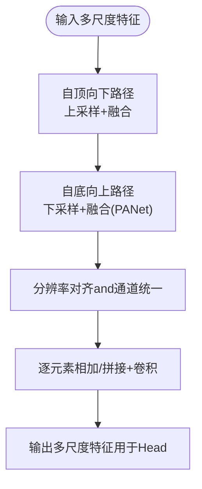
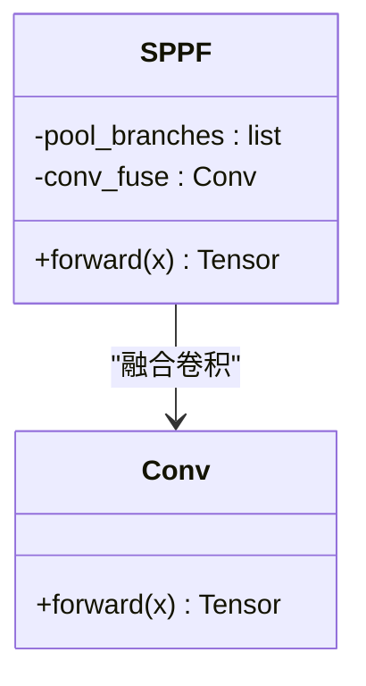
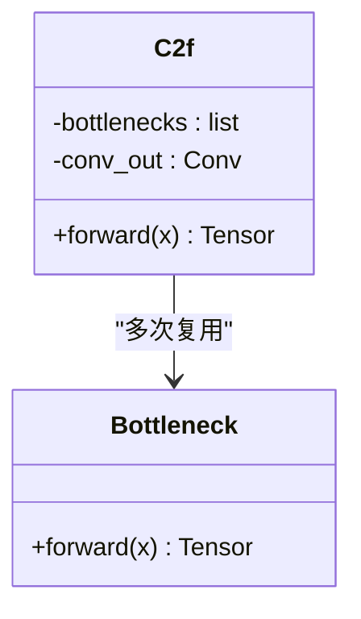
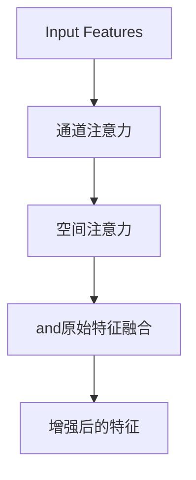
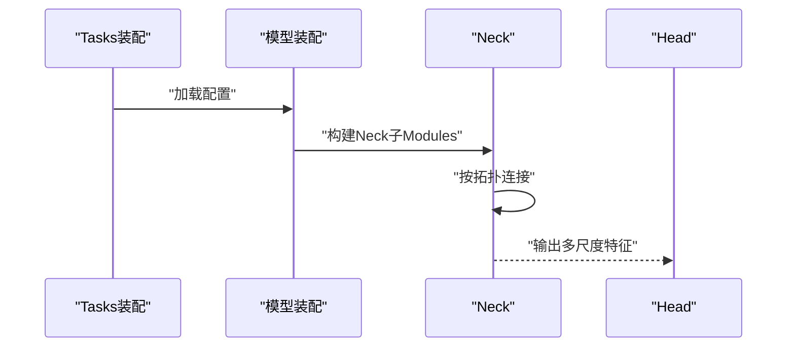
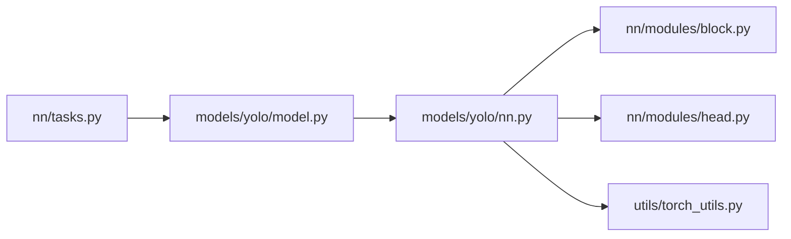

# Neck NetworkModules

<cite>
**Files Referenced in This Document**
- [models/yolo/nn.py](file://ultralytics/models/yolo/nn.py)
- [models/yolo/model.py](file://ultralytics/models/yolo/model.py)
- [nn/modules/block.py](file://ultralytics/nn/modules/block.py)
- [nn/modules/head.py](file://ultralytics/nn/modules/head.py)
- [nn/tasks.py](file://ultralytics/nn/tasks.py)
- [utils/torch_utils.py](file://ultralytics/utils/torch_utils.py)
</cite>

## Table of Contents
1. [Introduction](#Introduction)
2. [Project Structure](#Project Structure)
3. [Core Components](#Core Components)
4. [Architecture Overview](#Architecture Overview)
5. [Detailed Component Analysis](#Detailed Component Analysis)
6. [Dependency Analysis](#Dependency Analysis)
7. [性能考量](#性能考量)
8. [Troubleshooting Guide](#Troubleshooting Guide)
9. [Conclusion](#Conclusion)
10. [Appendix](#Appendix)

## Introduction
本文件聚焦于YOLO系列中的“Neck Network（Neck）”Modules，系统阐述多尺度特征融合机制andimplementing细节，涵盖FPN、PANet的结构设计；深入解析SPPF的并行池化策略；说明C2fModules的特征融合算法andGradient流Optimization；介绍Attention Mechanismwhile特征融合中的应用；并provides配置选项、性能调优建议、特征图Visualization方法and调试技巧。Documentation力求兼顾工程落地and理论理解，帮助读者快速定位关键代码路径并进行有效Optimization。

## Project Structure
本项目中，Neck Network相关implementing主要分布whileCentered on下位置：
- 模型构建andTasks装配：[nn/tasks.py](file://ultralytics/nn/tasks.py)、[models/yolo/model.py](file://ultralytics/models/yolo/model.py)
- Neckand基础Modules定义：[models/yolo/nn.py](file://ultralytics/models/yolo/nn.py)、[nn/modules/block.py](file://ultralytics/nn/modules/block.py)
- Detection Headand输出：[nn/modules/head.py](file://ultralytics/nn/modules/head.py)
- 通用算子and工具：[utils/torch_utils.py](file://ultralytics/utils/torch_utils.py)

Figure Source
- [nn/tasks.py](file://ultralytics/nn/tasks.py)
- [models/yolo/model.py](file://ultralytics/models/yolo/model.py)
- [models/yolo/nn.py](file://ultralytics/models/yolo/nn.py)
- [nn/modules/block.py](file://ultralytics/nn/modules/block.py)
- [nn/modules/head.py](file://ultralytics/nn/modules/head.py)
- [utils/torch_utils.py](file://ultralytics/utils/torch_utils.py)

Section Source
- [nn/tasks.py](file://ultralytics/nn/tasks.py)
- [models/yolo/model.py](file://ultralytics/models/yolo/model.py)
- [models/yolo/nn.py](file://ultralytics/models/yolo/nn.py)
- [nn/modules/block.py](file://ultralytics/nn/modules/block.py)
- [nn/modules/head.py](file://ultralytics/nn/modules/head.py)
- [utils/torch_utils.py](file://ultralytics/utils/torch_utils.py)

## Core Components
本节概述Neck的核心构件and其职责：
- 多尺度特征融合主干：负责将Backbone输出的不同层级特征进行上采样、下采样and拼接/相加，形成具备强语义and细粒度信息的统一表示。
- SPPF（Spatial Pyramid Pooling Fast）：Via并行的多尺度池化分支聚合上下文信息，增强大目标and复杂场景下的表征capabilities。
- C2fModules：基于密集连接and多次融合的轻量级bottlenecks块，提升特征表达capabilities并OptimizationGradient流。
- Attention Mechanism：while融合前后引入通道/空间注意力，动态重标定特征响应，抑制背景噪声。
- PANet/FPN融合路径：自顶向下（Top-down）and自底向上（Bottom-up）双向融合，强化跨尺度交互。

Section Source
- [models/yolo/nn.py](file://ultralytics/models/yolo/nn.py)
- [nn/modules/block.py](file://ultralytics/nn/modules/block.py)
- [nn/modules/head.py](file://ultralytics/nn/modules/head.py)

## Architecture Overview
下图展示了Neckwhile整体检测流程中的位置and数据流向：Backboneprovides多层特征，Neck执行FPN/PANet式融合，最终送入Head生成Prediction。

Figure Source
- [models/yolo/model.py](file://ultralytics/models/yolo/model.py)
- [models/yolo/nn.py](file://ultralytics/models/yolo/nn.py)
- [nn/modules/head.py](file://ultralytics/nn/modules/head.py)

## Detailed Component Analysis

### FPNandPANet的多尺度特征融合
- 设计要点
  - FPN采用自顶向下的路径，将高层语义特征上采样并and浅层细节特征对齐融合，增强小Object Detection。
  - PANetwhileFPN基础上增加自底向上的路径，使浅层信息能再次影响高层表示，进一步改善跨尺度交互。
- implementing思路
  - Uses可学习的上采样或双线性插值对齐分辨率。
  - 融合方式包括逐元素相加and通道拼接后卷积，具体取决于配置andTasks需求。
  - 各层融合后通常经过若干卷积层Centered on统一通道数and感受野。
- 复杂度and收益
  - 时间复杂度随层数线性增长，但显著提升了mAP尤其是小目标Metrics。
  - 计算开销可Via减少融合层数或降低通道数进行权衡。

Figure Source
- [models/yolo/nn.py](file://ultralytics/models/yolo/nn.py)
- [nn/modules/block.py](file://ultralytics/nn/modules/block.py)

Section Source
- [models/yolo/nn.py](file://ultralytics/models/yolo/nn.py)
- [nn/modules/block.py](file://ultralytics/nn/modules/block.py)

### SPPF（Spatial Pyramid Pooling Fast）并行池化策略
- 设计动机
  - 传统SPPUses多个不同尺度的最大/平均池化分支，计算冗余较大。
  - SPPFVia串行堆叠相同核大小的池化操作近似多尺度效果，减少参数and计算量。
- 并行策略
  - 多个池化分支并行执行，随后while通道维度拼接，再经卷积融合。
  - 若采用“Fast”变体，则Via重复池化and跳跃连接近似多尺度感受野，提高吞吐。
- Applicable Scenarios
  - 对大目标and复杂背景鲁棒性要求较高的检测Tasks。
  - 资源受限环境下需要平衡精度and速度的部署场景。

Figure Source
- [models/yolo/nn.py](file://ultralytics/models/yolo/nn.py)
- [nn/modules/block.py](file://ultralytics/nn/modules/block.py)

Section Source
- [models/yolo/nn.py](file://ultralytics/models/yolo/nn.py)
- [nn/modules/block.py](file://ultralytics/nn/modules/block.py)

### C2fModules的特征融合andGradient流Optimization
- 结构特点
  - 基于密集连接的bottlenecks结构，内部包含多次残差式融合and卷积变换。
  - Via短路and长路Combining，缓解深层网络的Gradient消失问题，加速收敛。
- 融合算法
  - while每层内对特征进行切分、卷积变换后再拼接，最后经卷积整合。
  - Supporting多种融合策略（相加/拼接），根据Tasksand算力选择。
- Gradient流Optimization
  - 密集连接and残差路径forGradientprovides直达通路，稳定Training。
  - 归一化and激活函数顺序对稳定性有重要影响。

Figure Source
- [models/yolo/nn.py](file://ultralytics/models/yolo/nn.py)
- [nn/modules/block.py](file://ultralytics/nn/modules/block.py)

Section Source
- [models/yolo/nn.py](file://ultralytics/models/yolo/nn.py)
- [nn/modules/block.py](file://ultralytics/nn/modules/block.py)

### Attention Mechanismwhile特征融合中的应用
- 通道注意力
  - 对通道维度进行全局统计and门控，自适应重标定通道权重，突出判别性特征。
- 空间注意力
  - while空间维度生成注意力图，抑制无关区域，增强目标区域响应。
- 融合位置
  - 可whileFPN/PANet的融合前后插入注意力Modules，提升跨尺度交互质量。
  - 也可置于SPPF之后，进一步聚合上下文。

Figure Source
- [models/yolo/nn.py](file://ultralytics/models/yolo/nn.py)
- [nn/modules/block.py](file://ultralytics/nn/modules/block.py)

Section Source
- [models/yolo/nn.py](file://ultralytics/models/yolo/nn.py)
- [nn/modules/block.py](file://ultralytics/nn/modules/block.py)

### Neck配置and组装
- 配置项
  - 融合路径：是否启用PANet的自底向上路径。
  - 融合方式：相加或拼接，Centered onand后续卷积通道数。
  - SPPF分支数量and核大小，控制感受野and计算开销。
  - C2f深度and宽度，调节模型容量and速度。
  - 注意力类型and插入位置，平衡精度and延迟。
- 组装流程
  - 由Tasks装配器读取配置，实例化Neck各子Modules，并按拓扑连接。
  - Head接收Neck输出，完成分类and回归分支。

Figure Source
- [nn/tasks.py](file://ultralytics/nn/tasks.py)
- [models/yolo/model.py](file://ultralytics/models/yolo/model.py)
- [models/yolo/nn.py](file://ultralytics/models/yolo/nn.py)
- [nn/modules/head.py](file://ultralytics/nn/modules/head.py)

Section Source
- [nn/tasks.py](file://ultralytics/nn/tasks.py)
- [models/yolo/model.py](file://ultralytics/models/yolo/model.py)
- [models/yolo/nn.py](file://ultralytics/models/yolo/nn.py)
- [nn/modules/head.py](file://ultralytics/nn/modules/head.py)

## Dependency Analysis
NeckModulesand周边组件的依赖关系such as下：
- Tasks装配and模型装配负责从配置to实例化的映射。
- Neck依赖基础Modules（卷积、归一化、激活etc.）and工具函数（such as张量操作）。
- Head依赖Neck输出的多尺度特征进行Prediction。

Figure Source
- [nn/tasks.py](file://ultralytics/nn/tasks.py)
- [models/yolo/model.py](file://ultralytics/models/yolo/model.py)
- [models/yolo/nn.py](file://ultralytics/models/yolo/nn.py)
- [nn/modules/block.py](file://ultralytics/nn/modules/block.py)
- [nn/modules/head.py](file://ultralytics/nn/modules/head.py)
- [utils/torch_utils.py](file://ultralytics/utils/torch_utils.py)

Section Source
- [nn/tasks.py](file://ultralytics/nn/tasks.py)
- [models/yolo/model.py](file://ultralytics/models/yolo/model.py)
- [models/yolo/nn.py](file://ultralytics/models/yolo/nn.py)
- [nn/modules/block.py](file://ultralytics/nn/modules/block.py)
- [nn/modules/head.py](file://ultralytics/nn/modules/head.py)
- [utils/torch_utils.py](file://ultralytics/utils/torch_utils.py)

## 性能考量
- 计算and内存
  - 减少融合层数and通道数Centered on降低FLOPsand显存占用。
  - Prefer相加融合而非拼接，Centered on减少通道膨胀带来的计算压力。
- 并行and吞吐
  - SPPF并行分支可利用GPU并发特性，注意避免过度分支导致调度开销。
  - Set appropriately批大小and图像尺寸，匹配硬件峰值带宽。
- 数值稳定性
  - 归一化and激活的顺序对Training稳定性至关重要，建议遵循标准顺序。
  - Mixture精度Training时关注Gradient缩放and溢出风险。
- 部署Optimization
  - Export前进行算子融合and常量折叠，减少运行时开销。
  - 针对边缘设备裁剪Neck深度and宽度，保持精度-速度平衡。

## Troubleshooting Guide
- 常见问题
  - 形状不匹配：上采样/下采样后分辨率不一致，检查对齐策略and步幅。
  - 通道不一致：拼接后未进行通道统一卷积，导致后续Modules报错。
  - Gradient异常：深层网络出现NaN/Inf，检查归一化andLearning Rate设置。
- 诊断方法
  - 打印中间特征图的形状and统计量，确认融合路径正确。
  - 逐步禁用注意力或SPPF分支，定位性能退化来源。
  - UsesVisualization工具观察特征图响应，Validation注意力是否聚焦目标区域。
- Refer to工具
  - 通用张量操作and调试工具位于工具库中，便于快速定位问题。

Section Source
- [utils/torch_utils.py](file://ultralytics/utils/torch_utils.py)

## Conclusion
Neck作for多尺度特征融合的关键环节，ViaFPN/PANet的双向融合、SPPF的并行池化andC2f的高效融合，显著提升了检测性能。合理配置and调优可while精度and速度之间取得良好平衡。借助Visualizationand调试技巧，能够快速定位问题并持续Optimization。

## Appendix
- 特征图Visualization方法
  - 提取Neck各层输出，进行通道维度的最大响应Visualization。
  - 对比加入注意力前后的特征图差异，Evaluation注意力有效性。
- 调试技巧
  - Uses最小复现脚本隔离问题，逐步添加Modules定位根因。
  - 记录关键超参and性能Metrics，建立实验追踪表。